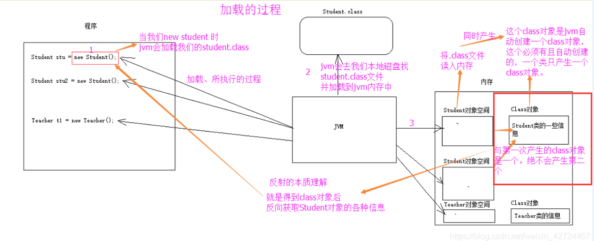
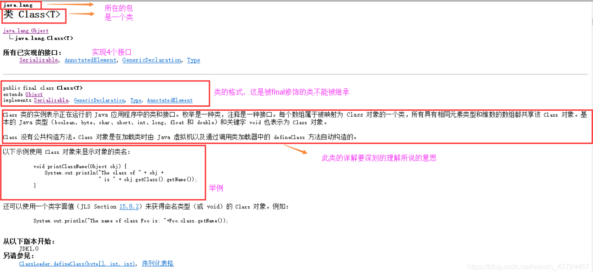
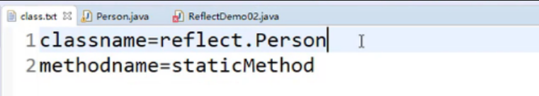
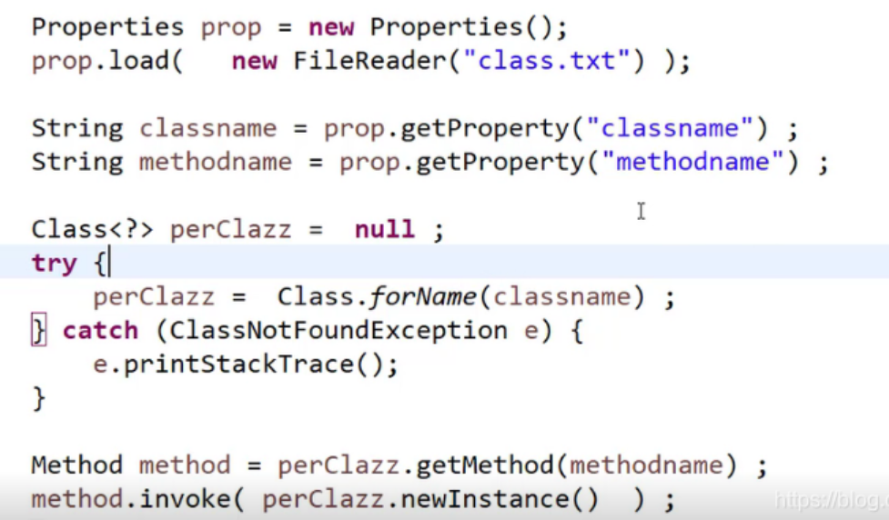
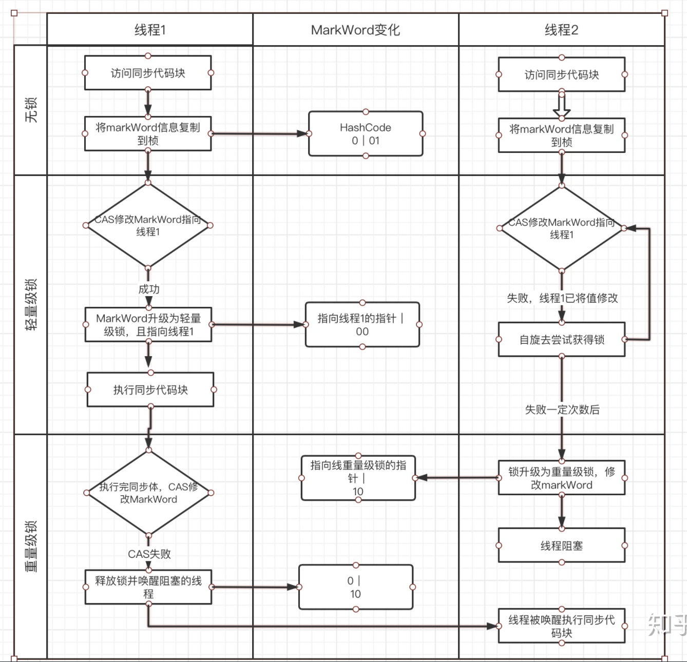
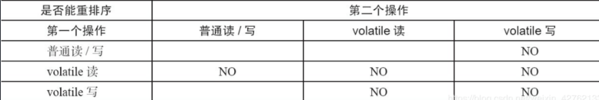
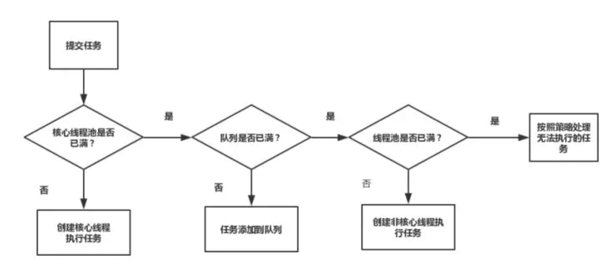

Java基础

# 面试题版

## JVM

### [Q：java的弱引用，什么情况下会用到弱引用?]

答：java里定义了四种引用对象，不同的引用对象在被GC扫描的时候，会有不同的处理（强软弱虚）
强引用：强引用是我们用的，比如new Object()的时候。只要强引用还在，被引用的对象就永远不会被回收。
软引用：软引用引用对象还在的话，只要空间足够（JVM抛出OutOfMemoryError之前），垃圾回收器就不会回收它；如果空间不够的话，就会回收这些对象；
弱引用：弱引用的声明周期更短，一旦垃圾回收器发现了弱引用对象，不管内存空间是不是充足的，都会回收弱引用的对象。
虚引用：一个对象是不是虚引用不会对生存时间构成影响，我们是不能通过虚引用获取实际对象的。虚引用的唯一用处就是在对象被GC回收的时候可以收到系统通知。

弱引用可以解决强引用对象之间的耦合关系。常用在集合中，比如哈希表，里面存放键值对，只要哈希表还存在，键值对的对象就不会被回收。如果时间越长，哈希表中包含越多键值对就可能消耗虚拟机中全部的内存。

四种引用可以与引用队列(ReferenceQueue)联合，我们可以通过这个队列的poll()来检查我们关心的对象是否被回收了

### [Q：javaGC？]

垃圾回收的时候需要关注三个问题：**回收哪些内存？什么时候回收？如何回收？**（三种回收算法）

#### 第一关注的问题：回收哪些内存？（哪块内存空间？对象、类、常量判断存活？）

主要是堆的回收，还有方法区回收；堆主要回收的是对象，要判断一个对象是否存活，可以用引用计数法和可达性分析算法。引用计数法会导致循环引用不推荐。可达性分析算法就是沿着GC root，标记可以到达的对象，不能到达的对象就可以被回收，可以回收不代表马上回收，我们可以调用Object的finalize方法救对象一次；       

方法区主要回收废弃常量和无用的类，只要是没有任何引用关联到这个常量，这个常量就是废弃常量。而要判断类是不是无用的，需要满足3个条件：1.类的所有实例都被回收了；2.类的class对象没有被引用到，没有地方可以有反射访问这个对象；3.类的类加载器被回收了，满足以上3个条件就可以判断一个类是无用的类。

#### 第二个关注的问题：什么时候回收？

主要分新生代回收（Minor GC）和Full GC。

新生代内存按8：1：1的比例分为Eden、survivor from和survivor to区，大部分新生对象都是在Eden区分配内存的，在垃圾回收的时候，先将eden区存活的对象复制到survivor from区，然后清空eden区；如果当survivor from区也满了，就会将eden区和survivor from区存活对象复制到survivor to区；然后交换survivor from和survivor to的角色，保持survivor from区是空的。如果当eden区和survivor from区空间不够放存活对象的时候，可以通过担保机制把对象直接存放到老年代；如果老年代也满了就会触发full gc。

full gc触发条件有这个：老年代被写满、永久代被写满和调用System.gc方法

#### 第三个关注问题：如何回收的问题？

这里用到三种垃圾回收算法，标记清除算法、复制算法、标记整理算法，还有一个分代收集思想；

算法的实现体现在下面几个垃圾回收器：年轻代回收的Serial、ParNew、Parallel Scavenge和老年代回收的Serial Old、Pallelel Old、CMS，混合回收的G1垃圾回收器；


_____________________________________________________________________
## Java集合

### [Q：Comparable和Comparator的区别]

答：都是接口，都可以实现集合中元素的比较
1）.Comparable是在java.lang包下，而Comparator是在java.util包下
2）.Comparable主要是在类上的实现，需要实现compareTo方法。可以认为是为类添加了一个可比较大小可排序的属性，例如String、Integer等类都实现了该接口，可以比较两对象的大小。相当于类的内比较器。
3）.Comparator相当于类的外比较器，需要实现compara方法。经常用在当类不具备可比较的属性，也就是没有实现Comparable接口   或   当对象实现了Comparable接口，但是比较的方式不是我们想要的。那么我们可以实现Comparator接口，而不需要改变类的代码。一般用在创建集合的时候，传入一个比较器，或Arrays.sort（）方法传入一个比较器

_____________________________________________________________________
## JUC

### [Q：说一说**线程同步**的方式]

Java主要通过**加锁**的方式实现线程同步，而锁有两类，分别是synchronized和Lock。
synchronized可以加在三个不同的位置，对应三种不同的使用方式，这三种方式的区别是锁对象不同：
加在普通方法上，则锁是当前的实例（this）。
加在静态方法上，则锁是当前类的Class对象。
加在代码块上，则需要在关键字后面的小括号里，显式指定一个对象作为锁对象。
不同的锁对象，意味着不同的锁粒度，所以我们不应该无脑地将它加在方法前了事，尽管通常这可以解决问题。而是应该根据要锁定的范围，准确的选择锁对象，从而准确地确定锁的粒度，降低锁带来的性能开销。
synchronized是比较早期的API，在设计之初没有考虑到超时机制、非阻塞形式，以及多个条件变量。若想通过升级的方式让synchronized支持这些相对复杂的功能，则需要大改它的语法结构，不利于兼容旧代码。因此，JDK的开发团队在1.5引入了Lock，并通过Lock支持了上述的功能。Lock支持的功能包括：支持响应中断、支持超时机制、支持以非阻塞的方式获取锁、支持多个条件变量（阻塞队列）。

加分回答
synchronized采用“CAS+Mark Word”实现，为了性能的考虑，并通过锁升级机制降低锁的开销。在并发环境中，synchronized会随着多线程竞争的加剧，按照如下步骤逐步升级：无锁、偏向锁、轻量级锁、重量级锁。
Lock则采用“CAS+volatile”实现，其实现的核心是AQS。AQS是线程同步器，是一个线程同步的基础框架，它基于模板方法模式。在具体的Lock实例中，锁的实现是通过继承AQS来实现的，并且可以根据锁的使用场景，派生出公平锁、不公平锁、读锁、写锁等具体的实现。

延伸阅读
**想要保证线程安全，不止线程同步一种手段，还包含如下常见办法**：
原子类：可以用原子方式更新一个变量，即在变量未被其他线程修改时才出发更新，否则会引发失败。
volatile：volatile是一个轻量级的锁，它通过保证内存可见性的办法来实现线程安全。
并发工具：还有很多并发工具类，一样可以保证线程安全，如Semaphore、CountDownLatch、CyclicBarrier。

### [Q：Java线程通信方式]

* 同步：锁，如synchronized，AQS，Lock
* wait/notify
* 管道：与I/O流相关，读线程在管道没有内容的时候调用管道的read()方法会进入阻塞状态，等待写线程向管道中写入数据。
* Thread#join()
* volatile：保证可见性，可以让线程之间进行通信。

------

# 基础知识版

## 面向对象

### 1.面向对象和面向过程对比

面向过程关注的是实现过程

面向对象关注的是对象，把实现过程和细节封装在对象中

### 2.面向对象的三大特性：

封装：隐藏类的实现细节，只对外公开访问方法

继承：子类继承父类的属性和方法，子类可以对父类的进行**复用**和**扩展**，减少冗余代码

多态：对同一个类型的对象执行同一个方法可以表现出不同的行为特征（重载）：

多态是基于动态绑定实现的，运行时根据对象的实际类型绑定对应方法。多态能消除类之间的耦合，有利于程序扩展，比如使用集合类时，通常声明一个List引用指向一个ArrayList对象，如果想要把ArrayList更改为LinkedList，直接改而不需要修改其他代码

实现多态的三个条件：**继承、重写、向上转型**

多态的弊端：

1. 不能使用子类特有的成员变量和成员方法

实现多态的技术：**动态绑定**，在程序运行时根据具体对象的类型进行绑定。在Java中的方法只有private 、final、static和构造方法是静态绑定，调用一个实例对象的其他方法时，会根据对象的实际类型来选择所调用的方法。

每个实例对象由对象头和实例数据组成，对象头中包括Mark Word和元数据指针，元数组指针指向该实例的类对象，在类对象中有一张虚函数表，记录了每个虚方法的偏移量及内存地址，在虚函数表中找到对应的方法

## 权限修饰符

* public：对所有类可见
* protected：对同一包内的类和所有子类可见，不能修饰**外部类**
* default：在同一包内可见
* private：在同一类内可见，不能修饰**外部类**

## 关键字

### final

* final修饰的类不能被继承，final类中的成员方法都会被隐式的指定为final方法

  场景：如果这个类不需要有子类，且类的实现细节不允许被改变，这个类不会被扩展，那么就可以用final修饰类。

* final修饰的方法不能被重写

* final修饰的变量是**不可被修改的**，如果是基本数据类型的变量，则其数值一旦在初始化之后便不能更改；如果是引用类型的变量，则在其初始化之后便不能让其指向另一个对象

### static

* **修饰成员变量和成员方法**，被static修饰的成员属于类，不属于单个这个类的某个对象，被类中所有对象共享，通过类名调用。**被static声明的成员变量属于静态成员变量，静态变量存放在Java内存区域的方法区。**
* **静态代码块**，静态代码块在非静态代码块之前执行（**静态代码块->非静态代码块->构造方法**），不管创建多少对象，静态代码块只执行一次。
* **静态内部类**：静态内部类不需要依赖外部类创建；不能使用任何外部类的非静态成员变量和方法

### this

用于引用类的当前实例

### super

用于从子类访问父类的变量和方法。

在构造器中使用super()调用父类中的其他构造方法时，该语句必须处于构造器的首行，否则编译器会报错。另外，this调用本类中的其他构造方法时，也要放在首行。

this、super不能用在静态方法中。

## 接口和抽象类

接口的设计目的，是对类的行为进行约束，强制要求不同的类具有相同的行为，接口只约束了行为的有无，但不对如何实现行为进行限制。

抽象类的设计目的，是实现代码复用，当不同的类具有相同的行为，且其中一部分行为的实现方式一致，那么就可以让这些类都继承自一个抽象类，同时抽象类也可以提供一种模板设计，将行为的流程规定好，然后将行为中的某些动作交给子类实现。

在语法层面上：

1. 一个类只能继承一个抽象类，但是可以实现多个接口

2. 在抽象类中可以提供成员方法的具体实现，而接口中的方法都是抽象方法。

3. 抽象类中的成员变量可以是各种类型的，接口中的成员变量默认被public static final 修饰。

   Q：为什么接口中的成员变量一定是public static final ?

   接口是可以多继承的，如果多个接口中含有同名变量，且变量没有用static修饰，此时就会产生歧义，不知道使用的是哪个接口的变量，用static修饰就可以通过接口名.变量名来调用了。

   用final修饰，一个接口可以被多个类实现，因此要避免某个类对变量进行修改，影响到其他所有子类。

4. 抽象类中可以用有静态代码块和静态方法，接口中不能有静态代码块和静态方法。

   Q：为什么接口中不能有静态方法？

   接口是一种规范，子类实现接口后重写接口中的方法，而static方法不能被重写，违背了接口的目的。

------

## 动态代理

JDK 动态代理，通过调用Proxy#newProxyInstance()在**运行时**创建一个代理类对象，需要传入三个参数，分别是类加载器、代理类实现的接口以及**InvocationHandler**，内部是通过**反射**来创建代理类对象的，调用代理类的方法时，**委托**给InvocationHandler#invoke()方法来处理，在InvocationHandler#invoke()方法里可以对被调用方法进行预处理和后置处理，然后通过反射调用被代理对象（也就是实际对象）的对应方法。

**底层原理：动态代理实际上是JVM在运行时动态创建代理类的class字节码并加载的过程，通过Proxy创建代理类对象，然后将接口方法委托给InvocationHandler调用。**通过`JDK`提供的动态代理机制可以在运行期动态创建某个`interface`的实例。

**[Q：为什么JDK动态代理只支持对接口的代理？]**

因为自动生成的代理类是继承自Proxy类的，而Java不支持多继承，因此JDK动态代理只能基于接口来实现。

## 反射

1.JAVA反射机制是在***\*运行状态中\****

对于任意一个类，都能够知道这个类的所有属性和方法；

对于任意一个对象，都能够调用它的任意一个方法和属性；

这种动态获取的信息以及动态调用对象的方法的功能称为java语言的反射机制。

2.**反射提供的功能：**

- 在运行时判断任意一个对象所属的类
- 在运行时构造任意一个类的对象
- 在运行时判断任意一个类所具有的成员变量和方法
- 在运行时调用任意一个对象的方法

（要想解剖一个类,必须先要获取到该类的字节码文件对象（class）。而解剖使用的就是Class类中的方法.所以先要获取到每一个字节码文件对应的Class类型的对象.）

3.**关于class对象和这个class类**

- Class对象的由来是将class文件读入内存，并为之创建一个Class对象

  

4.**class类 ：**代表一个类，是Java反射机制的起源和入口

- 用于获取与类相关的各种信息， 提供了获取类信息的相关方法
- Class类继承自Object类
- Class类是所有类的共同的图纸
- 每个类有自己的对象，同时每个类也看做是一个对象，有共同的图纸Class,存放类的结构信息，能够通过相应方法取出相应的信息：类的名字、属性、方法、构造方法、父类和接口。



Class 类的实例表示正在运行的 Java 应用程序中的类和接口。也就是jvm中有N多的实例每个类都有该Class对象。（包括基本数据类型）
Class 没有公共构造方法。Class 对象是在加载类时由 Java 虚拟机以及通过调用类加载器中的defineClass 方法自动构造的。也就是这不需要我们自己去处理创建，JVM已经帮我们创建好了。

没有公共的构造方法，方法共有64个太多了。下面用到哪个就详解哪个吧


5.反射的使用场景

-   Java编码时知道类和对象的具体信息，此时直接对类和对象进行操作即可，无需反射
-   如果编码时不知道类或者对象的具体信息，此时应该使用反射来实现

​      比如类的名称放在XML文件中，属性和属性值放在XML文件中，需要在运行时读取XML文件，动态获取类的信息
​      在编译时根本无法知道该对象或类可能属于哪些类，程序只依靠运行时信息来发现该对象和类的真实信息

6.获取反射入口（class对象）的三种方法

要想操作反射，必须先拿到反射的入口（拿到类对象）

- 通过通过Class.forName("全类名")

```csharp
try {
    Class<?> clazz = Class.forName("reflect.Person");
    System.out.println(clazz);
} catch (ClassNotFoundException e) {
    e.printStackTrace();
}
```

- 类名.class

```ruby
Class<?> clazz = Person.class;
```

- 对象.getClass()

```java
Class<?> clazz = person.getClass();
```

7.根据反射入口对象（class）获取类的各种信息

可以用一个类的反射入口class对象获取类的所有信息

- clazz.getMethods() 获取此类的所有public方法（父类的，实现接口的，自己的）

  ```java
  Class<?> clazz = null;
  try {
      clazz = Class.forName("reflect.Person");
  } catch (ClassNotFoundException e) {
      e.printStackTrace();
  }
  Method[] methods = clazz.getMethods();
  //遍历所有方法
  for (Method method : methods) {
      System.out.println(method);
  }
  ```

- 例获取所有的构造方法

  ```java
  Constructor<?>[] constructors=clazz.getConstructors();
  ```

- 获取父类

  ```java
  Class<?> superClazz=clazz.getSuperClass();
  ```

- 获取当前类（只有本类的）的所有方法和属性，包括私有的

  ```java
  // 获取当前类的所有方法（1.只能是当前类 2.忽略访问修饰符限制）
  Method[] declareMethods=clazz.getDeclaredMethods();
  ```

  ```
  // 所有属性
  Field[] declaredFields=clazz.getDeclaredFields();
  ```

- ***可以获取当前类的对象，并通过对象调用类的方法***

  ```java
  Object instance=clazz.newInstance();
  Person person=(Person)instance;
  person.getName();
  ```

8.通过反射获取对象的实例，并操作对象

- class.newInstance() ,并强转类型，然后就可以操作对象了，主要是调用方法。

  ```java
  Class<?> clazz = null;
  try {
      clazz = Class.forName("reflect.Person");
  } catch (ClassNotFoundException e) {
      e.printStackTrace();
  }
  Person person=(Person) clazz.newInstance();
  person.getName();
  ```

- 操作属性，可以操作类里面的public属性和private属性

  如果属性是private，正常情况下是不允许外界操作属性值，这里可以用Field类的setAccessible(true)方法，暂时打开操作的权限

  ```java
  Person person=(Person) clazz.newInstance();
  Field idField=clazz.getDeclaredField("id");
  // 属性是private，需要修改属性的访问权限：
  idField.setAccessible(true);
  isField.set(person,1);
  ```

  调用方法也一样，可以调用私有的方法，null是因为这个方法没有参数

  ```java
  Method method=clazz.getDeclaredMethod("privateMethod",null);
  method.setAccessible(true);
  method.invoke(person,null);
  ```

9.在 程序执行中，动态的决定调用的类，以及方法

在本例中，程序执行之前，程序根本不知道具体的类和方法名是什么，需要执行时解析properties文件，但是反射就可以办到。

配置文件：



反射机制：



## 注解

Java注解可以标注类、方法、变量、参数和包等，可以通过反射获取注解内容，在编译器生成类文件时，注解可以被嵌入到字节码中，JVM可以保留注解内容，在运行时可以获取到注解内容。

元注解（解释注解的注解数据）

- @Target（限定注解的使用目标）
- @Retention（指明注解信息的保存时间）

"一个Annotation与1个RetentionPolicy关联，与1~N个ElementType关联"：RetentionPolicy用来指定这个注解的运行策略，ElementType用来指定这个注解的使用范围，也就是说明这个注解是用来标注类、方法等

自定义注解的时候用@Target来指定Annotation是用来修饰什么的，如ElementType.TYPE说明这个注解用来修饰类、接口或枚举声明；@Retention指定Annotation的策略属性，如RetentionPolicy.RUNTIME编译器会将该Annotation保留在.class文件中，并且能被虚拟机读取，默认为RetentionPolicy.CLASS，存储与类对应的.class文件中。

- SOURCE：注解信息只保存在源程序中，在类文件中不保存
- CLASS (Default)：注解信息保存在类文件中，程序运行时不能通过反射找到
- RUNTIME：注解保存在类文件中，程序运行时通过反射API可以找到

## 集合

### **[Q：线程安全的集合类？]**

Vector (List)、HashTable (Map)、ConcurrentHashMap。

### fast-fail

集合内部维护一个变量modCount用来记录集合被修改的次数，如果集合在遍历过程中内容发生改变，就会改变modCount的值，每当迭代器使用next()方法获取下一个元素时，都会监测modCount与期望值是否相等，是的话继续遍历，不是的话直接抛出异常，终止遍历，所以不能在for()循环中直接调用list.remove()删除元素，需要使用迭代器，调用Iterator.remove()。

### HashMap

[底层原理]: https://blog.csdn.net/weixin_39770821/article/details/111620435

#### 原理

HashMap底层是由数组和链表的数据结构实现的，以key-value形式来存储数据。当我们调用put()方法时，首先通过hash()方法获取key的hashCode，然后用hashCode对HashMap数组长度取余得到该元素存放在数组中的位置，如果没有发生冲突，则直接将元素插入数组中，如果发生冲突则以链表的形式存储。在JDK1.8引入了红黑树来解决Hash冲突，当链表长度大于8且数组长度大于64时，链表会转换为红黑树，来提高查询效率。当HashMap中元素超过阈值，就会进行扩容，将数组长度扩大到原来的两倍，然后进行数据转移。

1.capacity：当前数组容量，始终保持 2^n，可以扩容，扩容后数组大小为当前的 2 倍。

2.loadFactor：负载因子，默认为 0.75。

3.threshold：扩容的阈值，等于 capacity * loadFactor

MAXIMUM_CAPACITY：这个值换算出来为1073741824，当我们的容量达到这个值时，HashMap就不再进行扩容了

#### 扩容机制

HashMap中有一个负载因子loadFactor来决定HashMap中存放元素的阈值，默认是0.75F，例如HashMap容量为16，那么当HashMap中存放元素超过12时就会开始扩容。

##### 如何扩容？

扩容是吧HashMap数组长度扩大到原来的两倍，根据计算出的新的数组长度，重新创建一个新的数组，然后计算元素应该放在新数组的什么位置。在jdk1.7中，hash()方法通过hashCode对新数组长度取余计算出元素在新数组中的位置，并扰动4次；在jdk1.8进行了优化，通过 hashCode & (length-1)，hashCode和数组长度-1进行与运算得到元素在数组中的位置，在扩容的时候，实际上就是多了一个高位常与二进制与运算得到元素在数组中的位置，所以我们只需要一次与运算就能得到元素在新数组的位置，那么就在原始位置，要么就在原始位置+原数组长度位置，减少与运算的次数。

在JDK1.7中，是通过头插法的方式来转移数据的，这种方式在并发环境下可能会造成环形链表，导致在get()方法的时候出现死循环遍历，所以在JDK1.8中采用尾插法来转移数据，避免产生环形链表。

HashMap扩容过程中保证了每个桶上的节点数量一定小于等于原来桶上的节点数量，保证了扩容之后不会出现更严重的hash冲突，均匀把之前冲突的节点分散到新的桶里。

HashMap长度为什么是2的幂次方：取余(%)操作中如果除数是2的幂次则等价于与其除数减⼀的与(&)操作（也就是说 hash%length==hash&(length-1)的前提是 length 是2的 n 次⽅；）。” 并且 采⽤⼆进制位操作 &，相对于%能够提⾼运算效率，这就解释了 HashMap 的⻓度为什么是2的幂次⽅。

##### put()方法过程

HashMap中的Node数组是懒加载的，首先判断HashMap中Node数组是否初始化，如果没有则先初始化Node数组，然后通过key的hashCode计算出该元素在数组中的位置，如果该位置没有发生Hash冲突，则直接插入；否则遍历链表或红黑树，通过equals方法比较key是否相同，如果是的话替换value，没有的话在链表尾或红黑树中插入新元素。

#### 线程安全问题

* 并发put导致元素丢失，元素覆盖
* put和get并发执行时，put方法导致扩容创建新数组，然后在数据没有完全转移的情况下调用get导致获取数组为空
* 并发put在扩容时由于在JDK1.7中采用头插法来完成数据转移，可能会造成环形链表，然后再get的时候出现死循环

#### JDK1.7/1.8区别

* 数据结构不同：

  * JDK1.7 数组+链表
  * JDK1.8 数组+链表+红黑树

* 确定桶位置方式不同：

  * JDK1.7 确定桶的位置方式：`index = hashcode % (数组长度 - 1)`。
  * JDK1.8  对其进行优化，确定桶的位置方式：`index = hashcode & (数组长度 - 1)`。这样做的前提是HashMap的容量是2^n。

* 扩容后数据转移方式不同：

  * JDK1.7 头插法
  * JDK1.8 尾插法

* 扩容后数据存储位置计算方式不同：

  * JDK1.7 计算数据存储位置的方式：`hashcode & (newCapacity - 1)`

  * JDK1.8  计算数据存储位置的方式：`hashcode & oldCapacity`，只需要对新增的那一位二进制进行与运算，若结果为0说明该节点依然在原位置，若结果为1说明节点在原位置+原数组长度位置。（**减少与运算次数**）：

  * 如容量为16，原本是16-1=1111低四位参与运算，而为16=10000是低五位参与运算，如果key对应的hash值是01010则为原位置，如果是11010，新增参与运算位为1，即10000 & keyHash ==0?原位置：原位置+扩容前长度，等于0说明keyHash第五位为0不参与运算，等于1说明keyHash第五位为1参与运算（这里相当于10000&keyHash + 01010&keyHash=扩容前长度+原位置）

  * ```java
            int a=16; // 初始长度
            int b=32; // 扩容后长度，2倍
            int c=64; 
            int d=128;
            System.out.println(Integer.toBinaryString(a-1)); 
            System.out.println(Integer.toBinaryString(b-1));
            System.out.println(Integer.toBinaryString(c-1));
            System.out.println(Integer.toBinaryString(d-1));
    ```

    ```
    
       1111   // 15:1111 , 16:10000
      11111
     111111
    1111111
    ```

### ConcurrentHashMap

#### JDK1.7

##### 数据结构

ConcurrentHashMap内部维护一个Segment数组，一个Segment就是一个子哈希表，内部结构与HashMap类似，**每个Segment对象中维护一个HashEntry数组**，在HashEntry数组中通过链表来解决Hash冲突。Segment数组大小在初始化的时候确定，默认为16。

##### 线程安全

在JDK1.7中，ConcurrentHashMap采用**分段锁策略提高了并发量**，静态内部类Segment继承自重入锁ReentrantLock。在并发环境下，对于不同的Segment数据进行操作时不用考虑锁竞争，与HashTable相比细化了锁的粒度，提高效率。**Segment#put()、remove()方法需要获取独占锁，而get()方法不需要获取独占锁，因为HashEntry.value被volatile修饰，在多线程环境下能够保证可见性。**

##### put

初始化Segment，CAS替换Segment对象：通过hashCode获取该元素对应的Segment，若Segment为空，先进行Segment的初始化，使用Segment[0]的容量和负载因子创建一个HashEntry，然后初始化一个Segment对象，通过CAS操作在Segment数组中对应位置插入刚创建的Segment对象。

初始化后，回到到put方法，调用tryLock()获取锁，如果获取不到锁先自旋，自旋达到一定次数还是拿不到锁就阻塞等待获取锁，拿到锁之后计算该元素在HashEntry数组中的位置，若没有发生Hash冲突，直接插入，否则遍历链表，判断是否有key相同的元素，有的话替换对应value，没有的话采用头插法插入链表。

##### 扩容

和HashMap差不多，**HashEntry数组扩容到原来的两倍**，然后通过头插法就数据转移到新数组中。

#### JDK1.8

##### 数据结构

在JDK1.8 中，ConcurrentHashMap抛弃了Segment，底层是由Node数组+链表+红黑树的数据结构实现的，与HashMap一致。

##### 线程安全

在JDK1.8中，ConcurrentHashMap使用synchronized和CAS来保证线程安全，CAS主要通过调用Unsafe类来实现。在哈希桶的某个位置还没节点时，直接通过CAS插入相应节点，当哈希桶的某个位置发生Hash冲突，需要对链表头加上synchronized锁。

##### put

判断Node数组是否初始化，如果还没初始化，通过CAS操作初始化Node数组。计算key的hashCode，然后计算出该元素在Node数组中的对应位置，如果数组当前位置为空，利用CAS尝试写入，失败则自旋保证成功；如果发生了Hash冲突，则使用synchronized加锁插入节点。

## 并发

OS线程三个阶段：就绪ready、运行running、等待waiting

java线程六个状态：new、runnable、blocking、waiting、time_waiting、terminated

其中java的runnable包装os线程的ready和running状态，因为这一步jvm把线程的创建和运行交给系统调度

java把os系统的waiting状态细分为waiting、time_waiting和blocking状态

### Java线程通信

* 同步：锁，如synchronized，AQS，Lock
* wait/notify
* 管道：与I/O流相关，读线程在管道没有内容的时候调用管道的read()方法会进入阻塞状态，等待写线程向管道中写入数据。
* Thread#join()
* volatile：保证可见性，可以让线程之间进行通信。

### Java线程调度

线程调度大致可以分为抢占式和非抢占式两种调度策略。一般在Java中使用的线程调度是抢占式的，在JVM中规定每个线程都有优先级，且优先级越高越先执行，这里的越先执行指的是优先级高的线程可以得到更多的执行时间片，优先级低的线程分到的执行时间较少但不会不分配执行时间。在同一时刻只有一个线程在CPU上运行。

### Thread相关方法

#### start/run

Java调用Thread#start()会在JVM中创建新的线程，再通过JVM调用run()方法。而调用Thread#run()实际上并没有创建线程，只是在当前线程执行了一个叫run()的方法。

#### interrupt

`interrupt` 方法的作用是中断线程，它会设置一个中断标记。可以通过 `isInterrupted` 方法判断线程是否中断。

#### join

`join ` 方法的主要作用是等待另一个线程结束，例如我们有两个线程 A 和 B，B 需要 A 执行完后的结果，因此 B 可以通过调用 A 线程的 `join` 方法从而被挂起，直到 A 死亡，B 才会被唤醒。**它内部实际上是 B 线程调用了 A 的 wait 方法，在 A 执行完后会通过 notifyAll 唤醒。**

#### yeild

`yeild` 方法会主动让出 CPU 时间片，给予其他线程更多机会。使正在运行中的线程重新变成就绪状态，并重新竞争CPU的调度权。

#### sleep

可以实现对线程的挂起，但存在一个很严重的问题，它相比 `wait` 方法并**不会释放当前线程的锁资源**，可能导致饿死其他线程的问题。

#### **[Q:说说yeild和sleep的异同点？]**

1. yeild和sleep都能暂停当前线程，sleep可以指定具体休眠事件，而yield则依赖CPU的时间片划分。
2. yield和sleep两个在暂停过程中，如已经持有锁，则都不会释放锁资源。
3. yield不能被中断，而sleep则可以接收中断

#### Object.wait

`Object.wait` 方法可以实现对线程的挂起，但相比 `Thread.sleep` 会对锁进行释放，因此更加常用，它使用时**对应线程必须持有当前对象的锁，因此必须配合 synchronized 使用**。

##### 等待和超时等待

通过Object.wait()和Object.wait(long time)实现等待和超时等待，一个线程调用Object.wait()就会释放锁然后进入阻塞状态，等待其他线程调用Object.notify()唤醒，如果没有线程调用Object.notify()那么这个线程就一直处于阻塞状态，而Object.wait(long time)，如果在超时时间内没有被唤醒，那么线程也会被唤醒，然后去争抢锁。

#### Object.notify

`Object.notify` 方法能够对等待该对象锁的其中一个线程进行唤醒，但不会全部唤醒

#### Object.notifyAll

`Object.notifyAll` 方法能对等待该对象锁的所有线程进行唤醒。

#### stop（废弃）

`stop` 已经在 JDK 中被 `@Deprecated` 所标记，它具有不安全性，会强行把进行到一半的线程终止，可能会引起数据的不一致。

#### suspend（废弃）

`suspend` 同样在 JDK 中被 `@Deprecated` 标记，它的作用是挂起方法，但它在导致线程暂停的同时，**并不会对锁资源进行释放**，这就导致其他等待这个锁的线程可能会被饿死。

#### resume（废弃）

`resume` 与 suspend 是配套的，它同样也被 `@Deprecated` 标记。它可以对被挂起的方法进行恢复。但如果我们在 `suspend` 方法之前调用了 `resume` 方法，会导致死锁问题。

### 多线程

#### 为什么要使用多线程？

现在的CPU一般是多核CPU，如果只有一个线程，那么只有一个CPU核心被利用，而创建多个线程就可以让多个CPU核心被利用，提高CPU的利用率。并且多个线程同时运行，可以减少线程上下文切换带来的开销。

#### 使用多线程可能带来的问题？

并发编程的目的就是为了能提高程序的执行效率，提高程序运行速度，但是并发编程并不总是能提高程序执行速度的，而且并发编程可能会遇到很多问题，如线程不安全、死锁、内存泄露等等。

#### 什么是线程上下文切换？

在并发编程中，线程数量往往大于CPU核心数，而CPU核心任一时刻只能被一个线程切换，为了让这些线程能够得到有效执行，CPU采取的策略是为每个线程分配时间片并轮转的形式，当一个线程的时间片用完后就会从运行状态转换为就绪状态，同时保存自己的当前状态，当下一次执行时能恢复之前的状态。

概括的说就是**保证上一个线程的状态，加载下一个线程的状态**。

#### 死锁

产生的必要条件：

1. 互斥条件：一个资源每次只能被一个进程使用，即在一段时间内仅为一个进程所占有（**资源对线程是互斥的**）。
2. 请求与保持条件：进程已经保持了至少一个资源，但又提出了新的资源请求，而该资源已被其他进程占有，此时请求进程被阻塞，但对自己已获得的资源保持不放（**请求其他资源但自己的资源也不释放**）。
3. 不可剥夺条件：进程所获得的资源在未使用完毕之前，不能被其他进程强行夺走，即只能由获得该资源的进程自己来释放（**只能是主动释放**)。
4. 循环等待条件: 若干进程间形成首尾相接循环等待资源的关系（**循环等待资源**）。

##### 避免死锁

避免死锁的几个常见方法：

1. 避免一个线程同时获得、占用多个锁。——打破 请求与保持条件
2. 尝试使用定时锁，使用lock.tryLock(timeout)来替代使用内部锁机制。
3. 对于数据库锁，加锁和解锁必须在一个数据库连接里，否则会出现解锁失败的情况。

#### CAS

CAS是`CompareAndSwap`，比较并交换，它是一种思想，一种算法。

底层原理：借助CPU底层指令实现**原子操作**。

**基本思想：在CAS机制中使用了3个基本操作数：内存地址V，旧的预期值A，修改后的新值B，更新一个变量时，只有当变量的预期值A与地址V中的实际值一致，才会将地址V对应的值修改为B。**

特点：避免使用互斥锁。当多个线程同时使用 CAS 更新同一个变量时，只有其中一个线程能够操作成功，而其他线程都会更新失败。不过和同步互斥锁不同的是，更新失败的线程并不会被阻塞，而是被告知这次由于竞争而导致的操作失败，但还可以再次尝试，也就是**自旋**。

在Java中借助`Unsafe`类实现`CAS`操作，`Java`无法直接访问底层操作系统，需要通过`Native`方法来访问，但是`JDK`中提供了一个`Unsafe`类，提供了硬件级别的原子操作。

##### 应用场景

1. 并发容器：`ConcurrentHashMap`（初始化Segement节点或/Node节点）、`ConcurrentLinkedQueue`等
2. 数据库：在更新数据时使用`version`字段在数据库中实现乐观锁和`CAS`操作，具体实现就是在更新数据之前先判断数据库中该数据的版本号是否与之前获取时的一致，若一致则说明数据没有被修改过，可以直接更新，否则需要重新从数据库中获取数据，重新计算再更新。
3. 原子类：`AtomicInteger`等

##### 缺点

1. **ABA问题**：CAS只能检测当前值与之前保存的旧值是否一致，无法检测该值是否被修改过。当某个值x从A -> B -> A，在CAS操作中会认为x没有被修改过，显然这是不正确的。

   **解决这个问题只需引入版本号version即可，每次修改都需要递增版本号，若版本号被修改了说明该值被修改过。**

2. **自旋时间过长**：从上面的分析我们直到，当CAS操作失败后会进入一个死循环，不停地进行重试，直到线程竞争不激烈时才能修改成功。在高并发的环境下，可能导致CAS操作一直失败，循环时间越来越长导致CPU资源一直被消耗，影响性能。

   **因此，在高并发的环境下，CAS的效率并不高。**

3. **范围不能灵活控制**：通常CAS操作只是针对某一个共享变量，多个变量之间是独立的，简单的把原子操作组合到一起，并不具备原子性。

   解决方案：利用一个新的类AtomicReference来整合一组变量，类中的多个成员变量对应这些共享变量，对AtomicReference的对象进行CAS操作，可以保证线程安全。

### 讲讲synchronized？

#### 1.什么是synchronized？

`synchronized`是一个关键字，可以用来保证线程同步。可以修饰代码块、普通方法或静态方法，对实例对象或类进行加锁。

#### 2.讲讲底层原理：

`synchronized`底层是基于对象的`monitor`实现的。`synchronized`修饰代码块是通过`monitorenter`和`monitorexit`指令来获取和释放对象的`monitor`对象的，`synchronized`修饰方法的时候，字节码中会给这个方法标识`ACC_SYNCHRONIZED`标志，`JVM`通过`ACC_SYNCHRONIZED`访问标志来判断一个方法是否是同步方法，从而执行相应的同步调用。

在java 6之前，monitor的实现依靠os的互斥锁，因此**线程阻塞、唤醒时，需要用户态和内核态的切换**，带来一定的性能开销。																			

（为什么线程切换开销大？Java线程是映射到操作系统的本地线程之上的，程序中的线程调度最终是交给操作系统内核来处理的，因此线程切换的时候需要通过系统调用进入内核态，而用户态到内核态的切换是有一定开销的，需要保存用户程序的上下文，进入内核的时候需要保存用户态的寄存器，在内核态返回用户态的时候会恢复这些寄存器的内容）

因此，在java 6之后，JVM对synchronized进行优化，引入了偏向锁和轻量级锁。

#### 3.讲讲什么是偏向锁、轻量级锁和重量级锁？

偏向锁：在大多数情况下，锁不仅不存在多线程竞争，而且总是由同一线程多次获得，为了减少同一线程获取锁的代价（涉及一些CAS操作，耗时），引入偏向锁。**核心思想：如果一个线程获得了锁，该锁进入偏向模式，对应的`Mark Word`结构也变成偏向锁结构，下次同一线程再次请求锁，无需再做任何同步操作，省去了大量锁申请操作，提高性能。**

轻量级锁：偏向锁在锁竞争比较激烈的场合下会失效，然后升级为轻量级锁。对应的`Mark Word`也变成轻量级锁结构。轻量级锁与重量级锁的区别：轻量级锁认为锁竞争的程度较低，一般两个线程对同一个锁的操作**交替**进行，而重量级锁认为锁竞争的程度很高，多个线程会**同时**对锁进行操作。

重量级锁：依靠操作系统的互斥锁实现，当线程获取不到对象锁的时候会进入阻塞状态。

#### 4.讲讲加锁过程：

1）.一个锁对象刚被实例化时，如果没有任何线程来访问这个对象，它是**可偏向**的，这个对象会偏向第一个访问它的线程，对象头变成偏向锁状态；通过**CAS操作**在对象头中记录第一个线程的**Thread ID**，下次这个线程访问这个对象的时候，只需要对比Thread ID是否一致，不需要通过CAS操作来修改锁的状态，**偏向锁是不会主动释放的**。

2）.当第二线程来访问锁对象时，访问锁对象头信息，如果是偏向状态，说明在这个锁对象上存在竞争，检查原来持有这个偏向锁的线程是否存活并且使用这个锁对象。如果原线程已销毁或不再使用这个对象，那就会将锁对象变为无锁状态，然后重新偏向第二个线程；否则偏向锁升级为轻量级锁，拥有该锁对象的线程会在 当前线程的栈帧中 创建 用于存储锁记录的空间，并将锁对象头中的MarkWord信息复制到锁记录中，该过程称为Displaced Mark Word。然后线程尝试使用CAS将锁对象头中的MarkWord替换为指向锁记录的指针：


3）.轻量级锁的获取和释放时通过CAS操作完成的，即在线程的栈中分配锁记录，将对象的对象头中的MarkWord信息复制到所记录中，然后利用CAS将锁对象头中的MarkWord替换为指向锁记录的指针：


4）.CAS替换锁对象头中MarkWord（轻量级锁获取）失败，说明该锁对象已被某一线程占用，当前线程只能通过自旋方式获取锁。如果自旋一定次数还获取不到锁，那么该轻量级锁就会升级为重量级锁（锁对象头中标志位改为10）。

5）.重量级锁获取失败后，线程会进入阻塞状态，这时候需要线程上下文切换了。



偏向锁、轻量级锁、重量级锁的开销逐渐变大，偏向锁只有第一个线程需要进行CAS操作，轻量级锁每次获取和释放都需要进行CAS操作，并且自旋的时候也会消耗CPU资源。

#### 5.最后可以讲讲锁粗化和锁消除：

锁粗化：将多个同步代码块合并成一个，减少锁获取和释放的过程

锁消除：Java虚拟机在编译时会对运行上下文进行扫描，去除不可能存在共享资源竞争的锁，节省毫无意义的请求锁时间

#### 6.Synchronized特性：

- 原子性：synchronized关键字能保证程序的原子性，当一个线程获取对象锁后，能够进入临界区执行代码，而其他线程因为没有获取对象锁无法进入临界区，不会影响到第一个线程的运行状态。

- 可见性：JMM关于synchronized的两条规定：

  - 线程解锁前，必须把共享变量的最新值刷新到主内存中

  - 线程加锁时，将清空工作内存中共享变量的值，从而使用共享变量时需要从主存中重新读取最新的值

    线程执行互斥代码块的过程：

    1. 获取互斥锁
    2. 清空工作内存
    3. 从主内存拷贝变量的最新副本到工作内存
    4. 执行锁内代码
    5. 将更改后的共享变量最新值刷新到主内存
    6. 释放互斥锁

- 有序性
- 可重入性

#### 7.synchronized和ReentrantLock的区别

1. synchronized隐式获得释放锁，ReentrantLock显式获得、释放锁。
2. synchronized等待锁的过程是不可中断的，而ReentrantLock是可中断的。
3. synchronized是非公平锁，而ReentrantLock可以实现公平锁。

#### [Q：为什么ReentrantLock不能完全替代synchronized？]

synchronized底层是由JVM实现的，在Java6之后JVM对synchronized进行优化，因此synchronized的性能不比reentrantlock低。

## Java内存模型

**Java内存模型规定所有变量都存储在主内存中，主内存是共享内存区域，所有线程都可以访问，而线程对变量的操作（读取赋值等）必须在工作内存中进行，因此首先需要将变量从主内存拷贝到自己的工作内存空间，然后对变量进行操作，操作完成后再将变量写回主内存，不能直接操作主内存中的变量。并且工作内存是每个线程的私有数据区域，不同线程间无法访问对方的工作内存，线程间的通信必须通过主内存来完成。**

Java内存模型主要围绕程序执行的原子性、有序性、可见性来解决线程安全问题。

#### volatile

volatile是Java虚拟机提供的轻量级的同步机制，volatile关键字有如下两个作用：

* 可见性：保证被volatile修饰的共享变量对所有线程都是可见的，也就是当一个线程修改了一个被volatile修饰的共享变量的值，新值可以被其他线程立即看到。
* 有序性：禁止指令重排序优化

volatile关键字无法保证原子性，当多个线程对一个volatile修饰的共享变量i进行自增操作时，会出现线程安全问题，因为对变量i进行自增不具备原子性，需要分为三步：读取旧值，旧值+1，写回新值。因此需要将变量自增方法用synchronized关键字修饰，保确保线程安全。

##### 内存屏障

内存屏障是一种CPU指令，用于控制特定条件下的重排序和内存可见性问题。Java编译器也会根据内存屏障的规则禁止重排序。

内存屏障指令可分为以下四类，通过插入内存屏障禁止在内存屏障前后的指令执行重排序优化：

| 屏障类型            | 指令示例                 | 说明                                                         |
| ------------------- | ------------------------ | ------------------------------------------------------------ |
| LoadLoad Barriers   | Load1;LoadLoad;Load2     | 确保Load1数据的装载先于Load2及所有后续装载指令的装载         |
| StoreStore Barriers | Store1;StoreStore;Store2 | 确保Store1数据对其他处理器可见（刷新到内存）先于Store2及所有后续存储指令的存储 |
| LoadStore Barriers  | Load1;LoadStore;Store2   | 确保Load1数据装载先于Store2及所有后续的存储指令刷新到内存    |
| StoreLoad Barriers  | Store1;StoreLoad;Load2   | 确保Store1数据对其他处理器变得可见（刷新到内存）先于Load2及所有后续装载指令的装载。**StoreLoad Barriers会使该屏障之前的所有内存访问指令（存储和装载指令）完成之后，才执行该屏障之后的内存访问指令** |

下表是JMM针对编译器制定的volatile重排序规则表：



从表中可得：

1. volatile写是第二个操作时，第一个操作无论是什么都不准重排序到volatile写后面
2. 第一个操作是volatile读操作时，第二个操作无论是什么都不准重排序到volatile读前面
3. 第一个操作是volatile写时不能排到volatile读后面

**volatile读会从主内存中去同步所有的共享变量，并且保证不会有任何指令越过volatile读重排序到他的前面，即volatile读后面的操作，都是使用的主内存中最新的值。volatile写保证在写入时会将工作内存中的所有变量都同步到主内存中，而且所有指令都无法越过volatile写重排序到他的后面，因此他保证了，volatile写之前的所有操作最终都会同步到主内存中**。volatile写happens before volatile读。

##### 如何实现有序性

通过插入内存屏障，能够禁止内存屏障前后的指令进行重排序优化。

##### 如何实现可见性

**当写一个volatile变量时，JMM会立刻把该线程对应的工作内存中的共享变量同步到主内存中；当读一个volatile变量时，JMM会把该线程对应的工作内存中的副本置为无效，所以该线程只能从主内存中重新读取共享变量。**

**具体如何实现？我们知道线程在执行的时候需要占用CPU，而线程的工作内存实际上对应的是CPU的寄存器和CPU缓存。CPU通过数据总线从内存中获取数据，然后保存在CPU缓存中，假如其他线程对共享变量进行修改然后保存到内存中，CPU缓存会对总线进行嗅探，当他发现自己保存的共享变量被修改了，就会把共享变量置为无效状态，然后线程如果需要使用这个共享变量，就需要重新从内存中获取，从而保证了共享变量对多个线程的可见性。**

在写一个volatile变量时，对应的指令会加上一个lock指令。lock指令后的写操作会立刻将修改后的内容同步到主内存，同时其他线程上对应共享变量的缓存就会变成失效状态。这是通过缓存一致性协议实现的。

#### DCL(单例模式)中为何需要volatile

示例代码：

```java
public class Singleton {
	private volatile static Singleton instance;
    
    public static Singleton getInstance() {
        if (instance == null) {
            synchronized (Singleton.class) {
                if (instance == null) {
                    instance = new Singleton();
                }
            }
        }
        return instance;
    }
    
    public static void main(String[] args) {
        Singleton.getInstance();
    }
}
```

初始化对象`instance = new Singleton()`过程并不是一个原子操作，而是分为了三个步骤：

1. 分配内存空间
2. 初始化对象
3. 将内存空间地址赋值给对应引用

由于指令重排序的原因，可能会先将内存空间地址赋值给对应引用，然后初始化对象，这样就会导致在多线程的环境下，某个线程发现单例对象`instance != null`，但是实际上对象还没有初始化完毕的问题。因此这里需要给`instance`加上`volatile`关键字禁止指令重排序。

##### 与synchronized比较

1. volatile能实现可见性和有序性，synchronized能实现原子性和可见性。
2. volatile仅能使用在变量级别，而synchronized则可以使用在变量、方法和类级别。
3. volatile不会造成线程阻塞，而synchronized可能会造成线程阻塞。
4. volatile标记的变量不会被编译器优化；而synchronized标记的变量可以被编译器优化。

##### 八大原子操作

* read：从主内存中读取数据
* load：将read读取的数据写入到工作内存
* user：从工作内存读取数据来计算
* assign：将重新计算好的值存入工作内存
* store：把工作内存中一个变量的值传送到主内存中
* write：将store存储的数据写入主内存
* lock：把一个变量标识为线程独占状态
* unlock：释放处于独占状态的变量

#### AQS

AbstractQueuedSynchronizer，队列同步器，用来构建锁或者其他同步组件的基础框架，**它使用了一个int成员变量表示同步状态，通过内置的FIFO队列来完成资源获取线程的排队工作**。

##### 独占锁获取

在`AQS`中通过`acquire()`方法获取同步锁，如果当前线程获取独占锁失败，会执行以下操作：

1. 将当前线程封装为一个`Node`插入同步队列：调用`addWaiter()`方法将当前线程构造为一个`Node`对象，然后通过`CAS`操作将`Node`对象插入同步队列队尾，如果插入失败则进行自旋不断尝试插入操作。
2. 开始排队获取独占锁：调用`acquireQueued()`方法，这是个自旋过程，当前驱节点是头节点（头节点是持有独占锁的线程），就会调用`tryAcquire()`方法尝试获取独占锁，如果获取成功则将该节点移出同步队列。

##### 独占锁释放

调用`tryRelease()`方法释放独占锁，如果同步队列中还有后续线程等待获取独占锁，调用`unparkSuccessor()`方法唤醒下一个线程。

##### 共享锁获取

与独占锁获取类似，通过调用`acquireShared()`方法获取共享锁，如果获取失败就会将当前线程封装为一个共享类型的`Node`并加入同步队列，当前驱节点为头节点时，通过调用`tryAcquireShared()`方法尝试获取共享锁，该方法返回值>0时表示获取共享锁成功，且后续等待节点也有可能继续获取共享锁成功。

##### 共享锁释放

通过调用`releaseShared()`方法释放共享锁，然后唤醒后续节点。


##### Condition

`Condition`接口提供了类似`Object`的监视器方法，与`Lock`配合可以实现等待/通知关键。

通过`Lock#newCondition()`方法可以获取一个锁的`Condition`对象，一个锁可以拥有多个`Condition`对象，每个`Condition`对象都包含着一个等待队列，该队列是`Condition`对象实现等待/唤醒功能的关键。

###### 等待队列

一个`Condition`对象包含一个等待队列，`Condition`拥有队列首节点和尾节点信息，当一个线程调用`Condition#await()`方法时，该线程会释放锁，然后将线程构造为一个`Node`加入等待队列中。

###### 等待

调用`await()`方法的线程是获取了锁的线程，也就是同步队列中的首节点，该方法会将当前线程构造成等待节点并加入等待队列中，然后释放锁，唤醒同步队列中的后继节点，当前线程会进入等待状态。

###### 唤醒

调用`Condition#signal()`方法将会唤醒等待队列中的首节点，然后将该线程加入同步队列，尝试获取锁，被唤醒的线程从之前调用`Condition#await()`方法的地方返回，且该线程已经获取了锁。

`Condition#signalAll()`方法相当于对等待队列中的每个节点执行一次`signal()`方法，就是将等待队列中所有节点移动到同步队列中。


#### 重入锁`ReentrantLock`

`ReentrantLock`是支持重进入的锁，**表示该锁能够支持一个线程对资源的重复加锁，该锁支持获取锁时的公平和非公平选择**。

普通锁如`Mutex`不支持重入，当一个线程获取锁之后再次调用`lock()`方法会导致线程阻塞，而`ReentrantLock`在获取锁的线程中再次调用`lock()`方法获取锁不会被阻塞，`synchronized`关键字隐式的支持锁的重入。

##### 公平锁获取

公平锁的获取通过调用`AQS#acquire()`方法实现，在`ReentrantLock.FairSync#tryAcquire()`方法中首先会判断`state`是否为0：

* `state = 0`：说明没有其他线程持有锁，因此当前线程可以尝试获取锁。**首先会调用`hasQueuedPredecessors()`方法判断同步队列中是否还有更早到达的线程正在等待获取锁**，如果不存在其他线程则会通过`CAS`操作修改`state`，并将当前线程设置为独占线程。
* `state != 0`：说明有其他线程持有锁，判断是否是当前线程持有锁，如果是则直接修改`state`。（因为当前线程持有锁，因此不需要通过`CAS`操作保证线程安全）。

##### 非公平锁获取

非公平锁不需要按照同步队列FIFO的顺序获取，其获取方式与公平锁类似，但是不会去判断同步队列中是否有比当前线程更早到达的线程，当state=0时，直接通过CAS操作尝试获取锁。

##### 锁释放

公平锁和非公平锁都是通过`AQS#release()`方法实现锁释放的，在`tryRelease()`方法中必须等到`state=0`时锁才会被完全释放，然后将独占线程置为`null`。

##### 公平锁与非公平锁对比

公平锁虽然保证了锁的获取按照FIFO原则，但是会导致大量的线程切换；非公平锁虽然可能造成线程"饥饿"（锁被同一个线程获取），但极少的线程切换，保证了其更大的吞吐量。


#### 读写锁`ReentrantReadWriteLock`

在读写锁`ReentrantReadWriteLock`中维护了一对锁，一个读锁和一个写锁，读锁是共享锁，同一时刻允许多个读线程访问；写锁是独占锁，写线程访问时，所有读线程和其他写线程都会被阻塞（**保证了数据的可见性**）。

在读操作多于写操作的情况下，**读写锁能够提供比互斥锁更好的并发性和吞吐量**。

由于读写锁需要维护读状态和写状态，因此将state分为高16位（读状态）和低16位（写状态）。

**[Q：读写操作不是互斥的吗？为什么需要同时维护读状态和写状态？]**

因为线程在获取写锁之后，还可以获取读锁，然后再释放写锁，这是一个**锁降级**的过程。这是为了保证数据的可见性，

##### 写锁获取

写锁获取时会判断是否有其他线程获取了读锁或者写锁，如果是当前线程获取了写锁，那么就是一个重入的过程，直接修改state，如果没有其他线程获取了读锁或者写锁，通过CAS操作尝试获取写锁，然后将当前线程设置为独占线程。

**[Q:为什么读锁存在时，无法获取写锁？]**

**读写锁要确保写锁的操作对读锁可见，如果允许读锁在已被获取的情况下对写锁的获取，那么正在运行的其他读线程就无法感知到当前写线程的操作。**

##### 读锁获取

读锁获取时首先判断是否有其他线程已经获取了写锁，如果有的话当前线程获取读锁失败，进入等待状态；如果**当前线程获取了写锁或者写锁未被获取时**，当前线程通过CAS操作修改读状态，成功获取读锁。


#### CountDownLatch

在ARouter中多线程扫描dex文件，然后就是用CountDownLatch来实现并发控制的。

CountDownLatch同样也是基于AQS实现的，由于它可以让多个线程同时访问，因此它采用的是**共享锁策略**。初始化CountDownLatch会将state设置为传入参数count。

##### await

它的 `await` 方法会通过 `AQS#acquireSharedInterruptibly()` 方法请求获取锁，而在它的 `tryAcquireShared()` 方法中，只有当前的 state 为 0 的情况下才能获取到锁，否则就会进入同步队列被阻塞。

##### countDown

而在它的 `countDown()` 方法中会通过 `releaseShared()`  方法将 `state` 通过自旋 `CAS` 减 1，若 `state` 为 0 则会成功释放锁，此时其他线程就能够尝试获取锁，由于此时 `state` 为 0，因此可以成功获取锁。

#### 信号量Semaphore

信号量采用了一种共享锁机制，基于AQS实现，在构造时可以选择公平及非公平的实现。它在AQS的state中存放了目前还可用的许可数。

##### 锁获取

信号量获取锁通过acquireSharedInterruptibly()实现，在nofairTryAcquireShared中，它对目前可用的许可数减1，之后若剩余许可数小于零，说明许可数已满，将无法再获取，会返回false表示获取锁失败。否则会尝试用CAS将许可数进行替换，从而将其减1。

##### 锁释放

信号量释放锁通过`releaseShared()`实现，在`tryReleaseShared()`方法中，会将`state`加1，之后在`AQS`中，`doReleaseShared()`就会去唤醒同步队列中的下一个线程。

#### Lock

`Lock`底层是由`volatile`和`CAS`实现的。

##### Lock和synchronized比较

`Lock`与`Synchronized`比较：

1. `Synchronized`是`Java`的一个关键字，由`JVM`实现锁的获取与释放；`Lock`是一个接口，需要手动实现锁的获取与释放。
2. `Synchronized`在等待锁的过程中无法响应中断，而`Lock`锁可以响应中断。
3. `Synchronized`在发生异常时会自动释放线程占有的锁，而`Lock`锁发生异常时必须在`finally`块里释放锁，否则可能造成死锁现象。
4. `Lock`可以知道当前线程是否成功获取锁（`Lock#tryLock()`），而`synchronized`却无法办到。
5. `Lock`锁可以提高多个线程进行读操作的效率（如`ReentrantReadWriteLock`实现读写锁分离）
6. 性能上，在资源竞争不激烈的情形下，`Lock`性能稍微比`synchronized`差一些（`JVM`对`synchronized`进行优化）；但是当资源竞争激烈时，`synchronized`的性能下降很快，而`Lock`锁还能维持常态（`synchronized`膨胀为重量级锁，依靠操作系统内部的互斥锁实现同步状态，需要用户态到内核态的切换，导致性能较低）。

#### wait和sleep的区别

1. `sleep()`是`Thread`类的静态方法，可以在任何地方调用
2. `wait()`是`Objec`类的成员方法，只能在`synchronized`代码块中调用，否则会报`IllegalMonitorStateException`非法监控状态异常。
3. **sleep()不会释放共享资源锁，`wait()`会释放共享资源锁。**

#### notify运行过程

当线程A（消费者）调用`wait()`方法后，线程A会让出锁，自己进入等待状态，同时加入锁对象的等待队列。线程B（生产者）获取锁后，调用`notify()`方法通知锁对象的等待队列，使得线程A从等待队列进入阻塞队列。线程A进入阻塞队列后，直至线程B释放锁后，线程A竞争得到锁继续从`wait()`方法后执行。


#### Thread#run()和start()

1. Thread#start()方法启动线程，真正实现了多线程运行，无需等待run()方法体代码执行完毕而直接继续执行下面的代码。
2. Thread#run()方法当作普通方法的方式调用，程序还是需要顺序执行，等待run()方法执行完毕后才能继续执行下面代码。程序中依然只有主线程这一个线程，没有达到多线程运行的目的。

### 线程池 

#### 面试：讲讲线程池怎么实现的？

线程池采用一种**池化**的思想，能够复用线程池中的线程，不用每次都创建新线程，减少创建和销毁线程的开销。线程池的构造方法提供七个参数用于配置线程池，分别是核心线程数、非核心线程数、非核心线程存活时间、时间单位、工作队列、线程工厂、拒绝策略，（介绍一下这几个参数的作用）。

线程池是基于**生产者-消费者**模式实现的，任务提交方作为生产者，线程池作为消费者。当我们需要执行某个任务的时候，直接把任务交给线程池，然后线程池就会判断线程池中的核心线程数是否达到阈值,balabala（介绍一下线程池执行任务的过程）


使用线程池的好处：

1. **帮助我们管理线程，避免增加创建线程和销毁线程的资源消耗**。
2. **提高响应速度**。任务到达后，直接从线程池中获取线程执行任务，比创建一个线程去执行快得多。
3. **重复利用线程**。线程用完后放回线程池，达到线程重复利用的效果，节省资源。
4. 可有效控制最大并发线程数，提高系统资源的使用率，同时避免过多资源竞争，避免堵塞
5. 提供定时执行、定期执行、单线程、并发数控制等功能

#### 参数

ThreadPoolExecutor构造函数参数：

1. `corePoolSize`:核心线程数，即使在空闲状态，也会在线程池中存在的线程数量，除非设置了`allowCoreThreadTimeOut`。
2. `maximumPoolSize`:允许在线程池中的最大线程数量。
3. `keepAliveTime`：非核心线程最长空闲时间，超过这个时间，空闲的非核心线程会被回收，设置`allowCoreThreadTimeOut=true`，同样也会作用在核心线程中。
4. `unit`：时间单位。
5. `workQueue`：存储将被`execute`方法执行的`Runnable`任务的阻塞队列。
6. `threadFactory` ：线程工厂，用于创建线程的工厂。
7. `RejectedExecutionHandler` ：拒绝策略，线程池的饱和策略事件。

#### ctl

在`ThreadPoolExecutor`中维护了一个叫`ctl`的`AtomicInteger`，`ctl`包括两部分，高3位代表线程池状态，低29位代表工作线程数量。

线程池共有以下五个状态：

* `RUNNING`（运行中）：接受新任务并处理排队的任务
* `SHUTDOWN`（关闭）：不接受新任务，但是可以处理排队中的任务
* `STOP`（停止）：不接收新任务，不处理排队中的任务，中断进行中任务
* `TIDYING`（整理中）：所有任务都已终止，`workerCount`为零，调用`terminated()`方法后转换为`TIDYING`状态
* `TERMINATED`（结束）：`terminated()`方法执行完成后转换为`TERMINATED`状态


#### 任务队列

* `ArrayBlockingQueue`：

  有界队列，用数组实现。`ArrayBlockingQueue`的构造函数接收一个`int`类型的数据，表示`BlockingQueue`的大小，存储在`ArrayBlockingQueue`中的元素按照`FIFO`方式来存取。

* `LinkedBlockingQueue`：

  基于链表实现的阻塞队列，按`FIFO`排序任务，容量可以选择进行设置，不设置的话将是一个无界阻塞队列，最大长度为`Integer.MAX_VALUE`，吞吐量通常要高于`ArrayBlockingQueue`，`newFixedThreadPool`线程池使用了这个队列。

* `LinkedTransferQueue`：

  一个由链表结构组成的无界阻塞队列

* `LinkedBlockingDeque`：

  一个由链表结构组成的双向阻塞队列

* `DelayQueue`：

  延迟队列，是一个任务定时周期的延迟执行的队列，根据指定的执行时间从小到大排序，否则根据插入队列的先后排序。`newScheduledThreadPool`线程池使用了这个队列。

* `PriorityBlockingQueue`：

  优先级队列，具有优先级的无界阻塞队列。存入`PriorityBlockingQueue`的元素需要实现`Comparator`接口，`Comparator`接口实现决定了元素存取顺序。

* `SynchronousQueue`：

  同步队列，一个不存储元素的阻塞队列。生产者-消费者模式。在`SynchronousQueue`中，一个任务被插入之后，必须等待另一个线程调用移除操作，否则插入操作一直处于阻塞状态。吞吐量通常要高于`LinkedBlockingQueue`，`newCachedThreadPool`线程池使用了这个队列。

#### 拒绝策略

* `AbortPolicy`：抛出一个`RejectedExecutionException`异常，这是线程池中的默认实现。
* `DiscardPolicy`：直接丢弃该任务
* `DiscardOldestPolicy`：丢弃最久未被处理的请求，然后再次调用`execute()`方法执行该任务
* `CallerRunsPolicy`：将这个任务交给任务调用方所在线程执行

#### 任务执行

线程池执行任务，调用execute()方法：

```java
// ThreadPoolExecutor # execute()
public void execute(Runnable command) {
    // 任务为空，抛出空指针异常
    if (command == null)
        throw new NullPointerException();
    int c = ctl.get();
    // 1. 判断当前正在运行线程数是否小于核心线程池，是则新创建一个线程执行任务，否则将任务放到任务队列中
    if (workerCountOf(c) < corePoolSize) {
        // 在addWorker中创建工作线程执行任务
        if (addWorker(command, true))
            return;
        c = ctl.get();
    }
    // 2. 判断线程池是否处于运行状态，且判断向任务队列中插入任务是否成功
    if (isRunning(c) && workQueue.offer(command)) {
        int recheck = ctl.get();
        // 如果线程池不处于运行状态，将刚刚添加的任务出队
        if (! isRunning(recheck) && remove(command))
            reject(command);
        // 没有工作线程则创建一个新线程
        else if (workerCountOf(recheck) == 0)
            addWorker(null, false);
    }
    // 插入队列不成功，且当前线程数数量小于最大线程池数量，此时则创建新线程执行任务，创建失败抛出异常
    else if (!addWorker(command, false))
        reject(command);
}
```

线程池执行任务流程如下：

1. 当前工作线程数未超过核心线程数时，就直接创建一个核心线程去执行任务
2. 当线程池中核心线程数已满，就将任务添加到任务队列`workQueue`中排队等待执行
3. 当线程池中核心线程数已满且任务队列workQueue也满时，判断工作线程数是否到达最大线程数，如果没到达，创建一个非核心线程去执行任务
4. 当线程数量超过最大线程数时，直接采用拒绝策略处理，也就是通过`RejectedExecutionHandler`通知任务调用者

流程图如下：



#### 添加工作线程

在线程池任务执行的时候，我们知道通过调用`addWorker()`方法可以向线程池中添加核心线程或非核心线程。

```java
// ThreadPoolExecutor # addWorker()
private boolean addWorker(Runnable firstTask, boolean core) {
    retry:
    for (;;) {
        // 1. 首先进行了一次线程池状态的检测：
        int c = ctl.get();
        int rs = runStateOf(c);

        // Check if queue empty only if necessary.
        //判断当前线程池的状态是不是已经shutdown，如果shutdown了拒绝线程加入
        //(rs!=SHUTDOWN || first!=null || workQueue.isEmpty())
        // 如果rs不为SHUTDOWN，此时状态是STOP、TIDYING或TERMINATED，所以此时要拒绝请求
        // 如果此时状态为SHUTDOWN，而传入一个不为null的任务，那么需要拒绝请求
        // 如果状态为SHUTDOWN，同时队列中已经没任务了，那么需要拒绝请求
        if (rs >= SHUTDOWN &&
            ! (rs == SHUTDOWN &&
               firstTask == null &&
               ! workQueue.isEmpty()))
            return false;

        for (;;) {
            int wc = workerCountOf(c);
            // 2. 如果当前的数量超过了CAPACITY，或者超过了corePoolSize和maximumPoolSize（试core而定），那么需要拒绝请求
            if (wc >= CAPACITY ||
                wc >= (core ? corePoolSize : maximumPoolSize))
                return false;
            // 3. compareAndIncrementWorkerCount先将正在运行的线程数+1，数量自增成功则跳出循环，自增失败则继续从头继续循环
            if (compareAndIncrementWorkerCount(c))
                break retry;
            c = ctl.get();  // Re-read ctl
            if (runStateOf(c) != rs)
                continue retry;
            // else CAS failed due to workerCount change; retry inner loop
        }
    }
    boolean workerStarted = false;
    boolean workerAdded = false;
    Worker w = null;
    try {
        // 4. 将任务封装为一个Worker对象
        w = new Worker(firstTask);
        final Thread t = w.thread;
        if (t != null) {
            // workers是HashSet线程不安全的，那么此时需要加锁
            final ReentrantLock mainLock = this.mainLock; //全局锁
            //获取全局锁
            mainLock.lock();
            try {
                // 当持有了全局锁的时候，还需要再次检查线程池的运行状态等
                int rs = runStateOf(ctl.get());
                // 线程池处于运行状态，或者线程池关闭且任务为空
                if (rs < SHUTDOWN ||
                    (rs == SHUTDOWN && firstTask == null)) {
                    // 线程处于活跃状态，即线程已经开始执行或者还未死亡，正确的线程在这里应该是还未开始执行的
                    if (t.isAlive()) // precheck that t is startable
                        throw new IllegalThreadStateException();
                    //private final HashSet<Worker> workers = new HashSet<Worker>();
                    // 包含线程池中所有的工作线程，只有在获取了全局锁的时候才能访问它。将新构造的工作线程加入到工作线程集合中
                    workers.add(w);
                    // 工作线程数量
                    int s = workers.size();
                    if (s > largestPoolSize)
                        largestPoolSize = s;
                    // 新构造的工作线程加入成功
                    workerAdded = true;
                }
            } finally {
                mainLock.unlock();
            }
            if (workerAdded) {
                // 在被构造为Worker工作线程，且被加入到工作线程集合中后，执行线程任务，注意这里的start实际上执行Worker中run方法
                t.start();
                workerStarted = true;
            }
        }
    } finally {
        //未能成功创建执行工作线程
        if (! workerStarted)
            //在启动工作线程失败后，将工作线程从集合中移除
            addWorkerFailed(w);
    }
    return workerStarted;
}
```

要实现如下：

1. 检查线程池状态，如果线程池不是`RUNNING`状态，则不允许添加工作线程
2. 判断线程数是否最大容量，核心线程数是否已满或最大线程数是否已满（根据传入的`core`参数而定），若其中一个条件满足则不允许添加工作线程
3. 通过`CAS`操作将工作线程数+1，若失败则重试上述操作
4. 将任务封装成一个`Worker`对象
5. 将`worker`添加到`workers`集合中，由于`workers`是一个HashSet，因此需要加锁保证线程安全，然后检查线程池状态是否为`RUNNING`状态，或`SHUTDOWN`状态且任务为空，然后将`worker`添加到`workers`集合中，释放锁。如果`worker`添加成功，调用对应线程的`start()`方法。

`Worker`类是`ThreadPoolExecutor`的一个内部类，继承`AQS`，实现了`Runnable`接口，看看`Worker`的构造方法：

```java
// ThreadPoolExecutor # Worker
private final class Worker extends AbstractQueuedSynchronizer implements Runnable
{
    private static final long serialVersionUID = 6138294804551838833L;

    // 保存执行任务的线程，从线程工厂获取，创建失败则为Null
    final Thread thread;
	// 要执行的初始任务，可能为Null
    Runnable firstTask;
    /** Per-thread task counter */
    volatile long completedTasks;

    // Worker是对firstTask的包装，并且Worker本身就是Runnable
    Worker(Runnable firstTask) {
        setState(-1); // inhibit interrupts until runWorker
        this.firstTask = firstTask;
        //通过线程工厂来创建一个线程，将自身作为Runnable传递传递
        this.thread = getThreadFactory().newThread(this);
    }

    /** Delegates main run loop to outer runWorker. */
    public void run() {
        runWorker(this);
    }
```

首先保存了传入的任务，然后从线程工厂中创建一个线程。

#### 获取任务

线程启动后，最终会调用到`Worker#run()`方法，然后调用`runWorker()`方法：

```java
// ThreadPoolExecutor # runWorker()
final void runWorker(Worker w) {
    Thread wt = Thread.currentThread();
    Runnable task = w.firstTask;
    w.firstTask = null;
    w.unlock(); // allow interrupts
    //标识线程是不是异常终止的
    boolean completedAbruptly = true;
    try {
        //task不为null情况是初始化worker时，如果task为null，则去队列中取线程--->getTask()
        while (task != null || (task = getTask()) != null) {
            //获取worker的锁，防止线程被其他线程中断
            w.lock();
            // 如果线程池停止，确保线程被中断，否则，确保线程不被中断
            // 需要二次检查
            if ((runStateAtLeast(ctl.get(), STOP) ||
                 (Thread.interrupted() &&
                  runStateAtLeast(ctl.get(), STOP))) &&
                !wt.isInterrupted())
                wt.interrupt();
            try {
                // 线程开始执行之前执行此方法，可以实现Worker未执行退出，本类中未实现
                beforeExecute(wt, task);
                Throwable thrown = null;
                try {
                    // 执行任务
                    task.run();
                } catch (RuntimeException x) {
                    thrown = x; throw x;
                } catch (Error x) {
                    thrown = x; throw x;
                } catch (Throwable x) {
                    thrown = x; throw new Error(x);
                } finally {
                    //任务执行后执行，可以实现标识Worker异常中断的功能，本类中未实现
                    afterExecute(task, thrown);
                }
            } finally {
                //运行过的task标null
                task = null;
                w.completedTasks++;
                w.unlock();
            }
        }
        completedAbruptly = false;
    } finally {
        //处理worker退出的逻辑
        processWorkerExit(w, completedAbruptly);
    }
}
```

这里首先检查了线程池的状态，如果线程池处于`STOP`状态，则必须保证线程处于中断状态，首先执行`Worker`中的首个任务`firstTask`，如果没有或者已经执行过了则调用`getTask()`方法从任务队列中获取任务，然后执行。

下面看看`getTask()`方法如何获取任务队列中的任务：

```java
// ThreadPoolExecutor # getTask()
// 队列中获取线程
private Runnable getTask() {
    // 判断后面的poll是否要超时
    boolean timedOut = false; // Did the last poll() time out?

    for (;;) {
        int c = ctl.get();
        int rs = runStateOf(c);

        // Check if queue empty only if necessary.
        if (rs >= SHUTDOWN && (rs >= STOP || workQueue.isEmpty())) {
            decrementWorkerCount();
            return null;
        }

        int wc = workerCountOf(c);

        // Are workers subject to culling?
        // 标识着当前Worker超时是否要退出
        // wc > corePoolSize时需要减小空闲的Worker数，那么timed为true
        // 但是wc <= corePoolSize时，不能减小核心线程数timed为false
        boolean timed = allowCoreThreadTimeOut || wc > corePoolSize;

        if ((wc > maximumPoolSize || (timed && timedOut))
            && (wc > 1 || workQueue.isEmpty())) {
            if (compareAndDecrementWorkerCount(c))
                return null;
            continue;
        }
        // 如果timed为true那么使用poll取任务。如果正常返回，那么返回取到的task
        // 如果超时，证明worker空闲，同时worker超过了corePoolSize，需要删除,返回r=null
        try {
            Runnable r = timed ?
                workQueue.poll(keepAliveTime, TimeUnit.NANOSECONDS) :
            workQueue.take();
            if (r != null)
                return r;
            timedOut = true;
        } catch (InterruptedException retry) {
            timedOut = false;
        }
    }
}
```

#### 各线程池对比

##### newFixedThreadPool

特点：

* 核心线程数和最大线程数一致，由传入参数决定
* `keepAliveTime`：`0s`，也就是说非核心线程一旦空闲就会被销毁，但是在`newFixedThreadPool`中的线程都是核心线程，因此线程即使空闲也不会被销毁
* 阻塞队列：无界队列`LinkedBlockingQueue`

创建可容纳**固定数量**线程的池子，每个线程的存活时间是无限的（都是核心线程），当池子满了就不再添加线程了；如果池中的所有线程均在繁忙状态，对于新任务会进入阻塞队列中(无界的阻塞队列)

**使用场景：执行长期的任务，性能好很多**


##### newCachedThreadPool

特点：

* 核心线程数：`0`
* 最大线程数：`Integer.MAX_VALUE`
* `KeepAliveTime`：`60s`
* 阻塞队列：同步队列`SynchronousQueue`

由于核心线程数为0，因此提交新任务后会将任务插入到SynchronousQueue中，用线程池中可用线程来执行任务，如果没有则创建一个新线程执行任务，**极端情况下会创建过多线程，耗尽CPU和内存资源**，线程空闲60s后会被销毁，长时间保持空闲的CachedThreadPool不会占用任何资源。

**使用场景：** **执行很多短期异步的小程序或者负载较轻的服务器**


##### newSingleThreadExecutor

特点：

* 核心线程数：`1`
* 最大线程数：`1`
* `keepAliveTime`：`0s`，也就是说非核心线程一旦空闲就会被销毁，但是在`newFixedThreadPool`中的线程都是核心线程，因此线程即使空闲也不会被销毁
* 阻塞队列：无界阻塞队列`LinkedBlockingQueue`

创建只有**一个线程**的线程池，且线程的存活时间是无限的（核心线程）；当该线程正繁忙时，对于新任务会进入阻塞队列中(无界的阻塞队列)

**使用场景：一个任务一个任务执行的场景(线程安全)**


##### newScheduledThreadPool

特点：

* 核心线程数：由传入的参数决定
* 最大线程数：`Integer.MAX_VALUE`
* `keepAliveTime`：`0s`，非核心线程空闲下来就会被销毁。
* 阻塞队列：延迟队列`DelayedWorkQueue`，按超时时间升序排序的队列。


创建一个**固定大小**的线程池，线程池内**非核心线程**一旦空闲就会被销毁，线程池可以支持**定时及周期性任务**执行，如果所有线程均处于繁忙状态，对于新任务会进入`DelayedWorkQueue`队列中，这是一种按照超时时间排序的队列结构，任务执行完后将time修改位下次被执行时间，然后将任务放回延迟队列中。

**使用场景：周期性执行任务的场景**


##### 总结

1. `CachedThreadPool`的特点就是在线程池空闲时，即线程池中没有可运行任务时，它会释放工作线程，从而释放工作线程所占用的资源。但是，**但当出现新任务时，又要创建一新的工作线程，又要一定的系统开销**。并且，在使用`CachedThreadPool`时，一定要**注意控制任务的数量**，否则，**由于大量线程同时运行，很有会造成系统瘫痪**。
2. `FixedThreadPool`是一个典型且优秀的线程池，它**具有线程池提高程序效率和节省创建线程时所耗的开销的优点**。但是，在线程池空闲时，即线程池中没有可运行任务时，它不会释放工作线程，还会占用一定的系统资源。
3. `SingleThreadExecutor`单一线程，**顺序执行**，会序列化所有提交给它的任务，并维护它自己隐藏的悬挂任务队列。用于更新远程日志，操作文件系统，`Socket`监听接口。
4. `newScheduleThreadPool`创建一个定长的线程池，而且**支持定时的以及周期性的任务执行**。

#### 各线程池对比

##### newFixedThreadPool

特点：

* 核心线程数和最大线程数一致，由传入参数决定
* `keepAliveTime`：`0s`，也就是说非核心线程一旦空闲就会被销毁，但是在`newFixedThreadPool`中的线程都是核心线程，因此线程即使空闲也不会被销毁
* 阻塞队列：无界队列`LinkedBlockingQueue`

创建可容纳**固定数量**线程的池子，每个线程的存活时间是无限的（都是核心线程），当池子满了就不再添加线程了；如果池中的所有线程均在繁忙状态，对于新任务会进入阻塞队列中(无界的阻塞队列)

**使用场景：执行长期的任务，性能好很多**


##### newCachedThreadPool

特点：

* 核心线程数：`0`
* 最大线程数：`Integer.MAX_VALUE`
* `KeepAliveTime`：`60s`
* 阻塞队列：同步队列`SynchronousQueue`

由于核心线程数为0，因此提交新任务后会将任务插入到SynchronousQueue中，用线程池中可用线程来执行任务，如果没有则创建一个新线程执行任务，**极端情况下会创建过多线程，耗尽CPU和内存资源**，线程空闲60s后会被销毁，长时间保持空闲的CachedThreadPool不会占用任何资源。

**使用场景：** **执行很多短期异步的小程序或者负载较轻的服务器**


##### newSingleThreadExecutor

特点：

* 核心线程数：`1`
* 最大线程数：`1`
* `keepAliveTime`：`0s`，也就是说非核心线程一旦空闲就会被销毁，但是在`newFixedThreadPool`中的线程都是核心线程，因此线程即使空闲也不会被销毁
* 阻塞队列：无界阻塞队列`LinkedBlockingQueue`

创建只有**一个线程**的线程池，且线程的存活时间是无限的（核心线程）；当该线程正繁忙时，对于新任务会进入阻塞队列中(无界的阻塞队列)

**使用场景：一个任务一个任务执行的场景(线程安全)**


##### newScheduledThreadPool

特点：

* 核心线程数：由传入的参数决定
* 最大线程数：`Integer.MAX_VALUE`
* `keepAliveTime`：`0s`，非核心线程空闲下来就会被销毁。
* 阻塞队列：延迟队列`DelayedWorkQueue`，按超时时间升序排序的队列。


创建一个**固定大小**的线程池，线程池内**非核心线程**一旦空闲就会被销毁，线程池可以支持**定时及周期性任务**执行，如果所有线程均处于繁忙状态，对于新任务会进入`DelayedWorkQueue`队列中，这是一种按照超时时间排序的队列结构，任务执行完后将time修改位下次被执行时间，然后将任务放回延迟队列中。

**使用场景：周期性执行任务的场景**


##### 总结

1. `CachedThreadPool`的特点就是在线程池空闲时，即线程池中没有可运行任务时，它会释放工作线程，从而释放工作线程所占用的资源。但是，**但当出现新任务时，又要创建一新的工作线程，又要一定的系统开销**。并且，在使用`CachedThreadPool`时，一定要**注意控制任务的数量**，否则，**由于大量线程同时运行，很有会造成系统瘫痪**。
2. `FixedThreadPool`是一个典型且优秀的线程池，它**具有线程池提高程序效率和节省创建线程时所耗的开销的优点**。但是，在线程池空闲时，即线程池中没有可运行任务时，它不会释放工作线程，还会占用一定的系统资源。
3. `SingleThreadExecutor`单一线程，**顺序执行**，会序列化所有提交给它的任务，并维护它自己隐藏的悬挂任务队列。用于更新远程日志，操作文件系统，`Socket`监听接口。
4. `newScheduleThreadPool`创建一个定长的线程池，而且**支持定时的以及周期性的任务执行**。

#### 各线程池对比

##### newFixedThreadPool

特点：

* 核心线程数和最大线程数一致，由传入参数决定
* `keepAliveTime`：`0s`，也就是说非核心线程一旦空闲就会被销毁，但是在`newFixedThreadPool`中的线程都是核心线程，因此线程即使空闲也不会被销毁
* 阻塞队列：无界队列`LinkedBlockingQueue`

创建可容纳**固定数量**线程的池子，每个线程的存活时间是无限的（都是核心线程），当池子满了就不再添加线程了；如果池中的所有线程均在繁忙状态，对于新任务会进入阻塞队列中(无界的阻塞队列)

**使用场景：执行长期的任务，性能好很多**


##### newCachedThreadPool

特点：

* 核心线程数：`0`
* 最大线程数：`Integer.MAX_VALUE`
* `KeepAliveTime`：`60s`
* 阻塞队列：同步队列`SynchronousQueue`

由于核心线程数为0，因此提交新任务后会将任务插入到SynchronousQueue中，用线程池中可用线程来执行任务，如果没有则创建一个新线程执行任务，**极端情况下会创建过多线程，耗尽CPU和内存资源**，线程空闲60s后会被销毁，长时间保持空闲的CachedThreadPool不会占用任何资源。

**使用场景：** **执行很多短期异步的小程序或者负载较轻的服务器**


##### newSingleThreadExecutor

特点：

* 核心线程数：`1`
* 最大线程数：`1`
* `keepAliveTime`：`0s`，也就是说非核心线程一旦空闲就会被销毁，但是在`newFixedThreadPool`中的线程都是核心线程，因此线程即使空闲也不会被销毁
* 阻塞队列：无界阻塞队列`LinkedBlockingQueue`

创建只有**一个线程**的线程池，且线程的存活时间是无限的（核心线程）；当该线程正繁忙时，对于新任务会进入阻塞队列中(无界的阻塞队列)

**使用场景：一个任务一个任务执行的场景(线程安全)**


##### newScheduledThreadPool

特点：

* 核心线程数：由传入的参数决定
* 最大线程数：`Integer.MAX_VALUE`
* `keepAliveTime`：`0s`，非核心线程空闲下来就会被销毁。
* 阻塞队列：延迟队列`DelayedWorkQueue`，按超时时间升序排序的队列。


创建一个**固定大小**的线程池，线程池内**非核心线程**一旦空闲就会被销毁，线程池可以支持**定时及周期性任务**执行，如果所有线程均处于繁忙状态，对于新任务会进入`DelayedWorkQueue`队列中，这是一种按照超时时间排序的队列结构，任务执行完后将time修改位下次被执行时间，然后将任务放回延迟队列中。

**使用场景：周期性执行任务的场景**


##### 总结

1. `CachedThreadPool`的特点就是在线程池空闲时，即线程池中没有可运行任务时，它会释放工作线程，从而释放工作线程所占用的资源。但是，**但当出现新任务时，又要创建一新的工作线程，又要一定的系统开销**。并且，在使用`CachedThreadPool`时，一定要**注意控制任务的数量**，否则，**由于大量线程同时运行，很有会造成系统瘫痪**。
2. `FixedThreadPool`是一个典型且优秀的线程池，它**具有线程池提高程序效率和节省创建线程时所耗的开销的优点**。但是，在线程池空闲时，即线程池中没有可运行任务时，它不会释放工作线程，还会占用一定的系统资源。
3. `SingleThreadExecutor`单一线程，**顺序执行**，会序列化所有提交给它的任务，并维护它自己隐藏的悬挂任务队列。用于更新远程日志，操作文件系统，`Socket`监听接口。
4. `newScheduleThreadPool`创建一个定长的线程池，而且**支持定时的以及周期性的任务执行**。

### 红黑树

特性

1. 每个节点要么是红色，要么是黑色。
2. 根节点永远是黑色。
3. 所有的叶子节点都是黑色（叶子节点是空节点）。
4. 每个红色节点的两个子节点一定都是黑色。
5. 从任一节点到其子树中每个叶子节点的路径都包含相同数量的黑色节点。


## 刷题笔记

