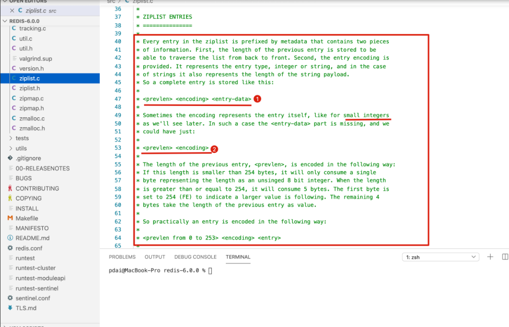

# Redis

# A. 面试问答

## 作为缓存

### Redis 与 Memcached

两者都是非关系型内存键值数据库，主要有以下不同：

- 数据类型

  Memcached 仅支持字符串类型，而 Redis 支持五种不同的数据类型，可以更灵活地解决问题。

- 数据持久化

  Redis 支持两种持久化策略：RDB 快照和 AOF 日志，而 Memcached 不支持持久化。

- 分布式

  Memcached 不支持分布式，只能通过在客户端使用一致性哈希来实现分布式存储，这种方式在存储和查询时都需要先在客户端计算一次数据所在的节点。

  Redis Cluster 实现了分布式的支持。

- 内存管理机制

  - 在 Redis 中，并不是所有数据都一直存储在内存中，可以将一些很久没用的 value 交换到磁盘，而 Memcached 的数据则会一直在内存中。

  - Memcached 将内存分割成特定长度的块来存储数据，以完全解决内存碎片的问题。但是这种方式会使得内存的利用率不高，例如块的大小为 128 bytes，只存储 100 bytes 的数据，那么剩下的 28 bytes 就浪费掉了。

### 缓存穿透、击穿、雪崩区别与怎么解决？

**缓存穿透：**（访问缓存中不存在的数据）

客户端查询根本不存在的数据，使得请求直达数据库，导致负载过大，设置宕机。出现这种情况，可能是业务层误将缓存和库中的数据删除了，也可能是被恶意攻击，专门访问库中不存在的数据

解决方案：

- 缓存无效Key

  不适合被频繁更新的数据

- 布隆过滤器

  把所有可能存在的请求的值都存放在布隆过滤器中，当⽤户请求过来，先判断⽤户发来的请求的值是否存在于布隆过滤器中。不存在的话，直接返回请求参数错误信息给客户端，存在的话才会⾛下⾯的流程

  误判的情况（不同的字符串可能哈希出来的位置相同）：

  布隆过滤器说某个元素存在，⼩概率会误判。布隆过滤器说某个元素不在，那么这个元素⼀定不在（无效请求还是有可能传入）
  
  核心：
  
  - 一个位数组
  - 若干个不一样的哈希函数，每个哈希函数都能将哈希值算的比较均匀
  
  工作原理：
  
  - 添加key时，每个哈希函数都用这个key计算一个哈希值，再根据哈希值计算一个位置，并将位数组中这个位置设置为1
  - 询问key时，每个哈希函数都利用这个key计算出一个哈希值，再根据哈希值计算一个位置，然后对比这些哈希函数在位数组中对应的数值：
    - 几个位置中，其中一个位置是0，说明不存在这个key
    - 几个位置中，所有位置的值都是1，说明可能存在这个key，但不是100%


**缓存击穿**：（一份热点数据过期）

一份热点数据，访问量非常大。因为缓存时间到了或其他原因失效了，大量请求直达数据库，导致服务端奔溃

解决方案：

- 永不过期：热点数据不设置过期时间。或者为每个热点数据设置逻辑过期时间，当发现该数据逻辑过期时，使用单独的线程重建缓存
- 加互斥锁：对数据的访问加互斥锁，当一个线程访问该数据时，其他线程只能等待。再这个线程访问后，缓存中的数据将被重建，届时其他线程就可以直接从缓存中取值。


**缓存雪崩**：（大量缓存数据过期）

某一时刻，缓存无法继续提供服务，导致所有的请求直达存储层，造成数据库宕机。可能是缓存中有大量数据同时过期，也可能是redis节点发生故障，导致大量请求无法得到处理

解决方案：

- 设置过期时间时，可以附加一个随机数，避免大量的key同时过期
- 启用降级和熔断措施：发生雪崩时，若应用程序访问的不是核心数据，则直接返回预定信息/空值/错误信息。或者在发生雪崩时，对于访问缓存接口的请求，客户端并不会把请求发给redis，而是直接返回
- 构建高可用的redis服务：采用哨兵或集群模式。部署多个redis实例，个别节点宕机，依旧可以保持服务的整体可用


### 如何设计redis的过期时间

- 热点数据不设置过期时间，可以避免缓存穿击问题
- 设置过期时间时，可以附加一个随机数，避免大量的key同时过期，导致缓存雪崩


### Redis和传统的关系型数据库有什么不同？

Redis是一种基于键值对的NoSQL数据库，而键值对的值是由多数数据结构和算法组成的。Redis的数据都存储于内存中，因此它的速度很快，读写性能高达10万/秒，远超关系型数据库。

关系型数据库是基于二维数据表来存储数据的，它的数据格式更为严谨，并支持关系查询。关系型数据库的数据存储于磁盘中，可以存放海量数据，但性能远不如Redis。


### Redis缓存淘汰策略

当写入数据超过maxmemory时，redis会采用maxmemory-policy所指定的策略进行数据淘汰，该策略一共包含如下8种选项：

总结：

- 直接返回错误

- 从设置了过期时间的键中，依据随机、最近要过期、最近使用最少（LRU）、最近使用频率最低（LFU）选择淘汰的键

- 从所有键中，依据随机、LRU、LFU选择淘汰的键

- 作为内存数据库，出于对性能和内存消耗的考虑，Redis 的淘汰算法实际实现上并非针对所有 key，而是抽样一小部分并且从中选出被淘汰的 key。

  使用 Redis 缓存数据时，为了提高缓存命中率，需要保证缓存数据都是热点数据。可以将内存最大使用量设置为热点数据占用的内存量，然后启用 allkeys-lru 淘汰策略，将最近最少使用的数据淘汰。

  Redis 4.0 引入了 volatile-lfu 和 allkeys-lfu 淘汰策略，LFU 策略通过统计访问频率，将访问频率最少的键值对淘汰。

| 策略            | 描述                                                 |
| --------------- | ---------------------------------------------------- |
| noeviction      | 直接返回错误                                         |
| volatile-ttl    | 从设置了过期时间的键中，选择过期时间最小的键进行淘汰 |
| volatile-random | 从设置了过期时间的键中，随机选择键，进行淘汰         |
| volatile-lru    | 从设置了过期时间的键中，使用LRU算法选择键，进行淘汰  |
| volatile-lfu    | 从设置了过期时间的键中，使用LFU算法选择键，进行淘汰  |
| alleys-random   | 从所有键中，随机选择键，进行淘汰                     |
| allkeys-lru     | 从所有的键中，使用LRU算法选择键，进行淘汰            |
| allkeys-lfu     | 从所有的键中，使用LFU算法选择键，进行淘汰            |

其中，volatile前缀代表从设置了过期时间的键中淘汰数据，allkeys前缀代表从所有的键中淘汰数据。关于后缀，ttl代表选择过期时间最小的键，random代表随机选择键，需要额外关注的是lru（最近使用在前面）和lfu（使用频率最高在前面）后缀，分别代表采用lru算法和lfu算法来淘汰数据。

LRU（Least Rencently Used）最近最少使用原则：

- 标准LRU：把所有的数据组成一个链表，表头和表尾分别表示MRU（常用）和LRU（最少使用）端。刚被访问/修改的数据会被移动到MRU端。当表的空间占满时，会删除LRU端的数据
- 近似LRU：Redis会记录每个数据的最近一次访问的时间戳。Redis执行写操作时，若发现内存超出maxmemory，就会执行一次近视LRU淘汰算法。近似LRU会随机采样N个key，然后淘汰最旧的key，若淘汰后内存依旧超出限制，则继续采样淘汰。可以通过maxmemory_samples配置项，设置近似LRU每次采样的数据个数，该配置项默认值为5

LRU算法的不足之处在于，若一个key很少被访问，只是偶尔访问一次，则它就被认为时热点数据，短时间不会被淘汰。

LFU算法正式用于解决上述问题，LFU（Least Frequently Used）是redis 4 新增的淘汰策略，会根据key的最近访问频率进行淘汰。LFU再LRU的基础上，为每个数据新增一个计数器，来统计这个数据的访问次数。当使用LFU策略淘汰数据时，首先会根据数据的访问次数进行筛选，把访问次数最低的数据淘汰出内存，如果两个数据的访问次数相同，LFU再比较这两个数据的访问时间，把访问时间更早的数据淘汰出内存。

### Redis过期策略

支持两种过期策略：

- 惰性删除

  客户端访问一个key的时候，redis会检查它的过期时间，如果发现过期立刻删除这个key。

- 定期删除

  redis将设置了过期时间的key放在一个独立的字典中，并对该字典进行每秒10次的过期扫描

  定期扫描不会遍历字典中所有的key，而是采用一种简单的贪心策略。策略的删除逻辑如下：

  1. 从过期字典中随机选取20个key
  2. 删除这个20个key中已过期的key
  3. 如果已过期的key的比例超过25%，则重复步骤1

### 保证缓存与数据库的双写一致性？

总结：

如果为了短时间的不⼀致性问题，选择让系统设计变得更加复杂的话，完全没必要。

如果要避免就用旁路缓存模式，更新DB，然后删除缓存，如果第二步（删除缓存失败）：

- 缓存失效时间变短

  缓存过期时间变短，缓存就会从数据库中加载数据。但是这种方法对于先删除缓存后更新数据库的场景不适用

- 增加删除缓存重试机制

  如果缓存服务当前不可用导致删除缓存失败，就隔一段时间重试，重试一定次数仍失败的话，就可以把更新失败的key存入队列，等缓存服务可用后，再将缓存中对应的key删除即可


解析：

四种同步策略：

- 先更新缓存，再更新数据库
- 先更新数据库，再更新缓存
- 先删除缓存，再更新数据库
- 先更新数据库，再删除缓存

考虑：

- 更新缓存与删除缓存哪种方式更合适？
- 应该先操作数据库还是缓存？

分析 更新 or 删除 缓存：

- 更新缓存

  优点：每次数据变化都及时更新缓存，所以查询时不容易出现未命中的情况

  缺点：更新缓存的消耗更大。如果数据需要经过复杂的计算再写入缓存，那么频繁更新缓存就会影响服务器的性能。如果是写入数据频繁的业务场景，那么可能频繁更新缓存，却没有业务读取该数据，不如直接更新数据库

- 删除缓存

  优点：操作简单，无论更新操作是否复杂，都是将缓存中的数据直接删除

  缺点：删除缓存后，下一次查询缓存会出现未命中，这时需要重新读取一次数据库

从以上看出，删除缓存是更优的方案。


分析 删除缓存 or 更新数据库：

- 

  先删除缓存，后更新数据库，更新失败的情况：

  1. 进程A删除缓存成功，但是更新数据库失败
  2. 进程B从缓存中读取数据，缓存没有，读取数据库，并更新缓存
  3. 此时缓存和数据库是一致的，但是数据仍是旧值
  4. 此时数据库和缓存数据是一致的

- 

  先更新数据库，后删除缓存，删除失败的情况：

  1. 进程A更新数据库成功，但是删除缓存失败
  2. 进程B从缓存读取数据，由于缓存删除失败，读取的时间仍是旧值
  3. 此时数据库和缓存的数据是不一致的

经过上面的比较，在出现失败的时候，无法分辨先删除缓存还是先更新数据库好。

如果出现上面失败的状况，如何保证数据一致：

- 无论采用哪种方式，在第二步失败的时候，建议采用重试机制解决，为了避免重试机制影响主要业务的执行，一般重试机制采用异步方式执行：

  

  重试机制步骤（先更新数据库，后删除缓存）：

  1. 更新数据库成功，删除缓存失败
  2. 将此数据加入消息队列
  3. 业务代码消费这条消息
  4. 业务代码根据这条消息的内容，发起重试机制，重新从缓存删除记录

总结：先更新数据库、再删除缓存是影响更小的方案。如果第二步出现失败的情况，则可以采用重试机制解决问题。


扩展：

- 延迟双删

  1. 删除缓存
  2. 更新数据库
  3. sleep N毫秒
  4. 再次删除缓存

  具体阻塞时间根据业务决定

- 采用读写分离架构怎么办

  

  在从库与主库同步之前，进程B访问缓存数据不在，进而读取从库的旧数据：

  依旧采取延时双删，阻塞时间考虑主从数据库同步数据时间

  第二次删除失败了怎么办？

  如果第二次删除依然失败，则可以增加重试的次数，但是这个次数要有限制，当超出一定的次数时，要采取报错、记日志、发邮件提醒等措施。


## 事件

Redis 服务器是一个事件驱动程序。

### 文件事件

服务器通过套接字与客户端或者其它服务器进行通信，文件事件就是对套接字操作的抽象。

Redis 基于 Reactor 模式开发了自己的网络事件处理器，使用 I/O 多路复用程序来同时监听多个套接字，并将到达的事件传送给文件事件分派器，分派器会根据套接字产生的事件类型调用相应的事件处理器。


### 时间事件

服务器有一些操作需要在给定的时间点执行，时间事件是对这类定时操作的抽象。

时间事件又分为：

- 定时事件：是让一段程序在指定的时间之内执行一次；
- 周期性事件：是让一段程序每隔指定时间就执行一次。

Redis 将所有时间事件都放在一个无序链表中，通过遍历整个链表查找出已到达的时间事件，并调用相应的事件处理器。

### 事件的调度与执行

服务器需要不断监听文件事件的套接字才能得到待处理的文件事件，但是不能一直监听，否则时间事件无法在规定的时间内执行，因此监听时间应该根据距离现在最近的时间事件来决定。

事件调度与执行由 aeProcessEvents 函数负责，伪代码如下：

```
def aeProcessEvents():
    # 获取到达时间离当前时间最接近的时间事件
    time_event = aeSearchNearestTimer()
    # 计算最接近的时间事件距离到达还有多少毫秒
    remaind_ms = time_event.when - unix_ts_now()
    # 如果事件已到达，那么 remaind_ms 的值可能为负数，将它设为 0
    if remaind_ms < 0:
        remaind_ms = 0
    # 根据 remaind_ms 的值，创建 timeval
    timeval = create_timeval_with_ms(remaind_ms)
    # 阻塞并等待文件事件产生，最大阻塞时间由传入的 timeval 决定
    aeApiPoll(timeval)
    # 处理所有已产生的文件事件
    procesFileEvents()
    # 处理所有已到达的时间事件
    processTimeEvents()
```

将 aeProcessEvents 函数置于一个循环里面，加上初始化和清理函数，就构成了 Redis 服务器的主函数，伪代码如下：

```
def main():
    # 初始化服务器
    init_server()
    # 一直处理事件，直到服务器关闭为止
    while server_is_not_shutdown():
        aeProcessEvents()
    # 服务器关闭，执行清理操作
    clean_server()
```

从事件处理的角度来看，服务器运行流程如下：


## 数据结构

### Redis有哪些数据结构？

- Redis支持5中数据结构，分别是string、list、set、zset、hash

- redis还提供了Bitmap、HyperLoglog、Geo类型，这些都是基于上述核心数据类型实现的

- redis在5.0新增了Streams数据类型，是一个功能强大的、支持多播的、可持久化的消息队列

### set和zset有什么区别？

set

- 元素是无序的、不可重复的
- 支持对数据增删改查，多个集合取交集、并集、差集

zset

- 元素是有序的、不可重复的（分数可相同）
- 元素被设置一个分数，并以此作为排序依据

## 命令

### watch命令

- 为了确保事务中的数据没有被其他客户端修改才执行该事务，可以利用watch命令
- watch是一种乐观锁的机制，客户端通过watch命令，要求服务器对一个或多个key进行监视，如果客户端执行事务之前，这些key发生变化，服务器将拒绝客户端提交的事务，并返回一个空值。


## 线程

### Redis是单线程的，为什么还能这么快？

- 单线程避免了线程切换和锁竞争所产生的消耗；
- Redis大部分操作是在内存上完成的，这是它实现高性能的一个重要原因
- redis采用IO多路复用机制，使得网络IO操作中能并发处理大量的客户端请求，实现高吞吐率


### 怎么理解是redis单线程的？

redis是单线程的，主要指的是redis网络的IO和键值对读写是由一个线程来完成的。

而redis的其他功能，如持久化、异步删除、集群数据同步等，则是依赖其他线程来执行的。

所以，redis底层实际上不是单线程的。

### 是不是单线程的？

不是，在4.0版本后就不是单线程。新增IO线程和后台线程；

主线程作用：监听IO多路复用器上的读写事件、执行IO线程读取好的命令、执行定时任务

监听IO多路复用器上的读写事件：读事件举例，监听到读事件时，主线程就把读事件的链接分发给IO线程，IO线程读取和解析请求，把读取和解析好的命令放到缓冲区里面

执行IO线程读取好的命令：比如说IO读取到一个SET命令，放到了缓冲区里面，主线程就会从缓冲区里面读取这个命令，然后修改redis里面的数据，这个时候，命令产生的返回值就会写到缓冲区里面，之后在链接发生可写事件的时候，IO线程就会把set命令返回值发送给客户端

执行定时任务：有一些定时任务比如说更新时钟，检查和客户端的心跳、和从库心跳等。

IO线程：两件事：1.从连接里面读取数据，然后反序列化得到redis命令；2.把命令执行完的返回值序列化成字节数组通过连接返回给客户端。

后台线程：释放内存空间的后台线程(比如我们删除一个key之后，内存可能占用比较大的内存空间，要回收这个空间的时候会比较耗时，会阻塞主线程，所以有了后台线程)


## 持久化

### Redis为什么存的快，内存断电怎么恢复

存的快是因为数据都存在内存中

为了保存数据的安全性，redis提供了三种数据的持久化机制：RDB持久化、AOF持久化、RDB-AOF混合持久化。

若服务器断电，可以利用持久化文件，对数据进行恢复。理论上，AOF/RDB-AOF持久化可以将丢失数据的窗口控制在1s之内。

### Redis的持久化机制

总结：

Redis 是内存型数据库，为了保证数据在断电后不会丢失，需要将内存中的数据持久化到硬盘上。

- RDB 持久化

将某个时间点的所有数据都存放到硬盘上。

可以将快照复制到其它服务器从而创建具有相同数据的服务器副本。

如果系统发生故障，将会丢失最后一次创建快照之后的数据。

如果数据量很大，保存快照的时间会很长。

- AOF 持久化

将写命令添加到 AOF 文件（Append Only File）的末尾。

使用 AOF 持久化需要设置同步选项，从而确保写命令同步到磁盘文件上的时机。这是因为对文件进行写入并不会马上将内容同步到磁盘上，而是先存储到缓冲区，然后由操作系统决定什么时候同步到磁盘。有以下同步选项：

| 选项     | 同步频率                 |
| -------- | ------------------------ |
| always   | 每个写命令都同步         |
| everysec | 每秒同步一次             |
| no       | 让操作系统来决定何时同步 |

- always 选项会严重减低服务器的性能；
- everysec 选项比较合适，可以保证系统崩溃时只会丢失一秒左右的数据，并且 Redis 每秒执行一次同步对服务器性能几乎没有任何影响；
- no 选项并不能给服务器性能带来多大的提升，而且也会增加系统崩溃时数据丢失的数量。

随着服务器写请求的增多，AOF 文件会越来越大。Redis 提供了一种将 AOF 重写的特性，能够去除 AOF 文件中的冗余写命令。


解析：

三种持久化方式：RDB持久化、AOF持久化、RDB-AOF混合持久化

- RDB（Redis Database）

  默认持久化方式。以快照的方式将进程数据持久化到硬盘中。RDB会创建一个经过压缩的二进制文件，文件以 “.rdb” 结尾，内部存储各个数据库的键值对数据等信息。触发方式：

  - 手动触发：SAVE或BGSAVE命令触发，创建 ”.rdb“ 文件

  - 自动触发：通过配置选项，让服务请在满足指定条件时自动执行BGSAVE命令

  SAVE命令执行期间，redis服务器会被阻塞，直到 ”.rbd“ 文件创建完毕。

  BGSAVE命令是异步版本的SAVE命令，会使用Redis服务器进程的子进程创建 ”.rbd“ 文件。BGSAVE 命令在创建子进程的时会暂时阻塞，之后服务请可以继续处理其他客户端的请求。redis内部所有涉及RDB的操作都采用ＢＧＳＶＡＥ的方式，ＳＡＶＥ命令已经被废弃。

  BGSAVE命令：

  

  BGSAVE命令的原理：RDB持久化优缺点：

  - 优点：RDB生成紧凑压缩的二进制文件，体积小，使用该文件恢复数据的速度非常快
  - 缺点：BGSAVE每次运行都要执行fork操作创建子进程，属于重量级操作，不易频繁执行，所以RDB持久化没办法做到实时的持久化。

- AOF（Append Only File）

  解决了数据持久化的实时性，目前持久化的主流方式。AOF以独立日志的方式，记录了每次写入命令，重启时在重新执行AOF文件中的命令来恢复数据。

  - 工作流程：命令写入（append）、文件同步（sync）、文件重写（rewrite）、重启加载（load）：

    

  - 配置：

    - AOF默认不开启，需要修改配置项来启用它：

      ```
      appendonly yes         # 启用AOF appendfilename "appendonly.aof"  # 设置文件名
      ```

      AOF以文本协议格式写入命令，如：

      ```
      *3\r\n$3\r\nset\r\n$5\r\nhello\r\n$5\r\nworld\r\n
      ```

  - 文本协议格式优点：

    - 良好的兼容性

    - 避免二次处理的开销

    - 可读性强，方便直接修改和处理

  - 同步机制：

    为了提高程序的写入性能，现代操作系统会把针对硬盘的多次写操作优化为一次写操作

    - 当程序调用write对文件写入时，系统不会直接把输入写入硬盘，而是先将数据写入内存的缓冲区
    - 当到达特定的时间周期或缓冲区写满时，系统才会执行flush操作，将缓冲区中的数据冲洗至硬盘中

    这种优化机制虽然提高了性能，但是给程序的写入操作带来了不确定性。

    - 对于AOF这样的持久化功能来说，冲洗机制将直接影响AOF持久化的安全性
    - 为了消除上述机制的不确定性，redis向用户提供了appendfsync选项，来控制系统冲洗AOF的频率
    - Linux的glibc提供了fsync函数，可以将指定文件强制从缓冲区刷到硬盘，上述操作是基于此函数

    appendfsync选项的取值与含义：

    

  - 优缺点：

    - 优点

      与RDB持久化可能丢失大量数据相比，AOF持久化的安全性要高很多。通过everysec选项，可以将用户数据丢失的时间窗口限制在1s之内

    - 缺点

      AOF文件存储的是协议文本，它的体积比二进制格式的".rdb"文件大很多，AOF需要通过执行AOF文件中的命令来恢复数据库，其恢复速度比RDB慢很多，AOF在进行重写时也需要创建子进程，在数据库体积较大时将占用大量资源，会导致服务器的短暂阻塞

- RDB-AOF 混合持久化

  redis从4.0开始引入RBD-AOF混合持久化模式，这种模式是基于AOF持久化构建而来的。用户可以通过配置文件中的” aof-use-rdb-preamble yes”配置项开启AOF混合持久化。Redis服务器在执行AOF重写操作时，会按照如下原则处理数据：

  - 像执行BGSAVE命令一样，根据数据库当前的状态生成相应的RDB数据，并将其写入AOF文件中；

  - 对于重写之后执行的Redis命令，则以协议文本的方式追加到AOF文件的末尾，即RDB数据之后。

  通过使用RDB-AOF混合持久化，用户可以同时获得RDB持久化和AOF持久化的优点，服务器既可以通过AOF文件包含的RDB数据来实现快速的数据恢复操作，又可以通过AOF文件包含的AOF数据来将丢失数据的时间窗口限制在1s之内。

## 事务

一个事务包含了多个命令，服务器在执行事务期间，不会改去执行其它客户端的命令请求。

事务中的多个命令被一次性发送给服务器，而不是一条一条发送，这种方式被称为流水线，它可以减少客户端与服务器之间的网络通信次数从而提升性能。

Redis 最简单的事务实现方式是使用 MULTI 和 EXEC 命令将事务操作包围起来。

## 高性能

### 复制

通过使用 slaveof host port 命令来让一个服务器成为另一个服务器的从服务器。

一个从服务器只能有一个主服务器，并且不支持主主复制。

- 连接过程：
  1. 主服务器创建快照文件，发送给从服务器，并在发送期间使用缓冲区记录执行的写命令。快照文件发送完毕之后，开始向从服务器发送存储在缓冲区中的写命令；
  2. 从服务器丢弃所有旧数据，载入主服务器发来的快照文件，之后从服务器开始接受主服务器发来的写命令；
  3. 主服务器每执行一次写命令，就向从服务器发送相同的写命令。

- 主从链

随着负载不断上升，主服务器可能无法很快地更新所有从服务器，或者重新连接和重新同步从服务器将导致系统超载。为了解决这个问题，可以创建一个中间层来分担主服务器的复制工作。中间层的服务器是最上层服务器的从服务器，又是最下层服务器的主服务器。


### Sentinel

Sentinel（哨兵）可以监听集群中的服务器，并在主服务器进入下线状态时，自动从从服务器中选举出新的主服务器。

### 分片

分片是将数据划分为多个部分的方法，可以将数据存储到多台机器里面，这种方法在解决某些问题时可以获得线性级别的性能提升。

假设有 4 个 Redis 实例 R0，R1，R2，R3，还有很多表示用户的键 user:1，user:2，... ，有不同的方式来选择一个指定的键存储在哪个实例中。

- 最简单的方式是范围分片，例如用户 id 从 0~1000 的存储到实例 R0 中，用户 id 从 1001~2000 的存储到实例 R1 中，等等。但是这样需要维护一张映射范围表，维护操作代价很高。
- 还有一种方式是哈希分片，使用 CRC32 哈希函数将键转换为一个数字，再对实例数量求模就能知道应该存储的实例。

根据执行分片的位置，可以分为三种分片方式：

- 客户端分片：客户端使用一致性哈希等算法决定键应当分布到哪个节点。
- 代理分片：将客户端请求发送到代理上，由代理转发请求到正确的节点上。
- 服务器分片：Redis Cluster。

### Redis高可用方案？

- 主从复制和哨兵机制

给redis主库加多个从库，还可以加哨兵的机制，监控主从集群里面redis实例是不是有宕机的，在出现主库宕机的时候进行自动的故障转移，让从节点提升为主节点，然后给客户端返回主库的地址

- Redis集群

自带高可用方案，所有集群节点里面，不管是主节点还是从节点，之间都是有连接的，通过心跳去检查可用性。当一个节点宕机的时候，其他节点都是能感知到的，应该是通过gossip协议实现的。当超过一半节点的时候感知到，就认为这个节点宕机，就会对它进行故障转移。

### 在主库宕机的时候，如何选择新的从节点作为新的库存呢？

主从复制的时候是异步的。如果是这样的话，我们进行主从切换的时候没办法保证所有从节点都和主节点数据是一致的。那么在主库宕机的时候，如何选择新的从节点作为新的库存呢？

一般比较一下从节点的同步状态，主从复制里面有一个offset偏移量的概念，如果从节点复制的越快，offset就越大，就证明从库和主库之间的数据状态越接近，所以会选offset值最大的从库作为主库

### Redis哨兵机制？

Redis Sentinel（哨兵）是一个分布式架构，包含若干个哨兵节点和数据节点。

每个哨兵节点会对数据节点和其余的哨兵节点进行监控，当发现节点不可达时，会对节点做下线标识。如果被标识的是主节点，它就会与其他哨兵节点进行协商，当多数哨兵节点都认为主节点不可达时，它们便会选举出一个哨兵节点来完成自动故障转移工作，同时将变化实时通知给应用方。整个过程是自动的，不需要人工接入。

一组哨兵可以监控一个主节点，也可以同时监控多个主节点


哨兵节点特性：

- 会定期监控数据节点，其他哨兵节点是否可达
- 将故障转移的结果通知给应用方
- 将从节点晋升为主节点，并维护后续正确的主从关系
- 哨兵模式下，客户端连接的是哨兵节点集合，从中获取主节点信息
- 节点的故障转移判断是由多个哨兵节点共同完成的，可有效地防止误判
- 哨兵节点集合是由多个哨兵节点组成，即使个别哨兵节点不可用，整个集合依然是健壮的
- 哨兵节点也是独立的Redis节点，是特殊的redis节点，不存储数据，只支持部分命令

### Redis集群？

Redis集群采用虚拟槽分区来实现数据分片，它把所有的键根据哈希函数映射到0-16383整数槽内，计算公式：

```
slot=CRC16(key)&16383
```

每个节点负责维护一部分槽以及槽所映射的键值数据。虚拟槽分区有以下特点：

- 解耦数据和节点之间的关系，简化了节点扩容和收缩的难度

- 节点自身维护槽的映射关系，不需要客户端或者代理服务维护槽分区元数据
- 支持节点、槽、键之间的映射关系，用于数据路由、在线伸缩等场景

集群中数据的分片逻辑：


Redis集群的功能限制：

Redis集群方案在扩展了Redis处理能力的同时，也带来了一些使用上的限制：

1. key批量操作支持有限。如mset、mget，目前只支持具有相同slot值的key执行批量操作。对于映射为不同slot值的key由于执行mset、mget等操作可能存在于多个节点上所以不被支持。
2. key事务操作支持有限。同理只支持多key在同一节点上的事务操作，当多个key分布在不同的节点上时无法使用事务功能。
3. key作为数据分区的最小粒度，因此不能将一个大的键值对象（如hash、list等）映射到不同的节点。
4. 不支持多数据库空间。单机下的Redis可以支持16个数据库，集群模式下只能使用一个数据库空间，即DB0。
5. 复制结构只支持一层，从节点只能复制主节点，不支持嵌套树状复制结构。


Redis集群的通信方案：

在分布式存储中需要提供维护节点元数据信息的机制，所谓元数据是指：节点负责哪些数据，是否出现故障等状态信息。常见的元数据维护方式分为：集中式和P2P方式。

Redis集群采用P2P的Gossip（流言）协议，Gossip协议的工作原理就是节点彼此不断通信交换信息，一段时间后所有的节点都会知道集群完整的信息，这种方式类似流言传播。通信的大致过程如下：

1. 集群中每个节点都会单独开辟一个TCP通道，用于节点之间彼此通信，通信端口号在基础端口号上加10000；
2. 每个节点再固定周期内通过特定规则选择几个节点发送ping消息；
3. 接收ping消息的节点用pong消息作为响应。

其中，Gossip协议的主要职责就是信息交换，而信息交换的载体就是节点彼此发送的Gossip消息，Gossip消息分为：meet消息、ping消息、pong消息、fail消息等。

- meet消息：用于通知新节点加入，消息发送者通知接受者加入到当前集群。meet消息通信正常完成后，接收节点会加入到集群中并进行周期性的ping、pong消息交换。
- ping消息：集群内交换最频繁的消息，集群内每个节点每秒向多个其他节点发送ping消息，用于检测节点是否在线和交换彼此状态信息。ping消息封装了自身节点和一部分其他节点的状态数据。
- pong消息：当接收到meet、ping消息时，作为响应消息回复给发送方确认消息正常通信。pong消息内封装了自身状态数据，节点也可以向集群内广播自身的pong消息来通知整个集群对自身状态进行更新。
- fail消息：当节点判定集群内另一个节点下线时，会向集群内广播一个fail消息，其他节点接收到fail消息之后把对应节点更新为下线状态。

虽然Gossip协议的信息交换机制具有天然的分布式特性，但它是有成本的。因为Redis集群内部需要频繁地进行节点信息交换，而ping/pong消息会携带当前节点和部分其他节点的状态数据，势必会加重带宽和计算的负担。所以，Redis集群的Gossip协议需要兼顾信息交换的实时性和成本的开销。

- 集群里的每个节点默认每隔一秒钟就会从已知节点列表中随机选出五个节点，然后对这五个节点中最长时间没有发送过PING消息的节点发送PING消息，以此来检测被选中的节点是否在线。
- 如果节点A最后一次收到节点B发送的PONG消息的时间，距离当前时间已经超过了节点A的超时选项设置时长的一半（cluster-node-timeout/2），那么节点A也会向节点B发送PING消息，这可以防止节点A因为长时间没有随机选中节点B作为PING消息的发送对象而导致对节点B的信息更新滞后。
- 每个消息主要的数据占用：slots槽数组（2KB）和整个集群1/10的状态数据（10个节点状态数据约1KB）。


### 主从同步实现？

```sh
psync
```

同步过程：

- 全量复制

  一般用于初次复制的场景

- 部分复制

  用于网络中断等原因造成数据丢失的场景

psync 命令参数：

- 复制偏移量：

  主节点处理写命令后，会把命令长度做累加记录，从节点再接收到写命令后，也会做累加记录；从节点会每秒钟上报一次自身的复制偏移量给主节点，而主节点则会保存从节点的复制偏移量

- 积压缓冲区：

  保存在主节点上的一个固定长度的队列。默认大小是1M，当主节点有连接的从节点时，主节点处理写命令时，不但会把命令发送给从节点，还会写入挤压缓冲区；缓冲区是先进先出的队列，可以保存最近已复制的数据，用于部分复制和命令丢失的数据补救

- 主节点运行ID：

   每个Redis节点启动后，都会动态分配一个40位的十六进制字符串作为运行ID；如果使用IP和端口的方式标识主节点，那么主节点重启变更了数据集（RDB/AOF）,从节点再基于复制偏移量复制数据是不安全的，因此当主节点的运行ID变化后，从节点将做全量复制

psync命令执行过程及返回结果：


全量复制过程：


部分复制过程：


### Redis集群的应用和优劣势

优势：

Redis Cluster是Redis的分布式解决方案，在3.0版本正式推出，有效地解决了Redis分布式方面的需求。当遇到单机内存、并发、流量等瓶颈时，可以采用Cluster架构方案达到负载均衡的目的。

劣势：

Redis集群方案在扩展了Redis处理能力的同时，也带来了一些使用上的限制：

1. key批量操作支持有限。如mset、mget，目前只支持具有相同slot值的key执行批量操作。对于映射为不同slot值的key由于执行mset、mget等操作可能存在于多个节点上所以不被支持。
2. key事务操作支持有限。同理只支持多key在同一节点上的事务操作，当多个key分布在不同的节点上时无法使用事务功能。
3. key作为数据分区的最小粒度，因此不能将一个大的键值对象（如hash、list等）映射到不同的节点。
4. 不支持多数据库空间。单机下的Redis可以支持16个数据库，集群模式下只能使用一个数据库空间，即DB0。
5. 复制结构只支持一层，从节点只能复制主节点，不支持嵌套树状复制结构。

## 应用题

### 键的过期时间

Redis 可以为每个键设置过期时间，当键过期时，会自动删除该键。

对于散列表这种容器，只能为整个键设置过期时间（整个散列表），而不能为键里面的单个元素设置过期时间。

### 怎么利用Redis实现分布式锁?

使用SETNX命令实现：

- setnx命令返回一个整数值，当返回值为1时表示设置值成功，返回0表示设置值失败（key已存在）

- 实现原理：

  加锁：当key没有的时候，就在redis里面写入这个值，把key值作为锁的名字，value值就是当前拿锁线程的服务标识和线程id组成，还可以给key值加一个过期时间，如果我们的服务或则线程异常退出，可以保证锁的释放，其他线程也能继续获取这个锁，不会出现死锁的情况。

  ```sh
  # 方式一：容易出现死锁、客户端忘记解锁或解锁失败
  setnx key value
  
  # 方式二：一定程度上避免死锁，但是两个命令不是原子性的，第二部可能失败，依旧会出现死锁
  setnx key value expire key seconds
  
  # 方式三：”set...nx...“命令，将加锁、过期命令编排在一起，操作是原子的，可避免死锁
  set key value nx ex seconds
  ```

  释放锁：在一个线程释放锁的时候，会先去 get一下锁的value值，然后和自己的服务标识和线程id进行比较，如果是一致的话就证明当前线程是拿锁的，当前线程就有资格去释放这个锁，就可以直接把key删除，或者是把value值置空。

  ```sh
  # 解锁就是删除锁的数据
  del key
  ```

问题

- 死锁

  容易出现死锁。给锁设置一个自动过期时间，而setnx命令和设置过期时间的命令不是原子的，可能加锁成功而设置过期时间失败，依旧存在死锁现象。

  对于这种情况，redis改进了set命令，增加了nx选项，启用该选项时，set的效果就会和setnc一样。

- 释放别的线程的锁

  

  对于这种情况：

  - 加锁时设置一个标识值，进程记住这个值。在解锁的时候进行判断，是自己持有的锁才能释放
  - 解锁时判断、再释放，两步操作要保证原子性。否则会出现死锁。而获取和删除命令不是原子的，需要使用Lua脚本，将两个命令编排在一起。Lua脚本的执行是原子的

  ```sh
  # 加锁
  set key random-value nx ex seconds
  
  # 解锁
  if redis.call("get",KEYS[1]) == ARGV[1] 
  	then return redis.call("del",KEYS[1])
  else
  	return 0
  end
  ```


基于RedLock算法的分布式锁

上述分布式锁的实现方案，是建立在单个主节点之上的。它的潜在问题如下：


如果进程A在主节点上锁成功后，然后主节点宕机了，则从节点将会晋升为主节点。此时进程B在新的主节点上加锁成功，之后原主节点重启，称为从节点，系统中将同时出现两把锁，违背锁的唯一性原则。

单节点架构实现发布锁，无法保证高可用。若要保证分布式锁的高可用，可以采用多节点的实现方案。

redis官网建议采用redlock算法的实现方案。该算法基于多个redis节点，基本逻辑：

- 节点相互独立，不存在主从复制或者集群协调机制
- 加锁：以相同的key向N个实例加锁，只要超过一半节点成功，则认定加锁成功
- 解锁：向所有的实例发送DEL命令，进行解锁；

RedLock算法示意图，可以自己实现，也可以直接使用Redisson框架


### 如何利用Redis实现分布式Session？

在web开发中，我们会把用户的登录信息存储在session里。而session是依赖于cookie的，即服务器创建session时会给它分配一个唯一的ID，并且在响应时创建一个cookie用于存储这个SESSIONID。当客户端收到这个cookie之后，就会自动保存这个SESSIONID，并且在下次访问时自动携带这个SESSIONID，届时服务器就可以通过这个SESSIONID得到与之对应的session，从而识别用户的身。如下图：


现在的互联网应用，基本都是采用分布式部署方式，即将应用程序部署在多台服务器上，并通过nginx做统一的请求分发。而服务器与服务器之间是隔离的，它们的session是不共享的，这就存在session同步的问题了，如下图：


如果客户端第一次访问服务器，请求被分发到了服务器A上，则服务器A会为该客户端创建session。如果客户端再次访问服务器，请求被分发到服务器B上，则由于服务器B中没有这个session，所以用户的身份无法得到验证，从而产生了不一致的问题。

解决这个问题的办法有很多，比如可以协调多个服务器，让他们的session保持同步。也可以在分发请求时做绑定处理，即将某一个IP固定分配给同一个服务器。但这些方式都比较麻烦，而且性能上也有一定的消耗。更合理的方式就是采用类似于Redis这样的高性能缓存服务器，来实现分布式session。

从上面的叙述可知，我们使用session保存用户的身份信息，本质上是要做两件事情。第一是保存用户的身份信息，第二是验证用户的身份信息。如果利用其它手段实现这两个目标，那么就可以不用session，或者说我们使用的是广义上的session了。

具体实现的思路如下图，我们在服务端增加两段程序：

- 创建令牌的程序，就是在用户初次访问服务器时，给它创建一个唯一的身份标识，并且使用cookie封装这个标识再发送给客户端。那么当客户端下次再访问服务器时，就会自动携带这个身份标识了，这和SESSIONID的道理是一样的，只是改由我们自己来实现了。另外，在返回令牌之前，我们需要将它存储起来，以便于后续的验证。而这个令牌是不能保存在服务器本地的，因为其他服务器无法访问它。因此，我们可以将其存储在服务器之外的一个地方，那么Redis便是一个理想的场所。

- 验证令牌的程序，就是在用户再次访问服务器时，我们获取到了它之前的身份标识，那么我们就要验证一下这个标识是否存在了。验证的过程很简单，我们从Redis中尝试获取一下就可以知道结果。


### 如果并发量超过30w，怎么设计redis架构？

### 多台Redis抗高并发访问怎么设计？

redis cluster的分布式解决方案。遇到单机内存、并发、流量等瓶颈时，可以采用Cluster架构达到负载均衡的目的。

Redis集群采用虚拟槽分区来实现数据分片，它把所有的键根据哈希函数映射到0-16383整数槽内，计算公式为slot=CRC16(key)&16383，每一个节点负责维护一部分槽以及槽所映射的键值数据。虚拟槽分区具有如下特点：

1. 解耦数据和节点之间的关系，简化了节点扩容和收缩的难度；
2. 节点自身维护槽的映射关系，不需要客户端或者代理服务维护槽分区元数据；
3. 支持节点、槽、键之间的映射查询，用于数据路由，在线伸缩等场景。

Redis集群中数据的分片逻辑如下图：


### 一个简单的论坛系统分析

该论坛系统功能如下：

- 可以发布文章；
- 可以对文章进行点赞；
- 在首页可以按文章的发布时间或者文章的点赞数进行排序显示。


文章信息

文章包括标题、作者、赞数等信息，在关系型数据库中很容易构建一张表来存储这些信息，在 Redis 中可以使用 HASH 来存储每种信息以及其对应的值的映射。

Redis 没有关系型数据库中的表这一概念来将同种类型的数据存放在一起，而是使用命名空间的方式来实现这一功能。键名的前面部分存储命名空间，后面部分的内容存储 ID，通常使用 : 来进行分隔。例如下面的 HASH 的键名为 article:92617，其中 article 为命名空间，ID 为 92617。


点赞功能

当有用户为一篇文章点赞时，除了要对该文章的 votes 字段进行加 1 操作，还必须记录该用户已经对该文章进行了点赞，防止用户点赞次数超过 1。可以建立文章的已投票用户集合来进行记录。

为了节约内存，规定一篇文章发布满一周之后，就不能再对它进行投票，而文章的已投票集合也会被删除，可以为文章的已投票集合设置一个一周的过期时间就能实现这个规定。


对文章进行排序

为了按发布时间和点赞数进行排序，可以建立一个文章发布时间的有序集合和一个文章点赞数的有序集合。（下图中的 score 就是这里所说的点赞数；下面所示的有序集合分值并不直接是时间和点赞数，而是根据时间和点赞数间接计算出来的）


# B. 整体框架


## 一. 数据类型

### 1. 五种基础数据类型

String、List、Set、Zset、Hash

### 2. 3种特殊类型

HyperLogLogs（基数统计）、Bitmaps（位图）、Geospatial（地理位置）

### 3. Stream数据类型

Redis 5.0增加的一种数据结构。借鉴Kafla的设计，是一个新的强大的支持多播的可持久化的消息队列。

## 二. 底层数据结构

### 1. 对象机制

以上5种基础类型、Stream的底层都是由对象结构（redisObject）和对应编码的数据结构组合而成的。

### 2. 底层数据结构详解

除了对象机制，还要了解底层数据结构

### 3. redis对象与编码（底层结构）对应关系详解

了解底层数据结构后和对象机制后，可以了解它们之间的关系了

## 三. Redis的核心功能

### 1. 持久化：RDB和AOF机制

为了防止数据丢失以及服务器重启时能够恢复数据，Redis支持数据的持久化，主要分为两种方式：RDB和AOF；某些场景也会使用混合模式；

### 2. 消息传递：发布订阅模式

Redis 发布订阅（pub/sub）是一种消息通道模式：发布者（pub）发送消息、订阅者（sub）接收消息

### 3. 事件：Redis事件机制

Redis 采用事件驱动机制来处理大量的网络IO。它并没有使用 libevent 或 libev 这样成熟的开源方案，而是自己实现一个非常简洁的事件驱动库 ae_event

### 4. 事务：Redis事务

Redis 事务本质是一组命令的集合，事务支持一次执行多个命令，一个事务种所有命令都会被序列化。在事务执行过程中，会按照顺序串行话执行队列中的命令，其他客户端提交的命令请求不会插入到事务执行命令序列中。

### 5. 高可用：

#### 5.1 主从复制：

避免单点故障，即要保证高可用，便需要冗余（副本）方式提供集群服务。而Redis提供了主从库模式，以保证数据副本的一致，主从库之间采用的是读写分离的方式。

#### 5.2 哨兵机制（Redis Sentinel）

在主从复制的基础上，如果主节点出现故障怎么办？在Redis主从集群中，哨兵机制是实现主从库自动切换的关键，它有效地解决主从复制模式下故障转移地问题。

### 6. 高可扩展：分片技术（Redis Cluster）

主从复制和哨兵机制保障看高可用，就读写分离而言，虽然slave节点来扩展主从地读写并发能力，但是写能力和存储能力无法进行扩展，就只能是master节点能够承载的上限。面对海量数据就需要构建master（主节点分片）之间的集群，同时需要吸收高可用（主从复制和哨兵机制）能力，即每个master分片节点需要由slave节点，这是分布式系统中典型的纵向扩展（集群的分片技术的体现）；Redis 3.0中对应的设计就是Redis Cluster。

## 四. 实践

### 1. 缓存问题

#### 1.1 一致性

#### 1.2 穿击

#### 1.3 穿透

#### 1.4 雪崩

#### 1.5 污染

### 2. 版本特性

#### 2.1 Redis 4.0

#### 2.2 Redis 5.0

#### 2.3 Redis 6.0

### 3. 运维监控

Redis实战中包含开发、集群和运维。Redis如何使用好，需要运维来做；Redis运维/监控 主要在 Redis自身状态及命令、可视化工具、以及Redis监控体系等方面。是性能优化的前提

### 4. 性能调优

Redis性能的问题，几乎涵盖了CPU、内存、网络、甚至硬盘的方方面面；

### 5. 项目经验

- Redis在微博的各个应用场景：比如像现在春晚必争的“红包飞”活动，还有像粉丝数、用户数、阅读数、转评赞、评论盖楼、广告推荐、负反馈、音乐榜单等等都有用到Redis；


# C. 基础知识

## Redis是什么？

### Redis 的概念

Redis是一款内存高速缓存数据库。全称为：**Re**mote **Di**ctionary Server（远程数据服务），使用C语言编写，是一种支持key-value等多种数据结构的存储系统。支持丰富的数据类型，如：String、list、set、zset、hash。可用于缓存，事件发布或订阅，高速队列等场景。支持网络，提供字符串、列表、哈希、队列、集合结构直接存取，基于内存，可持久化。

### 为什么使用 Redis？（特点）

- **读写性能优异**

  Redis能读的速度是110000次/s,写的速度是81000次/s （测试条件见下一节）。

- **数据类型丰富**

  Redis支持二进制案例的 Strings, Lists, Hashes, Sets 及 Ordered Sets 数据类型操作。

- **原子性**

  Redis的所有操作都是原子性的，同时Redis还支持对几个操作全并后的原子性执行。

- **丰富的特性**

  Redis支持 publish/subscribe, 通知, key 过期等特性。

- **持久化**

  Redis支持RDB, AOF等持久化方式

- **发布订阅**

  Redis支持发布/订阅模式

- **分布式**

  Redis Cluster

### 使用场景

1. 热点数据的缓存

   因为Redis的读写性能优异，我们可以用它来作为缓存。Redis逐渐在取代memcached，成为主选服务端缓存的组件。而且Redis 是支持事务的，能够保证数据的一致性。

   作为缓存，一般由两种方式保存数据：

   1. 读取时，先读Redis，没有则读数据库，然后将数据拉入Redis

      实施简单，但是两个注意点：

      - 避免缓存击穿（Redis没有相应缓存，直接访问数据库）
      - 数据实时性较差

      适用于对数据实时性要求不高的场景

   2. 写数据时，同时更新Redis

      数据实时性强，但是开发时不方便统一处理。

      适用于字典表、数据量不大的数据存储。

2. 限时业务

   使用expire命令设置一个键的生存时间。如限时的优惠活动信息、手机验证码等。

3. 计数器

   使用incrby命令实现原子性的递增。如高并发的秒杀活动、分布式序列号生成、限制一个手机号码发多少条短信、一个接口一分钟限制多少请求或限制调用多少次等。

4. 分布式锁

   使用sentx命令，setnx（set if not exists）就是如果不存在则成功设置缓存同时返回1，否者返回0。这个特性在很多后台中都有应用，因为我们服务器时集群的，定时任务可能在两台机器上都会运行，所以在定时任务中可以通过setnx设置一个lock，设置成功则可以执行定时任务，如果每设置成功，说明有定时任务在执行。我们还可以给这个lock加一个过期时间，比如30分钟执行一次定时任务，那么这个过期时间设置那么这个过期时间设置为小于30分钟的一个时间就可以，这个与定时任务的周期以及定时任务执行消耗时间相关。

   在分布式锁的场景中，主要用在比如秒杀系统等

   除此之外，还可以使用官方提供的 RedLock 分布式锁实现。

5. 延时操作

   比如在订单生产后我们占用了库存，10分钟后去检验用户是否真正购买，如果没有购买将该单据设置无效，同时还原库存。 由于redis自2.8.0之后版本提供Keyspace Notifications功能，允许客户订阅Pub/Sub频道，以便以某种方式接收影响Redis数据集的事件。 所以我们对于上面的需求就可以用以下解决方案，我们在订单生产时，设置一个key，同时设置10分钟后过期， 我们在后台实现一个监听器，监听key的实效，监听到key失效时将后续逻辑加上。

   当然我们也可以利用rabbitmq、activemq等消息中间件的延迟队列服务实现该需求。

6. 排行版

   关系型数据库在排行榜方面查询速度普遍偏慢，所以可以借助redis的SortedSet进行热点数据的排序。

   比如点赞排行榜，做一个SortedSet, 然后以用户的openid作为上面的username, 以用户的点赞数作为上面的score, 然后针对每个用户做一个hash, 通过zrangebyscore就可以按照点赞数获取排行榜，然后再根据username获取用户的hash信息，这个当时在实际运用中性能体验也蛮不错的。

7. 点赞、好友等相互关系的存储

   Redis 利用Set的一些命令，比如求交集、并集、差集等。

   在微博应用中，每个用户关注的人存在一个集合中，就很容易实现求两个人的共同好友功能。

8. 简单队列（消息队列）

   List 是一个双向链表，可以通过 lpush 和 rpop 写入和读取消息
   
   不过最好使用 Kafka、RabbitMQ 等消息中间件。
   
9. 会话缓存

   使用Redis来统一存储多态应用服务器的会话信息

   当应用服务器不再存储用户的会话信息，不具有状态时，一个用户可以请求任意一个应用服务器，从而更容易实现高可用性以及可伸缩性

   比如session存在服务器本地内存中，如果客户端经过负载均衡连接到不同的服务器，服务器本地找不到客户端session id对应的会话信息

------

## 一. 数据类型


### 1. 五种基础数据类型

redis来说，所有的key（键）都是字符串。我们在谈基础数据结构时，讨论的是存储值的数据类型，主要包括常见的5种数据类型，分别是：

String、List、Set、Zset、Hash


| 结构类型     | 结构存储的值                               | 结构的读写能力                                               |
| ------------ | ------------------------------------------ | ------------------------------------------------------------ |
| String字符   | 字符串、整数或浮点数                       | 对整个字符串或字符串的一部分进行操作；对整数或浮点数进行自增或自减操作； |
| List列表     | 一个链表，链表上的每个节点都包含一个字符串 | 对链表的两端进行push和pop操作，读取单个或多个元素；根据值查找或删除元素； |
| Set集合      | 包含字符串的无序集合                       | 字符串的集合，包含基础的方法有看是否存在添加、获取、删除；还包含计算交集、并集、差集等 |
| Hash散列     | 包含键值对的无序散列表                     | 包含方法有添加、获取、删除单个元素;获取所有的键值对；检查某个键是否存在 |
| Zset有序集合 | 和散列一样，用于存储键值对                 | 字符串成员与浮点数分数之间的有序映射；元素的排列顺序由分数的大小决定；包含方法有添加、获取、删除单个元素以及根据分值范围或成员来获取元素 |


##### String字符串

String是redis中最基本的数据类型，一个key对应一个value。


String类型是二进制安全的，意思是 redis 的 string 可以包含任何数据。如数字，字符串，jpg图片或者序列化的对象。

- **命令**

| 命令   | 简述                   | 使用              |
| ------ | ---------------------- | ----------------- |
| GET    | 获取存储在给定键中的值 | GET name          |
| SET    | 设置存储在给定键中的值 | SET name value    |
| DEL    | 删除存储在给定键中的值 | DEL name          |
| INCR   | 将键存储的值加1        | INCR key          |
| DECR   | 将键存储的值减1        | DECR key          |
| INCRBY | 将键存储的值加上整数   | INCRBY key amount |
| DECRBY | 将键存储的值减去整数   | DECRBY key amount |

```sh
127.0.0.1:6379> set hello world
OK
127.0.0.1:6379> get hello
"world"
127.0.0.1:6379> del hello
(integer) 1
127.0.0.1:6379> get hello
(nil)
127.0.0.1:6379> get counter
"2"
127.0.0.1:6379> incr counter
(integer) 3
127.0.0.1:6379> get counter
"3"
127.0.0.1:6379> incrby counter 100
(integer) 103
127.0.0.1:6379> get counter
"103"
127.0.0.1:6379> decr counter
(integer) 102
127.0.0.1:6379> get counter
"102"
```

- **实战场景**

  - **缓存**： 经典使用场景，把常用信息，字符串，图片或者视频等信息放到redis中，redis作为缓存层，mysql做持久化层，降低mysql的读写压力。

  - **计数器**：redis是单线程模型，一个命令执行完才会执行下一个，同时数据可以一步落地到其他的数据源。

  - **session**：常见方案spring session + redis实现session共享


##### List列表

Redis中的List其实就是链表（Redis用双端链表实现List）

使用List结构，我们可以轻松地实现最新消息排队功能（比如新浪微博的TimeLine）。List的另一个应用就是消息队列，可以利用List的 PUSH 操作，将任务存放在List中，然后工作线程再用 POP 操作将任务取出进行执行。


- **命令**

| 命令   | 简述                                                         | 使用            |
| ------ | ------------------------------------------------------------ | --------------- |
| RPUSH  | 将给定值推入到列表右端                                       | RPUSH key value |
| LPUSH  | 将给定值推入到列表左端                                       | LPUSH key value |
| RPOP   | 从列表的右端弹出一个值，并返回被弹出的值                     | RPOP key        |
| LPOP   | 从列表的左端弹出一个值，并返回被弹出的值                     | LPOP key        |
| LRANGE | 获取列表在给定范围上的所有值                                 | LRANGE key 0 -1 |
| LINDEX | 通过索引获取列表中的元素。你也可以使用负数下标，以 -1 表示列表的最后一个元素， -2 表示列表的倒数第二个元素，以此类推。 | LINEX key index |

```sh
127.0.0.1:6379> lpush mylist 1 2 ll ls mem
(integer) 5
127.0.0.1:6379> lrange mylist 0 -1
1) "mem"
2) "ls"
3) "ll"
4) "2"
5) "1"
127.0.0.1:6379> lindex mylist -1
"1"
127.0.0.1:6379> lindex mylist 10        # index不在 mylist 的区间范围内
(nil)
```

- 实战场景
  - **微博TimeLine**: 有人发布微博，用lpush加入时间轴，展示新的列表信息。
  - **消息队列**

- **使用列表的技巧**

  - lpush+lpop=Stack(栈)

  - lpush+rpop=Queue（队列）

  - lpush+ltrim=Capped Collection（有限集合）

  - lpush+brpop=Message Queue（消息队列）


##### Set集合

Redis 的 Set 是 String 类型的无序集合。集合成员是唯一的，这就意味着集合中不能出现重复的数据。

Redis 中集合是通过哈希表实现的，所以添加，删除，查找的复杂度都是 O(1)。


- **命令**

| 命令      | 简述                                  | 使用                 |
| --------- | ------------------------------------- | -------------------- |
| SADD      | 向集合添加一个或多个成员              | SADD key value       |
| SCARD     | 获取集合的成员数                      | SCARD key            |
| SMEMBER   | 返回集合中的所有成员                  | SMEMBER key          |
| SISMEMBER | 判断 member 元素是否是集合 key 的成员 | SISMEMBER key member |

```sh
127.0.0.1:6379> sadd myset hao hao1 xiaohao hao
(integer) 3
127.0.0.1:6379> smember myset
1) "xiaohao"
2) "hao1"
3) "hao"
127.0.0.1:6379> sismember myset hao
(integer) 1
```

- 实战场景
  - **标签**（tag）,给用户添加标签，或者用户给消息添加标签，这样有同一标签或者类似标签的可以给推荐关注的事或者关注的人。
  - **点赞，或点踩，收藏等**，可以放到set中实现


##### Hash散列

Redis hash 是一个 string 类型的 field（字段） 和 value（值） 的映射表，hash 特别适合用于存储对象。


- **命令**

| 命令    | 简述                                     | 使用                          |
| ------- | ---------------------------------------- | ----------------------------- |
| HSET    | 添加键值对                               | HSET hash-key sub-key1 value1 |
| HGET    | 获取指定散列键的值                       | HGET hash-key key1            |
| HGETALL | 获取散列中包含的所有键值对               | HGETALL hash-key              |
| HDEL    | 如果给定键存在于散列中，那么就移除这个键 | HDEL hash-key sub-key1        |

```bash
127.0.0.1:6379> hset user name1 hao
(integer) 1
127.0.0.1:6379> hset user email1 hao@163.com
(integer) 1
127.0.0.1:6379> hgetall user
1) "name1"
2) "hao"
3) "email1"
4) "hao@163.com"
127.0.0.1:6379> hget user user
(nil)
127.0.0.1:6379> hget user name1
"hao"
127.0.0.1:6379> hset user name2 xiaohao
(integer) 1
127.0.0.1:6379> hset user email2 xiaohao@163.com
(integer) 1
127.0.0.1:6379> hgetall user
1) "name1"
2) "hao"
3) "email1"
4) "hao@163.com"
5) "name2"
6) "xiaohao"
7) "email2"
8) "xiaohao@163.com"
    
```

- 实战场景
  - **缓存**： 能直观，相比string更节省空间，维护缓存信息，如用户信息，视频信息等。


##### Zset有序集合

Redis 有序集合和集合一样也是 string 类型元素的集合,且不允许重复的成员。不同的是每个元素都会关联一个 double 类型的分数。redis 正是通过分数来为集合中的成员进行从小到大的排序。

有序集合的成员是唯一的,但分数(score)却可以重复。集合是通过哈希表实现的，所以添加，删除，查找的复杂度都是 O(1)。


- **命令**

| 命令   | 简述                                                     | 使用                           |
| ------ | -------------------------------------------------------- | ------------------------------ |
| ZADD   | 将一个带有给定分值的成员添加到有序集合里面               | ZADD zset-key 178 member1      |
| ZRANGE | 根据元素在有序集合中所处的位置，从有序集合中获取多个元素 | ZRANGE zset-key 0-1 withccores |
| ZREM   | 如果给定元素成员存在于有序集合中，那么就移除这个元素     | ZREM zset-key member1          |

```bash
127.0.0.1:6379> zadd myscoreset 100 hao 90 xiaohao
(integer) 2
127.0.0.1:6379> ZRANGE myscoreset 0 -1
1) "xiaohao"
2) "hao"
127.0.0.1:6379> ZSCORE myscoreset hao
"100"
    
```

- 实战场景
  - **排行榜**：有序集合经典使用场景。例如小说视频等网站需要对用户上传的小说视频做排行榜，榜单可以按照用户关注数，更新时间，字数等打分，做排行。

------

### 2. 3种特殊类型

Redis除了上文中5种基础数据类型，还有三种特殊的数据类型，分别是：

HyperLogLogs（基数统计）、Bitmaps（位图）、Geospatial（地理位置）


##### HyperLogLogs（基数统计）

- **什么是基数？**

举个例子，A = {1, 2, 3, 4, 5}， B = {3, 5, 6, 7, 9}；那么基数（不重复的元素）= 1, 2, 4, 6, 7, 9； （允许容错，即可以接受一定误差）

- **HyperLogLogs 基数统计用来解决什么问题**？

这个结构可以非常省内存的去统计各种计数，比如注册 IP 数、每日访问 IP 数、页面实时UV、在线用户数，共同好友数等。

- **它的优势体现在哪**？

一个大型的网站，每天 IP 比如有 100 万，粗算一个 IP 消耗 15 字节，那么 100 万个 IP 就是 15M。而 HyperLogLog 在 Redis 中每个键占用的内容都是 12K，理论存储近似接近 2^64 个值，不管存储的内容是什么，它一个基于基数估算的算法，只能比较准确的估算出基数，可以使用少量固定的内存去存储并识别集合中的唯一元素。而且这个估算的基数并不一定准确，是一个带有 0.81% 标准错误的近似值（对于可以接受一定容错的业务场景，比如IP数统计，UV等，是可以忽略不计的）。

- **命令**

```bash
127.0.0.1:6379> pfadd key1 a b c d e f g h i	# 创建第一组元素
(integer) 1
127.0.0.1:6379> pfcount key1					# 统计元素的基数数量
(integer) 9
127.0.0.1:6379> pfadd key2 c j k l m e g a		# 创建第二组元素
(integer) 1
127.0.0.1:6379> pfcount key2
(integer) 8
127.0.0.1:6379> pfmerge key3 key1 key2			# 合并两组：key1 key2 -> key3 并集
OK
127.0.0.1:6379> pfcount key3
(integer) 13
    
```


##### Bitmap （位存储）

Bitmap 即位图数据结构，都是操作二进制位来进行记录，只有0 和 1 两个状态。

- **用来解决什么问题**？

比如：统计用户信息，活跃，不活跃！ 登录，未登录！ 打卡，不打卡！ **两个状态的，都可以使用 Bitmaps**！

如果存储一年的打卡状态需要多少内存呢？ 

365 天 = 365 bit 1字节 = 8bit 46 个字节左右！

- **命令**

使用bitmap 来记录 周一到周日的打卡！ 周一：1 周二：0 周三：0 周四：1 ......

```bash
127.0.0.1:6379> setbit sign 0 1
(integer) 0
127.0.0.1:6379> setbit sign 1 1
(integer) 0
127.0.0.1:6379> setbit sign 2 0
(integer) 0
127.0.0.1:6379> setbit sign 3 1
(integer) 0
127.0.0.1:6379> setbit sign 4 0
(integer) 0
127.0.0.1:6379> setbit sign 5 0
(integer) 0
127.0.0.1:6379> setbit sign 6 1
(integer) 0
```

查看某一天是否有打卡！

```bash
127.0.0.1:6379> getbit sign 3
(integer) 1
127.0.0.1:6379> getbit sign 5
(integer) 0
    
```

统计操作，统计 打卡的天数！

```bash
127.0.0.1:6379> bitcount sign # 统计这周的打卡记录，就可以看到是否有全勤！
(integer) 3
    
```


##### geospatial (地理位置)

 这个功能可以推算地理位置的信息: 两地之间的距离, 方圆几里的人

1. **geoadd**

添加地理位置

```bash
127.0.0.1:6379> geoadd china:city 118.76 32.04 manjing 112.55 37.86 taiyuan 123.43 41.80 shenyang
(integer) 3
127.0.0.1:6379> geoadd china:city 144.05 22.52 shengzhen 120.16 30.24 hangzhou 108.96 34.26 xian
(integer) 3
    
```

- 规则

两级无法直接添加，我们一般会下载城市数据(这个网址可以查询 GEO： http://www.jsons.cn/lngcode)！

- 有效的经度从-180度到180度。
- 有效的纬度从-85.05112878度到85.05112878度。

```bash
# 当坐标位置超出上述指定范围时，该命令将会返回一个错误。
127.0.0.1:6379> geoadd china:city 39.90 116.40 beijin
(error) ERR invalid longitude,latitude pair 39.900000,116.400000    
```

2. **geopos**

获取指定的成员的经度和纬度

```bash
127.0.0.1:6379> geopos china:city taiyuan manjing
1) 1) "112.54999905824661255"
   1) "37.86000073876942196"
2) 1) "118.75999957323074341"
   1) "32.03999960287850968"
```

获得当前定位, 一定是一个坐标值!

3. **geodist**

如果不存在, 返回空

单位如下

- m
- km
- mi 英里
- ft 英尺

```bash
127.0.0.1:6379> geodist china:city taiyuan shenyang m
"1026439.1070"
127.0.0.1:6379> geodist china:city taiyuan shenyang km
"1026.4391"
    
```

4. **georadius**

附近的人 ==> 获得所有附近的人的地址, 定位, 通过半径来查询

获得指定数量的人

```bash
127.0.0.1:6379> georadius china:city 110 30 1000 km		以 100,30 这个坐标为中心, 寻找半径为1000km的城市
1) "xian"
2) "hangzhou"
3) "manjing"
4) "taiyuan"
127.0.0.1:6379> georadius china:city 110 30 500 km
1) "xian"
127.0.0.1:6379> georadius china:city 110 30 500 km withdist
1) 1) "xian"
   2) "483.8340"
127.0.0.1:6379> georadius china:city 110 30 1000 km withcoord withdist count 2
1) 1) "xian"
   2) "483.8340"
   3) 1) "108.96000176668167114"
      2) "34.25999964418929977"
2) 1) "manjing"
   2) "864.9816"
   3) 1) "118.75999957323074341"
      2) "32.03999960287850968"
```

参数 key 经度 纬度 半径 单位 [显示结果的经度和纬度] [显示结果的距离] [显示的结果的数量]

5. **georadiusbymember**

显示与指定成员一定半径范围内的其他成员

```bash
127.0.0.1:6379> georadiusbymember china:city taiyuan 1000 km
1) "manjing"
2) "taiyuan"
3) "xian"
127.0.0.1:6379> georadiusbymember china:city taiyuan 1000 km withcoord withdist count 2
1) 1) "taiyuan"
   2) "0.0000"
   3) 1) "112.54999905824661255"
      2) "37.86000073876942196"
2) 1) "xian"
   2) "514.2264"
   3) 1) "108.96000176668167114"
      2) "34.25999964418929977"
```

参数与 georadius 一样

6. **geohash(较少使用)**

该命令返回11个字符的hash字符串

```bash
127.0.0.1:6379> geohash china:city taiyuan shenyang
1) "ww8p3hhqmp0"
2) "wxrvb9qyxk0"
    
```

将二维的经纬度转换为一维的字符串, 如果两个字符串越接近, 则距离越近

###### 底层

geo底层的实现原理实际上就是Zset, 我们可以通过Zset命令来操作geo

```bash
127.0.0.1:6379> type china:city
zset
    
```

查看全部元素 删除指定的元素

```bash
127.0.0.1:6379> zrange china:city 0 -1 withscores
 1) "xian"
 2) "4040115445396757"
 3) "hangzhou"
 4) "4054133997236782"
 5) "manjing"
 6) "4066006694128997"
 7) "taiyuan"
 8) "4068216047500484"
 9) "shenyang"
1)  "4072519231994779"
2)  "shengzhen"
3)  "4154606886655324"
127.0.0.1:6379> zrem china:city manjing
(integer) 1
127.0.0.1:6379> zrange china:city 0 -1
1) "xian"
2) "hangzhou"
3) "taiyuan"
4) "shenyang"
5) "shengzhen"
```

------


### 3. Stream数据类型

> 关键词：消息队列	增删改查	独立消费	消费组消费	信息监控

Redis 5.0增加的一种数据结构。借鉴Kafla的设计，是一个新的强大的支持多播的可持久化的消息队列。


##### 为什么会设计Stream

Redis5.0 中还增加了一个数据结构Stream，从字面上看是流类型，但其实从功能上看，应该是Redis对消息队列（MQ，Message Queue）的完善实现。

用过Redis做消息队列的都了解，基于Reids的消息队列实现有很多种，例如：

- PUB/SUB，订阅/发布模式
  - 但是发布订阅模式是无法持久化的，如果出现网络断开、Redis 宕机等，消息就会被丢弃；
- 基于 List LPUSH+BRPOP 或者 基于 Sorted-Set 的实现
  - 支持了持久化，但是不支持多播，分组消费等

为什么上面的结构无法满足广泛的MQ场景？ 这里便引出一个核心的问题：如果我们期望设计一种数据结构来实现消息队列，最重要的就是要理解**设计一个消息队列需要考虑什么**？初步的我们很容易想到：

- 消息的生产
- 消息的消费
  - 单播和多播（多对多）
  - 阻塞和非阻塞读取
- 消息有序性
- 消息的持久化

其它还要考虑啥嗯？借助美团技术团队的一篇文章，[消息队列设计精要 ](https://tech.meituan.com/2016/07/01/mq-design.html)中的图


**我们不妨看看Redis考虑了哪些设计**？

- 消息ID的序列化生成
- 消息遍历
- 消息的阻塞和非阻塞读取
- 消息的分组消费
- 未完成消息的处理
- 消息队列监控
- ...

这也是我们需要理解Stream的点，但是结合上面的图，我们也应该理解Redis Stream也是一种超轻量MQ并没有完全实现消息队列所有设计要点，这决定着它适用的场景。


##### Stream详解

经过梳理总结，我认为从以下几个大的方面去理解Stream是比较合适的，总结如下：

- Stream的结构设计
- 生产和消费
  - 基本的增删查改
  - 单一消费者的消费
  - 消费组的消费
- 监控状态

###### **Stream的结构**

每个 Stream 都有唯一的名称，它就是 Redis 的 key，在我们首次使用 xadd 指令追加消息时自动创建。


- `Consumer Group` ：消费组，使用 XGROUP CREATE 命令创建，一个消费组有多个消费者(Consumer), 这些消费者之间是竞争关系。
- `last_delivered_id` ：游标，每个消费组会有个游标 last_delivered_id，任意一个消费者读取了消息都会使游标 last_delivered_id 往前移动。
- `pending_ids` ：消费者(Consumer)的状态变量，作用是维护消费者的未确认的 id。 pending_ids 记录了当前已经被客户端读取的消息，但是还没有 `ack` (Acknowledge character：确认字符）。如果客户端没有ack，这个变量里面的消息ID会越来越多，一旦某个消息被ack，它就开始减少。这个pending_ids变量在Redis官方被称之为PEL，也就是Pending Entries List，这是一个很核心的数据结构，它用来确保客户端至少消费了消息一次，而不会在网络传输的中途丢失了没处理。

此外我们还需要理解两点：

- `消息ID`: 消息ID的形式是timestampInMillis-sequence，例如1527846880572-5，它表示当前的消息在毫米时间戳1527846880572时产生，并且是该毫秒内产生的第5条消息。消息ID可以由服务器自动生成，也可以由客户端自己指定，但是形式必须是整数-整数，而且必须是后面加入的消息的ID要大于前面的消息ID。
- `消息内容`: 消息内容就是键值对，形如hash结构的键值对，这没什么特别之处。

###### 增删改查

消息队列相关命令：

- XADD - 添加消息到末尾
- XTRIM - 对流进行修剪，限制长度
- XDEL - 删除消息
- XLEN - 获取流包含的元素数量，即消息长度
- XRANGE - 获取消息列表，会自动过滤已经删除的消息
- XREVRANGE - 反向获取消息列表，ID 从大到小
- XREAD - 以阻塞或非阻塞方式获取消息列表

```bash
# *号表示服务器自动生成ID，后面顺序跟着一堆key/value
127.0.0.1:6379> xadd codehole * name laoqian age 30  #  名字叫laoqian，年龄30岁
1527849609889-0  # 生成的消息ID
127.0.0.1:6379> xadd codehole * name xiaoyu age 29
1527849629172-0
127.0.0.1:6379> xadd codehole * name xiaoqian age 1
1527849637634-0
127.0.0.1:6379> xlen codehole
(integer) 3
127.0.0.1:6379> xrange codehole - +  # -表示最小值, +表示最大值
127.0.0.1:6379> xrange codehole - +
1) 1) 1527849609889-0
   1) 1) "name"
      1) "laoqian"
      2) "age"
      3) "30"
2) 1) 1527849629172-0
   1) 1) "name"
      1) "xiaoyu"
      2) "age"
      3) "29"
3) 1) 1527849637634-0
   1) 1) "name"
      1) "xiaoqian"
      2) "age"
      3) "1"
127.0.0.1:6379> xrange codehole 1527849629172-0 +  # 指定最小消息ID的列表
1) 1) 1527849629172-0
   2) 1) "name"
      2) "xiaoyu"
      3) "age"
      4) "29"
2) 1) 1527849637634-0
   2) 1) "name"
      2) "xiaoqian"
      3) "age"
      4) "1"
127.0.0.1:6379> xrange codehole - 1527849629172-0  # 指定最大消息ID的列表
1) 1) 1527849609889-0
   2) 1) "name"
      2) "laoqian"
      3) "age"
      4) "30"
2) 1) 1527849629172-0
   2) 1) "name"
      2) "xiaoyu"
      3) "age"
      4) "29"
127.0.0.1:6379> xdel codehole 1527849609889-0
(integer) 1
127.0.0.1:6379> xlen codehole  # 长度不受影响
(integer) 3
127.0.0.1:6379> xrange codehole - +  # 被删除的消息没了
1) 1) 1527849629172-0
   2) 1) "name"
      2) "xiaoyu"
      3) "age"
      4) "29"
2) 1) 1527849637634-0
   2) 1) "name"
      2) "xiaoqian"
      3) "age"
      4) "1"
127.0.0.1:6379> del codehole  # 删除整个Stream
(integer) 1
    
```


###### 独立消费

我们可以在不定义消费组的情况下进行Stream消息的独立消费，当Stream没有新消息时，甚至可以阻塞等待。Redis设计了一个单独的消费指令xread，可以将Stream当成普通的消息队列(list)来使用。使用xread时，我们可以完全忽略消费组(Consumer Group)的存在，就好比Stream就是一个普通的列表(list)。

```bash
# 从Stream头部读取两条消息
127.0.0.1:6379> xread count 2 streams codehole 0-0
1) 1) "codehole"
   2) 1) 1) 1527851486781-0
         2) 1) "name"
            2) "laoqian"
            3) "age"
            4) "30"
      2) 1) 1527851493405-0
         2) 1) "name"
            2) "yurui"
            3) "age"
            4) "29"
# 从Stream尾部读取一条消息，毫无疑问，这里不会返回任何消息
127.0.0.1:6379> xread count 1 streams codehole $
(nil)
# 从尾部阻塞等待新消息到来，下面的指令会堵住，直到新消息到来
127.0.0.1:6379> xread block 0 count 1 streams codehole $
# 我们从新打开一个窗口，在这个窗口往Stream里塞消息
127.0.0.1:6379> xadd codehole * name youming age 60
1527852774092-0
# 再切换到前面的窗口，我们可以看到阻塞解除了，返回了新的消息内容
# 而且还显示了一个等待时间，这里我们等待了93s
127.0.0.1:6379> xread block 0 count 1 streams codehole $
1) 1) "codehole"
   2) 1) 1) 1527852774092-0
         2) 1) "name"
            2) "youming"
            3) "age"
            4) "60"
(93.11s)
```

客户端如果想要使用xread进行顺序消费，一定要记住当前消费到哪里了，也就是返回的消息ID。下次继续调用xread时，将上次返回的最后一个消息ID作为参数传递进去，就可以继续消费后续的消息。

block 0表示永远阻塞，直到消息到来，block 1000表示阻塞1s，如果1s内没有任何消息到来，就返回nil

```bash
127.0.0.1:6379> xread block 1000 count 1 streams codehole $
(nil)
(1.07s)
```


###### 消费组消费

- **消费组消费图**


- 相关命令：
  - XGROUP CREATE - 创建消费者组
  - XREADGROUP GROUP - 读取消费者组中的消息
  - XACK - 将消息标记为"已处理"
  - XGROUP SETID - 为消费者组设置新的最后递送消息ID
  - XGROUP DELCONSUMER - 删除消费者
  - XGROUP DESTROY - 删除消费者组
  - XPENDING - 显示待处理消息的相关信息
  - XCLAIM - 转移消息的归属权
  - XINFO - 查看流和消费者组的相关信息；
  - XINFO GROUPS - 打印消费者组的信息；
  - XINFO STREAM - 打印流信息
- **创建消费组**

Stream通过xgroup create指令创建消费组(Consumer Group)，需要传递起始消息ID参数用来初始化last_delivered_id变量。

```bash
127.0.0.1:6379> xgroup create codehole cg1 0-0  #  表示从头开始消费
OK
# $表示从尾部开始消费，只接受新消息，当前Stream消息会全部忽略
127.0.0.1:6379> xgroup create codehole cg2 $
OK
127.0.0.1:6379> xinfo stream codehole  # 获取Stream信息
 1) length
 2) (integer) 3  # 共3个消息
 3) radix-tree-keys
 4) (integer) 1
 5) radix-tree-nodes
 6) (integer) 2
 7) groups
 8) (integer) 2  # 两个消费组
 9) first-entry  # 第一个消息
10) 1) 1527851486781-0
    2) 1) "name"
       2) "laoqian"
       3) "age"
       4) "30"
11) last-entry  # 最后一个消息
12) 1) 1527851498956-0
    2) 1) "name"
       2) "xiaoqian"
       3) "age"
       4) "1"
127.0.0.1:6379> xinfo groups codehole  # 获取Stream的消费组信息
1) 1) name
   2) "cg1"
   3) consumers
   4) (integer) 0  # 该消费组还没有消费者
   5) pending
   6) (integer) 0  # 该消费组没有正在处理的消息
2) 1) name
   2) "cg2"
   3) consumers  # 该消费组还没有消费者
   4) (integer) 0
   5) pending
   6) (integer) 0  # 该消费组没有正在处理的消息
    
```

- **消费组消费**

Stream提供了xreadgroup指令可以进行消费组的组内消费，需要提供消费组名称、消费者名称和起始消息ID。它同xread一样，也可以阻塞等待新消息。读到新消息后，对应的消息ID就会进入消费者的PEL(正在处理的消息)结构里，客户端处理完毕后使用xack指令通知服务器，本条消息已经处理完毕，该消息ID就会从PEL中移除。

```bash
# >号表示从当前消费组的last_delivered_id后面开始读
# 每当消费者读取一条消息，last_delivered_id变量就会前进
127.0.0.1:6379> xreadgroup GROUP cg1 c1 count 1 streams codehole >
1) 1) "codehole"
   2) 1) 1) 1527851486781-0
         2) 1) "name"
            2) "laoqian"
            3) "age"
            4) "30"
127.0.0.1:6379> xreadgroup GROUP cg1 c1 count 1 streams codehole >
1) 1) "codehole"
   2) 1) 1) 1527851493405-0
         2) 1) "name"
            2) "yurui"
            3) "age"
            4) "29"
127.0.0.1:6379> xreadgroup GROUP cg1 c1 count 2 streams codehole >
1) 1) "codehole"
   2) 1) 1) 1527851498956-0
         2) 1) "name"
            2) "xiaoqian"
            3) "age"
            4) "1"
      2) 1) 1527852774092-0
         2) 1) "name"
            2) "youming"
            3) "age"
            4) "60"
# 再继续读取，就没有新消息了
127.0.0.1:6379> xreadgroup GROUP cg1 c1 count 1 streams codehole >
(nil)
# 那就阻塞等待吧
127.0.0.1:6379> xreadgroup GROUP cg1 c1 block 0 count 1 streams codehole >
# 开启另一个窗口，往里塞消息
127.0.0.1:6379> xadd codehole * name lanying age 61
1527854062442-0
# 回到前一个窗口，发现阻塞解除，收到新消息了
127.0.0.1:6379> xreadgroup GROUP cg1 c1 block 0 count 1 streams codehole >
1) 1) "codehole"
   2) 1) 1) 1527854062442-0
         2) 1) "name"
            2) "lanying"
            3) "age"
            4) "61"
(36.54s)
127.0.0.1:6379> xinfo groups codehole  # 观察消费组信息
1) 1) name
   2) "cg1"
   3) consumers
   4) (integer) 1  # 一个消费者
   5) pending
   6) (integer) 5  # 共5条正在处理的信息还有没有ack
2) 1) name
   2) "cg2"
   3) consumers
   4) (integer) 0  # 消费组cg2没有任何变化，因为前面我们一直在操纵cg1
   5) pending
   6) (integer) 0
# 如果同一个消费组有多个消费者，我们可以通过xinfo consumers指令观察每个消费者的状态
127.0.0.1:6379> xinfo consumers codehole cg1  # 目前还有1个消费者
1) 1) name
   2) "c1"
   3) pending
   4) (integer) 5  # 共5条待处理消息
   5) idle
   6) (integer) 418715  # 空闲了多长时间ms没有读取消息了
# 接下来我们ack一条消息
127.0.0.1:6379> xack codehole cg1 1527851486781-0
(integer) 1
127.0.0.1:6379> xinfo consumers codehole cg1
1) 1) name
   2) "c1"
   3) pending
   4) (integer) 4  # 变成了5条
   5) idle
   6) (integer) 668504
# 下面ack所有消息
127.0.0.1:6379> xack codehole cg1 1527851493405-0 1527851498956-0 1527852774092-0 1527854062442-0
(integer) 4
127.0.0.1:6379> xinfo consumers codehole cg1
1) 1) name
   2) "c1"
   3) pending
   4) (integer) 0  # pel空了
   5) idle
   6) (integer) 745505
```


###### 信息监控

Stream提供了XINFO来实现对服务器信息的监控，可以查询：

- 查看队列信息

```bash
127.0.0.1:6379> Xinfo stream mq
 1) "length"
 2) (integer) 7
 3) "radix-tree-keys"
 4) (integer) 1
 5) "radix-tree-nodes"
 6) (integer) 2
 7) "groups"
 8) (integer) 1
 9) "last-generated-id"
10) "1553585533795-9"
11) "first-entry"
12) 1) "1553585533795-3"
    2) 1) "msg"
       2) "4"
13) "last-entry"
14) 1) "1553585533795-9"
    2) 1) "msg"
       2) "10"
```

- 消费组信息

```bash
127.0.0.1:6379> Xinfo groups mq
1) 1) "name"
   2) "mqGroup"
   3) "consumers"
   4) (integer) 3
   5) "pending"
   6) (integer) 3
   7) "last-delivered-id"
   8) "1553585533795-4"
```

- 消费者组成员信息

```bash
127.0.0.1:6379> XINFO CONSUMERS mq mqGroup
1) 1) "name"
   2) "consumerA"
   3) "pending"
   4) (integer) 1
   5) "idle"
   6) (integer) 18949894
2) 1) "name"
   2) "consumerB"
   3) "pending"
   4) (integer) 1
   5) "idle"
   6) (integer) 3092719
3) 1) "name"
   2) "consumerC"
   3) "pending"
   4) (integer) 1
   5) "idle"
   6) (integer) 23683256
```

至此，消息队列的操作说明大体结束！


##### 更深入理解

我们结合MQ中常见问题，看Redis是如何解决的，来进一步理解Redis。

###### Stream用在什么样场景

可用作时通信等，大数据分析，异地数据备份等


客户端可以平滑扩展，提高处理能力


###### 消息ID的设计是否考虑了时间回拨的问题？

在 [分布式算法 - ID算法](https://www.pdai.tech/md/algorithm/alg-domain-id-snowflake.html)设计中, 一个常见的问题就是时间回拨问题，那么Redis的消息ID设计中是否考虑到这个问题呢？

XADD生成的1553439850328-0，就是Redis生成的消息ID，由两部分组成:**时间戳-序号**。时间戳是毫秒级单位，是生成消息的Redis服务器时间，它是个64位整型（int64）。序号是在这个毫秒时间点内的消息序号，它也是个64位整型。

可以通过multi批处理，来验证序号的递增：

```bash
127.0.0.1:6379> MULTI
OK
127.0.0.1:6379> XADD memberMessage * msg one
QUEUED
127.0.0.1:6379> XADD memberMessage * msg two
QUEUED
127.0.0.1:6379> XADD memberMessage * msg three
QUEUED
127.0.0.1:6379> XADD memberMessage * msg four
QUEUED
127.0.0.1:6379> XADD memberMessage * msg five
QUEUED
127.0.0.1:6379> EXEC
1) "1553441006884-0"
2) "1553441006884-1"
3) "1553441006884-2"
4) "1553441006884-3"
5) "1553441006884-4"    
```

由于一个redis命令的执行很快，所以可以看到在同一时间戳内，是通过序号递增来表示消息的。

为了保证消息是有序的，因此Redis生成的ID是单调递增有序的。由于ID中包含时间戳部分，为了避免服务器时间错误而带来的问题（例如服务器时间延后了），Redis的每个Stream类型数据都维护一个latest_generated_id属性，用于记录最后一个消息的ID。**若发现当前时间戳退后（小于latest_generated_id所记录的），则采用时间戳不变而序号递增的方案来作为新消息ID**（这也是序号为什么使用int64的原因，保证有足够多的的序号），从而保证ID的单调递增性质。

强烈建议使用Redis的方案生成消息ID，因为这种时间戳+序号的单调递增的ID方案，几乎可以满足你全部的需求。但同时，记住ID是支持自定义的，别忘了！

###### 消费者崩溃带来的会不会消息丢失问题?

为了解决组内消息读取但处理期间消费者崩溃带来的消息丢失问题，STREAM 设计了 Pending 列表，用于记录读取但并未处理完毕的消息。命令XPENDIING 用来获消费组或消费内消费者的未处理完毕的消息。演示如下：

```bash
127.0.0.1:6379> XPENDING mq mqGroup # mpGroup的Pending情况
1) (integer) 5 # 5个已读取但未处理的消息
2) "1553585533795-0" # 起始ID
3) "1553585533795-4" # 结束ID
4) 1) 1) "consumerA" # 消费者A有3个
      2) "3"
   2) 1) "consumerB" # 消费者B有1个
      2) "1"
   3) 1) "consumerC" # 消费者C有1个
      2) "1"

127.0.0.1:6379> XPENDING mq mqGroup - + 10 # 使用 start end count 选项可以获取详细信息
1) 1) "1553585533795-0" # 消息ID
   2) "consumerA" # 消费者
   3) (integer) 1654355 # 从读取到现在经历了1654355ms，IDLE
   4) (integer) 5 # 消息被读取了5次，delivery counter
2) 1) "1553585533795-1"
   2) "consumerA"
   3) (integer) 1654355
   4) (integer) 4
# 共5个，余下3个省略 ...

127.0.0.1:6379> XPENDING mq mqGroup - + 10 consumerA # 在加上消费者参数，获取具体某个消费者的Pending列表
1) 1) "1553585533795-0"
   2) "consumerA"
   3) (integer) 1641083
   4) (integer) 5
# 共3个，余下2个省略 ...
```

每个Pending的消息有4个属性：

- 消息ID
- 所属消费者
- IDLE，已读取时长
- delivery counter，消息被读取次数

上面的结果我们可以看到，我们之前读取的消息，都被记录在Pending列表中，说明全部读到的消息都没有处理，仅仅是读取了。那如何表示消费者处理完毕了消息呢？使用命令 XACK 完成告知消息处理完成，演示如下：

```bash
127.0.0.1:6379> XACK mq mqGroup 1553585533795-0 # 通知消息处理结束，用消息ID标识
(integer) 1

127.0.0.1:6379> XPENDING mq mqGroup # 再次查看Pending列表
1) (integer) 4 # 已读取但未处理的消息已经变为4个
2) "1553585533795-1"
3) "1553585533795-4"
4) 1) 1) "consumerA" # 消费者A，还有2个消息处理
      2) "2"
   2) 1) "consumerB"
      2) "1"
   3) 1) "consumerC"
      2) "1"
127.0.0.1:6379>
    
```

有了这样一个Pending机制，就意味着在某个消费者读取消息但未处理后，消息是不会丢失的。等待消费者再次上线后，可以读取该Pending列表，就可以继续处理该消息了，保证消息的有序和不丢失。


###### 消费者彻底宕机后如何转移给其它消费者处理？

还有一个问题，就是若某个消费者宕机之后，没有办法再上线了，那么就需要将该消费者Pending的消息，转义给其他的消费者处理，就是消息转移。

消息转移的操作时将某个消息转移到自己的Pending列表中。使用语法XCLAIM来实现，需要设置组、转移的目标消费者和消息ID，同时需要提供IDLE（已被读取时长），只有超过这个时长，才能被转移。演示如下：

```bash
# 当前属于消费者A的消息1553585533795-1，已经15907,787ms未处理了
127.0.0.1:6379> XPENDING mq mqGroup - + 10
1) 1) "1553585533795-1"
   2) "consumerA"
   3) (integer) 15907787
   4) (integer) 4

# 转移超过3600s的消息1553585533795-1到消费者B的Pending列表
127.0.0.1:6379> XCLAIM mq mqGroup consumerB 3600000 1553585533795-1
1) 1) "1553585533795-1"
   2) 1) "msg"
      2) "2"

# 消息1553585533795-1已经转移到消费者B的Pending中。
127.0.0.1:6379> XPENDING mq mqGroup - + 10
1) 1) "1553585533795-1"
   2) "consumerB"
   3) (integer) 84404 # 注意IDLE，被重置了
   4) (integer) 5 # 注意，读取次数也累加了1次
```

以上代码，完成了一次消息转移。转移除了要指定ID外，还需要指定IDLE，保证是长时间未处理的才被转移。被转移的消息的IDLE会被重置，用以保证不会被重复转移，以为可能会出现将过期的消息同时转移给多个消费者的并发操作，设置了IDLE，则可以避免后面的转移不会成功，因为IDLE不满足条件。例如下面的连续两条转移，第二条不会成功。

```bash
127.0.0.1:6379> XCLAIM mq mqGroup consumerB 3600000 1553585533795-1
127.0.0.1:6379> XCLAIM mq mqGroup consumerC 3600000 1553585533795-1
    
```

这就是消息转移。至此我们使用了一个Pending消息的ID，所属消费者和IDLE的属性，还有一个属性就是消息被读取次数，delivery counter，该属性的作用由于统计消息被读取的次数，包括被转移也算。这个属性主要用在判定是否为错误数据上。

###### 坏消息问题，Dead Letter，死信问题

正如上面所说，如果某个消息，不能被消费者处理，也就是不能被XACK，这是要长时间处于Pending列表中，即使被反复的转移给各个消费者也是如此。此时该消息的delivery counter就会累加（上一节的例子可以看到），当累加到某个我们预设的临界值时，我们就认为是坏消息（也叫死信，DeadLetter，无法投递的消息），由于有了判定条件，我们将坏消息处理掉即可，删除即可。删除一个消息，使用XDEL语法，演示如下：

```bash
# 删除队列中的消息
127.0.0.1:6379> XDEL mq 1553585533795-1
(integer) 1
# 查看队列中再无此消息
127.0.0.1:6379> XRANGE mq - +
1) 1) "1553585533795-0"
   2) 1) "msg"
      2) "1"
2) 1) "1553585533795-2"
   2) 1) "msg"
      2) "3"
    
```

注意本例中，并没有删除Pending中的消息因此你查看Pending，消息还会在。可以执行XACK标识其处理完毕！

------


## 二. 底层数据结构


### 1. 对象机制

> redisObject数据结构	引用计数以及对象的消毁	对象共享	Redis是如何处理一条命令

以上5种基础类型、Stream的底层都是由 对象结构（redisObject）和 对应编码的数据结构 组合而成的。


##### 底层设计

###### 基础类型的底层数据结构的设计和实现


它反映了Redis的每种对象其实都由**对象结构(redisObject)** 与 **对应编码的数据结构**组合而成，而每种对象类型对应若干编码方式，不同的编码方式所对应的底层数据结构是不同的。

所以，我们需要从几个个角度来着手底层研究：

- **对象设计机制**: 对象结构(redisObject)
- **编码类型和底层数据结构**: 对应编码的数据结构


##### 为什么Redis会设计 redisObject 对象

在redis的命令中，用于对键进行处理的命令占了很大一部分，而对于键所保存的值的类型（键的类型），键能执行的命令又各不相同。如： `LPUSH` 和 `LLEN` 只能用于列表键, 而 `SADD` 和 `SRANDMEMBER` 只能用于集合键, 等等; 另外一些命令, 比如 `DEL`、 `TTL` 和 `TYPE`, 可以用于任何类型的键；但是要正确实现这些命令, 必须为不同类型的键设置不同的处理方式: 比如说, 删除一个列表键和删除一个字符串键的操作过程就不太一样。

以上的描述说明, **Redis 必须让每个键都带有类型信息, 使得程序可以检查键的类型, 并为它选择合适的处理方式**.

比如说， 集合类型就可以由字典和整数集合两种不同的数据结构实现， 但是， 当用户执行 ZADD 命令时， 他/她应该不必关心集合使用的是什么编码， 只要 Redis 能按照 ZADD 命令的指示， 将新元素添加到集合就可以了。

这说明, **操作数据类型的命令除了要对键的类型进行检查之外, 还需要根据数据类型的不同编码进行多态处理**.

为了解决以上问题, **Redis 构建了自己的类型系统**, 这个系统的主要功能包括:

- redisObject 对象.
- 基于 redisObject 对象的类型检查.
- 基于 redisObject 对象的显式多态函数.
- 对 redisObject 进行分配、共享和销毁的机制


##### redisObject数据结构

redisObject 是 Redis 类型系统的核心, 数据库中的每个键、值, 以及 Redis 本身处理的参数, 都表示为这种数据类型.

```c
/*
 * Redis 对象
 */
typedef struct redisObject {

    // 类型
    unsigned type:4;

    // 编码方式
    unsigned encoding:4;

    // LRU - 24位, 记录最末一次访问时间（相对于lru_clock）; 或者 LFU（最少使用的数据：8位频率，16位访问时间）
    unsigned lru:LRU_BITS; // LRU_BITS: 24

    // 引用计数
    int refcount;

    // 指向底层数据结构实例
    void *ptr;

} robj;
```

下图对应上面的结构：


**其中type、encoding和ptr是最重要的三个属性**。

- **type记录了对象所保存的值的类型**，它的值可能是以下常量中的一个：

```c
/*
* 对象类型
*/
#define OBJ_STRING 0 // 字符串
#define OBJ_LIST 1 // 列表
#define OBJ_SET 2 // 集合
#define OBJ_ZSET 3 // 有序集
#define OBJ_HASH 4 // 哈希表
    
```

- **encoding记录了对象所保存的值的编码**，它的值可能是以下常量中的一个：

```c
/*
* 对象编码
*/
#define OBJ_ENCODING_RAW 0     /* Raw representation */
#define OBJ_ENCODING_INT 1     /* Encoded as integer */
#define OBJ_ENCODING_HT 2      /* Encoded as hash table */
#define OBJ_ENCODING_ZIPMAP 3  /* 注意：版本2.6后不再使用. */
#define OBJ_ENCODING_LINKEDLIST 4 /* 注意：不再使用了，旧版本2.x中String的底层之一. */
#define OBJ_ENCODING_ZIPLIST 5 /* Encoded as ziplist */
#define OBJ_ENCODING_INTSET 6  /* Encoded as intset */
#define OBJ_ENCODING_SKIPLIST 7  /* Encoded as skiplist */
#define OBJ_ENCODING_EMBSTR 8  /* Embedded sds string encoding */
#define OBJ_ENCODING_QUICKLIST 9 /* Encoded as linked list of ziplists */
#define OBJ_ENCODING_STREAM 10 /* Encoded as a radix tree of listpacks */
    
```

- **ptr是一个指针，指向实际保存值的数据结构**，这个数据结构由type和encoding属性决定。举个例子， 如果一个redisObject 的type 属性为`OBJ_LIST` ， encoding 属性为`OBJ_ENCODING_QUICKLIST` ，那么这个对象就是一个Redis 列表（List)，它的值保存在一个QuickList的数据结构内，而ptr 指针就指向quicklist的对象；

下图展示了redisObject 、Redis 所有数据类型、Redis 所有编码方式以及底层数据结构之间的关系（从6.0版本中梳理而来）：


注意：`OBJ_ENCODING_ZIPMAP`没有出现在图中，因为在redis2.6开始，它不再是任何数据类型的底层结构(虽然还有zipmap.c的代码); `OBJ_ENCODING_LINKEDLIST`也不支持了，相关代码也删除了。

- **lru属性: 记录了对象最后一次被命令程序访问的时间**

**空转时长**：当前时间减去键的值对象的lru时间，就是该键的空转时长。Object idletime命令可以打印出给定键的空转时长

如果服务器打开了maxmemory选项，并且服务器用于回收内存的算法为volatile-lru或者allkeys-lru，那么当服务器占用的内存数超过了maxmemory选项所设置的上限值时，空转时长较高的那部分键会优先被服务器释放，从而回收内存。

## 

##### 命令的类型检查和多态

那么Redis是如何处理一条命令的呢？

**当执行一个处理数据类型命令的时候，redis执行以下步骤**

- 根据给定的key，在数据库字典中查找和他相对应的redisObject，如果没找到，就返回NULL；
- 检查redisObject的type属性和执行命令所需的类型是否相符，如果不相符，返回类型错误；
- 根据redisObject的encoding属性所指定的编码，选择合适的操作函数来处理底层的数据结构；
- 返回数据结构的操作结果作为命令的返回值。

比如现在执行LPOP命令：


##### 对象共享

redis一般会把一些常见的值放到一个共享对象中，这样可使程序避免了重复分配的麻烦，也节约了一些CPU时间。

**redis预分配的值对象如下**：

- 各种命令的返回值，比如成功时返回的OK，错误时返回的ERROR，命令入队事务时返回的QUEUE，等等
- 包括0 在内，小于REDIS_SHARED_INTEGERS的所有整数（REDIS_SHARED_INTEGERS的默认值是10000）


注意：共享对象只能被字典和双向链表这类能带有指针的数据结构使用。像整数集合和压缩列表这些只能保存字符串、整数等。

**为什么redis不共享列表对象、哈希对象、集合对象、有序集合对象，只共享字符串对象**？

- 列表对象、哈希对象、集合对象、有序集合对象，本身可以包含字符串对象，复杂度较高。
- 如果共享对象是保存字符串对象，那么验证操作的复杂度为O(1)
- 如果共享对象是保存字符串值的字符串对象，那么验证操作的复杂度为O(N)
- 如果共享对象是包含多个值的对象，其中值本身又是字符串对象，即其它对象中嵌套了字符串对象，比如列表对象、哈希对象，那么验证操作的复杂度将会是O(N的平方)

如果对复杂度较高的对象创建共享对象，需要消耗很大的CPU，用这种消耗去换取内存空间，是不合适的

## 

##### 引用计数以及对象的销毁

redisObject中有refcount属性，是对象的引用计数，显然计数0那么就是可以回收。

- 每个redisObject结构都带有一个refcount属性，指示这个对象被引用了多少次；
- 当新创建一个对象时，它的refcount属性被设置为1；
- 当对一个对象进行共享时，redis将这个对象的refcount加一；
- 当使用完一个对象后，或者消除对一个对象的引用之后，程序将对象的refcount减一；
- 当对象的refcount降至0 时，这个RedisObject结构，以及它引用的数据结构的内存都会被释放。


##### 总结

- redis使用自己实现的对象机制（redisObject)来实现类型判断、命令多态和基于引用次数的垃圾回收；
- redis会预分配一些常用的数据对象，并通过共享这些对象来减少内存占用，和避免频繁的为小对象分配内存。


------

### 2. 底层数据结构详解

> 简单动态字符串sds	压缩列表ZipList	快表QuickList	字典Dict	整数集IntSet	跳表ZSkipList

##### 底层数据结构引入

除了对象机制，还要了解底层数据结构：


##### 简单动态字符串 sds

Redis 是用 C 语言写的，但是对于Redis的字符串，却不是 C 语言中的字符串（即以空字符’\0’结尾的字符数组），它是自己构建了一种名为 **简单动态字符串（simple dynamic string,SDS**）的抽象类型，并将 SDS 作为 Redis的默认字符串表示。

###### **SDS定义**

这是一种用于存储二进制数据的一种结构, 具有动态扩容的特点. 其实现位于src/sds.h与src/sds.c中。

- **SDS的总体概览**如下图:


其中`sdshdr`是头部, `buf`是真实存储用户数据的地方. 另外注意, 从命名上能看出来, 这个数据结构除了能存储二进制数据, 显然是用于设计作为字符串使用的, 所以在buf中, 用户数据后总跟着一个\0. 即图中 `"数据" + "\0"`是为所谓的buf。

- 如下是**6.0源码中sds相关的结构**：


通过上图我们可以看到，SDS有五种不同的头部. 其中sdshdr5实际并未使用到. 所以实际上有四种不同的头部, 分别如下:


其中：

- `len` 保存了SDS保存字符串的长度
- `buf[]` 数组用来保存字符串的每个元素
- `alloc`分别以uint8, uint16, uint32, uint64表示整个SDS, 除过头部与末尾的\0, 剩余的字节数.
- `flags` 始终为一字节, 以低三位标示着头部的类型, 高5位未使用

###### **为什么使用SDS**

为什么不使用C语言字符串实现，而是使用 SDS呢？这样实现有什么好处？

- **常数复杂度获取字符串长度**

由于 len 属性的存在，我们获取 SDS 字符串的长度只需要读取 len 属性，时间复杂度为 O(1)。而对于 C 语言，获取字符串的长度通常是经过遍历计数来实现的，时间复杂度为 O(n)。通过 `strlen key` 命令可以获取 key 的字符串长度。

- **杜绝缓冲区溢出**

我们知道在 C 语言中使用 `strcat`  函数来进行两个字符串的拼接，一旦没有分配足够长度的内存空间，就会造成缓冲区溢出。而对于 SDS 数据类型，在进行字符修改的时候，**会首先根据记录的 len 属性检查内存空间是否满足需求**，如果不满足，会进行相应的空间扩展，然后在进行修改操作，所以不会出现缓冲区溢出。

- **减少修改字符串的内存重新分配次数**

C语言由于不记录字符串的长度，所以如果要修改字符串，必须要重新分配内存（先释放再申请），因为如果没有重新分配，字符串长度增大时会造成内存缓冲区溢出，字符串长度减小时会造成内存泄露。

而对于SDS，由于`len`属性和`alloc`属性的存在，对于修改字符串SDS实现了**空间预分配**和**惰性空间释放**两种策略：

1、`空间预分配`：对字符串进行空间扩展的时候，扩展的内存比实际需要的多，这样可以减少连续执行字符串增长操作所需的内存重分配次数。

2、`惰性空间释放`：对字符串进行缩短操作时，程序不立即使用内存重新分配来回收缩短后多余的字节，而是使用 `alloc` 属性将这些字节的数量记录下来，等待后续使用。（当然SDS也提供了相应的API，当我们有需要时，也可以手动释放这些未使用的空间。）

- **二进制安全**

因为C字符串以空字符作为字符串结束的标识，而对于一些二进制文件（如图片等），内容可能包括空字符串，因此C字符串无法正确存取；而所有 SDS 的API 都是以处理二进制的方式来处理 `buf` 里面的元素，并且 SDS 不是以空字符串来判断是否结束，而是以 len 属性表示的长度来判断字符串是否结束。

- **兼容部分 C 字符串函数**

虽然 SDS 是二进制安全的，但是一样遵从每个字符串都是以空字符串结尾的惯例，这样可以重用 C 语言库`<string.h>` 中的一部分函数


###### **空间预分配**

当执行追加操作时，比如现在给`key=‘Hello World’`的字符串后追加`‘ again!’`则这时的len=18，free由0变成了18，此时的`buf='Hello World again!\0....................'`(.表示空格)，也就是buf的内存空间是18+18+1=37个字节，其中‘\0’占1个字节redis给字符串多分配了18个字节的预分配空间，所以下次还有append追加的时候，如果预分配空间足够，就无须在进行空间分配了。在当前版本中，当新字符串的长度小于1M时，redis会分配他们所需大小一倍的空间，当大于1M的时候，就为他们额外多分配1M的空间。

思考：**这种分配策略会浪费内存资源吗**？

答：执行过APPEND 命令的字符串会带有额外的预分配空间，这些预分配空间不会被释放，除非该字符串所对应的键被删除，或者等到关闭Redis 之后，再次启动时重新载入的字符串对象将不会有预分配空间。因为执行APPEND 命令的字符串键数量通常并不多，占用内存的体积通常也不大，所以这一般并不算什么问题。另一方面，如果执行APPEND 操作的键很多，而字符串的体积又很大的话，那可能就需要修改Redis 服务器，让它定时释放一些字符串键的预分配空间，从而更有效地使用内存。


###### **总结**

redis的字符串表示为sds，而不是C字符串（以\0结尾的char*）， 它是Redis 底层所使用的字符串表示，它被用在几乎所有的Redis 模块中。可以看如下对比：


一般来说，SDS 除了保存数据库中的字符串值以外，SDS 还可以作为缓冲区（buffer）：包括 AOF 模块中的AOF缓冲区以及客户端状态中的输入缓冲区


##### 压缩列表 ZipList

ziplist是为了提高存储效率而设计的一种特殊编码的双向链表。它可以存储字符串或者整数，存储整数时是采用整数的二进制而不是字符串形式存储。他能在O(1)的时间复杂度下完成list两端的push和pop操作。但是因为每次操作都需要重新分配ziplist的内存，所以实际复杂度和ziplist的内存使用量相关

###### **ziplist结构**

先看下6.0中对应的源码和介绍


整个ziplist在内存中的存储格式如下：


- `zlbytes`字段的类型是uint32_t, 这个字段中存储的是整个ziplist所占用的内存的字节数
- `zltail`字段的类型是uint32_t, 它指的是ziplist中最后一个entry的偏移量. 用于快速定位最后一个entry, 以快速完成pop等操作
- `zllen`字段的类型是uint16_t, 它指的是整个ziplit中entry的数量. 这个值只占2bytes（16位）: 如果ziplist中entry的数目小于65535(2的16次方), 那么该字段中存储的就是实际entry的值. 若等于或超过65535, 那么该字段的值固定为65535, 但实际数量需要一个个entry的去遍历所有entry才能得到.
- `zlend`是一个终止字节, 其值为全F, 即0xff. ziplist保证任何情况下, 一个entry的首字节都不会是255


###### **Entry结构**

那么entry是什么结构呢？

- **先看下源码中相关介绍**



**第一种情况**：一般结构 `<prevlen> <encoding> <entry-data>`

`prevlen`：前一个entry的大小，编码方式见下文；

`encoding`：不同的情况下值不同，用于表示当前entry的类型和长度；

`entry-data`：真是用于存储entry表示的数据；

**第二种情况**：在entry中存储的是int类型时，encoding和entry-data会合并在encoding中表示，此时没有entry-data字段；

redis中，在存储数据时，会先尝试将string转换成int存储，节省空间；

此时entry结构：`<prevlen> <encoding>`

- **prevlen编码**

当前一个元素长度小于254（255用于zlend）的时候，prevlen长度为1个字节，值即为前一个entry的长度，如果长度大于等于254的时候，prevlen用5个字节表示，第一字节设置为254，后面4个字节存储一个小端的无符号整型，表示前一个entry的长度；

```bash
<prevlen from 0 to 253> <encoding> <entry>      //长度小于254结构
0xFE <4 bytes unsigned little endian prevlen> <encoding> <entry>   //长度大于等于254
    
```

- **encoding编码**

encoding的长度和值根据保存的是int还是string，还有数据的长度而定；

前两位用来表示类型，当为“11”时，表示entry存储的是int类型，其他表示存储的是string；

**存储string时**：

`|00pppppp|` ：此时encoding长度为1个字节，该字节的后六位表示entry中存储的string长度，因为是6位，所以entry中存储的string长度不能超过63；

`|01pppppp|qqqqqqqq|` 此时encoding长度为两个字节；此时encoding的后14位用来存储string长度，长度不能超过16383；

`|10000000|qqqqqqqq|rrrrrrrr|ssssssss|ttttttt|` 此时encoding长度为5个字节，后面的4个字节用来表示encoding中存储的字符串长度，长度不能超过2^32 - 1;

**存储int时**：

`|11000000|` encoding为3个字节，后2个字节表示一个int16；

`|11010000|` encoding为5个字节，后4个字节表示一个int32;

`|11100000|` encoding 为9个字节，后8字节表示一个int64;

`|11110000|` encoding为4个字节，后3个字节表示一个有符号整型；

`|11111110|` encoding为2字节，后1个字节表示一个有符号整型；

`|1111xxxx|` encoding长度就只有1个字节，xxxx表示一个0 - 12的整数值；

`|11111111|` 还记得zlend么？

- **源码中数据结构支撑**

你可以看到为了操作上的简易实际还增加了几个属性

```c
/* We use this function to receive information about a ziplist entry.
 * Note that this is not how the data is actually encoded, is just what we
 * get filled by a function in order to operate more easily. */
typedef struct zlentry {
    unsigned int prevrawlensize; /* Bytes used to encode the previous entry len*/
    unsigned int prevrawlen;     /* Previous entry len. */
    unsigned int lensize;        /* Bytes used to encode this entry type/len.
                                    For example strings have a 1, 2 or 5 bytes
                                    header. Integers always use a single byte.*/
    unsigned int len;            /* Bytes used to represent the actual entry.
                                    For strings this is just the string length
                                    while for integers it is 1, 2, 3, 4, 8 or
                                    0 (for 4 bit immediate) depending on the
                                    number range. */
    unsigned int headersize;     /* prevrawlensize + lensize. */
    unsigned char encoding;      /* Set to ZIP_STR_* or ZIP_INT_* depending on
                                    the entry encoding. However for 4 bits
                                    immediate integers this can assume a range
                                    of values and must be range-checked. */
    unsigned char *p;            /* Pointer to the very start of the entry, that
                                    is, this points to prev-entry-len field. */
} zlentry;
    
```

- `prevrawlensize`表示 previous_entry_length字段的长度
- `prevrawlen`表示 previous_entry_length字段存储的内容
- `lensize`表示 encoding字段的长度
- `len`表示数据内容长度
- `headersize` 表示当前元素的首部长度，即previous_entry_length字段长度与encoding字段长度之和
- `encoding`表示数据类型
- `p`表示当前元素首地址


###### 为什么ZipList特别省内存

所以只有理解上面的Entry结构，我们才会真正理解ZipList为什么是特别节省内存的数据结构。

- ziplist节省内存是相对于普通的list来说的，如果是普通的数组，那么它每个元素占用的内存是一样的且取决于最大的那个元素（很明显它是需要预留空间的）；
- 所以ziplist在设计时就很容易想到要尽量让每个元素按照实际的内容大小存储，**所以增加encoding字段**，针对不同的encoding来细化存储大小；
- 这时候还需要解决的一个问题是遍历元素时如何定位下一个元素呢？在普通数组中每个元素定长，所以不需要考虑这个问题；但是ziplist中每个data占据的内存不一样，所以为了解决遍历，需要增加记录上一个元素的length，**所以增加了prelen字段**。

**为什么我们去研究ziplist特别节省内存的数据结构**？ 在实际应用中，大量存储字符串的优化是需要你对底层的数据结构有一定的理解的，而ziplist在场景优化的时候也被考虑采用的首选


###### ZipList缺点

最后我们再看看它的一些缺点：

- ziplist也不预留内存空间, 并且在移除结点后, 也是立即缩容, 这代表每次写操作都会进行内存分配操作.
- 结点如果扩容, 导致结点占用的内存增长, 并且超过254字节的话, 可能会导致链式反应: 其后一个结点的entry.prevlen需要从一字节扩容至五字节. **最坏情况下, 第一个结点的扩容, 会导致整个ziplist表中的后续所有结点的entry.prevlen字段扩容**. 虽然这个内存重分配的操作依然只会发生一次, 但代码中的时间复杂度是o(N)级别, 因为链式扩容只能一步一步的计算. 但这种情况的概率十分的小, 一般情况下链式扩容能连锁反映五六次就很不幸了. 之所以说这是一个蛋疼问题, 是因为, 这样的坏场景下, 其实时间复杂度并不高: 依次计算每个entry新的空间占用, 也就是o(N), 总体占用计算出来后, 只执行一次内存重分配, 与对应的memmove操作, 就可以了


##### 快表 QuickList

quicklist这个结构是Redis在3.2版本后新加的, 之前的版本是list(即linkedlist)， 用于String数据类型中。

它是一种以ziplist为结点的双端链表结构. 宏观上, quicklist是一个链表, 微观上, 链表中的每个结点都是一个ziplist


###### **quicklist结构**

- 如下是**6.0源码中quicklist相关的结构**：

```c
/* Node, quicklist, and Iterator are the only data structures used currently. */

/* quicklistNode is a 32 byte struct describing a ziplist for a quicklist.
 * We use bit fields keep the quicklistNode at 32 bytes.
 * count: 16 bits, max 65536 (max zl bytes is 65k, so max count actually < 32k).
 * encoding: 2 bits, RAW=1, LZF=2.
 * container: 2 bits, NONE=1, ZIPLIST=2.
 * recompress: 1 bit, bool, true if node is temporarry decompressed for usage.
 * attempted_compress: 1 bit, boolean, used for verifying during testing.
 * extra: 10 bits, free for future use; pads out the remainder of 32 bits */
typedef struct quicklistNode {
    struct quicklistNode *prev;
    struct quicklistNode *next;
    unsigned char *zl;
    unsigned int sz;             /* ziplist size in bytes */
    unsigned int count : 16;     /* count of items in ziplist */
    unsigned int encoding : 2;   /* RAW==1 or LZF==2 */
    unsigned int container : 2;  /* NONE==1 or ZIPLIST==2 */
    unsigned int recompress : 1; /* was this node previous compressed? */
    unsigned int attempted_compress : 1; /* node can't compress; too small */
    unsigned int extra : 10; /* more bits to steal for future usage */
} quicklistNode;

/* quicklistLZF is a 4+N byte struct holding 'sz' followed by 'compressed'.
 * 'sz' is byte length of 'compressed' field.
 * 'compressed' is LZF data with total (compressed) length 'sz'
 * NOTE: uncompressed length is stored in quicklistNode->sz.
 * When quicklistNode->zl is compressed, node->zl points to a quicklistLZF */
typedef struct quicklistLZF {
    unsigned int sz; /* LZF size in bytes*/
    char compressed[];
} quicklistLZF;

/* Bookmarks are padded with realloc at the end of of the quicklist struct.
 * They should only be used for very big lists if thousands of nodes were the
 * excess memory usage is negligible, and there's a real need to iterate on them
 * in portions.
 * When not used, they don't add any memory overhead, but when used and then
 * deleted, some overhead remains (to avoid resonance).
 * The number of bookmarks used should be kept to minimum since it also adds
 * overhead on node deletion (searching for a bookmark to update). */
typedef struct quicklistBookmark {
    quicklistNode *node;
    char *name;
} quicklistBookmark;


/* quicklist is a 40 byte struct (on 64-bit systems) describing a quicklist.
 * 'count' is the number of total entries.
 * 'len' is the number of quicklist nodes.
 * 'compress' is: -1 if compression disabled, otherwise it's the number
 *                of quicklistNodes to leave uncompressed at ends of quicklist.
 * 'fill' is the user-requested (or default) fill factor.
 * 'bookmakrs are an optional feature that is used by realloc this struct,
 *      so that they don't consume memory when not used. */
typedef struct quicklist {
    quicklistNode *head;
    quicklistNode *tail;
    unsigned long count;        /* total count of all entries in all ziplists */
    unsigned long len;          /* number of quicklistNodes */
    int fill : QL_FILL_BITS;              /* fill factor for individual nodes */
    unsigned int compress : QL_COMP_BITS; /* depth of end nodes not to compress;0=off */
    unsigned int bookmark_count: QL_BM_BITS;
    quicklistBookmark bookmarks[];
} quicklist;

typedef struct quicklistIter {
    const quicklist *quicklist;
    quicklistNode *current;
    unsigned char *zi;
    long offset; /* offset in current ziplist */
    int direction;
} quicklistIter;

typedef struct quicklistEntry {
    const quicklist *quicklist;
    quicklistNode *node;
    unsigned char *zi;
    unsigned char *value;
    long long longval;
    unsigned int sz;
    int offset;
} quicklistEntry;
    
```

这里定义了6个结构体:

- `quicklistNode`, 宏观上, quicklist是一个链表, 这个结构描述的就是链表中的结点. 它通过zl字段持有底层的ziplist. 简单来讲, 它描述了一个ziplist实例
- `quicklistLZF`, ziplist是一段连续的内存, 用LZ4算法压缩后, 就可以包装成一个quicklistLZF结构. 是否压缩quicklist中的每个ziplist实例是一个可配置项. 若这个配置项是开启的, 那么quicklistNode.zl字段指向的就不是一个ziplist实例, 而是一个压缩后的quicklistLZF实例
- `quicklistBookmark`, 在quicklist尾部增加的一个书签，它只有在大量节点的多余内存使用量可以忽略不计的情况且确实需要分批迭代它们，才会被使用。当不使用它们时，它们不会增加任何内存开销。
- `quicklist`. 这就是一个双链表的定义. head, tail分别指向头尾指针. len代表链表中的结点. count指的是整个quicklist中的所有ziplist中的entry的数目. fill字段影响着每个链表结点中ziplist的最大占用空间, compress影响着是否要对每个ziplist以LZ4算法进行进一步压缩以更节省内存空间.
- `quicklistIter`是一个迭代器
- `quicklistEntry`是对ziplist中的entry概念的封装. quicklist作为一个封装良好的数据结构, 不希望使用者感知到其内部的实现, 所以需要把ziplist.entry的概念重新包装一下

###### quicklist内存布局图


###### **quicklist更多额外信息**

下面是有关quicklist的更多额外信息:

- ```
  quicklist.fill
  ```

  的值影响着每个链表结点中, ziplist的长度.

  1. 当数值为负数时, 代表以字节数限制单个ziplist的最大长度. 具体为:
  2. -1 不超过4kb
  3. -2 不超过 8kb
  4. -3 不超过 16kb
  5. -4 不超过 32kb
  6. -5 不超过 64kb
  7. 当数值为正数时, 代表以entry数目限制单个ziplist的长度. 值即为数目. 由于该字段仅占16位, 所以以entry数目限制ziplist的容量时, 最大值为2^15个

- ```
  quicklist.compress
  ```

  的值影响着quicklistNode.zl字段指向的是原生的ziplist, 还是经过压缩包装后的quicklistLZF

  1. 0 表示不压缩, zl字段直接指向ziplist
  2. 1 表示quicklist的链表头尾结点不压缩, 其余结点的zl字段指向的是经过压缩后的quicklistLZF
  3. 2 表示quicklist的链表头两个, 与末两个结点不压缩, 其余结点的zl字段指向的是经过压缩后的quicklistLZF
  4. 以此类推, 最大值为2^16

- `quicklistNode.encoding`字段, 以指示本链表结点所持有的ziplist是否经过了压缩. 1代表未压缩, 持有的是原生的ziplist, 2代表压缩过

- `quicklistNode.container`字段指示的是每个链表结点所持有的数据类型是什么. 默认的实现是ziplist, 对应的该字段的值是2, 目前Redis没有提供其它实现. 所以实际上, 该字段的值恒为2

- `quicklistNode.recompress`字段指示的是当前结点所持有的ziplist是否经过了解压. 如果该字段为1即代表之前被解压过, 且需要在下一次操作时重新压缩.

quicklist的具体实现代码篇幅很长, 这里就不贴代码片断了, 从内存布局上也能看出来, 由于每个结点持有的ziplist是有上限长度的, 所以在与操作时要考虑的分支情况比较多。

quicklist有自己的优点, 也有缺点, 对于使用者来说, 其使用体验类似于线性数据结构, list作为最传统的双链表, 结点通过指针持有数据, 指针字段会耗费大量内存. ziplist解决了耗费内存这个问题. 但引入了新的问题: 每次写操作整个ziplist的内存都需要重分配. quicklist在两者之间做了一个平衡. 并且使用者可以通过自定义`quicklist.fill`, 根据实际业务情况, 经验主义调参


##### 字典/哈希表 Dict

本质上就是哈希表。

###### **数据结构**

**哈希表结构定义**：

```c
/* This is our hash table structure. Every dictionary has two of this as we
 * implement incremental rehashing, for the old to the new table. */
typedef struct dictht{
    //哈希表数组
    dictEntry **table;
    //哈希表大小
    unsigned long size;
    //哈希表大小掩码，用于计算索引值
    //总是等于 size-1
    unsigned long sizemask;
    //该哈希表已有节点的数量
    unsigned long used;
 
}dictht ;
```

哈希表是由数组 table 组成，table 中每个元素都是指向 dict.h/dictEntry 结构，dictEntry 结构定义如下：

```c
typedef struct dictEntry{
     //键
     void *key;
     //值
     union{
          void *val;
          uint64_tu64;
          int64_ts64;
     }v;
 
     //指向下一个哈希表节点，形成链表
     struct dictEntry *next;
}dictEntry
    
```

key 用来保存键，val 属性用来保存值，值可以是一个指针，也可以是uint64_t整数，也可以是int64_t整数。

注意这里还有一个指向下一个哈希表节点的指针，我们知道哈希表最大的问题是存在哈希冲突，如何解决哈希冲突，有开放地址法和链地址法。这里采用的便是链地址法，通过next这个指针可以将多个哈希值相同的键值对连接在一起，用来**解决哈希冲突**。


###### **一些要点**

- **哈希算法**：Redis计算哈希值和索引值方法如下：

```bash
#1、使用字典设置的哈希函数，计算键 key 的哈希值
hash = dict->type->hashFunction(key);

#2、使用哈希表的sizemask属性和第一步得到的哈希值，计算索引值
index = hash & dict->ht[x].sizemask;
    
```

- **解决哈希冲突**：这个问题上面我们介绍了，方法是链地址法。通过字典里面的 *next 指针指向下一个具有相同索引值的哈希表节点。
- **扩容和收缩**：当哈希表保存的键值对太多或者太少时，就要通过 rerehash(重新散列）来对哈希表进行相应的扩展或者收缩。具体步骤：

1、如果执行扩展操作，会基于原哈希表创建一个大小等于 ht[0].used*2n 的哈希表（也就是每次扩展都是根据原哈希表已使用的空间扩大一倍创建另一个哈希表）。相反如果执行的是收缩操作，每次收缩是根据已使用空间缩小一倍创建一个新的哈希表。

2、重新利用上面的哈希算法，计算索引值，然后将键值对放到新的哈希表位置上。

3、所有键值对都迁徙完毕后，释放原哈希表的内存空间。

- **触发扩容的条件**：

1、服务器目前没有执行 BGSAVE 命令或者 BGREWRITEAOF 命令，并且负载因子大于等于1。

2、服务器目前正在执行 BGSAVE 命令或者 BGREWRITEAOF 命令，并且负载因子大于等于5。

ps：负载因子 = 哈希表已保存节点数量 / 哈希表大小。

- **渐近式 rehash**

什么叫渐进式 rehash？也就是说扩容和收缩操作不是一次性、集中式完成的，而是分多次、渐进式完成的。如果保存在Redis中的键值对只有几个几十个，那么 rehash 操作可以瞬间完成，但是如果键值对有几百万，几千万甚至几亿，那么要一次性的进行 rehash，势必会造成Redis一段时间内不能进行别的操作。所以Redis采用渐进式 rehash,这样在进行渐进式rehash期间，字典的删除查找更新等操作可能会在两个哈希表上进行，第一个哈希表没有找到，就会去第二个哈希表上进行查找。但是进行 增加操作，一定是在新的哈希表上进行的

Redis 的字典 dict 中包含两个哈希表 dictht，这是为了方便进行 rehash 操作。在扩容时，将其中一个 dictht 上的键值对 rehash 到另一个 dictht 上面，完成之后释放空间并交换两个 dictht 的角色。

##### 整数集 IntSet

整数集合（intset）是集合类型的底层实现之一，当一个集合只包含整数值元素，并且这个集合的元素数量不多时，Redis 就会使用整数集合作为集合键的底层实现

rehash 操作不是一次性完成，而是采用渐进方式，这是为了避免一次性执行过多的 rehash 操作给服务器带来过大的负担。

渐进式 rehash 通过记录 dict 的 rehashidx 完成，它从 0 开始，然后每执行一次 rehash 都会递增。例如在一次 rehash 中，要把 dict[0] rehash 到 dict[1]，这一次会把 dict[0] 上 table[rehashidx] 的键值对 rehash 到 dict[1] 上，dict[0] 的 table[rehashidx] 指向 null，并令 rehashidx++。

在 rehash 期间，每次对字典执行添加、删除、查找或者更新操作时，都会执行一次渐进式 rehash。

采用渐进式 rehash 会导致字典中的数据分散在两个 dictht 上，因此对字典的查找操作也需要到对应的 dictht 去执行。

```c
/* Performs N steps of incremental rehashing. Returns 1 if there are still
 * keys to move from the old to the new hash table, otherwise 0 is returned.
 *
 * Note that a rehashing step consists in moving a bucket (that may have more
 * than one key as we use chaining) from the old to the new hash table, however
 * since part of the hash table may be composed of empty spaces, it is not
 * guaranteed that this function will rehash even a single bucket, since it
 * will visit at max N*10 empty buckets in total, otherwise the amount of
 * work it does would be unbound and the function may block for a long time. */
int dictRehash(dict *d, int n) {
    int empty_visits = n * 10; /* Max number of empty buckets to visit. */
    if (!dictIsRehashing(d)) return 0;

    while (n-- && d->ht[0].used != 0) {
        dictEntry *de, *nextde;

        /* Note that rehashidx can't overflow as we are sure there are more
         * elements because ht[0].used != 0 */
        assert(d->ht[0].size > (unsigned long) d->rehashidx);
        while (d->ht[0].table[d->rehashidx] == NULL) {
            d->rehashidx++;
            if (--empty_visits == 0) return 1;
        }
        de = d->ht[0].table[d->rehashidx];
        /* Move all the keys in this bucket from the old to the new hash HT */
        while (de) {
            uint64_t h;

            nextde = de->next;
            /* Get the index in the new hash table */
            h = dictHashKey(d, de->key) & d->ht[1].sizemask;
            de->next = d->ht[1].table[h];
            d->ht[1].table[h] = de;
            d->ht[0].used--;
            d->ht[1].used++;
            de = nextde;
        }
        d->ht[0].table[d->rehashidx] = NULL;
        d->rehashidx++;
    }

    /* Check if we already rehashed the whole table... */
    if (d->ht[0].used == 0) {
        zfree(d->ht[0].table);
        d->ht[0] = d->ht[1];
        _dictReset(&d->ht[1]);
        d->rehashidx = -1;
        return 0;
    }

    /* More to rehash... */
    return 1;
}
```


###### **intset结构**

源码结构

```c
typedef struct intset {
    uint32_t encoding;
    uint32_t length;
    int8_t contents[];
} intset;
    
```

`encoding` 表示编码方式，的取值有三个：INTSET_ENC_INT16, INTSET_ENC_INT32, INTSET_ENC_INT64

`length` 代表其中存储的整数的个数

`contents` 指向实际存储数值的连续内存区域, 就是一个数组；整数集合的每个元素都是 contents 数组的一个数组项（item），各个项在数组中按值得大小**从小到大有序排序**，且数组中不包含任何重复项。（虽然 intset 结构将 contents 属性声明为 int8_t 类型的数组，但实际上 contents 数组并不保存任何 int8_t 类型的值，contents 数组的真正类型取决于 encoding 属性的值）


###### **内存布局图**


可以看到，content数组里面每个元素的数据类型是由encoding来决定的，那么如果原来的数据类型是int16, 当我们再插入一个int32类型的数据时怎么办呢？这就是下面要说的intset的升级


###### **升级**

当在一个int16类型的整数集合中插入一个int32类型的值，整个集合的所有元素都会转换成32类型。 整个过程有三步：

- 根据新元素的类型（比如int32），扩展整数集合底层数组的空间大小，并为新元素分配空间。
- 将底层数组现有的所有元素都转换成与新元素相同的类型， 并将类型转换后的元素放置到正确的位上， 而且在放置元素的过程中， 需要继续维持底层数组的有序性质不变。
- 最后改变encoding的值，length+1。

**那么如果我们删除掉刚加入的int32类型时，会不会做一个降级操作呢**？

不会。主要还是减少开销的权衡。


##### 跳表 ZSkipList

跳跃表结构在 Redis 中的运用场景只有一个，那就是作为**有序列表 (Zset)** 的使用。跳跃表的性能可以保证在查找，删除，添加等操作的时候在对数期望时间内完成，这个性能是可以和平衡树来相比较的，而且在实现方面比平衡树要优雅，这就是跳跃表的长处。跳跃表的缺点就是需要的存储空间比较大，属于利用空间来换取时间的数据结构。

###### **什么是跳表**

基于多指针有序链表实现的，

跳跃表要解决什么问题呢？如果你一上来就去看它的实现，你很难理解设计的本质，所以先要看它的设计要解决什么问题。

对于于一个单链表来讲，即便链表中存储的数据是有序的，如果我们要想在其中查找某个数据，也只能从头到尾遍历链表。这样查找效率就会很低，时间复杂度会很高，是 O(n)。比如查找12，需要7次查找


如果我们增加如下两级索引，那么它搜索次数就变成了3次


###### **Redis跳表的设计**

redis跳跃表并没有在单独的类（比如skplist.c)中定义，而是其定义在server.h中, 如下:

```c
/* ZSETs use a specialized version of Skiplists */
typedef struct zskiplistNode {
    sds ele;
    double score;
    struct zskiplistNode *backward;
    struct zskiplistLevel {
        struct zskiplistNode *forward;
        unsigned int span;
    } level[];
} zskiplistNode;

typedef struct zskiplist {
    struct zskiplistNode *header, *tail;
    unsigned long length;
    int level;
} zskiplist;
    
```

其内存布局如下图:


**zskiplist的核心设计要点**

- **头节点**不持有任何数据, 且其level[]的长度为32

- 每个结点

  - `ele`字段，持有数据，是sds类型

  - `score`字段, 其标示着结点的得分, 结点之间凭借得分来判断先后顺序, 跳跃表中的结点按结点的得分升序排列.

  - `backward`指针, 这是原版跳跃表中所没有的. 该指针指向结点的前一个紧邻结点.

  - `level`字段, 用以记录所有结点(除过头节点外)；每个结点中最多持有32个zskiplistLevel结构. 实际数量在结点创建时, 按幂次定律随机生成(不超过32). 每个zskiplistLevel中有两个字段
    - `forward`字段指向比自己得分高的某个结点(不一定是紧邻的), 并且, 若当前zskiplistLevel实例在level[]中的索引为X, 则其forward字段指向的结点, 其level[]字段的容量至少是X+1. 这也是上图中, 为什么forward指针总是画的水平的原因.
    - `span`字段代表forward字段指向的结点, 距离当前结点的距离. 紧邻的两个结点之间的距离定义为1


###### **为什么不用平衡树或者哈希表**

与红黑树等平衡树相比，跳表具有的优点：

插入速度非常快速，因为不需要进行旋转等操作维护平衡性；

更容易实现；

支持无锁操作；


- **为什么不是平衡树，先看下作者的回答**

https://news.ycombinator.com/item?id=1171423

```bash
There are a few reasons:

They are not very memory intensive. It's up to you basically. Changing parameters about the probability of a node to have a given number of levels will make then less memory intensive than btrees.
A sorted set is often target of many ZRANGE or ZREVRANGE operations, that is, traversing the skip list as a linked list. With this operation the cache locality of skip lists is at least as good as with other kind of balanced trees.

They are simpler to implement, debug, and so forth. For instance thanks to the skip list simplicity I received a patch (already in Redis master) with augmented skip lists implementing ZRANK in O(log(N)). It required little changes to the code.

About the Append Only durability & speed, I don't think it is a good idea to optimize Redis at cost of more code and more complexity for a use case that IMHO should be rare for the Redis target (fsync() at every command). Almost no one is using this feature even with ACID SQL databases, as the performance hint is big anyway.
About threads: our experience shows that Redis is mostly I/O bound. I'm using threads to serve things from Virtual Memory. The long term solution to exploit all the cores, assuming your link is so fast that you can saturate a single core, is running multiple instances of Redis (no locks, almost fully scalable linearly with number of cores), and using the "Redis Cluster" solution that I plan to develop in the future.
    
```

简而言之就是实现简单且达到了类似效果。

- **skiplist与平衡树、哈希表的比较**

来源于：https://www.jianshu.com/p/8ac45fd01548

skiplist和各种平衡树（如AVL、红黑树等）的元素是有序排列的，而哈希表不是有序的。因此，在哈希表上只能做单个key的查找，不适宜做范围查找。所谓范围查找，指的是查找那些大小在指定的两个值之间的所有节点。

在做范围查找的时候，平衡树比skiplist操作要复杂。在平衡树上，我们找到指定范围的小值之后，还需要以中序遍历的顺序继续寻找其它不超过大值的节点。如果不对平衡树进行一定的改造，这里的中序遍历并不容易实现。而在skiplist上进行范围查找就非常简单，只需要在找到小值之后，对第1层链表进行若干步的遍历就可以实现。

平衡树的插入和删除操作可能引发子树的调整，逻辑复杂，而skiplist的插入和删除只需要修改相邻节点的指针，操作简单又快速。

从内存占用上来说，skiplist比平衡树更灵活一些。一般来说，平衡树每个节点包含2个指针（分别指向左右子树），而skiplist每个节点包含的指针数目平均为1/(1-p)，具体取决于参数p的大小。如果像Redis里的实现一样，取p=1/4，那么平均每个节点包含1.33个指针，比平衡树更有优势。

查找单个key，skiplist和平衡树的时间复杂度都为O(log n)，大体相当；而哈希表在保持较低的哈希值冲突概率的前提下，查找时间复杂度接近O(1)，性能更高一些。所以我们平常使用的各种Map或dictionary结构，大都是基于哈希表实现的。

从算法实现难度上来比较，skiplist比平衡树要简单得多

------


### 3. redis对象与编码（底层结构）对应关系详解

了解底层数据结构后和对象机制后，可以了解它们之间的关系了

## 三. Redis的核心功能

### 1. 持久化：RDB和AOF机制

为了防止数据丢失以及服务器重启时能够恢复数据，Redis支持数据的持久化，主要分为两种方式：RDB和AOF；某些场景也会使用混合模式；

### 2. 消息传递：发布订阅模式

Redis 发布订阅（pub/sub）是一种消息通道模式：发布者（pub）发送消息、订阅者（sub）接收消息

### 3. 事件：Redis事件机制

Redis 采用事件驱动机制来处理大量的网络IO。它并没有使用 libevent 或 libev 这样成熟的开源方案，而是自己实现一个非常简洁的事件驱动库 ae_event

### 4. 事务：Redis事务

Redis 事务本质是一组命令的集合，事务支持一次执行多个命令，一个事务种所有命令都会被序列化。在事务执行过程中，会按照顺序串行话执行队列中的命令，其他客户端提交的命令请求不会插入到事务执行命令序列中。

### 5. 高可用：

#### 5.1 主从复制：

避免单点故障，即要保证高可用，便需要冗余（副本）方式提供集群服务。而Redis提供了主从库模式，以保证数据副本的一致，主从库之间采用的是读写分离的方式。

#### 5.2 哨兵机制（Redis Sentinel）

在主从复制的基础上，如果主节点出现故障怎么办？在Redis主从集群中，哨兵机制是实现主从库自动切换的关键，它有效地解决主从复制模式下故障转移地问题。

### 6. 高可扩展：分片技术（Redis Cluster）

主从复制和哨兵机制保障看高可用，就读写分离而言，虽然slave节点来扩展主从地读写并发能力，但是写能力和存储能力无法进行扩展，就只能是master节点能够承载的上限。面对海量数据就需要构建master（主节点分片）之间的集群，同时需要吸收高可用（主从复制和哨兵机制）能力，即每个master分片节点需要由slave节点，这是分布式系统中典型的纵向扩展（集群的分片技术的体现）；Redis 3.0中对应的设计就是Redis Cluster。

## 四. 实践

### 1. 缓存问题

#### 1.1 一致性

#### 1.2 穿击

#### 1.3 穿透

#### 1.4 雪崩

#### 1.5 污染

### 2. 版本特性

#### 2.1 Redis 4.0

#### 2.2 Redis 5.0

#### 2.3 Redis 6.0

### 3. 运维监控

Redis实战中包含开发、集群和运维。Redis如何使用好，需要运维来做；Redis运维/监控 主要在 Redis自身状态及命令、可视化工具、以及Redis监控体系等方面。是性能优化的前提

### 4. 性能调优

Redis性能的问题，几乎涵盖了CPU、内存、网络、甚至硬盘的方方面面；

### 5. 项目经验

- Redis在微博的各个应用场景：比如像现在春晚必争的“红包飞”活动，还有像粉丝数、用户数、阅读数、转评赞、评论盖楼、广告推荐、负反馈、音乐榜单等等都有用到Redis；


