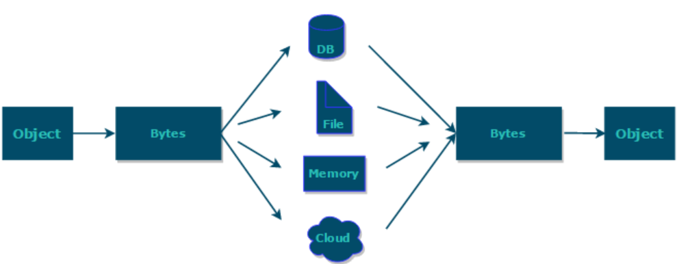
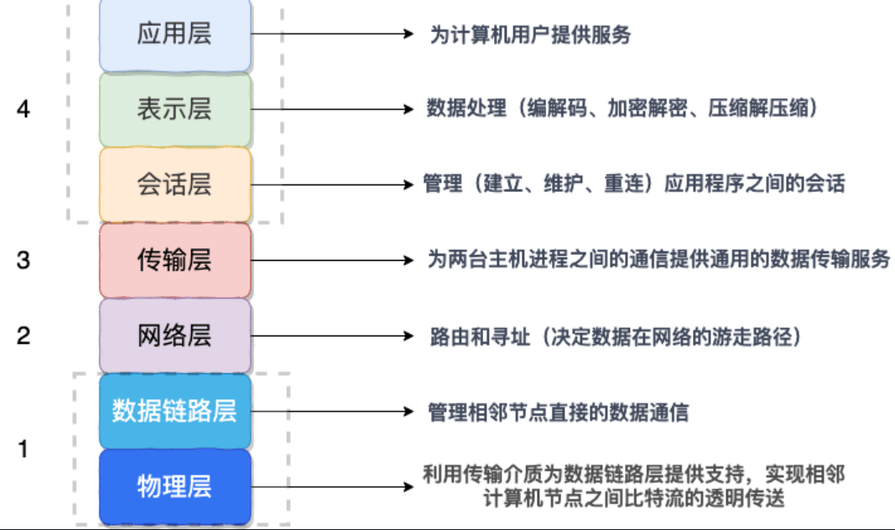
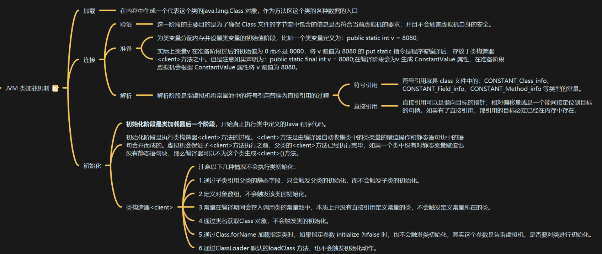
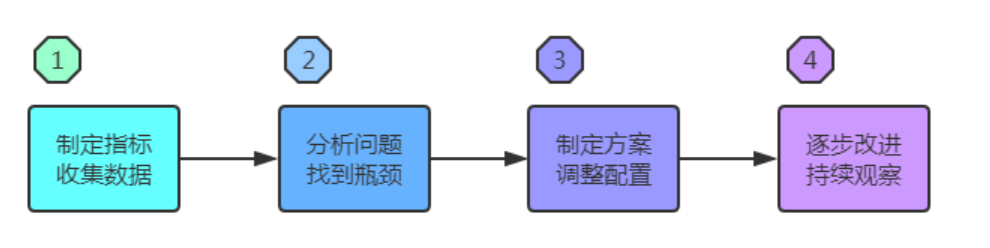
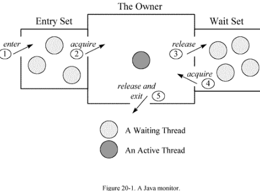

# Java进阶

# 序列化

## 序列化和反序列化

### What？

- **序列化**： 将数据结构或对象转换成二进制字节流的过程
- **反序列化**：将在序列化过程中所生成的二进制字节流的过程转换成数据结构或者对象的过程

对于Java这种面向对象编程语言来说，我们序列化的都是对象（Object）也就是实例化后的类(Class)，但是在C++这种半面向对象的语言中，struct(结构体)定义的是数据结构类型，而class 对应的是对象类型。

目的：通过网络传输对象或者说是将对象存储到文件系统、数据库、内存中。



### Where？

#### 应用场景

- 对象进行网络传输
- 对象存取到文件
- 对象存取到数据库

#### 对应TCP/IP 4层模型哪一层？

应用层（应用层、表示层和会话层）：



## 常见序列化协议

JDK自带的序列化方式一般不会用 ，因为序列化效率低并且部分版本有安全漏洞。比较常用的序列化协议有 hessian、kyro、protostuff。

下面提到的都是基于二进制的序列化协议，像 JSON 和 XML这种属于文本类序列化方式。虽然 JSON 和 XML可读性比较好，但是性能较差，一般不会选择。

### JDK自带的序列化方式

实现 `java.io.Serializable`接口即可

```java
@AllArgsConstructor
@NoArgsConstructor
@Getter
@Builder
@ToString
public class RpcRequest implements Serializable {
    private static final long serialVersionUID = 1905122041950251207L;
    private String requestId;
    private String interfaceName;
    private String methodName;
    private Object[] parameters;
    private Class<?>[] paramTypes;
    private RpcMessageTypeEnum rpcMessageTypeEnum;
}
```

> 序列化号 serialVersionUID 属于版本控制的作用。序列化的时候serialVersionUID也会被写入二级制序列，当反序列化时会检查serialVersionUID是否和当前类的serialVersionUID一致。如果serialVersionUID不一致则会抛出 `InvalidClassException` 异常。强烈推荐每个序列化类都手动指定其 `serialVersionUID`，如果不手动指定，那么编译器会动态生成默认的序列化号

我们很少或者说几乎不会直接使用这个序列化方式，主要原因有两个：

1. **不支持跨语言调用** : 如果调用的是其他语言开发的服务的时候就不支持了。
2. **性能差** ：相比于其他序列化框架性能更低，主要原因是序列化之后的字节数组体积较大，导致传输成本加大

### Kryo

Kryo是一个高性能的序列化/反序列化工具，由于其变长存储特性并使用了字节码生成机制，拥有较高的运行速度和较小的字节码体积。

Kryo 已经是一种非常成熟的序列化实现了，已经在Twitter、Groupon、Yahoo以及多个著名开源项目（如Hive、Storm）中广泛的使用。

```java
/**
 * Kryo serialization class, Kryo serialization efficiency is very high, but only compatible with Java language
 */
@Slf4j
public class KryoSerializer implements Serializer {

    /**
     * Because Kryo is not thread safe. So, use ThreadLocal to store Kryo objects
     */
    private final ThreadLocal<Kryo> kryoThreadLocal = ThreadLocal.withInitial(() -> {
        Kryo kryo = new Kryo();
        kryo.register(RpcResponse.class);
        kryo.register(RpcRequest.class);
        return kryo;
    });

    @Override
    public byte[] serialize(Object obj) {
        try (ByteArrayOutputStream byteArrayOutputStream = new ByteArrayOutputStream();
             Output output = new Output(byteArrayOutputStream)) {
            Kryo kryo = kryoThreadLocal.get();
            // Object->byte:将对象序列化为byte数组
            kryo.writeObject(output, obj);
            kryoThreadLocal.remove();
            return output.toBytes();
        } catch (Exception e) {
            throw new SerializeException("Serialization failed");
        }
    }

    @Override
    public <T> T deserialize(byte[] bytes, Class<T> clazz) {
        try (ByteArrayInputStream byteArrayInputStream = new ByteArrayInputStream(bytes);
             Input input = new Input(byteArrayInputStream)) {
            Kryo kryo = kryoThreadLocal.get();
            // byte->Object:从byte数组中反序列化出对对象
            Object o = kryo.readObject(input, clazz);
            kryoThreadLocal.remove();
            return clazz.cast(o);
        } catch (Exception e) {
            throw new SerializeException("Deserialization failed");
        }
    }

}
```

### Protobuf

### ProtoStuff

### hession

### 扩展

- 美团技术团队-序列化和反序列化：[https://tech.meituan.com/2015/02/26/serialization-vs-deserialization.htmlopen in new window](https://tech.meituan.com/2015/02/26/serialization-vs-deserialization.html)
- 在Dubbo中使用高效的Java序列化（Kryo和FST）: https://dubbo.apache.org/zh-cn/docs/user/serialization.html

# JAVA反射机制

## WHAT？

通过放射可以获取任意一个类的所有属性和方法，还可以调用这些方法和属性

## 应用场景

框架中大量使用了动态代理，而动态代理的实现也依赖反射。

Java注解的实现也使用了反射。

JDK动态代理示例

```java
public class DebugInvocationHandler implements InvocationHandler {
    /**
     * 代理类中的真实对象
     */
    private final Object target;

    public DebugInvocationHandler(Object target) {
        this.target = target;
    }


    public Object invoke(Object proxy, Method method, Object[] args) throws InvocationTargetException, IllegalAccessException {
        System.out.println("before method " + method.getName());
        Object result = method.invoke(target, args);
        System.out.println("after method " + method.getName());
        return result;
    }
}
```

## 优缺点

优点

代码更加灵活、为许多框架提供开箱即用的功能

- 缺点

  运行时分析操作类，增加了安全问题，如无视泛型参数的安全检查（泛型参数的安全检查发生在编译时）。

  放射性能差，但是对于框架来说实际影响不大。

- 放射为什么慢？

  1.编译器和JIT即时编译器无法进行优化，因为它们不知道我们要做的操作是什么

  2.任何被反射或创建的东西要被发现，如类通过类名查找、寻找匹配的方法

  3.参数需要装箱和拆箱，包装成arrays、Exceptions包装成InvocationTargetException。

## 实战

#### 获取Class对象的四种方法

- 由具体类名：

  ```java
  Class clazz=Target.class;
  // 但是我们一般是不知道具体的类，基本都是通过遍历包下面的类来获取Class对象，通过此方式获取Class对象不会进行初始化
  ```

  ```
  Class clazz=Class.forName("com.alisa.Target");
  ```

- 由实例对象

  ```
  Class clazz=target.getClass();
  ```

- 由类加载器

  ```
  Class clazz=ClassLoader.loadClass("com.alisa.Target");
  // 通过类加载器获取Class对象不会进行初始化，意味着静态代码块和静态对象不会得到执行
  ```



#### 反射的一些基本操作

```java
// 1.定义类
public class Target{
	private String value;
	
	public Target(){
		value="Target";
	}
	
	public void publicMethod(String s){
		System.out.println("public method");
	}
	
	private void privateMethod(){
		System.out.println("private method");
	}
	
}
```

```java
// 2.使用反射
public class Main{
    public static void main(String[] args) throws ClassNotFoundException,NoSuchMethodException{
        // 获取类对象，创建类实例
        Class<?> clazz=Class.forName("com.alisa.Target");
        // 调用方法、设置成员变量需要传入实例对象，才可以调用
        Target target=(Target) clazz.newInstance();
        
        // 获取类中的方法
        Method[] methods=clazz.getDeclaredMethods();
        
        // 获取指定方法并调用
        Method publicMethod=clazz.getDeclaredMethod("publicMethod",String.class);
        publicMethod.invoke(target,"invoke the publicMethod");
        
        // 获取指定成员变量并对成员变量进行修改（成员变量：类中，局部变量：方法中）
        Field field=clazz.getDeclaredField("value");
        // 为了类中的参数进行修改取消安全检查
        field.setAccessible(true);
        field.set(target,"set value");
        
        // 调用private方法
        Method privateMethod=clazz.getDeclaredMethod("privateMethod");
        // 取消安全检查
        privateMethod.setAccessible(true);
        privateMethod.invoke(target);
    }
}
```

# Java代理模式

## 代理模式

代理目的：扩展目标对象的功能，比如在目标对象的某个方法执行前后添加自定义操作

## 静态代理

每个方法的增强都要手动完成，非常不灵活且麻烦（比如接口一旦增加新方法，目标对象和代理对象都要进行修改）

从JVM层面来说，静态代理在编译时就将接口、实现类、代理类都变成一个个实际的class文件

实现步骤：

- 定义接口及其实现类；

  ```java
  public interface SmsService{
  	String send(String message)
  }
  ```

  ```java
  public class SmsServiceImpl implements SmsService {
      @Override
      public String send(String message) {
          System.out.println("send message:" + message);
          return message;
      }
  }
  ```

- 创建实现接口的代理类

  ```java
  public class SmsProxy implements SmsService {
  
      private final SmsService smsService;
  
      public SmsProxy(SmsService smsService) {
          this.smsService = smsService;
      }
  
      @Override
      public String send(String message) {
          //调用方法之前，我们可以添加自己的操作
          System.out.println("before method send()");
          smsService.send(message);
          //调用方法之后，我们同样可以添加自己的操作
          System.out.println("after method send()");
          return null;
      }
  }
  
  ```

- 将目标对象注入代理类，在代理类对应方法调用目标类中对应方法。屏蔽代理类对目标对象的访问。

  ```java
  public class Main {
      public static void main(String[] args) {
          SmsService smsService = new SmsServiceImpl();
          SmsProxy smsProxy = new SmsProxy(smsService);
          smsProxy.send("java");
      }
  }
  ```

  ```
  before method send()
  send message:java
  after method send()
  ```

## 动态代理

从 JVM 角度来说，动态代理是在运行时动态生成类字节码，并加载到 JVM 中的。

Spring AOP、RPC 框架的实现都依赖了动态代理。

### JDK动态代理机制

 Java 动态代理机制中 `InvocationHandler` 接口和 `Proxy` 类是核心。

```java
// Proxy.newProxyInstance()方法生成一个代理对象
// 三个参数：loader:类加载器，用于加载代理对象；interfaces：被代理类实现的一些接口；h：实现InvocationHandler接口的对象
public static Object newProxyInstance(ClassLoader loader,Class<?>[] interfaces,
																InvocationHandler h)
      throws IllegalArgumentException
{
      ......
}

```

```java
// 实现InvocationHandler 来自定义处理逻辑
// 动态代理对象调用一个方法时，这个方法的调用就会被转发到实现InvocationHandler 接口类的 invoke 方法来调用。
public interface InvocationHandler {

    /**
     * 当你使用代理对象调用方法的时候实际会调用到这个方法
     * 三个参数：
     proxy :动态生成的代理类；
     method : 与代理类对象调用的方法相对应；
     args : 当前 method 方法的参数
     */
    public Object invoke(Object proxy, Method method, Object[] args)
        throws Throwable;
}
```

使用步骤：

- 定义接口和实现类

  ```java
  public interface SmsService {
      String send(String message);
  }
  ```

  ```java
  public class SmsServiceImpl implements SmsService {
      public String send(String message) {
          System.out.println("send message:" + message);
          return message;
      }
  }
  ```

- 自定义 `InvocationHandler` 并重写`invoke`方法，在 `invoke` 方法中我们会调用原生方法（被代理类的方法）并自定义一些处理逻辑；

  ```java
  import java.lang.reflect.*;
  
  public class DebugInvocationHandler implements InvocationHandler {
      /**
       * 代理类中的真实对象
       */
      private final Object target;
  
      public DebugInvocationHandler(Object target) {
          this.target = target;
      }
  
  
      public Object invoke(Object proxy, Method method, Object[] args) throws InvocationTargetException, IllegalAccessException {
          //调用方法之前，我们可以添加自己的操作
          System.out.println("before method " + method.getName());
          Object result = method.invoke(target, args);
          //调用方法之后，我们同样可以添加自己的操作
          System.out.println("after method " + method.getName());
          return result;
      }
  }
  ```

- 通过 `Proxy.newProxyInstance(ClassLoader loader,Class<?>[] interfaces,InvocationHandler h)` 方法创建代理对象；

  ```java
  // 获取代理对象的工厂类
  public class JdkProxyFactory {
      public static Object getProxy(Object target) {
          return Proxy.newProxyInstance(
                  target.getClass().getClassLoader(), // 目标类的类加载
                  target.getClass().getInterfaces(),  // 代理需要实现的接口，可指定多个
                  new DebugInvocationHandler(target)   // 代理对象对应的自定义 InvocationHandler
          );
      }
  }
  ```

  ```java
  SmsService smsServiceProxy = (SmsService) JdkProxyFactory.getProxy(new SmsServiceImpl());
  smsServiceProxy.send("java");
  ```

  ```
  before method send
  send message:java
  after method send
  ```

### CGLIB动态代理机制

JDK动态代理缺点：只能代理实现了接口的类

[CGLIB](https://github.com/cglib/cglib)(*Code Generation Library*)是一个基于[ASM](http://www.baeldung.com/java-asm)的字节码生成库，它允许我们在运行时对字节码进行修改和动态生成。CGLIB 通过继承方式实现代理。很多知名的开源框架都使用到了CGLIB， 如 Spring 中的 AOP 模块中：**如果目标对象实现了接口，则默认采用 JDK 动态代理，否则采用 CGLIB 动态代理**。

**在 CGLIB 动态代理机制中 `MethodInterceptor` 接口和 `Enhancer` 类是核心。**

```java
// 需要自定义 MethodInterceptor 并重写 intercept 方法，intercept 用于拦截增强被代理类的方法。
public interface MethodInterceptor extends Callback{
    // 拦截被代理类中的方法
    public Object intercept(Object obj,    // 被代理对象
    						java.lang.reflect.Method method,  // 被拦截方法
    						Object[] args,  // 方法参数
                            MethodProxy proxy  // 用于调用原始方法
                           						) throws Throwable;
}
```

使用步骤：

- 添加依赖

  ```xml
  <dependency>
    <groupId>cglib</groupId>
    <artifactId>cglib</artifactId>
    <version>3.3.0</version>
  </dependency>
  ```

- 定义一个类

  ```java
  public class SmsService {
      public String send(String message) {
          System.out.println("send message:" + message);
          return message;
      }
  }
  
  ```

- 自定义 `MethodInterceptor` 并重写 `intercept` 方法，`intercept` 用于拦截增强被代理类的方法，和 JDK 动态代理中的 `invoke` 方法类似；

  ```java
  // 自定义MethodInterceptor
  public class DebugMethodInterceptor implements MethodInterceptor {
  
      /**
       * @param o           代理对象（增强的对象）
       * @param method      被拦截的方法（需要增强的方法）
       * @param args        方法入参
       * @param methodProxy 用于调用原始方法
       */
      @Override
      public Object intercept(Object o, Method method, Object[] args, MethodProxy methodProxy) throws Throwable {
          //调用方法之前，我们可以添加自己的操作
          System.out.println("before method " + method.getName());
          // CGLIB 动态代理是通过生成一个被代理类的子类来拦截被代理类的方法调用
          Object object = methodProxy.invokeSuper(o, args);
          //调用方法之后，我们同样可以添加自己的操作
          System.out.println("after method " + method.getName());
          return object;
      }
  
  }
  ```

- 通过 `Enhancer` 类的 `create()`创建代理类

  ```java
  public class CglibProxyFactory {
      public static Object getProxy(Class<?> clazz) {
          // 创建动态代理增强类
          Enhancer enhancer = new Enhancer();
          // 设置类加载器
          enhancer.setClassLoader(clazz.getClassLoader());
          // 设置被代理类
          enhancer.setSuperclass(clazz);
          // 设置方法拦截器
          enhancer.setCallback(new DebugMethodInterceptor());
          // 创建代理类
          return enhancer.create();
      }
  }
  
  ```

  ```java
  SmsService smsServiceProxy = (SmsService) CglibProxyFactory.getProxy(AliSmsService.class);
  smsServiceProxy.send("java");
  ```

  ```
  before method send
  send message:java
  after method send
  ```

### JDK动态代理 VS CGLIB动态代理

- JDK动态代理只能代理实现了接口的类或直接代理接口，而CGLIB可以代理未实现任何接口的类。另外， CGLIB 动态代理是通过生成一个被代理类的子类来拦截被代理类的方法调用，因此不能代理声明为 final 类型的类和方法。
- 效率而言，JDK动态代理更优秀，特别是随着JDK版本的升级更明显。

### 静态代理 VS 动态代理

- 灵活性

  静态代理的代理类需要实现接口，如果接口增加新方法，目标对象和代理对象都要进行修改。

  动态代理更加灵活，代理不需要实现接口（newProxyInstance方法），可以直接代理实现类，并且不需要对每个目标类都创建一个代理。

- JVM层面

  静态代理在编译时就将接口、实现类、代理类都变成一个个实际的class文件。

  动态代理是在运行时动态生成类字节码，并加载到JVM中的

### Conclusion

# I/O

## IO分类

### 从传输方式上

从数据传输方式或者说是运输方式角度看，可以将 IO 类分为:

- 字节流
- 字符流

`字节`是个计算机看的，`字符`才是给人看的

#### 字节流和字符流的区别

- 字节流读取单个字节，字符流读取单个字符(一个字符根据编码的不同，对应的字节也不同，如 UTF-8 编码是 3 个字节，中文编码是 2 个字节。)
- 字节流用来处理二进制文件(图片、MP3、视频文件)，字符流用来处理文本文件(可以看做是特殊的二进制文件，使用了某种编码，人可以阅读)。


#### 字节转字符Input/OutputStream->Reader/Writer

编码：把字符转换为字节；

解码：把字节组合成字符。

如果编码和解码过程使用不同的编码方式那么就出现了乱码。

- GBK 编码中，中文字符占 2 个字节，英文字符占 1 个字节；
- UTF-8 编码中，中文字符占 3 个字节，英文字符占 1 个字节；
- UTF-16be 编码中，中文字符和英文字符都占 2 个字节。

UTF-16be 中的 be 指的是 Big Endian，也就是大端。相应地也有 UTF-16le，le 指的是 Little Endian，也就是小端。

Java 使用双字节编码 UTF-16be，这不是指 Java 只支持这一种编码方式，而是说 char 这种类型使用 UTF-16be 进行编码。char 类型占 16 位，也就是两个字节，Java 使用这种双字节编码是为了让一个中文或者一个英文都能使用一个 char 来存储。


### 从数据操作上

从数据来源或者说是操作对象角度看，IO 类可以分为:


#### 文件(file)

FileInputStream、FileOutputStream、FileReader、FileWriter

#### 数组

- 字节数组(byte[]): ByteArrayInputStream、ByteArrayOutputStream
- 字符数组(char[]): CharArrayReader、CharArrayWriter

#### 管道操作

PipedInputStream、PipedOutputStream、PipedReader、PipedWriter

#### 基本数据类型

DataInputStream、DataOutputStream

#### 缓冲操作

BufferedInputStream、BufferedOutputStream、BufferedReader、BufferedWriter

#### 打印

PrintStream、PrintWriter

#### 对象序列化反序列化

ObjectInputStream、ObjectOutputStream

#### 转换

InputStreamReader、OutputStreamWriter


## 设计模式—装饰者模式

Java I/O 使用了装饰者模式来实现

装饰者(Decorator)和具体组件(ConcreteComponent)都继承自组件(Component)，具体组件的方法实现不需要依赖于其它对象，而装饰者组合了一个组件，这样它可以装饰其它装饰者或者具体组件。所谓装饰，就是把这个装饰者套在被装饰者之上，从而动态扩展被装饰者的功能。装饰者的方法有一部分是自己的，这属于它的功能，然后调用被装饰者的方法实现，从而也保留了被装饰者的功能。可以看到，具体组件应当是装饰层次的最低层，因为只有具体组件的方法实现不需要依赖于其它对象。


以 InputStream 为例，

- InputStream 是抽象组件；
- FileInputStream 是 InputStream 的子类，属于具体组件，提供了字节流的输入操作；
- FilterInputStream 属于抽象装饰者，装饰者用于装饰组件，为组件提供额外的功能。例如 BufferedInputStream 为 FileInputStream 提供缓存的功能。


实例化一个具有缓存功能的字节流对象时，只需要在 FileInputStream 对象上再套一层 BufferedInputStream 对象即可。

```java
FileInputStream fileInputStream = new FileInputStream(filePath);
BufferedInputStream bufferedInputStream = new BufferedInputStream(fileInputStream);
    
```

DataInputStream 装饰者提供了对更多数据类型进行输入的操作，比如 int、double 等基本类型。


## InputStream源码分析

### InputStream类实现关系


### InputStream抽象类

```java
public abstract int read() 
// 读取数据

public int read(byte b[]) 
// 将读取到的数据放在 byte 数组中，该方法实际上是根据下面的方法实现的，off 为 0，len 为数组的长度

public int read(byte b[], int off, int len) 
// 从第 off 位置读取 len 长度字节的数据放到 byte 数组中，流是以 -1 来判断是否读取结束的

public long skip(long n) 
// 跳过指定个数的字节不读取，想想看电影跳过片头片尾

public int available() 
// 返回可读的字节数量

public void close() 
// 读取完，关闭流，释放资源

public synchronized void mark(int readlimit) 
// 标记读取位置，下次还可以从这里开始读取，使用前要看当前流是否支持，可以使用 markSupport() 方法判断

public synchronized void reset() 
// 重置读取位置为上次 mark 标记的位置

public boolean markSupported() 
// 判断当前流是否支持标记流，和上面两个方法配套使用
```


### 源码实现

#### InputStream

```java
public abstract class InputStream implements Closeable {
    private static final int SKIP_BUFFER_SIZE = 2048;  //用于skip方法，和skipBuffer相关
    private static byte[] skipBuffer;    // skipBuffer is initialized in skip(long), if needed.
    
    //从输入流中读取下一个字节，
    //正常返回0-255，到达文件的末尾返回-1
    //在流中还有数据，但是没有读到时该方法会阻塞(block)
    //Java IO和New IO的区别就是阻塞流和非阻塞流
    //抽象方法！不同的子类不同的实现！
    public abstract int read() throws IOException;  
    
    //将流中的数据读入放在byte数组的第off个位置先后的len个位置中
    //返回值为放入字节的个数。
    //这个方法在利用抽象方法read，某种意义上简单的Templete模式。
    public int read(byte b[], int off, int len) throws IOException {
        //检查输入是否正常。一般情况下，检查输入是方法设计的第一步
        if (b == null) {    
            throw new NullPointerException();
        } else if (off < 0 || len < 0 || len > b.length - off) {
             throw new IndexOutOfBoundsException();
        } else if (len == 0) {
             return 0;
        }        
        //读取下一个字节
        int c = read();
        //到达文件的末端返回-1
        if (c == -1) {    return -1;   }
        //返回的字节downcast                           
        b[off] = (byte)c;
        //已经读取了一个字节                                                   
        int i = 1;                                                                        
        try {
            //最多读取len个字节，所以要循环len次
            for (; i < len ; i++) {
                //每次循环从流中读取一个字节
                //由于read方法阻塞，
                //所以read(byte[],int,int)也会阻塞
                c = read();
                //到达末尾，理所当然返回-1                                       
                if (c == -1) {            break;           } 
                //读到就放入byte数组中
                b[off + i] = (byte)c;
            }
        } catch (IOException ee) {     }
        return i;
    }

     //利用上面的方法read(byte[] b)
    public int read(byte b[]) throws IOException {
        return read(b, 0, b.length);
     }                          
    //方法内部使用的、表示要跳过的字节数目，
     public long skip(long n) throws IOException {
        long remaining = n;    
        int nr;
        if (skipBuffer == null)
        //初始化一个跳转的缓存
        skipBuffer = new byte[SKIP_BUFFER_SIZE];                   
        //本地化的跳转缓存
        byte[] localSkipBuffer = skipBuffer;          
        //检查输入参数，应该放在方法的开始                            
        if (n <= 0) {    return 0;      }                             
        //一共要跳过n个，每次跳过部分，循环       
        while (remaining > 0) {                                      
            nr = read(localSkipBuffer, 0, (int) Math.min(SKIP_BUFFER_SIZE, remaining));
            //利用上面的read(byte[],int,int)方法尽量读取n个字节  
            //读到流的末端，则返回
            if (nr < 0) {  break;    }
            //没有完全读到需要的，则继续循环
            remaining -= nr;                                       
        }       
        return n - remaining;//返回时要么全部读完，要么因为到达文件末端，读取了部分
    }
    //查询流中还有多少可以读取的字节
    //该方法不会block。在java中抽象类方法的实现一般有以下几种方式: 
    //1.抛出异常(java.util)；2.“弱”实现。像上面这种。子类在必要的时候覆盖它。
    //3.“空”实现。
    public int available() throws IOException {           
        return 0;
    }
    //关闭当前流、同时释放与此流相关的资源
    //关闭当前流、同时释放与此流相关的资源
    public void close() throws IOException {}
    //markSupport可以查询当前流是否支持mark
    public synchronized void mark(int readlimit) {}
    //对mark过的流进行复位。只有当流支持mark时才可以使用此方法。
    public synchronized void reset() throws IOException {

                   throw new IOException("mark/reset not supported");

}
    //查询是否支持mark
    //绝大部分不支持，因此提供默认实现，返回false。子类有需要可以覆盖。
    public boolean markSupported() {           
        return false;
    }
}
```


#### FilterInputStream

```java
public class FilterInputStream extends InputStream {
    //装饰器的代码特征: 被装饰的对象一般是装饰器的成员变量
    protected volatile InputStream in; //将要被装饰的字节输入流
    protected FilterInputStream(InputStream in) {   //通过构造方法传入此被装饰的流
        this.in = in;
     }
    //下面这些方法，完成最小的装饰――0装饰，只是调用被装饰流的方法而已
    public int read() throws IOException {
        return in.read();
    }
    public int read(byte b[]) throws IOException {
        return read(b, 0, b.length);
     }
    public int read(byte b[], int off, int len) throws IOException {
        return in.read(b, off, len);
     }
    public long skip(long n) throws IOException {
        return in.skip(n);
    }
    public int available() throws IOException {
        return in.available();
    }
    public void close() throws IOException {
        in.close();
    }
    public synchronized void mark(int readlimit) {
        in.mark(readlimit);
     }
    public synchronized void reset() throws IOException {
        in.reset();
    }
    public boolean markSupported() {
        return in.markSupported();
    }
}
```


#### ByteArrayInputStream

```java
public class ByteArrayInputStream extends InputStream {
    protected byte buf[];                //内部的buffer，一般通过构造器输入
    protected int pos;                   //当前位置的cursor。从0至byte数组的长度。
    //byte[pos]就是read方法读取的字节
    protected int mark = 0;           //mark的位置。
    protected int count;              //流中字节的数目。

    //构造器，从一个byte[]创建一个ByteArrayInputStream
     public ByteArrayInputStream(byte buf[]) {
        //初始化流中的各个成员变量
        this.buf = buf;              
        this.pos = 0;
        this.count = buf.length;
     }
    //构造器
     public ByteArrayInputStream(byte buf[], int offset, int length) {                
        this.buf = buf;
        this.pos = offset; //与上面不同
        this.count = Math.min(offset + length, buf.length);
        this.mark = offset; //与上面不同
    }
    //从流中读取下一个字节
     public synchronized int read() {           
        //返回下一个位置的字节//流中没有数据则返回-1
        return (pos < count) ? (buf[pos++] & 0xff) : -1; 
    }
    // ByteArrayInputStream要覆盖InputStream中可以看出其提供了该方法的实现
    //某些时候，父类不能完全实现子类的功能，父类的实现一般比较通用。
    //当子类有更有效的方法时，我们会覆盖这些方法。
    public synchronized int read(byte b[], int off, int len) {
        //首先检查输入参数的状态是否正确
        if(b==null){ 
            throw new NullPointerException();
        } else if (off < 0 || len < 0 || len > b.length - off) {
            throw new IndexOutOfBoundsException();
        }
        if (pos >= count) {             return -1;             }
        if (pos + len > count) {      len = count - pos;         }
        if (len <= 0) {           return 0;     }
        //java中提供数据复制的方法
        //出于速度的原因！他们都用到System.arraycopy方法
        System.arraycopy(buf, pos, b, off, len); 
        pos += len;
        return len;
    }
    //下面这个方法，在InputStream中也已经实现了。
    //但是当时是通过将字节读入一个buffer中实现的，好像效率低了一点。
    //比InputStream中的方法简单、高效
    public synchronized long skip(long n) {
        //当前位置，可以跳跃的字节数目
        if (pos + n > count) {    n = count - pos;       }       
        //小于0，则不可以跳跃
         if (n < 0) {       return 0;     }   
        //跳跃后，当前位置变化                                 
        pos += n;                                                                              
        return n;
    }   
    //查询流中还有多少字节没有读取。                                 
public synchronized int available() {
    return count - pos;
    }
    //ByteArrayInputStream支持mark所以返回true
    public boolean markSupported() {                   

                   return true;

}  
    //在流中当前位置mark。      
    public void mark(int readAheadLimit) {            
        mark = pos;
     }
    //重置流。即回到mark的位置。
    public synchronized void reset() {
        pos = mark;
    }
    //关闭ByteArrayInputStream不会产生任何动作。
    public void close() throws IOException {   }
}
```


#### BufferedInputStream

```java
public class BufferedInputStream extends FilterInputStream {
    private static int defaultBufferSize = 8192;    //默认缓存的大小
    protected volatile byte buf[];  //内部的缓存
    protected int count;     //buffer的大小
    protected int pos;      //buffer中cursor的位置
    protected int markpos = -1;    //mark的位置
    protected int marklimit;     //mark的范围
    
    //原子性更新。和一致性编程相关
    private static final    
    AtomicReferenceFieldUpdater<BufferedInputStream, byte[]> bufUpdater =
    AtomicReferenceFieldUpdater.newUpdater (BufferedInputStream.class, byte[].class,"buf");
    //检查输入流是否关闭，同时返回被包装流
     private InputStream getInIfOpen() throws IOException {
        InputStream input = in;
        if (input == null)    throw new IOException("Stream closed");
        return input;
    }
    //检查buffer的状态，同时返回缓存
    private byte[] getBufIfOpen() throws IOException {                       
        byte[] buffer = buf;
        //不太可能发生的状态
        if (buffer == null)   throw new IOException("Stream closed");    
        return buffer;
    }

    //构造器
public BufferedInputStream(InputStream in) {
    //指定默认长度的buffer
        this(in, defaultBufferSize);                                                              
    }
    //构造器
    public BufferedInputStream(InputStream in, int size) {                           
        super(in);
        //检查输入参数
        if(size<=0){
            throw new IllegalArgumentException("Buffer size <= 0");
        }
        //创建指定长度的buffer
        buf = new byte[size]; 
    }
    //从流中读取数据，填充如缓存中。
    private void fill() throws IOException {
        //得到buffer
        byte[] buffer = getBufIfOpen();                            
            if (markpos < 0)
            //mark位置小于0，此时pos为0
            pos = 0;
            //pos大于buffer的长度            
            else if (pos >= buffer.length) 
            if (markpos > 0) {        
                int sz = pos - markpos;                                                           
　　　　　　　　　 System.arraycopy(buffer, markpos, buffer, 0, sz);
                pos = sz;
                markpos = 0;
            } else if (buffer.length >= marklimit) {                 
                //buffer的长度大于marklimit时，mark失效
                markpos = -1; 
                //丢弃buffer中的内容                                                                  
　　　　　　　　　 pos = 0;                                    
            }else{                                                                         
                //buffer的长度小于marklimit时对buffer扩容
                int nsz = pos * 2;
                if (nsz > marklimit) 
                    nsz = marklimit;//扩容为原来的2倍，太大则为marklimit大小
                    byte nbuf[] = new byte[nsz];                   
                    //将buffer中的字节拷贝如扩容后的buf中    
                    System.arraycopy(buffer, 0, nbuf, 0, pos);        
                    if (!bufUpdater.compareAndSet(this, buffer, nbuf)) {    
                    //在buffer在被操作时，不能取代此buffer
                    throw new IOException("Stream closed");
                }
                //将新buf赋值给buffer
                buffer = nbuf;                                                               
            }
            count = pos;
            int n = getInIfOpen().read(buffer, pos, buffer.length - pos);
            if (n > 0)     count = n + pos;
        }
        //读取下一个字节
        public synchronized int read() throws IOException { 
        //到达buffer的末端    
        if (pos >= count) {                                                                 
            //就从流中读取数据，填充buffer 
            fill();                                                                                
　　　　　　　//读过一次，没有数据则返回-1
            if (pos >= count)  return -1;                                
        }
        //返回buffer中下一个位置的字节
        return getBufIfOpen()[pos++] & 0xff;                           
    }
    //将数据从流中读入buffer中
     private int read1(byte[] b, int off, int len) throws IOException {                 
        int avail = count - pos; //buffer中还剩的可读字符                                                                            
        //buffer中没有可以读取的数据时
        if(avail<=0){                                                                                        
            //将输入流中的字节读入b中
            if (len >= getBufIfOpen().length && markpos < 0) {             
                return getInIfOpen().read(b, off, len);
            }
            fill();//填充                                                                                               
            avail = count - pos;
            if (avail <= 0) return -1;
        }
        //从流中读取后，检查可以读取的数目
        int cnt = (avail < len) ? avail : len;                                                  
        //将当前buffer中的字节放入b的末端
        System.arraycopy(getBufIfOpen(), pos, b, off, cnt);            
        pos += cnt;
        return cnt;
    }

    public synchronized int read(byte b[], int off, int len)throws IOException {
        getBufIfOpen();                                                                                     
　　　　　// 检查buffer是否open
        //检查输入参数是否正确
        if ((off | len | (off + len) | (b.length - (off + len))) < 0) {           
            throw new IndexOutOfBoundsException();
        } else if (len == 0) {
            return 0;
        }
        int n = 0;
        for (;;) {
            int nread = read1(b, off + n, len - n);
            if (nread <= 0)     return (n == 0) ? nread : n;
            n += nread;
            if (n >= len)     return n;
            InputStream input = in;
            if (input != null && input.available() <= 0)     return n;
        }
    }

    public synchronized long skip(long n) throws IOException {
        // 检查buffer是否关闭
        getBufIfOpen();                                        
        //检查输入参数是否正确
        if (n <= 0) {    return 0;      }                 
        //buffered中可以读取字节的数目
        long avail = count - pos;                    
        //可以读取的小于0，则从流中读取
        if (avail <= 0) {                                          
            //mark小于0，则mark在流中 
            if (markpos <0)  return getInIfOpen().skip(n);     
            // 从流中读取数据，填充缓冲区。
            fill();                                  
            //可以读的取字节为buffer的容量减当前位置
            avail = count - pos;                                   
            if (avail <= 0)     return 0;
        }       
        long skipped = (avail < n) ? avail : n;      
        pos += skipped;                                       
　　　　　//当前位置改变
        return skipped;
    }
    //该方法不会block！返回流中可以读取的字节的数目。
    //该方法的返回值为缓存中的可读字节数目加流中可读字节数目的和
    public synchronized int available() throws IOException {
        return getInIfOpen().available() + (count - pos);                 
    }

    //当前位置处为mark位置
    public synchronized void mark(int readlimit) {  
        marklimit = readlimit;
        markpos = pos;
    }

    public synchronized void reset() throws IOException {
        // 缓冲去关闭了，肯定就抛出异常！程序设计中经常的手段
        getBufIfOpen();
        if (markpos < 0)     throw new IOException("Resetting to invalid mark");
        pos = markpos;
    }
    //该流和ByteArrayInputStream一样都支持mark
    public boolean markSupported() {           
        return true;
    }
    //关闭当前流同时释放相应的系统资源。
    public void close() throws IOException {
        byte[] buffer;
        while ( (buffer = buf) != null) {
            if (bufUpdater.compareAndSet(this, buffer, null)) {
            InputStream input = in;
            in = null;
            if (input != null)    input.close();
            return;
        }
        // Else retry in case a new buf was CASed in fill()
        }
    }
}
```


#### PipedInputStream

```java
public class PipedInputStream extends InputStream {
    //标识有读取方或写入方关闭
    boolean closedByWriter = false;                                                             
    volatile boolean closedByReader = false;    
    //是否建立连接
    boolean connected = false;                                                                     
    //标识哪个线程
    Thread readSide;                                                                                             
    Thread writeSide;
    //缓冲区的默认大小
    protected static final int PIPE_SIZE = 1024;                         
    //缓冲区
    protected byte buffer[] = new byte[PIPE_SIZE];                 
    //下一个写入字节的位置。0代表空，in==out代表满
    protected int in = -1;               
    //下一个读取字节的位置
protected int out = 0;    
          
    //给定源的输入流
    public PipedInputStream(PipedOutputStream src) throws IOException {                
        connect(src);
    }
    //默认构造器，下部一定要connect源
    public PipedInputStream() {    }                                                
    //连接输入源
    public void connect(PipedOutputStream src) throws IOException {               
        //调用源的connect方法连接当前对象
        src.connect(this);                                                                           
    }
    //只被PipedOuputStream调用
    protected synchronized void receive(int b) throws IOException {                  
        //检查状态，写入
        checkStateForReceive();                                                                                 
        //永远是PipedOuputStream
        writeSide = Thread.currentThread();                                                      
        //输入和输出相等，等待空间
        if (in == out)     awaitSpace();                                                           
        if (in < 0) {
            in = 0;
            out = 0;
        }
        //放入buffer相应的位置
        buffer[in++] = (byte)(b & 0xFF);                                                             
        //in为0表示buffer已空
        if (in >= buffer.length) {      in = 0;         }                                             
    }

    synchronized void receive(byte b[], int off, int len)  throws IOException {
        checkStateForReceive();
        //从PipedOutputStream可以看出
        writeSide = Thread.currentThread();                                   
        int bytesToTransfer = len;
        while (bytesToTransfer > 0) {
            //满了，会通知读取的；空会通知写入
            if (in == out)    awaitSpace();                                
            int nextTransferAmount = 0;
            if (out < in) {
                nextTransferAmount = buffer.length - in;
            } else if (in < out) {
                if (in == -1) {
                in = out = 0;
                nextTransferAmount = buffer.length - in;
            } else {
                nextTransferAmount = out - in;
            }
        }
        if (nextTransferAmount > bytesToTransfer)  nextTransferAmount = bytesToTransfer;
        assert(nextTransferAmount > 0);
        System.arraycopy(b, off, buffer, in, nextTransferAmount);
        bytesToTransfer -= nextTransferAmount;
        off += nextTransferAmount;
        in += nextTransferAmount;
        if (in >= buffer.length) {     in = 0;      }
        }
    }
    //检查当前状态，等待输入
    private void checkStateForReceive() throws IOException {                           
        if (!connected) {
            throw new IOException("Pipe not connected");
        } else if (closedByWriter || closedByReader) {
            throw new IOException("Pipe closed");
        } else if (readSide != null && !readSide.isAlive()) {
            throw new IOException("Read end dead");
        }
    }
    
    //Buffer已满，等待一段时间
    private void awaitSpace() throws IOException {                                              
        //in==out表示满了，没有空间
        while (in == out) {                                                                                             
            //检查接受端的状态
            checkStateForReceive();                                                                       
            //通知读取端
            notifyAll();                                                                                  
            try {
                wait(1000);
            } catch (InterruptedException ex) {
                throw new java.io.InterruptedIOException();
            }
        }
    }

    //通知所有等待的线程()已经接受到最后的字节
    synchronized void receivedLast() {                  
        closedByWriter = true;                             //
        notifyAll();
    }

    public synchronized int read()  throws IOException {
        //检查一些内部状态
        if (!connected) {                                                                              
            throw new IOException("Pipe not connected");
        } else if (closedByReader) {
            throw new IOException("Pipe closed");
        } else if (writeSide != null && !writeSide.isAlive()&& !closedByWriter && (in < 0)) {
            throw new IOException("Write end dead");
        }
        //当前线程读取
        readSide = Thread.currentThread();                                            
        //重复两次? ? ? 
          int trials = 2;                                                                               
        while (in < 0) {
        //输入断关闭返回-1
        if (closedByWriter) {              return -1;        }                 
            //状态错误
            if ((writeSide != null) && (!writeSide.isAlive()) && (--trials < 0)) {         
                throw new IOException("Pipe broken");
            }
            notifyAll();        // 空了，通知写入端可以写入                                                                         try {
                wait(1000);
            } catch (InterruptedException ex) {
                throw new java.io.InterruptedIOException();
            }
        }
        int ret = buffer[out++] & 0xFF;                                                                         if (out >= buffer.length) {             out = 0;                }
        //没有任何字节
        if (in == out) {           in = -1;                 }                             
        return ret;
    }

    public synchronized int read(byte b[], int off, int len)  throws IOException {
        //检查输入参数的正确性
         if (b == null) {                                                                                 
            throw new NullPointerException();
        } else if (off < 0 || len < 0 || len > b.length - off) {
            throw new IndexOutOfBoundsException();
        } else if (len == 0) {
            return 0;
        }
        //读取下一个
         int c = read();                                                                                 
        //已经到达末尾了，返回-1
        if (c < 0) {    return -1;       }                                            
        //放入外部buffer中
        b[off] = (byte) c;                                                                    
        //return-len
        int rlen = 1;                                                                            
        //下一个in存在，且没有到达len
        while ((in >= 0) && (--len > 0)) {                                          
            //依次放入外部buffer
            b[off + rlen] = buffer[out++];                                         
            rlen++;
            //读到buffer的末尾，返回头部
            if (out >= buffer.length) {         out = 0;           }        
            //读、写位置一致时，表示没有数据
            if (in == out) {     in = -1;      }               
        }
        //返回填充的长度
        return rlen;                                                                            
    }
    //返回还有多少字节可以读取
    public synchronized int available() throws IOException {             
        //到达末端，没有字节
        if(in < 0)
            return 0;                                                                                         
        else if(in == out)
            //写入的和读出的一致，表示满
            return buffer.length;                                                               
        else if (in > out)
            //写入的大于读出
            return in - out;                                                                                 
        else
            //写入的小于读出的
            return in + buffer.length - out;                                                
    }
    //关闭当前流，同时释放与其相关的资源
    public void close()  throws IOException {                
        //表示由输入流关闭
        closedByReader = true;                                             
        //同步化当前对象，in为-1
        synchronized (this) {     in = -1;    }        
    }
        
}
```


## OutputStream源码分析

### OutputStream抽象类

```java
public abstract void write(int b)
// 写入一个字节，可以看到这里的参数是一个 int 类型，对应上面的读方法，int 类型的 32 位，只有低 8 位才写入，高 24 位将舍弃。

public void write(byte b[])
// 将数组中的所有字节写入，和上面对应的 read() 方法类似，实际调用的也是下面的方法。

public void write(byte b[], int off, int len)
// 将 byte 数组从 off 位置开始，len 长度的字节写入

public void flush()
// 强制刷新，将缓冲中的数据写入

public void close()
// 关闭输出流，流被关闭后就不能再输出数据了
```


### 源码实现

#### FilterOutputStream

```java
/**
 * This class is the superclass of all classes that filter output
 * streams. These streams sit on top of an already existing output
 * stream (the <i>underlying</i> output stream) which it uses as its
 * basic sink of data, but possibly transforming the data along the
 * way or providing additional functionality.
 * <p>
 * The class <code>FilterOutputStream</code> itself simply overrides
 * all methods of <code>OutputStream</code> with versions that pass
 * all requests to the underlying output stream. Subclasses of
 * <code>FilterOutputStream</code> may further override some of these
 * methods as well as provide additional methods and fields.
 *
 * @author  Jonathan Payne
 * @since   JDK1.0
 */
public
class FilterOutputStream extends OutputStream {
    /**
     * The underlying output stream to be filtered.
     */
    protected OutputStream out;

    /**
     * Creates an output stream filter built on top of the specified
     * underlying output stream.
     *
     * @param   out   the underlying output stream to be assigned to
     *                the field <tt>this.out</tt> for later use, or
     *                <code>null</code> if this instance is to be
     *                created without an underlying stream.
     */
    public FilterOutputStream(OutputStream out) {
        this.out = out;
    }

    /**
     * Writes the specified <code>byte</code> to this output stream.
     * <p>
     * The <code>write</code> method of <code>FilterOutputStream</code>
     * calls the <code>write</code> method of its underlying output stream,
     * that is, it performs <tt>out.write(b)</tt>.
     * <p>
     * Implements the abstract <tt>write</tt> method of <tt>OutputStream</tt>.
     *
     * @param      b   the <code>byte</code>.
     * @exception  IOException  if an I/O error occurs.
     */
    public void write(int b) throws IOException {
        out.write(b);
    }

    /**
     * Writes <code>b.length</code> bytes to this output stream.
     * <p>
     * The <code>write</code> method of <code>FilterOutputStream</code>
     * calls its <code>write</code> method of three arguments with the
     * arguments <code>b</code>, <code>0</code>, and
     * <code>b.length</code>.
     * <p>
     * Note that this method does not call the one-argument
     * <code>write</code> method of its underlying stream with the single
     * argument <code>b</code>.
     *
     * @param      b   the data to be written.
     * @exception  IOException  if an I/O error occurs.
     * @see        java.io.FilterOutputStream#write(byte[], int, int)
     */
    public void write(byte b[]) throws IOException {
        write(b, 0, b.length);
    }

    /**
     * Writes <code>len</code> bytes from the specified
     * <code>byte</code> array starting at offset <code>off</code> to
     * this output stream.
     * <p>
     * The <code>write</code> method of <code>FilterOutputStream</code>
     * calls the <code>write</code> method of one argument on each
     * <code>byte</code> to output.
     * <p>
     * Note that this method does not call the <code>write</code> method
     * of its underlying input stream with the same arguments. Subclasses
     * of <code>FilterOutputStream</code> should provide a more efficient
     * implementation of this method.
     *
     * @param      b     the data.
     * @param      off   the start offset in the data.
     * @param      len   the number of bytes to write.
     * @exception  IOException  if an I/O error occurs.
     * @see        java.io.FilterOutputStream#write(int)
     */
    public void write(byte b[], int off, int len) throws IOException {
        if ((off | len | (b.length - (len + off)) | (off + len)) < 0)
            throw new IndexOutOfBoundsException();

        for (int i = 0 ; i < len ; i++) {
            write(b[off + i]);
        }
    }

    /**
     * Flushes this output stream and forces any buffered output bytes
     * to be written out to the stream.
     * <p>
     * The <code>flush</code> method of <code>FilterOutputStream</code>
     * calls the <code>flush</code> method of its underlying output stream.
     *
     * @exception  IOException  if an I/O error occurs.
     * @see        java.io.FilterOutputStream#out
     */
    public void flush() throws IOException {
        out.flush();
    }

    /**
     * Closes this output stream and releases any system resources
     * associated with the stream.
     * <p>
     * The <code>close</code> method of <code>FilterOutputStream</code>
     * calls its <code>flush</code> method, and then calls the
     * <code>close</code> method of its underlying output stream.
     *
     * @exception  IOException  if an I/O error occurs.
     * @see        java.io.FilterOutputStream#flush()
     * @see        java.io.FilterOutputStream#out
     */
    @SuppressWarnings("try")
    public void close() throws IOException {
        try (OutputStream ostream = out) {
            flush();
        }
    }
}
```


#### ByteArrayOutputStream

```java
/**
 * This class implements an output stream in which the data is
 * written into a byte array. The buffer automatically grows as data
 * is written to it.
 * The data can be retrieved using <code>toByteArray()</code> and
 * <code>toString()</code>.
 * <p>
 * Closing a <tt>ByteArrayOutputStream</tt> has no effect. The methods in
 * this class can be called after the stream has been closed without
 * generating an <tt>IOException</tt>.
 *
 * @author  Arthur van Hoff
 * @since   JDK1.0
 */

public class ByteArrayOutputStream extends OutputStream {

    /**
     * The buffer where data is stored.
     */
    protected byte buf[];

    /**
     * The number of valid bytes in the buffer.
     */
    protected int count;

    /**
     * Creates a new byte array output stream. The buffer capacity is
     * initially 32 bytes, though its size increases if necessary.
     */
    public ByteArrayOutputStream() {
        this(32);
    }

    /**
     * Creates a new byte array output stream, with a buffer capacity of
     * the specified size, in bytes.
     *
     * @param   size   the initial size.
     * @exception  IllegalArgumentException if size is negative.
     */
    public ByteArrayOutputStream(int size) {
        if (size < 0) {
            throw new IllegalArgumentException("Negative initial size: "
                                               + size);
        }
        buf = new byte[size];
    }

    /**
     * Increases the capacity if necessary to ensure that it can hold
     * at least the number of elements specified by the minimum
     * capacity argument.
     *
     * @param minCapacity the desired minimum capacity
     * @throws OutOfMemoryError if {@code minCapacity < 0}.  This is
     * interpreted as a request for the unsatisfiably large capacity
     * {@code (long) Integer.MAX_VALUE + (minCapacity - Integer.MAX_VALUE)}.
     */
    private void ensureCapacity(int minCapacity) {
        // overflow-conscious code
        if (minCapacity - buf.length > 0)
            grow(minCapacity);
    }

    /**
     * The maximum size of array to allocate.
     * Some VMs reserve some header words in an array.
     * Attempts to allocate larger arrays may result in
     * OutOfMemoryError: Requested array size exceeds VM limit
     */
    private static final int MAX_ARRAY_SIZE = Integer.MAX_VALUE - 8;

    /**
     * Increases the capacity to ensure that it can hold at least the
     * number of elements specified by the minimum capacity argument.
     *
     * @param minCapacity the desired minimum capacity
     */
    private void grow(int minCapacity) {
        // overflow-conscious code
        int oldCapacity = buf.length;
        int newCapacity = oldCapacity << 1;
        if (newCapacity - minCapacity < 0)
            newCapacity = minCapacity;
        if (newCapacity - MAX_ARRAY_SIZE > 0)
            newCapacity = hugeCapacity(minCapacity);
        buf = Arrays.copyOf(buf, newCapacity);
    }

    private static int hugeCapacity(int minCapacity) {
        if (minCapacity < 0) // overflow
            throw new OutOfMemoryError();
        return (minCapacity > MAX_ARRAY_SIZE) ?
            Integer.MAX_VALUE :
            MAX_ARRAY_SIZE;
    }

    /**
     * Writes the specified byte to this byte array output stream.
     *
     * @param   b   the byte to be written.
     */
    public synchronized void write(int b) {
        ensureCapacity(count + 1);
        buf[count] = (byte) b;
        count += 1;
    }

    /**
     * Writes <code>len</code> bytes from the specified byte array
     * starting at offset <code>off</code> to this byte array output stream.
     *
     * @param   b     the data.
     * @param   off   the start offset in the data.
     * @param   len   the number of bytes to write.
     */
    public synchronized void write(byte b[], int off, int len) {
        if ((off < 0) || (off > b.length) || (len < 0) ||
            ((off + len) - b.length > 0)) {
            throw new IndexOutOfBoundsException();
        }
        ensureCapacity(count + len);
        System.arraycopy(b, off, buf, count, len);
        count += len;
    }

    /**
     * Writes the complete contents of this byte array output stream to
     * the specified output stream argument, as if by calling the output
     * stream's write method using <code>out.write(buf, 0, count)</code>.
     *
     * @param      out   the output stream to which to write the data.
     * @exception  IOException  if an I/O error occurs.
     */
    public synchronized void writeTo(OutputStream out) throws IOException {
        out.write(buf, 0, count);
    }

    /**
     * Resets the <code>count</code> field of this byte array output
     * stream to zero, so that all currently accumulated output in the
     * output stream is discarded. The output stream can be used again,
     * reusing the already allocated buffer space.
     *
     * @see     java.io.ByteArrayInputStream#count
     */
    public synchronized void reset() {
        count = 0;
    }

    /**
     * Creates a newly allocated byte array. Its size is the current
     * size of this output stream and the valid contents of the buffer
     * have been copied into it.
     *
     * @return  the current contents of this output stream, as a byte array.
     * @see     java.io.ByteArrayOutputStream#size()
     */
    public synchronized byte toByteArray()[] {
        return Arrays.copyOf(buf, count);
    }

    /**
     * Returns the current size of the buffer.
     *
     * @return  the value of the <code>count</code> field, which is the number
     *          of valid bytes in this output stream.
     * @see     java.io.ByteArrayOutputStream#count
     */
    public synchronized int size() {
        return count;
    }

    /**
     * Converts the buffer's contents into a string decoding bytes using the
     * platform's default character set. The length of the new <tt>String</tt>
     * is a function of the character set, and hence may not be equal to the
     * size of the buffer.
     *
     * <p> This method always replaces malformed-input and unmappable-character
     * sequences with the default replacement string for the platform's
     * default character set. The {@linkplain java.nio.charset.CharsetDecoder}
     * class should be used when more control over the decoding process is
     * required.
     *
     * @return String decoded from the buffer's contents.
     * @since  JDK1.1
     */
    public synchronized String toString() {
        return new String(buf, 0, count);
    }

    /**
     * Converts the buffer's contents into a string by decoding the bytes using
     * the named {@link java.nio.charset.Charset charset}. The length of the new
     * <tt>String</tt> is a function of the charset, and hence may not be equal
     * to the length of the byte array.
     *
     * <p> This method always replaces malformed-input and unmappable-character
     * sequences with this charset's default replacement string. The {@link
     * java.nio.charset.CharsetDecoder} class should be used when more control
     * over the decoding process is required.
     *
     * @param      charsetName  the name of a supported
     *             {@link java.nio.charset.Charset charset}
     * @return     String decoded from the buffer's contents.
     * @exception  UnsupportedEncodingException
     *             If the named charset is not supported
     * @since      JDK1.1
     */
    public synchronized String toString(String charsetName)
        throws UnsupportedEncodingException
    {
        return new String(buf, 0, count, charsetName);
    }

    /**
     * Creates a newly allocated string. Its size is the current size of
     * the output stream and the valid contents of the buffer have been
     * copied into it. Each character <i>c</i> in the resulting string is
     * constructed from the corresponding element <i>b</i> in the byte
     * array such that:
     * <blockquote><pre>
     *     c == (char)(((hibyte &amp; 0xff) &lt;&lt; 8) | (b &amp; 0xff))
     * </pre></blockquote>
     *
     * @deprecated This method does not properly convert bytes into characters.
     * As of JDK&nbsp;1.1, the preferred way to do this is via the
     * <code>toString(String enc)</code> method, which takes an encoding-name
     * argument, or the <code>toString()</code> method, which uses the
     * platform's default character encoding.
     *
     * @param      hibyte    the high byte of each resulting Unicode character.
     * @return     the current contents of the output stream, as a string.
     * @see        java.io.ByteArrayOutputStream#size()
     * @see        java.io.ByteArrayOutputStream#toString(String)
     * @see        java.io.ByteArrayOutputStream#toString()
     */
    @Deprecated
    public synchronized String toString(int hibyte) {
        return new String(buf, hibyte, 0, count);
    }

    /**
     * Closing a <tt>ByteArrayOutputStream</tt> has no effect. The methods in
     * this class can be called after the stream has been closed without
     * generating an <tt>IOException</tt>.
     */
    public void close() throws IOException {
    }

}
    
```


#### BufferedOutputStream

```java
/**
 * The class implements a buffered output stream. By setting up such
 * an output stream, an application can write bytes to the underlying
 * output stream without necessarily causing a call to the underlying
 * system for each byte written.
 *
 * @author  Arthur van Hoff
 * @since   JDK1.0
 */
public
class BufferedOutputStream extends FilterOutputStream {
    /**
     * The internal buffer where data is stored.
     */
    protected byte buf[];

    /**
     * The number of valid bytes in the buffer. This value is always
     * in the range <tt>0</tt> through <tt>buf.length</tt>; elements
     * <tt>buf[0]</tt> through <tt>buf[count-1]</tt> contain valid
     * byte data.
     */
    protected int count;

    /**
     * Creates a new buffered output stream to write data to the
     * specified underlying output stream.
     *
     * @param   out   the underlying output stream.
     */
    public BufferedOutputStream(OutputStream out) {
        this(out, 8192);
    }

    /**
     * Creates a new buffered output stream to write data to the
     * specified underlying output stream with the specified buffer
     * size.
     *
     * @param   out    the underlying output stream.
     * @param   size   the buffer size.
     * @exception IllegalArgumentException if size &lt;= 0.
     */
    public BufferedOutputStream(OutputStream out, int size) {
        super(out);
        if (size <= 0) {
            throw new IllegalArgumentException("Buffer size <= 0");
        }
        buf = new byte[size];
    }

    /** Flush the internal buffer */
    private void flushBuffer() throws IOException {
        if (count > 0) {
            out.write(buf, 0, count);
            count = 0;
        }
    }

    /**
     * Writes the specified byte to this buffered output stream.
     *
     * @param      b   the byte to be written.
     * @exception  IOException  if an I/O error occurs.
     */
    public synchronized void write(int b) throws IOException {
        if (count >= buf.length) {
            flushBuffer();
        }
        buf[count++] = (byte)b;
    }

    /**
     * Writes <code>len</code> bytes from the specified byte array
     * starting at offset <code>off</code> to this buffered output stream.
     *
     * <p> Ordinarily this method stores bytes from the given array into this
     * stream's buffer, flushing the buffer to the underlying output stream as
     * needed.  If the requested length is at least as large as this stream's
     * buffer, however, then this method will flush the buffer and write the
     * bytes directly to the underlying output stream.  Thus redundant
     * <code>BufferedOutputStream</code>s will not copy data unnecessarily.
     *
     * @param      b     the data.
     * @param      off   the start offset in the data.
     * @param      len   the number of bytes to write.
     * @exception  IOException  if an I/O error occurs.
     */
    public synchronized void write(byte b[], int off, int len) throws IOException {
        if (len >= buf.length) {
            /* If the request length exceeds the size of the output buffer,
               flush the output buffer and then write the data directly.
               In this way buffered streams will cascade harmlessly. */
            flushBuffer();
            out.write(b, off, len);
            return;
        }
        if (len > buf.length - count) {
            flushBuffer();
        }
        System.arraycopy(b, off, buf, count, len);
        count += len;
    }

    /**
     * Flushes this buffered output stream. This forces any buffered
     * output bytes to be written out to the underlying output stream.
     *
     * @exception  IOException  if an I/O error occurs.
     * @see        java.io.FilterOutputStream#out
     */
    public synchronized void flush() throws IOException {
        flushBuffer();
        out.flush();
    }
}

```

#### PipedOutputStream

```java
/**
 * A piped output stream can be connected to a piped input stream
 * to create a communications pipe. The piped output stream is the
 * sending end of the pipe. Typically, data is written to a
 * <code>PipedOutputStream</code> object by one thread and data is
 * read from the connected <code>PipedInputStream</code> by some
 * other thread. Attempting to use both objects from a single thread
 * is not recommended as it may deadlock the thread.
 * The pipe is said to be <a name=BROKEN> <i>broken</i> </a> if a
 * thread that was reading data bytes from the connected piped input
 * stream is no longer alive.
 *
 * @author  James Gosling
 * @see     java.io.PipedInputStream
 * @since   JDK1.0
 */
public
class PipedOutputStream extends OutputStream {

        /* REMIND: identification of the read and write sides needs to be
           more sophisticated.  Either using thread groups (but what about
           pipes within a thread?) or using finalization (but it may be a
           long time until the next GC). */
    private PipedInputStream sink;

    /**
     * Creates a piped output stream connected to the specified piped
     * input stream. Data bytes written to this stream will then be
     * available as input from <code>snk</code>.
     *
     * @param      snk   The piped input stream to connect to.
     * @exception  IOException  if an I/O error occurs.
     */
    public PipedOutputStream(PipedInputStream snk)  throws IOException {
        connect(snk);
    }

    /**
     * Creates a piped output stream that is not yet connected to a
     * piped input stream. It must be connected to a piped input stream,
     * either by the receiver or the sender, before being used.
     *
     * @see     java.io.PipedInputStream#connect(java.io.PipedOutputStream)
     * @see     java.io.PipedOutputStream#connect(java.io.PipedInputStream)
     */
    public PipedOutputStream() {
    }

    /**
     * Connects this piped output stream to a receiver. If this object
     * is already connected to some other piped input stream, an
     * <code>IOException</code> is thrown.
     * <p>
     * If <code>snk</code> is an unconnected piped input stream and
     * <code>src</code> is an unconnected piped output stream, they may
     * be connected by either the call:
     * <blockquote><pre>
     * src.connect(snk)</pre></blockquote>
     * or the call:
     * <blockquote><pre>
     * snk.connect(src)</pre></blockquote>
     * The two calls have the same effect.
     *
     * @param      snk   the piped input stream to connect to.
     * @exception  IOException  if an I/O error occurs.
     */
    public synchronized void connect(PipedInputStream snk) throws IOException {
        if (snk == null) {
            throw new NullPointerException();
        } else if (sink != null || snk.connected) {
            throw new IOException("Already connected");
        }
        sink = snk;
        snk.in = -1;
        snk.out = 0;
        snk.connected = true;
    }

    /**
     * Writes the specified <code>byte</code> to the piped output stream.
     * <p>
     * Implements the <code>write</code> method of <code>OutputStream</code>.
     *
     * @param      b   the <code>byte</code> to be written.
     * @exception IOException if the pipe is <a href=#BROKEN> broken</a>,
     *          {@link #connect(java.io.PipedInputStream) unconnected},
     *          closed, or if an I/O error occurs.
     */
    public void write(int b)  throws IOException {
        if (sink == null) {
            throw new IOException("Pipe not connected");
        }
        sink.receive(b);
    }

    /**
     * Writes <code>len</code> bytes from the specified byte array
     * starting at offset <code>off</code> to this piped output stream.
     * This method blocks until all the bytes are written to the output
     * stream.
     *
     * @param      b     the data.
     * @param      off   the start offset in the data.
     * @param      len   the number of bytes to write.
     * @exception IOException if the pipe is <a href=#BROKEN> broken</a>,
     *          {@link #connect(java.io.PipedInputStream) unconnected},
     *          closed, or if an I/O error occurs.
     */
    public void write(byte b[], int off, int len) throws IOException {
        if (sink == null) {
            throw new IOException("Pipe not connected");
        } else if (b == null) {
            throw new NullPointerException();
        } else if ((off < 0) || (off > b.length) || (len < 0) ||
                   ((off + len) > b.length) || ((off + len) < 0)) {
            throw new IndexOutOfBoundsException();
        } else if (len == 0) {
            return;
        }
        sink.receive(b, off, len);
    }

    /**
     * Flushes this output stream and forces any buffered output bytes
     * to be written out.
     * This will notify any readers that bytes are waiting in the pipe.
     *
     * @exception IOException if an I/O error occurs.
     */
    public synchronized void flush() throws IOException {
        if (sink != null) {
            synchronized (sink) {
                sink.notifyAll();
            }
        }
    }

    /**
     * Closes this piped output stream and releases any system resources
     * associated with this stream. This stream may no longer be used for
     * writing bytes.
     *
     * @exception  IOException  if an I/O error occurs.
     */
    public void close()  throws IOException {
        if (sink != null) {
            sink.receivedLast();
        }
    }
}
```


## 常见类使用

### 磁盘操作：File相关

- 磁盘操作: File

File 类可以用于表示文件和目录的信息，但是它不表示文件的内容。

递归地列出一个目录下所有文件:

```java
public static void listAllFiles(File dir) {
    if (dir == null || !dir.exists()) {
        return;
    }
    if (dir.isFile()) {
        System.out.println(dir.getName());
        return;
    }
    for (File file : dir.listFiles()) {
        listAllFiles(file);
    }
}
```


### 字节操作：字节流相关

- 字节操作: InputStream 和 OutputStream

```java
public static void copyFile(String src, String dist) throws IOException {

    FileInputStream in = new FileInputStream(src);
    FileOutputStream out = new FileOutputStream(dist);
    byte[] buffer = new byte[20 * 1024];

    // read() 最多读取 buffer.length 个字节
    // 返回的是实际读取的个数
    // 返回 -1 的时候表示读到 eof，即文件尾
    while (in.read(buffer, 0, buffer.length) != -1) {
        out.write(buffer);
    }

    in.close();
    out.close();
}
```


### 字符操作：实现逐行输出文本文件内容

- 字符操作: Reader 和 Writer

```java
public static void readFileContent(String filePath) throws IOException {

    FileReader fileReader = new FileReader(filePath);
    BufferedReader bufferedReader = new BufferedReader(fileReader);

    String line;
    while ((line = bufferedReader.readLine()) != null) {
        System.out.println(line);
    }

    // 装饰者模式使得 BufferedReader 组合了一个 Reader 对象
    // 在调用 BufferedReader 的 close() 方法时会去调用 Reader 的 close() 方法
    // 因此只要一个 close() 调用即可
    bufferedReader.close();
}
  
```


### 对象操作：序列化 & Serializable & transient

- 对象操作: Serializable

序列化就是将一个对象转换成字节序列，方便存储和传输。

- 序列化: ObjectOutputStream.writeObject()
- 反序列化: ObjectInputStream.readObject()

**不会对静态变量进行序列化，因为序列化只是保存对象的状态，静态变量属于类的状态。**

**Serializable**

序列化的类需要实现 Serializable 接口，它只是一个标准，没有任何方法需要实现，但是如果不去实现它的话而进行序列化，会抛出异常。

```java
public static void main(String[] args) throws IOException, ClassNotFoundException {
    A a1 = new A(123, "abc");
    String objectFile = "file/a1";
    ObjectOutputStream objectOutputStream = new ObjectOutputStream(new FileOutputStream(objectFile));
    objectOutputStream.writeObject(a1);
    objectOutputStream.close();

    ObjectInputStream objectInputStream = new ObjectInputStream(new FileInputStream(objectFile));
    A a2 = (A) objectInputStream.readObject();
    objectInputStream.close();
    System.out.println(a2);
}

private static class A implements Serializable {
    private int x;
    private String y;

    A(int x, String y) {
        this.x = x;
        this.y = y;
    }

    @Override
    public String toString() {
        return "x = " + x + "  " + "y = " + y;
    }
}
    
```

**transient**

transient 关键字可以使一些属性不会被序列化。

ArrayList 中存储数据的数组 elementData 是用 transient 修饰的，因为这个数组是动态扩展的，并不是所有的空间都被使用，因此就不需要所有的内容都被序列化。通过重写序列化和反序列化方法，使得可以只序列化数组中有内容的那部分数据。

```java
private transient Object[] elementData;
```


### 网络操作：Socket

- InetAddress: 用于表示网络上的硬件资源，即 IP 地址；
- URL: 统一资源定位符；
- Sockets: 使用 TCP 协议实现网络通信；
- Datagram: 使用 UDP 协议实现网络通信。

####  InetAddress

没有公有的构造函数，只能通过静态方法来创建实例。

```java
InetAddress.getByName(String host);
InetAddress.getByAddress(byte[] address);
    
```

#### URL

可以直接从 URL 中读取字节流数据。

```java
public static void main(String[] args) throws IOException {

    URL url = new URL("http://www.baidu.com");

    /* 字节流 */
    InputStream is = url.openStream();

    /* 字符流 */
    InputStreamReader isr = new InputStreamReader(is, "utf-8");

    /* 提供缓存功能 */
    BufferedReader br = new BufferedReader(isr);

    String line;
    while ((line = br.readLine()) != null) {
        System.out.println(line);
    }

    br.close();
}

```

#### Sockets

- ServerSocket: 服务器端类
- Socket: 客户端类
- 服务器和客户端通过 InputStream 和 OutputStream 进行输入输出。


#### Datagram

- DatagramSocket: 通信类
- DatagramPacket: 数据包类


### 常见问题

- Java 字节读取流的read方法返回int的原因：

https://blog.csdn.net/congwiny/article/details/18922847


## Unix IO 模型


## BIO


## NIO-基础详解

新的输入/输出 (NIO) 库是在 JDK 1.4 中引入的，弥补了原来的 I/O 的不足，提供了高速的、面向块的 I/O。


Standard IO是对字节流的读写，在进行IO之前，首先创建一个流对象，流对象进行读写操作都是按字节 ，一个字节一个字节的来读或写。而NIO把IO抽象成块，类似磁盘的读写，每次IO操作的单位都是一个块，块被读入内存之后就是一个byte[]，NIO一次可以读或写多个字节。

## 

I/O 与 NIO 最重要的区别是数据打包和传输的方式，I/O 以流的方式处理数据，而 NIO 以块的方式处理数据。

面向流的 I/O 一次处理一个字节数据: 一个输入流产生一个字节数据，一个输出流消费一个字节数据。为流式数据创建过滤器非常容易，链接几个过滤器，以便每个过滤器只负责复杂处理机制的一部分。不利的一面是，面向流的 I/O 通常相当慢。

面向块的 I/O 一次处理一个数据块，按块处理数据比按流处理数据要快得多。但是面向块的 I/O 缺少一些面向流的 I/O 所具有的优雅性和简单性。


### 通道与缓冲区

#### 通道:

Channel 是对原 I/O 包中的流的模拟，可以通过它读取和写入数据

通道与流的不同之处在于，流只能在一个方向上移动(一个流必须是 InputStream 或者 OutputStream 的子类)，而通道是双向的，可以用于读、写或者同时用于读写。

通道包括以下类型:

- FileChannel: 从文件中读写数据；
- DatagramChannel: 通过 UDP 读写网络中数据；
- SocketChannel: 通过 TCP 读写网络中数据；
- ServerSocketChannel: 可以监听新进来的 TCP 连接，对每一个新进来的连接都会创建一个 SocketChannel


#### 缓冲区

发送给一个通道的所有数据都必须首先放到缓冲区中，同样地，从通道中读取的任何数据都要先读到缓冲区中。也就是说，不会直接对通道进行读写数据，而是要先经过缓冲区。

缓冲区实质上是一个数组，但它不仅仅是一个数组。缓冲区提供了对数据的结构化访问，而且还可以跟踪系统的读/写进程。

缓冲区包括以下类型:

- ByteBuffer
- CharBuffer
- ShortBuffer
- IntBuffer
- LongBuffer
- FloatBuffer
- DoubleBuffer

## NIO-IO多路复用详解

## AIO-异步IO详解


# JVM调试

## 性能指标

系统性能的诊断要做些什么指标呢？我们先来考虑，进行要做诊断，那么程序或 JVM 可能出现了问题，而我们排查程序运行中出现的问题，比如排查程序 BUG 的时候，要优先保证正确性，这时候就不仅仅是 JVM 本身的问题，例如死锁等等，程序跑在 JVM 里，现象出现在 JVM 上，很多时候还要深入分析业务代码和逻辑确定 Java 程序哪里有问题。

1. 分析系统性能问题： 比如是不是达到了我们预期性能指标，判断资源层面有没有问题，JVM 层面有没有问题，系统的关键处理流程有没有问题，业务流程是否需要优化；
2. 通过工具收集系统的状态，日志，包括打点做内部的指标收集，监控并得出关键性能指标数据，也包括进行压测，得到一些相关的压测数据和性能内部分析数据；
3. 根据分析结果和性能指标，进行资源配置调整，并持续进行监控和分析，以优化性能，直到满足系统要求，达到系统的最佳性能状态。

计算机系统中，性能相关的资源主要有：

- CPU

  CPU 是系统最关键的计算资源，在单位时间内有限，也是比较容易由于业务逻辑处理不合理而出现瓶颈的地方，浪费了 CPU 资源和过渡消耗 CPU 资源都不是理想状态，我们需要监控相关指标；

- 内存

  内存则对应程序运行时直接可使用的数据快速暂存空间，也是有限的，使用过程随着时间的不断的申请内存又释放内存，好在 JVM 的 GC 帮我们处理了这些事情，但是如果 GC 配置的不合理，一样会在一定的时间后，产生包括 OOM 宕机之类的各种问题，所以内存指标也需要关注；

- IO（存储+网络）

  CPU 在内存中把业务逻辑计算以后，为了长期保存，就必须通过磁盘存储介质持久化，如果多机环境、分布式部署、对外提供网络服务能力，那么很多功能还需要直接使用网络，这两块的 IO 都会比 CPU 和内存速度更慢，所以也是我们关注的重点。

## 优化套路

性能优化一般要存在瓶颈问题，而瓶颈问题都遵循 80/20 原则。既我们把所有的整个处理过程中比较慢的因素都列一个清单，并按照对性能的影响排序，那么前 20% 的瓶颈问题，至少会对性能的影响占到 80% 比重。换句话说，我们优先解决了最重要的几个问题，那么性能就能好一大半。

我们一般先排查基础资源是否成为瓶颈。看资源够不够，只要成本允许，加配置可能是最快速的解决方案，还可能是最划算，最有效的解决方案。 与 JVM 有关的系统资源，主要是 `CPU` 和 `内存` 这两部分。 如果发生资源告警/不足, 就需要评估系统容量，分析原因。

> 至于 GPU 、主板、芯片组之类的资源则不太好衡量，通用计算系统很少涉及。

一般衡量系统性能的维度有 3 个:

- 延迟（Latency）

  一般衡量的是响应时间(Response Time)，比如平均响应时间。但是有时候响应时间抖动的特别厉害，也就是说有部分用户的响应时间特别高，这时我们一般假设我们要保障 95% 的用户在可接受的范围内响应，从而提供绝大多数用户具有良好的用户体验，这就是延迟的95线（P95，平均 100 个用户请求中 95 个已经响应的时间），同理还有99线，最大响应时间等（95 线和 99 线比较常用；用户访问量大的时候，对网络有任何抖动都可能会导致最大响应时间变得非常大，最大响应时间这个指标不可控，一般不用）。

- 吞吐量（Throughput）

  一般对于交易类的系统我们使用每秒处理的事务数(TPS)来衡量吞吐能力，对于查询搜索类的系统我们也可以使用每秒处理的请求数（QPS）。

- 系统容量（Capacity）

  也叫做设计容量，可以理解为硬件配置，成本约束。

这 3 个维度互相关联，相互制约。只要系统架构允许，增加硬件配置一般都能提升性能指标。但随着摩尔定律的失效，增加硬件配置到一定的程度并不能提供性能的线性扩展，比如说已经比较高配置的机器，CPU 核数或频率、内存扩大一倍，一方面并不能带来一倍的性能提升，另一方面带来的成本不止一倍，性价比急速下降，而且到了一定程度想加都加不上去了。作为云厂商的领头羊 AWS 今年才开始尝试提供 256 核的机器，而阿里云目前最高支持 104 核。所以目前来说，整体上使用分布式的解决办法，以及局部上对每个系统进行分析调优，是性价比最高的选择。

性能指标还可分为两类:

- **业务需求指标**：如吞吐量(QPS、TPS)、响应时间(RT)、并发数、业务成功率等。
- **资源约束指标**：如 CPU、内存、I/O 等资源的消耗情况。

> 详情可参考: [性能测试中服务器关键性能指标浅析](https://www.jianshu.com/p/62cf2690e6eb)

每类系统关注的重点还不一样。 批处理/流处理 系统更关注吞吐量, 延迟可以适当放宽。一般来说大部分系统的硬件资源不会太差，但也不是无限的。高可用 Web 系统，既关注高并发情况下的系统响应时间，也关注吞吐量。

> **例如**： "配置 2 核 4GB 的节点，每秒响应 200 个请求，95% 线是 20ms，最大响应时间 40ms。" 从中可以解读出基本的性能信息: 响应时间(RT<40ms), 吞吐量(200TPS), 系统配置信息(2C4G)。 隐含的条件可能是 "并发请求数不超过 200 "。

我们可采用的手段和方式包括：

- 使用 JDWP 或开发工具做本地/远程调试
- 系统和 JVM 的状态监控，收集分析指标
- 性能分析: CPU 使用情况/内存分配分析
- 内存分析: Dump 分析/GC 日志分析
- 调整 JVM 启动参数，GC 策略等等

## 流程



性能调优的第一步是制定指标，收集数据，第二步是找瓶颈，然后分析解决瓶颈问题。通过这些手段，找当前的性能极限值。压测调优到不能再优化了的 TPS 和 QPS，就是极限值。知道了极限值，我们就可以按业务发展测算流量和系统压力，以此做容量规划，准备机器资源和预期的扩容计划。最后在系统的日常运行过程中，持续观察，逐步重做和调整以上步骤，长期改善改进系统性能。

我们经常说“`脱离场景谈性能都是耍流氓`”，实际的性能分析调优过程中，我们需要根据具体的业务场景，综合考虑成本和性能，使用最合适的办法去处理。系统的性能优化到 3000TPS 如果已经可以在成本可以承受的范围内满足业务发展的需求，那么再花几个人月优化到 3100TPS 就没有什么意义，同样地如果花一倍成本去优化到 5000TPS 也没有意义。

Donald Knuth 曾说过“`过早的优化是万恶之源`”，我们需要考虑在恰当的时机去优化系统。在业务发展的早期，量不大，性能没那么重要。我们做一个新系统，先考虑整体设计是不是 OK，功能实现是不是 OK，然后基本的功能都做得差不多的时候（当然整体的框架是不是满足性能基准，可能需要在做项目的准备阶段就通过 POC（概念证明）阶段验证。），最后再考虑性能的优化工作。因为如果一开始就考虑优化，就可能要想太多导致过度设计了。而且主体框架和功能完成之前，可能会有比较大的改动，一旦提前做了优化，可能这些改动导致原来的优化都失效了，又要重新优化，多做了很多无用功。

## JVM调优参数

### JVM参数

- -Xms：堆最小值，默认单位是kb、mb
- -Xmx：堆最大值
- **-Xmn**：新生代大小
- -Xss：每个线程池的堆栈大小。每个线程堆栈大小为1m。一般在相同物理内存下，如果减少-Xss值会产生更大的线程数，但是不同的操作系统堆进程内线程数是有限制的，不能无限生成
- **-XX:NewRatio**：新生代与老年代比值，例如4代表新生代与老年代所占比例为1：4，新生代占整个堆的五分之一，如果设置了-Xmn的情况下，该参数不需要设置
- -XX:PermSize：设置持久代初始值，默认是物理内存的1/64
- -XX:MaxPermSize：设置持久代最大值，默认是物理内存的1/4
- **-XX:MaxTenuringThreshold**：新生代中对象存活次数，默认为15（若对象在eden区，经历一次MinorGC后还存活，则被移动到Survivor区，年龄加1。以后对象每经历一次MinorGC，年龄都加1。到达阈值，则移动到老年代）
- **-XX:SurvivorRatio**：Eden区与Survivor区大小的比值。例如8，代表为1：1：8（两个Survivor区）。一个Survivor区占整个新生代的十分之一。
- -XX:+UseFastAccessorMethods：原始类型快速优化
- -XX:+AggressiveOpts：编译速度加快
- **-XX:PretenureSizeThreshold**：对象超过多大值时直接在老年代中分配

```text
StackOverflowError：当线程中的请求的栈的深度大于最大可用深度

OutOfMemoryException：若内存空间不够，无法创建新的线程。栈的大小直接决定了函数的调用最大深度，栈越大，函数嵌套可调用次数就越多。
```

注意：

1.Xmn用于设置新生代的大小。过小增加Minor GC频率，过大减少老年代大小。一般设置为堆的1/4或1/3

2.XX:SurvivorRatio用于设置新生代中survivor空间（from/to）和eden空间的大小比例；XX:TargetSurvivorRatio表示，当经历Minor GC后，survivor空间占有量（百分比）超过它的时候，就会进入老年代（如果survivor空间不够，也直接进入老年代）。默认值为50%；

3.当Xms=Xmx，可以使堆相对稳定，避免不停震荡

4.一般来说，MaxPermSize设置为64MB就可以满足绝大多数应用。如果依然出现方法区溢出，则可以设置为128MB。若128MB还不能满足需求，就应该考虑程序化，减少动态类的产生。

### 垃圾回收

#### 垃圾回收算法

引用计数法：最古老算法，会出现循环引用的问题；

Mark-Sweep：标记清除。可达性性分析判断，最大的问题时空间碎片（产生大量不连续的内存空间）

Copying：复制算法。适用于短命的对象，避免复制大量的对象。

Mark-Compact：标记整理。对于老年对象来说，无需复制，不会产生内存碎片。

#### GC考虑的指标

吞吐量：应用耗时和实际耗时的比值

停顿事件：STW，应用程序的所有线程在垃圾回收的时候被挂起，造成用户停顿

```
吞吐量和停顿时间是互斥的
对于后端服务（比如后台计算任务），吞吐量优先考虑（并行垃圾回收）
对于前端应用，RT响应时间优先考虑，减少垃圾收集时的停顿时间，适用场景是Web系统（并发垃圾回收）
```

#### 回收器的JVM参数

- -XX:+UseSerialGC

串行垃圾回收，现在基本很少使用。

- -XX:+UseParNewGC

新生代使用并行，老年代使用串行；

- -XX:+UseConcMarkSweepGC

新生代使用并行，老年代使用CMS(一般都是使用这种方式)，CMS是Concurrent Mark Sweep的缩写，并发标记清除，一看就是老年代的算法，所以，它可以作为老年代的垃圾回收器。CMS不是独占式的，它关注**停顿时间**

- -XX:ParallelGCThreads

指定并行的垃圾回收线程的数量，最好等于CPU数量

- **-XX:+DisableExplicitGC**

禁用System.gc()，因为它会触发Full GC，这是很浪费性能的，JVM会在需要GC的时候自己触发GC。

- -XX:CMSFullGCsBeforeCompaction

在多少次GC后进行内存压缩，这个是因为并行收集器不对内存空间进行压缩的，所以运行一段时间后会产生很多碎片，使得运行效率降低。

- -XX:+CMSParallelRemarkEnabled

降低标记停顿

- -XX:+UseCMSCompactAtFullCollection

在每一次Full GC时对老年代区域碎片整理，因为CMS是不会移动内存的，因此会非常容易出现碎片导致内存不够用的

- -XX:+UseCmsInitiatingOccupancyOnly

使用手动触发或者自定义触发cms 收集，同时也会禁止hostspot 自行触发CMS GC

- -XX:CMSInitiatingOccupancyFraction

使用CMS作为垃圾回收，使用70%后开始CMS收集

- -XX:CMSInitiatingPermOccupancyFraction

设置perm gen使用达到多少％比时触发垃圾回收，默认是92%

- -XX:+CMSIncrementalMode

设置为增量模式

- -XX:+CmsClassUnloadingEnabled

CMS是不会默认对永久代进行垃圾回收的，设置此参数则是开启

- **-XX:+PrintGCDetails**

开启详细GC日志模式，日志的格式是和所使用的算法有关

- -XX:+PrintGCDateStamps

将时间和日期也加入到GC日志中


## 内存分析

### 堆内内存和MetaSpace内存

本文以堆内存溢出和MetaSpace（元数据）内存溢出解释Java内存溢出的分析过程

#### Java堆内存溢出

##### OutOfMemoryError:Java heap space

产生原因：Java堆不断创建对象，并且GC-Roots到对象之间存在引用链，JVM不会回收对象。

解决方法：

1.可以通过工具分析GC-Roots引用链，查看对象和GC-Roots是如何关联的，对象存在的声明周期是否过长，可以考虑将堆内存调大

2.将-Xms（最小堆）和-Xmx设置为一样禁止自动扩展堆内存。

##### OutOfMemoryError:GC overhead limit exceeded

GC overhead limit exceed检查时HotSpot VM 1.6定义的一个策略：通过统计GC时间来预测是否要OOM了，提前抛出异常，防止OOM产生；官方定义：并行/并发回收器在GC回收时间过长时会抛出OutOfMemoryError。过长指的是超过98%的时间用来GC并且回收不到2%的堆内存。避免内存过小造成应用不能正常工作。

```java
// -Xmx最大内存配置2GB
public void testOom1() {
	List<Map<String, Object>> mapList = new ArrayList<>();
	for (int i = 0; i < 1000000; i++) {
		Map<String, Object> map = new HashMap<>();
		for (int j = 0; j < i; j++) {
				map.put(String.valueOf(j), j);
		}
		mapList.add(map);
	}
}
```

上述的代码执行会：old区占用过多导致频繁Full GC，最终导致GC overhead limit exceed。

-XX:UseGCOverheadLimit设置是否启用检查。这个参数解决不了内存问题，只是把错误信息延后，替换成java.lang.OutOfMemoryError: Java heap space


#### MetaSpace(元数据)内存溢出

jdk8将永久代移除，使用MetaSpace来保存类加载之后的类信息，字符串常量池也被移动到Java堆。

PerSize 和MaxPermSize已经不能使用。

JDK 8 中将类信息移到到了本地堆内存(Native Heap)中，将原有的永久代移动到了本地堆中成为 `MetaSpace` ,如果不指定该区域的大小，JVM 将会动态的调整。

-XX:MaxMetaspaceSize=10M来限制最大元数据。当不停创建类时会沾满该区域并出现OOM

```java
public static void main(String[] args) {
	while (true){
		Enhancer  enhancer = new Enhancer() ;
		enhancer.setSuperclass(HeapOOM.class);
		enhancer.setUseCache(false) ;
		enhancer.setCallback(new MethodInterceptor() {
			@Override
			public Object intercept(Object o, Method method, Object[] objects, MethodProxy methodProxy) throws Throwable {
				return methodProxy.invoke(o,objects) ;
			}
		});
		enhancer.create() ;

	}
}
```

使用 `cglib` 不停的创建新类，最终会抛出:

```
Caused by: java.lang.reflect.InvocationTargetException
	at sun.reflect.GeneratedMethodAccessor1.invoke(Unknown Source)
	at sun.reflect.DelegatingMethodAccessorImpl.invoke(DelegatingMethodAccessorImpl.java:43)
	at java.lang.reflect.Method.invoke(Method.java:498)
	at net.sf.cglib.core.ReflectUtils.defineClass(ReflectUtils.java:459)
	at net.sf.cglib.core.AbstractClassGenerator.generate(AbstractClassGenerator.java:336)
	... 11 more
Caused by: java.lang.OutOfMemoryError: Metaspace
	at java.lang.ClassLoader.defineClass1(Native Method)
	at java.lang.ClassLoader.defineClass(ClassLoader.java:763)
	... 16 more
```

注意: 这里的 OOM 伴随的是 `java.lang.OutOfMemoryError: Metaspace` 也就是元数据溢出。

####  案例分析

实际工作中，如何定位内存泄漏问题？

##### 堆内存dump

- 通过OOM获取

  在OutOfMemoryError后获取一份HPROF二进制Heap Dump文件，在jvm中添加参数：

  ```java
  -XX:+HeapDumpOnOutOfMemoryError
  ```

- 主动获取

  在虚拟机添加如下参数，使用Ctrl+Break组合键获取一份Heap Dump：

  ```
  -XX:+HeapDumpOnCtrlBreak
  ```

- 使用HPROF agent

  使用Agent可以在程序执行结束时或收到SIGOUT信号时生成Dump文件（参数配置如下）

  ```
  -agentlib:hpprof=heap=dump,format=b
  ```

- **jmap获取**（常用）

  jmap可以在cmd里执行：

  ```
  jmap -dump:format=b file=<文件名XX.hprof
  > <pid>
  ```

- 使用JConsole

  Acquire Heap Dump

- 使用JProfile

  Acquire Heap Dump

##### 使用MAT分析内存

见：JVM可视化工具-MAT（Memory Analyzer tool）


### 堆外内存

堆外内存分析比较复杂，很多Native Code内存泄漏/占用提供方向性指引：

[Spring Boot引起的“堆外内存泄漏”排查及经验总结](https://tech.meituan.com/2019/01/03/spring-boot-native-memory-leak.html)

https://www.pdai.tech/md/java/jvm/java-jvm-oom-offheap.html


## Java线程分析-线程Dump分析

### Thread Dump介绍

#### what is Thread Dump？

每一个Java虚拟机都及时生成所有线程在某一点状态的thread-dump的能力。虽然各个Java虚拟机打印的thread dump略有不同，但是大多数都提供了当前活动线程的快照，以及JVM中所有Java线程的堆栈跟踪信息，堆栈信息一般包含完整的类名以及所执行的方法，如果可能的话还有源代码的行数

#### Thread Dump特点

- 能在各种操作系统下使用
- 能在各种Java应用服务器下使用
- 能在生成环境下使用而不影响系统的性能
- 能将问题直接定位到应用程序的代码行上

#### Thread Dump抓取

一般当服务器挂起，崩溃或性能低下时，就会抓取服务器的线程堆栈（Thread Dump）用于后序的分析。

在实际运行中，往往一次dump的信息，还不足以确认问题，为了反映线程状态的动态变化，需要接连多次做thread dump，每次间隔10-20s，建议至少三次dump信息，如果每次dump都指向同一个问题，我们才可以确定问题的典型性：

- 操作系统命令获取ThreadDump

  ```sh
  ps -ef | grep java   //检查java 进程是否存在
  kill -3 <pid>        // 打印System_Server进程各个线程的Java调用栈，根据线程状态及调用栈来更进一步定位问题点，当然某个应该界面卡顿时间长时也可以通过这个命令来抓取Java调用栈进行分析。注意native进程是不能用kill -3来打trace的，而是使用debuggerd.
  
  ps：显示当前进程的状态
  -e 显示所有进程
  -f 全格式
  ps -e 列出程序时，显示每个程序所使用的环境变量。
  ps -f 用ASCII字符显示 树状结构 ，表达程序间的相互关系
  ```

- JVM自带的工具获取线程堆栈

  ```sh
  jps 或 ps -ef | grep java   // 获取PID
  jstack [-1 ] <pid> | tee -a jstack.log  // 获取ThreadDump
  ```

  

### Thread Dump分析

#### ThreadDump信息

- 头部信息：时间，JVM信息

  ```sh
  2011-11-02 19:05:06  
  Full thread dump Java HotSpot(TM) Server VM (16.3-b01 mixed mode): 
  ```

- 线程INFO信息块

  ```sh
  1. "Timer-0" daemon prio=10 tid=0xac190c00 nid=0xaef in Object.wait() [0xae77d000] 
  # 线程名称：Timer-0；线程类型：daemon；优先级: 10，默认是5；
  # JVM线程id：tid=0xac190c00，JVM内部线程的唯一标识（通过java.lang.Thread.getId()获取，通常用自增方式实现）。
  # 对应系统线程id（NativeThread ID）：nid=0xaef，和top命令查看的线程pid对应，不过一个是10进制，一个是16进制。（通过命令：top -H -p pid，可以查看该进程的所有线程信息）
  # 线程状态：in Object.wait()；
  # 起始栈地址：[0xae77d000]，对象的内存地址，通过JVM内存查看工具，能够看出线程是在哪儿个对象上等待；
  2.  java.lang.Thread.State: TIMED_WAITING (on object monitor)
  3.  at java.lang.Object.wait(Native Method)
  4.  -waiting on <0xb3885f60> (a java.util.TaskQueue)     # 继续wait 
  5.  at java.util.TimerThread.mainLoop(Timer.java:509)
  6.  -locked <0xb3885f60> (a java.util.TaskQueue)         # 已经locked
  7.  at java.util.TimerThread.run(Timer.java:462)
  Java thread statck trace：是上面2-7行的信息。到目前为止这是最重要的数据，Java stack trace提供了大部分信息来精确定位问题根源。
  
  ```

- java thread stack trace详情

  堆栈信息应该逆向解读：程序先执行的是第7行，然后是第6行，依次类推：

  ```sh
  - locked <0xb3885f60> (a java.util.ArrayList)
  - waiting on <0xb3885f60> (a java.util.ArrayList) 
  ```

  **也就是说对象先上锁，锁住对象0xb3885f60，然后释放该对象锁，进入waiting状态**。为啥会出现这样的情况呢？看看下面的java代码示例，就会明白：

  ```java
  synchronized(obj) {  
     .........  
     obj.wait();  
     .........  
  }
  ```

  如上，线程的执行过程，先用 `synchronized` 获得了这个对象的 Monitor（对应于 `locked <0xb3885f60>` ）。当执行到 `obj.wait()`，线程即放弃了 Monitor的所有权，进入 “wait set”队列（对应于 `waiting on <0xb3885f60>` ）。

  **在堆栈的第一行信息中，进一步标明了线程在代码级的状态**，例如：

  ```
  java.lang.Thread.State: TIMED_WAITING (parking)
  ```

  解释如下：

  ```sh
  |blocked|
  
  > This thread tried to enter asynchronized block, but the lock was taken by another thread. This thread isblocked until the lock gets released.
  
  |blocked (on thin lock)|
  
  > This is the same state asblocked, but the lock in question is a thin lock.
  
  |waiting|
  
  > This thread calledObject.wait() on an object. The thread will remain there until some otherthread sends a notification to that object.
  
  |sleeping|
  
  > This thread calledjava.lang.Thread.sleep().
  
  |parked|
  
  > This thread calledjava.util.concurrent.locks.LockSupport.park().
  
  |suspended|
  
  > The thread's execution wassuspended by java.lang.Thread.suspend() or a JVMTI agent call.
  ```

  

#### Thread状态分析

线程的状态是一个很重要的东西，因此thread dump中会显示这些状态，通过对这些状态的分析，能够得出线程的运行状况，进而发现可能存在的问题。**线程的状态在Thread.State这个枚举类型中定义**：

```java
public enum State   
{  
       /** 
        * Thread state for a thread which has not yet started. 
        */  
       NEW,  
         
       /** 
        * Thread state for a runnable thread.  A thread in the runnable 
        * state is executing in the Java virtual machine but it may 
        * be waiting for other resources from the operating system 
        * such as processor. 
        */  
       RUNNABLE,  
         
       /** 
        * Thread state for a thread blocked waiting for a monitor lock. 
        * A thread in the blocked state is waiting for a monitor lock 
        * to enter a synchronized block/method or  
        * reenter a synchronized block/method after calling 
        * {@link Object#wait() Object.wait}. 
        */  
       BLOCKED,  
     
       /** 
        * Thread state for a waiting thread. 
        * A thread is in the waiting state due to calling one of the  
        * following methods: 
        * <ul> 
        *   <li>{@link Object#wait() Object.wait} with no timeout</li> 
        *   <li>{@link #join() Thread.join} with no timeout</li> 
        *   <li>{@link LockSupport#park() LockSupport.park}</li> 
        * </ul> 
        *  
        * <p>A thread in the waiting state is waiting for another thread to 
        * perform a particular action.   
        * 
        * For example, a thread that has called <tt>Object.wait()</tt> 
        * on an object is waiting for another thread to call  
        * <tt>Object.notify()</tt> or <tt>Object.notifyAll()</tt> on  
        * that object. A thread that has called <tt>Thread.join()</tt>  
        * is waiting for a specified thread to terminate. 
        */  
       WAITING,  
         
       /** 
        * Thread state for a waiting thread with a specified waiting time. 
        * A thread is in the timed waiting state due to calling one of  
        * the following methods with a specified positive waiting time: 
        * <ul> 
        *   <li>{@link #sleep Thread.sleep}</li> 
        *   <li>{@link Object#wait(long) Object.wait} with timeout</li> 
        *   <li>{@link #join(long) Thread.join} with timeout</li> 
        *   <li>{@link LockSupport#parkNanos LockSupport.parkNanos}</li>  
        *   <li>{@link LockSupport#parkUntil LockSupport.parkUntil}</li> 
        * </ul> 
        */  
       TIMED_WAITING,  
  
       /** 
        * Thread state for a terminated thread. 
        * The thread has completed execution. 
        */  
       TERMINATED;  
}
```

- NEW：

每一个线程，在堆内存中都有一个对应的Thread对象。Thread t = new Thread();当刚刚在堆内存中创建Thread对象，还没有调用t.start()方法之前，线程就处在NEW状态。在这个状态上，线程与普通的java对象没有什么区别，就仅仅是一个堆内存中的对象。

- RUNNABLE：

该状态表示线程具备所有运行条件，在运行队列中准备操作系统的调度，或者正在运行。 这个状态的线程比较正常，但如果线程长时间停留在在这个状态就不正常了，这说明线程运行的时间很长（存在性能问题），或者是线程一直得不得执行的机会（存在线程饥饿的问题）。

- BLOCKED：

线程正在等待获取java对象的监视器(也叫内置锁)，即线程正在等待进入由synchronized保护的方法或者代码块。synchronized用来保证原子性，任意时刻最多只能由一个线程进入该临界区域，其他线程只能排队等待。

- WAITING：

处在该线程的状态，正在等待某个事件的发生，只有特定的条件满足，才能获得执行机会。而产生这个特定的事件，通常都是另一个线程。也就是说，如果不发生特定的事件，那么处在该状态的线程一直等待，不能获取执行的机会。比如：

A线程调用了obj对象的obj.wait()方法，如果没有线程调用obj.notify或obj.notifyAll，那么A线程就没有办法恢复运行； 如果A线程调用了LockSupport.park()，没有别的线程调用LockSupport.unpark(A)，那么A没有办法恢复运行。 TIMED_WAITING：

J.U.C中很多与线程相关类，都提供了限时版本和不限时版本的API。TIMED_WAITING意味着线程调用了限时版本的API，正在等待时间流逝。当等待时间过去后，线程一样可以恢复运行。如果线程进入了WAITING状态，一定要特定的事件发生才能恢复运行；而处在TIMED_WAITING的线程，如果特定的事件发生或者是时间流逝完毕，都会恢复运行。

- TERMINATED：

线程执行完毕，执行完run方法正常返回，或者抛出了运行时异常而结束，线程都会停留在这个状态。这个时候线程只剩下Thread对象了，没有什么用了

#### 关键状态分析

- **Wait on condition**：The thread is either sleeping or waiting to be notified by another thread.

该状态说明它在等待另一个条件的发生，来把自己唤醒，或者干脆它是调用了 sleep(n)。

此时线程状态大致分为：

```
java.lang.Thread.State: WAITING (parking)：一直等那个条件发生；
java.lang.Thread.State: TIMED_WAITING (parking或sleeping)：定时的，那个条件不到来，也将定时唤醒自己。

```

- **Waiting for Monitor Entry 和 in Object.wait()**：The thread is waiting to get the lock for an object (some other thread may be holding the lock). This happens if two or more threads try to execute synchronized code. Note that the lock is always for an object and not for individual methods.

在多线程的JAVA程序中，实现线程之间的同步，就要说说 Monitor。**Monitor是Java中用以实现线程之间的互斥与协作的主要手段，它可以看成是对象或者Class的锁。每一个对象都有，也仅有一个 Monitor** 。下面这个图，描述了线程和 Monitor之间关系，以及线程的状态转换图：



如上图，每个Monitor在某个时刻，只能被一个线程拥有，**该线程就是 “ActiveThread”，而其它线程都是 “Waiting Thread”，分别在两个队列“Entry Set”和“Wait Set”里等候**。在“Entry Set”中等待的线程状态是“Waiting for monitor entry”，而在“Wait Set”中等待的线程状态是“in Object.wait()”。

先看“Entry Set”里面的线程。我们称被 synchronized保护起来的代码段为临界区。**当一个线程申请进入临界区时，它就进入了“Entry Set”队列**。对应的 code就像：

```java
synchronized(obj) {
   .........
}
```

这时有两种可能性：

- 该 monitor不被其它线程拥有， Entry Set里面也没有其它等待线程。本线程即成为相应类或者对象的 Monitor的 Owner，执行临界区的代码。
- 该 monitor被其它线程拥有，本线程在 Entry Set队列中等待。

在第一种情况下，线程将处于 “Runnable”的状态，而第二种情况下，线程 DUMP会显示处于 “waiting for monitor entry”。如下：

```sh
"Thread-0" prio=10 tid=0x08222eb0 nid=0x9 waiting for monitor entry [0xf927b000..0xf927bdb8] 
at testthread.WaitThread.run(WaitThread.java:39) 
- waiting to lock <0xef63bf08> (a java.lang.Object) 
- locked <0xef63beb8> (a java.util.ArrayList) 
at java.lang.Thread.run(Thread.java:595) 
```

**临界区的设置，是为了保证其内部的代码执行的原子性和完整性**。但是因为临界区在任何时间只允许线程串行通过，这和我们多线程的程序的初衷是相反的。**如果在多线程的程序中，大量使用 synchronized，或者不适当的使用了它，会造成大量线程在临界区的入口等待，造成系统的性能大幅下降**。如果在线程 DUMP中发现了这个情况，应该审查源码，改进程序。

再看“Wait Set”里面的线程。**当线程获得了 Monitor，进入了临界区之后，如果发现线程继续运行的条件没有满足，它则调用对象（一般就是被 synchronized 的对象）的 wait() 方法，放弃 Monitor，进入 “Wait Set”队列。只有当别的线程在该对象上调用了 notify() 或者 notifyAll()，“Wait Set”队列中线程才得到机会去竞争**，但是只有一个线程获得对象的Monitor，恢复到运行态。在 “Wait Set”中的线程， DUMP中表现为： in Object.wait()。如下：

```bash
"Thread-1" prio=10 tid=0x08223250 nid=0xa in Object.wait() [0xef47a000..0xef47aa38] 
 at java.lang.Object.wait(Native Method) 
 - waiting on <0xef63beb8> (a java.util.ArrayList) 
 at java.lang.Object.wait(Object.java:474) 
 at testthread.MyWaitThread.run(MyWaitThread.java:40) 
 - locked <0xef63beb8> (a java.util.ArrayList) 
 at java.lang.Thread.run(Thread.java:595) 
综上，一般CPU很忙时，则关注runnable的线程，CPU很闲时，则关注waiting for monitor entry的线程。
  
```

- **JDK 5.0 的 Lock**

上面提到如果 synchronized和 monitor机制运用不当，可能会造成多线程程序的性能问题。在 JDK 5.0中，引入了 Lock机制，从而使开发者能更灵活的开发高性能的并发多线程程序，可以替代以往 JDK中的 synchronized和 Monitor的 机制。但是，**要注意的是，因为 Lock类只是一个普通类，JVM无从得知 Lock对象的占用情况，所以在线程 DUMP中，也不会包含关于 Lock的信息**， 关于死锁等问题，就不如用 synchronized的编程方式容易识别

#### 关键状态示例

- 显示Blocked状态

  ```java
  package jstack;  
  
  public class BlockedState  
  {  
      private static Object object = new Object();  
      
      public static void main(String[] args)  
      {  
          Runnable task = new Runnable() {  
  
              @Override  
              public void run()  
              {  
                  synchronized (object)  
                  {  
                      long begin = System.currentTimeMillis();  
    
                      long end = System.currentTimeMillis();  
  
                      // 让线程运行5分钟,会一直持有object的监视器  
                      while ((end - begin) <= 5 * 60 * 1000)  
                      {  
    
                      }  
                  }  
              }  
          };  
  
          new Thread(task, "t1").start();  
          new Thread(task, "t2").start();  
      }  
  } 
  ```

  先获取object的线程会执行5分钟，**这5分钟内会一直持有object的监视器，另一个线程无法执行处在BLOCKED状态**：

  ```sh
  Full thread dump Java HotSpot(TM) Server VM (20.12-b01 mixed mode):  
    
  "DestroyJavaVM" prio=6 tid=0x00856c00 nid=0x1314 waiting on condition [0x00000000]  
  java.lang.Thread.State: RUNNABLE  
  
  "t2" prio=6 tid=0x27d7a800 nid=0x1350 waiting for monitor entry [0x2833f000]  
  java.lang.Thread.State: BLOCKED (on object monitor)  
       at jstack.BlockedState$1.run(BlockedState.java:17)  
       - waiting to lock <0x1cfcdc00> (a java.lang.Object)  
       at java.lang.Thread.run(Thread.java:662)  
  
  "t1" prio=6 tid=0x27d79400 nid=0x1338 runnable [0x282ef000]  
   java.lang.Thread.State: RUNNABLE  
       at jstack.BlockedState$1.run(BlockedState.java:22)  
       - locked <0x1cfcdc00> (a java.lang.Object)  
       at java.lang.Thread.run(Thread.java:662)
  ```

  通过thread dump可以看到：**t2线程确实处在BLOCKED (on object monitor)。waiting for monitor entry 等待进入synchronized保护的区域**。

- 显示Wating状态

  ```java
  package jstack;  
    
  public class WaitingState  
  {  
      private static Object object = new Object();  
  
      public static void main(String[] args)  
      {  
          Runnable task = new Runnable() {  
  
              @Override  
              public void run()  
              {  
                  synchronized (object)  
                  {  
                      long begin = System.currentTimeMillis();  
                      long end = System.currentTimeMillis();  
  
                      // 让线程运行5分钟,会一直持有object的监视器  
                      while ((end - begin) <= 5 * 60 * 1000)  
                      {  
                          try  
                          {  
                              // 进入等待的同时,会进入释放监视器  
                              object.wait();  
                          } catch (InterruptedException e)  
                          {  
                              e.printStackTrace();  
                          }  
                      }  
                  }  
              }  
          };  
  
          new Thread(task, "t1").start();  
          new Thread(task, "t2").start();  
      }  
  }  
  ```

  ```sh
  Full thread dump Java HotSpot(TM) Server VM (20.12-b01 mixed mode):  
  
  "DestroyJavaVM" prio=6 tid=0x00856c00 nid=0x1734 waiting on condition [0x00000000]  
  java.lang.Thread.State: RUNNABLE  
  
  "t2" prio=6 tid=0x27d7e000 nid=0x17f4 in Object.wait() [0x2833f000]  
  java.lang.Thread.State: WAITING (on object monitor)  
       at java.lang.Object.wait(Native Method)  
       - waiting on <0x1cfcdc00> (a java.lang.Object)  
       at java.lang.Object.wait(Object.java:485)  
       at jstack.WaitingState$1.run(WaitingState.java:26)  
       - locked <0x1cfcdc00> (a java.lang.Object)  
       at java.lang.Thread.run(Thread.java:662)  
  
  "t1" prio=6 tid=0x27d7d400 nid=0x17f0 in Object.wait() [0x282ef000]  
  java.lang.Thread.State: WAITING (on object monitor)  
       at java.lang.Object.wait(Native Method)  
       - waiting on <0x1cfcdc00> (a java.lang.Object)  
       at java.lang.Object.wait(Object.java:485)  
       at jstack.WaitingState$1.run(WaitingState.java:26)  
       - locked <0x1cfcdc00> (a java.lang.Object)  
       at java.lang.Thread.run(Thread.java:662) 
  ```

  可以发现t1和t2都处在WAITING (on object monitor)，进入等待状态的原因是调用了in Object.wait()。通过J.U.C包下的锁和条件队列，也是这个效果，大家可以自己实践下。

  - 显示TIME_WAITING状态

    ```java
    package jstack;  
    
    import java.util.concurrent.TimeUnit;  
    import java.util.concurrent.locks.Condition;  
    import java.util.concurrent.locks.Lock;  
    import java.util.concurrent.locks.ReentrantLock;  
      
    public class TimedWaitingState  
    {  
        // java的显示锁,类似java对象内置的监视器  
        private static Lock lock = new ReentrantLock();  
      
        // 锁关联的条件队列(类似于object.wait)  
        private static Condition condition = lock.newCondition();  
    
        public static void main(String[] args)  
        {  
            Runnable task = new Runnable() {  
    
                @Override  
                public void run()  
                {  
                    // 加锁,进入临界区  
                    lock.lock();  
      
                    try  
                    {  
                        condition.await(5, TimeUnit.MINUTES);  
                    } catch (InterruptedException e)  
                    {  
                        e.printStackTrace();  
                    }  
      
                    // 解锁,退出临界区  
                    lock.unlock();  
                }  
            };  
      
            new Thread(task, "t1").start();  
            new Thread(task, "t2").start();  
        }  
    } 
    ```

    ```sh
    Full thread dump Java HotSpot(TM) Server VM (20.12-b01 mixed mode):  
    
    "DestroyJavaVM" prio=6 tid=0x00856c00 nid=0x169c waiting on condition [0x00000000]  
    java.lang.Thread.State: RUNNABLE  
    
    "t2" prio=6 tid=0x27d7d800 nid=0xc30 waiting on condition [0x2833f000]  
    java.lang.Thread.State: TIMED_WAITING (parking)  
         at sun.misc.Unsafe.park(Native Method)  
         - parking to wait for  <0x1cfce5b8> (a java.util.concurrent.locks.AbstractQueuedSynchronizer$ConditionObject)  
         at java.util.concurrent.locks.LockSupport.parkNanos(LockSupport.java:196)  
         at java.util.concurrent.locks.AbstractQueuedSynchronizer$ConditionObject.await(AbstractQueuedSynchronizer.java:2116)  
         at jstack.TimedWaitingState$1.run(TimedWaitingState.java:28)  
         at java.lang.Thread.run(Thread.java:662)  
    
    "t1" prio=6 tid=0x280d0c00 nid=0x16e0 waiting on condition [0x282ef000]  
    java.lang.Thread.State: TIMED_WAITING (parking)  
         at sun.misc.Unsafe.park(Native Method)  
         - parking to wait for  <0x1cfce5b8> (a java.util.concurrent.locks.AbstractQueuedSynchronizer$ConditionObject)  
         at java.util.concurrent.locks.LockSupport.parkNanos(LockSupport.java:196)  
         at java.util.concurrent.locks.AbstractQueuedSynchronizer$ConditionObject.await(AbstractQueuedSynchronizer.java:2116)  
         at jstack.TimedWaitingState$1.run(TimedWaitingState.java:28)  
         at java.lang.Thread.run(Thread.java:662)  
    ```

    可以看到t1和t2线程都处在java.lang.Thread.State: TIMED_WAITING (parking)，这个parking代表是调用的JUC下的工具类，而不是java默认的监视器。

    ## 

### 案例分析

#### 问题场景

**CPU飙高，load高，响应很慢**

1. 一个请求过程中多次dump；
2. 对比多次dump文件的runnable线程，如果执行的方法有比较大变化，说明比较正常。如果在执行同一个方法，就有一些问题了；

- **查找占用CPU最多的线程**
  1. 使用命令：top -H -p pid（pid为被测系统的进程号），找到导致CPU高的线程ID，对应thread dump信息中线程的nid，只不过一个是十进制，一个是十六进制；
  2. 在thread dump中，根据top命令查找的线程id，查找对应的线程堆栈信息；
- **CPU使用率不高但是响应很慢**

进行dump，查看是否有很多thread struck在了i/o、数据库等地方，定位瓶颈原因；

- **请求无法响应**

多次dump，对比是否所有的runnable线程都一直在执行相同的方法，如果是的，恭喜你，锁住了


#### 死锁

死锁经常表现为程序的停顿，或者不再响应用户的请求。从操作系统上观察，对应进程的CPU占用率为零，很快会从top或prstat的输出中消失。

比如在下面这个示例中，是个较为典型的死锁情况：

```sh
"Thread-1" prio=5 tid=0x00acc490 nid=0xe50 waiting for monitor entry [0x02d3f000 
..0x02d3fd68] 
at deadlockthreads.TestThread.run(TestThread.java:31) 
- waiting to lock <0x22c19f18> (a java.lang.Object) 
- locked <0x22c19f20> (a java.lang.Object) 

"Thread-0" prio=5 tid=0x00accdb0 nid=0xdec waiting for monitor entry [0x02cff000 
..0x02cff9e8] 
at deadlockthreads.TestThread.run(TestThread.java:31) 
- waiting to lock <0x22c19f20> (a java.lang.Object) 
- locked <0x22c19f18> (a java.lang.Object) 
```

在 JAVA 5中加强了对死锁的检测。**线程 Dump中可以直接报告出 Java级别的死锁**，如下所示：

```java
Found one Java-level deadlock: 
============================= 
"Thread-1": 
waiting to lock monitor 0x0003f334 (object 0x22c19f18, a java.lang.Object), 
which is held by "Thread-0" 

"Thread-0": 
waiting to lock monitor 0x0003f314 (object 0x22c19f20, a java.lang.Object), 
which is held by "Thread-1"
```


#### 热锁

热锁，也往往是导致系统性能瓶颈的主要因素。其表现特征为：**由于多个线程对临界区，或者锁的竞争**，可能出现：

- **频繁的线程的上下文切换**：从操作系统对线程的调度来看，当线程在等待资源而阻塞的时候，操作系统会将之切换出来，放到等待的队列，当线程获得资源之后，调度算法会将这个线程切换进去，放到执行队列中。
- **大量的系统调用**：因为线程的上下文切换，以及热锁的竞争，或者临界区的频繁的进出，都可能导致大量的系统调用。
- **大部分CPU开销用在“系统态”**：线程上下文切换，和系统调用，都会导致 CPU在 “系统态 ”运行，换而言之，虽然系统很忙碌，但是CPU用在 “用户态 ”的比例较小，应用程序得不到充分的 CPU资源。
- **随着CPU数目的增多，系统的性能反而下降**。因为CPU数目多，同时运行的线程就越多，可能就会造成更频繁的线程上下文切换和系统态的CPU开销，从而导致更糟糕的性能。

上面的描述，都是一个 scalability（可扩展性）很差的系统的表现。从整体的性能指标看，由于线程热锁的存在，程序的响应时间会变长，吞吐量会降低。

**那么，怎么去了解 “热锁 ”出现在什么地方呢**？

一个重要的方法是 结合操作系统的各种工具观察系统资源使用状况，以及收集Java线程的DUMP信息，看线程都阻塞在什么方法上，了解原因，才能找到对应的解决方法


### JVM重要线程

| 线程名称                        | 解释说明                                                     |
| ------------------------------- | ------------------------------------------------------------ |
| Attach Listener                 | Attach Listener 线程是负责接收到外部的命令，而对该命令进行执行的并把结果返回给发送者。通常我们会用一些命令去要求JVM给我们一些反馈信息，如：java -version、jmap、jstack等等。 如果该线程在JVM启动的时候没有初始化，那么，则会在用户第一次执行JVM命令时，得到启动。 |
| Signal Dispatcher               | 前面提到Attach Listener线程的职责是接收外部JVM命令，当命令接收成功后，会交给signal dispather线程去进行分发到各个不同的模块处理命令，并且返回处理结果。signal dispather线程也是在第一次接收外部JVM命令时，进行初始化工作。 |
| CompilerThread0                 | 用来调用JITing，实时编译装卸class 。 通常，JVM会启动多个线程来处理这部分工作，线程名称后面的数字也会累加，例如：CompilerThread1。 |
| Concurrent Mark-Sweep GC Thread | 并发标记清除垃圾回收器（就是通常所说的CMS GC）线程， 该线程主要针对于老年代垃圾回收。ps：启用该垃圾回收器，需要在JVM启动参数中加上：-XX:+UseConcMarkSweepGC。 |
| DestroyJavaVM                   | 执行main()的线程，在main执行完后调用JNI中的 jni_DestroyJavaVM() 方法唤起DestroyJavaVM 线程，处于等待状态，等待其它线程（Java线程和Native线程）退出时通知它卸载JVM。每个线程退出时，都会判断自己当前是否是整个JVM中最后一个非deamon线程，如果是，则通知DestroyJavaVM 线程卸载JVM。 |
| Finalizer Thread                | 这个线程也是在main线程之后创建的，其优先级为10，主要用于在垃圾收集前，调用对象的finalize()方法；关于Finalizer线程的几点：1) 只有当开始一轮垃圾收集时，才会开始调用finalize()方法；因此并不是所有对象的finalize()方法都会被执行；2) 该线程也是daemon线程，因此如果虚拟机中没有其他非daemon线程，不管该线程有没有执行完finalize()方法，JVM也会退出；3) JVM在垃圾收集时会将失去引用的对象包装成Finalizer对象（Reference的实现），并放入ReferenceQueue，由Finalizer线程来处理；最后将该Finalizer对象的引用置为null，由垃圾收集器来回收；4) JVM为什么要单独用一个线程来执行finalize()方法呢？如果JVM的垃圾收集线程自己来做，很有可能由于在finalize()方法中误操作导致GC线程停止或不可控，这对GC线程来说是一种灾难； |
| Low Memory Detector             | 这个线程是负责对可使用内存进行检测，如果发现可用内存低，分配新的内存空间。 |
| Reference Handler               | JVM在创建main线程后就创建Reference Handler线程，其优先级最高，为10，它主要用于处理引用对象本身（软引用、弱引用、虚引用）的垃圾回收问题 。 |
| VM Thread                       | 这个线程就比较牛b了，是JVM里面的线程母体，根据hotspot源码（vmThread.hpp）里面的注释，它是一个单个的对象（最原始的线程）会产生或触发所有其他的线程，这个单个的VM线程是会被其他线程所使用来做一些VM操作（如：清扫垃圾等）。 |


## Linux命令

### 文本操作

#### 文本查找：-grep

```sh
# 基本使用
grep yoursearchkeyword f.txt     #文件查找
grep 'KeyWord otherKeyWord' f.txt cpf.txt #多文件查找, 含空格加引号
grep 'KeyWord' /home/admin -r -n #目录下查找所有符合关键字的文件
grep 'keyword' /home/admin -r -n -i # -i 忽略大小写
grep 'KeyWord' /home/admin -r -n --include *.{vm,java} #指定文件后缀
grep 'KeyWord' /home/admin -r -n --exclude *.{vm,java} #反匹配

# cat + grep
cat f.txt | grep -i keyword # 查找所有keyword且不分大小写  
cat f.txt | grep -c 'KeyWord' # 统计Keyword次数

# seq + grep
seq 10 | grep 5 -A 3    #上匹配
seq 10 | grep 5 -B 3    #下匹配
seq 10 | grep 5 -C 3    #上下匹配，平时用这个就妥了
```

grep参数

```sh
--color=auto：显示颜色;
-i, --ignore-case：忽略字符大小写;
-o, --only-matching：只显示匹配到的部分;
-n, --line-number：显示行号;
-v, --invert-match：反向显示,显示未匹配到的行;
-E, --extended-regexp：支持使用扩展的正则表达式;
-q, --quiet, --silent：静默模式,即不输出任何信息;
-w, --word-regexp：整行匹配整个单词;
-c, --count：统计匹配到的行数; print a count of matching lines;

-B, --before-context=NUM：print NUM lines of leading context   后#行 
-A, --after-context=NUM：print NUM lines of trailing context   前#行 
-C, --context=NUM：print NUM lines of output context           前后各#行 
```

#### 文本分析 -awk

```java
# 基本使用
awk '{print $4,$6}' f.txt
awk '{print NR,$0}' f.txt cpf.txt    
awk '{print FNR,$0}' f.txt cpf.txt
awk '{print FNR,FILENAME,$0}' f.txt cpf.txt
awk '{print FILENAME,"NR="NR,"FNR="FNR,"$"NF"="$NF}' f.txt cpf.txt
echo 1:2:3:4 | awk -F: '{print $1,$2,$3,$4}'

# 匹配
awk '/ldb/ {print}' f.txt   #匹配ldb
awk '!/ldb/ {print}' f.txt  #不匹配ldb
awk '/ldb/ && /LISTEN/ {print}' f.txt   #匹配ldb和LISTEN
awk '$5 ~ /ldb/ {print}' f.txt #第五列匹配ldb
```

内建变量

```sh
`NR`: NR表示从awk开始执行后，按照记录分隔符读取的数据次数，默认的记录分隔符为换行符，因此默认的就是读取的数据行数，NR可以理解为Number of Record的缩写。

`FNR`: 在awk处理多个输入文件的时候，在处理完第一个文件后，NR并不会从1开始，而是继续累加，因此就出现了FNR，每当处理一个新文件的时候，FNR就从1开始计数，FNR可以理解为File Number of Record。

`NF`: NF表示目前的记录被分割的字段的数目，NF可以理解为Number of Field。
```

#### 文本处理 -sed

```sh
# 文本打印
sed -n '3p' xxx.log #只打印第三行
sed -n '$p' xxx.log #只打印最后一行
sed -n '3,9p' xxx.log #只查看文件的第3行到第9行
sed -n -e '3,9p' -e '=' xxx.log #打印3-9行，并显示行号
sed -n '/root/p' xxx.log #显示包含root的行
sed -n '/hhh/,/omc/p' xxx.log # 显示包含"hhh"的行到包含"omc"的行之间的行

# 文本替换
sed -i 's/root/world/g' xxx.log # 用world 替换xxx.log文件中的root; s==search  查找并替换, g==global  全部替换, -i: implace

# 文本插入
sed '1,4i hahaha' xxx.log # 在文件第一行和第四行的每行下面添加hahaha
sed -e '1i happy' -e '$a new year' xxx.log  #【界面显示】在文件第一行添加happy,文件结尾添加new year
sed -i -e '1i happy' -e '$a new year' xxx.log #【真实写入文件】在文件第一行添加happy,文件结尾添加new year

# 文本删除
sed  '3,9d' xxx.log # 删除第3到第9行,只是不显示而已
sed '/hhh/,/omc/d' xxx.log # 删除包含"hhh"的行到包含"omc"的行之间的行
sed '/omc/,10d' xxx.log # 删除包含"omc"的行到第十行的内容

# 与find结合
find . -name  "*.txt" |xargs   sed -i 's/hhhh/\hHHh/g'
find . -name  "*.txt" |xargs   sed -i 's#hhhh#hHHh#g'
find . -name  "*.txt" -exec sed -i 's/hhhh/\hHHh/g' {} \;
find . -name  "*.txt" |xargs cat
```

### 文件操作

#### 文件监听 -tail

tail -f filename

```sh
# 基本使用
tail -f xxx.log # 循环监听文件
tail -300f xxx.log #倒数300行并追踪文件
tail +20 xxx.log #从第 20 行至文件末尾显示文件内容

# tailf使用
tailf xxx.log #等同于tail -f -n 10 打印最后10行，然后追踪文件
```

tail  -f和tail F与tailf三者区别

```sh
`tail  -f `  #等于--follow=descriptor，根据文件描述进行追踪，当文件改名或删除后，停止追踪。

`tail -F`  #等于 --follow=name ==retry，根据文件名字进行追踪，当文件改名或删除后，保持重试，当有新的文件和他同名时，继续追踪

`tailf`   #等于tail -f -n 10（tail -f或-F默认也是打印最后10行，然后追踪文件），与tail -f不同的是，如果文件不增长，它不会去访问磁盘文件，所以tailf特别适合那些便携机上跟踪日志文件，因为它减少了磁盘访问，可以省电。
```

tail 参数

```
-f 循环读取
-q 不显示处理信息
-v 显示详细的处理信息
-c<数目> 显示的字节数
-n<行数> 显示文件的尾部 n 行内容
--pid=PID 与-f合用,表示在进程ID,PID死掉之后结束
-q, --quiet, --silent 从不输出给出文件名的首部
-s, --sleep-interval=S 与-f合用,表示在每次反复的间隔休眠S秒
```

#### 文件查找 -find

```sh
sudo -u admin find /home/admin /tmp /usr -name \*.log(多个目录去找)
find . -iname \*.txt(大小写都匹配)
find . -type d(当前目录下的所有子目录)
find /usr -type l(当前目录下所有的符号链接)
find /usr -type l -name "z*" -ls(符号链接的详细信息 eg:inode,目录)
find /home/admin -size +250000k(超过250000k的文件，当然+改成-就是小于了)
find /home/admin f -perm 777 -exec ls -l {} \; (按照权限查询文件)
find /home/admin -atime -1  1天内访问过的文件
find /home/admin -ctime -1  1天内状态改变过的文件    
find /home/admin -mtime -1  1天内修改过的文件
find /home/admin -amin -1  1分钟内访问过的文件
find /home/admin -cmin -1  1分钟内状态改变过的文件    
find /home/admin -mmin -1  1分钟内修改过的文件
```

pgm

批量查询vm-shopbase满足条件的日志

```sh
pgm -A -f vm-shopbase 'cat /home/admin/shopbase/logs/shopbase.log.2017-01-17|grep 2069861630'
```

### 查看网络和进程

#### 查看所有网路接口的属性 -ifconfig

```sh
[root@pdai.tech ~]# ifconfig
eth0: flags=4163<UP,BROADCAST,RUNNING,MULTICAST>  mtu 1500
        inet 172.31.165.194  netmask 255.255.240.0  broadcast 172.31.175.255
        ether 00:16:3e:08:c1:ea  txqueuelen 1000  (Ethernet)
        RX packets 21213152  bytes 2812084823 (2.6 GiB)
        RX errors 0  dropped 0  overruns 0  frame 0
        TX packets 25264438  bytes 46566724676 (43.3 GiB)
        TX errors 0  dropped 0 overruns 0  carrier 0  collisions 0

lo: flags=73<UP,LOOPBACK,RUNNING>  mtu 65536
        inet 127.0.0.1  netmask 255.0.0.0
        loop  txqueuelen 1000  (Local Loopback)
        RX packets 502  bytes 86350 (84.3 KiB)
        RX errors 0  dropped 0  overruns 0  frame 0
        TX packets 502  bytes 86350 (84.3 KiB)
        TX errors 0  dropped 0 overruns 0  carrier 0  collisions 0
```

#### 查看防火墙设置 -iptables

```sh
[root@pdai.tech ~]# iptables -L
Chain INPUT (policy ACCEPT)
target     prot opt source               destination

Chain FORWARD (policy ACCEPT)
target     prot opt source               destination

Chain OUTPUT (policy ACCEPT)
target     prot opt source               destination
```

#### 查看路由表：route -n

```sh
[root@pdai.tech ~]# route -n
Kernel IP routing table
Destination     Gateway         Genmask         Flags Metric Ref    Use Iface
0.0.0.0         172.31.175.253  0.0.0.0         UG    0      0        0 eth0
169.254.0.0     0.0.0.0         255.255.0.0     U     1002   0        0 eth0
172.31.160.0    0.0.0.0         255.255.240.0   U     0      0        0 eth0
```

#### netstat

查看所有监听端口

```sh
[root@pdai.tech ~]# netstat -lntp
Active Internet connections (only servers)
Proto Recv-Q Send-Q Local Address           Foreign Address         State       PID/Program name  
tcp        0      0 0.0.0.0:443             0.0.0.0:*               LISTEN      970/nginx: master p
tcp        0      0 0.0.0.0:9999            0.0.0.0:*               LISTEN      1249/java         
tcp        0      0 0.0.0.0:80              0.0.0.0:*               LISTEN      970/nginx: master p
tcp        0      0 0.0.0.0:22              0.0.0.0:*               LISTEN      1547/sshd         
tcp6       0      0 :::3306                 :::*                    LISTEN      1894/mysqld       
```

查看所有以及建立的连接

```sh
[root@pdai.tech ~]# netstat -antp
Active Internet connections (servers and established)
Proto Recv-Q Send-Q Local Address           Foreign Address         State       PID/Program name
tcp        0      0 0.0.0.0:443             0.0.0.0:*               LISTEN      970/nginx: master p
tcp        0      0 0.0.0.0:9999            0.0.0.0:*               LISTEN      1249/java
tcp        0      0 0.0.0.0:80              0.0.0.0:*               LISTEN      970/nginx: master p
tcp        0      0 0.0.0.0:22              0.0.0.0:*               LISTEN      1547/sshd
tcp        0      0 172.31.165.194:53874    100.100.30.25:80        ESTABLISHED 18041/AliYunDun
tcp        0     64 172.31.165.194:22       xxx.194.1.200:2649      ESTABLISHED 32516/sshd: root@pt
tcp6       0      0 :::3306                 :::*                    LISTEN      1894/m
```

查看当前连接

```sh
[root@pdai.tech ~]# netstat -nat|awk  '{print $6}'|sort|uniq -c|sort -rn
      5 LISTEN
      2 ESTABLISHED
      1 Foreign
      1 established)
```

查看网路统计信息进程

```sh
[root@pdai.tech ~]# netstat -s
Ip:
    21017132 total packets received
    0 forwarded
    0 incoming packets discarded
    21017131 incoming packets delivered
    25114367 requests sent out
    324 dropped because of missing route
Icmp:
    18088 ICMP messages received
    692 input ICMP message failed.
    ICMP input histogram:
        destination unreachable: 4241
        timeout in transit: 19
        echo requests: 13791
        echo replies: 4
        timestamp request: 33
    13825 ICMP messages sent
    0 ICMP messages failed
    ICMP output histogram:
        destination unreachable: 1
        echo replies: 13791
        timestamp replies: 33
IcmpMsg:
        InType0: 4
        InType3: 4241
        InType8: 13791
        InType11: 19
        InType13: 33
        OutType0: 13791
        OutType3: 1
        OutType14: 33
Tcp:
    12210 active connections openings
    208820 passive connection openings
    54198 failed connection attempts
    9805 connection resets received
...
```

#### 查看所有进程：ps -ef | grep java

```sh
[root@pdai.tech ~]# ps -ef | grep java
root      1249     1  0 Nov04 ?        00:58:05 java -jar /opt/tech_doc/bin/tech_arch-0.0.1-RELEASE.jar --server.port=9999
root     32718 32518  0 08:36 pts/0    00:00:00 grep --color=auto java
```

#### top

查看一些基本信息，配合查询vm的各种问题

```sh
# top -H -p pid
top - 08:37:51 up 45 days, 18:45,  1 user,  load average: 0.01, 0.03, 0.05
Threads:  28 total,   0 running,  28 sleeping,   0 stopped,   0 zombie
%Cpu(s):  0.7 us,  0.7 sy,  0.0 ni, 98.6 id,  0.0 wa,  0.0 hi,  0.0 si,  0.0 st
KiB Mem :  1882088 total,    74608 free,   202228 used,  1605252 buff/cache
KiB Swap:  2097148 total,  1835392 free,   261756 used.  1502036 avail Mem

  PID USER      PR  NI    VIRT    RES    SHR S %CPU %MEM     TIME+ COMMAND
 1347 root      20   0 2553808 113752   1024 S  0.3  6.0  48:46.74 VM Periodic Tas
 1249 root      20   0 2553808 113752   1024 S  0.0  6.0   0:00.00 java
 1289 root      20   0 2553808 113752   1024 S  0.0  6.0   0:03.74 java
...
```

### 查看磁盘和内存相关

#### 查看内存使用：-free -m

```sh
[root@pdai.tech ~]# free -m
              total        used        free      shared  buff/cache   available
Mem:           1837         196         824           0         816        1469
Swap:          2047         255        1792
```

#### 查看个分区使用情况：df -h

```sh
[root@pdai.tech ~]# df -h
Filesystem      Size  Used Avail Use% Mounted on
devtmpfs        909M     0  909M   0% /dev
tmpfs           919M     0  919M   0% /dev/shm
tmpfs           919M  452K  919M   1% /run
tmpfs           919M     0  919M   0% /sys/fs/cgroup
/dev/vda1        40G   15G   23G  40% /
tmpfs           184M     0  184M   0% /run/user/0
```

#### 查看指定目录的大小：du -sh

```sh
[root@pdai.tech ~]# du -sh
803M
```

#### 查看内存总量

```sh
[root@pdai.tech ~]# grep MemTotal /proc/meminfo
MemTotal:        1882088 kB
```

#### 查看系统负载磁盘和分区

```sh
[root@pdai.tech ~]# cat /proc/loadavg
0.01 0.04 0.05 2/174 32751
```

#### 查看挂接的分区状态

```sh
[root@pdai.tech ~]# mount | column -t
sysfs       on  /sys                             type  sysfs       (rw,nosuid,nodev,noexec,relatime)
proc        on  /proc                            type  proc        (rw,nosuid,nodev,noexec,relatime)
devtmpfs    on  /dev                             type  devtmpfs    (rw,nosuid,size=930732k,nr_inodes=232683,mode=755)
securityfs  on  /sys/kernel/security             type  securityfs  (rw,nosuid,nodev,noexec,relatime)
...
```

#### 查看所有分区

```sh
[root@pdai.tech ~]# fdisk -l

Disk /dev/vda: 42.9 GB, 42949672960 bytes, 83886080 sectors
Units = sectors of 1 * 512 = 512 bytes
Sector size (logical/physical): 512 bytes / 512 bytes
I/O size (minimum/optimal): 512 bytes / 512 bytes
Disk label type: dos
Disk identifier: 0x0008d73a

   Device Boot      Start         End      Blocks   Id  System
/dev/vda1   *        2048    83884031    41940992   83  Linux
```

#### 查看所有交换分区

```sh
[root@pdai.tech ~]# swapon -s
Filename                                Type            Size    Used    Priority
/etc/swap                               file    2097148 261756  -2
```

查看硬盘大小

```sh
[root@pdai.tech ~]# fdisk -l |grep Disk
Disk /dev/vda: 42.9 GB, 42949672960 bytes, 83886080 sectors
Disk label type: dos
Disk identifier: 0x0008d73a
```

### 查看用户和组相关

#### 查看活动用户

```sh
[root@pdai.tech ~]# w
 08:47:20 up 45 days, 18:54,  1 user,  load average: 0.01, 0.03, 0.05
USER     TTY      FROM             LOGIN@   IDLE   JCPU   PCPU WHAT
root     pts/0    xxx.194.1.200    08:32    0.00s  0.32s  0.32s -bash
```

#### 查看指定用户信息

```sh
[root@pdai.tech ~]# id
uid=0(root) gid=0(root) groups=0(root)
```

#### 查看用户登录日志

```bash
[root@pdai.tech ~]# last
root     pts/0        xxx.194.1.200    Fri Dec 20 08:32   still logged in
root     pts/0        xxx.73.164.60     Thu Dec 19 21:47 - 00:28  (02:41)
root     pts/0        xxx.106.236.255  Thu Dec 19 16:00 - 18:24  (02:23)
root     pts/1        xxx.194.3.173    Tue Dec 17 13:35 - 17:37  (04:01)
root     pts/0        xxx.194.3.173    Tue Dec 17 13:35 - 17:37  (04:02)
...
```

#### 查看系统所有用户

```bash
[root@pdai.tech ~]# cut -d: -f1 /etc/passwd
root
bin
daemon
adm
...
    
```

#### 查看系统所有组

```bash
cut -d: -f1 /etc/group
```

### 查看服务、模块和包相关

```sh
# 查看当前用户的计划任务服务
crontab -l 

# 列出所有系统服务
chkconfig –list 

# 列出所有启动的系统服务程序
chkconfig –list | grep on 

# 查看所有安装的软件包
rpm -qa 

# 列出加载的内核模块
lsmod 
```

### 查看系统、设备、环境变量

```sh
# 常用
env # 查看环境变量资源
uptime # 查看系统运行时间、用户数、负载
lsusb -tv # 列出所有USB设备的linux系统信息命令
lspci -tv # 列出所有PCI设备
head -n 1 /etc/issue # 查看操作系统版本，是数字1不是字母L
uname -a # 查看内核/操作系统/CPU信息的linux系统信息命令

# /proc/
cat /proc/cpuinfo ：查看CPU相关参数的linux系统命令
cat /proc/partitions ：查看linux硬盘和分区信息的系统信息命令
cat /proc/meminfo ：查看linux系统内存信息的linux系统命令
cat /proc/version ：查看版本，类似uname -r
cat /proc/ioports ：查看设备io端口
cat /proc/interrupts ：查看中断
cat /proc/pci ：查看pci设备的信息
cat /proc/swaps ：查看所有swap分区的信息
cat /proc/cpuinfo |grep "model name" && cat /proc/cpuinfo |grep "physical id"
```

### tsar

tsar是淘宝开源的的采集工具。很好用, 将历史收集到的数据持久化在磁盘上，所以我们快速来查询历史的系统数据。当然实时的应用情况也是可以查询的啦。大部分机器上都有安装。

```bash
tsar  ##可以查看最近一天的各项指标
tsar --live ##可以查看实时指标，默认五秒一刷
tsar -d 20161218 ##指定查看某天的数据，貌似最多只能看四个月的数据
tsar --mem
tsar --load
tsar --cpu ##当然这个也可以和-d参数配合来查询某天的单个指标的情况 
```

Java问题排查—工具单

Java问题排查—JVM可视化工具

Java问题排查—应用在线调试Arthas

Java问题排查—使用IDEA本地调试和远程调试

调试排错—Java动态调试技术原理

- 
