# 微服务

# 系统架构演变

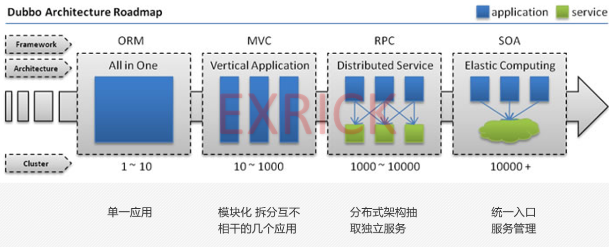

从单一应用，到垂直拆分，到分布式服务，到SOA，以及现在火热的微服务架构

## 集中式架构

当网站流量很小时，只需一个应用，将所有功能都部署在一起，以减少部署节点和成本。此时，用于简化增删改查 工作量的数据访问框架(ORM)是影响项目开发的关键

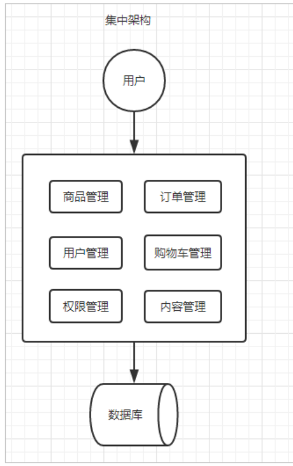

存在的问题： 

- 代码耦合，开发维护困难 
- 无法针对不同模块进行针对性优化 
- 无法水平扩展 
- 单点容错率低，并发能力差

## 垂直拆分

当访问量逐渐增大，单一应用无法满足需求，此时为了应对更高的并发和业务需求，我们根据业务功能对系统进行 拆分：

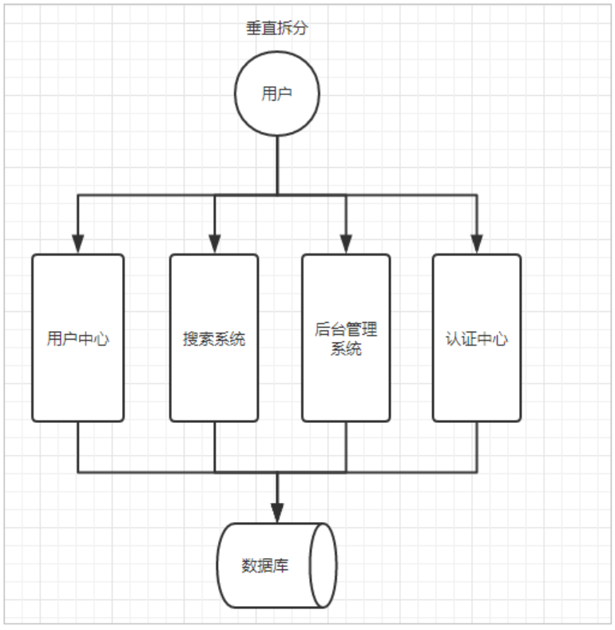

优点： 

- 系统拆分实现了流量分担，解决了并发问题 
- 可以针对不同模块进行优化 
- 方便水平扩展，负载均衡，容错率提高 

缺点： 

- 系统间相互独立，会有很多重复开发工作，影响开发效率

## 分布式服务

当垂直应用越来越多，应用之间交互不可避免，将核心业务抽取出来，作为独立的服务，逐渐形成稳定的服务中 心，使前端应用能更快速的响应多变的市场需求。此时，用于提高业务复用及整合的分布式调用是关键。

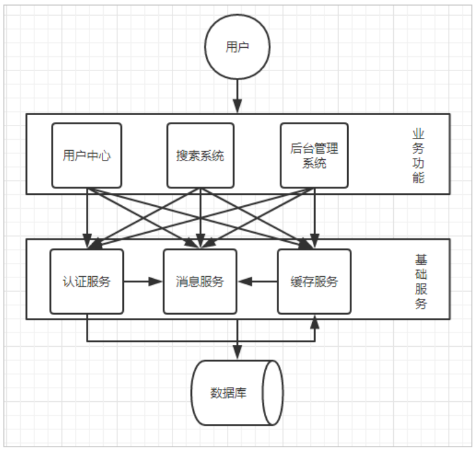

优点：

- 将基础服务进行了抽取，系统间相互调用，提高了代码复用和开发效率 

缺点： 

- 系统间耦合度变高，调用关系错综复杂，难以维护

## 服务治理（SOA）

Service Oriented Ambiguity，即面向服务架构。

当服务越来越多，容量的评估，小服务资源的浪费等问题逐渐显现，此时需增加一个调度中心基于访问压力实时管 理集群容量，提高集群利用率。此时，用于提高机器利用率的资源调度和治理中心(SOA)是关键。

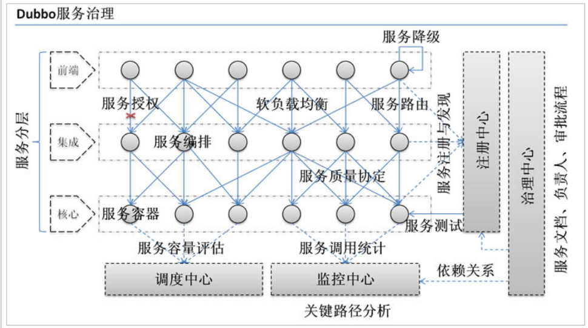

### 什么是SOA？

将应用程序的不同功能单元（称为服务）进行拆分，并通过这些服务之间定义良好的接口和协议联系起来。

服务层是SOA的基础

> SOAP、REST、RPC就是根据这种设计模式构建出来的规范，其中SOAP通俗理解就是http+xml的形式，REST就是http+json的形式，RPC是基于socket的形式。CXF就是典型的SOAP/REST框架，dubbo就是典型的RPC框架，而SpringCloud就是遵守REST规范的生态系统。

SOA里面涉及服务，接口、服务提供者、服务消费者等概念。

- 服务**：**实现某种功能的函数或方法，是一个可远程访问并独立执行和更新的离散功能单元；
- 接口：能够被其他模块调用的函数名称或一个封装的API；
- 服务提供者**：**提供服务功能 如算法，数据源
- 服务消费者: 如消费数据，使用功能。

我们使用maven进行项目的模块化进行管理，它有2种管理方式：水平切分、垂直切分。垂直管理就是项目分模块进行管理，优点是项目模块特别清晰，但是代码耦合性高，一个登陆模块就是管登陆的，这块单管搜索就是搜索的。 那么SOA就是水平切分，web层切出来了,service层做了一个分布式服务架构，这样提高代码的常用性，第一种会项目变大一倍，而现在你用你就引。分布式服务架构涉及到了dubbo的技术

以前出现了什么问题？ 

- 服务越来越多，需要管理每个服务的地址 

- 调用关系错综复杂，难以理清依赖关系 

- 服务过多，服务状态难以管理，无法根据服务情况动态管理 

服务治理要做什么？ 

- 服务注册中心，实现服务自动注册和发现，无需人为记录服务地址 

- 服务自动订阅，服务列表自动推送，服务调用透明化，无需关心依赖关系 

- 动态监控服务状态监控报告，人为控制服务状态 

缺点： 

- 服务间会有依赖关系，一旦某个环节出错会影响较大 

- 服务关系复杂，运维、测试部署困难，不符合DevOps思想

### SOA的2种架构实现

#### ESB

基于ESB总线的SOA架构。这种架构方式以一条服务总线，将所有模块化服务串联起来，以达到对不同种类的服务（不同语言、不同环境等）进行管理，以及交互等目的。这种架构思路也特别清晰：由ESB为中心来串联所有服务。

#### 分布式框架

“去中心化”的分布式服务框架其实也同样遵循了以上对SOA架构的特征定义。所以，分布式服务框架也能算作是SOA的一种。对于这两种SOA的架构其实并没有什么优劣之分，他们是平级的。并不是说“去中心化”概念炒的更火热，“去中心化”的架构就是“中心化”架构的升级版本。这两种架构分别满足了两种不同的业务诉求。而能够合理满足业务诉求，才是架构选型的意义所在。

## 微服务

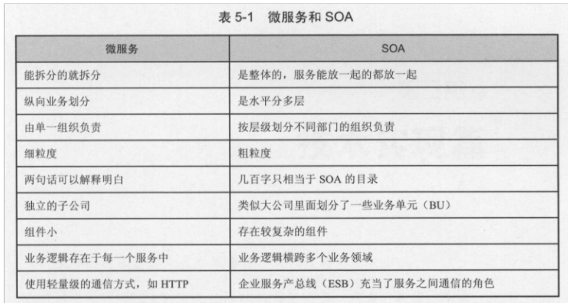

微服务的特点： 

- 单一职责：微服务中每一个服务都对应唯一的业务能力，做到单一职责 

- 微：微服务的服务拆分粒度很小，例如一个用户管理就可以作为一个服务。每个服务虽小，但“五脏俱全”。 

- 面向服务：面向服务是说每个服务都要对外暴露服务接口API。并不关心服务的技术实现，做到与平台和语言无关，也不限定用什么技术实现，只要提供Rest的接口即可。 

- 自治：自治是说服务间互相独立，互不干扰 

  - 团队独立：每个服务都是一个独立的开发团队，人数不能过多。 

  - 技术独立：因为是面向服务，提供Rest接口，使用什么技术没有别人干涉 

  - 前后端分离：采用前后端分离开发，提供统一Rest接口，后端不用再为PC、移动段开发不同接口 

  - 数据库分离：每个服务都使用自己的数据源 

  - 部署独立，服务间虽然有调用，但要做到服务重启不影响其它服务。有利于持续集成和持续交付。每个 服务都是独立的组件，可复用，可替换，降低耦合，易维护 

微服务结构图：

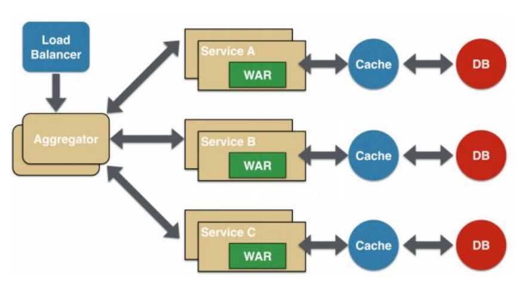

# SOA、微服务、分布式、集群

- SOA

  SOA是一种架构设计模式

  将应用程序的不同功能单元（称为服务）进行拆分，并通过这些服务之间定义良好的接口和协议联系起来。

- 微服务

  微服务是一种架构设计方式

  一个大型复杂软件应用由一个或多个微服务组成，系统中的各个微服务可被独立部署，各个微服务之间是松耦合的。微服务的设计是为了不因为某个模块的升级和BUG影响现有的系统业务。

  微服务是SOA的子集，微服务相比于SOA更加精细，微服务更多的以独立的进程的方式存在，互相之间并无影响。

  微服务更倾向于分布式去中心化的部署方式，在互联网业务场景下更适合，市面上最著名的两个微服务框架是Dubbo和Spring Cloud。

- 分布式

  分布式是一种系统部署方式

  将一个大的系统划分为多个业务模块，业务模块分别部署到不同的机器上，各个业务模块之间通过接口进行数据交互。

  区别分布式的方式是根据不同机器不同业务。

  分布式属于微服务，因为微服务的意思也就是将模块拆分成一个独立的服务单元通过接口来实现数据的交互，微服务与分布式的细微差别是，微服务的应用不一定分散在多个服务器上，他也可以是同一个服务器。

- 集群

  集群也是一种系统的部署方式

  同一个业务，部署在多个服务器上。

  不同服务器部署同一套服务对外访问，实现服务的负载均衡（也可以保证1台坏了继续工作的系统可用性），集群模式需要做好session共享，确保在不同节点切换的过程中不会因为没有获取到session而中止退出服务。

  分布式中的每一个节点，都可以做集群。而集群并不一定就是分布式的。简单说，分布式是以缩短单个任务的执行时间来提升效率的，而集群则是通过提高单位时间内执行的任务数来提升效率。

# Dubbo算SOA还是微服务？

微服务实际上是SOA的1.1版，整个过程是量引起质量变化的过程**总的来说就是三点**

- 没有强调企业服务总线，弱化或虚拟化了他。

- 强调每个服务都有独立的执行空间，包括数据库，并独立部署。

- 微服务架构通常采用REST的API调用，实现轻量化，分割力比较小。


# 分布式项目和微服务项目

微服务相比分布式服务来说，它的粒度更小，服务之间耦合度更低，由于每个微服务都由独立的小团队负责，因此它敏捷性更高，分布式服务最后都会向微服务架构演化，这是一种趋势， 不过服务微服务化后带来的挑战也是显而易见的，例如服务粒度小，数量大，后期运维将会很难。

## Dubbo与SpringCloud优缺点

相同点：SpringCloud 和Dubbo可以实现[RPC](https://so.csdn.net/so/search?q=RPC&spm=1001.2101.3001.7020)远程调用框架，可以实现服务治理。

不同点:

SpringCloud是一套目前生态圈比较完善的微服务[框架](https://so.csdn.net/so/search?q=框架&spm=1001.2101.3001.7020)，其整合了分布式架构中常遇到的服务治理一大难题，SpringCloud生态圈内涵盖各种组件，他们各司其职，其中有注册中心Eureka、负载均衡器Ribbon ，客户端调用工具Rest和Feign，分布式配置中心Config，服务保护Hystrix，网关Zuul Gateway ，服务链路Zipkin，消息总线Bus等，包括后续由国内知名bat公司Alibaba开源的第二代微服务框架Spring Cloud Alibaba，也提供了一套完整的微服务组件，甚至其中有些组件效率比Spring Cloud中NetFlix公司提供的组件效率还要高，在项目开发中，大多数将Spring Cloud与Spring Cloud Alibaba中组件结合起来使用，达到取优补短的效果。

**1. 从架构角度上**

Dubbo内部实现功能没有SpringCloud强大（全家桶），只是实现服务治理，还缺少[分布式](https://so.csdn.net/so/search?q=分布式&spm=1001.2101.3001.7020)配置中心、服务网关、服务链路追踪、消息总线、服务注册与发现、断路器等，如果需要用到这些组件，Dubbo需要另外去整合其他框架，它们有一个比较完善的生态圈。

**2. 从更新迭代速度**

Dubbo为阿里巴巴开源的分布式服务框架，致力于提供高性能和透明化的RPC远程服务调用方案，是SOA服务化治理方案的核心框架，后期由于其他原因停止更新维护，由当当网更新升级为Dubbox，在由以Spring Cloud为首兴起的一代微服务架构之后，阿里巴巴又重新开始维护更新Dubbol ， 就更新迭代速度而言，Dubbo目前更新速度没有SpringCloud快，而且SpringCloud更新升级到SpringCloud2.0之后，SpringCloud生态圈会越来完善和稳定。

**3. 从开发背景角度**

Dubbo的开发背景是阿里巴巴， 在中国也推出了非常多的优秀的开源框架

但是在SpringCloud的背景是Spring家族以及Netflix公司，Spring是专注于企业级开源框架开发，在中国，或者在整个世界上Spring框架都应用的非常广泛。所以相对来说SpringCloud的背景比Dubbo更加强大，有更多的人愿意去使用他。

最后总结下：如果学习Dubbo的话，常见的分布式解决方案需要自己额外去学习和整合其他框架，反而如果学习SpringCloud，它已经把整个常用分布式解决都整合好了，在其发达的生态圈内将某些组件以Starter形式开箱即用即可。

# 远程调用

无论是微服务还是SOA，都面临着服务间的远程调用。那么服务间的远程调用方式有哪些呢？ 

常见的远程调用方式有以下几种： 

- RPC：Remote Produce Call远程过程调用，类似的还有RMI。自定义数据格式，基于原生TCP通信，速度快，效率高。早期的webservice，现在热门的dubbo，都是RPC的典型 

- Http：http其实是一种网络传输协议，基于TCP，规定了数据传输的格式。现在客户端浏览器与服务端通信基本都是采用Http协议。也可以用来进行远程服务调用。缺点是消息封装臃肿。 现在热门的Rest风格，就可以通过http协议来实现。

Http与RPC的远程调用非常像，都是按照某种规定好的数据格式进行网络通信，有请求，有响应。没 错，在这点来看，两者非常相似，但是还是有一些细微差别。

- RPC并没有规定数据传输格式，这个格式可以任意指定，不同的RPC协议，数据格式不一定相同。 
- Http中还定义了资源定位的路径，RPC中并不需要 
- 最重要的一点：RPC需要满足像调用本地服务一样调用远程服务，也就是对调用过程在API层面进行封装。 Http协议没有这样的要求，因此请求、响应等细节需要我们自己去实现。 
  - 优点：RPC方式更加透明，对用户更方便。Http方式更灵活，没有规定API和语言，跨语言、跨平台 
  - 缺点：RPC方式需要在API层面进行封装，限制了开发的语言环境。 

例如我们通过浏览器访问网站，就是通过Http协议。只不过浏览器把请求封装，发起请求以及接收响应，解析响应的事情都帮我们做了。如果是不通过浏览器，那么这些事情都需要自己去完成

## Http、RPC如何选择？

- 速度：RPC要比http更快，虽然底层都是TCP，但是http协议的信息往往比较臃肿，不过可以采用gzip压缩。 
- 复杂度：RPC实现较为复杂，http相对比较简单
- 灵活性：http更胜一筹，因为它不关心实现细节，跨平台、跨语言。 

因此，两者都有不同的使用场景：

- 如果对效率要求更高，并且开发过程使用统一的技术栈，那么用RPC还是不错的。 

- 如果需要更加灵活，跨语言、跨平台，显然http更合适

## Http客户端工具

微服务，更加强调的是独立、自治、灵活。 而RPC方式的限制较多，因此微服务框架中，一般都会采用基于**Http**的Rest风格服务。 RPC服务和HTTP服务还是存在很多的不同点的，一般来说，RPC服务主要是针对大型企业的，而HTTP服务主要是针对小企业的，因为RPC效率更高，而HTTP服务开发迭代会更快。

如果在微服务选择了Http，那么我们就需要考虑自己来实现对请求和响应的处理。不过开源世界已经有很多的http客户端工具，能够帮助我们做这些事情，例如： HttpClient OKHttp URLConnection 接下来，我们就一起了解一款比较流行的客户端工具：HttpClient

### HttpClient

HttpClient是Apache公司的产品，是Http Components下的一个组件。

官网地址：http://hc.apache.org/index.html

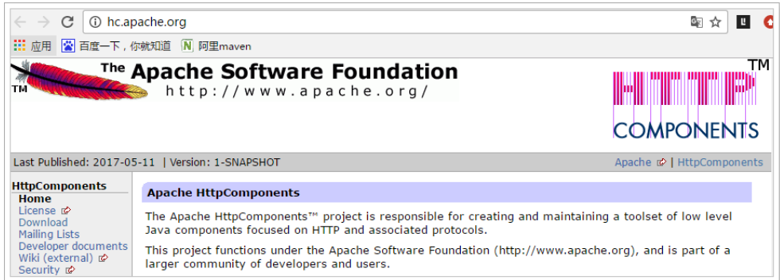

特点： 

- 基于标准、纯净的Java语言。实现了Http1.0和Http1.1 
- 以可扩展的面向对象的结构实现了Http全部的方法（GET, POST, PUT, DELETE, HEAD, OPTIONS, and TRACE） 
- 支持HTTPS协议。 
- 通过Http代理建立透明的连接。 
- 自动处理Set-Cookie中的Cookie。

使用：

- 发起Get请求

  ```java
  @Test
  public void testGet() throws IOException {
  	HttpGet request = new HttpGet("http://www.baidu.com");
  	String response = this.httpClient.execute(request, new BasicResponseHandler());
  	System.out.println(response);
  }
  ```

- 发起Post请求

  ```java
  @Test
  public void testPost() throws IOException {
  	HttpPost request = new HttpPost("http://www.oschina.net/");
  	request.setHeader("User-Agent",
  			"Mozilla/5.0 (Windows NT 10.0; WOW64) AppleWebKit/537.36 (KHTML,
  like Gecko) Chrome/56.0.2924.87 Safari/537.36");
  	String response = this.httpClient.execute(request, new BasicResponseHandler());
  	System.out.println(response);
  }
  ```

访问编写的接口：http://localhost/hello 这个接口返回一个User对象：

```java
@Test
public void testGetPojo() throws IOException {
	HttpGet request = new HttpGet("http://localhost/hello");
	String response = this.httpClient.execute(request, new BasicResponseHandler());
	System.out.println(response);
}
```

际得到的是一个json字符串：

```json
{
	"id": 8,
	"userName": "liuyan",
	"password": "123456",
	"name": "柳岩",
	"age": 21,
	"sex": 2,
	"birthday": "1995-08-07T16:00:00.000+0000",
	"created": "2014-09-20T03:41:15.000+0000",
	"updated": "2014-09-20T03:41:15.000+0000",
	"note": "柳岩同学在传智播客学表演"
}
```

### Json转工具

HttpClient请求数据后是json字符串，需要我们自己把Json字符串反序列化为对象，我们会使用JacksonJson工具来实现。 

JacksonJson 是SpringMVC内置的json处理工具，其中有一个 ObjectMapper 类，可以方便的实现对json的处理： 

- 对象转json

  ```java
  // json处理工具
  private ObjectMapper mapper = new ObjectMapper();
  @Test
  public void testJson() throws JsonProcessingException {
  	User user = new User();
  	user.setId(8L);
  	user.setAge(21);
  	user.setName("柳岩");
  	user.setUserName("liuyan");
  	// 序列化
      String json = mapper.writeValueAsString(user);
  	System.out.println("json = " + json);
  }
  ```

  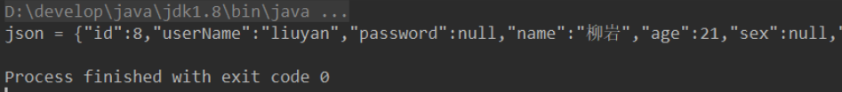

- json转普通对象

  ```java
  // json处理工具
  private ObjectMapper mapper = new ObjectMapper();
  @Test
  public void testJson() throws IOException {
  	User user = new User();
  	user.setId(8L);
  	user.setAge(21);
  	user.setName("柳岩");
  	user.setUserName("liuyan");
  	// 序列化
  	String json = mapper.writeValueAsString(user);
  	// 反序列化，接收两个参数：json数据，反序列化的目标类字节码
  	User result = mapper.readValue(json, User.class);
  	System.out.println("result = " + result);
  }
  ```

- json转集合

  json转集合比较麻烦，因为你无法同时把集合的class和元素的class同时传递到一个参数。 因此Jackson做了一个类型工厂，用来解决这个问题：

  ```java
  // json处理工具
  private ObjectMapper mapper = new ObjectMapper();
  @Test
  public void testJson() throws IOException {
  	User user = new User();
  	user.setId(8L);
  	user.setAge(21);
  	user.setName("柳岩");
  	user.setUserName("liuyan");
  	// 序列化,得到对象集合的json字符串
  	String json = mapper.writeValueAsString(Arrays.asList(user, user));
  	// 反序列化，接收两个参数：json数据，反序列化的目标类字节码
  	List<User> users = mapper.readValue(json,
  	mapper.getTypeFactory().constructCollectionType(List.class, User.class));
  }
  ```

- json转任意复杂类型

  当对象泛型关系复杂时，类型工厂也不好使了。这个时候Jackson提供了TypeReference来接收类型泛型，然后底层通过反射来获取泛型上的具体类型。实现数据转换。

  ```java
  // json处理工具
  private ObjectMapper mapper = new ObjectMapper();
  @Test
  public void testJson() throws IOException {
  	User user = new User();
  	user.setId(8L);
  	user.setAge(21);
  	user.setName("柳岩");
  	user.setUserName("liuyan");
  	// 序列化,得到对象集合的json字符串
  	String json = mapper.writeValueAsString(Arrays.asList(user, user));
  	// 反序列化，接收两个参数：json数据，反序列化的目标类字节码
  	List<User> users = mapper.readValue(json, new TypeReference<List<User>>(){});
  }
  ```

## Spring的RestTemplate

Spring提供了一个RestTemplate模板工具类，对基于Http的客户端进行了封装，并且实现了对象与json的序列化和反序列化，非常方便。RestTemplate并没有限定Http的客户端类型，而是进行了抽象，目前常用的3种都有支持： 

- HttpClient 

- OkHttp 

- JDK原生的URLConnection（默认的）

首先在项目中注册一个 RestTemplate 对象，可以在启动类位置注册：

```java
@SpringBootApplication
public class HttpDemoApplication {
	public static void main(String[] args) {
		SpringApplication.run(HttpDemoApplication.class, args);
	}
    
	@Bean
	public RestTemplate restTemplate() {
		// 默认的RestTemplate，底层是走JDK的URLConnection方式。
		return new RestTemplate();
	}
}
```

在测试类中直接 `@Autowired` 注入：

```java
@RunWith(SpringRunner.class)
@SpringBootTest(classes = HttpDemoApplication.class)
public class HttpDemoApplicationTests {
	@Autowired
	private RestTemplate restTemplate;
    
	@Test
	public void httpGet() {
		User user = this.restTemplate.getForObject("http://localhost/hello",User.class);
		System.out.println(user);
	}
}
```

通过RestTemplate的getForObject()方法，传递url地址及实体类的字节码，RestTemplate会自动发起请求， 接收响应，并且帮我们对响应结果进行反序列化。

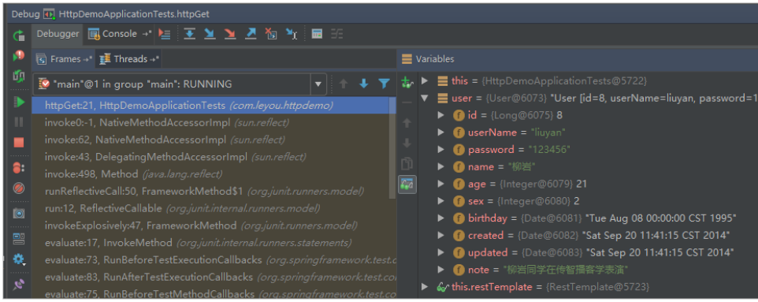

# 微服务Spring Cloud

微服务是一种架构方式，最终肯定需要技术架构去实施。 微服务的实现方式很多，但是最火的莫过于Spring Cloud了。为什么？

- 后台硬：作为Spring家族的一员，有整个Spring全家桶靠山，背景十分强大。 
- 技术强：Spring作为Java领域的前辈，可以说是功力深厚。有强力的技术团队支撑，一般人还真比不了 
- 群众基础好：可以说大多数程序员的成长都伴随着Spring框架，试问：现在有几家公司开发不用Spring？ SpringCloud与Spring的各个框架无缝整合，对大家来说一切都是熟悉的配方，熟悉的味道。 
- 使用方便：相信大家都体会到了SpringBoot给我们开发带来的便利，而SpringCloud完全支持SpringBoot的开发，用很少的配置就能完成微服务框架的搭建

## 简介

SpringCloud是Spring旗下的项目之一，官网地址：http://projects.spring.io/spring-cloud/

SpringCloud将现在非常流行的一些技术整合到一起，实现了诸如：配置管理，服务发现，智能路由，负载均衡，熔断器，控制总线，集群状态等等功能。其主要涉及的组件包括： 

- netflix Eureka：注册中心
- Zuul：服务网关 
- Ribbon：负载均衡 
- Feign：服务调用 
- Hystix：熔断器 

以上只是其中一部分，架构图：

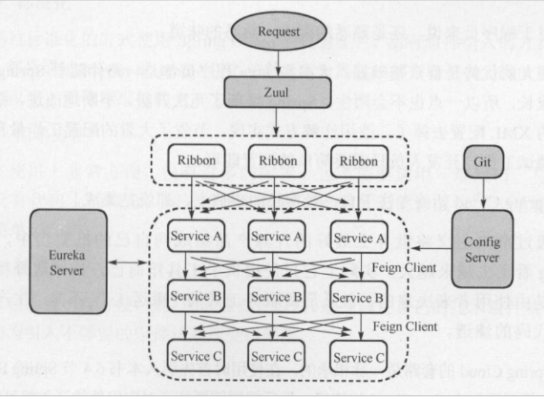

## 版本

SpringCloud的版本命名比较特殊，因为它不是一个组件，而是许多组件的集合，它的命名是以A到Z的为首字母的 一些单词组成

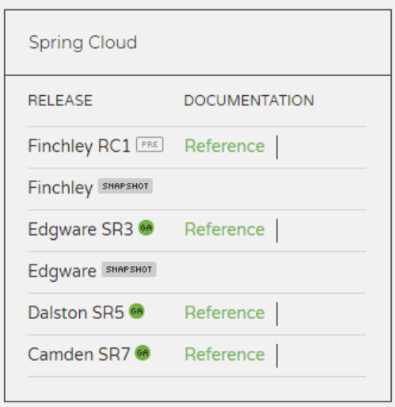

以Finchley的版本。 其中包含的组件，也都有各自的版本，如下表：

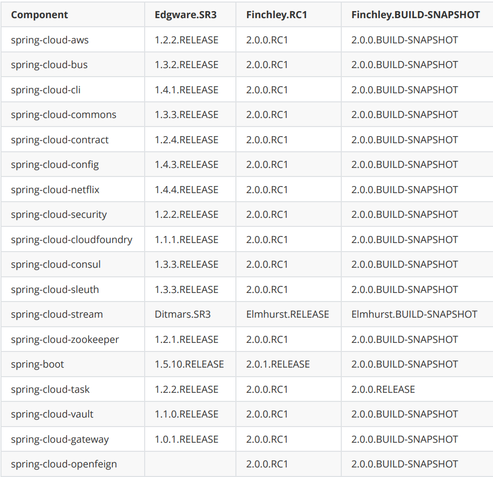

## 微服务场景模拟

模拟一个服务调用的场景。方便后面学习微服务架构

### 服务提供者

我们新建一个项目，对外提供查询用户的服务。

1. 创建工程

   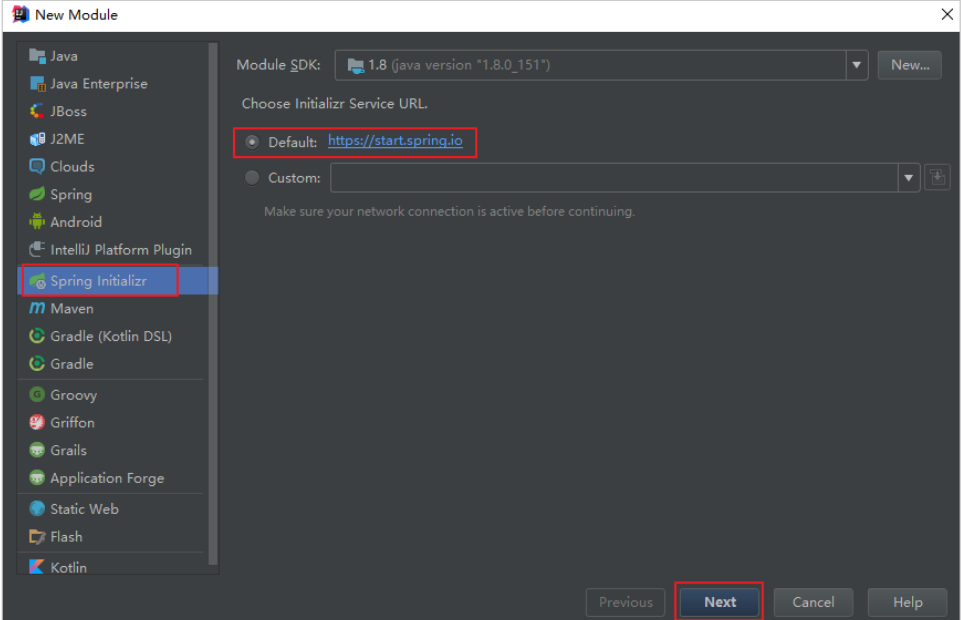

   填写项目信息：

   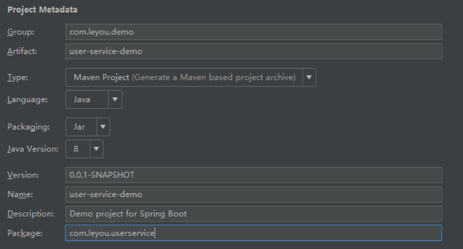

   添加web依赖：

   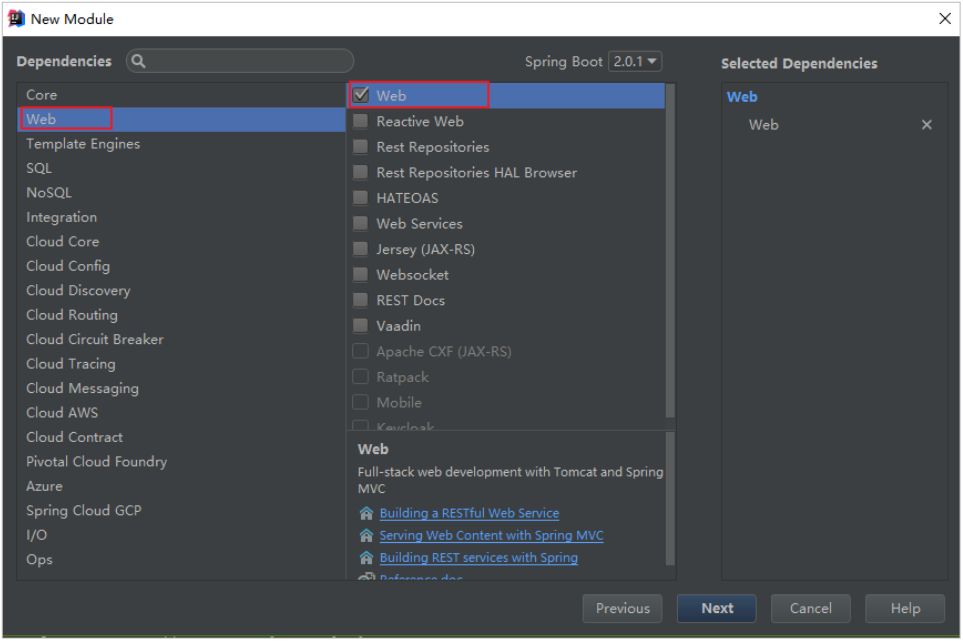

   添加mybatis依赖：

   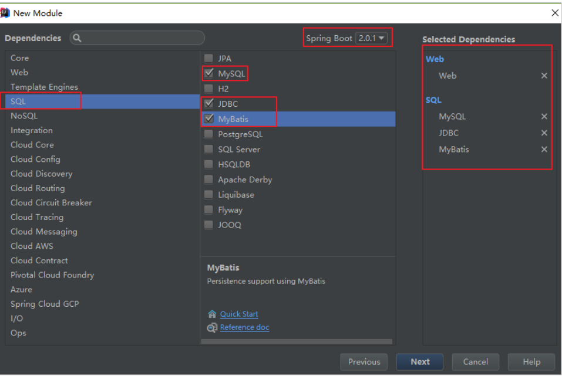

   填写项目位置：

   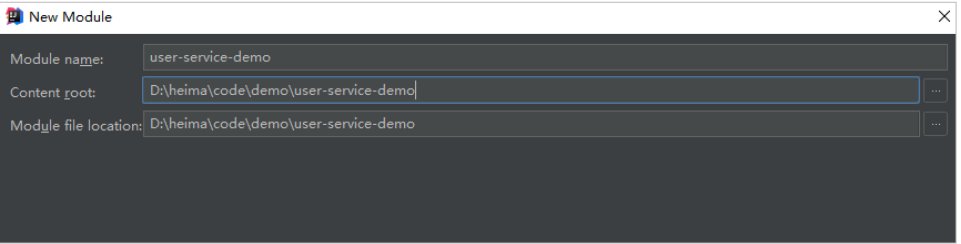

   生成的项目结构：

   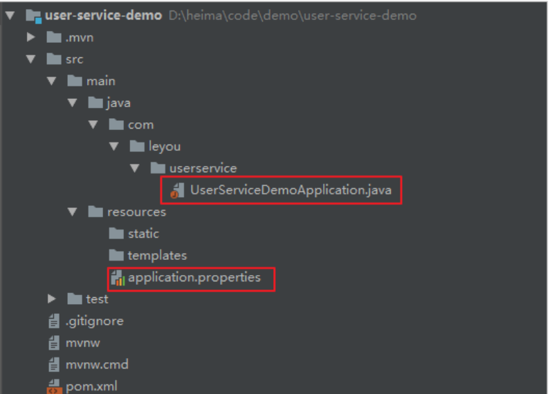

   因为要使用通用mapper，所以我们需要手动加一条依赖：

   ```xml
   <dependency>
   	<groupId>tk.mybatis</groupId>
   	<artifactId>mapper-spring-boot-starter</artifactId>
   	<version>2.0.2</version>
   </dependency>
   ```

2. 编写代码

   添加一个对外查询的接口：

   ```java
   @RestController
   @RequestMapping("user")
   public class UserController {
   	@Autowired
   	private UserService userService;
       
   	@GetMapping("/{id}")
   	public User queryById(@PathVariable("id") Long id) {
   		return this.userService.queryById(id);
       }
   }
   ```

   Service：

   ```java
   @Service
   public class UserService {
   	@Autowired
   	private UserMapper userMapper;
       
   	public User queryById(Long id) {
   		return this.userMapper.selectByPrimaryKey(id);
   	}
   }
   ```

   mapper:

   ```java
   @Mapper
   public interface UserMapper extends tk.mybatis.mapper.common.Mapper<User>{
   }
   ```

   实体类：

   ```java
   @Table(name = "tb_user")
   public class User implements Serializable {
   	private static final long serialVersionUID = 1L;
   	@Id
   	@GeneratedValue(strategy = GenerationType.IDENTITY)
   	private Long id;
   	// 用户名
   	private String userName;
   	// 密码
   	private String password;
   	// 姓名
   	private String name;
   	// 年龄
   	private Integer age;
   	// 性别，1男性，2女性
   	private Integer sex;
   	// 出生日期
   	private Date birthday;
   	// 创建时间
   	private Date created;
   	// 更新时间
   	private Date updated;
   	// 备注
   	private String note;
   	// 。。。省略getters和setters
   }
   ```

   属性文件,这里我们采用了yaml语法，而不是properties：

   ```yaml
   server:
   	port: 8081
   spring:
   	datasource:
   		url: jdbc:mysql://localhost:3306/mydb01
   		username: root
   		password: 123
   		hikari:
   			maximum-pool-size: 20
   			minimum-idle: 10
   mybatis:
   	type-aliases-package: com.leyou.userservice.poj
   ```

   项目结构：

   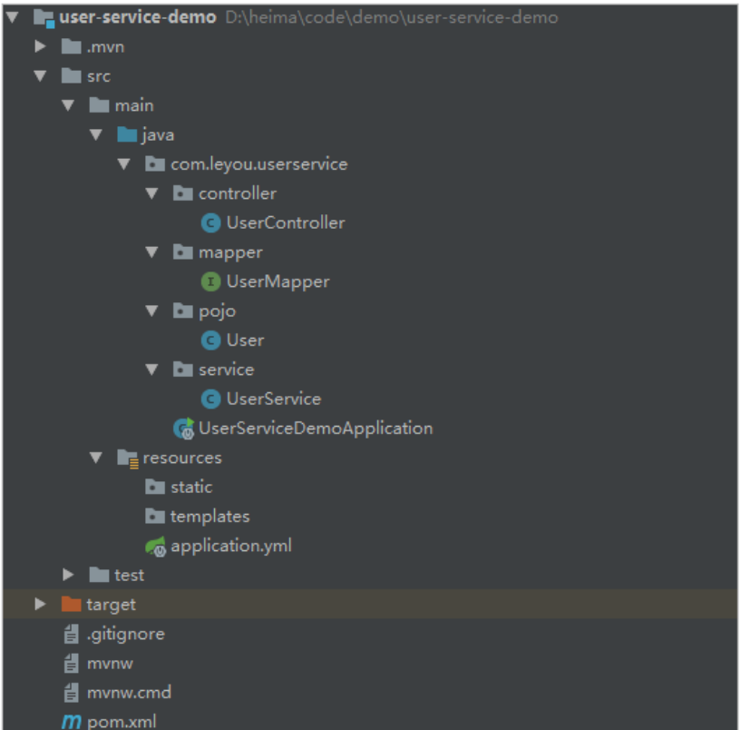

3. 启动测试

   启动项目，访问接口：http://localhost:8081/user/7

   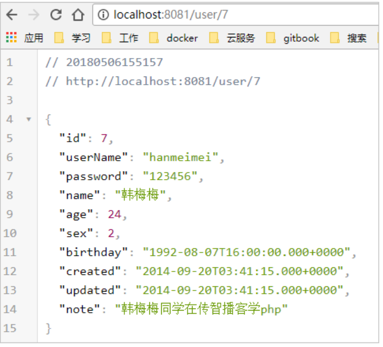

### 服务调用者

1. 创建工程

   添加OkHttp依赖:

   ```xml
   <dependency>
   	<groupId>com.squareup.okhttp3</groupId>
   	<artifactId>okhttp</artifactId>
   	<version>3.9.0</version>
   </dependency>
   ```

2. 编写代码

   首先在启动类中注册 RestTemplate ：

   ```java
   @SpringBootApplication
   public class UserConsumerDemoApplication {
   	@Bean
   	public RestTemplate restTemplate() {
   		// 这次我们使用了OkHttp客户端,只需要注入工厂即可
   		return new RestTemplate(new OkHttp3ClientHttpRequestFactory());
   	}
   	public static void main(String[] args) {
   		SpringApplication.run(UserConsumerDemoApplication.class, args);
       }
   }
   ```

   然后编写UserDao，注意，这里不是调用mapper查数据库，而是通过RestTemplate远程查询user-service-demo 中的接口：

   ```java
   @Component
   public class UserDao {
   	@Autowired
   	private RestTemplate restTemplate;
       
   	public User queryUserById(Long id){
   		String url = "http://localhost:8081/user/" + id;
   		return this.restTemplate.getForObject(url, User.class);
   	}
   }
   ```

   然后编写user-service，循环查询UserDAO信息：

   ```java
   @Service
   public class UserService {
   	@Autowired
   	private UserDao userDao;
       
   	public List<User> querUserByIds(List<Long> ids){
   		List<User> users = new ArrayList<>();
   		for (Long id : ids) {
   			User user = this.userDao.queryUserById(id);
   			users.add(user);
   		}
   		return users;
   	}
   }
   
   ```

   编写controller：

   ```java
   @RestController
   @RequestMapping("consume")
   public class ConsumerController {
   	@Autowired
   	private UserService userService;
       
   	@GetMapping
   	public List<User> consume(@RequestParam("ids") List<Long> ids) {
   		return this.userService.queryUserByIds(ids);
   	}
   }
   
   ```

3. 启动并测试

   访问：http://localhost:8080/consume?ids=6,7,8

   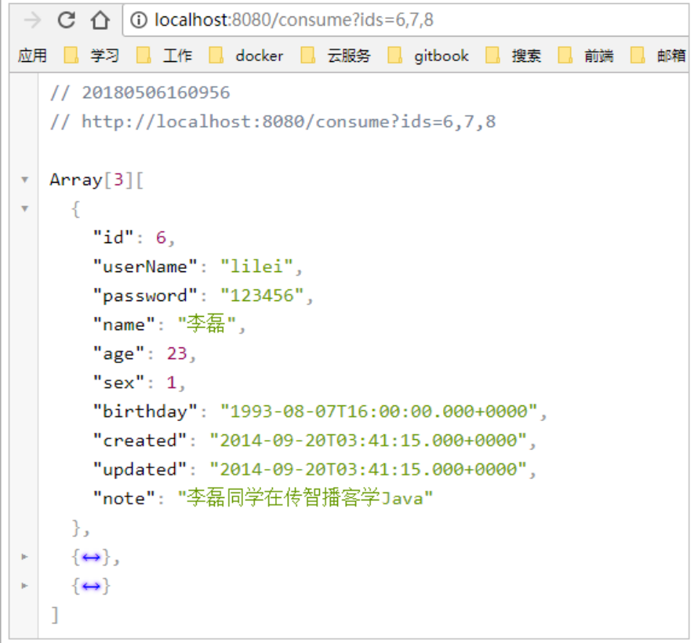

### 有什么问题？

- use-service-demo：一个提供根据id查询用户的微服务 

- consumer-demo：一个服务调用者，通过RestTemplate远程调用user-service-demo

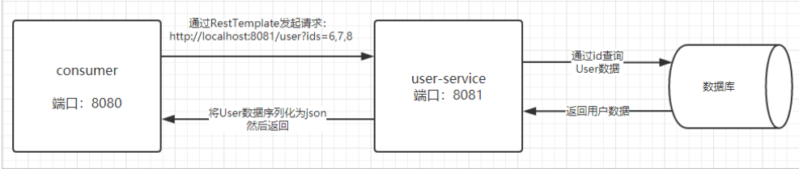

存在什么问题？ 

- 在consumer中，我们把url地址硬编码到了代码中，不方便后期维护 
- consumer需要记忆user-service的地址，如果出现变更，可能得不到通知，地址将失效 
- consumer不清楚user-service的状态，服务宕机也不知道 
- user-service只有1台服务，不具备高可用性 
- 即便user-service形成集群，consumer还需自己实现负载均衡 

其实上面说的问题，概括一下就是分布式服务必然要面临的问题：

- 服务管理 
  - 如何自动注册和发现 
  - 如何实现状态监管 
  - 如何实现动态路由 
- 服务如何实现负载均衡 
- 服务如何解决容灾问题 
- 服务如何实现统一配置

以上的问题，我们都将在SpringCloud中得到答案。

## Eureka注册中心

解决：服务的管理

- 问题分析

在刚才的案例中，user-service对外提供服务，需要对外暴露自己的地址。而consumer（调用者）需要记录服务提供者的地址。将来地址出现变更，还需要及时更新。这在服务较少的时候并不觉得有什么，但是在现在日益复杂的互联网环境，一个项目肯定会拆分出十几，甚至数十个微服务。此时如果还人为管理地址，不仅开发困难，将来测试、发布上线都会非常麻烦，这与DevOps的思想是背道而驰的。 

- 网约车 

这就好比是网约车出现以前，人们出门叫车只能叫出租车。一些私家车想做出租却没有资格，被称为黑车。而很多人想要约车，但是无奈出租车太少，不方便。私家车很多却不敢拦，而且满大街的车，谁知道哪个才是愿意载人的。一个想要，一个愿意给，就是缺少引子，缺乏管理啊。 此时滴滴这样的网约车平台出现了，所有想载客的私家车全部到滴滴注册，记录你的车型（服务类型），身份信息 （联系方式）。这样提供服务的私家车，在滴滴那里都能找到，一目了然。 此时要叫车的人，只需要打开APP，输入你的目的地，选择车型（服务类型），滴滴自动安排一个符合需求的车到你面前，为你服务，完美！ 

- Eureka做什么？

Eureka就好比是滴滴，负责管理、记录服务提供者的信息。服务调用者无需自己寻找服务，而是把自己的需求告诉 Eureka，然后Eureka会把符合你需求的服务告诉你。 同时，服务提供方与Eureka之间通过 “心跳” 机制进行监控，当某个服务提供方出现问题，Eureka自然会把它从服 务列表中剔除。 这就实现了服务的自动注册、发现、状态监控。