# 操作系统

# 面试题

## 进程

### [Q: 进程间通信方式(7种)]

- 管道pipe：半双工的通信方式，数据只能单向流动，只有在有亲缘关系进程才可以使用。只存于内存中的文件
- 有名管道（FIFO）：半双工的通信方式，克服了管道的缺点，允许无亲缘关系的进程间使用。遵循先进先出的原则。存在于磁盘或者文件系统。
- 信号：用于通知接收某个事件已经发生。
- 信号量：是一个计数器，可以控制多个进程访问同一共享资源。通常做为锁机制用在进程间同步。
- 共享内存：多个进程可以访问同一块内存空间，不同进程可以及时看到进程中对共享内存中数据的更新。需要依靠某种同步操作，如互斥锁和信号量等。
- 消息队列：消息的链表。和管道一样FIFO，它解决了这个信号传递少、管道只能传输字节流和缓冲区大小限制等等的缺点
- 套接字（Socket）：主要用在客户端和服务器之间的网络通信，是支持TCP/IP的网络通信的基本操作单元。可以看作是不同主机之间的进程进行双向通信的端点。

解析：

- 管道pipe：一种半双工的通信方式，数据只能单向流动，只有在有亲缘关系进程才可以使用。

  ```c
  #include <stdio.h> 
  #include <unistd.h> 
  #include <stdlib.h> 
  #include <string.h> 
  #include <sys/wait.h>  
  int pipe_default[2];  int main() {   
      pid_t pid;   
      char buffer[32];    
      memset(buffer, 0, 32);   
      if(pipe(pipe_default) < 0)  {     
          printf("Failed to create pipe!\n");     
          return 0;  
      }    
      if(0 == (pid = fork()))  {     
          close(pipe_default[1]); 
          //关闭写端     
          sleep(2);     
          if(read(pipe_default[0], buffer, 32) > 0)     {       
              printf("[Client] Receive data from server: %s \n", buffer);     
          }     close(pipe_default[0]);    
          else  {     
              close(pipe_default[0]);  
              //关闭读端     
              char msg[32]="== hello world ==";     
              if(-1 != write(pipe_default[1], msg, strlen(msg)))     {       
                  printf("[Server] Send data to client: %s \n",msg);     
              }     
              close(pipe_default[1]);     
              waitpid(pid, NULL, 0);  
          }   
          return 1; 
      }
  ```

- 有名管道（FIFO）：一种半双工的通信方式，允许无亲缘关系的进程间使用。有名管道不同于匿名管道之处在于它提供了一个路径名与之关联，**以有名管道的文件形式存在于文件系统中**，这样，**即使与有名管道的创建进程不存在亲缘关系的进程，只要可以访问该路径，就能够彼此通过有名管道相互通信**，因此，通过有名管道不相关的进程也能交换数据。值的注意的是，有名管道严格遵循**先进先出(first in first out)** ,对匿名管道及有名管道的读总是从开始处返回数据，对它们的写则把数据添加到末尾。它们不支持诸如lseek()等文件定位操作。**有名管道的名字存在于文件系统中，内容存放在内存中。**

  写管道

  ```c++
  #include <stdio.h>
  #include <errno.h>
  #include <unistd.h>
  #include <sys/types.h>
  #include <string.h> 
  #include <stdlib.h>
  #include <fcntl.h>
  #include <sys/stat.h> 
  int main() { 
      int nFd = 0;  
      int nWrLen = 0, nReadLen = 0;;  char szBuff[BUFSIZ] = {0}; 
      /* 打开当前目录下的管道文件 */  
      nFd = open("pipe", O_RDWR);  
      if (-1 == nFd)  { 
          perror("Open fifo failed\n"); 
          return 1; 
      }  
      while (1)  {  
          /* 从终端读取数据 */   
          memset(szBuff,0,BUFSIZ);   
          nReadLen = read(STDIN_FILENO,szBuff,BUFSIZ); 
          if(nReadLen > 0)   {   
              /* 往管道写入数据 */   
              nWrLen = write(nFd, szBuff, strlen(szBuff)+1);   
              if (nWrLen > 0)    {   
                  printf("write data successful: %s \n", szBuff); 
              }    else  {    
                  perror("write failed:");   
              }   
          }
       }  
  } 
  ```

  读管道：

  ```c++
  #include <stdio.h>
  #include <errno.h>
  #include <unistd.h>
  #include <sys/types.h>
  #include <string.h>
  #include <stdlib.h>
  #include <fcntl.h>
  #include <sys/stat.h>
  
  int main()
  {
      int nFd = 0;
      int  nReadLen = 0;;
      char szBuff[BUFSIZ] = {0};
  
      /* 打开当前目录下的管道文件 */
      nFd = open("pipe", O_RDWR);
      if (-1 == nFd)
      {
          perror("Open fifo failed\n");
          return 1;
      }
  
      while (1)
      {
          /* 从管道读取数据 */
          memset(szBuff,0,BUFSIZ);
          nReadLen = read(nFd,szBuff,BUFSIZ);
          if(nReadLen > 0)
          {
              printf("read pipe data: %s\n", szBuff);
          }   
  
      }
  }
  ```

- 消息队列：链表的形式存储消息，存放在内核中并由消息队列标识符标识。它解决了这个信号传递少、管道只能传输字节流和缓冲区大小限制等等的缺点

  - 消息队列是**存放在内核中的消息链表**，每个消息队列由消息队列标识符表示。
  - 与管道（无名管道：只存在于内存中的文件；命名管道：存在于实际的磁盘介质或者文件系统）不同的是消息队列**存放在内核中**，只有在内核重启(即，操作系统重启)或者显示地删除一个消息队列时，该消息队列才会被真正的删除。
  - 另外与管道不同的是，消息队列在某个进程往一个队列写入消息之前，并**不需要另外某个进程在该队列上等待消息的到达**。

  > **消息队列特点总结：**
  >
  > （1）消息队列是消息的链表,具有特定的格式,存放在内存中并由消息队列标识符标识.
  >
  > （2）消息队列允许一个或多个进程向它写入与读取消息.
  >
  > （3）管道和消息队列的通信数据都是先进先出的原则。
  >
  > （4）消息队列可以实现消息的随机查询,消息不一定要以先进先出的次序读取,也可以按消息的类型读取.比FIFO更有优势。
  >
  > （5）消息队列克服了信号承载信息量少，管道只能承载无格式字 节流以及缓冲区大小受限等缺。
  >
  > （6）目前主要有两种类型的消息队列：POSIX消息队列以及System V消息队列，系统V消息队列目前被大量使用。系统V消息队列是随内核持续的，只有在内核重起或者人工删除时，该消息队列才会被删除。

  示例：使用消息队列进行进程间通信

  接收信息的程序源文件为msgreceive.c的源代码为：

  ```c
  #include <unistd.h>
  #include <stdlib.h>
  #include <stdio.h>
  #include <string.h>
  #include <errno.h>
  #include <sys/msg.h>
  
  struct msg_st
  {
      long int msg_type;
      char text[BUFSIZ];
  };
  
  int main()
  {
      int running = 1;
      int msgid = -1;
      struct msg_st data;
      long int msgtype = 0; //注意1
  
      //建立消息队列
      msgid = msgget((key_t)1234, 0666 | IPC_CREAT);
      if(msgid == -1)
      {
          fprintf(stderr, "msgget failed with error: %d\n", errno);
          exit(EXIT_FAILURE);
      }
      //从队列中获取消息，直到遇到end消息为止
      while(running)
      {
          if(msgrcv(msgid, (void*)&data, BUFSIZ, msgtype, 0) == -1)
          {
              fprintf(stderr, "msgrcv failed with errno: %d\n", errno);
              exit(EXIT_FAILURE);
          }
          printf("You wrote: %s\n",data.text);
          //遇到end结束
          if(strncmp(data.text, "end", 3) == 0)
              running = 0;
      }
      //删除消息队列
      if(msgctl(msgid, IPC_RMID, 0) == -1)
      {
          fprintf(stderr, "msgctl(IPC_RMID) failed\n");
          exit(EXIT_FAILURE);
      }
      exit(EXIT_SUCCESS);
  }
  ```

  发送信息的程序的源文件msgsend.c的源代码为：

  ```c
  #include <unistd.h>
  #include <stdlib.h>
  #include <stdio.h>
  #include <string.h>
  #include <sys/msg.h>
  #include <errno.h>
  
  #define MAX_TEXT 512
  struct msg_st
  {
      long int msg_type;
      char text[MAX_TEXT];
  };
  
  int main()
  {
      int running = 1;
      struct msg_st data;
      char buffer[BUFSIZ];
      int msgid = -1;
  
      //建立消息队列
      msgid = msgget((key_t)1234, 0666 | IPC_CREAT);
      if(msgid == -1)
      {
          fprintf(stderr, "msgget failed with error: %d\n", errno);
          exit(EXIT_FAILURE);
      }
  
      //向消息队列中写消息，直到写入end
      while(running)
      {
          //输入数据
          printf("Enter some text: ");
          fgets(buffer, BUFSIZ, stdin);
          data.msg_type = 1;    //注意2
          strcpy(data.text, buffer);
          //向队列发送数据
          if(msgsnd(msgid, (void*)&data, MAX_TEXT, 0) == -1)
          {
              fprintf(stderr, "msgsnd failed\n");
              exit(EXIT_FAILURE);
          }
          //输入end结束输入
          if(strncmp(buffer, "end", 3) == 0)
              running = 0;
          sleep(1);
      }
      exit(EXIT_SUCCESS);
  }
  ```

  运行结果如下：

  ```
  biao@ubuntu:~/test/msgRecvSend$
  biao@ubuntu:~/test/msgRecvSend$ ls
  msgreceive.c  msgsend.c  recv  send
  biao@ubuntu:~/test/msgRecvSend$ ./recv &
  [1] 8753
  biao@ubuntu:~/test/msgRecvSend$ ./send
  Enter some text: helloworld
  You wrote: helloworld
  
  Enter some text: Caibiao Lee
  You wrote: Caibiao Lee
  
  Enter some text: end
  You wrote: end
  
  [1]+  Done                    ./recv
  biao@ubuntu:~/test/msgRecvSend$
  ```

- 共享内存：一段能被其他进程所访问的内存。

  进程间本身的内存是相互隔离的，而共享内存机制相当于给两个进程开辟了一块二者均可访问的内存空间，这时，两个进程便可以共享一些数据了。但是，多进程同时占用资源会带来一些意料之外的情况，这时，我们往往会采用上述的信号量来控制多个进程对共享内存空间的访问。

  ```c
  /* Linux 6.cpp */
  #include <iostream>
  #include <stdlib.h>
  #include <string.h>
  #include <sys/shm.h>
  #include <sys/ipc.h>
  #include <unistd.h>
  
  using namespace std;
  int main()
  {
    char *shmaddr;
    char *shmaddread;
    char str[]="Hello, I am a processing. \n";
    int shmid;
  
    key_t key = ftok(".",1);
    pid_t pid1 = fork();
    if(pid1 == -1){
      cout << "Fork error. " << endl;
      exit(1);
    }
    else if(pid1 == 0){
      //子进程
      shmid = shmget(key,1024,IPC_CREAT | 0600);
      shmaddr = (char*)shmat(shmid, NULL, 0);
                 strcpy(shmaddr, str);
      cout << "[Writer] write: " << shmaddr << endl;
      shmdt(shmaddr);
    }
    else
    {
      //父进程
      pid_t pid2 = fork();
      if(pid2 == -1){
        cout << "Fork error. " << endl;
        exit(1);
      }
      else if(pid2 == 0){
        //子进程
        sleep(2);
        shmid = shmget(key,1024,IPC_CREAT | 0600);
        shmaddread = (char*)shmat(shmid, NULL, 0);        
        cout << "[Reader] read: " << shmaddread << endl;
        shmdt(shmaddread);
      }
    }
    sleep(3);
    return 0;
  }
  ```

- 信号量：信号量是一个计数器，可以用来控制多个进程对共享资源的访问。它常作为一种锁机制，防止某进程正在访问共享资源时，其他进程也访问该资源。因此，主要作为进程间以及同一进程内不同线程之间的同步手段。 

  信号量主要用来解决进程和线程间并发执行时的同步问题，进程同步是并发进程为了完成共同任务采用某个条件来协调他们的活动，这是进程之间发生的一种直接制约关系。

  对信号量的操作分为P操作和V操作，P操作是将信号量的值减一，V操作是将信号量的值加一。当信号量的值小于等于0之后，再进行P操作时，当前进程或线程会被阻塞，直到另一个进程或线程执行了V操作将信号量的值增加到大于0之时。锁也是用的这种原理实现的。

  信号量我们需要定义信号量的数量，设定初始值，以及决定何时进行PV操作。

  ```c
  //g++ semtest.cpp -o test -lpthread
   #include <stdio.h>
   #include <semaphore.h>
   #include <pthread.h>
   #include <unistd.h>
   #include <sys/time.h>
   sem_t sem;
  
   /*function:获取当前时间，精确到毫秒
 * */
   int64_t getTimeMsec()
   {
       struct  timeval    tv;
       gettimeofday(&tv, NULL);
       return tv.tv_sec * 1000 + tv.tv_usec / 1000;
   }
  
   void* func_sem_wait(void* arg)
   {
       printf("set wait\n");
       sem_wait(&sem);
       printf("sem wait success\n");
       int *running = (int*)arg;
       printf("func_sem_wait running\n");
       printf("%d\n", *running);
   }
  
  void* func_sem_timedwait(void* arg)
   {
       timespec timewait;
       timewait.tv_sec = getTimeMsec() / 1000 + 2;
       timewait.tv_nsec = 0;
       printf("sem_timedwait\n");
       int ret = sem_timedwait(&sem, &timewait);
       printf("sem_timedwait,ret=%d\n", ret);
       printf("func_sem_timedwait running\n");
   }
  
  void* func_sem_post(void* arg)
   {
       printf("func_sem_post running\n");
       printf("sem post\n");
       int *a = (int*)arg;
       *a = 6;
       sem_post(&sem);
       sem_post(&sem);
   }
  
  int main()
   {
       sem_init(&sem, 0, 0);
       pthread_t thread[3];
       int a = 5;
  
      pthread_create(&(thread[0]), NULL, func_sem_wait, &a);
       printf("thread func_sem_wait\n");
  
      pthread_create(&(thread[2]), NULL, func_sem_timedwait, &a);
       printf("thread func_sem_timedwait\n");
  
      sleep(4);
  
      pthread_create(&(thread[1]), NULL, func_sem_post, &a);
       printf("thread func_sem_post\n");
  
      pthread_join(thread[0], NULL);
       pthread_join(thread[1], NULL);
       pthread_join(thread[2], NULL);
       sem_destroy(&sem);
   }
  ```

- 套接字（Socket）：主要用在客户端和服务器之间的网络通信，是支持TCP/IP的网络通信的基本操作单元。

  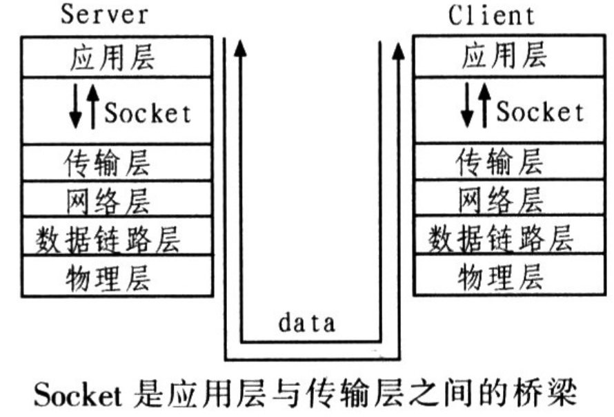

  套接字可以看做是：不同主机之间的进程进行双向通信的端点。（套接字 = IP地址 + 端口号）

- 信号：用在通知接收某个事件已经发生。

  - 信号是Linux系统中用于进程间互相通信或者操作的一种机制，信号可以在任何时候发给某一进程，而无需知道该进程的状态。

  - 如果该进程当前并未处于执行状态，则该信号就有内核保存起来，知道该进程回复执行并传递给它为止。

  - 如果一个信号被进程设置为阻塞，则该信号的传递被延迟，直到其阻塞被取消是才被传递给进程。

  - 以下列出几个常用的信号：

    | 信号    | 描述                                                         |
    | :------ | :----------------------------------------------------------- |
    | SIGHUP  | 当用户退出终端时，由该终端开启的所有进程都退接收到这个信号，默认动作为终止进程。 |
    | SIGINT  | 程序终止(interrupt)信号, 在用户键入INTR字符(通常是Ctrl+C)时发出，用于通知前台进程组终止进程。 |
    | SIGQUIT | 和SIGINT类似, 但由QUIT字符(通常是Ctrl+\)来控制. 进程在因收到SIGQUIT退出时会产生core文件, 在这个意义上类似于一个程序错误信号。 |
    | SIGKILL | 用来立即结束程序的运行. **本信号不能被阻塞、处理和忽略**。   |
    | SIGTERM | 程序结束(terminate)信号, 与SIGKILL不同的是该信号可以被阻塞和处理。通常用来要求程序自己正常退出。 |
    | SIGSTOP | 停止(stopped)进程的执行. 注意它和terminate以及interrupt的区别:该进程还未结束, 只是暂停执行. **本信号不能被阻塞, 处理或忽略**. |

    ```c
    #include<stdlib.h> 
    #include<stdio.h> 
    #include<signal.h> 
    #include<sys/types.h> 
    #include<unistd.h>  
    void sig_handle(int sig) {     
        printf("received signal: %d, quit.\n", sig);     
        exit(0); 
    }  
    int main () {     
        signal(SIGINT, sig_handle);     
        signal(SIGKILL, sig_handle);     
        signal(SIGSEGV, sig_handle);     
        signal(SIGTERM, sig_handle);       
        int i = 0;      
        while (1) {          
            printf("%d\n", ++i);          
            sleep(2);      
        }       
        printf("main quit.");       
        return 0; 
    }
    ```

    运行结果：

    ```
    1
    2 
    received signal: 15, quit.
    ```

### [Q：说一说信号量]

在多进程环境下，为了防止多个进程同时访问一个公共资源二出现的问题，信号量可以来协调各个进程保证能够合理地使用公共资源。

信号量的数据类型为结构sem_t，它本质上是一个长整型的数。

函数sem_init（）用来初始化一个信号量。它的原型为：

extern int sem_init _*P ((sem_t \*_*sem, int _*pshared, unsigned int _*value));

sem为指向信号量结构的一个指针；pshared不为０时此信号量在进程间共享，否则只能为当前进程的所有线程共享；value给出了信号量的初始值。

（1）函数sem_post( sem_t *sem )用来增加信号量的值。当有线程阻塞在这个信号量上时，调用这个函数会使其中的一个线程不在阻塞，选择机制同样是由线程的调度策略决定的。

（2）函数sem_wait( sem_t *sem )被用来阻塞当前线程直到信号量sem的值大于0，解除阻塞后将sem的值减一，表明公共资源经使用后减少。函数sem_trywait ( sem_t *sem )是函数sem_wait（）的非阻塞版本，它直接将信号量sem的值减一。

（3）函数sem_timedwait(sem_t *sem, const struct timespec *abs_timeout) 与 sem_wait() 类似，只不过 abs_timeout 指定一个阻塞的时间上限，如果调用因不能立即执行递减而要阻塞。

（4）函数sem_destroy(sem_t *sem)用来释放信号量sem。

```c
//g++  semtest.cpp -o test -lpthread 
#include <stdio.h> 
#include <semaphore.h> 
#include <pthread.h> 
#include <unistd.h>
#include <sys/time.h> 
sem_t sem;  
/*function:获取当前时间，精确到毫秒• * */ 
int64_t getTimeMsec() {   
    struct  timeval    tv;   
    gettimeofday(&tv, NULL);   
    return tv.tv_sec * 1000 + tv.tv_usec / 1000; 
}  
void* func_sem_wait(void* arg) {    
    printf("set wait\n");    
    sem_wait(&sem);   
    printf("sem wait success\n");    
    int *running = (int*)arg;   
    printf("func_sem_wait running\n");    
    printf("%d\n", *running); } 
void* func_sem_timedwait(void* arg) {   
    timespec timewait;    
    timewait.tv_sec = getTimeMsec() / 1000 + 2;  
    timewait.tv_nsec = 0;    
    printf("sem_timedwait\n");   
    int ret = sem_timedwait(&sem, &timewait); 
    printf("sem_timedwait,ret=%d\n", ret);  
    printf("func_sem_timedwait running\n");
}  
void* func_sem_post(void* arg) {  
    printf("func_sem_post running\n");  
    printf("sem post\n");   
    int *a = (int*)arg;  
    *a = 6;  
    sem_post(&sem);    
    sem_post(&sem);
}  
int main() {  
    sem_init(&sem, 0, 0);  
    pthread_t thread[3];   
    int a = 5;     
    pthread_create(&(thread[0]), NULL, func_sem_wait, &a);  
    printf("thread func_sem_wait\n");     
    pthread_create(&(thread[2]), NULL, func_sem_timedwait, &a);   
    printf("thread func_sem_timedwait\n");     
    sleep(4);     
    pthread_create(&(thread[1]), NULL, func_sem_post, &a);    
    printf("thread func_sem_post\n");     
    pthread_join(thread[0], NULL);   
    pthread_join(thread[1], NULL);   
    pthread_join(thread[2], NULL);   
    sem_destroy(&sem);
}
```


### [Q: 进程调度算法?]]

作用：首先这个cpu进程的调度，是来确定哪个进程先执行和最后最后执行来实现这个cpu的高利用率。常用的算法有：先到先服务、短作业优先、时间片轮转、多级反馈队列、优先级调度

- 先到先服务（FCFS）：顾名思义，先进这个就绪队列先分配计算机资源。使它立即执行直到完成某事件而被阻塞。

- 短作业优先（SJF）：选择一个运行时间最短的进程分配资源

- 时间片轮转（RR，Round Robin）：最古老、最简单、最公平、使用最广的算法。每个进程被分配一个时间片段，只能在这时间段内执行。

- 多级反馈队列：维护多个优先级不同的队列，**优先执行较高优先级的作业，在相同优先级队列中工作采用轮转调度算法进行**。

  短作业优先算法，它照顾这个运行时间短的线程，那么运行时间长的呢，它就很难执行到了。那这个多级反馈队列的作用来了。它设置多个就绪队列，每个队列优先级是不一样。第一队列优先级最高，后面的队列优先级一个比一个低。同一个队列是先到先服务，每个进程执行一个时间片，时间片执行完还没完成任务就会放到下一个队列的末尾。只有这个队列的高级别队列是空闲的，才会调度队列的进程。那么有进程进来到高级别队列，会将正在运行的进程放在队列的末尾（本队列），把时间片给高优先级的队列的进程

- 优先调度：每个进程给到一个不同的优先级，一般就是根据内存的要求或时间上要求等等来确定优先级，那么首先就会最高优先级的进程。

### [Q: 进程同步问题]

多个线程执行的话，如果有共享的资源，那么就要避免资源使用上的一个冲突。常见同步方式有这个互斥量、信号量、事件
互斥量（Mutex）：就是拥有互斥对象的进程才有访问公共资源的权限。互斥量只有一个，所以其他线程是无法同时访问的。比如java的sychronized和各种锁都是用这个机制
信号量（Semaphore）：一个计数器，允许多个线程访问同一个资源。线程池的实现就是这种方式。
事件（Event）：通过通知的方式来保证多线程的同步。

### [Q：进程之间共享内存的通信方式有什么好处？]

采用共享内存通信的一个显而易见的好处是效率高，因为进程可以直接读写内存，而不需要任何数据的拷贝。对于像管道和消息队列等通信方式，则需要在内核和用户空间进行四次的数据拷贝，而共享内存则只拷贝两次数据：一次从输入文件到共享内存区，另一次从共享内存区到输出文件。

实际上，进程之间在共享内存时，并不总是读写少量数据后就解除映射，有新的通信时，再重新建立共享内存区域。而是保持共享区域，直到通信完毕为止，这样，数据内容一直保存在共享内存中，并没有写回文件。共享内存中的内容往往是在解除映射时才写回文件的。因此，采用共享内存的通信方式效率是非常高的。

### [Q: 进程的5种状态]

- 创建状态（new）
- 就绪状态（ready）：处于准备运行状态。进程获得除了处理器之外的一切所需资源，一旦得到处理器资源（分配时间片）即可运行
- 运行状态（running）：单核cpu下任意时刻只有一个进程处于运行状态
- 阻塞状态（waiting）：又称等待状态，进程为等待某件事而暂停运行。如等待IO操作完成，即使处理器空闲，进程也不能执行
- 结束状态（terminated）：进程正常结束或其他原因中断退出运行

## 线程

### [Q: 线程和协程，协程是怎么实现的]

https://zhuanlan.zhihu.com/p/169426477

通俗易懂的讲，线程是操作系统的资源，当java程序创建一个线程，虚拟机会向操作系统请求创建一个线程，虚拟机本身没有能力创建线程。而线程又是昂贵的系统资源，创建、切换、停止等线程属性都是重量级的系统操作，非常消耗资源，所以在java程序中每创建一个线程都需要经过深思熟虑的思考，否则很容易把系统资源消耗殆尽。

协程，看起来和线程差不多，但创建一个协程却不用调用操作系统的功能，编程语言自身就能完成这项操作，所以协程也被称作用户态线程。我们知道无论是java还是go程序，都拥有一个主线程，这个线程不用显示编码创建，程序启动时默认就会创建。协程是可以跑在这种线程上的，你可以创建多个协程，这些协程跑在主线程上，它们和线程的关系是一对多。如果你要创建一个线程，那么你必须进行操作系统调用，创建的线程和主线程是同一种东西。显然，协程比线程要轻量的多。

既然协程这么优秀，为什么不彻底替代线程呢？事实上协程和线程完全不是两个相同层面的东西，完全谈不上替代一说，协程可以说是一个独立于线程的功能，它是在线程的基础上，针对某些应用场景进一步发展出来的功能。我们知道，线程在多核的环境下是能做到真正意义上的并行执行的，注意，是并行，不是并发，而协程是为并发而生的。

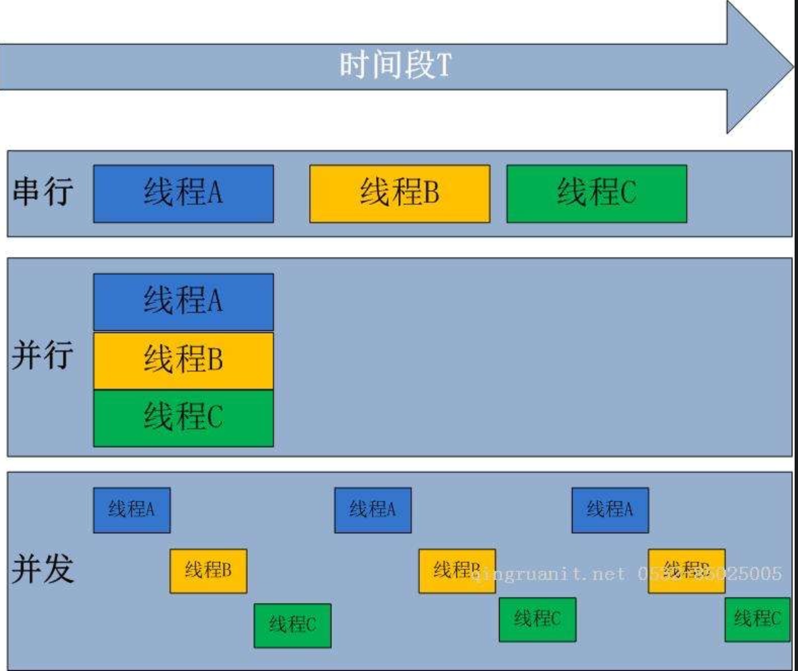

### [Q：线程和进程的区别]

- 一个线程从属于一个进程，一个进程可以包含多个线程

- 一个进程挂掉，不会影响其他进程，一个线程挂掉，对应的进程挂掉（如果是正常的线程中止或者死循环这样的死掉，对进程的其他线程是没有影响的。如果是段错误除数为零等这类意外的死掉，默认情况就会中止整个进程，如果安装了对应的信号处理函数，就会触发信号处理调用。）

- 进程是系统资源调度的最小单位；线程是CPU调度的最小单位

- 进程系统开销大于线程开销，线程需要的系统资源更少

- 进程在执行的时候拥有独立的内存单元，多个线程共享进程的内存，如代码段、数据段、扩展段；但每个线程拥有自己的栈段和寄存器组

- **进程切换时需要刷新TLB并获取新的地址空间，然后切换硬件上下文和内核栈，线程切换时只需要切换硬件上下文和内核栈。**

- 通信方式不一样

  线程：锁机制、信号量；

  进程：管道、有名管道、信号量、消息队列、共享内存、套接字、信号

- 进程适用于多核、多机发布；线程适用于多核。

### [Q: 进程和线程在资源分配方面的区别？]

线程是操作系统能够运行调度的最小单位，分配算力、执行调度以线程为单位。一条线程就是指单一顺序的控制流。

进程是正在运行的程序实例，是线程集合的载体，是操作系统分配资源的基本单位。

线程可以并发执行，并共享进程资源。**线程间拥有独立的栈区，但共享进程使用的堆区**。

进程是资源分配最小单位，线程是程序执行的最小单位；

内存分配方面：系统在运行的时候会为每个进程分配不同的内存空间；而对线程而言，除了CPU外，系统不会为线程分配内存，因为线程所使用的资源来自其所属进程的资源，线程族之间只能共享资源。进程有自己独立的地址空间，每启动一个进程，系统都会为其分配地址空间，建立数据表来维护代码段、堆栈段和数据段，线程没有独立的地址空间，它使用相同的地址空间共享数据；

### 进程切换为什么比线程消耗更多资源？

答：进程切换时需要刷新并获取新的地址空间，然后切换硬件上下文和内核栈；线程切换时只需要切换硬件上下文和内核栈。

解析：

**进程是程序的动态表现。** 一个程序进行起来后，会使用很多资源，比如使用寄存器，内存，文件等。每当切换进程时，必须要考虑保存当前进程的状态。状态包括存放在内存中的程序的代码和数据，它的栈、通用目的寄存器的内容、程序计数器、环境变量以及打开的文件描述符的集合，这个状态叫做上下文（Context）。可见，想要切换进程，保存的状态还不少。不仅如此，由于虚拟内存机制，进程切换时需要**刷新TLB**并获取新的地址空间。

线程存在于进程中，一个进程可以有一个或多个线程。**线程是运行在进程上下文中的逻辑流**，这个线程可以独立完成一项任务。同样线程有自己的上下文，包括唯一的整数线程ID， 栈、栈指针、程序计数器、通用目的寄存器和条件码。**可以理解为线程上下文是进程上下文的子集。**

**由于保存线程的上下文明显比进程的上下文小，因此系统切换线程时，必然开销更小。**

TLB：translation lookaside buffer，以理解为页表缓冲,地址变换高速缓存。 

### [Q：说一说线程的状态]

3种基本状态：运行、就绪和阻塞

- 就绪：当一个进程获得了除处理机以外的一切所需资源，一旦得到处理机即可运行，此时进程属于就绪状态。就绪进程可以按多个优先级来划分队列。例如，当一个进程由于时间片用完而进入就绪状态时，排入低优先级队列；当进程由I／O操作完成而进入就绪状态时，排入高优先级队列。
- 运行：当一个进程在处理机上运行时，则称该进程处于运行状态。处于此状态的进程的数目小于等于处理器的数目，对于单处理机系统，处于运行状态的进程只有一个。在没有其他进程可以执行时（如所有进程都在阻塞状态），通常会自动执行系统的空闲进程。
- 阻塞：也称为等待或睡眠状态，一个进程正在等待某一事件发生（例如请求I/O而等待I/O完成等）而暂时停止运行，这时即使把处理机分配给进程也无法运行，故称该进程处于阻塞状态。

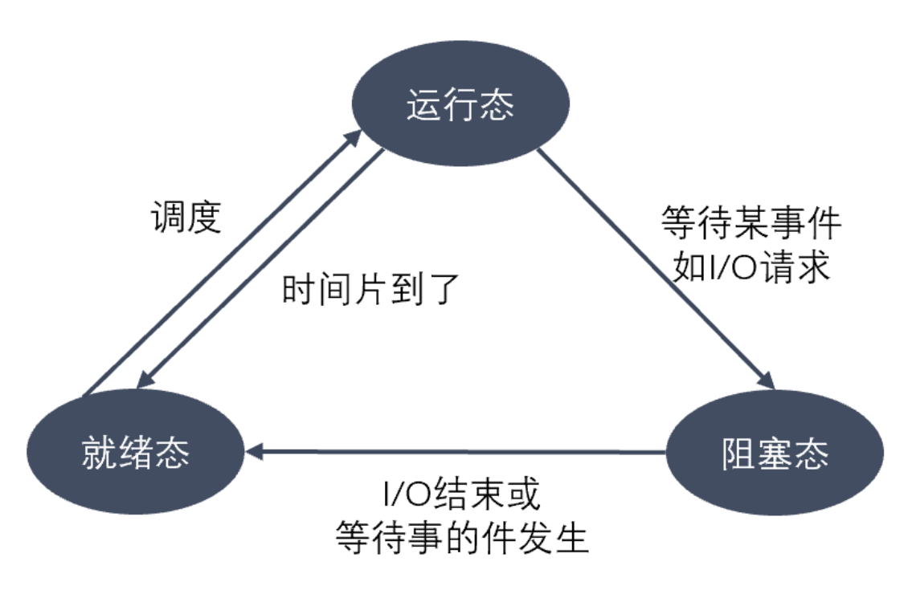

五种状态：

- **创建状态**：进程在创建时需要申请一个空白PCB，向其中填写控制和管理进程的信息，完成资源分配。如果创建工作无法完成，比如资源无法满足，就无法被调度运行，把此时进程所处状态称为创建状态

- **就绪状态**：进程已经准备好，已分配到所需资源，只要分配到CPU就能够立即运行

- **执行状态**：进程处于就绪状态被调度后，进程进入执行状态

- **阻塞状态**：正在执行的进程由于某些事件（I/O请求，申请缓存区失败）而暂时无法运行，进程受到阻塞。在满足请求时进入就绪状态等待系统调用

- **终止状态**：进程结束，或出现错误，或被系统终止，进入终止状态。无法再执行

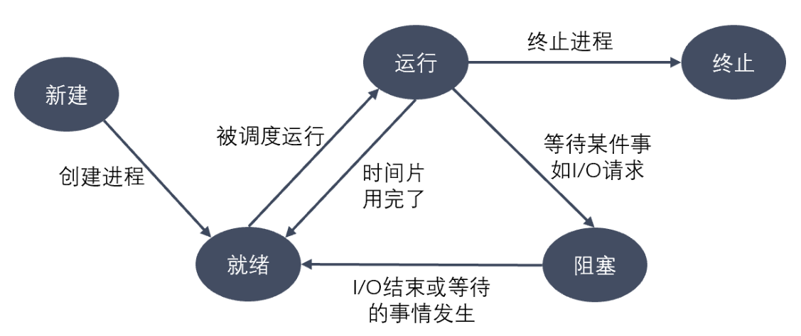

### [Q：CPU调度的最小单位是什么？线程需要CPU调度吗？]

- 进程是CPU分配资源的最小单位，线程是CPU调度的最小单位。

- 线程是比进程更小的能独立运行的基本单位，需要通过CPU调度来切换上下文，达到并发的目的。

### [Q: 多线程通讯机制（进程间见：进程间通信方式(7种)区别）]

https://blog.csdn.net/parallelyk/article/details/51685464

java线程的通信方式大致有四种：

1.volatile：保证可见性和有序性，禁止指令重排，可见性就是线程都必须到主内存读取数据

2.等待/通知机制：基于wait和notify方法实现的。

- 使用wait，notify和notifyAll必需先对调用的对象加锁。即等待通知机制依赖于同步机制。先synchronize(对象)，再调用 对象.wait()。

- wait：线程从运行状态进入等待状态，并且释放该对象的锁。该线程被放入对象的等待队列。只有接到notify通知或被中断或超时才会返回。

- notify：通知一个在对象上wait的线程，将其或所有（notifyAll）线程从等待队列移到同步队列，调用notify的线程执行完毕释放锁后，同步队列的线程就可以竞争，谁得到锁对象谁就返回执行

  


3.join方式：当前线程调用一个线程的join方法，会阻塞当前线程，直到等待的线程执行完毕。当前线程再由阻塞状态转为就绪状态，等待cpu资源分配

4.threadLocal：和上面三种方式的多线程通信不同的是，threadlocal更像一个线程内部通信，将当前线程和一个map绑定，当前线程内可以存取数据，减少方法调用参数的传递

### [Q：知道什么锁？]

- 悲观锁

锁的类型，无论是否并发竞争资源，都会锁住资源，并等待资源释放下一个线程才能获取到锁。

- 乐观锁

锁类型。当线程开始竞争资源时，不是立马给资源上锁，而是进行一些前后值比对，以此来操作资源。例如常见的CAS操作，就是典型的乐观锁。示例如下：

```c
int cas(long *addr, long old, long new) {
    /* 原子执行 */
    if(*addr != old)
        return 0;
    *addr = new;
    return 1;
}
```

- 自旋锁

基础的同步原语，用于保障对共享数据的互斥访问。与互斥锁的相比，在获取锁失败的时候不会使得线程阻塞而是一直自旋尝试获取锁。当线程等待自旋锁的时候，CPU不能做其他事情，而是一直处于轮询忙等的状态。

适用于被持有时间短，线程不希望在重新调度上花过多时间。实际上许多其他类型的锁在底层使用了自旋锁实现，例如多数互斥锁在试图获取锁的时候会先自旋一小段时间，然后才会休眠。如果在持锁时间很长的场景下使用自旋锁，则会导致CPU在这个线程的时间片用尽之前一直消耗在无意义的忙等上，造成计算资源的浪费。

```c
// 用户空间用 atomic_flag 实现自旋互斥
#include <thread>
#include <vector>
#include <iostream>
#include <atomic>

std::atomic_flag lock = ATOMIC_FLAG_INIT;

void f(int n)
{
    for (int cnt = 0; cnt < 100; ++cnt) {
        while (lock.test_and_set(std::memory_order_acquire))  // 获得锁
             ; // 自旋
        std::cout << "Output from thread " << n << '\n';
        lock.clear(std::memory_order_release);               // 释放锁
    }
}

int main()
{
    std::vector<std::thread> v;
    for (int n = 0; n < 10; ++n) {
        v.emplace_back(f, n);
    }
    for (auto& t : v) {
        t.join();
    }
}
```

- 公平锁

多个线程竞争同一把锁，如果依照先来先得的原则，那么就是一把公平锁。

- 非公平锁

多个线程竞争锁资源，抢占锁的所有权。

- 共享锁

多个线程可以共享这个锁的拥有权。一般用于数据的读操作，防止数据被写修改。共享锁的代码示例如下：

```c
 #include <shared_mutex>
    #include <mutex>
    #include <iostream>
    #include <thread>
    #include <chrono>

    std::shared_mutex test_lock;

    std::mutex cout_lock;

    int arr[3] = {11, 22, 33};

    void unique_lock_demo(int id)
    {
        std::unique_lock lock{test_lock};

        for(int i =0; i < 3; i++)
        {
                arr[i] = i + 100 * id;
        }

        for(int i = 0; i < 3; i++)
        {
            std::unique_lock pl(cout_lock);
            std::cout << "In unique: " << id << ": " << arr[i] << std::endl;
            pl.unlock();
            std::this_thread::sleep_for(std::chrono::seconds(1));
        }
    }


    void shared_lock_demo(int id)
    {
        std::shared_lock lock{test_lock};

        for(int i = 0; i < 3; i++)
        {
            std::unique_lock pl(cout_lock);
            std::cout << "In shared " << id << ": " << arr[i] << std::endl;
            pl.unlock();
            std::this_thread::sleep_for(std::chrono::seconds(1));
        }
    }

    int main()
    {

       std::thread t3(unique_lock_demo,3);
       std::thread t4(unique_lock_demo,4);
       std::thread t1(shared_lock_demo,1);
       std::thread t2(shared_lock_demo,2);

       t1.join();
       t2.join();
       t3.join();
       t4.join();
       return 0;
    }
```

输出为：

```
    In unique: 3: 300
    In unique: 3: 301
    In unique: 3: 302
    In shared 1: 300
    In shared 2: 300
    In shared 1: 301
    In shared 2: 301
    In shared 1: 302
    In shared 2: 302
    In unique: 4: 400
    In unique: 4: 401
    In unique: 4: 402
```

从这个输出可以看出：

如果一个线程已经获取了*共享锁*，则其他任何线程都无法获取*互斥锁*，但是可以获取*共享锁*。

从这个输出可以看出，验证了如果一个线程已经获取了*互斥锁*，则其他线程都无法获取该锁。

- 死锁

死锁是指两个或两个以上的进程在执行过程中，由于竞争资源或者由于彼此通信而造成的一种阻塞的现象，若无外力作用，它们都将无法推进下去。此时称系统处于死锁状态或系统产生了死锁，这些永远在互相等待的进程称为死锁进程。

```c
mutex;   //代表一个全局互斥对象
void  A()
{
    mutex.lock();
    //这里操作共享数据
    B();  //这里调用B方法
    mutex.unlock();
    return;
}
void  B()
{
    mutex.lock();
    //这里操作共享数据
    mutex.unlock();
    return;
}
```

### [Q: 什么情况下产生死锁？]

如果在计算机系统中同时具备下面四个必要条件时，那么会发生死锁。换句话说，只要下面四个条件有一个不具备，系统就不会出现死锁：互斥条件、不剥夺条件、请求与保持条件、循环等待条件

- 互斥条件。即某个资源在一段时间内只能由一个进程占有，不能同时被两个或两个以上的进程占有。这种独占资源如CD-ROM驱动器，打印机等等，必须在占有该资源的进程主动释放它之后，其它进程才能占有该资源。这是由资源本身的属性所决定的。

  ```c
  #include <list>
  #include <mutex>
  #include <algorithm>
  
  std::list<int> some_list;    // 1
  std::mutex some_mutex;    // 2
  
  void add_to_list(int new_value)
  {
    std::lock_guard<std::mutex> guard(some_mutex);    // 3
    some_list.push_back(new_value);
  }
  
  bool list_contains(int value_to_find)
  {
    std::lock_guard<std::mutex> guard(some_mutex);    // 4
    return std::find(some_list.begin(),some_list.end(),value_to_find) != some_list.end();
  }
  ```

  代码中有一个全局变量①，这个全局变量被一个全局的互斥量保护②。add_to_list()③和list_contains()④函数中使用std::lock_guard<std::mutex>，使得这两个函数中对数据的访问是互斥的：list_contains()不可能看到正在被add_to_list()修改的列表。

- 不剥夺条件。进程所获得的资源在未使用完毕之前，资源申请者不能强行地从资源占有者手中夺取资源，而只能由该资源的占有者进程自行释放。

- 请求和保持条件。进程至少已经占有一个资源，但又申请新的资源；由于该资源已被另外进程占有，此时该进程阻塞；但是，它在等待新资源之时，仍继续占用已占有的资源。

- 循环等待条件。存在一个进程等待序列{P1，P2，...，Pn}，其中P1等待P2所占有的某一资源，P2等待P3所占有的某一源，......，而Pn等待P1所占有的的某一资源，形成一个进程循环等待环。

  ```sh
  std::mutex m;
  void f()
  {
  	// ....
  	std::lock_guard lock(m); // 1 子线程锁住互斥量m
  	// ...
  }
  int main()
  {
  	std::thread t(f);
  	std::lock_guard lock(m); // 2 主线程锁住互斥量m
  	// ...
  	t.join(); // 3 等待子线程结束
  	return 0;
  }
  ```

  上述过程可能导致在2处上锁，然后子线程在1处发生阻塞，最后主线程在3处一直等待子线程结束，无穷等待下去。

 上面提到的这四个条件在死锁时会同时发生。也就是说，只要有一个必要条件不满足，则死锁就可以排除。

### [Q: 什么是自旋锁？]

当一个线程尝试去获取某一把锁的时候，如果这个锁此时已经被别人获取(占用)，那么此线程就无法获取到这把锁，该线程将会等待，间隔一段时间后会再次尝试获取。这种采用**循环加锁 -> 等待的机制**被称为自旋锁(spinlock)。

**自旋锁有以下特点**

- 用于临界区互斥
- 在任何时刻最多只能有一个执行单元获得锁
- 要求持有锁的处理器所占用的时间尽可能短
- 等待锁的线程进入忙循环

**自旋锁存在的问题**

- 如果某个线程持有锁的时间过长，就会导致其它等待获取锁的线程进入循环等待，消耗CPU。使用不当会造成CPU使用率极高。
- 无法满足等待时间最长的线程优先获取锁。不公平的锁就会存在“线程饥饿”问题。

**自旋锁的优点**

- 自旋锁不会使线程状态发生切换，一直处于用户态，即线程一直都是active的；不会使线程进入阻塞状态，减少了不必要的上下文切换，执行速度快
- 非自旋锁在获取不到锁的时候会进入阻塞状态，从而进入内核态，当获取到锁的时候需要从内核态恢复，需要线程上下文切换。（线程被阻塞后便进入内核（Linux）调度状态，这个会导致系统在用户态与内核态之间来回切换，严重影响锁的性能）

**自旋锁与互斥锁的区别**

- 自旋锁与互斥锁都是为了实现保护资源共享的机制。
- 无论是自旋锁还是互斥锁，在任意时刻，都最多只能有一个保持者。
- 获取互斥锁的线程，如果锁已经被占用，则该线程将进入睡眠状态；获取自旋锁的线程则不会睡眠，而是一直循环等待锁释放。

### [Q: synchronized在使用时需要什么对象？]

https://www.cnblogs.com/yewy/p/13584915.html

https://blog.csdn.net/weixin_45775746/article/details/122639630

Synchronized优化以前性能不如Lock，因为在优化之前一旦使用synchronized就会发生系统调用进入**内核态**，所以性能很差。引入了**偏向锁**、**轻量级锁**、**重量锁**、**锁消除**、**锁粗化**，才使得synchronized性能大大提升。

对象头信息：


对象头分为两个部分：

- mark word：存储对象hashcode、分代年龄、锁标志（偏向、轻量、重量）、线程id等信息。占用8字节

- class point：指向当前对象的类在元空间首地址，固定占4字节；

java对象主要有三种状态：

- 无锁状态
- 加锁状态
- gc标记状态。

Mark word标志：


我们可以看到当锁膨胀为轻量锁或重量锁时，对象头中62bit都用来存储锁记录（Lock record）的地址了，那他们的分代年龄、hashcode这些信息去哪了呢？其实就存在于锁记录空间中，而锁记录是存在于**当前线程的栈帧**中的。虚拟机会使用**CAS**操作尝试把mark word指向当前的Lock record，如果修改成功，则当前线程获取到该锁，并标记为00轻量锁，如果修改失败，虚拟机会检查对象的mark word是否指向当前线程的栈帧，如果是，则直接获取锁执行即可，否则则说明有其它线程和当前线程在竞争锁资源，直接膨胀为重量级锁，等待的线程则进入阻塞状态。

### [Q: 对悲观锁的理解？]

悲观锁总是假设最坏的情况，每次去拿数据的时候都认为别人会修改，所以每次在拿数据的时候都会上锁，这样别人想拿这个数据就会阻塞直到它拿到锁（**共享资源每次只给一个线程使用，其它线程阻塞，用完后再把资源转让给其它线程**）。传统的关系型数据库里边就用到了很多这种锁机制，比如行锁，表锁等，读锁，写锁等，都是在做操作之前先上锁。

### [Q: 对乐观锁的理解？]

乐观锁总是假设最好的情况，每次去拿数据的时候都认为别人不会修改，所以不会上锁，但是在更新的时候会判断一下在此期间别人有没有去更新这个数据，可以使用版本号机制和CAS算法实现。**乐观锁适用于多读的应用类型，这样可以提高吞吐量**，像数据库提供的类似于**write_condition机制**，其实都是提供的乐观锁。

### [Q: CAS使用场景？]

- CAS，CompareAndSwap。有3个操作数：内存地址V，旧的预期值A，要更新的目标值B；CAS指令执行时，当且仅当内存地址V的值和预期值A相等时，将内存地址V的值修改为B，否则什么都不做。整个比较并替换的操作是一个原子操作。

- 高并发环境下，对同一个数据的**并发读**（两边都读出余额是100）与**并发写**（一个写回28，一个写回38）导致的数据一致性问题：

  解决方案是在set写回的时候，加上初始状态的条件compare，只有初始状态不变时，才允许set写回成功，这是一种常见的降低读写锁冲突，保证数据一致性的方法。

## 内存

### [Q: 内存管理的作用？]

- 内存的分配与回收（malloc函数：申请内存，free函数：释放内存）

- 地址转换：将逻辑地址转换成相应的物理地址

### [Q: 内存管理机制？]

简单分为（程序内存分配的空间是否连续）：

- 连续分配管理方式：

  为一个用户程序分配一个连续的内存空间，常见如：块式管理

  - 块式管理：

    远古时代的计算机操系统的内存管理⽅式。将内存分为⼏个固定⼤⼩的块，每个块中只包含⼀个进程。如果程序运⾏需要内存的话，操作系统就分配给它⼀块，如果程序运⾏只需要很⼩的空间的话，分配的这块内存很⼤⼀部分⼏乎被浪费了。这些在每个块中未被利⽤的空间，我们称之为碎⽚

- 非连续分配管理方式：

  允许一个程序使用的内存分配在离散或者不相邻的内存中，常见如：页式管理、段式管理

  - 页式管理：

    把内存分为大小相等页的形式，页比较小，相比块式管理的划分力度更大，提高了内存的利用率，减少了碎片

  - 段式管理：

    页式管理虽提高内存利用率，但是页式管理中的页并无实际意义。段式管理把内存分为一段一段。每一段比每一页的空间小很多。但是，段具有实际意义，每一段定义了一组逻辑信息，例如：主程序段MAIN、子程序段X、数据段D、栈段S等。

  - 段页式管理：

    结合段式管理和页式管理的优点。简单来说，就是把内存分为若干段，每一段又分为若干页。


### [Q: 虚拟内存、物理内存和逻辑内存都是什么，关系和区别]

虚拟内存也叫一个逻辑内存。

以前呢，进程是直接和物理内存打交道的。那一个程序，它的一个寻址能力，取决于cpu的地址线的条数。比如一个32位的操作系统，程序的寻址范围就是2^32也就是4g。如果没有虚拟内存，每次开启一个进程都要给到一个4g的物理内存，就可能出现很多问题：比如：

1. 物理内存是有限的，每个程序给到一个4g内存，那物理内存就很快分配完。没被分配到内存的进程就要等待。只有进程执行完，才会把等待的进程装入内存。这频繁装入效率很低。
2. 程序指令都是直接访问物理内存，那进程之间可以互相修改进程数据，这肯定不行，比如我的qq可以修改到我的微信的进程的数据。
3. 内存分配的时候是随机分配的，程序运行的地址就会有问题。

虚拟内存呢，它可以让每个程序都认为自己有4g的空间，实际上呢，这个虚拟内存对应在物理内存只是一点点空间。实际上用了多少内存，就对应多少物理内存。

进程也会认为自己的4g内存是连续的地址空间，其实是被分隔成多个物理内存碎片，还有一部分存储在外部存储器上，需要时再调换。

所有程序是共享同一块物理内存的，每个程序只是把一部分装入物理内存，其他的留在外存。

程序访问一个地址的时候，需要把地址翻译为实际物理地址。这里用到页表（物理内存被分为一页一页）。页表记录页是不是在物理内存上、在物理内存上的地址。

如果程序要访某个虚拟地址的时候，页不在页表上，也就是该程序要访问的数据不在虚拟地址上，就出现缺页的情况。那操作系统就会阻塞这个进程（程序），把对应的页调入物理内存。如果内存已经满了，那要找一个页覆盖。具体覆盖哪个页基于操作系统的页面置换算法。


常见的页面置换算法：

- OPT页面置换（最佳页面置换算法）：选择的被淘汰永不使⽤的页，这是理想的算法，实际无法预测。一般做衡量标准
- 先进先出页面置换：淘汰最先加入内存的页，就是淘汰呆在物理内存时间最久的页面
- LRU（Least currently used，最近最久未使用页面置换算法
- LFU（Least frequently used，最少使用页面置换算法）

### [Q: 虚拟空间地址的布局？读取一个文件映射到什么地方]

内存管理的分页原理是：有一个分页，保存每个页的起始地址，再加上再页内的偏移量，组成线性地址，能对内存中每个位置进行访问。页的大小一般是4KB

**虚拟地址分为两个部分，页号和页内偏移。页号作为页表的索引，页表包含物理页所在物理内存的基地址。利用这个基地址和页内偏移量就可以组成物理内存地址。**


32位环境，虚拟地址空间共4GB。因为4KB一个页，那需要4GB/4KB=1M个页；页表中每个页表项需要4个字节（B）存储，那4GB空间的映射就需要4B*1M=4MB的内存来存储映射表（页表）。如果每个进程都有自己的映射表，100个进程就需要400MB的内存，对于内核来说相当大；

我们可以将页表再分，把4MB的页表分成1K个4KB（一个页大小），所以可以再把4MB的页表分为1K个页，对这1K个页需要一个表进行管理，即页目录表；页目录表有1K项（每项对应页表上一个页）。

对于每个进程分配一个数据页，如果只使用页表，那需要1M个页表项共4M的内存。如果使用页目录，页目录表有1K项，占用内存4KB。但是每个线程只使用到页目录其中一项，到页表项，只需要分配页目录那一项对应的页表项页共4KB（该页表项页有1K个页表项）就可以了，也就4KB，远比4MB小得多。

知识点：一个页占4KB，一个页表项占4B，一个页可以存1K个页表项


内存管理系统总结：

1.虚拟内存空间的管理，将虚拟内存分为大小相等的页；

2.物理内存空间的管理，将物理内存分为大小相等的页；

3.内存映射，将虚拟内存页和物理内存页映射起来，并在内存紧张的时候可以换出到硬盘中；

### [Q：操作系统的地址种类]

- 物理地址

  在存储器里以字节为单位存储信息，为正确地存放或取得信息，每一个字节单元给以一个唯一的存储器地址，称为物理地址（Physical Address），又叫实际地址或绝对地址。

  地址从0开始编号，顺序地每次加1，因此存储器的物理地址空间是呈线性增长的。它是用二进制数来表示的，是无符号整数，书写格式为十六进制数。它是出现在CPU外部地址总线上的寻址物理内存的地址信号，是地址变换的最终结果。用于内存芯片级的单元寻址，与处理器和CPU连接的地址总线相对应。

- 逻辑地址

  逻辑地址是指在计算机体系结构中是指应用程序角度看到的内存单元（memory cell）、存储单元（storage element）、网络主机（network host）的地址。 逻辑地址往往不同于物理地址（physical address），通过地址翻译器（address translator）或映射函数可以把逻辑地址转化为物理地址。

  在有地址变换功能的计算机中,访问指令给出的地址 (操作数) 叫逻辑地址,也叫相对地址。要经过寻址方式的计算或变换才得到内存储器中的物理地址。把用户程序中使用的地址称为相对地址即逻辑地址。逻辑地址由两个16位的地址分量构成，一个为段基值，另一个为偏移量。两个分量均为无符号数编码。

- 线性地址

  线性地址（Linear Address）是逻辑地址到物理地址变换之间的中间层。在分段部件中逻辑地址是段中的偏移地址，然后加上基地址就是线性地址。

  线性地址是一个32位无符号整数，可以用来表示高达4GB的地址，也就是，高达4294967296个内存单元。线性地址通常用十六进制数字表示，值的范围从0x00000000到0xffffffff）。程序代码会产生逻辑地址，通过逻辑地址变换就可以生成一个线性地址。如果启用了分页机制，那么线性地址可以再经过变换以产生一个物理地址。当采用4KB分页大小的时候，线性地址的高10位为页目录项在页目录表中的编号，中间10位为页表中的页号，其低12位则为偏移地址。如果是使用4MB分页机制，则高10位页号，低22位为偏移地址。如果没有启用分页机制，那么线性地址直接就是物理地址。

## 操作

### [Q：什么是系统调用？]

可分为如下几类：

- 设备管理：完成设备的请求与释放，以及设备启动等功能
- 文件管理：完成文件的读、写、创建及删除等功能
- 进程控制：完成进程的创建、撤销、阻塞及唤醒等功能
- 进程通信：完成进程之间的消息传递或信号传递等功能
- 内存管理：完成内存的分配、回收以及作业占用内存大小及地址等功能

### [Q: 什么是操作系统]

- 是管理计算机硬件和软件资源的程序，是计算机系统的内核与基石
- 本质上是运行在计算机上的软件程序
- 为用户提供一个与系统交互的操作界面
- 分内核和外壳：内核是能操作硬件的程序，外壳是围绕内核的应用程序

## I/O

### [Q：IO多路复用]

- IO多路复用是一种同步IO模型，解决进程或线程阻塞到某个 I/O 系统调用的问题，使进程不阻塞于某个特定的 I/O 系统调用。实现一个线程可以监视多个文件句柄；

- 原理：用户将想要监视的文件描述符（File Descriptor）添加到select/poll/epoll函数中，由内核监视，函数阻塞。一旦有文件描述符就绪（读就绪或写就绪），或者超时（设置timeout），函数就会返回，然后该进程可以进行相应的读/写操作。

- 什么是文件描述符？

  在形式上是一个非负整数。实际上，是一个索引值，指向内核为每个进程所维护的该进程打开文件的记录表。当程序打开一个现有文件或者创建一个新文件时，内核向进程返回 一个文件描述符。

  内核通过文件描述符来访问文件。文件描述符指向一个文件。

- 实现方式有：select、poll、epoll

  - select：时间复杂度O(n)，它仅仅知道IO事件的发送，并不知道具体是哪几个流（可能有一个、多个、甚至全部），只能无差别轮询所有流，找出能读出的数据。或者写入数据的流，对他们进行操作。所以select具有O(n)的无差别轮询复杂度，同时处理的流越多，无差别轮询时间就越长。

    ```c
    int select(int n,fd_set *readfds,fd_set *writefds,fd_set *exceptfds,struct timeval *timeout);
    ```

    select函数监视的文件描述符有3类：writefds、readfds、exceptfds。调用select函数会阻塞，直到有描述符就绪（有数据可读、可写或except），或者超时（timeout指定等待时间，如果立即返回设为null即可），函数返回。当select函数返回后，可以 通过遍历fdset，来找到就绪的描述符。

    select几乎支持所有平台，具有良好的跨平台支持。缺点在于单个进程能够监视的文件描述符的数量存在最大限制，在Linux上一般为1024，可以通过修改宏定义甚至重新编译内核的方式提升该限制，但是效率会降低。

  - poll：时间复杂度：O（n）。poll本质和select没有区别，它将用户传入的数据拷贝到内核空间，然后查询每个fd对应的设备状态，但是它没有最大连接数的限制，原因是它是基于链表来存储的。

    ```c
    int poll(struct pollfd *fds,unsigned int nfds,int timeout);
    ```

    不同select使用的3个位图来表示fdsset，poll使用一个pollfd的指针：

    ```c
    struct pollfd{
         /* file descriptor */
        int fd;
       
        /* requested events to watch */ 
        short events;
            
        /* returned events witnessed */ 
        short revents; 
    };
    ```

    pollfd结构包含了要监视的event和发生的event，不再使用select “参数-值”传递的方式。同时，pollfd并没有最大数量限制（但是数量过大后性能下降）。和select函数一样，poll返回后，需要轮询pollfd来获取就绪的描述符。

  - epoll：时间复杂度O(1),epoll可理解为event poll，不同于忙轮询和无差别轮询，epoll会把对应流发生的IO事件进行通知，所以epoll是事件驱动的（每个事件关联上fd），此时对流的操作都是有意义。

    epoll操作过程需要3个接口：

    ```
    // 创建一个epoll句柄，size告诉内核监听的数目一共多大
    int epoll_create(int size);
    
    int epoll_ctl(int epfd,int op,int fd,struct epoll_event *event);
    
    int epoll_wait(int epfd,struct epoll_event *events,int maxevents,int timeout);
    ```

    - int epoll_create(int size)：创建一个epoll的句柄，size用来告诉内核这个监听的数目一共有多大，这个参数不同于select()中的第一个参数，给出最大监听的fd+1的值，参数size并不是限制了epoll所能监听的描述符最大个数，只是对内核初始分配内部数据结构的一个建议。当创建好epoll句柄后，它就会占用一个fd值，在linux下如果查看/proc/进程id/fd/，是能够看到这个fd的，所以在使用完epoll后，必须调用close()关闭，否则可能导致fd被耗尽。
    - int epoll_ctl(int epfd, int op, int fd, struct epoll_event *event)：函数是对指定描述符fd执行op操作。- epfd：是epoll_create()的返回值。- op：表示op操作，用三个宏来表示：添加EPOLL_CTL_ADD，删除EPOLL_CTL_DEL，修改EPOLL_CTL_MOD。分别添加、删除和修改对fd的监听事件。- fd：是需要监听的fd（文件描述符）- epoll_event：是告诉内核需要监听什么事，
    - int epoll_wait(int epfd, struct epoll_event * events, int maxevents, int timeout)：等待epfd上的io事件，最多返回maxevents个事件。参数events用来从内核得到事件的集合，maxevents告之内核这个events有多大，这个maxevents的值不能大于创建epoll_create()时的size，参数timeout是超时时间（毫秒，0会立即返回，-1将不确定，也有说法说是永久阻塞）。该函数返回需要处理的事件数目，如返回0表示已超时。

- select、poll、epoll区别

  - 支持一个进程所能打开的最大连接数

    | 函数   | 支持一个进程所能打开的最大连接数                             |
    | ------ | ------------------------------------------------------------ |
    | select | 单个进程所能打开的最大连接数有FD_SETSIZE宏定义，其大小是32个整数的大小（在32位的机器上，大小就是32*32，同理64位机器上为32*64），可以对其进行修改，然后重新编译内核，但是性能可能会受到影响，需要进一步测试 |
    | poll   | 本质与select没有区别，但是没有最大连接数的限制，因为它是基于链表来存储的 |
    | epoll  | 连接数有上限，但是很大，1G内存的机器上可以打开10万左右的连接，2G内存的机器可以打开20万左右的连接 |
  
  - FD剧增后带来的IO效率问题
  
    | 函数   | FD剧增后带来的IO效率问题                                     |
    | ------ | ------------------------------------------------------------ |
    | select | 每次调用时都会对连接进行线性遍历，随着FD的增加会造成遍历速度慢的“性能线性下降的问题” |
    | poll   | 同上                                                         |
    | epoll  | epoll内核中实现是根据每个fd上的callback函数来实现，只有活跃的socket才会主动调用callback，所以活跃socket较少的情况下，使用epoll没有前面两者的线性下降的性能问题，但是所有socket都很活跃的情况下，可能会有性能问题 |

  - 消息传递方式
  
    | 函数   | 消息传递方式                                   |
    | ------ | ---------------------------------------------- |
    | select | 内核需要将消息传递到用户空间，需要内核拷贝动作 |
    | poll   | 同上                                           |
    | epoll  | epoll通过内核和用户空间共享一块内存来实现      |

### [Q：poll和epoll的区别？]

- poll将用户传入的数组拷贝到内核空间，然后查询每个fd对应的设备状态，如果设备就绪则设备等待队列中加入一项并继续遍历，如果遍历完所有fd后没有发现就绪设备，则挂起当前线程，直到设备就绪或者主动超时，被唤醒后它又再次遍历fd。这个过程经历了多次无谓的遍历。

  没有最大连接数的限制，原因是它是基于链表来存储的，但是同样有缺点：

  - 大量的fd的数组被整体复制于用户态和内核地址空间之间，而不管这样的复制是不是有意义。
  - poll还有一个特点是“水平触发”，如果报告了fd后，没有被处理，那么下次poll时会再次报告该fd。

- epoll是在2.6内核中提出的，是之前select和poll的增强版本，相对于select和poll来说，epoll更加灵活，没有描述符限制。epoll使用一个文件描述符管理多个描述符，将用户关系的文件描述符的事件存放到内核的一个时间表中，这样在用户空间和内核空间的copy只需要一次。

  epoll支持水平触发和边缘触发，最大特点在于边缘触发，只告诉进程哪些fd刚刚变为就绪态，并且只会通知一次。还有 一个特点：epoll使用“事件”的就绪通知方式，通过epoll_ctl注册fd，一旦该fd就绪，内核就会采用类似callback的回调机制来激活该fd，epoll_wait便可以收到通知，优点：

  - 没有最大并发连接的限制，能打开的FD的上限远大于1024（1G的内存上能监听约10万个端口）。
  - 效率提升，不是轮询的方式，不会随着FD数目的增加效率下降。只有活跃可用的FD才会调用callback函数；即Epoll最大的优点就在于它只管你“活跃”的连接，而跟连接总数无关，因此在实际的网络环境中，Epoll的效率就会远远高于select和poll。
  - 内存拷贝，利用mmap()文件映射内存加速与内核空间的消息传递；即epoll使用mmap减少复制开销。

### [Q：select和epoll的区别？]

epoll对文件描述符的操作有两种模式：LT（水平触发，level trigger）和ET（边缘触发，edge trigger）。LT模式是默认模式。区别如下：

- LT模式：当epoll_wait检测到描述符事件发生并将此事件通知应用程序，应用程序可以不立即处理该事件。下次调用epoll_wait时，会再次响应应用程序并通知此事件。

- ET模式：当epoll_wait检测到描述符事件发生并将此事件通知应用程序，应用程序必须立即处理该事件。如果不处理，下次调用epoll_wait时，不会再次响应应用程序并通知此事件。

1. **LT模式**

LT(level triggered)是缺省的工作方式，并且同时支持block和no-block socket。在这种做法中，内核告诉你一个文件描述符是否就绪了，然后你可以对这个就绪的fd进行IO操作。如果你不作任何操作，内核还是会继续通知你的。

1. **ET模式**

ET(edge-triggered)是高速工作方式，只支持no-block socket。在这种模式下，当描述符从未就绪变为就绪时，内核通过epoll告诉你。然后它会假设你知道文件描述符已经就绪，并且不会再为那个文件描述符发送更多的就绪通知，直到你做了某些操作导致那个文件描述符不再为就绪状态了(比如，你在发送，接收或者接收请求，或者发送接收的数据少于一定量时导致了一个EWOULDBLOCK 错误）。但是请注意，如果一直不对这个fd作IO操作(从而导致它再次变成未就绪)，内核不会发送更多的通知(only once)。

ET模式在很大程度上减少了epoll事件被重复触发的次数，因此效率要比LT模式高。epoll工作在ET模式的时候，必须使用非阻塞套接口，以避免由于一个文件句柄的阻塞读/阻塞写操作把处理多个文件描述符的任务饿死。

### [Q：epoll的原理，它的查询速度是O(1)的吗？]

epoll是一种更加高效的IO多路复用的方式，不同于忙轮询和无差别轮询，epoll会把哪个流发生了怎样的I/O事件通知我们。时间复杂度为O(1)。

epoll的执行过程如图所示：

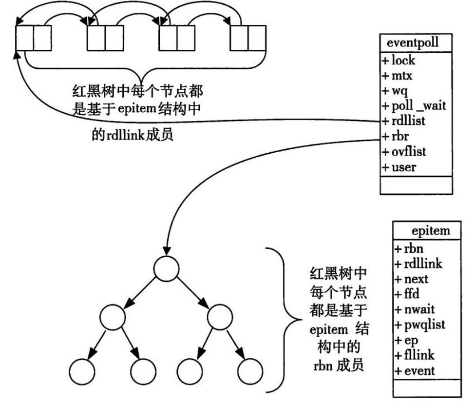

1. 创建红黑树，调用epoll_create()创建一颗空的红黑树，用于存放FD及其感兴趣事件；
2. 注册感兴趣事件，调用epoll_ctl()向红黑树中添加节点（FD及其感兴趣事件），时间复杂度O(logN)，向内核的中断处理程序注册一个回调函数，告诉内核，如果这个句柄的中断到了，就把它添加到就绪队列中。所以，当一个socket上有数据到了，内核在把网卡上的数据copy到内核中后就来把socket插入到就绪队列中了；
3. 获取就绪事件，调用epoll_wait()返回就绪队列中的就绪事件，时间复杂度O(1)；

## Linux命令

### 文件

#### [Q：创建文件]

```sh
touch yyTest.ini
```

#### [Q：如何查看带关键词的日志文件]

grep命令

返回test.log中包含http的所有行：

```sh
# cat 路径/文件名 | grep 关键字 ：
cat test.log | grep “http”

# grep -i 关键词 路径/文件名  ，  -i：忽略大小写
grep -i "http" ./test.log
```

#### [Q：对grep命令的理解]

强大的文本搜索命令，grep(Global Regular Expression Print) 全局正则表达式搜索。

工作方式：它在一个或多个文件中搜索字符串模板。如果模板包括空格，则必须被引用，模板后的所有字符串被看作文件名。搜索的结果被送到标准输出，不影响原文件内容。

```
1. //参数   
2. -A n --after-context显示匹配字符后n行   
3. -B n --before-context显示匹配字符前n行   
4. -C n --context 显示匹配字符前后n行   
5. -c --count 计算符合样式的列数   
6. -i 忽略大小写   
7. -l 只列出文件内容符合指定的样式的文件名称   
8. -f 从文件中读取关键词   
9. -n 显示匹配内容的所在文件中行数   
10. -R 递归查找文件夹   
11.    12. //grep 的规则表达式:   
13. ^       #锚定行的开始 如：'^grep'匹配所有以grep开头的行。    
14. $       #锚定行的结束 如：'grep$'匹配所有以grep结尾的行。    
15. .       #匹配一个非换行符的字符 如：'gr.p'匹配gr后接一个任意字符，然后是p。     
16. *       #匹配零个或多个先前字符 如：'*grep'匹配所有一个或多个空格后紧跟grep的行。   
17. .*      #一起用代表任意字符。     18. []      #匹配一个指定范围内的字符，如'[Gg]rep'匹配Grep和grep。    19. [^]     #匹配一个不在指定范围内的字符，如：'[^A-FH-Z]rep'匹配不包含A-R和T-Z的一个字母开头，紧跟rep的行。 
20. \(..\)  #标记匹配字符，如'\(love\)'，love被标记为1。      
21. \<      #锚定单词的开始，如:'\<grep'匹配包含以grep开头的单词的行。   
22. \>      #锚定单词的结束，如'grep\>'匹配包含以grep结尾的单词的行。   
23. x\{m\}  #重复字符x，m次，如：'0\{5\}'匹配包含5个o的行。    
24. x\{m,\} #重复字符x,至少m次，如：'o\{5,\}'匹配至少有5个o的行。     
25. x\{m,n\}#重复字符x，至少m次，不多于n次，如：'o\{5,10\}'匹配5--10个o的行。     
26. \w      #匹配文字和数字字符，也就是[A-Za-z0-9]，如：'G\w*p'匹配以G后跟零个或多个文字或数字字符，然后是p。 27. \W      #\w的反置形式，匹配一个或多个非单词字符，如点号句号等。     
28. \b      #单词锁定符，如: '\bgrep\b'只匹配grep。    

//实例： 
1. //查找指定进程   
2. ps -ef | grep svn   
3.    4. //查找指定进程个数   
5. ps -ef | grep svn -c   
6.    7. //从文件中读取关键词   
8. cat test1.txt | grep -f key.log   
9.    10. //显示包含 ed 或者 at 字符的内容行   
11. grep -E 'ed|at' test.txt  
```

#### [Q：压缩文件]

压缩和解压文件命令：tar、gz、bz2、compress、zip、unzip

- tar

  tape archive ，用于备份文件。

  tar 是用来建立，还原备份文件的工具程序，它可以加入，解开备份文件内的文件。

  ```sh
  //命令格式：
  tar [-ABcdgGhiklmMoOpPrRsStuUvwWxzZ][-b <区块数目>][-C <目的目录>][-f <备份文件>][-F <Script文件>][-K <文件>][-L <媒体容量>][-N <日期时间>][-T <范本文件>][-V <卷册名称>][-X <范本文件>][-<设备编号><存储密度>][--after-date=<日期时间>][--atime-preserve][--backuup=<备份方式>][--checkpoint][--concatenate][--confirmation][--delete][--exclude=<范本样式>][--force-local][--group=<群组名称>][--help][--ignore-failed-read][--new-volume-script=<Script文件>][--newer-mtime][--no-recursion][--null][--numeric-owner][--owner=<用户名称>][--posix][--erve][--preserve-order][--preserve-permissions][--record-size=<区块数目>][--recursive-unlink][--remove-files][--rsh-command=<执行指令>][--same-owner][--suffix=<备份字尾字符串>][--totals][--use-compress-program=<执行指令>][--version][--volno-file=<编号文件>][文件或目录...]
      
  //常用参数：
  //必要参数有如下：
  -A 新增压缩文件到已存在的压缩
  -c 建立新的压缩文件
  -d 记录文件的差别
  -r 添加文件到已经压缩的文件
  -u 添加改变了和现有的文件到已经存在的压缩文件
  -x 从压缩的文件中提取文件
  -t 显示压缩文件的内容
  -z 支持gzip解压文件
  -j 支持bzip2解压文件
  -Z 支持compress解压文件
  -v 显示操作过程
  -l 文件系统边界设置
  -k 保留原有文件不覆盖
  -m 保留文件不被覆盖
  -W 确认压缩文件的正确性
      
  //实例
  //1.压缩
  tar -cf hhh.tar hhh       //打包 hhh 文件为 hhh.tar
  tar -jcf hhh.tar.bz2 hhh  //压缩打包 hhh 文件为 hhh.tar.bz2
  tar -czf hhh.tar.gz hhh   //压缩 hhh 文件为 hhh.tar.gz
  tar -tzvf test.tar.gz     //列出压缩文件内容
      
  //2.解压文件  
  tar -tzvf test.tar.gz 
  ```

- gz

  gzip，用于压缩文件

  gzip是使用广泛的压缩程序，文件经过它压缩后，其后多出现“.gz”的扩展名

  ```sh
  //命令格式：
  gzip [-acdfhlLnNqrtvV][-S &lt;压缩字尾字符串&gt;][-&lt;压缩效率&gt;][--best/fast][文件...] 或 gzip [-acdfhlLnNqrtvV][-S &lt;压缩字尾字符串&gt;][-&lt;压缩效率&gt;][--best/fast][目录]
      
  //常用参数：
  -a或--ascii 　使用ASCII文字模式。
  -c或--stdout或--to-stdout 　把压缩后的文件输出到标准输出设备，不去更动原始文件。
  -d或--decompress或----uncompress 　解开压缩文件。
  -f或--force 　强行压缩文件。不理会文件名称或硬连接是否存在以及该文件是否为符号连接。
  -h或--help 　在线帮助。
  -l或--list 　列出压缩文件的相关信息。
  -L或--license 　显示版本与版权信息。
  -n或--no-name 　压缩文件时，不保存原来的文件名称及时间戳记。
  -N或--name 　压缩文件时，保存原来的文件名称及时间戳记。
  -q或--quiet 　不显示警告信息。
  -r或--recursive 　递归处理，将指定目录下的所有文件及子目录一并处理。
  -S<压缩字尾字符串>或----suffix<压缩字尾字符串> 　更改压缩字尾字符串。
  -t或--test 　测试压缩文件是否正确无误。
  -v或--verbose 　显示指令执行过程。
  -V或--version 　显示版本信息。
  -<压缩效率> 　压缩效率是一个介于1－9的数值，预设值为"6"，指定愈大的数值，压缩效率就会愈高。
  --best 　此参数的效果和指定"-9"参数相同。
  --fast 　此参数的效果和指定"-1"参数相同。
      
  //实例
  //1.压缩
  gzip *            //压缩目录下的所有文件
      
  //2.解压文件  
  gzip -dv *        //解压文件，并列出详细信息   
  ```

- bz2

  bzip2 ：用于创建和管理 .bz2格式的压缩包

  ```sh
  //命令格式：
  bzip2 源文件       //压缩不保留源文件
  bzip2 -k 源文件    //压缩保留源文件
  //注意 bzip2 命令不能解压目录
  
  //常用参数：
  -c 将压缩与解压缩的结果送到标准输出
  -d 执行解压缩
  -f 在压缩或解压缩时，若输出文件与现有文件名相同，预设不会覆盖现有文件；使用该选项，可覆盖文件
  -k 在压缩或解压缩后，会删除原是文件；若要保留原是文件，使用该选项
  -v 压缩或解压缩文件时，显示详细的信息
  -z 强制执行压缩
      
  //实例
  //1.压缩
  bzip2 源文件       //压缩不保留源文件
  bzip2 -k 源文件    //压缩保留源文件
      
  //2.解压文件  
  bzip2 -d 源文件   //解压缩 -k 保留压缩文件
  bunzip2  源文件   //解压缩 -k 保留压缩文件    
  ```

- compress

  compress命令是一个相当古老的 unix 档案压缩指令，压缩后的档案会加上一个 .Z 延伸档名以区别未压缩的档案，压缩后的档案可以以 uncompress 解压。若要将数个档案压成一个压缩档，必须先将档案 tar 起来再压缩。由于 gzip 可以产生更理想的压缩比例，一般人多已改用 gzip 为档案压缩工具。

  ```sh
  //命令格式：
  compress [-dfvcV] [-b maxbits] [file ...]
   
  //常用参数：    
  -c 输出结果至标准输出设备（一般指荧幕）
  -f 强迫写入档案，若目的档已经存在，则会被覆盖 (force)
  -v 将程序执行的讯息印在荧幕上 (verbose)
  -b 设定共同字串数的上限，以位元计算，可以设定的值为 9 至 16 bits 。由于值越大，能使用的共同字串就 越多，压缩比例就越大，所以一般使用预设值 16 bits (bits)
  -d 将压缩档解压缩
  -V 列出版本讯息    
      
  //实例
  //1.压缩
  compress -f source.dat   //将 source.dat 压缩成 source.dat.Z ，若 source.dat.Z 已经存在，内容则会被压缩档覆盖。    
      
  //2.解压文件  
  compress -d source.dat   //将 source.dat.Z 解压成 source.dat ，若档案已经存在，使用者按 y 以确定覆盖档案，若使用 -df 程序则会自动覆盖档案。 
  ```

- zip

  ```sh
  //命令格式：
  zip [-AcdDfFghjJKlLmoqrSTuvVwXyz$][-b <工作目录>][-ll][-n <字尾字符串>][-t <日期时间>][-<压缩效率>][压缩文件][文件...][-i <范本样式>][-x <范本样式>]
      
  //常用参数：
  -m 将文件压缩并加入压缩文件后，删除原始文件，即把文件移到压缩文件中。
  -o 以压缩文件内拥有最新更改时间的文件为准，将压缩文件的更改时间设成和该文件相同。
  -q 不显示指令执行过程。
  -r 递归处理，将指定目录下的所有文件和子目录一并处理。
  -x<范本样式> 压缩时排除符合条件的文件。
      
  //实例：
  //将 /home/html/ 这个目录下所有文件和文件夹打包为当前目录下的 html.zip：
  zip -q -r html.zip /home/html
      
  //如果在我们在 /home/html 目录下，可以执行以下命令：
  zip -q -r html.zip *
      
  //从压缩文件 cp.zip 中删除文件 a.c
  zip -dv cp.zip a.c
  ```

- unzip

  用于解压缩zip文件

  unzip为.zip压缩文件的解压缩程序。

  ```sh
  //命令格式：
  unzip [-cflptuvz][-agCjLMnoqsVX][-P <密码>][.zip文件][文件][-d <目录>][-x <文件>] 或 unzip [-Z]
      
  //常用参数：    
  -c 将解压缩的结果显示到屏幕上，并对字符做适当的转换。
  -f 更新现有的文件。
  -l 显示压缩文件内所包含的文件。
  -p 与-c参数类似，会将解压缩的结果显示到屏幕上，但不会执行任何的转换。
  -t 检查压缩文件是否正确。
  -u 与-f参数类似，但是除了更新现有的文件外，也会将压缩文件中的其他文件解压缩到目录中。
  -v 执行是时显示详细的信息。
  -z 仅显示压缩文件的备注文字。
  -a 对文本文件进行必要的字符转换。
  -b 不要对文本文件进行字符转换。
  -C 压缩文件中的文件名称区分大小写。
  -j 不处理压缩文件中原有的目录路径。
  -L 将压缩文件中的全部文件名改为小写。
  -M 将输出结果送到more程序处理。
  -n 解压缩时不要覆盖原有的文件。
  -o 不必先询问用户，unzip执行后覆盖原有文件。
  -P<密码> 使用zip的密码选项。
  -q 执行时不显示任何信息。
  -s 将文件名中的空白字符转换为底线字符。
  -V 保留VMS的文件版本信息。
  -X 解压缩时同时回存文件原来的UID/GID。
  [.zip文件] 指定.zip压缩文件。
  [文件] 指定要处理.zip压缩文件中的哪些文件。
  -d<目录> 指定文件解压缩后所要存储的目录。
  -x<文件> 指定不要处理.zip压缩文件中的哪些文件。
  -Z unzip -Z等于执行zipinfo指令。
      
  //实例
  unzip text.zip   //将压缩文件text.zip在指定目录/tmp下解压缩，如果已有相同的文件存在，要求unzip命令不覆盖原先的文件。    
  unzip -n text.zip -d /tmp  //查看压缩文件目录，但不解压。
  ```

### 进程

#### [Q：如何查看进程]

ps命令（process status）

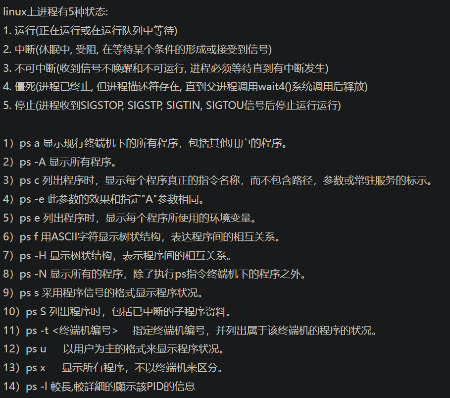

查看当前所有进程：

```sh
ps -A
```

查看某进程（与grep联合查找）：

```sh
# 名称
ps -ef | grep java
# PID
ps -aux | grep PID

# -e和-A的意思是一样的，即显示有关其他用户进程的信息，包括那些没有控制终端的进程。
# -f显示用户id，进程id，父进程id，最近CPU使用情况，进程开始时间等等。
```

查看进程运行状态、查看内存使用情况：

```sh
top
```

#### [Q：杀死一个进程？]

kill命令

- 杀死父进程并不会同时杀死子进程：每个进程都有一个父进程。可以使用pstree或ps来观察：

  ```
  # 启动两个虚拟进程
  $ sleep 100 &
  $ sleep 101 &
  
  $ pstree -p
  init(1)-+
          |-bash(29051)-+-pstree(29251)
                        |-sleep(28919)
                        `-sleep(28964)
  
  $ ps j -A
   PPID   PID  PGID   SID TTY      TPGID STAT   UID   TIME COMMAND
      0     1     1     1 ?           -1 Ss       0   0:03 /sbin/init
  29051  1470  1470 29051 pts/2     2386 SN    1000   0:00 sleep 100
  29051  1538  1538 29051 pts/2     2386 SN    1000   0:00 sleep 101
  29051  2386  2386 29051 pts/2     2386 R+    1000   0:00 ps j -A
      1 29051 29051 29051 pts/2     2386 Ss    1000   0:00 -bash
  
  ```

  调用ps命令可以显示PID（进程ID）和PPID（父进程ID）
  
  杀死父进程后，子进程将会成为孤儿进程，而init进程将重新成为它的父进程
  
- 杀死进程组或会话中的所有进程

  ```sh
  $ kill -SIGTERM -- -19701
  ```

  这里用一个负数-19701向进程组发送信号。如果传递的是一个正数，这个数将被视为进程ID用于终止进程。如果传递的是一个负数，它被视为 PGID，用于终止整个进程组。负数来自系统调用的直接定义。

  杀死会话中的所有进程与之完全不同。即使是具有会话ID的系统，例如Linux，也没有提供系统调用来终止会话中的所有进程。需要遍历 /proc 输出的进程树，收集所有的SID，然后一一终止进程。

  Pgrep 实现了遍历、收集并通过会话 ID 杀死进程的算法。可以使用以下命令：

  ```sh
  pkill -s <SID>
  ```

kill的原理

- kill命令会向操作系统内核发送一个信号（多是终止信号）和目标进程的PID，然后系统内核会根据收到的信号类型，对指定进程进行相应的操作。kill命令的基本格式：

  ```sh
  kill [信号] PID
  ```

- kill命令是按照PID来确定进程的，kill命令只能识别PID，而不能识别进程名

- kill命令只是“发送”一个信号，因此，只有当信号被程序成功“捕获”，系统才会执行kill命令指定的操作；反之，如果信号被“封锁”或者“忽略”，则kill命令将失效

#### [Q：通过端口号查看进程，通过进程查看端口]

```sh
# 通过端口查看进程
netstat -nap | grep 端口号

# 通过进程名查看其占用端口
# 1.先pid查看其占用端口
ps -ef | grep 进程名 
# 2.通过pid查看占用端口
netstat -nap | grep 进程pid 
```

#### [Q：查找CPU利用率最高的线程？]

top命令

1. 找出cpu消耗最高的进程pid

   执行top命令，按下shift+p查找cpu利用率最高的pid

2. 根据pid，执行：

   ```sh
   top -H -p pid
   ```

   然后按下shitf+p，查找出cpu利用率最高的线程号；

3. 线程号转换成16进制

4. 使用 jstack 工具打印进程信息：

   ```sh
   jstack pid号 >/tmp/t.dat
   ```

5. 编辑/tmp/t.dat，查找线程号对应的信息。

扩展：window查看？任务管理器

### 内存

#### [Q：查看内存]

free命令

```sh
# 查看内存使用情况：
free -m

#查看进程运行状态、内存使用情况：
top
```

- free

  ree命令用于**显示内存状态**。

  free指令会显示内存的使用情况，**包括实体内存，虚拟的交换文件内存，共享内存区段，以及系统核心使用的缓冲区等。**

  参数如下：

  ```sh
  -b 以Byte为单位显示内存使用情况。 
  -k 以KB为单位显示内存使用情况。 
  -m 以MB为单位显示内存使用情况。 
  -h 以合适的单位显示内存使用情况，最大为三位数，自动计算对应的单位值。单位有：
  		B = bytes         K = kilos         M = megas         G = gigas         T = teras 
  -o 不显示缓冲区调节列。 
  -s<间隔秒数> 持续观察内存使用状况。 
  -t 显示内存总和列。 
  -V 显示版本信息。
  ```

  实例：显示内存使用情况

  ```sh
  # free //显示内存使用信息
  total used free shared buffers cached
  Mem: 254772 184568 70204 0 5692 89892
  -/+ buffers/cache: 88984 165788
  Swap: 524280 65116 459164
  ```

- top

  **显示当前系统正在执行的进程的相关信息，包括进程 ID、内存占用率、CPU 占用率等**

  参数：

  ```sh
  -d 指定每两次屏幕信息刷新之间的时间间隔。当然用户可以使用s交互命令来改变之。 
  -p 通过指定监控进程ID来仅仅监控某个进程的状态。 
  -q 该选项将使top没有任何延迟的进行刷新。如果调用程序有超级用户权限，那么top将以尽可能高的优先级运行。 
  -S 指定累计模式 
  -s 使top命令在安全模式中运行。这将去除交互命令所带来的潜在危险。 
  -i 使top不显示任何闲置或者僵死进程。 
  -c 显示整个命令行而不只是显示命令名 
  ```

  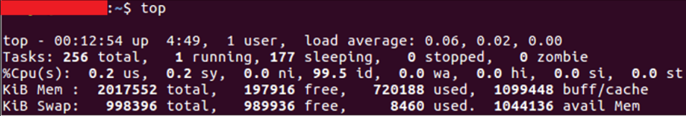

  **前五行是当前系统情况整体的统计信息区。**

  1. 第一行，任务队列信息，同 uptime 命令的执行结果，具体参数说明情况如下：

     00:12:54 — 当前系统时间

     up ？days, 4:49 — 系统已经运行了？天4小时49分钟（在这期间系统没有重启过）

     21users — 当前有1个用户登录系统

     load average: 0.06, 0.02, 0.00 — load average后面的三个数分别是1分钟、5分钟、15分钟的负载情况。load average数据是每隔5秒钟检查一次活跃的进程数，然后按特定算法计算出的数值。如果这个数除以逻辑CPU的数量，结果高于5的时候就表明系统在超负荷运转了。

  2. 第二行，Tasks — 任务（进程），具体信息说明如下：

     系统现在共有256个进程，其中处于运行中的有1个，177个在休眠（sleep），stoped状态的有0个，zombie状态（僵尸）的有0个。

  3. 第三行，cpu状态信息，具体属性说明如下：

     0.2%us — 用户空间占用CPU的百分比。

     0.2% sy — 内核空间占用CPU的百分比。

     0.0% ni — 改变过优先级的进程占用CPU的百分比

     99.5% id — 空闲CPU百分比

     0.0% wa — IO等待占用CPU的百分比

     0.0% hi — 硬中断（Hardware IRQ）占用CPU的百分比

     0.0% si — 软中断（Software Interrupts）占用CPU的百分比

  4. 第四行，内存状态，具体信息如下：

     2017552 total — 物理内存总量

     720188 used — 使用中的内存总量

     197916 free — 空闲内存总量

     1099448 cached — 缓存的总量

  5. 第五行，swap交换分区信息，具体信息说明如下：

     998396 total — 交换区总量

     989936 free — 空闲交换区总量

     8460 used — 使用的交换区总量

     1044136 cached — 缓冲的交换区总量

### 网络

#### [Q：查询连接数]

netstat命令：

```sh
//示例
查看Web服务器（Nginx Apache）的并发请求数及其TCP连接状态：
netstat -n | awk '/^tcp/ {++S[$NF]} END {for(a in S) print a, S[a]}'

解释:
返回结果示例： 
LAST_ACK 5   (正在等待处理的请求数) 
SYN_RECV 30 
ESTABLISHED 1597 (正常数据传输状态) 
FIN_WAIT1 51 
FIN_WAIT2 504 
TIME_WAIT 1057 (处理完毕，等待超时结束的请求数) 
 
状态：描述 
CLOSED：无连接是活动的或正在进行 
LISTEN：服务器在等待进入呼叫 
SYN_RECV：一个连接请求已经到达，等待确认 
SYN_SENT：应用已经开始，打开一个连接 
ESTABLISHED：正常数据传输状态 
FIN_WAIT1：应用说它已经完成 
FIN_WAIT2：另一边已同意释放 
ITMED_WAIT：等待所有分组死掉 
CLOSING：两边同时尝试关闭 
TIME_WAIT：另一边已初始化一个释放 
LAST_ACK：等待所有分组死掉
```

#### [Q：ping]

ping命令用于检测主机。

执行ping指令会使用ICMP传输协议，发出要求回应的信息，若远端主机的网络功能没有问题，就会回应该信息，因而得知该主机运行正常

语法：

```sh
ping [-dfnqrRv][-c<完成次数>][-i<间隔秒数>][-I<网络界面>][-l<前置载入>][-p<范本样式>][-s<数据包大小>][-t<存活数值>][主机名称或IP地址]
```

参数说明：

```sh
-d 使用Socket的SO_DEBUG功能。
-c<完成次数> 设置完成要求回应的次数。
-f 极限检测。
-i<间隔秒数> 指定收发信息的间隔时间。
-I<网络界面> 使用指定的网络接口送出数据包。
-l<前置载入> 设置在送出要求信息之前，先行发出的数据包。
-n 只输出数值。
-p<范本样式> 设置填满数据包的范本样式。
-q 不显示指令执行过程，开头和结尾的相关信息除外。
-r 忽略普通的Routing Table，直接将数据包送到远端主机上。
-R 记录路由过程。
-s<数据包大小> 设置数据包的大小。
-t<存活数值> 设置存活数值TTL的大小。
-v 详细显示指令的执行过程。
```

实例：

```sh
检测是否与主机连通

# ping www.w3cschool.cc //ping主机
PING aries.m.alikunlun.com (114.80.174.110) 56(84) bytes of data.
64 bytes from 114.80.174.110: icmp_seq=1 ttl=64 time=0.025 ms
64 bytes from 114.80.174.110: icmp_seq=2 ttl=64 time=0.036 ms
64 bytes from 114.80.174.110: icmp_seq=3 ttl=64 time=0.034 ms
64 bytes from 114.80.174.110: icmp_seq=4 ttl=64 time=0.034 ms
64 bytes from 114.80.174.110: icmp_seq=5 ttl=64 time=0.028 ms
64 bytes from 114.80.174.110: icmp_seq=6 ttl=64 time=0.028 ms
64 bytes from 114.80.174.110: icmp_seq=7 ttl=64 time=0.034 ms
64 bytes from 114.80.174.110: icmp_seq=8 ttl=64 time=0.034 ms
64 bytes from 114.80.174.110: icmp_seq=9 ttl=64 time=0.036 ms
64 bytes from 114.80.174.110: icmp_seq=10 ttl=64 time=0.041 ms

--- aries.m.alikunlun.com ping statistics ---
10 packets transmitted, 30 received, 0% packet loss, time 29246ms
rtt min/avg/max/mdev = 0.021/0.035/0.078/0.011 ms

//需要手动终止Ctrl+C
指定接收包的次数

# ping -c 2 www.w3cschool.cc
PING aries.m.alikunlun.com (114.80.174.120) 56(84) bytes of data.
64 bytes from 114.80.174.120: icmp_seq=1 ttl=54 time=6.18 ms
64 bytes from 114.80.174.120: icmp_seq=2 ttl=54 time=15.4 ms

--- aries.m.alikunlun.com ping statistics ---
2 packets transmitted, 2 received, 0% packet loss, time 1016ms
rtt min/avg/max/mdev = 6.185/10.824/15.464/4.640 ms

//收到两次包后，自动退出
多参数使用

# ping -i 3 -s 1024 -t 255 g.cn //ping主机
PING g.cn (203.208.37.104) 1024(1052) bytes of data.
1032 bytes from bg-in-f104.1e100.net (203.208.37.104): icmp_seq=0 ttl=243 time=62.5 ms
1032 bytes from bg-in-f104.1e100.net (203.208.37.104): icmp_seq=1 ttl=243 time=63.9 ms
1032 bytes from bg-in-f104.1e100.net (203.208.37.104): icmp_seq=2 ttl=243 time=61.9 ms

--- g.cn ping statistics ---
3 packets transmitted, 3 received, 0% packet loss, time 6001ms
rtt min/avg/max/mdev = 61.959/62.843/63.984/0.894 ms, pipe 2
[root@linux ~]# 

//-i 3 发送周期为 3秒 -s 设置发送包的大小 -t 设置TTL值为 255
```

#### [Q：如何在Linux上配置一个IP地址]

配置Linux系统的IP地址的方法，主要有3种：

- ifconfig

  ifconfig 命令主要是用来查看网卡的配置信息，因为用它来配置网卡的IP地址时，只会临时生效（Linux服务器重启后就会失效）

- setup

  setup 命令是 redhat 系列的linux系统（如CentOS）中专有的命令工具。可以使用 setup 命令，来对网络配置中的IP地址、子网掩码、默认网关、DNS服务器进行设置。而且，setup 网络配置工具设置的IP地址会永久生效。

- 修改网卡的配置文件

  直接修改网卡的配置文件，设置方法有两种：

  - 自动获取动态IP地址
  - 手工配置静态的IP地址

#### [Q：如果给定端口号如何解析出域名]

- 使用 dig 命令

#### [Q：配置静态网络？]

网络配置的配置文件在/etc/sysconfig/network-scripts/下，文件名前缀为ifcfg-后面跟的就是网卡的名称，可以使用ifconfig查看，也可以使用命令： ls /etc/sysconfig/network-scripts/ifcfg-* 列出所有的设备配置文件，

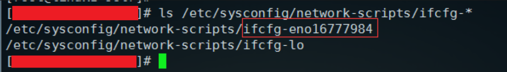

比如这里就是ifcfg-eno16777984这个文件，ifcfg-lo是本地回环地址的配置文件，所有计算机都有，不用动他，

现在使用： vim /etc/sysconfig/network-scripts/ifcfg-eno16777984 打开配置文件进行编辑，默认情况是dhcp动态获取的

这时候如果想修改成静态的，首先把BOOTPROTO="dhcp"改成BOOTPROTO="static"表示静态获取，然后在最后追加比如下面的配置：

```
BROADCAST=192.168.1.255 IPADDR=192.168.1.33 NETMASK=255.255.255.0 GATEWAY=192.168.1.1
```

BROADCAST设置的是局域网广播地址，IPADDR就是静态IP，NETMASK是子网掩码，GATEWAY就是网关或者路由地址；需要说明，原来还有个NETWORK配置的是局域网网络号，这个是ifcalc自动计算的，所以这里配置这些就足够了，最终配置如下图：

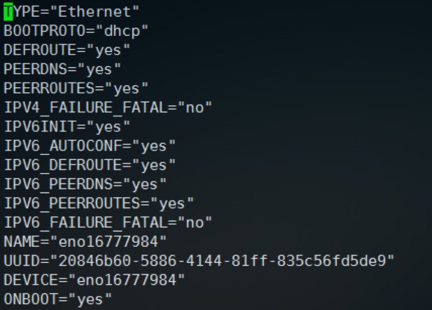

配置完成之后保存退出，

设置完毕，然后使用命令： /etc/init.d/network restart 或者 service network restart 重启网络服务，重启后如果路由配置了支持静态IP，那么linux就能获取到刚才配置的IP地址，这样静态IP就配置成功了

### 配置

#### [Q：修改主机名]

```sh
# 临时修改，hostname
sudo hostname <new-hostname>  # 例如： sudo hostname myDebian #myDebian为修改名

# 永久修改，hostnamectl
sudo hostnamectl set-hostname myDebian #myDebian为修改名
```

#### [Q：开机自动执行]

- 使用cron任务：

  除了常用格式（分 / 时 / 日 / 月 / 周）外，cron 调度器还支持 @reboot 指令。这个指令后面的参数是脚本（启动时要执行的那个脚本）的绝对路径。

  然而，这种方法需要注意两点：

  a) cron 守护进程必须处于运行状态（通常情况下都会运行），同时

  b) 脚本或 crontab 文件必须包含需要的环境变量。

- 使用 /etc/rc.d/rc/local

  这个方法对于 systemd-based 发行版 Linux 同样有效。不过，使用这个方法，需要授予 /etc/rc.d/rc.local 文件执行权限：

  ```sh
  chmod +x /etc/rc.d/rc.local
  ```

  然后在这个文件底部添加脚本。

### [Q：设置开机启动？]

1. 编辑 rc.local 脚本

   linux开机之后会执行/etc/rc.local文件中的脚本。

   所以可以直接在/etc/rc.local中添加启动脚本。

   ```sh
   $ vim /etc/rc.local
   ```

2. 添加一个开机启动服务

   将启动脚本复制到 /etc/init.d目录下，并设置脚本权限, 假设脚本为test

   ```sh
    $ mv test /etc/init.d/test  
    $ sudo chmod 755 /etc/init.d/test
   ```

   将该脚本放倒启动列表中去

   ```sh
    $ cd .etc/init.d
    $ sudo update-rc.d test defaults 95
   ```

   注：其中数字95是脚本启动的顺序号，按照自己的需要相应修改即可。在有多个启动脚本，而它们之间又有先后启动的依赖关系时就知道这个数字的具体作用了。

   将该脚本从启动列表中剔除

   ```sh
    $ cd /etc/init.d
    $ sudo update-rc.d -f test remove
   ```

## Linux OS

### [Q：什么是协程]

协程是微线程，在子程序内部执行，可在子程序内部中断，转而执行别的子程序，在适当的时候再返回来接着执行。

协程与线程的区别：

- 一个线程可以有多个协程

- 协程执行效率极高。协程直接操作栈基本没有内核切换的开销，所以上下文的切换非常快，切换开销小
- 协程不需要多线程的锁机制，因为多个协程从属于一个线程，不存在同时写变量冲突，效率比线程高

协程优势：

- 协程调用和切换比线程效率高：协程执行效率极高。协程不需要多线程的锁机制，可以不加锁的访问全局变量，所以上下文的切换非常快。
- 协程占用内存少：执行协程只需要极少的栈内存（大概是4～5KB），而默认情况下，线程栈的大小为1MB。
- 切换开销小：协程直接操作栈基本没有内核切换的开销，所以切换开销比线程少。

### [Q：为什么协程比线程切换开销小]

- 协程执行效率极高。**协程直接操作栈基本没有内核切换的开销**，所以上下文的**切换非常快**，切换开销比线程更小。
- 协程不需要多线程的锁机制，因为多个协程从属于一个线程，不存在同时写变量冲突，效率比线程高。**避免了加锁解锁的开销。**

### [Q：对Linux内核的理解]

内核是操作系统的核心，具有很多最基本功能，它负责管理系统的进程、内存、设备驱动程序、文件和网络系统，决定着系统的性能和稳定性。

Linux 内核的 4 项工作：

- **内存管理：** 追踪记录有多少内存存储了什么以及存储在哪里
- **进程管理：** 确定哪些进程可以使用中央处理器（CPU）、何时使用以及持续多长时间
- **设备驱动程序：** 充当硬件与进程之间的调解程序/解释程序
- **系统调用和安全防护：** 从流程接受服务请求

讲讲内核态和用户态：

在正确实施的情况下，内核对于用户是不可见的，它在自己的小世界（称为内核空间）中工作，并从中分配内存和跟踪所有内容的存储位置。用户所看到的内容（例如 Web 浏览器和文件则被称为用户空间。这些应用通过系统调用接口（SCI）与内核进行交互。

*举例来说，* 内核就像是一个为高管（硬件）服务的忙碌的个人助理。助理的工作就是将员工和公众（用户）的消息和请求（进程）转交给高管，记住存放的内容和位置（内存），并确定在任何特定的时间谁可以拜访高管、会面时间有多长。

为了更具象地理解内核，不妨将 Linux 计算机想象成有三层结构：

硬件：物理机（这是系统的底层结构或基础）是由内存（RAM）、处理器（或 CPU）以及输入/输出（I/O）设备（例如存储、网络和图形）组成的。其中，CPU 负责执行计算和内存的读写操作。

Linux 内核：操作系统的核心。它是驻留在内存中的软件，用于告诉 CPU 要执行哪些操作。

用户进程：这些是内核所管理的运行程序。用户进程共同构成了用户空间。用户进程有时也简称为进程。内核还允许这些进程和服务器彼此进行通信（称为进程间通信或 IPC）。

系统执行的代码通过以下两种模式之一在 CPU 上运行：内核模式或用户模式。在内核模式下运行的代码可以不受限制地访问硬件，而用户模式则会限制 SCI 对 CPU 和内存的访问。内存也存在类似的分隔情况（内核空间和用户空间）。这两个小细节构成了一些复杂操作的基础，例如安全防护、构建容器和虚拟机的权限分隔。

这也意味着：如果进程在用户模式下失败，则损失有限，无伤大雅，可以由内核进行修复。另一方面，由于内核进程要访问内存和处理器，因此内核进程的崩溃可能会引起整个系统的崩溃。由于用户进程之间会有适当的保护措施和权限要求，因此一个进程的崩溃通常不会引起太多问题。

### [Q：对Linux内核态与用户态的了解]

内核态其实从本质上说就是内核，它是一种**特殊的软件程序，控制计算机的硬件资源，例如协调CPU资源，分配内存资源，并且提供稳定的环境供应用程序运行**。

用户态就是提供应用程序运行的空间，为了使应用程序访问到内核管理的资源例如CPU，内存，I/O。内核必须提供一组通用的访问接口，这些接口就叫**系统调用。**

- **系统调用**是操作系统的最小功能单位。根据不同的应用场景，不同的Linux发行版本提供的系统调用数量也不尽相同，大致在240-350之间。这些系统调用组成了用户态跟内核态交互的基本接口。
- 从用户态到内核态切换可以通过三种方式：
  - 系统调用：系统调用本身就是中断，但是是软件中断，跟硬中断不同。
  - 异常：如果当前进程运行在用户态，如果这个时候发生了异常事件，就会触发切换。例如：缺页异常。
  - 外设中断：当外设完成用户的请求时，会向CPU发送中断信号。

### [Q：Linux负载是什么？]

负载(load)是linux机器的一个重要指标，直观了反应了机器当前的状态。

在UNIX系统中，系统负载是对当前CPU工作量的度量，被定义为特定时间间隔内运行队列中的平均线程数。load average 表示机器一段时间内的平均load。这个值越低越好。负载过高会导致机器无法处理其他请求及操作，甚至导致死机。

top 或 uptime 等命令会输出系统的平均负载 (Load Average)，一般会有三个值，分别代表 1 分钟，5 分钟和 15 分钟的平均负载。

负载记录的是 CPU 的负荷，能对 CPU 造成负荷的是进程（包括线程）的执行。负载的数值代表的是 CPU 还没处理完的进程的数目。

系统的负载采用的是指数移动平均，计算方法如下：

```
S(0) = 0 S(t) = a * X(t) + (1-a)*S(t-1)
```

其中，X(t) 为最近一次采样的值，a 为最近采样值占的比重，S(t) 则是系统最近一次采样的负载。

指数移动平均的计算方式会累计历史所有的采样值，但离现在越久，占的比重越小。更具体的，Linux 系统上对 1 分钟的平均负载取 a 的取值2为 1 - e^(-5/60)，5 分钟为 1 - e^(-5s/5min)，以此类推。

以一分钟为例，上面的取值能达到的效果是，最近一分钟的采样占所有历史值的比重约为 63%（准确值为 1 - 1/e），5 分钟和 15 分钟也一样。

单核满载是 1，有 n 核满载是 n。一般说线上运行的系统大于 0.7 的时候就要注意了。


## 其他

### [Q：utf-8 编码中中文占几个字节？int型占几个字节？]

utf-8是一种变长编码技术，utf-8编码中中文占用字节数不确定，可能是2、3、4个。int型占4个字节

### [Q：常见编码形式？]

编码意义：计算机中存储的最小单位是一个字节：8bit，所能表示的字符范围是255个（2^8=256即0~255），而人类要表达的符号太多，无法用一个字节来完全表示，需将符号编码，将各种语言翻译成计算机能懂的语言。

- ASCII码：共128个，用一个字节的低7位表示，0~31控制字符如果回车删除等；32~126是打印字符，可以通过键盘输入并显示出来。
- ISO-8859-1：扩展ASCII编码，256个字符，涵盖了大多数西欧语言字符
- GB2312：双字节编码，编码范围是A1-A7，A1-A9是符号区，包含682个字符，B0-B7是汉字区，包含6763个汉字
- GBK：扩展GB2312，加入更多的汉字，编码范围8140~FEFE，有23940个码位，能表示21003个汉字
- UTF-16：ISO试图创建一个全新的超语言字典，世界上所有语言都可以通过这本字典Unicode来互相翻译。UTF-16定义了Unicode字符在计算机中存取方法，用两个字节来表示Unicode转化格式，无论什么字符都可用两字节表示，即16bit，故叫UTF-16
- UTF-8：UTF-16同一采用两个字节表示一个字符，但是有些字符只用一个字节就可以表示，浪费了存储空间，UTF-8采用变长技术，每个编码区域有不同的字码长度。不同类型的字符可以由1~16字节组成。

# 基础部分

## 1.CPU内存模型


CPU内存模型：每个CPU都有自己的高速缓冲寄存器，当CPU要获取数据时，首先从高速缓冲寄存器中获取，如果获取不到就从CPU共享缓存中获取，如果还是获取不到就从主内存中获取，如果还是获取不到就从磁盘中获取。

## 2. 进程和线程

从操作系统的角度来看，进程是系统进行资源分配和调度的一个独立单位，而线程是进程的一个实体，是CPU调度的基本单位；一个程序至少拥有一个进程，一个进程可以拥有多个线程，同一个进程中的所有线程共享进程所拥有的所有资源。同一个进程中的多个线程之间可以并发执行。

进程的地址空间包括内核空间和用户空间，用户空间包含程序运行的所有内存状态：

1. 程序的代码
2. 栈：保存当前的函数调用信息，分配空间给局部变量，传递参数和函数返回值
3. 堆：管理动态分配、用户管理的内存

通过CPU中的一对寄存器（**基址寄存器和界限寄存器**）来确定当前进程空间对应的物理内存的地址空间。

#### 进程状态

进程有以下三种状态：

* 就绪（Ready）：进程已做好运行的准备，但是由于某种原因，操作系统选择不在此时运行。
* 运行（Running）：进程正在CPU上运行，意味着该进程正在执行指令。
* 阻塞（Blocked）：一个进程执行了某种操作，直到发生其他事件时才会准备运行。（如某个进行向磁盘发起I/O请求，它会被阻塞，CPU可以运行其他进程，直到I/O操作完成，进程才会从阻塞状态恢复到就绪/运行状态。）
* 挂起：机器的资源是有限的，在资源不足的情况下，进程被暂时调离出内存，此时进程就处于挂起状态，当进程被操作系统再次调回内存，就会进入就绪状态等待执行。

创建进程的过程如下：

1. 为新进程分配一个唯一的进程标识号，并申请一个空白的PCB，PCB是有限的，若申请失败则创建失败。
2. 为进程分配资源，此处如果资源不足，进程就会进入等待状态，以等待资源。
3. 初始化PCB。
4. 如果进程的调度队列能够接纳新进程，那就将进程插入到就绪队列，等待被调度运行。

#### 进程控制块

进程控制块PCB包括：

1. 进程描述信息：
   * 进程标识符
   * 用户标识符
2. 进程状态信息：
   * 进程当前状态
   * 进程优先级
3. 资源分配清单：有关内存地址空间或虚拟地址空间的信息
4. CPU相关信息：CPU中各个寄存器的值


#### 进程切换

进程切换需要进行上下文切换。**上下文一般指的是CPU的寄存器和程序计数器**。CPU寄存器是一个高速缓冲，而程序计数器存储CPU正在执行的指令位置或者即将执行的下一条指令位置。

CPU上下文切换就是先把前一个任务的CPU寄存器和程序计数器的值保存起来，然后加载新任务的上下文到这些寄存器和程序计数器中，然后再跳转到程序计数器所指的新位置。

进程的切换是由内核管理和调度的，所以进程的切换只能发生在内核态。

进程的上下文切换不仅包含了虚拟内存、栈、全局变量等用户空间的资源，还包括了内核堆栈、寄存器等内核空间的资源。通常辉把交换的信息保存在进程的PCB中。


#### 进程调度

进程调度算法：

* **FCFS**：先来先服务，导致某些耗时比较少的任务排在耗时比较多的任务后面，等待时间太长
* **SJF**：最短任务优先，任务时间短的优先执行，但是是非抢占式的，也就是说当一个长任务比短任务快一点点到达时，也是先执行长任务。
* **STCF**：最短完成时间优先，最短任务优先的优化版本，抢占式的，根据任务剩余时间来决定执行顺序。
* **HRN**：高响应比优先，响应比 = (等待时间 + 要求服务时间) / 要求服务时间  
* **RR**：时间片轮转，每个进程轮流占用CPU的一小段时间，可以提高任务的响应速度，但是由于轮转需要频繁的进行上下文切换，因此也会带来一定的性能开销。
* **MLFQ**：多级反馈队列，维护多个优先级不同的队列，**MLFQ总是优先执行较高优先级的工作，在相同优先级队列中工作采用轮转调度算法进行**。

#### 进程同步、互斥

**进程同步**指的是进程之间的制约关系，为了完成某个任务可能创建了多个进程，因为任务的需求需要协调他们的执行顺序。

如进程间同步中的管道通信，读操作和写操作在两个进程上执行，当读操作进程发现管道上没有数据可读时，会进入阻塞状态，等待写操作进程向管道中写入数据，然后读操作进程才会被唤醒继续执行。

**进程互斥**指的是当一个进程访问某临界资源时，另一个进程想要访问该临界资源的进程必须等待，当前访问临界资源的进程访问结束，释放该资源后，另一个进程才能访问该临界资源。


#### 进程通信

扯扯Linux进程通信：管道、消息队列、共享内存、信号量、信号、Socket等


### 2.2 线程

#### 线程状态

Java 中的线程共有五个阶段：新建、就绪、运行、阻塞、销毁

- 新建 New：刚刚使用 new 创建的线程处于新建阶段

- 就绪 Runnable：调用 start 方法后，线程处于等待获取 CPU 资源的阶段，等待执行

- 运行 Running：就绪的线程获取 CPU 资源后，就进入了运行阶段，线程执行的逻辑由 run 方法决定

- 阻塞 Blocked：在运行阶段，线程可能由于一些原因进入阻塞阶段，例如 sleep、wait 等，需要通过 notify、notifyAll 进行唤醒，它会回到就绪状态

- 销毁 Terminated：线程正常执行完毕或被强制性终止后，就需要被销毁。

#### 线程同步

线程同步是两个或多个共享关键资源的线程的并发执行，应该同步线程以避免关键的资源使用冲突。操作系统一般有下面三个线程同步的方式：

1. **互斥量（Mutex）**：采用互斥对象机制，只有拥有互斥对象的线程才有访问公共资源的权限。因为互斥对象只有一个，所以可以保证公共资源不会被多个线程同时访问。**Java中的synchronized关键之和Lock都是这种机制**。
2. **信号量（Semaphore）**：它运行同一时刻多个线程访问同一资源，但是需要控制同一时刻访问资源的最大线程数量。
3. **事件（Event）**：wait/notify，通过通知操作的方式来保持多线程同步，还可以方便的实现多线程优先级的比较。


#### 线程切换

线程上下文切换需要看线程是不是属于同一个进程：

* 当两个线程不是属于同一个进程，则切换的过程就跟进程上下文切换一样；
* 当两个线程是属于同一个进程，因为虚拟内存是共享的，所以在切换时，虚拟内存这些资源就保持不动，只需要切换线程的私有数据、寄存器等不共享的数据。


### 进程、线程对比

1. 线程的创建时间比进程快，因为进程在创建的过程中，还需要资源管理信息，比如内存管理信息、文件管理信息，而线程在创建的过程中，不会涉及这些资源管理信息，而是共享它们。
2. 线程的终止时间比进程快，因为线程释放的资源相比进程少很多；
3. 同一个进程内的线程切换比进程切换快，因为线程具有相同的地址空间（虚拟地址共享），**这意味着同一个进程的线程都具有同一个页表，那么在切换的时候不需要切换页表。而对于进程之间的切换，切换的时候要把页表给切换掉，而页表的切换过程开销是比较大的；**
4. 由于同一进程的各线程间共享内存和文件资源，那么在线程之间数据传递的时候，就不需要经过内核了，这就使得线程之间的数据交互效率高了。


## 3. 死锁

产生死锁的原因：

1. 系统资源不足
2. 进程推进顺序不合适

死锁的四个必要条件：

1. 互斥：资源一次只能给一个进程使用
2. 不可剥夺：不能够抢占其他进程已有资源
3. 占有且等待：如果一个进程尝试获取一个资源没有成功，那么会进入等待状态，并且这个进程持有的资源不会被释放
4. 循环等待：存在一个闭合的进程链，每个进程至少占有此链下一个进程所需的资源

解决死锁的方式：

1. 预防死锁
2. 避免死锁
3. 检测死锁并从中恢复

### 预防死锁

预防策略分为两类：

1. 间接死锁预防方法：防止前三个必要条件中的任何一个条件发生
2. 直接死锁预防方法：防止循环等待条件发生

互斥条件：一般不可能禁止。

占有且等待：为了预防占有且等待条件，可以要求进程一次性请求所有资源，如果无法一次性请求那么就进入等待状态，这样做会存在以下问题：

* 一个进程可能被阻塞很长时间才能一次性获取到所有资源
* 进程可能无法预知它将来需要的资源

不可抢占：预防不可抢占的策略有以下几种：

* 当占有某个资源的进程在进一步尝试获取其他资源时被拒绝，那么该进程必须释放自己占有的资源，在必要时可以尝试重新获取这个被释放的资源
* 当一个进程请求的资源被其他进程占有时，操作系统可以抢占这个持有资源的进程，要求它释放资源。

循环等待：循环等待的预防可以通过定义资源获取的访问顺序。


### 避免死锁

死锁避免的方法：

1. 若一个进程的请求会导致死锁，那么不启动该进程
2. 若一个进程增加的资源请求会导致死锁，则不允许这个资源的分配
3. 银行家算法

### 死锁检测

死锁检测不会限制资源访问或者约束进程的行为，当发生死锁时，通过死锁的检测来解除死锁状态。


## 4. 银行家算法

银行家算法是一个避免死锁的算法，在分配资源的时候可以确定一个资源分派的安全序列，根据这个安全序列来分配资源不会造成死锁。

举个例子：

假设现在系统中一共有四个进程在运行，每个进程都有它需要的资源总数，现在系统已经给每个进程分配了部分资源，系统会根据系统剩余资源来确定一个资源分配顺序，判断剩余资源满足哪个进程的剩余所需资源，就把资源分配给它，等这个进程执行完毕释放它的所有资源，然后继续分配给其他进程。


## 5. 虚拟内存

虚拟内存是操作系统内存管理的一种技术，每个进程启动时，操作系统会为这个进程提供一个独立的连续的虚拟地址空间，虚拟地址空间被分为很多页，使用到的页被映射到物理内存中。程序需要访问内存中的数据时，通过MMU将虚拟地址转换为物理地址，然后从内存中获取数据。

虚拟内存实际上可以比物理内存大，当访问虚拟内存时，会访问MMU去匹配对应的物理地址，如果虚拟内存的页并不存在于物理内存中，会产生**缺页中断**，从磁盘中取得缺的页放入内存，如果内存已满，还会根据**内存替换策略**将磁盘中的页换入内存。


虚拟内存的**目的**：

1. 方便进程进行内存的访问，同时还可以将进程隔离，不同进程的虚拟地址空间映射到不同的物理内存上。
2. 可以使有限的物理内存运行一个比它大很多的程序。


虚拟内存系统的目标：

1. **透明**：操作系统实现虚拟内存的方式，运行的程序看不见。
2. **效率**：操作系统追求虚拟化尽可能保证时间上和空间上的高效率。
3. **保护**：操作系统应确保进程受到保护，不会受其他进程影响，操作系统本身也不会受进程影响。**进程不能访问它的地址空间之外的任何内容。**


## 6. 内存管理

### 页式存储管理

虚拟地址包括：页号（一级页号+二级页号）+ 页内偏移（12位），所以页大小为4KB

页式存储管理将进程的地址空间分割成**固定大小的页**，相应的也会把物理内存空间分成与页面大小一样的物理块，通过**页表**将进程虚拟空间映射到对应的物理内存空间。

优点：

1. 提高内存利用率
2. 空闲空间管理的简单性，每个页的大小固定，易于管理

缺点：

1. 页表需要占用额外的内存空间
2. 由于页的大小是固定的，因此会产生页面的内存碎片
3. 页表发生缺页中断和选择淘汰页面时都要求有相应的硬件支持，增加了机器成本和系统开销

#### 快表

由于页表是保存在内存中的，因此在页式存储管理下，每次访问内存中的数据都需要访问两次内存。为了提高虚拟地址到物理地址的转换，引入了一个高速缓冲存储器——**快表**来提高内存访问速度。


#### 二级页表

由于虚拟内存通常比较大，要实现整个地址空间的映射，需要非常大的页表。通过引入**多级页表**解决页表占用内存很大空间的问题，一级页表保存在内存中，通过一级页表可以找到二级页表，只需要把使用到的二级页表放在内存中，其余的放在磁盘中。通过时间换空间来解决内存空间问题。


### 段式存储管理

虚拟地址包括：段号+段内偏移量

段式存储管理将进程逻辑空间分为三个长度不一样的段（代码、栈、堆），通过段表映射到对应的物理内存空间，**段表上记录段号、基址以及段的长度**。

优点：

1. 提高内存利用率

缺点：

1. 管理内存的空闲空间，由于每个段的大小不同，物理内存中可能会产生许多内存碎片。

有两种方法可以解决外部碎片问题：

1. 紧凑物理内存：先终止运行的进程，然后将内存中的数据复制到连续的内存区域中，但是这样会导致成本很高，因为拷贝段是内存密集型的，一般会占用大量的处理器时间。
2. 利用空闲列表管理算法：试图保留大的内存块用于分配。

### 页式、段式存储管理共同点和区别

共同点：

1. 分页机制和分段机制都是为了提高内存利用率
2. 页和段在物理内存中都是离散存储的，但是页和段中的内存是连续的。

区别：

1. 页的大小是固定的，由操作系统决定；而段的大小不固定，取决于我们当前运行的程序。
2. 分页仅仅是为了满足操作系统内存管理的需求，而段是逻辑信息的单位，在程序中可以体现为代码段，数据段，能够更好满足用户的需求。


### 段页式存储管理

段页式存储先将逻辑空间按段式存储管理分成若干段，再把段内空间按页式存储管理分成若干页。

段页式地址变换中要得到数据须经过三次内存访问：

1. 第一次访问段表，得到页表起始地址
2. 第二次访问页表，得到物理地址
3. 第三次通过物理地址获取内存上的对应数据

### 页面置换算法

* 最优替换策略：替换内存中最远将来才会被访问到的页，这个策略不切实际，因为我们无法预知未来哪个页会被访问。
* FIFO：将进入物理内存的页放入一个队列中，当发生替换时，将对尾的页从内存中踢出。
* 随机：在物理内存满的时候随机选择一个页进行替换，具有类似FIFO的属性。
* LRU：替换最不经常使用的页
* Clock置换算法


## 7. 磁盘调度算法

* FCFS：先来先服务
* SSTF：最短寻道时间优先，基于优先级的调度算法，可能导致饥饿现象。
* SCAN：电梯算法，磁头自里向外访问，然后再自外向里访问


## 8. 逻辑地址、物理地址、虚拟地址

逻辑地址是由程序产生的与段相关的偏移地址部分。通过数据段基址和逻辑地址就可以得到数据在内存中的位置。

物理地址是内存中的实际地址。

虚拟地址并不真实存在于计算机中，每个进程都分配有自己的虚拟空间，进程只能访问自己被分配使用的空间。

**[Q：虚拟地址有什么用？]**

1. 方便进程访问内存，同时还可以将进程隔离，不同进程的虚拟地址空间映射到不同的物理内存上。
2. 可以使有限的物理内存运行一个比它大很多的程序。


## 9. 系统中断

中断：CPU对系统发生的某个事件做出的一种反应，CPU暂停正在执行的程序，保留现场后从用户态切换到内核态，执行相应的处理程序，处理完该事件后再返回断点继续执行被"打断"的程序。

中断的分类：

1. CPU外部引起的，称为**中断**：如I/O中断、时钟中断、控制台中断
2. CPU内部事件或程序中的事件引起的，称为**异常**：CPU本身故障、程序故障
3. 由于在程序中使用了请求系统服务的系统调用而引发的过程，称为**陷入**：陷入是主动的，前面两种是被动的。


## 其他问题

**[Q：数据怎么从内存读到CPU？]**

CPU在访问内存的时候通过MMU把虚拟地址转换为物理地址（MMU通过页表在页表里查出这个虚拟地址对应的物理地址），然后通过地址总线把数据所在的物理地址发送到内存，然后通过数据总线就能把对应的数据送往CPU。

**[Q：进程的地址空间？]**

进程的地址空间可以分为内核空间和用户空间。进程的用户空间存放的是用户程序的代码和数据，内核空间存放的是内核代码和数据。内核空间是所有进程共享的，而用户空间是进程私有的。

**[Q：为什么需要区分内核空间与用户空间？]**

因为在CPU指令中，有一些危险指令，可能会导致系统崩溃，为了保证系统安全，只有当进程运行在内核空间的时候，才能执行这些危险指令，一般情况下，我们的进程都是运行在用户空间的。

本质上是为了提高操作系统的**稳定性**、**安全性**、**可用性**。

**[Q：什么是内核态和用户态？]**

内核态：进程运行在内核空间

用户态：进程运行在用户空间

**[Q：进程如何从用户空间进入内核空间？]**

什么操作在内核空间中完成？像磁盘文件读写、分配回收内存，从网络接口中读写数据等等，都需要在内核空间中完成。读取数据的时候先把数据读取到内核空间中，然后再把数据从内核空间中拷贝到用户空间，并从内核态切换到用户态。

向系统发送一个系统调用指令，让进程从用户态进入到内核态。

# Linux硬核

## Linux简介

### Linux接口

Linux 系统是一种金字塔模型的系统


应用程序发起系统调用把参数放在寄存器中(有时候放在栈中)，并发出 trap 系统陷入指令切换用户态至内核态。因为不能直接在 C 中编写 trap 指令，因此 C 提供了一个库，库中的函数对应着系统调用。有些函数是使用汇编编写的，但是能够从 C 中调用。每个函数首先把参数放在合适的位置然后执行系统调用指令。因此如果你想要执行 read 系统调用的话，C 程序会调用 read 函数库来执行。这里顺便提一下，是由 POSIX 指定的库接口而不是系统调用接口。也就是说，POSIX 会告诉一个标准系统应该提供哪些库过程，它们的参数是什么，它们必须做什么以及它们必须返回什么结果。

除了操作系统和系统调用库外，Linux 操作系统还要提供一些标准程序，比如文本编辑器、编译器、文件操作工具等。直接和用户打交道的是上面这些应用程序。因此我们可以说 Linux 具有三种不同的接口：系统调用接口、库函数接口和应用程序接口

### Linux组成部分

Linux 操作系统可以由下面这几部分构成

- 引导程序(Bootloader)：引导程序是管理计算机启动过程的软件，对于大多数用户而言，只是弹出一个屏幕，但其实内部操作系统做了很多事情
- 内核(Kernel)：内核是操作系统的核心，负责管理 CPU、内存和外围设备等。
- 初始化系统(Init System)：这是一个引导用户空间并负责控制守护程序的子系统。一旦从引导加载程序移交了初始引导，它就是用于管理引导过程的初始化系统。
- 后台进程(Daemon)：后台进程顾名思义就是在后台运行的程序，比如打印、声音、调度等，它们可以在引导过程中启动，也可以在登录桌面后启动
- 图形服务器(Graphical server)：这是在监视器上显示图形的子系统。通常将其称为 X 服务器或 X。
- 桌面环境(Desktop environment)：这是用户与之实际交互的部分，有很多桌面环境可供选择，每个桌面环境都包含内置应用程序，比如文件管理器、Web 浏览器、游戏等
- 应用程序(Applications)：桌面环境不提供完整的应用程序，就像 Windows 和 macOS 一样，Linux 提供了成千上万个可以轻松找到并安装的高质量软件。

### Shell

尽管 Linux 应用程序提供了 GUI ，但是大部分程序员仍偏好于使用命令行(command-line interface)，称为shell。用户通常在 GUI 中启动一个 shell 窗口然后就在 shell 窗口下进行工作


shell 命令行使用速度快、功能更强大、而且易于扩展、并且不会带来`肢体重复性劳损(RSI)`。

下面会介绍一些最简单的 bash shell。当 shell 启动时，它首先进行初始化，在屏幕上输出一个 `提示符(prompt)`，通常是一个百分号或者美元符号，等待用户输入


等用户输入一个命令后，shell 提取其中的第一个词，这里的词指的是被空格或制表符分隔开的一连串字符。假定这个词是将要运行程序的程序名，那么就会搜索这个程序，如果找到了这个程序就会运行它。然后 shell 会将自己挂起直到程序运行完毕，之后再尝试读入下一条指令。shell 也是一个普通的用户程序。它的主要功能就是读取用户的输入和显示计算的输出。shell 命令中可以包含参数，它们作为字符串传递给所调用的程序。比如

```shell
cp src dest
```


会调用 cp 应用程序并包含两个参数 src 和 dest。这个程序会解释第一个参数是一个已经存在的文件名，然后创建一个该文件的副本，名称为 dest。

并不是所有的参数都是文件名，比如下面

```shell
head -20 file
```


第一个参数 -20，会告诉 head 应用程序打印文件的前 20 行，而不是默认的 10 行。控制命令操作或者指定可选值的参数称为标志(flag)，按照惯例标志应该使用 - 来表示。这个符号是必要的，比如

```shell
head 20 file
```


是一个完全合法的命令，它会告诉 head 程序输出文件名为 20 的文件的前 10 行，然后输出文件名为 file 文件的前 10 行。Linux 操作系统可以接受一个或多个参数。

为了更容易的指定多个文件名，shell 支持 魔法字符(magic character)，也被称为通配符(wild cards)。比如，* 可以匹配一个或者多个可能的字符串

```shell
ls *.c
```


告诉 ls 列举出所有文件名以 .c 结束的文件。如果同时存在多个文件，则会在后面进行并列。

另一个通配符是问号，负责匹配任意一个字符。一组在中括号中的字符可以表示其中任意一个，因此

```shell
ls [abc]*
```


会列举出所有以 a、b 或者 c 开头的文件。

shell 应用程序不一定通过终端进行输入和输出。shell 启动时，就会获取 标准输入、标准输出、标准错误文件进行访问的能力。

标准输入是从键盘输入的，标准输出或者标准错误是输出到显示器的。许多 Linux 程序默认是从标准输入进行输入并从标准输出进行输出。比如

```shell
sort	
```


会调用 sort 程序，会从终端读取数据(直到用户输入 ctrl-d 结束)，根据字母顺序进行排序，然后将结果输出到屏幕上。

通常还可以重定向标准输入和标准输出，重定向标准输入使用 < 后面跟文件名。标准输出可以通过一个大于号 > 进行重定向。允许一个命令中重定向标准输入和输出。例如命令

```shell
sort <in >out
```


会使 sort 从文件 in 中得到输入，并把结果输出到 out 文件中。由于标准错误没有重定向，所以错误信息会直接打印到屏幕上。从标准输入读入，对其进行处理并将其写入到标准输出的程序称为 过滤器。

考虑下面由三个分开的命令组成的指令

```shell
sort <in >temp;head -30 <temp;rm temp
```


首先会调用 sort 应用程序，从标准输入 in 中进行读取，并通过标准输出到 temp。当程序运行完毕后，shell 会运行 head ，告诉它打印前 30 行，并在标准输出(默认为终端)上打印。最后，temp 临时文件被删除。轻轻的，你走了，你挥一挥衣袖，不带走一片云彩。

命令行中的第一个程序通常会产生输出，在上面的例子中，产生的输出都被 temp 文件接收。然而，Linux 还提供了一个简单的命令来做这件事，例如下面

```shell
sort <in | head -30
```


上面 | 称为竖线符号，它的意思是从 sort 应用程序产生的排序输出会直接作为输入显示，无需创建、使用和移除临时文件。由管道符号连接的命令集合称为管道(pipeline)。例如如下

```shell
grep cxuan *.t | sort | head -30 | tail -5 >foo
```


对任意以 .t 结尾的文件中包含 cxuan 的行被写到标准输出中，然后进行排序。这些内容中的前 30 行被 head 出来并传给 tail ，它又将最后 5 行传递给 foo。这个例子提供了一个管道将多个命令连接起来。

可以把一系列 shell 命令放在一个文件中，然后将此文件作为输入来运行。shell 会按照顺序对他们进行处理，就像在键盘上键入命令一样。包含 shell 命令的文件被称为 shell 脚本(shell scripts)。

推荐一个 shell 命令的学习网站：https://www.shellscript.sh/

shell 脚本其实也是一段程序，shell 脚本中可以对变量进行赋值，也包含循环控制语句比如 if、for、while 等，shell 的设计目标是让其看起来和 C 相似(There is no doubt that C is father)。由于 shell 也是一个用户程序，所以用户可以选择不同的 shell。

### Linux应用程序

Linux 的命令行也就是 shell，它由大量标准应用程序组成。这些应用程序主要有下面六种：

- 文件和目录操作命令

- 过滤器
- 文本程序
- 系统管理
- 程序开发工具，例如编辑器和编译器
- 其他

除了这些标准应用程序外，还有其他应用程序比如 Web 浏览器、多媒体播放器、图片浏览器、办公软件和游戏程序等。

我们在上面的例子中已经见过了几个 Linux 的应用程序，比如 sort、cp、ls、head，下面我们再来认识一下其他 Linux 的应用程序。

我们先从几个例子开始讲起，比如

```shell
cp a b
```


是将 a 复制一个副本为 b ，而

```shell
mv a b
```


是将 a 移动到 b ，但是删除原文件。

上面这两个命令有一些区别，cp 是将文件进行复制，复制完成后会有两个文件 a 和 b；而 mv 相当于是文件的移动，移动完成后就不再有 a 文件。cat 命令可以把多个文件内容进行连接。使用 rm 可以删除文件；使用 chmod 可以允许所有者改变访问权限；文件目录的的创建和删除可以使用 mkdir 和 rmdir 命令；使用 ls 可以查看目录文件，ls 可以显示很多属性，比如大小、用户、创建日期等；sort 决定文件的显示顺序

Linux 应用程序还包括过滤器：】

- grep 从标准输入或者一个或多个输入文件中提取特定模式的行；
- sort 将输入进行排序并输出到标准输出；head 提取输入的前几行；
- tail 提取输入的后面几行；
- cut 和 paste，允许对文本行的剪切和复制；
- od 将输入转换为 ASCII ；
- tr 实现字符大小写转换；
- pr 为格式化打印输出等。

程序编译工具使用 gcc ；

make 命令用于自动编译，这是一个很强大的命令，它用于维护一个大的程序，往往这类程序的源码由许多文件构成。典型的，有一些是 header files 头文件，源文件通常使用 include 指令包含这些文件，make 的作用就是跟踪哪些文件属于头文件，然后安排自动编译的过程。

下面列出了 POSIX （*可移植操作系统接口*(Portable Operating System Interface of UNIX )）的标准应用程序：


### Linux内核结构

在上面我们看到了 Linux 的整体结构，下面我们从整体的角度来看一下 Linux 的内核结构：


内核直接坐落在硬件上，内核的主要作用就是 I/O 交互、内存管理和控制 CPU 访问。上图中还包括了 中断 和 调度器，中断是与设备交互的主要方式。中断出现时调度器就会发挥作用。这里的低级代码停止正在运行的进程，将其状态保存在内核进程结构中，并启动驱动程序。进程调度也会发生在内核完成一些操作并且启动用户进程的时候。图中的调度器是 dispatcher。

注意这里的调度器是 dispatcher 而不是 scheduler，这两者是有区别的

scheduler 和 dispatcher 都是和进程调度相关的概念，不同的是 scheduler 会从几个进程中随意选取一个进程；而 dispatcher 会给 scheduler 选择的进程分配 CPU。

然后，我们把内核系统分为三部分：

- I/O 部分负责与设备进行交互以及执行网络和存储 I/O 操作的所有内核部分。

  从图中可以看出 I/O 层次的关系，最高层是一个虚拟文件系统，也就是说不管文件是来自内存还是磁盘中，都是经过虚拟文件系统中的。从底层看，所有的驱动都是字符驱动或者块设备驱动。二者的主要区别就是是否允许随机访问。网络驱动设备并不是一种独立的驱动设备，它实际上是一种字符设备，不过网络设备的处理方式和字符设备不同。

  上面的设备驱动程序中，每个设备类型的内核代码都不同。字符设备有两种使用方式，有一键式的比如 vi 或者 emacs ，需要每一个键盘输入。其他的比如 shell ，是需要输入一行按回车键将字符串发送给程序进行编辑。

  网络软件通常是模块化的，由不同的设备和协议来支持。大多数 Linux 系统在内核中包含一个完整的硬件路由器的功能，但是这个不能和外部路由器相比，路由器上面是协议栈，包括 TCP/IP 协议，协议栈上面是 socket 接口，socket 负责与外部进行通信，充当了门的作用。

  磁盘驱动上面是 I/O 调度器，它负责排序和分配磁盘读写操作，以尽可能减少磁头的无用移动。

- I/O 右边的是内存部件，程序被装载进内存，由 CPU 执行，这里会涉及到虚拟内存的部件，页面的换入和换出是如何进行的，坏页面的替换和经常使用的页面会进行缓存。

- 进程模块负责进程的创建和终止、进程的调度、Linux 把进程和线程看作是可运行的实体，并使用统一的调度策略来进行调度。

在内核最顶层的是系统调用接口，所有的系统调用都是经过这里，系统调用会触发一个 trap，将系统从用户态转换为内核态，然后将控制权移交给上面的内核部件。

## 进程与线程

### 基本概念

每个进程都会运行一段独立的程序，并且在初始化的时候拥有一个独立的控制线程。换句话说，每个进程都会有一个自己的程序计数器，这个程序计数器用来记录下一个需要被执行的指令。Linux 允许进程在运行时创建额外的线程。


Linux 是一个多道程序设计系统，因此系统中存在彼此相互独立的进程同时运行。此外，每个用户都会同时有几个活动的进程。因为如果是一个大型系统，可能有数百上千的进程在同时运行。

在某些用户空间中，即使用户退出登录，仍然会有一些后台进程在运行，这些进程被称为 守护进程(daemon)。

Linux 中有一种特殊的守护进程被称为 计划守护进程(Cron daemon) ，计划守护进程可以每分钟醒来一次检查是否有工作要做，做完会继续回到睡眠状态等待下一次唤醒。

Cron 是一个守护程序，可以做任何你想做的事情，比如说你可以定期进行系统维护、定期进行系统备份等。在其他操作系统上也有类似的程序，比如 Mac OS X 上 Cron 守护程序被称为 launchd 的守护进程。在 Windows 上可以被称为 计划任务(Task Scheduler)。

在 Linux 系统中，进程通过非常简单的方式来创建，fork 系统调用会创建一个源进程的拷贝(副本)。调用 fork 函数的进程被称为 父进程(parent process)，使用 fork 函数创建出来的进程被称为 子进程(child process)。父进程和子进程都有自己的内存映像。如果在子进程创建出来后，父进程修改了一些变量等，那么子进程是看不到这些变化的，也就是 fork 后，父进程和子进程相互独立。

虽然父进程和子进程保持相互独立，但是它们却能够共享相同的文件，如果在 fork 之前，父进程已经打开了某个文件，那么 fork 后，父进程和子进程仍然共享这个打开的文件。对共享文件的修改会对父进程和子进程同时可见。

那么该如何区分父进程和子进程呢？子进程只是父进程的拷贝，所以它们几乎所有的情况都一样，包括内存映像、变量、寄存器等。区分的关键在于 fork 函数调用后的返回值，如果 fork 后返回一个非零值，这个非零值即是子进程的 进程标识符(Process Identiier, PID)，而会给子进程返回一个零值，可以用下面代码来进行表示

```c
pid = fork();    // 调用 fork 函数创建进程，返回给父进程的是非零pid，给子进程自身是零值
if(pid < 0){
  error()				 // pid < 0,创建失败
}
else if(pid > 0){
  parent_handle() // 父进程代码
}
else {
  child_handle()  // 子进程代码
}
```


父进程在 fork 后会得到子进程的 PID，这个 PID 即能代表这个子进程的唯一标识符也就是 PID。如果子进程想要知道自己的 PID，可以调用 getpid 方法。当子进程结束运行时，父进程会得到子进程的 PID，因为一个进程会 fork 很多子进程，子进程也会 fork 子进程，所以 PID 是非常重要的。我们把第一次调用 fork 后的进程称为 原始进程，一个原始进程可以生成一颗继承树


### Linux 进程间通信

#### 信号 signal

信号是 UNIX 系统最先开始使用的进程间通信机制，因为 Linux 是继承于 UNIX 的，所以 Linux 也支持信号机制，通过向一个或多个进程发送 异步事件信号 来实现，信号可以从键盘或者访问不存在的位置等地方产生；信号通过 shell 将任务发送给子进程。

你可以在 Linux 系统上输入 kill -l 来列出系统使用的信号，下面是我提供的一些信号


进程可以选择忽略发送过来的信号，但是有两个是不能忽略的：SIGSTOP 和 SIGKILL 信号。SIGSTOP 信号会通知当前正在运行的进程执行关闭操作，SIGKILL 信号会通知当前进程应该被杀死。除此之外，进程可以选择它想要处理的信号，进程也可以选择阻止信号，如果不阻止，可以选择自行处理，也可以选择进行内核处理。如果选择交给内核进行处理，那么就执行默认处理。

操作系统会中断目标程序的进程来向其发送信号、在任何非原子指令中，执行都可以中断，如果进程已经注册了信号处理程序，那么就执行进程，如果没有注册，将采用默认处理的方式。

例如：当进程收到 SIGFPE 浮点异常的信号后，默认操作是对其进行 dump(转储)和退出。信号没有优先级的说法。如果同时为某个进程产生了两个信号，则可以将它们呈现给进程或者以任意的顺序进行处理。

下面我们就来看一下这些信号是干什么用的

- SIGABRT 和 SIGIOT

  SIGABRT 和 SIGIOT 信号发送给进程，告诉其进行终止，这个 信号通常在调用 C 标准库的 abort() 函数时由进程本身启动

- SIGALRM 、 SIGVTALRM、SIGPROF
  当设置的时钟功能超时时会将 SIGALRM 、 SIGVTALRM、SIGPROF 发送给进程。当实际时间或时钟时间超时时，发送 SIGALRM。 当进程使用的 CPU 时间超时时，将发送 SIGVTALRM。 当进程和系统代表进程使用的CPU 时间超时时，将发送 SIGPROF。

- SIGBUS
  SIGBUS 将造成 总线中断 错误时发送给进程

- SIGCHLD
  当子进程终止、被中断或者被中断恢复，将 SIGCHLD 发送给进程。此信号的一种常见用法是指示操作系统在子进程终止后清除其使用的资源。

- SIGCONT
  SIGCONT 信号指示操作系统继续执行先前由 SIGSTOP 或 SIGTSTP 信号暂停的进程。该信号的一个重要用途是在 Unix shell 中的作业控制中。

- SIGFPE
  SIGFPE 信号在执行错误的算术运算（例如除以零）时将被发送到进程。

- SIGUP
  当 SIGUP 信号控制的终端关闭时，会发送给进程。许多守护程序将重新加载其配置文件并重新打开其日志文件，而不是在收到此信号时退出。

- SIGILL
  SIGILL 信号在尝试执行非法、格式错误、未知或者特权指令时发出

- SIGINT
  当用户希望中断进程时，操作系统会向进程发送 SIGINT 信号。用户输入 ctrl - c 就是希望中断进程。

- SIGKILL
  SIGKILL 信号发送到进程以使其马上进行终止。 与 SIGTERM 和 SIGINT 相比，这个信号无法捕获和忽略执行，并且进程在接收到此信号后无法执行任何清理操作，下面是一些例外情况

  - 僵尸进程无法杀死，因为僵尸进程已经死了，它在等待父进程对其进行捕获
  - 处于阻塞状态的进程只有再次唤醒后才会被 kill 掉
  - init 进程是 Linux 的初始化进程，这个进程会忽略任何信号。

  SIGKILL 通常是作为最后杀死进程的信号、它通常作用于 SIGTERM 没有响应时发送给进程。

- SIGPIPE
  SIGPIPE 尝试写入进程管道时发现管道未连接无法写入时发送到进程

- SIGPOLL
  当在明确监视的文件描述符上发生事件时，将发送 SIGPOLL 信号。

- SIGRTMIN 至 SIGRTMAX
  SIGRTMIN 至 SIGRTMAX 是 实时信号

- SIGQUIT
  当用户请求退出进程并执行核心转储时，SIGQUIT 信号将由其控制终端发送给进程。

- SIGSEGV
  当 SIGSEGV 信号做出无效的虚拟内存引用或分段错误时，即在执行分段违规时，将其发送到进程。

- SIGSTOP
  SIGSTOP 指示操作系统终止以便以后进行恢复时

- SIGSYS
  当 SIGSYS 信号将错误参数传递给系统调用时，该信号将发送到进程。

- SYSTERM
  我们上面简单提到过了 SYSTERM 这个名词，这个信号发送给进程以请求终止。与 SIGKILL 信号不同，该信号可以被过程捕获或忽略。这允许进程执行良好的终止，从而释放资源并在适当时保存状态。 SIGINT 与SIGTERM 几乎相同。

- SIGTSIP
  SIGTSTP 信号由其控制终端发送到进程，以请求终端停止。

- SIGTTIN 和 SIGTTOU
  当 SIGTTIN 和SIGTTOU 信号分别在后台尝试从 tty 读取或写入时，信号将发送到该进程。

- SIGTRAP
  在发生异常或者 trap 时，将 SIGTRAP 信号发送到进程

- SIGURG
  当套接字具有可读取的紧急或带外数据时，将 SIGURG 信号发送到进程。

- SIGUSR1 和 SIGUSR2
  SIGUSR1 和 SIGUSR2 信号被发送到进程以指示用户定义的条件。

- SIGXCPU
  当 SIGXCPU 信号耗尽 CPU 的时间超过某个用户可设置的预定值时，将其发送到进程

- SIGXFSZ
  当 SIGXFSZ 信号增长超过最大允许大小的文件时，该信号将发送到该进程。

- SIGWINCH
  SIGWINCH 信号在其控制终端更改其大小（窗口更改）时发送给进程。

#### 管道 pipe

在两个进程之间，可以建立一个通道，一个进程向这个通道里写入字节流，另一个进程从这个管道中读取字节流。管道是同步的，当进程尝试从空管道读取数据时，该进程会被阻塞，直到有可用数据为止。shell 中的 管线 pipelines 就是用管道实现的，当 shell 发现输出

```shell
sort <f | head
```

它会创建两个进程，一个是 sort，一个是 head，sort，会在这两个应用程序之间建立一个管道使得 sort 进程的标准输出作为 head 程序的标准输入。sort 进程产生的输出就不用写到文件中了，如果管道满了系统会停止 sort 以等待 head 读出数据

管道实际上就是 `|`，两个应用程序不知道有管道的存在，一切都是由 shell 管理和控制的。


#### 共享内存 shared memory

两个进程之间还可以通过共享内存进行进程间通信，其中两个或者多个进程可以访问公共内存空间。两个进程的共享工作是通过共享内存完成的，一个进程所作的修改可以对另一个进程可见(很像线程间的通信)。


在使用共享内存前，需要经过一系列的调用流程，流程如下

- 创建共享内存段或者使用已创建的共享内存段(shmget())

- 将进程附加到已经创建的内存段中(shmat())
- 从已连接的共享内存段分离进程(shmdt())
- 对共享内存段执行控制操作(shmctl())

#### 先进先出队列 FIFO

先入先出队列 FIFO 通常被称为 命名管道(Named Pipes)，命名管道的工作方式与常规管道非常相似，但是确实有一些明显的区别。未命名的管道没有备份文件：操作系统负责维护内存中的缓冲区，用来将字节从写入器传输到读取器。一旦写入或者输出终止的话，缓冲区将被回收，传输的数据会丢失。相比之下，命名管道具有支持文件和独特 API ，命名管道在文件系统中作为设备的专用文件存在。当所有的进程通信完成后，命名管道将保留在文件系统中以备后用。命名管道具有严格的 FIFO 行为


写入的第一个字节是读取的第一个字节，写入的第二个字节是读取的第二个字节，依此类推。

#### 消息队列 Message Queue

一听到消息队列这个名词你可能不知道是什么意思，消息队列是用来描述内核寻址空间内的内部链接列表。可以按几种不同的方式将消息按顺序发送到队列并从队列中检索消息。每个消息队列由 IPC 标识符唯一标识。消息队列有两种模式，一种是 严格模式， 严格模式就像是 FIFO 先入先出队列似的，消息顺序发送，顺序读取。还有一种模式是 非严格模式，消息的顺序性不是非常重要。

[消息队列原理及选型]: https://www.jianshu.com/p/19a94c1c729b

##### 什么时候需要消息队列

- 异步处理：例如短信通知、终端状态推送、App推送、用户注册等

  有些业务不想也不需要立即处理消息。消息队列提供了异步处理机制，允许用户把一个消息放入队列，但并不立即处理它。想向队列中放入多少消息就放多少，然后在需要的时候再去处理它们。

- 数据同步：业务数据推送同步

- 重试补偿：记账失败重试

- 系统解耦：通讯上下行、终端异常监控、分布式事件中心
  降低工程间的强依赖程度，针对异构系统进行适配。在项目启动之初来预测将来项目会碰到什么需求，是极其困难的。通过消息系统在处理过程中间插入了一个隐含的、基于数据的接口层，两边的处理过程都要实现这一接口，当应用发生变化时，可以独立的扩展或修改两边的处理过程，只要确保它们遵守同样的接口约束

- 流量消峰：秒杀场景下的下单处理
  在访问量剧增的情况下，应用仍然需要继续发挥作用，但是这样的突发流量无法提取预知；如果以为了能处理这类瞬间峰值访问为标准来投入资源随时待命无疑是巨大的浪费。使用消息队列能够使关键组件顶住突发的访问压力，而不会因为突发的超负荷的请求而完全崩溃。

- 发布订阅：HSF的服务状态变化通知、分布式事件中心

- 数据流处理：日志服务、监控上报
  分布式系统产生的海量数据流，如：业务日志、监控数据、用户行为等，针对这些数据流进行实时或批量采集汇总，然后进行大数据分析是当前互联网的必备技术，通过消息队列完成此类数据收集是最好的选择

- 分布式事务

- RPC调用

#### 套接字 Socket

还有一种管理两个进程间通信的是使用 socket，socket 提供端到端的双向通信。一个套接字可以与一个或多个进程关联。就像管道有命令管道和未命名管道一样，套接字也有两种模式，套接字一般用于两个进程之间的网络通信，网络套接字需要来自诸如 TCP（传输控制协议） 或较低级别 UDP（用户数据报协议） 等基础协议的支持。

套接字有以下几种分类

- 数据报套接字（SOCK_DGRAM）

  数据报套接字是一种无连套接字接字，使用用户数据报协议（UDP）传输数据。每一个数据包都单独寻址和路由。这导致了接收端接收到的数据可能是乱序的，有一些数据甚至可能会在传输过程中丢失。不过得益于数据报套接字并不需要创建并维护一个稳定的连接，数据报套接字所占用的计算机和系统资源较小。

- 流套接字（SOCK_STREAM）

  连接导向式通信套接字，使用传输控制协议（TCP）、流控制传输协议（SCTP）或者数据拥塞控制协议（DCCP）传输数据。流套接字提供可靠并且有序的数据传输服务。在互联网上，流套接字通常使用TCP实现，以便应用可以在任何使用TCP/IP协议的网络上运行。

- 原始套接字（SOCK_RAW）

  原始套接字是一种网络套接字。允许直接发送和接受IP数据包并且不需要任何传输层协议格式。原始套接字主要用于一些协议的开发，可以进行比较底层的操作。

  原始套接字与标准套接字(标准套接字指的是前面介绍的流套接字和数据报套接字)的区别在于：原始套接字可以读写内核没有处理的IP数据包，而流套接字只能读取TCP协议的数据，数据报套接字只能读取UDP协议的数据。因此，如果要访问其他协议发送的数据必须使用原始套接。

#### Linux 中进程管理系统调用

现在关注一下 Linux 系统中与进程管理相关的系统调用。在了解之前你需要先知道一下什么是系统调用。

操作系统为我们屏蔽了硬件和软件的差异，它的最主要功能就是为用户提供一种抽象，隐藏内部实现，让用户只关心在 GUI 图形界面下如何使用即可。操作系统可以分为两种模式

内核态：操作系统内核使用的模式
用户态：用户应用程序所使用的模式
我们常说的 上下文切换 指的就是内核态模式和用户态模式的频繁切换。而 系统调用 指的就是引起内核态和用户态切换的一种方式，系统调用通常在后台静默运行，表示计算机程序向其操作系统内核请求服务。

系统调用指令有很多，下面是一些与进程管理相关的最主要的系统调用

fork
fork 调用用于创建一个与父进程相同的子进程，创建完进程后的子进程拥有和父进程一样的程序计数器、相同的 CPU 寄存器、相同的打开文件。

exec
exec 系统调用用于执行驻留在活动进程中的文件，调用 exec 后，新的可执行文件会替换先前的可执行文件并获得执行。也就是说，调用 exec 后，会将旧文件或程序替换为新文件或执行，然后执行文件或程序。新的执行程序被加载到相同的执行空间中，因此进程的 PID 不会修改，因为我们 没有创建新进程，只是替换旧进程。但是进程的数据、代码、堆栈都已经被修改。如果当前要被替换的进程包含多个线程，那么所有的线程将被终止，新的进程映像被加载执行。

这里需要解释一下 进程映像(Process image) 的概念。什么是进程映像呢？进程映像是执行程序时所需要的可执行文件，通常会包括下面这些东西：

- 代码段（codesegment/textsegment）

  又称文本段，用来存放指令，运行代码的一块内存空间

  此空间大小在代码运行前就已经确定

  内存空间一般属于只读，某些架构的代码也允许可写

  在代码段中，也有可能包含一些只读的常数变量，例如字符串常量等。

- 数据段（datasegment）/ Data 段

  可读可写

  存储初始化的全局变量和初始化的 static 变量

  数据段中数据的生存期是随程序持续性（随进程持续性）
  随进程持续性：进程创建就存在，进程死亡就消失

- bss 段（bsssegment）：
  可读可写

  存储未初始化的全局变量和未初始化的 static 变量

  bss 段中的数据一般默认为 0

- 栈（stack）：
  可读可写

  存储的是函数或代码中的局部变量(非 static 变量)

  栈的生存期随代码块持续性，代码块运行就给你分配空间，代码块结束，就自动回收空间

- 堆（heap）：
  可读可写

  存储的是程序运行期间动态分配的 malloc/realloc 的空间

  堆的生存期随进程持续性，从 malloc/realloc 到 free 一直存在

下面是这些区域的构成图


exec 系统调用是一些函数的集合，这些函数是

- execl

- execle
- execlp
- execv
- execve
- execvp

下面来看一下 exec 的工作原理

1. 当前进程映像被替换为新的进程映像
2. 新的进程映像是你做为 exec 传递的参数
3. 结束当前正在运行的进程
4. 新的进程映像有 PID，相同的环境和一些文件描述符(因为未替换进程，只是替换了进程映像)
5. CPU 状态和虚拟内存受到影响，当前进程映像的虚拟内存映射被新进程映像的虚拟内存代替。

waitpid
等待子进程结束或终止

exit
在许多计算机操作系统上，计算机进程的终止是通过执行 exit 系统调用命令执行的。0 表示进程能够正常结束，其他值表示进程以非正常的行为结束。

其他一些常见的系统调用如下


### Linux 进程与线程的实现

#### Linux 进程

在 Linux 内核结构中，进程会被表示为 任务，通过结构体 structure 来创建。不像其他的操作系统会区分进程、轻量级进程和线程，Linux 统一使用任务结构来代表执行上下文。因此，对于每个单线程进程来说，单线程进程将用一个任务结构表示，对于多线程进程来说，将为每一个用户级线程分配一个任务结构。Linux 内核是多线程的，并且内核级线程不与任何用户级线程相关联。

对于每个进程来说，在内存中都会有一个 task_struct 进程描述符与之对应。进程描述符包含了内核管理进程所有有用的信息，包括 调度参数、打开文件描述符等等。进程描述符从进程创建开始就一直存在于内核堆栈中。

Linux 和 Unix 一样，都是通过 PID 来区分不同的进程，内核会将所有进程的任务结构组成为一个双向链表。PID 能够直接被映射称为进程的任务结构所在的地址，从而不需要遍历双向链表直接访问。

我们上面提到了进程描述符，这是一个非常重要的概念，我们上面还提到了进程描述符是位于内存中的，这里我们省略了一句话，那就是进程描述符是存在用户的任务结构中，当进程位于内存并开始运行时，进程描述符才会被调入内存。

进程位于内存被称为 PIM(Process In Memory) ，这是冯诺伊曼体系架构的一种体现，加载到内存中并执行的程序称为进程。简单来说，一个进程就是正在执行的程序。

进程描述符可以归为下面这几类

- 调度参数(scheduling parameters)：进程优先级、最近消耗 CPU 的时间、最近睡眠时间一起决定了下一个需要运行的进程

- 内存映像(memory image)：我们上面说到，进程映像是执行程序时所需要的可执行文件，它由数据和代码组成。
- 信号(signals)：显示哪些信号被捕获、哪些信号被执行
- 寄存器：当发生内核陷入 (trap) 时，寄存器的内容会被保存下来。
- 系统调用状态(system call state)：当前系统调用的信息，包括参数和结果
- 文件描述符表(file descriptor table)：有关文件描述符的系统被调用时，文件描述符作为索引在文件描述符表中定位相关文件的 i-node 数据结构
- 统计数据(accounting)：记录用户、进程占用系统 CPU 时间表的指针，一些操作系统还保存进程最多占用的 CPU 时间、进程拥有的最大堆栈空间、进程可以消耗的页面数等。
- 内核堆栈(kernel stack)：进程的内核部分可以使用的固定堆栈
- 其他： 当前进程状态、事件等待时间、距离警报的超时时间、PID、父进程的 PID 以及用户标识符等

有了上面这些信息，现在就很容易描述在 Linux 中是如何创建这些进程的了，创建新流程实际上非常简单。为子进程开辟一块新的用户空间的进程描述符，然后从父进程复制大量的内容。为这个子进程分配一个 PID，设置其内存映射，赋予它访问父进程文件的权限，注册并启动。

当执行 fork 系统调用时，调用进程会陷入内核并创建一些和任务相关的数据结构，比如内核堆栈(kernel stack) 和 thread_info 结构。

关于 thread_info 结构可以参考：https://docs.huihoo.com/doxygen/linux/kernel/3.7/arch_2avr32_2include_2asm_2thread__info_8h_source.html

这个结构中包含进程描述符，进程描述符位于固定的位置，使得 Linux 系统只需要很小的开销就可以定位到一个运行中进程的数据结构。

进程描述符的主要内容是根据 父进程 的描述符来填充。Linux 操作系统会寻找一个可用的 PID，并且此 PID 没有被任何进程使用，更新进程标示符使其指向一个新的数据结构即可。为了减少 hash table 的碰撞，进程描述符会形成 链表。它还将 task_struct 的字段设置为指向任务数组上相应的上一个/下一个进程。

task_struct ： Linux 进程描述符，内部涉及到众多 C++ 源码，我们会在后面进行讲解。

从原则上来说，为子进程开辟内存区域并为子进程分配数据段、堆栈段，并且对父进程的内容进行复制，但是实际上 fork 完成后，子进程和父进程没有共享内存，所以需要复制技术来实现同步，但是复制开销比较大，因此 Linux 操作系统使用了一种 欺骗 方式。即为子进程分配页表，然后新分配的页表指向父进程的页面，同时这些页面是只读的。当进程向这些页面进行写入的时候，会开启保护错误。内核发现写入操作后，会为进程分配一个副本，使得写入时把数据复制到这个副本上，这个副本是共享的，这种方式称为 写入时复制(copy on write)，这种方式避免了在同一块内存区域维护两个副本的必要，节省内存空间。

在子进程开始运行后，操作系统会调用 exec 系统调用，内核会进行查找验证可执行文件，把参数和环境变量复制到内核，释放旧的地址空间。

现在新的地址空间需要被创建和填充。如果系统支持映射文件，就像 Unix 系统一样，那么新的页表就会创建，表明内存中没有任何页，除非所使用的页面是堆栈页，其地址空间由磁盘上的可执行文件支持。新进程开始运行时，立刻会收到一个 缺页异常(page fault)，这会使具有代码的页面加载进入内存。最后，参数和环境变量被复制到新的堆栈中，重置信号，寄存器全部清零。新的命令开始运行。

下面是一个示例，用户输出 ls，shell 会调用 fork 函数复制一个新进程，shell 进程会调用 exec 函数用可执行文件 ls 的内容覆盖它的内存。


#### Linux 线程

现在我们来讨论一下 Linux 中的线程，线程是轻量级的进程，想必这句话你已经听过很多次了，轻量级 体现在所有的进程切换都需要清除所有的表、进程间的共享信息也比较麻烦，一般来说通过管道或者共享内存，如果是 fork 函数后的父子进程则使用共享文件，然而线程切换不需要像进程一样具有昂贵的开销，而且线程通信起来也更方便。线程分为两种：用户级线程和内核级线程

##### 用户级线程

用户级线程避免使用内核，通常，每个线程会显示调用开关，发送信号或者执行某种切换操作来放弃 CPU，同样，计时器可以强制进行开关，用户线程的切换速度通常比内核线程快很多。在用户级别实现线程会有一个问题，即单个线程可能会垄断 CPU 时间片，导致其他线程无法执行从而 饿死。如果执行一个 I/O 操作，那么 I/O 会阻塞，其他线程也无法运行。

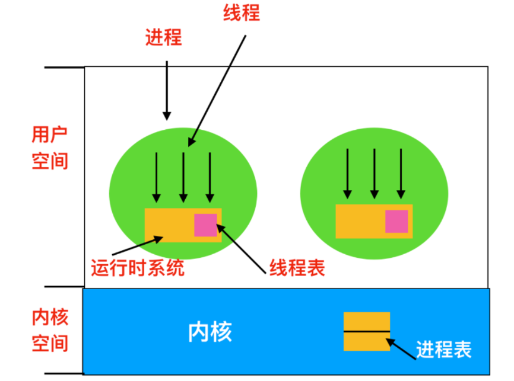

一种解决方案是，一些用户级的线程包解决了这个问题。可以使用时钟周期的监视器来控制第一时间时间片独占。然后，一些库通过特殊的包装来解决系统调用的 I/O 阻塞问题，或者可以为非阻塞 I/O 编写任务。

##### 内核级线程

内核级线程通常使用几个进程表在内核中实现，每个任务都会对应一个进程表。在这种情况下，内核会在每个进程的时间片内调度每个线程。

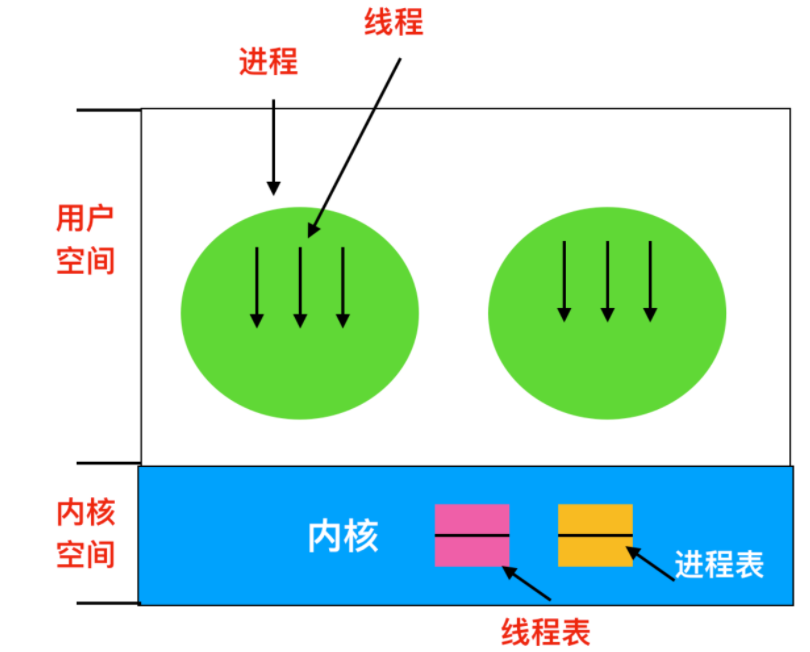

所有能够阻塞的调用都会通过系统调用的方式来实现，当一个线程阻塞时，内核可以进行选择，是运行在同一个进程中的另一个线程（如果有就绪线程的话）还是运行一个另一个进程中的线程。

从用户空间 -> 内核空间 -> 用户空间的开销比较大，但是线程初始化的时间损耗可以忽略不计。这种实现的好处是由时钟决定线程切换时间，因此不太可能将时间片与任务中的其他线程占用时间绑定到一起。同样，I/O 阻塞也不是问题。

##### 混合实现

结合用户空间和内核空间的优点，设计人员采用了一种 内核级线程 的方式，然后将用户级线程与某些或者全部内核线程多路复用起来

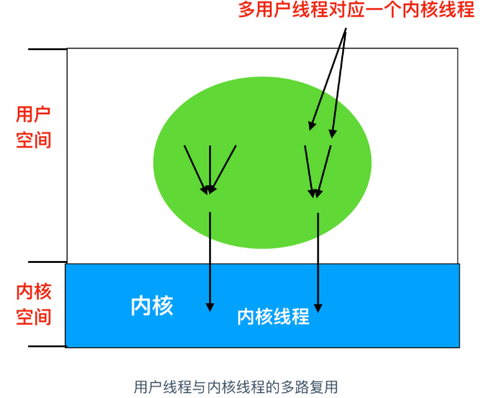

在这种模型中，编程人员可以自由控制用户线程和内核线程的数量，具有很大的灵活度。采用这种方法，内核只识别内核级线程，并对其进行调度。其中一些内核级线程会被多个用户级线程多路复用。

#### Linux 调度

下面我们来关注一下 Linux 系统的调度算法，首先需要认识到，Linux 系统的线程是内核线程，所以 Linux 系统是基于线程的，而不是基于进程的。

为了进行调度，Linux 系统将线程分为三类

- 实时先入先出

- 实时轮询
- 分时

实时先入先出线程具有最高优先级，它不会被其他线程所抢占，除非那是一个刚刚准备好的，拥有更高优先级的线程进入。实时轮转线程与实时先入先出线程基本相同，只是每个实时轮转线程都有一个时间量，时间到了之后就可以被抢占。如果多个实时线程准备完毕，那么每个线程运行它时间量所规定的时间，然后插入到实时轮转线程末尾。

注意这个实时只是相对的，无法做到绝对的实时，因为线程的运行时间无法确定。它们相对分时系统来说，更加具有实时性

Linux 系统会给每个线程分配一个 nice 值，这个值代表了优先级的概念。nice 值默认值是 0 ，但是可以通过系统调用 nice 值来修改。修改值的范围从 -20 - +19。nice 值决定了线程的静态优先级。一般系统管理员的 nice 值会比一般线程的优先级高，它的范围是 -20 - -1。

下面我们更详细的讨论一下 Linux 系统的两个调度算法，它们的内部与 调度队列(runqueue) 的设计很相似。运行队列有一个数据结构用来监视系统中所有可运行的任务并选择下一个可以运行的任务。每个运行队列和系统中的每个 CPU 有关。

Linux O(1) 调度器是历史上很流行的一个调度器。这个名字的由来是因为它能够在常数时间内执行任务调度。在 O(1)O(1) 调度器里，调度队列被组织成两个数组，一个是任务 正在活动 的数组，一个是任务 过期失效 的数组。如下图所示，每个数组都包含了 140 个链表头，每个链表头具有不同的优先级。

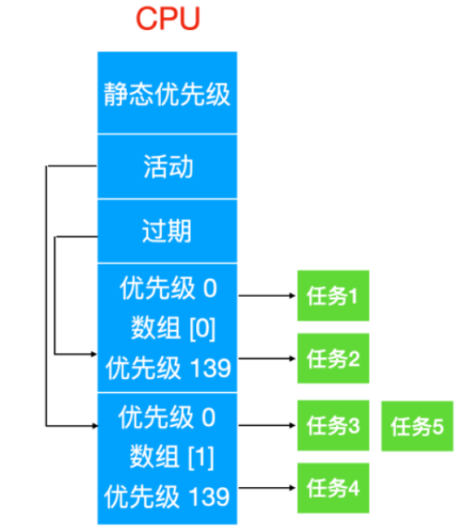

大致流程如下：

调度器从正在活动数组中选择一个优先级最高的任务。如果这个任务的时间片过期失效了，就把它移动到过期失效数组中。如果这个任务阻塞了，比如说正在等待 I/O 事件，那么在它的时间片过期失效之前，一旦 I/O 操作完成，那么这个任务将会继续运行，它将被放回到之前正在活动的数组中，因为这个任务之前已经消耗一部分 CPU 时间片，所以它将运行剩下的时间片。当这个任务运行完它的时间片后，它就会被放到过期失效数组中。一旦正在活动的任务数组中没有其他任务后，调度器将会交换指针，使得正在活动的数组变为过期失效数组，过期失效数组变为正在活动的数组。使用这种方式可以保证每个优先级的任务都能够得到执行，不会导致线程饥饿。

在这种调度方式中，不同优先级的任务所得到 CPU 分配的时间片也是不同的，高优先级进程往往能得到较长的时间片，低优先级的任务得到较少的时间片。

这种方式为了保证能够更好的提供服务，通常会为 交互式进程 赋予较高的优先级，交互式进程就是用户进程。

Linux 系统不知道一个任务究竟是 I/O 密集型的还是 CPU 密集型的，它只是依赖于交互式的方式，Linux 系统会区分是静态优先级 还是 动态优先级。动态优先级是采用一种奖励机制来实现的。奖励机制有两种方式**：奖励交互式线程、惩罚占用 CPU 的线程**。在 Linux O(1) 调度器中，最高的优先级奖励是 -5，注意这个优先级越低越容易被线程调度器接受，所以最高惩罚的优先级是 +5。具体体现就是操作系统维护一个名为 sleep_avg 的变量，任务唤醒会增加 sleep_avg 变量的值，当任务被抢占或者时间量过期会减少这个变量的值，反映在奖励机制上。

O(1) 调度算法是 2.6 内核版本的调度器，最初引入这个调度算法的是不稳定的 2.5 版本。早期的调度算法在多处理器环境中说明了通过访问正在活动数组就可以做出调度的决定。使调度可以在固定的时间 O(1) 完成。

O(1) 调度器使用了一种 启发式 的方式，这是什么意思？

在计算机科学中，启发式是一种当传统方式解决问题很慢时用来快速解决问题的方式，或者找到一个在传统方法无法找到任何精确解的情况下找到近似解。

O(1) 使用启发式的这种方式，会使任务的优先级变得复杂并且不完善，从而导致在处理交互任务时性能很糟糕。

为了改进这个缺点，O(1) 调度器的开发者又提出了一个新的方案，即 公平调度器(Completely Fair Scheduler, CFS)。 CFS 的主要思想是使用一颗红黑树作为调度队列。

数据结构太重要了。

CFS 会根据任务在 CPU 上的运行时间长短而将其有序地排列在树中，时间精确到纳秒级。下面是 CFS 的构造模型

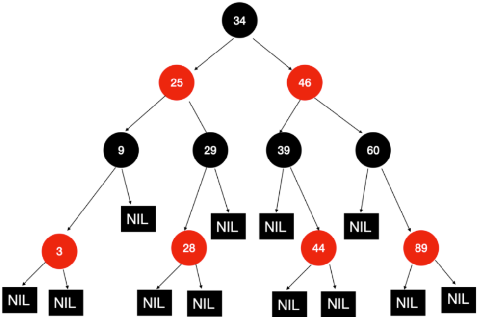

CFS 的调度过程如下：

CFS 算法总是优先调度哪些使用 CPU 时间最少的任务。最小的任务一般都是在最左边的位置。当有一个新的任务需要运行时，CFS 会把这个任务和最左边的数值进行对比，如果此任务具有最小时间值，那么它将进行运行，否则它会进行比较，找到合适的位置进行插入。然后 CPU 运行红黑树上当前比较的最左边的任务。

在红黑树中选择一个节点来运行的时间可以是常数时间，但是插入一个任务的时间是 O(loog(N))，其中 N 是系统中的任务数。考虑到当前系统的负载水平，这是可以接受的。

调度器只需要考虑可运行的任务即可。这些任务被放在适当的调度队列中。不可运行的任务和正在等待的各种 I/O 操作或内核事件的任务被放入一个 等待队列 中。等待队列头包含一个指向任务链表的指针和一个自旋锁。自旋锁对于并发处理场景下用处很大。

Linux 系统中的同步
下面来聊一下 Linux 中的同步机制。早期的 Linux 内核只有一个 大内核锁(Big Kernel Lock,BKL) 。它阻止了不同处理器并发处理的能力。因此，需要引入一些粒度更细的锁机制。

Linux 提供了若干不同类型的同步变量，这些变量既能够在内核中使用，也能够在用户应用程序中使用。在地层中，Linux 通过使用 atomic_set 和 atomic_read 这样的操作为硬件支持的原子指令提供封装。硬件提供内存重排序，这是 Linux 屏障的机制。

具有高级别的同步像是自旋锁的描述是这样的，当两个进程同时对资源进行访问，在一个进程获得资源后，另一个进程不想被阻塞，所以它就会自旋，等待一会儿再对资源进行访问。Linux 也提供互斥量或信号量这样的机制，也支持像是 mutex_tryLock 和 mutex_tryWait 这样的非阻塞调用。也支持中断处理事务，也可以通过动态禁用和启用相应的中断来实现。

#### Linux 启动

下面来聊一聊 Linux 是如何启动的。

当计算机电源通电后，BIOS会进行开机自检(Power-On-Self-Test, POST)，对硬件进行检测和初始化。因为操作系统的启动会使用到磁盘、屏幕、键盘、鼠标等设备。下一步，磁盘中的第一个分区，也被称为 MBR(Master Boot Record) 主引导记录，被读入到一个固定的内存区域并执行。这个分区中有一个非常小的，只有 512 字节的程序。程序从磁盘中调入 boot 独立程序，boot 程序将自身复制到高位地址的内存从而为操作系统释放低位地址的内存。

复制完成后，boot 程序读取启动设备的根目录。boot 程序要理解文件系统和目录格式。然后 boot 程序被调入内核，把控制权移交给内核。直到这里，boot 完成了它的工作。系统内核开始运行。

内核启动代码是使用 汇编语言 完成的，主要包括创建内核堆栈、识别 CPU 类型、计算内存、禁用中断、启动内存管理单元等，然后调用 C 语言的 main 函数执行操作系统部分。

这部分也会做很多事情，首先会分配一个消息缓冲区来存放调试出现的问题，调试信息会写入缓冲区。如果调试出现错误，这些信息可以通过诊断程序调出来。

然后操作系统会进行自动配置，检测设备，加载配置文件，被检测设备如果做出响应，就会被添加到已链接的设备表中，如果没有相应，就归为未连接直接忽略。

配置完所有硬件后，接下来要做的就是仔细手工处理进程0，设置其堆栈，然后运行它，执行初始化、配置时钟、挂载文件系统。创建 init 进程(进程 1 ) 和 守护进程(进程 2)。

init 进程会检测它的标志以确定它是否为单用户还是多用户服务。在前一种情况中，它会调用 fork 函数创建一个 shell 进程，并且等待这个进程结束。后一种情况调用 fork 函数创建一个运行系统初始化的 shell 脚本（即 /etc/rc）的进程，这个进程可以进行文件系统一致性检测、挂载文件系统、开启守护进程等。

然后 /etc/rc 这个进程会从 /etc/ttys 中读取数据，/etc/ttys 列出了所有的终端和属性。对于每一个启用的终端，这个进程调用 fork 函数创建一个自身的副本，进行内部处理并运行一个名为 getty 的程序。

getty 程序会在终端上输入

```
login:
```


等待用户输入用户名，在输入用户名后，getty 程序结束，登陆程序 /bin/login 开始运行。login 程序需要输入密码，并与保存在 /etc/passwd 中的密码进行对比，如果输入正确，login 程序以用户 shell 程序替换自身，等待第一个命令。如果不正确，login 程序要求输入另一个用户名。

整个系统启动过程如下

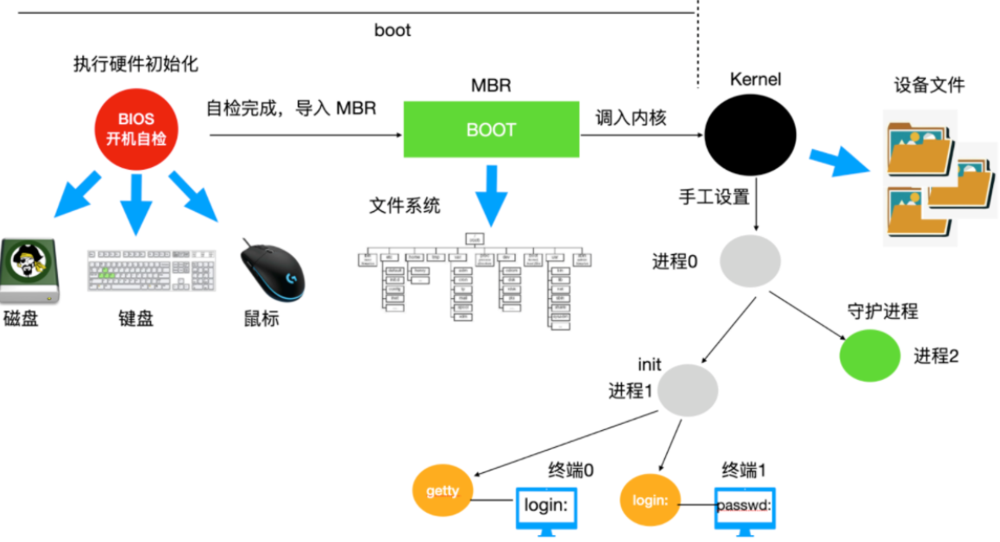

## 内存管理

### 基本概念

每个 Linux 进程都会有地址空间，这些地址空间由三个段区域组成：text 段、data 段、stack 段。下面是进程地址空间的示例。

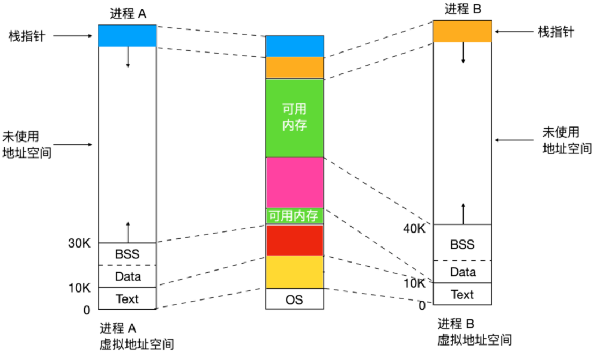

数据段(data segment) 包含了程序的变量、字符串、数组和其他数据的存储。数据段分为两部分，已经初始化的数据和尚未初始化的数据。其中尚未初始化的数据 就是我们说的 BSS。数据段部分的初始化需要编译就期确定的常量以及程序启动就需要一个初始值的变量。所有 BSS 部分中的变量在加载后被初始化为 0 。

和 代码段(Text segment) 不一样，data segment 数据段可以改变。程序总是修改它的变量。而且，许多程序需要在执行时动态分配空间。Linux 允许数据段随着内存的分配和回收从而增大或者减小。为了分配内存，程序可以增加数据段的大小。在 C 语言中有一套标准库 malloc 经常用于分配内存。进程地址空间描述符包含动态分配的内存区域称为 堆(heap)。

第三部分段是 栈段(stack segment)。在大部分机器上，栈段会在虚拟内存地址顶部地址位置处，并向低位置处（向地址空间为 0 处）拓展。举个例子来说，在 32 位 x86 架构的机器上，栈开始于 0xC0000000，这是用户模式下进程允许可见的 3GB 虚拟地址限制。如果栈一直增大到超过栈段后，就会发生硬件故障并把页面下降一个页面。

当程序启动时，栈区域并不是空的，相反，它会包含所有的 shell 环境变量以及为了调用它而向 shell 输入的命令行。举个例子，当你输入

```
cp cxuan lx
```


时，cp 程序会运行并在栈中带着字符串 cp cxuan lx ，这样就能够找出源文件和目标文件的名称。

当两个用户运行在相同程序中，例如编辑器(editor)，那么就会在内存中保持编辑器程序代码的两个副本，但是这种方式并不高效。Linux 系统支持 共享文本段作 为替代。下面图中我们会看到 A 和 B 两个进程，它们有着相同的文本区域。

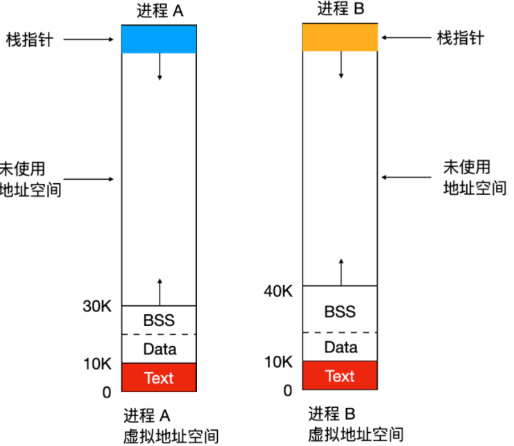

数据段和栈段只有在 fork 之后才会共享，共享也是共享未修改过的页面。如果任何一个都需要变大但是没有相邻空间容纳的话，也不会有问题，因为相邻的虚拟页面不必映射到相邻的物理页面上。

除了动态分配更多的内存，Linux 中的进程可以通过 内存映射文件 来访问文件数据。这个特性可以使我们把一个文件映射到进程空间的一部分而该文件就可以像位于内存中的字节数组一样被读写。把一个文件映射进来使得随机读写比使用 read 和 write 之类的 I/O 系统调用要容易得多。共享库的访问就是使用了这种机制。如下所示

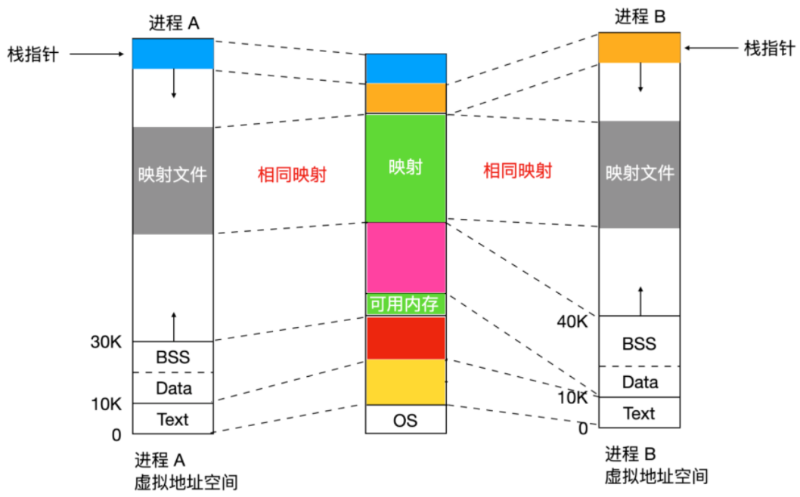

我们可以看到两个相同文件会被映射到相同的物理地址上，但是它们属于不同的地址空间。

映射文件的优点是，两个或多个进程可以同时映射到同一文件中，任意一个进程对文件的写操作对其他文件可见。通过使用映射临时文件的方式，可以为多线程共享内存 提供高带宽，临时文件在进程退出后消失。但是实际上，并没有两个相同的地址空间，因为每个进程维护的打开文件和信号不同。

### Linux 内存管理系统调用

下面我们探讨一下关于内存管理的系统调用方式。事实上，POSIX 并没有给内存管理指定任何的系统调用。然而，Linux 却有自己的内存系统调用，主要系统调用如下

| 系统调用                                | 描述           |
| --------------------------------------- | -------------- |
| s = brk(addr)                           | 改变数据段大小 |
| a = mmap(addr,len,prot,flags,fd,offset) | 进行映射       |
| s = unmap(addr,len)                     | 取消映射       |

如果遇到错误，那么 s 的返回值是 -1，a 和 addr 是内存地址，len 表示的是长度，prot 表示的是控制保护位，flags 是其他标志位，fd 是文件描述符，offset 是文件偏移量。

brk 通过给出超过数据段之外的第一个字节地址来指定数据段的大小。如果新的值要比原来的大，那么数据区会变得越来越大，反之会越来越小。

mmap 和 unmap 系统调用会控制映射文件。mmp 的第一个参数 addr 决定了文件映射的地址。它必须是页面大小的倍数。如果参数是 0，系统会分配地址并返回 a。第二个参数是长度，它告诉了需要映射多少字节。它也是页面大小的倍数。prot 决定了映射文件的保护位，保护位可以标记为 可读、可写、可执行或者这些的结合。第四个参数 flags 能够控制文件是私有的还是可读的以及 addr 是必须的还是只是进行提示。第五个参数 fd 是要映射的文件描述符。只有打开的文件是可以被映射的，因此如果想要进行文件映射，必须打开文件；最后一个参数 offset 会指示文件从什么时候开始，并不一定每次都要从零开始。

### Linux 内存管理实现

内存管理系统是操作系统最重要的部分之一。从计算机早期开始，我们实际使用的内存都要比系统中实际存在的内存多。内存分配策略 克服了这一限制，并且其中最有名的就是 虚拟内存(virtual memory)。通过在多个竞争的进程之间共享虚拟内存，虚拟内存得以让系统有更多的内存。虚拟内存子系统主要包括下面这些概念。

**大地址空间**

操作系统使系统使用起来好像比实际的物理内存要大很多，那是因为虚拟内存要比物理内存大很多倍。

**保护**

系统中的每个进程都会有自己的虚拟地址空间。这些虚拟地址空间彼此完全分开，因此运行一个应用程序的进程不会影响另一个。并且，硬件虚拟内存机制允许内存保护关键内存区域。

**内存映射**

内存映射用来向进程地址空间映射图像和数据文件。在内存映射中，文件的内容直接映射到进程的虚拟空间中。

公平的物理内存分配

内存管理子系统允许系统中的每个正在运行的进程公平分配系统的物理内存。

**共享虚拟内存**

尽管虚拟内存让进程有自己的内存空间，但是有的时候你是需要共享内存的。例如几个进程同时在 shell 中运行，这会涉及到 IPC 的进程间通信问题，这个时候你需要的是共享内存来进行信息传递而不是通过拷贝每个进程的副本独立运行。

下面我们就正式探讨一下什么是 虚拟内存

#### 虚拟内存的抽象模型

在考虑 Linux 用于支持虚拟内存的方法之前，考虑一个不会被太多细节困扰的抽象模型是很有用的。

处理器在执行指令时，会从内存中读取指令并将其 解码(decode)，在指令解码时会获取某个位置的内容并将他存到内存中。然后处理器继续执行下一条指令。这样，处理器总是在访问存储器以获取指令和存储数据。

在虚拟内存系统中，所有的地址空间都是虚拟的而不是物理的。但是实际存储和提取指令的是物理地址，所以需要让处理器根据操作系统维护的一张表将虚拟地址转换为物理地址。

为了简单的完成转换，虚拟地址和物理地址会被分为固定大小的块，称为 页(page)。这些页有相同大小，如果页面大小不一样的话，那么操作系统将很难管理。Alpha AXP系统上的 Linux 使用 8 KB 页面，而 Intel x86 系统上的 Linux 使用 4 KB 页面。每个页面都有一个唯一的编号，即 页面框架号（PFN）。

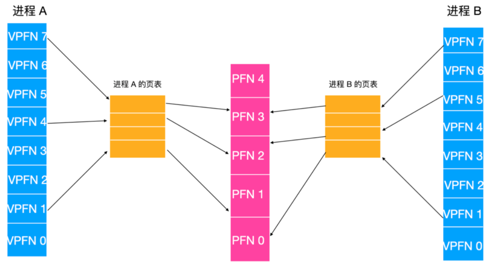

上面就是 Linux 内存映射模型了，在这个页模型中，虚拟地址由两部分组成：偏移量和虚拟页框号。每次处理器遇到虚拟地址时都会提取偏移量和虚拟页框号。处理器必须将虚拟页框号转换为物理页号，然后以正确的偏移量的位置访问物理页。

上图中展示了两个进程 A 和 B 的虚拟地址空间，每个进程都有自己的页表。这些页表将进程中的虚拟页映射到内存中的物理页中。页表中每一项均包含

- 有效标志(valid flag)： 表明此页表条目是否有效
- 该条目描述的物理页框号
- 访问控制信息，页面使用方式，是否可写以及是否可以执行代码

要将处理器的虚拟地址映射为内存的物理地址，首先需要计算虚拟地址的页框号和偏移量。页面大小为 2 的次幂，可以通过移位完成操作。

如果当前进程尝试访问虚拟地址，但是访问不到的话，这种情况称为 缺页异常，此时虚拟操作系统的错误地址和页面错误的原因将通知操作系统。

通过以这种方式将虚拟地址映射到物理地址，虚拟内存可以以任何顺序映射到系统的物理页面。

**按需分页**
由于物理内存要比虚拟内存少很多，因此操作系统需要注意尽量避免直接使用 低效 的物理内存。节省物理内存的一种方式是仅加载执行程序当前使用的页面（这何尝不是一种懒加载的思想呢？）。例如，可以运行数据库来查询数据库，在这种情况下，不是所有的数据都装入内存，只装载需要检查的数据。这种仅仅在需要时才将虚拟页面加载进内中的技术称为按需分页。

**交换**
如果某个进程需要将虚拟页面传入内存，但是此时没有可用的物理页面，那么操作系统必须丢弃物理内存中的另一个页面来为该页面腾出空间。

如果页面已经修改过，那么操作系统必须保留该页面的内容，以便以后可以访问它。这种类型的页面被称为脏页，当将其从内存中移除时，它会保存在称为 交换文件 的特殊文件中。相对于处理器和物理内存的速度，对交换文件的访问非常慢，并且操作系统需要兼顾将页面写到磁盘的以及将它们保留在内存中以便再次使用。

Linux 使用 最近最少使用(LRU) 页面老化技术来公平的选择可能会从系统中删除的页面，这个方案涉及系统中的每个页面，页面的年龄随着访问次数的变化而变化，如果某个页面访问次数多，那么该页就表示越 年轻，如果某个呃页面访问次数太少，那么该页越容易被 换出。

**物理和虚拟寻址模式**
大多数多功能处理器都支持 物理地址 模式和 虚拟地址 模式的概念。物理寻址模式不需要页表，并且处理器不会在此模式下尝试执行任何地址转换。 Linux 内核被链接在物理地址空间中运行。

Alpha AXP 处理器没有物理寻址模式。相反，它将内存空间划分为几个区域，并将其中两个指定为物理映射的地址。此内核地址空间称为 KSEG 地址空间，它包含从 0xfffffc0000000000 向上的所有地址。为了从 KSEG 中链接的代码（按照定义，内核代码）执行或访问其中的数据，该代码必须在内核模式下执行。链接到 Alpha 上的 Linux内核以从地址 0xfffffc0000310000 执行。

**访问控制**
页面表的每一项还包含访问控制信息，访问控制信息主要检查进程是否应该访问内存。

必要时需要对内存进行 访问限制。 例如包含可执行代码的内存，自然是只读内存； 操作系统不应允许进程通过其可执行代码写入数据。 相比之下，包含数据的页面可以被写入，但是尝试执行该内存的指令将失败。 大多数处理器至少具有两种执行模式：内核态和用户态。 你不希望访问用户执行内核代码或内核数据结构，除非处理器以内核模式运行。

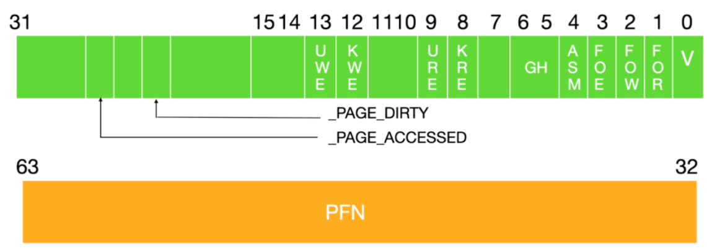

访问控制信息被保存在上面的 Page Table Entry ，页表项中，上面这幅图是 Alpha AXP的 PTE。位字段具有以下含义

- V

- 表示 valid ，是否有效位

- FOR
  读取时故障，在尝试读取此页面时出现故障

- FOW
  写入时错误，在尝试写入时发生错误

- FOE
  执行时发生错误，在尝试执行此页面中的指令时，处理器都会报告页面错误并将控制权传递给操作系统，

- ASM
  地址空间匹配，当操作系统希望清除转换缓冲区中的某些条目时，将使用此选项。

- GH
  当在使用 单个转换缓冲区 条目而不是 多个转换缓冲区 条目映射整个块时使用的提示。

- KRE
  内核模式运行下的代码可以读取页面

- URE
  用户模式下的代码可以读取页面KWE
  以内核模式运行的代码可以写入页面

- UWE
  以用户模式运行的代码可以写入页面

- 页框号
  对于设置了 V 位的 PTE，此字段包含此 PTE 的物理页面帧号（页面帧号）。对于无效的 PTE，如果此字段不为零，则包含有关页面在交换文件中的位置的信息。

  除此之外，Linux 还使用了两个位

- _PAGE_DIRTY
  如果已设置，则需要将页面写出到交换文件中

- PAGE_ACCESSED
  Linux 用来将页面标记为已访问。

#### 缓存

上面的虚拟内存抽象模型可以用来实施，但是效率不会太高。操作系统和处理器设计人员都尝试提高性能。 但是除了提高处理器，内存等的速度之外，最好的方法就是维护有用信息和数据的高速缓存，从而使某些操作更快。在 Linux 中，使用很多和内存管理有关的缓冲区，使用缓冲区来提高效率。

缓冲区缓存
缓冲区高速缓存包含 块设备 驱动程序使用的数据缓冲区。

还记得什么是块设备么？这里回顾下

块设备是一个能存储 固定大小块 信息的设备，它支持 以固定大小的块，扇区或群集读取和（可选）写入数据。每个块都有自己的 物理地址。通常块的大小在 512 - 65536 之间。所有传输的信息都会以 连续 的块为单位。块设备的基本特征是每个块都较为对立，能够独立的进行读写。常见的块设备有 硬盘、蓝光光盘、USB 盘

与字符设备相比，块设备通常需要较少的引脚。


缓冲区高速缓存通过 设备标识符 和块编号用于快速查找数据块。 如果可以在缓冲区高速缓存中找到数据，则无需从物理块设备中读取数据，这种访问方式要快得多。

页缓存
页缓存用于加快对磁盘上图像和数据的访问

它用于一次一页地缓存文件中的内容，并且可以通过文件和文件中的偏移量进行访问。当页面从磁盘读入内存时，它们被缓存在页面缓存中。

交换区缓存
仅仅已修改（脏页）被保存在交换文件中

只要这些页面在写入交换文件后没有修改，则下次交换该页面时，无需将其写入交换文件，因为该页面已在交换文件中。 可以直接丢弃。 在大量交换的系统中，这节省了许多不必要的和昂贵的磁盘操作。

硬件缓存
处理器中通常使用一种硬件缓存。页表条目的缓存。在这种情况下，处理器并不总是直接读取页表，而是根据需要缓存页的翻译。 这些是 转换后备缓冲区 也被称为 TLB，包含来自系统中一个或多个进程的页表项的缓存副本。

引用虚拟地址后，处理器将尝试查找匹配的 TLB 条目。 如果找到，则可以将虚拟地址直接转换为物理地址，并对数据执行正确的操作。 如果处理器找不到匹配的 TLB 条目， 它通过向操作系统发信号通知已发生 TLB 丢失获得操作系统的支持和帮助。系统特定的机制用于将该异常传递给可以修复问题的操作系统代码。 操作系统为地址映射生成一个新的 TLB 条目。 清除异常后，处理器将再次尝试转换虚拟地址。这次能够执行成功。

使用缓存也存在缺点，为了节省精力，Linux 必须使用更多的时间和空间来维护这些缓存，并且如果缓存损坏，系统将会崩溃。

#### Linux页表

Linux 假定页表分为三个级别。访问的每个页表都包含下一级页表

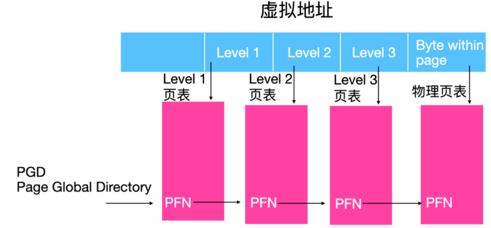

图中的 PDG 表示全局页表，当创建一个新的进程时，都要为新进程创建一个新的页面目录，即 PGD。

要将虚拟地址转换为物理地址，处理器必须获取每个级别字段的内容，将其转换为包含页表的物理页的偏移量，并读取下一级页表的页框号。这样重复三次，直到找到包含虚拟地址的物理页面的页框号为止。

Linux 运行的每个平台都必须提供翻译宏，这些宏允许内核遍历特定进程的页表。这样，内核无需知道页表条目的格式或它们的排列方式。

#### 页分配和取消分配

对系统中物理页面有很多需求。例如，当图像加载到内存中时，操作系统需要分配页面。

系统中所有物理页面均由 mem_map 数据结构描述，这个数据结构是 mem_map_t 的列表。它包括一些重要的属性

count ：这是页面的用户数计数，当页面在多个进程之间共享时，计数大于 1
age：这是描述页面的年龄，用于确定页面是否适合丢弃或交换
map_nr ：这是此mem_map_t描述的物理页框号。
页面分配代码使用 free_area向量查找和释放页面，free_area 的每个元素都包含有关页面块的信息。

页面分配
Linux 的页面分配使用一种著名的伙伴算法来进行页面的分配和取消分配。页面以 2 的幂为单位进行块分配。这就意味着它可以分配 1页、2 页、4页等等，只要系统中有足够可用的页面来满足需求就可以。判断的标准是nr_free_pages> min_free_pages，如果满足，就会在 free_area 中搜索所需大小的页面块完成分配。free_area 的每个元素都有该大小的块的已分配页面和空闲页面块的映射。

分配算法会搜索请求大小的页面块。如果没有任何请求大小的页面块可用的话，会搜寻一个是请求大小二倍的页面块，然后重复，直到一直搜寻完 free_area 找到一个页面块为止。如果找到的页面块要比请求的页面块大，就会对找到的页面块进行细分，直到找到合适的大小块为止。

因为每个块都是 2 的次幂，所以拆分过程很容易，因为你只需将块分成两半即可。空闲块在适当的队列中排队，分配的页面块返回给调用者。

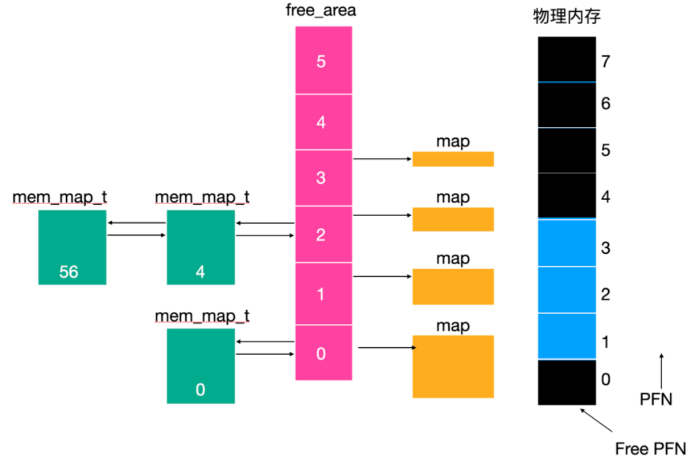

如果请求一个 2 个页的块，则 4 页的第一个块（从第 4 页的框架开始）将被分成两个 2 页的块。第一个页面（从第 4 页的帧开始）将作为分配的页面返回给调用方，第二个块（从第 6 页的页面开始）将作为 2 页的空闲块排队到 free_area 数组的元素 1 上。

页面取消分配
上面的这种内存方式最造成一种后果，那就是内存的碎片化，会将较大的空闲页面分成较小的页面。页面解除分配代码会尽可能将页面重新组合成为更大的空闲块。每释放一个页面，都会检查相同大小的相邻的块，以查看是否空闲。如果是，则将其与新释放的页面块组合以形成下一个页面大小块的新的自由页面块。 每次将两个页面块重新组合为更大的空闲页面块时，页面释放代码就会尝试将该页面块重新组合为更大的空闲页面。 通过这种方式，可用页面的块将尽可能多地使用内存。

例如上图，如果要释放第 1 页的页面，则将其与已经空闲的第 0 页页面框架组合在一起，并作为大小为 2页的空闲块排队到 free_area 的元素 1 中。

说的很复杂，其实原理很简单。页面分配：分配的内存一定是2的幂数，如果需求内存大于当前分配的内存则乘2查找对应大小有没有内存空间，如果没有则乘4,讲乘4的内存分成两个乘2的内存，然后分配一个给需求内存，另一个内存去排队等待下一个需求。比如如果都是8字节的内容，你的需求是9字节，那么分配给你的空间不是9字节，而是16字节。

#### 内存映射

内核有两种类型的内存映射：共享型(shared) 和私有型(private)。私有型是当进程为了只读文件，而不写文件时使用，这时，私有映射更加高效。 但是，任何对私有映射页的写操作都会导致内核停止映射该文件中的页。所以，写操作既不会改变磁盘上的文件，对访问该文件的其它进程也是不可见的。

#### 按需分页

一旦可执行映像被内存映射到虚拟内存后，它就可以被执行了。因为只将映像的开头部分物理的拉入到内存中，因此它将很快访问物理内存尚未存在的虚拟内存区域。当进程访问没有有效页表的虚拟地址时，操作系统会报告这项错误。

页面错误描述页面出错的虚拟地址和引起的内存访问（RAM）类型。

Linux 必须找到代表发生页面错误的内存区域的 vm_area_struct 结构。由于搜索 vm_area_struct 数据结构对于有效处理页面错误至关重要，因此它们以 AVL（Adelson-Velskii和Landis）树结构链接在一起。如果引起故障的虚拟地址没有 vm_area_struct 结构，则此进程已经访问了非法地址，Linux 会向进程发出 SIGSEGV 信号，如果进程没有用于该信号的处理程序，那么进程将会终止。

然后，Linux 会针对此虚拟内存区域所允许的访问类型，检查发生的页面错误类型。 如果该进程以非法方式访问内存，例如写入仅允许读的区域，则还会发出内存访问错误信号。

现在，Linux 已确定页面错误是合法的，因此必须对其进行处理。

## IO管理

### Linux IO 基本概念

Linux 中也有磁盘、打印机、网络等 I/O 设备，Linux 把这些设备当作一种 特殊文件 整合到文件系统中，一般通常位于 /dev 目录下。可以使用与普通文件相同的方式来对待这些特殊文件。

特殊文件一般分为两种：

块特殊文件是一个能存储 固定大小块 信息的设备，它支持 以固定大小的块，扇区或群集读取和（可选）写入数据。每个块都有自己的 物理地址。通常块的大小在 512 - 65536 之间。所有传输的信息都会以 连续 的块为单位。块设备的基本特征是每个块都较为对立，能够独立的进行读写。常见的块设备有 硬盘、蓝光光盘、USB 盘与字符设备相比，块设备通常需要较少的引脚。


块特殊文件的缺点基于给定固态存储器的块设备比基于相同类型的存储器的字节寻址要慢一些，因为必须在块的开头开始读取或写入。所以，要读取该块的任何部分，必须寻找到该块的开始，读取整个块，如果不使用该块，则将其丢弃。要写入块的一部分，必须寻找到块的开始，将整个块读入内存，修改数据，再次寻找到块的开头处，然后将整个块写回设备。

另一类 I/O 设备是 字符特殊文件。字符设备以 字符 为单位发送或接收一个字符流，而不考虑任何块结构。字符设备是不可寻址的，也没有任何寻道操作。常见的字符设备有 打印机、网络设备、鼠标、以及大多数与磁盘不同的设备。


每个设备特殊文件都会和 设备驱动 相关联。每个驱动程序都通过一个 主设备号 来标识。如果一个驱动支持多个设备的话，此时会在主设备的后面新加一个 次设备号 来标识。主设备号和次设备号共同确定了唯一的驱动设备。

我们知道，在计算机系统中，CPU 并不直接和设备打交道，它们中间有一个叫作 设备控制器（Device Control Unit）的组件，例如硬盘有磁盘控制器、USB 有 USB 控制器、显示器有视频控制器等。这些控制器就像代理商一样，它们知道如何应对硬盘、鼠标、键盘、显示器的行为。

绝大多数字符特殊文件都不能随机访问，因为他们需要使用和块特殊文件不同的方式来控制。比如，你在键盘上输入了一些字符，但是你发现输错了一个，这时有一些人喜欢使用 backspace 来删除，有人喜欢用 del 来删除。为了中断正在运行的设备，一些系统使用 ctrl-u 来结束，但是现在一般使用 ctrl-c 来结束。

### 网络

I/O 的另外一个概念是 网络， 也是由 UNIX 引入，网络中一个很关键的概念就是 套接字(socket)。套接字允许用户连接到网络，正如邮筒允许用户连接到邮政系统，套接字的示意图如下

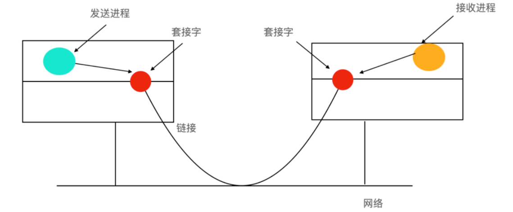

套接字的位置如上图所示，套接字可以动态创建和销毁。成功创建一个套接字后，系统会返回一个 文件描述符(file descriptor)，在后面的创建链接、读数据、写数据、解除连接时都需要使用到这个文件描述符。每个套接字都支持一种特定类型的网络类型，在创建时指定。一般最常用的几种

可靠的面向连接的字节流
可靠的面向连接的数据包
不可靠的数据包传输
可靠的面向连接的字节流会使用 管道 在两台机器之间建立连接。能够保证字节从一台机器按照顺序到达另一台机器，系统能够保证所有字节都能到达。

除了数据包之间的分界之外，第二种类型和第一种类型是类似的。如果发送了 3 次写操作，那么使用第一种方式的接受者会直接接收到所有字节；第二种方式的接受者会分 3 次接受所有字节。除此之外，用户还可以使用第三种即不可靠的数据包来传输，使用这种传输方式的优点在于高性能，有的时候它比可靠性更加重要，比如在流媒体中，性能就尤其重要。

以上涉及两种形式的传输协议，即 TCP 和 UDP，TCP 是 传输控制协议，它能够传输可靠的字节流。UDP 是 用户数据报协议，它只能够传输不可靠的字节流。它们都属于 TCP/IP 协议簇中的协议，下面是网络协议分层

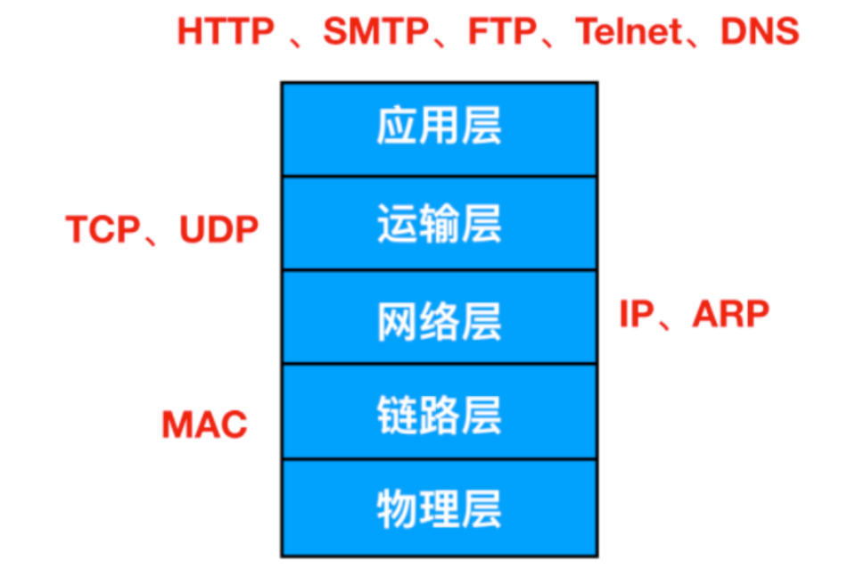

可以看到，TCP 、UDP 都位于传输层上，可见它们都把 IP 协议 即 互联网协议 作为基础。

一旦套接字在源计算机和目的计算机建立成功，那么两个计算机之间就可以建立一个链接。通信一方在本地套接字上使用 listen 系统调用，它就会创建一个缓冲区，然后阻塞直到数据到来。另一方使用 connect 系统调用，如果另一方接受 connect 系统调用后，则系统会在两个套接字之间建立连接。

socket 连接建立成功后就像是一个管道，一个进程可以使用本地套接字的文件描述符从中读写数据，当连接不再需要的时候使用 close 系统调用来关闭。

### Linux IO 系统调用

### Linux IO 实现

#### 块设备实现

#### 字符设备实现

#### 网络设备实现

### Linux 中的模块

## 文件系统

### Linux文件系统基本概念

### Linux 文件系统调用

### Linux 文件系统的实现
