# 数据库

# 语法

## 1.**操作数据库CRUD**

​	**创建C**reate

​		create database 数据库名；

​		create database if not exists 数据库名；

​		create database 数据库名称 character set 字符集名；——指定字符集

​		eg： create database if not exists db1 character set gbk；

​	**查询**Retrieve

​		show database；

​		show create database 数据库名；——查询某个数据库的字符集：查询某个数据库的创建语句

​	**修改Update**

​		alter database 数据库名 character set 字符集名称；

​	**删除Delete**

​		drop database 数据库名；	

​		drop database if exists 数据库名；

​	**使用数据库**

​		select database();——查询当前正在使用的数据库名称

​		use 数据库名称；

## 2.操作表

​	**创建**Create

​		create table 表名（列名1 数据类型1，列名2 数据类型2，....，列名n 数据类型n）；

​			数据类型：

​					int ：整型

​					double：小数类型

​					data：日期，只包含年月日，yyyy-MM-dd

​					datatime：日期，yyyy-MM-dd HH：mm：ss

​					timestamp：时间戳类型，yyyy-MM-dd HH：mm：ss；如果将来不给这个字段赋值，或赋值为											null，则默认使用当前的系统时间，来自动赋值

​					varchar：字符串，eg：name varchar（20）；

​			create table 表名 like 被复制的表名；——复制表

​	**查询**Retrieve

​			show tables；——查询某个数据库中所有的表名称

​			desc 表名；——查询表结构

​	**修改**Update

​			alter table 表名 rename to 新表名；

​			alter table 表名 character set 字符集名称；

​			alter table 表名 add 列名 数据类型；

​			alter table 表名 change **列名 新列名 新数据类型**；

​			alter table 表名 modify **列名 新数据类型**；

​			alter table 表名 drop 列名；——删除列

​				注意：		CHANGE 用来修改字段名字以及类型

​									modify 用来修改字段类型

​									alter column ... set 用来修改字段数据

​	**删除**Delete

​			drop table 表名；

​			drop table if exists 表名；

## 3.增删改表中数据

​	**添加数据**

​			insert into 表名（列名1，列名2，......，列名n） values（值1，值2，.......，值n）；

​								注：如果表名后不定义列名，则默认给所有列添加值：insert into 表名 values(值1,值2,...值n);

​										除了数字类型，其他类型需要使用引号(**单双都可以**)引起来

​	**删除数据**

​			delete from 表名 【where 条件】

​								注：默认可以**在不删除表的情况下删除所有的行**。这意味着表的结构、属性和索引都是完整										的。也就是**删除表中的全部记录**。

​								如果要删除所有记录：

​								delete from 表名; -- 不推荐使用。有多少条记录就会执行多少次删除操作

​								**TRUNCATE TABLE 表名;** -- 推荐使用，效率更高 先删除表，然后再创建一张一样的表。


​	**修改数据**

​				update 表名 set 列名1=值1，列名2=值2，.....【where 条件】；

​								注：如果不加任何条件，则会将表中所有记录全部修改。

##  4.查询表中数据

​			select * from 表名；

​			1.语法：

​					select

​								字段列表

​					from

​								表名列表

​					where

​								条件列表

​					group by

​								分组字段

​					having

​								分组之后的条件

​					order by

​								排序

​					limit

​								分页限定

​			2.基础查询：

​				多个字段查询：

​						select 字段名1，字段名2，.......from 表名；

​						查询所有字段用*

​				去重：

​						distinct

​				计算列：

​						一般可以用四则运算计算一些列的值（一般只进行数值型的计算）

​						ifnull（表达式1，表达式2）：null参与运算，计算结果为null

​								表达式1：哪个字段需要判断是否为null

​								如果该字段为null后的替换值

​					起别名

​							as：as可省略

​			3.条件查询

​				 where子句后跟条件

​				运算符：> 	<	<=	>=	=	<>

​								between....and

​								IN（集合）

​								LIKE：模糊查询；占位符：_：单个任意字符；%：多个任意字符

​								IS NULL

​								and 或 &&

​								or 或 ||

​								not 或 ！

​								eg：

​								-- 查询年龄大于20岁

​								SELECT * FROM student WHERE age > 20;

​								-- 查询年龄不等于20岁

​								SELECT * FROM student WHERE age != 20;

​								SELECT * FROM student WHERE age <> 20;

​								-- 查询年龄大于等于20 小于等于30

​								SELECT * FROM student WHERE age >= 20 &&  age <=30;

​								SELECT * FROM student WHERE age >= 20 AND  age <=30;

​								SELECT * FROM student WHERE age BETWEEN 20 AND 30；

​								-- 查询年龄22岁，18岁，25岁的信息

​								SELECT * FROM student WHERE age = 22 OR age = 18 OR age = 25

​								**SELECT * FROM student WHERE age IN (22,18,25)**;			

​								-- 查询英语成绩为null

​								SELECT * FROM student WHERE english = NULL; -- 不对的。null值不能使用 = （!=） 判			

​								SELECT * FROM student WHERE english IS NULL;				

​								-- 查询英语成绩不为null

​								SELECT * FROM student WHERE english  IS NOT NULL;

​								-- 查询姓马的有哪些？ like

​								SELECT * FROM student WHERE NAME LIKE '马%';

​								-- 查询姓名第二个字是化的人

​								SELECT * FROM student WHERE NAME LIKE "_化%";

​								-- 查询姓名是3个字的人

​								SELECT * FROM student WHERE NAME LIKE '___';

​								-- 查询姓名中包含德的人

​								SELECT * FROM student WHERE NAME LIKE '%德%';

## SQL

- 基础

  - 主键值不允许修改，也不允许复用（不能将已经删除的主键值赋给新数据行的主键）

  - 注释（3种）

    ```sql
    # 注释
    -- 注释
    /* 注释
       注释 */
    ```

  - 数据库的创建和使用

    ```sql
    create database test;
    use test;
    ```

- 创建表

  ```sql
  CREATE TABLE mytable (
    # int 类型，不为空，自增
    id INT NOT NULL AUTO_INCREMENT,
    # int 类型，不可为空，默认值为 1，不为空
    col1 INT NOT NULL DEFAULT 1,
    # 变长字符串类型，最长为 45 个字符，可以为空
    col2 VARCHAR(45) NULL,
    # 日期类型，可为空
    col3 DATE NULL,
    # 设置主键为 id
    PRIMARY KEY (`id`));修改表
  ```

- 添加列

  ```sql
  alter table mytable add col char(20);
  ```

- 删除列

  ```sql
  alter table mytable drop column col；
  ```

- 删除表

  ```sql
  DROP TABLE mytable;
  ```

- 插入

  普通插入

  ```sql
  INSERT INTO mytable(col1, col2)
  VALUES(val1, val2);
  ```

  插入检索出来的数据

  ```sql
  INSERT INTO mytable1(col1, col2)
  SELECT col1, col2 FROM mytable2;
  ```

  将一个表的内容插入到一个新表

  ```sql
  CREATE TABLE newtable AS
  SELECT * FROM mytable;
  ```

- 更新

  ```sql
  UPDATE mytable
  SET col = val
  WHERE id = 1;
  ```

- 删除

  ```sql
  DELETE FROM mytable
  WHERE id = 1;
  ```

  **TRUNCATE TABLE** 可以清空表，也就是删除所有行。

  ```sql
  TRUNCATE TABLE mytable;
  ```

  使用更新和删除操作时一定要用 WHERE 子句，不然会把整张表的数据都破坏。可以先用 SELECT 语句进行测试，防止错误删除

- 查询

  - DISTINCT

    ```sql
    select DISTINCT col1,col2 from mytable;
    ```

  - LIMIT

    ```sql
    select * from table limit m,n;
    # m:记录开始的index，0表示第一条记录
    # n：从m+1开始，取n条
    ```

- 排序

  - **ASC** ：升序（默认）
  - **DESC** ：降序

  可以按多个列进行排序，并且为每个列指定不同的排序方式：

  ```sql
  SELECT *
  FROM mytable
  ORDER BY col1 DESC, col2 ASC;
  ```

- 过滤

  降低网络传输的压力

  | 操作符  | 说明       |
  | ------- | ---------- |
  | =       | 等于       |
  | <       | 小于       |
  | >       | 大于       |
  | <>  !=  | 不等于     |
  | <=  !>  | 小于等于   |
  | >=  !<  | 大于等于   |
  | BETWEEN | 在两值之间 |
  | IS NULL | 为NULL值   |

  注意：NULL、0、空字符串是不同的

  AND 、OR用于连接过滤条件；优先处理AND，当过滤表达式涉及多个AND和OR时，使用()决定优先级，使得优先级关系清晰

  IN操作符用于匹配一组值，其后可以接一个SELECT子句，从而匹配子查询得到一组值

  NOT操作符用于否定一个条件

- 通配符

  用在过滤语句中，但只能用于文本字段

  - % 匹配 >=0 个任意字符
  - _ 匹配  ==1 个任意字符
  - [] 匹配集合内的字符，如[ab]将匹配字符a或b。用脱字符 ^ 对其进行否定，不匹配集合内的字符

  LIKE 通配符匹配

  ```sql
  select * from mytable where col like "[^AB]%";
  --不以A和B开头的任意文本
  ```

- 计算字段

  在数据库服务器上完成数据的转换和格式化的工作往往比客户端上快很多，并且转换和格式化后的数据量更少的话可以减少网络通信量

  计算字段通常需要使用AS来取别名，否则输出的时候字段名为计算表达式

  ```sql
  select col1*col2 as alias from mytable
  ```

  - **CONCAT()** 用于连接两个字段。许多数据库会使用空格把一个值填充为列宽，因此连接的结果会出现一些不必要的空格，使用 **TRIM()** 可以去除首尾空格。

    ```sql
    select concat(trim(col1),'(',trim(col2),')') as concat_col from mytable; 
    ```

- 函数

  各个DBMS的函数都是不同的，因此不可移植；

  - 汇总

    | 函 数   | 说 明            |
    | ------- | ---------------- |
    | AVG()   | 返回某列的平均值 |
    | COUNT() | 返回某列的行数   |
    | MAX()   | 返回某列的最大值 |
    | MIN()   | 返回某列的最小值 |
    | SUM()   | 返回某列值之和   |

    AVG() 会忽略 NULL 行。

    使用 DISTINCT 可以汇总不同的值。

    ```sql
    SELECT AVG(DISTINCT col1) AS avg_col
    FROM mytable;
    ```

  - 文本处理

    | 函数      | 说明           |
    | --------- | -------------- |
    | LEFT()    | 左边的字符     |
    | RIGHT()   | 右边的字符     |
    | LOWER()   | 转换为小写字符 |
    | UPPER()   | 转换为大写字符 |
    | LTRIM()   | 去除左边的空格 |
    | RTRIM()   | 去除右边的空格 |
    | LENGTH()  | 长度           |
    | SOUNDEX() | 转换为语音值   |

    SOUNDEX() 可以将一个字符串转换为描述其语音表示的字母数字模式

    ```sql
    select * from mytable where soundex(col1) = soundex('apple');
    ```

  - 日期和时间处理

    日期格式：YYYY-MM-DD

    时间格式：HH：MM：SS

    | 函数          | 说明                           |
    | ------------- | ------------------------------ |
    | ADDDATE()     | 添加一个日期                   |
    | ADDTIME()     | 添加一个时间                   |
    | CURDATE()     | 返回当前日期                   |
    | CURTIME()     | 返回当前时间                   |
    | DATE()        | 返回当前时间的日期部分         |
    | DATEDIFF()    | 计算两个日期之差               |
    | DATE_ADD()    | 高度灵活的日期计算函数         |
    | DATE_FORMAT() | 返回一个格式化的日期或时间串   |
    | DAY()         | 返回一个日期的天数部分         |
    | DAYOFWEEK()   | 对于一个日期。返回对应的星期几 |
    | HOUR()        | 返回一个时间的小时部分         |
    | MINUTE()      | 返回一个时间的分钟部分         |
    | MONTH()       | 返回一个日期的月份部分         |
    | NOW()         | 返回当前日期和时间             |
    | SECOND()      | 返回一个时间的秒部分           |
    | TIME()        | 返回一个日期时间的时间部分     |
    | YEAR()        | 返回一个日期的年份部分         |

    ```sql
    mysql> SELECT NOW();
    2018-4-14 20:25:11
    ```

  - 数值处理

    | 函数   | 说明   |
    | ------ | ------ |
    | SIN()  | 正弦   |
    | COS()  | 余弦   |
    | TAN()  | 正切   |
    | ABS()  | 绝对值 |
    | SQRT() | 平方根 |
    | MOD()  | 余数   |
    | EXP()  | 指数   |
    | PI()   | 圆周率 |
    | RAND() | 随机数 |

- 分组

  - 把具有相同的数据值的行放在同一组中。

    可以对同一分组数据使用汇总函数进行处理，例如求分组数据的平均值等。

    指定的分组字段除了能按该字段进行分组，也会自动按该字段进行排序。

    ```
    SELECT col, COUNT(*) AS num
    FROM mytable
    GROUP BY col;
    ```

    GROUP BY 自动按分组字段进行排序，ORDER BY 也可以按汇总字段来进行排序。

    ```sql
    select col,count(*) AS num from mytable group by col order by num;
    ```

  - WHERE   &  HAVING

    WHERE过滤行，HAVING过滤分组；行过滤先于分组过滤

    ```sql
    select col,count(*) AS num from mytable where col>2 group by col having num>=2;
    ```

    分组规定：

    - GROUP BY 子句出现在where子句之后，order by子句之前
    - 除了汇总字段外，select语句中的每一个字段都必须在group by子句中给出
    - null的行会单独分为一组
    - 大多数SQL实现不支持GROUP BY列具有可变长的数据类型

- 子查询

  子查询中只能返回一个字段的数据。

  可以将子查询的结果作为 WHRER 语句的过滤条件：

  ```sql
  SELECT *
  FROM mytable1
  WHERE col1 IN (SELECT col2
                 FROM mytable2);
  ```

  下面的语句可以检索出客户的订单数量，子查询语句会对第一个查询检索出的每个客户执行一次：

  ```sql
  SELECT cust_name, (SELECT COUNT(*)
                     FROM Orders
                     WHERE Orders.cust_id = Customers.cust_id)
                     AS orders_num
  FROM Customers
  ORDER BY cust_name;
  ```

- 连接

  内连接又称等值连接，使用 INNER JOIN 关键字。

  ```sql
  SELECT A.value, B.value
  FROM tablea AS A INNER JOIN tableb AS B
  ON A.key = B.key;
  ```

  可以不明确使用 INNER JOIN，而使用普通查询并在 WHERE 中将两个表中要连接的列用等值方法连接起来。

  ```sql
  SELECT A.value, B.value
  FROM tablea AS A, tableb AS B
  WHERE A.key = B.key;
  ```

  ### 自连接

  自连接可以看成内连接的一种，只是连接的表是自身而已。

  一张员工表，包含员工姓名和员工所属部门，要找出与 Jim 处在同一部门的所有员工姓名。

  子查询版本

  ```sql
  SELECT name FROM employee
  WHERE department = (
        SELECT department
        FROM employee
        WHERE name = "Jim");
  ```

  自连接版本

  ```sql
  SELECT e1.name FROM employee AS e1 INNER JOIN employee AS e2
  ON e1.department = e2.department
        AND e2.name = "Jim";
  ```

  ### 自然连接

  自然连接是把同名列通过等值测试连接起来的，同名列可以有多个。

  内连接和自然连接的区别：内连接提供连接的列，而自然连接自动连接所有同名列。

  ```sql
  SELECT A.value, B.value
  FROM tablea AS A NATURAL JOIN tableb AS B;
  ```

  ### 外连接

  外连接保留了没有关联的那些行。分为左外连接，右外连接以及全外连接，左外连接就是保留左表没有关联的行。

  检索所有顾客的订单信息，包括还没有订单信息的顾客。

  ```sql
  SELECT Customers.cust_id, Customer.cust_name, Orders.order_id
  FROM Customers LEFT OUTER JOIN Orders
  ON Customers.cust_id = Orders.cust_id;
  ```

  customers 表：

  | cust_id | cust_name |
  | ------- | --------- |
  | 1       | a         |
  | 2       | b         |
  | 3       | c         |

  orders 表：

  | order_id | cust_id |
  | -------- | ------- |
  | 1        | 1       |
  | 2        | 1       |
  | 3        | 3       |
  | 4        | 3       |

  结果：

  | cust_id | cust_name | order_id |
  | ------- | --------- | -------- |
  | 1       | a         | 1        |
  | 1       | a         | 2        |
  | 3       | c         | 3        |
  | 3       | c         | 4        |
  | 2       | b         | Null     |

- 组合查询

  使用 **UNION** 来组合两个查询，如果第一个查询返回 M 行，第二个查询返回 N 行，那么组合查询的结果一般为 M+N 行。

  每个查询必须包含相同的列、表达式和聚集函数。

  默认会去除相同行，如果需要保留相同行，使用 UNION ALL。

  只能包含一个 ORDER BY 子句，并且必须位于语句的最后。

  ```sql
  SELECT col FROM mytable WHERE col = 1 
  UNION
  SELECT col FROM mytable WHERE col =2;
  ```

- 视图

  视图是虚拟的表，本身不包含数据，也就不能对其进行索引操作。

  对视图的操作和对普通表的操作一样。

  视图具有如下好处：

  - 简化复杂的 SQL 操作，比如复杂的连接；
  - 只使用实际表的一部分数据；
  - 通过只给用户访问视图的权限，保证数据的安全性；
  - 更改数据格式和表示。

  ```sql
  CREATE VIEW myview AS
  SELECT Concat(col1, col2) AS concat_col, col3*col4 AS compute_col
  FROM mytable WHERE col5 = val;
  ```

- 存储过程

  存储过程可以看成是对一系列SQL操作的批处理

  使用存储过程好处：

  - 代码封装，保证一定的安全性
  - 代码复用
  - 预先编译，有很高的性能

  命令行中创建存储过程需要自定义分隔符，因为命令行是以 ; 为结束符，而存储过程中也包含了分号，因此会错误把这部分分号当成是结束符，造成语法错误。

  包含 in、out 和 inout 三种参数。

  给变量赋值都需要用 select into 语句。

  每次只能给一个变量赋值，不支持集合的操作。

  ```sql
  delimiter //
  
  create procedure myprocedure( out ret int )
      begin
          declare y int;
          select sum(col1) from mytable into y;
          select y*y into ret;
      end //
  
  delimiter ;
  ```

  ```sql
  call myprocedure(@ret);
  select @ret;
  ```

- 游标

  存储过程种使用游标对一个结果集进行移动遍历

  游标主要用于交互式应用，其中用户需要对数据集中任意行进行浏览和修改

  使用游标的四个步骤：

  - 声明游标，这个过程没有实际检索出数据
  - 打开游标
  - 取出数据
  - 关闭游标

  ```sql
  delimiter //
  create procedure myprocedure(out ret int)
      begin
          declare done boolean default 0;
  
          declare mycursor cursor for
          select col1 from mytable;
          # 定义了一个 continue handler，当 sqlstate '02000' 这个条件出现时，会执行 set done = 1
          declare continue handler for sqlstate '02000' set done = 1;
  
          open mycursor;
  
          repeat
              fetch mycursor into ret;
              select ret;
          until done end repeat;
  
          close mycursor;
      end //
   delimiter ;
  ```

- 触发器

  触发器会在某个表执行以下语句时而自动执行：DELETE、INSERT、UPDATE。

  触发器必须指定在语句执行之前还是之后自动执行，之前执行使用 BEFORE 关键字，之后执行使用 AFTER 关键字。BEFORE 用于数据验证和净化，AFTER 用于审计跟踪，将修改记录到另外一张表中。

  INSERT 触发器包含一个名为 NEW 的虚拟表。

  ```sql
  CREATE TRIGGER mytrigger AFTER INSERT ON mytable
  FOR EACH ROW SELECT NEW.col into @result;
  
  SELECT @result; -- 获取结果
  ```

  DELETE 触发器包含一个名为 OLD 的虚拟表，并且是只读的。

  UPDATE 触发器包含一个名为 NEW 和一个名为 OLD 的虚拟表，其中 NEW 是可以被修改的，而 OLD 是只读的。

  MySQL 不允许在触发器中使用 CALL 语句，也就是不能调用存储过程。

- 事务管理

  基本术语：

  - 事务（transaction）指一组 SQL 语句；
  - 回退（rollback）指撤销指定 SQL 语句的过程；
  - 提交（commit）指将未存储的 SQL 语句结果写入数据库表；
  - 保留点（savepoint）指事务处理中设置的临时占位符（placeholder），你可以对它发布回退（与回退整个事务处理不同）。

  不能回退 SELECT 语句，回退 SELECT 语句也没意义；也不能回退 CREATE 和 DROP 语句。

  MySQL 的事务提交默认是隐式提交，每执行一条语句就把这条语句当成一个事务然后进行提交。当出现 START TRANSACTION 语句时，会关闭隐式提交；当 COMMIT 或 ROLLBACK 语句执行后，事务会自动关闭，重新恢复隐式提交。

  设置 autocommit 为 0 可以取消自动提交；autocommit 标记是针对每个连接而不是针对服务器的。

  如果没有设置保留点，ROLLBACK 会回退到 START TRANSACTION 语句处；如果设置了保留点，并且在 ROLLBACK 中指定该保留点，则会回退到该保留点。

  ```sql
  START TRANSACTION
  // ...
  SAVEPOINT delete1
  // ...
  ROLLBACK TO delete1
  // ...
  COMMIT
  ```

- 字符集

  基本术语：

  - 字符集为字母和符号的集合；
  - 编码为某个字符集成员的内部表示；
  - 校对字符指定如何比较，主要用于排序和分组。

  除了给表指定字符集和校对外，也可以给列指定：

  ```sql
  CREATE TABLE mytable
  (col VARCHAR(10) CHARACTER SET latin COLLATE latin1_general_ci )
  DEFAULT CHARACTER SET hebrew COLLATE hebrew_general_ci;
  ```

  可以在排序、分组时指定校对：

  ```sql
  SELECT * FROM mytable
  ORDER BY col COLLATE latin1_general_ci;
  ```

- 权限管理

  MySQL 的账户信息保存在 mysql 这个数据库中。

  ```sql
  USE mysql;
  SELECT user FROM user;
  ```

  **创建账户**

  新创建的账户没有任何权限。

  ```sql
  CREATE USER myuser IDENTIFIED BY 'mypassword';
  ```

  **修改账户名**

  ```sql
  RENAME USER myuser TO newuser;
  ```

  **删除账户**

  ```sql
  DROP USER myuser;
  ```

  **查看权限**

  ```sql
  SHOW GRANTS FOR myuser;
  ```

  **授予权限**

  账户用 username@host 的形式定义，username@% 使用的是默认主机名。

  ```sql
  GRANT SELECT, INSERT ON mydatabase.* TO myuser;
  ```

  **删除权限**

  GRANT 和 REVOKE 可在几个层次上控制访问权限：

  - 整个服务器，使用 GRANT ALL 和 REVOKE ALL；
  - 整个数据库，使用 ON database.*；
  - 特定的表，使用 ON database.table；
  - 特定的列；
  - 特定的存储过程。

  ```sql
  REVOKE SELECT, INSERT ON mydatabase.* FROM myuser;
  ```

  

  **更改密码**

  必须使用 Password() 函数进行加密。

  ```sql
  SET PASSWROD FOR myuser = Password('new_password');
  ```


## Drop真能删库跑路？

MySQL常用删除数据方式：

速度：drop>truncate>delete

- delete

  ```sql
  delete from table_name where
  ```

  - 属于DML（Data Manipulation Language）操作语言，只删除数据，不删除表结构，会走事务，执行时会触发trigger（mysql触发器）
  - InnoDB中，不会真把数据删除，实际上MySQL只是给数据打了个标记为已删除，而DELETE删除表中的数据时，表文件在磁盘上所占空间不会变小（存储空间不会释放，MISAM会）。虽然为释放空间，但是下次插入数据的时候，依然可以重用这部分空间（覆盖掉）
  - 执行的时候，会删除数据缓存到rollback segement中，事务commit之后生效
  - 想要到达释放磁盘的目的（InnoDB和MyISAM），可以delete操作后使用optimize table table_name。
  - delete操作一行一行执行，用时会将删除日志记录在redo和undo表空间

- truncate

  ```sql
  turncate table table_name
  ```

  - 属于DDL（Data Definition Language）操作语言，不走事务（原数据不放到rollback segement），操作不触发trigger。
  - 与不带where的delete作用相同
  - 执行后立即生效，无法找回（开始起跑，别回头）
  - 立刻释放磁盘空间，支持InnoDB和MyISAM
  - turncate table类似于 drop table -> create，速度接近drop table速度
  - turncate 能够快速清空某表，并重置auto_increment的值
    - MyISAM，turncate会重置auto_increment值为1；delete则保持不变
    - InnoDB，turncate会重置auto_increment值为1；delete则保持不变，但是重启mysql后，值变为1（因为delete之后auto_increment保存在内存）

- drop

  - 属于DDL（Data Definition Language）操作语言
  - 执行后立即生效，无法找回（开始起跑，别回头）
  - drop table table_name 立即释放磁盘空间，支持InnoDB和MyISAM；drop语句会删除表结构、依赖约束、触发器、索引
  - 依赖于该表的存储过程/函数保留，变为invalid状态

- 总结

  |                | DELETE                             | TRUNCATE                             | DROP                  |
  | -------------- | ---------------------------------- | ------------------------------------ | --------------------- |
  | 类型           | DML                                | DDL                                  | DDL                   |
  | 数据           | 打标记                             | 删除                                 | 删除                  |
  | 表结构         | 不删除                             | 不变                                 | 删除                  |
  | 事务（可回滚） | 走                                 | 不走                                 | 不走                  |
  | 行为           | 有多少条记录就会执行多少次删除操作 | 先删除表，然后再创建一张一样的表     | 删除表                |
  | 释放空间       | 不释放                             | 释放                                 | 释放                  |
  | 恢复           | 回滚                               | bin log（可能不完整）                | bin log（可能不完整） |
  | 速度           | 慢                                 | 中（不走事务，使用系统和事务日志少） | 快                    |
  | 使用场景       | 仅删除数据且需要回滚               | 仅删除数据且要高效                   | 删除表的定义和数据    |

由Foreign key约束引用的表，不能使用turncate table，应使用不带where的delete语句

## having与where的区别？

- where是在**分组前**对数据进行过滤
- having是在**分组后**对数据进行过滤
- where后面不可以使用聚合
- having后面可以使用聚合函数

## 通用SQL函数？

- CONCAT(A,B)	

  连接两个字符串值以创建单个字符串输出。通常用于将两个或多个字符串合并为一个字段

- FORMAT(X,D)

  格式化数字X到D有效数字

- CURRDATE()    CURRTIME()

  返回当前日期或时间

- NOW()

  将当前日期和时间作为一个值返回

- MONTH()  DAY()  YEAR()  WEEK()  WEEKDAY()

  从日期值中提出给定数据

- HOUR()  MINUTE()  SECOND()

  从时间值中提取出给定数据  

- DATEDIFF()  SUBTIMES(A,B)

  确定两次之间的差异

- FROMDAYS(INT)

  将整数天数转换为日期值

## 聚合函数？

- count(字段) 

  根据该字段统计总记录数

- sum(字段)

  计算某个字段的数值总和

- avg(字段)

  计算某个字段的数值的平均值

- max(字段)、min(字段)

  某个字段最大或最小值

## 如果表有个列为TIMESTAMP，将发生什么？

每当行被更改时，时间戳字段将获取当前时间戳。

# 概念与原理

## 数据库三范式？

- 第一范式（1NF）：数据表必须是二维数据表，**列都是不可分割（原子性）**，不满足第一范式（1NF）的数据库就不是关系数据库。

- 第二范式（2NF）：建立在第一范式的基础上，**每个表只描述一件事情（唯一性）**，第二范式要求数据表**每一个行必须被唯一标识**。除满足第一范式外还有两个条件，一是表必须有一个主键；二是没有包含在主键中的列必须完全依赖于主键，而不能只依赖于主键的一部分


- 第三范式（3NF ）：**非主键列之间不可以有依赖关系（依赖性：非关键字段对主键唯一依赖，非关键字段间是相互独立的）**。表中的列不存在对非主键列的传递依赖。除了主键订单编 号外，顾客姓名依赖于非主键顾客编号。即不能存在：非主键列 A 依赖于主键的情况，非主键列 B 依赖于非主键列 A。

综上，第三范式特征：

1. 每一列只有一个值（对属性的原子性约束。要求属性具有原子性，不可分解）
2. 每一行被唯一标识（对记录的唯一性约束，要求记录要有唯一标识，即实体唯一性。）
3. 每一个表都不包含其他表已经包含的非主关键字信息（字段冗余性的约束，即任何字段不能由其他字段派生出来，要求字段没有冗余）

范式化设计：

- 优点：减少数据冗余，使得更新快，体积小；

- 缺点：进行多表关联的查询，降低了写的效率，增加读的效率。很难进行优化。

反范式设计：

- 优点：减少表的关联，可以更好地进行索引优化。
- 缺点：数据冗余与数据异常。数据的修改需要更多的成本。

## 视图的作用，视图可以更改吗？

- 视图是虚拟的表，与包含数据的表不一样，视图只包含使用时动态检索数据的查询，不包含任何列或数据。

- 使用视图可以简化复杂的sql操作，隐藏具体的细节，保护数据；视图创建后，可以使用与表相同的方式利用它们

- 视图不能被索引，也不能有关联的触发器或默认值，如果视图本身内有order by或对视图再次order by将被覆盖

- 创建视图

  ```sql
  create view XXX as XXXX；
  ```

- 对于某些视图比如未使用联结子查询分组聚集函数Distinct Union等，是可以对其他更新的，对视图的更新将对基表进行更新；但是视图主要用于简化检索，保护数据，并不用于更新，而且大部分视图都不可以更新。


## 存储日期？

|            | Datatime                        | Timestamp                                                    | Date                       |
| ---------- | ------------------------------- | ------------------------------------------------------------ | -------------------------- |
| 格式       | YYYY-MM-DD HH:MM:SS（精确到秒） | 时间戳，yyyy-MM-dd HH:mm:ss（如果不给这个字段赋值或赋值为null，则默认使用当前的系统时间） | yyyy-MM-dd（可用时间函数） |
| 占用字节数 | 8个                             | 4个                                                          | 3个                        |
| 与时区有关 | 否                              | 是                                                           |                            |

不使用字符串类型存储日期时间数据：占用存储空间小，查找过滤时可以利用日期得到函数

- data：日期，只包含年月日，yyyy-MM-dd
- datatime：日期，yyyy-MM-dd HH：mm：ss
- timestamp：时间戳类型，yyyy-MM-dd HH:mm:ss；如果将来不给这个字段赋值，或赋值为null，则默认使用当前的系统时间，来自动赋值

## 有关权限的表有哪几个？

MySQL服务器通过权限表来控制用户对数据库的访问，权限表存放在mysql数据库中，由mysql_install_db脚本初始化：

- user
- db
- table_priv
- column_priv
- host

## MySQL查询缓冲弊端？使用情况？8.0版本对查询缓存变更？

- 查询缓存可能失效非常频繁。对于一个表，只要有更新，该表的全部查询缓存都会被清空，因此对于频繁更新的表来说，查询缓存不一定能起到正面效果

- 对于读远多于写的表可以考虑使用查询缓存

- 8.0版本的查询缓存功能被删除

## MySQL表中允许有多少个TRIGGERS？

6个：(after、before)*(update、insert、delete)

- before insert
- after insert
- before update
- after update
- before delete
- after delete


# 存储引擎

## InnoDB优势

- 遵循ACID设计模式，有事务（Transactions）、回滚和保护用数据的奔溃的恢复能力
- 主内存维护了一个Buffer pool，用来缓存表和索引，频繁访问的数据会在内存中直接操作
- 如果缓存中或磁盘中的数据有损坏，MySQL的数据校验机制会在我们使用它之前提醒我们
- 设计表时为每个表添加主键，会自动优化涉及列的操作。也就是基于主键的查询、排序、聚合性能会很高
- InnoDB提供行级锁
- InnoDB表基于主键在磁盘上安排数据，有优化
- 为了维护数据完整性，InnoDB还支持外键完整性约束
- InnoDB可以和其他MySQL存储引擎混合使用InnoDB表，即使是在同一个SQL语句中也可以使用多种存储引擎的表
- InnoDB的设计初衷是为了处理大量数据时提高CPU效率和性能。InnoDB可以存储大量的数据，即使操作系统限制单个文件大小为2G的系统也是如此

## InnoDB使用场景

-  支持事务的业务
- 高并发的业务。行级锁对高并发有很好的适应能力
- 数据更新比较频繁的场景，如BBS（行锁）
- 数据一致性要求高

## MyISAM的优点

插入、查询速度较高，不支持事务

支持全文索引（BLOB和TEXT列可以被索引）

选择count(*)很快

NULL值被允许在索引的列中

占用资源少，服务器硬件不太行时，可以考虑

## MyISAM使用场景

- 不需要事务支持的场景，读数据多的场景
- 并发相对较低的业务，因为表级锁锁定的机制限制
- 数据修改相对较少的业务，阻塞问题
- 对数据要求一致性不高的业务

## InnoDB与MyISAM的区别

- 锁

  MyISAM只支持 表级锁，InnoDB支持行级锁和表级锁，默认行级锁

- 事务

  MyISAM不支持事务，InnoDB支持事务，具有提交（commit）和回滚（rollback）事务的能力

- 外键

  MyISAM不支持，InnoDB支持

  一般我们不建议在数据库层面使用外键，应用层可以解决。不过，这样会对数据的一致性造成威胁。具体要不要使用外键还是要根据项目而定

- 数据库异常奔溃的恢复能力

  MyISAM不支持，InnoDB支持。使用InnoDB的数据库在异常奔溃后，数据库重新启动的时候会保证数据库恢复到奔溃前的状态，此恢复过程依赖于redo log

- MVCC

  MyISAM不支持，InnoDB支持。MVCC可以看作是行级锁的一个升级，可以有效减少加锁的操作，提高性能

补充：

- 存储结构

MyISAM：每个MyISAM在磁盘上存储成三个文件。文件的名字以表的名字开始，扩展名指出文件类型。.frm文件存储表定义。数据文件的扩展名为.MYD (MYData)。索引文件的扩展名是.MYI (MYIndex)。
InnoDB：所有的表都保存在同一个数据文件中（也可能是多个文件，或者是独立的表空间文件），InnoDB表的大小只受限于操作系统文件的大小，一般为2GB。

-  存储空间

MyISAM：可被压缩，存储空间较小。支持三种不同的存储格式：静态表(默认，但是注意数据末尾不能有空格，会被去掉)、动态表、压缩表。
InnoDB：需要更多的内存和存储，它会在主内存中建立其专用的缓冲池用于高速缓冲数据和索引。

-  可移植性、备份及恢复

MyISAM：数据是以文件的形式存储，所以在跨平台的数据转移中会很方便。在备份和恢复时可单独针对某个表进行操作。
InnoDB：免费的方案可以是拷贝数据文件、备份 binlog，或者用 mysqldump，在数据量达到几十G的时候就相对痛苦了。

- 事务支持

MyISAM：强调的是性能，每次查询具有原子性,其执行数度比InnoDB类型更快，但是不提供事务支持。
InnoDB：提供事务支持事务，外部键等高级数据库功能。 具有事务(commit)、回滚(rollback)和崩溃修复能力(crash recovery capabilities)的事务安全(transaction-safe (ACID compliant))型表。

- AUTO_INCREMENT

MyISAM：可以和其他字段一起建立联合索引。引擎的自动增长列必须是索引，如果是组合索引，自动增长可以不是第一列，他可以根据前面几列进行排序后递增。
InnoDB：InnoDB中必须包含只有该字段的索引。引擎的自动增长列必须是索引，如果是组合索引也必须是组合索引的第一列。

- 表锁差异

MyISAM：只支持表级锁，用户在操作myisam表时，select，update，delete，insert语句都会给表自动加锁，如果加锁以后的表满足insert并发的情况下，可以在表的尾部插入新的数据。
InnoDB：支持事务和行级锁，是innodb的最大特色。行锁大幅度提高了多用户并发操作的新能。但是**InnoDB的行锁，只是在WHERE的主键是有效的，非主键的WHERE都会锁全表的**。

- 全文索引

MyISAM：支持 FULLTEXT类型的全文索引
InnoDB：不支持FULLTEXT类型的全文索引，但是innodb可以使用sphinx插件支持全文索引，并且效果更好。

- 表主键

MyISAM：允许没有任何索引和主键的表存在，索引都是保存行的地址。
InnoDB：如果没有设定主键或者非空唯一索引，就会自动生成一个6字节的主键(用户不可见)，数据是主索引的一部分，附加索引保存的是主索引的值。

- 表的具体行数

MyISAM：保存有表的总行数，如果select count() from table;会直接取出出该值。
InnoDB：没有保存表的总行数，如果使用select count(*) from table；就会遍历整个表，消耗相当大，但是在加了where2条件后，myisam和innodb处理的方式都一样。

-  CURD操作

MyISAM：如果执行大量的SELECT，MyISAM是更好的选择。
InnoDB：如果你的数据执行大量的INSERT或UPDATE，出于性能方面的考虑，应该使用InnoDB表。DELETE 从性能上InnoDB更优，但DELETE FROM table时，InnoDB不会重新建立表，而是一行一行的删除，在innodb上如果要清空保存有大量数据的表，最好使用truncate table这个命令。

- 外键

MyISAM：不支持
InnoDB：支持

通过上述的分析，基本上可以考虑使用InnoDB来替代MyISAM引擎了，原因是InnoDB自身很多良好的特点，比如事务支持、存储 过程、视图、行级锁定等等，在并发很多的情况下，相信InnoDB的表现肯定要比MyISAM强很多。另外，任何一种表都不是万能的，只用恰当的针对业务类型来选择合适的表类型，才能最大的发挥MySQL的性能优势。如果不是很复杂的Web应用，非关键应用，还是可以继续考虑MyISAM的，这个具体情况可以自己斟酌。

## MyISAM存储结构

MyISAM在磁盘上存储成三个文件。第一个文件的名字以表名开始，扩展指出文件类型

- .frm 文件存储表定义
- .MYD 数据文件
- .MYI 索引文件

# 事务

## 如何保证事务的ACID？

- 原子性A

  MySQL InnoDB 引擎使用 undo log（回滚日志）保证事务的原子性

- 一致性C

  保证了事务的持久性、原子性、隔离性之后，一致性才能保证

- 隔离性I

  MySQL InnoDB 引擎通过 锁机制、MVCC等保证事务的隔离性（默认隔离级别为 REPEATABLE-READ）

- 持久性D

  MySQL InnoDB 引擎使用 redo log（重做日志）保证事务的持久性

## InnoDB如何实现事务？（待完善）

[庖丁解InnoDB之UNDO LOG](https://baijiahao.baidu.com/s?id=1716401691456552282&wfr=spider&for=pc)

利用回滚日志（undo log）和重做日志redo log两种表实现事务，并实现MVCC

在执行事务的每条SQL时，会将数据原值写入undo log中，将修改后的值写入redo log中。redo log按照时间条件进行刷盘，undo log按照checkpoint进行刷盘。刷盘后相应的redo log就可以删除了。如果事务还没提交，发生崩溃，重启后会检查checkpoint记录，使用相应的redo log和undo log进行数据恢复，如果redo log的事务是未提交的，就使用undo log进行事务回滚。如果在事务提交后奔溃，因为事务的redo log都刷盘了，redo log在事务提交的时候，必须将该事务的所有日志写入到重做日志进行持久化。

## redo log、undo log、bin log

- bin log：

  bin log就是二进制文件，记录了MySQL所有修改数据库的操作，然后以二进制的形式记录在日志文件中，其中还包括每条语句的所执行的时间和所消耗的资源，以及相关的事务信息；

  默认情况下时开启的，可以修改二进制日志存放的目录和文件名称：

  ```sh
  --log-bin[=file_name]
  ```

- redo log：

  重做日志实现事务的持久性，即ACID中的D。

  由两部分组成：内存中的重做日志缓存（redo log buffer），易丢失；重做日志文件（redo log file），持久的

  当事务提交时，会将事务写入redo log buffer的日志持久化到磁盘的redo log文件中。

- undo log：

  回滚日志记录了事务的行为，方便回滚操作。用户执行的事务或语句由于某种原因失败或用户只需一条rollback请求回滚时，就可以利用undo log将数据回滚到修改之前的样子

在对数据库进行修改时，InnoDB存储引擎不会产生redo log，但是会产生undo log

redo log用来保持事务的持久性，undo log用来帮助事务回滚及MVCC的功能。redo log是顺序写的，在数据库运行时不需要对redo log的文件进行读操作，而undo log是需要进行随机读写的

与redo log不同，undo log存放在数据库内部的一个特殊段（segment）中，这个段称为undo段（undo segment），undo段存放于共享表空间中


补充：随机和顺序读写：

随机读写占用空间多，但速度快，便于进行数据处理，而顺序读写速度慢，空间小，数据处理复杂

随机和顺序读写，是存储器的两种输入输出方式。

存储的数据在磁盘中占据空间，对于一个新磁盘，操作系统会将数据文件依次写入磁盘，当有些数据被删除时，就会空出该数据原来占有的存储空间，时间长了，不断的写入、删除数据，就会产生很多零零散散的存储空间，就会造成一个较大的数据文件放在许多不连续的存贮空间上，读写些这部分数据时，就是随机读写，磁头要不断的调整磁道的位置，以在不同位置上的读写数据，相对于连续空间上的顺序读写，要耗时很多。

在开机时、启动大型程序时，电脑要读取大量小文件，而这些文件也不是连续存放的，也属于随机读取的范围。

## MVCC？

InnoDB默认的隔离级别是RR（Repeatable Read），RR可以解决脏读、不可重复读、幻读等问题，这里使用MVCC解决脏读、不可重复读和部分幻读；

MVCC，多版本并发控制协议，优点是读不加锁，读写不冲突，并发性能好，主要基于以下三个技术：

- 隐藏列

  InnoDB中每一行数据都有隐藏列，隐藏列中包含了本行数据的事务id，指向undo log的指针等

- undo log 版本链

  每行数据的隐藏列中包含了指向undo log的指针，每条undo log也有指向更早版本undo log的指针，从而形成一条undo log版本链

- ReadView：就是事务进行快照读的时候，会生成数据库系统当前的一个快照，记录系统当前活跃事务的ID。

  有三个全局属性：

  - trx_list

    当前活跃事务的id列表，undo log版本链中事务id在这个列表内的数据是不可见的

  - up_limit_id

    活跃事务id列表的最小id，undo log中小于该id的版本是可见的

  - low_limit_id

    活跃事务id列表的最大值+1，及尚未分配的下一个事务id，当前事务不可见

  判断流程：

  up_limit_id：小于可见，大于的话  》 low_limit_id：大于等于不可见，小于的话  》 DB_TRX_ID：在列表中不可见，不在列表中可见

  RC级别，每次快照读select都会生成一个read view

  RR级别，第一次快照读select生成一个read view

  

## 什么是行级锁？

行级锁是一种排他锁，防止其他事务修改此行

获取行级锁：

- insert、update、delete、select....for update（允许用户一次锁定多条记录进行更新）

释放锁：

- commit或rollback

## MySQL有几种锁？

- 表级锁

  开销小，加锁快；不会出现死锁；锁定粒度大，发生冲突的概率最高，并发度最低

- 行级锁

  开销大，加锁慢，会出现死锁；锁定粒度最小，发生锁冲突的概率最低，并发度也最高

- 页面锁

  开销和加锁时间界于表锁和行锁之间；会出现死锁。锁粒度界于表锁和行锁之间，并发度一般

## 锁的优化策略？

- 读写分离
- 分段加锁
- 减少锁持有时间
- 多个线程尽量以相同的顺序取获取资源，不能将锁的粒度过于细化，不然可能会出现线程的加锁和释放锁次数过多，反而效率不如一次加一把大锁

MySQL中InnoDB引擎的行锁是通过加在什么上完成（实现）的？

加在索引项

只有通过索引条件检索的数据，InnoDB才会使用行级锁，否则使用表锁

# 索引

## 索引实现？

- 平衡二叉树

  mysql使用最多的索引存储结构。其中，根据二叉树叶子节点保存的索引类型分有：

  - 主键索引，在索引内容中保存的是数据的地址。

  - 其他索引，索引内容中保存的是指向主键索引的引用；在innodb存储引擎中，最好使用主键索引，速度很较快。

- hash

  将索引值做hash运算，存放到hash表。使用较少。

  - 优点：
    - 因为是hash表存储，所以存取索引效率非常高。
  - 缺点：
    - hash索引只能做精确值的比较：=、in、<>；无法使用范围查询
    - 无法使用索引排序
    - 组合hash索引无法使用部分索引
    - 如果出现大量索引hash值相同，则性能会降低

## 索引的优缺点？

优点：

- 加快数据的检索速度

- 创建唯一索引，可以保证数据库中每一行数据的唯一性
- 加速表与表之间的连接，特别是在实现数据的参考完整性方面特别有意义
- 减少查询中分组和排序时间
- 在查询过程中，可以使用优化隐藏器，提高系统性能

缺点：

- 创建和维护索引比较耗时，且随着数据量的增加而增加
- 存储索引占用物理空间，特别是建立聚簇索引，占用空间更大
- 增加、删除和修改数据时，索引需要动态维护，降低了数据的维护速度

## 不应该创建索引的列？

- 查询中很少使用或参考的列

  不会在where语句中出现的字段

- 很少数据值的列

- 唯一性不高，比如性别列等

- 定义了text、image和bit数据类型的列

  这些列要么数据量大，要么取值少

- 经常要修改而非查询的列

## 不会走索引？

- where后含 is null / is not null / like "%输入符%" 等条件
- where子句里对索引使用不等号（<>）

## 索引原则？

- 选择唯一性索引，即值唯一的字段

- 经常排序、分组和联合操作的字段

- 常作为查询条件的字段

- 限制索引的数目

  越多的索引，更新表的时间越长，占用空间越大

- 索引值很长，会影响查询速度，尽量使用值的前缀来索引

- 删除不再使用或很少使用的索引

- 查询的时候符合 最左前缀匹配原则

- 尽量选择区分度高的列作为索引，区分度：字段不重复的比例

- 索引列不能参与运算，保存列”干净“；带函数的查询不参与索引

- 尽量扩展索引，而不是新建索引

## 索引的种类？

- 普通索引

  数据库表创建的索引

- 唯一索引

  索引列的值必须唯一，允许null值

- 主键索引

  特殊的唯一索引，不允许null值。一般建表的时候同时创建主键索引

- 聚合索引

  多个字段联合起来作为一个索引

## 主键、外键和索引的区别？

|      | 索引                         | 主键                                         | 外键                                       |
| ---- | ---------------------------- | -------------------------------------------- | ------------------------------------------ |
| 定义 | 不允许重复，可以有一个null值 | 唯一标识一条记录，不允许重复，不允许有null值 | 表的外键是另一个表的主键，允许重复和null值 |
| 作用 | 提高查询、排序速度           | 保证数据完整性                               | 和其他表建立联系用                         |
| 个数 | 一个表可以有多个唯一索引     | 只能一个                                     | 一个表可以有多个外键                       |

## 唯一索引比普通索引快吗？

唯一索引不一定比普通索引快，还可能慢。

- 查询时，没有使用limit 1的情况下，匹配到一条数据后，唯一索引即可返回，普通索引还会继续匹配下一条数据，发现不匹配后返回。唯一索引少一次匹配，但这个消耗实际上微乎其微。
- 更新时，普通索引将记录放在 change buffer 中语句就执行完毕了，而对唯一索引而言，必须校验唯一性，所以将数据页读入内存确定没有冲突后，才能继续操作。对于写多读少的情况，普通索引利用change buffer有效减少了对磁盘的访问次数。因此普通索引性能高于唯一索引。

## 什么情况全表扫描？

- 条件中使用null
- 使用 or作为连接条件且or关键字两边不都是索引列
- 使用[not] in时
- 使用模糊查询时
- 使用!=或<>时
- 使用count(*)时
- 使用参数作为条件时

# MySQL性能优化

## 执行计划和执行明细？

- Explain：查看一条SQL所选择的执行计划
- Profiling：准确定位一条SQL的性能瓶颈

## sql语句优化经验

- 使用索引：

  - 合理运用索引

  - 避免在列上做运算，可能导致索引失效

  - 使用LIKE关键字时，“%”不要放在首位

  - 避免在索引列上使用IS NULL 和 IS NOT NULL

  - 使用where注意

    - 避免在where子句中对字段进行null值判断
    - 避免在where子句中对字段进行表达式操作，如：!=或<>

  - 不要做无谓的排序，尽可能在索引中完成排序

    - UNION ALL 比 UNION 快很多，所以，如果可以确认合并的两个结果集中不包含重复数据且不需要排序时的话，就可以使用UNION ALL。

      重复结果的处理：UNION 在进行表连接后会筛选掉重复的记录，UNION ALL不会。

      对排序的处理：UNION 将会按照字段的顺序进行排序，UNION ALL只是简单的将两个结果合并后就返回。

  - 使用视图时，给视图建立索引

- 函数

  - 不要使用rand随机函数随机获取记录
  - 不要使用count(id)，应该使用count(*)

- 优化子查询

  - 使用join时应该小结果集驱动大结果集，同时把复杂的join查询拆分成多个query，不然join越多的表，会导致越多的锁定和阻塞
  - From语句中一定不要使用子查询

- 内存

  - 不要使用select *

- 插入优化

  - 使用批量插入语句，节省交互

- 优化范围查询

  - Limit基数比较大时，使用between  and
  - 使用更多的where加以限制，缩小查找范围
  - 用EXISTS替代IN，用NOT EXITS替代NOT IN

- 优化表结构

  - 避免使用null，建表时，尽量设置not null，提高查询效率
  - 有外键约束会影响插入和删除性能，如果程序能够保证数据的完整性，设计数据库的时候就去掉外键
  - 表中允许适当的冗余，比如，主题帖的回复数量和最后回复时间等

- sql server

  - 用PreparedStatement，一般比Statement性能高；一个sql发给服务器去执行，涉及步骤：语法检查、语义分析、编译、缓存。

- 使用explain查看sql性能

- 表关联时取别名，提高效率

  
  
  

## 数据库优化？

MySQL数据库优化是多方面的，原则是减少系统的瓶颈，减少资源的占用，增加系统的反应速度。例如，通过优化文件系统，提高磁盘I/O的读写速度；通过优化操作系统调度策略，提高MySQL在高负荷情况下的负载能力；优化表结构、索引、查询语句等使查询响应更快。

**针对查询，可以通过使用索引、使用连接代替子查询的方式来提高查询速度。**

**针对慢查询，可以通过分析慢查询日志，来发现引起慢查询的原因，从而有针对性地进行优化。**

**针对插入，可以通过禁用索引、禁用检查等方式来提高插入速度，在插入之后再启用索引和检查。**

**针对数据库结构，可以通过将字段很多地表拆分成多张表、增加中间表、增加冗余字段等方式进行优化。**

## 优化查询？

- 使用索引

  查询没有使用索引，将会出现全表扫描。在数据量大地情况下，此查询会很慢。如果使用索引进行查询，查询语句可以根据索引快速定位到待查询记录，从而减少查询地记录数，达到提高查询速度地目的。

  索引可以提高查询的速度，但并不是使用带索引的字段查询时索引都会起作用。以下情况可能使索引失效：

  - 使用LIKE关键字

    “%”在匹配字符串的首位，索引失效；只有不在首位，索引才起作用

  - 使用多列索引

    MySQL可以为多个字段创建索引（联合索引）。一个索引可以包含16个字段。对于多列索引，只有查询条件种使用了这些字段中的第1个字段时索引才会被使用

  - 使用OR关键字

    使用OR关键字，且OR前后的两个条件中的列都是索引时，才会使用索引；否则，查询不走索引

- 优化子查询

  使用子查询可以进行SELECT语句的嵌套查询，即一个SELECT查询的结果作为另一个SELECT语句的条件。子查询可以一次性完成很多逻辑上需要多个步骤才能完成的SQL操作。

  子查询虽然灵活，但是执行效率不高。执行子查询时，MySQL需为内层查询语句的查询结果建立一个临时表。然后外层查询语句从临时表中查询记录。查询完毕后，再撤销这些临时表。因此，子查询的速度会受到一定的影响，如果查询的数据量比较大，这种影响也随之增大。

  在MySQL中，可以使用连接（JOIN）查询来替代子查询。连接查询不需要建立临时表，其速度比子查询要快，如果查询中使用索引，性能会更好。

## 优化慢查询？

步骤：

1. 开启慢查询日志

   MySQL中慢查询日志默认是关闭的，可以通过配置文件 my.ini 或者 my.cnf 中的 log-slow-queries 选项打开，也可以在MySQL服务启动的时候使用 --log-slow-queries[=file_name] 启动慢查询日志。

   启动慢查询日志时，需要在my.ini或者my.cnf文件中配置long_query_time选项指定记录阈值，如果某条查询语句的查询时间超过了这个值，这个查询过程将被记录到慢查询日志文件中。

2. 分析慢查询日志

   直接分析mysql慢查询日志，利用explain关键字可以模拟优化器执行SQL查询语句，来分析sql慢查询语句。

3. 常见慢查询优化

   - 没走索引
     - 使用LIKE关键字时，“%”不要放在首位
     - 为多个字段创建索引。一个索引可以包括16个字段。对于多列索引，只有查询条件中使用了这些字段中的第1个字段时索引才会被使用。（最左前缀原则）
     - OR关键字，前后两个条件的列都为索引

   - 优化数据库结构
     - 对使用频率低的字段，分离出来形成新表。
     - 对经常联合查询的表，建立中间表以提高查询效率。把需要经常联合查询的数据插入到中间表中，然后将原来的联合查询改为对中间表的查询，以此来提高查询效率。
   - 分解关联查询
     - 很多高性能的应用都会对关联查询进行分解，就是可以对每一个表进行一次单表查询，然后将查询结果在应用程序中进行关联，很多场景下这样会更高效。
   - 优化Limit分页
     - limit 10000,20这样的查询，这是mysql需要查询10020条然后只返回最后20条，前面的10000条记录都将被舍弃，这样的代价很高。优化此类查询的一个最简单的方法是尽可能的使用索引覆盖扫描，而不是查询所有的列。然后根据需要做一次关联操作再返回所需的列。对于偏移量很大的时候这样做的效率会得到很大提升。

## 高效插入数据？

影响插入效率因素：索引、唯一性校验、一次插入记录条数等。

针对MyISAM引擎的表，优化方法：

- 禁用索引

  对于非空表，插入记录时，MySQL会根据表的索引对插入的记录建立索引。如果插入大量数据，建立索引会降低插入记录的速度。为了解决这种情况，可以在插入记录之前禁用索引，数据插入完毕后再开启索引。对于空表批量导入数据，则不需要进行此操作，因为MyISAM引擎的表是在导入数据之后才建立索引的。

- 禁用唯一性检查

  插入数据时，MySQL会对插入的记录进行唯一性校验。这种唯一性校验也会降低插入记录的速度。为了降低这种情况对查询速度的影响，可以在插入记录之前禁用唯一性检查，等到记录插入完毕后再开启。

- 使用批量插入

  插入多条记录时，可以使用一条INSERT语句插入一条记录，也可以使用一条INSERT语句插入多条记录。使用一条INSERT语句插入多条记录的情形如下，而这种方式的插入速度更快。

  ```sql
  INSERT INTO fruits VALUES ('x1', '101', 'mongo2', '5.7'), ('x2', '101', 'mongo3', '5.7'), ('x3', '101', 'mongo4', '5.7');
  ```

- 使用LOAD DATA INFILE批量导入

  当需要批量导入数据时，如果能用LOAD DATA INFILE语句，就尽量使用。因为LOAD DATA INFILE语句导入数据的速度比INSERT语句快。

针对InnoDB引擎的表，优化方法：

- 禁用唯一性检查

  插入数据之前执行`set unique_checks=0`来禁止对唯一索引的检查，数据导入完成之后再运行`set unique_checks=1`。这个和MyISAM引擎的使用方法一样。

- 禁用外键检查

  插入数据之前执行禁止对外键的检查，数据插入完成之后再恢复对外键的检查。

- 禁用自动提交

  插入数据之前禁止事务的自动提交，数据导入完成之后，执行恢复自动提交操作。


## 使用Explain进行分析

Explain 用来分析 SELECT 查询语句，开发人员可以通过分析 Explain 结果来优化查询语句。

比较重要的字段有:

- select_type : 查询类型，有简单查询、联合查询、子查询等
- key : 使用的索引
- rows : 扫描的行数

MySQL中提供了EXPLAIN语句和DESCRIBE语句，用来分析查询语句，EXPLAIN语句的基本语法如下：

```sql
EXPLAIN [EXTENDED] SELECT select_options
```

使用EXTENED关键字，EXPLAIN语句将产生附加信息。执行该语句，可以分析EXPLAIN后面SELECT语句的执行情况，并且能够分析出所查询表的一些特征。下面对查询结果进行解释：

- id：SELECT识别符。这是SELECT的查询序列号。
- **select_type**：表示SELECT语句的类型。
- table：表示查询的表。
- type：表示表的连接类型。
- possible_keys：给出了MySQL在搜索数据记录时可选用的各个索引。
- **key**：是MySQL实际选用的索引。
- key_len：给出索引按字节计算的长度，key_len数值越小，表示越快。
- ref：给出了关联关系中另一个数据表里的数据列名。
- **rows**：是MySQL在执行这个查询时预计会从这个数据表里读出的数据行的个数。
- Extra：提供了与关联操作有关的信息。

扩展：

DESCRIBE语句的使用方法与EXPLAIN语句是一样的，分析结果也是一样的，并且可以缩写成DESC。。DESCRIBE语句的语法形式如下：

```sql
DESCRIBE SELECT select_options
```

### explain关注什么？

重点要关注如下几列：

| 列名      | 备注                                                         |
| --------- | ------------------------------------------------------------ |
| **type**  | 本次查询表联接类型，从这里可以看到本次查询大概的效率。       |
| key       | 最终选择的索引，如果没有索引的话，本次查询效率通常很差。     |
| key_len   | 本次查询用于结果过滤的索引实际长度。                         |
| rows      | 预计需要扫描的记录数，预计需要扫描的记录数越小越好。         |
| **Extra** | 额外附加信息，主要确认是否出现 Using filesort、Using temporary 这两种情况。 |

其中，type包含以下几种结果，从上之下依次是最差到最好：

| 类型            | 备注                                                         |
| --------------- | ------------------------------------------------------------ |
| ALL             | 执行full table scan，这是最差的一种方式。                    |
| index           | 执行full index scan，并且可以通过索引完成结果扫描并且直接从索引中取的想要的结果数据，也就是可以避免回表，比ALL略好，因为索引文件通常比全部数据要来的小。 |
| range           | 利用索引进行范围查询，比index略好。                          |
| index_subquery  | 子查询中可以用到索引。                                       |
| unique_subquery | 子查询中可以用到唯一索引，效率比 index_subquery 更高些。     |
| index_merge     | 可以利用index merge特性用到多个索引，提高查询效率。          |
| ref_or_null     | 表连接类型是ref，但进行扫描的索引列中可能包含NULL值。        |
| fulltext        | 全文检索。                                                   |
| ref             | 基于索引的等值查询，或者表间等值连接。                       |
| eq_ref          | 表连接时基于主键或非NULL的唯一索引完成扫描，比ref略好。      |
| const           | 基于主键或唯一索引唯一值查询，最多返回一条结果，比eq_ref略好。 |
| system          | 查询对象表只有一行数据，这是最好的情况。                     |

优化数据查询另外，Extra列需要注意以下的几种情况：

| 关键字                       | 备注                                                         |
| ---------------------------- | ------------------------------------------------------------ |
| Using filesort               | 将用外部排序而不是按照索引顺序排列结果，数据较少时从内存排序，否则需要在磁盘完成排序，代价非常高，需要添加合适的索引。 |
| Using temporary              | 需要创建一个临时表来存储结果，这通常发生在对没有索引的列进行GROUP BY时，或者ORDER BY里的列不都在索引里，需要添加合适的索引。 |
| Using index                  | 表示MySQL使用覆盖索引避免全表扫描，不需要再到表中进行二次查找数据，这是比较好的结果之一。注意不要和type中的index类型混淆。 |
| Using where                  | 通常是进行了全表/全索引扫描后再用WHERE子句完成结果过滤，需要添加合适的索引。 |
| Impossible WHERE             | 对Where子句判断的结果总是false而不能选择任何数据，例如where 1=0，无需过多关注。 |
| Select tables optimized away | 使用某些聚合函数来访问存在索引的某个字段时，优化器会通过索引直接一次定位到所需要的数据行完成整个查询，例如MIN()\MAX()，这种也是比较好的结果之一。 |

### 1. 减少请求的数据量

- 只返回必要的列: 最好不要使用 SELECT * 语句。
- 只返回必要的行: 使用 LIMIT 语句来限制返回的数据。
- 缓存重复查询的数据: 使用缓存可以避免在数据库中进行查询，特别在要查询的数据经常被重复查询时，缓存带来的查询性能提升将会是非常明显的。

### 2. 减少服务器端扫描的行数

最有效的方式是使用索引来覆盖查询

## 表结构优化？

- 冗余数据的处理（提高系统的整体查询性能：三范式）
  - 每一列只能有一个值
  - 每一行可以被唯一的区分
  - 不包含其他表的已包含的非关键信息
- 大表拆小表
  - 一般不会设计属性过多的表（垂直切分）
  - 一般不会超过500到1000万数据的表（水平切分）
  - 大数据的列单独拆为小表
- 根据需求展示更合理的表结构
- 常用属性分离为小表

## 重构查询方式

### 1.切分大查询

一个大查询如果一次性执行的话，可能一次锁住很多数据、占满整个事务日志、耗尽系统资源、阻塞很多小的但重要的查询。

```sql
DELETE FROM messages WHERE create < DATE_SUB(NOW(), INTERVAL 3 MONTH);
```

```sql
rows_affected = 0
do {
    rows_affected = do_query(
    "DELETE FROM messages WHERE create  < DATE_SUB(NOW(), INTERVAL 3 MONTH) LIMIT 10000")
} while rows_affected > 0
```

### 2.分解大连接查询

将一个大连接查询分解成对每一个表进行一次单表查询，然后将结果在应用程序中进行关联，这样做的好处有:

- 让缓存更高效。对于连接查询，如果其中一个表发生变化，那么整个查询缓存就无法使用。而分解后的多个查询，即使其中一个表发生变化，对其它表的查询缓存依然可以使用。
- 分解成多个单表查询，这些单表查询的缓存结果更可能被其它查询使用到，从而减少冗余记录的查询。
- 减少锁竞争；
- 在应用层进行连接，可以更容易对数据库进行拆分，从而更容易做到高性能和可伸缩。
- 查询本身效率也可能会有所提升。例如下面的例子中，使用 IN() 代替连接查询，可以让 MySQL 按照 ID 顺序进行查询，这可能比随机的连接要更高效。

```sql
SELECT * FROM tab
JOIN tag_post ON tag_post.tag_id=tag.id
JOIN post ON tag_post.post_id=post.id
WHERE tag.tag='mysql';
    
```

```sql
SELECT * FROM tag WHERE tag='mysql';
SELECT * FROM tag_post WHERE tag_id=1234;
SELECT * FROM post WHERE post.id IN (123,456,567,9098,8904);  
```


## 表中包含几千万条数据怎么办？

- 优化SQL和索引
- 增加缓存，如redis
- 读写分离，采用主从复制，也可采用主主复制
- 使用MySQL自带的分区表，对应用是透明的，无需改代码，但SQL语句要针对分区表做优化
- 做垂直拆分，根据模块的耦合度，将一个大的系统分为多个小的系统
- 水平拆分，选择一个合理的sharding key，为了有更好的查询效率，表结构也要改动，做一定的冗余，应用也要改，sql中尽量带sharding key，将数据定位到限定的表上去查，而不是扫描全部的表

## 一条语句查询很慢，如何排查？

1. **根据慢日志定位慢查询sql**

   使用以下命令查看相关系统变量属性：

   ```sql
   show variables like “%query%”
   ```

   主要看3个属性：

   - long_query_time:10.000000；查询超过10秒被定位为慢语句
   - slow_query_log:OFF；是否打开慢查询日志
   - slow_query_log_file： D:\Develop-Software\MySQL\mysql-5.7.32-winx64\data\LAPTOP-A4PB6L50-slow.log;慢查询文件所在位置

   设置这些属性值：

   ```sql
   set global slow_query_log=ON;
   set global long_query_time=1;
   # 设置之后需要重新连接才有效
   ```

   查看慢查询日志数量：

   ```sql
   show static like '%slow_queries%';
   ```

   直接打开slow.sql文件即可查看慢日志：

   ```sh
   sudo vim D:\Develop-Software\MySQL\mysql-5.7.32-winx64\data\LAPTOP-A4PB6L50-slow.log
   ```

2. **使用explain等工具分析sql（排查单条SQL直接从这答起）**

   ```sql
   explain select name from person_info order by name desc;
   ```

   注意3个字段：

   - type：找到数据行的方式，性能从最优到最差排序（如果出现 index 或 all 就注意优化了）：

     **system > const > eq_ref > ref > fulltext > ref_or_null > index_merge > unique_subquery > index_subquery > range > index > all**

   - key

   - extra：附加信息，主要确认是否出现Using filesort、Using temporary 这两种情况。

     - Using filesort：表示mysql会对结果使用一个外部索引排序，而不是从表中按索引次序读到相关内容。可能在磁盘或在内存上排序。mysql中无法利用索引完成的排序操作称为“文件排序”
     - Using temporary：表示mysql对查询结果的排序时使用了临时表。常见排序和分组查询

3. **修改sql或尽量让sql走索引**

   具体语句具体分析；使用索引或修改sql逻辑，是否走错索引，因为mysql查询优化器会误使用非预取索引导致语句查询缓慢，这时候需要修改sql逻辑引导优化器使用正确的索引，或强制（force index）使用我们预期的索引；

# MySQL高性能

## 读写分离

### what？

**读写分离主要是为了将对数据库的读写操作分散到不同的数据库节点上。** 这样的话，就能够小幅提升写性能，大幅提升读性能。

### why？

一般选择一主多从：主服务器处理写操作以及实时性要求比较高的读操作，而从服务器处理读操作。

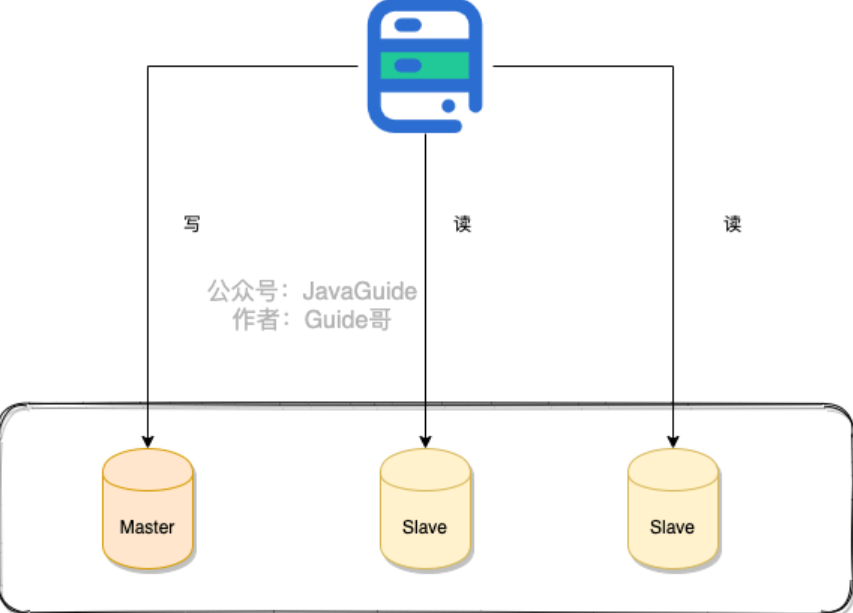

读写分离能提高性能的原因在于:

- 主从服务器负责各自的读和写，极大程度缓解了锁的争用；
- 从服务器可以使用 MyISAM，提升查询性能以及节约系统开销；
- 增加冗余，提高可用性。

读写分离常用代理方式来实现，代理服务器接收应用层传来的读写请求，然后决定转发到哪个服务器。

### how？

如何实现读写分离？

一般的步骤：

1. 部署多台数据库，选择其中的一台作为主数据库，其他一台或多台作为从数据库
2. 保证主数据库和从数据库之间的数据时实时同步的，这个过程也就是主从复制
3. 系统将写请求交给主数据库处理，读请求交给从数据库处理。

落实到项目中，常用方式：

- 代理方式

  在应用和数据之间加一个代理层。应用程序所有的数据请求都交给代理层处理，代理层负责分离读写请求，将它们路由到对应的数据库中。类似的中间件有MySQL Router（官方）、Atlas（基于MySQL Proxy）、MaxScale、MyCat

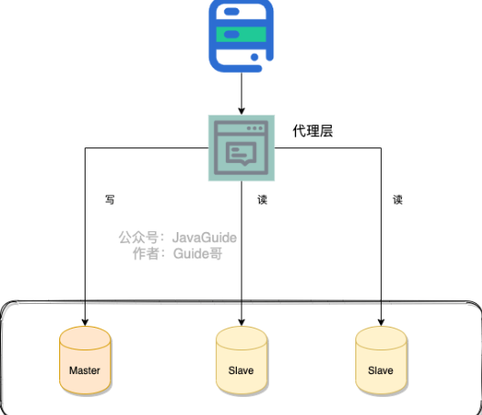

- 组件方式

  通过引入第三方组件来帮助读写请求（推荐）

  如果采用这种方式，推荐使用sharding-jdbc，直接引入jar包即可使用，非常方便，同时节省运维成本。

  https://shardingsphere.apache.org/document/legacy/3.x/document/cn/manual/sharding-jdbc/usage/read-write-splitting/

### 带来的问题？

#### 主从同步延迟

主库和从库的数据存在延迟，比如你写完主库之后，主库的数据同步到从库是需要时间的，这个时间差就导致了主库和从库的数据不一致性问题。

解决方法：

- 强制将读请求路由到主库处理

  比如 `Sharding-JDBC` 就是采用的这种方案。通过使用 Sharding-JDBC 的 `HintManager` 分片键值管理器，我们可以强制使用主库：

  ```java
  HintManager hintManager = HintManager.getInstance();
  hintManager.setMasterRouteOnly();
  // 继续JDBC操作
  ```

  

- 延迟读取

  比如主从同步延迟 0.5s,那我就 1s 之后再读取数据。这样多方便啊！方便是方便，但是也很扯淡。

  但是这样设计业务流程就会好很多：对于一些对数据比较敏感的场景，你可以在完成写请求之后，避免立即进行请求操作。比如你支付成功之后，跳转到一个支付成功的页面，当你点击返回之后才返回自己的账户。

- 更多解决方法：[读写分离有哪些坑？](https://time.geekbang.org/column/article/77636)

## 主从复制

MySQL binlog(binary log 即二进制日志文件) 主要记录了 MySQL 数据库中数据的所有变化(数据库执行的所有 DDL 和 DML 语句)。因此，我们根据主库的 MySQL binlog 日志就能够将主库的数据同步到从库中。

具体过程：

1. 主库将数据库中数据的变化写入到binlog
2. 从库连接主库
3. 从库会创建一个I/O线程向主库请求更新的binlog
4. 主库会创建一个binlog dump写入到relay log，从库中的I/O线程负责接收
5. 从库的I/O线程将接收的binlog 写入到relay log中
6. 从库的SQL线程读取relay log同步数据本地（也就是再执行一遍SQL）

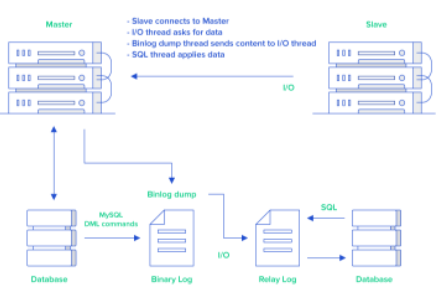

主要涉及三个线程: binlog 线程、I/O 线程和 SQL 线程。

- **binlog 线程** : 负责将主服务器上的数据更改写入二进制日志中。
- **I/O 线程** : 负责从主服务器上读取二进制日志，并写入从服务器的中继日志（relay log）中。
- **SQL 线程** : 负责读取中继日志并重放其中的 SQL 语句。

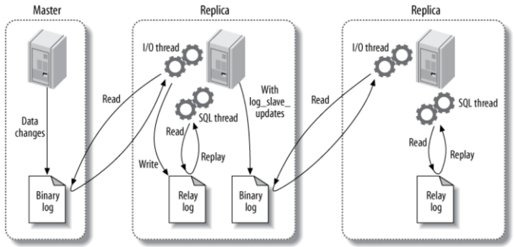

binlog除了主从复制之外，还可以帮助实现数据恢复。

- 扩展

  阿里开源的一个叫做 canal 的工具。这个工具可以帮助我们实现 MySQL 和其他数据源比如 Elasticsearch 或者另外一台 MySQL 数据库之间的数据同步。很显然，这个工具的底层原理肯定也是依赖 binlog。canal 的原理就是模拟 MySQL 主从复制的过程，解析 binlog 将数据同步到其他的数据源。

  另外，像咱们常用的分布式缓存组件 Redis 也是通过主从复制实现的读写分离。

- 总结

  **MySQL 主从复制是依赖于 binlog 。另外，常见的一些同步 MySQL 数据到其他数据源的工具（比如 canal）的底层一般也是依赖 binlog** 

## 分库分表

问：如果MySQL一张表的数据量过大怎么办/如何解决 MySQL 的存储压力呢？

### 何为分库？

分库：就是将数据库中的数据分散到不同的数据库中

以下操作涉及到分库：

- 将数据库中的用户表和用户订单表分别放在不同的数据库
- 由于用户表数据量太大，需要对用户表进行水平切分，然后将切分的2张用户表分别放在不同的数据库

### 何为分表？

**分表** 就是对单表的数据进行拆分，可以是垂直拆分，也可以是水平拆分

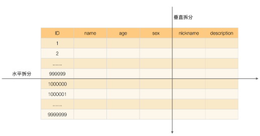

### 什么情况下需要分库分表？

- 单表的数据达到千万级别以上，数据库读写速度比较缓慢（分表）
- 数据库中的数据占用的空间越来越大，备份时间越来越长（分库）
- 应用的并发量太大（分库）

### 带来的问题？

记住，你在公司做的任何技术决策，不光是要考虑这个技术能不能满足我们的要求，是否适合当前业务场景，还要重点考虑其带来的成本

引入分库分表之后，会给系统带来什么挑战呢？

- **join 操作** ： 同一个数据库中的表分布在了不同的数据库中，导致无法使用 join 操作。这样就导致我们需要手动进行数据的封装，比如你在一个数据库中查询到一个数据之后，再根据这个数据去另外一个数据库中找对应的数据。
- **事务问题** ：同一个数据库中的表分布在了不同的数据库中，如果单个操作涉及到多个数据库，那么数据库自带的事务就无法满足我们的要求了。
- **分布式 id** ：分库之后， 数据遍布在不同服务器上的数据库，数据库的自增主键已经没办法满足生成的主键唯一了。我们如何为不同的数据节点生成全局唯一主键呢？这个时候，我们就需要为我们的系统引入分布式 id 了。
- ......

另外，引入分库分表之后，一般需要 DBA 的参与，同时还需要更多的数据库服务器，这些都属于成本。

### 推荐方案

ShardingSphere 项目（包括 Sharding-JDBC、Sharding-Proxy 和 Sharding-Sidecar）是当当捐入 Apache 的，目前主要由京东数科的一些巨佬维护。

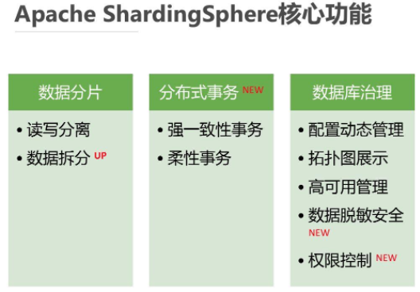

ShardingSphere 绝对可以说是当前分库分表的首选！ShardingSphere 的功能完善，除了支持读写分离和分库分表，还提供分布式事务、数据库治理等功能。

另外，ShardingSphere 的生态体系完善，社区活跃，文档完善，更新和发布比较频繁。

艿艿之前写了一篇分库分表的实战文章，各位朋友可以看看：[《芋道 Spring Boot 分库分表入门》](https://mp.weixin.qq.com/s/A2MYOFT7SP-7kGOon8qJaw)


### 分库分表后，数据怎么迁移？

分库分表之后，我们如何将老库（单库单表）的数据迁移到新库（分库分表后的数据库系统）呢？

- 停机迁移：写个脚本老库的数据写到新库中。比如你在凌晨 2 点，系统使用的人数非常少的时候，挂一个公告说系统要维护升级预计 1 小时。然后，你写一个脚本将老库的数据都同步到新库中。

- 双写方案：针对那种不能停机迁移的场景，实现起来要稍微麻烦一些。具体原理是这样的：

  - 对老库的更新操作（增删改），同时也要写入新库（双写）。如果操作的数据不存在于新库的话，需要插入到新库中。 这样就能保证，咱们新库里的数据是最新的。
  - 在迁移过程，双写只会让被更新操作过的老库中的数据同步到新库，我们还需要自己写脚本将老库中的数据和新库的数据做比对。如果新库中没有，那咱们就把数据插入到新库。如果新库有，旧库没有，就把新库对应的数据删除（冗余数据清理）。
  - 重复上一步的操作，直到老库和新库的数据一致为止

  想要在项目中实施双写还是比较麻烦的，很容易会出现问题。我们可以借助上面提到的数据库同步工具 Canal 做增量数据迁移（还是依赖 binlog，开发和维护成本较低）


### 主从数据库不一致怎么解决？

- 数据库一致性要求不高的业务下，可忽略这个问题
- 强制读主库，使用一个高可用的主库，数据库读写都在主库，添加缓存，提升数据读取的性能
- 选择性读主库，添加一个缓存，用来记录主库的数据，将哪个库，哪个表，哪个主键，作为缓存的key。设置缓存失效时间为主库同步的时间，如果缓存当中有这个数据，直接读取主库，如果缓存中没有这个主键，就到对应的从库中读取。


# 一条 SQL 的执行过程

## 总结

1. 查询缓存
2. 解析生成解析树
3. 预处理再次生成解析树
4. 查询优化器
5. 查询执行计划，执行器调用存储引擎
6. 查询执行引擎
7. 查询数据返回结果

## SQL驱动

在系统和 MySQL 进行交互之前，MySQL 驱动会帮我们建立好连接，然后我们只需要发送 SQL 语句就可以执行 CRUD 了

## 数据库连接池

**数据库连接池**：维护一定的连接数，方便系统获取连接，使用就去池子中获取，用完放回去就可以了，我们不需要关心连接的创建与销毁，也不需要关心线程池是怎么去维护这些连接的。

常见的数据库连接池有 Druid、C3P0、DBCP，连接池实现原理在这里就不深入讨论了，采用连接池大大节省了不断创建与销毁线程的开销，这就是有名的「池化」思想，不管是线程池还是 HTTP 连接池，都能看到它的身影

## 网络连接必须由线程来处理

对计算基础稍微有一点了解的的同学都是知道的，网络中的连接都是由线程来处理的，所谓网络连接说白了就是一次请求，每次请求都会有相应的线程去处理的。也就是说对于 SQL 语句的请求在 MySQL  中是由一个个的线程去处理的。

双方都是通过数据库连接池来管理各个连接的，这样一方面线程之前不需要是争抢连接，更重要的是不需要反复的创建的销毁连接。

## SQL接口

MySQL 中处理请求的线程在获取到请求以后获取 SQL 语句去交给 SQL 接口去处理。

## 查询解析器

将 SQL 接口传递过来的 SQL 语句进行解析，翻译成 MySQL 自己能认识的语言，至于怎么解析的就不需要在深究了，无非是自己一套相关的规则。

## MySQL查询优化器

MySQL  会帮我去使用他自己认为的最好的方式去优化这条  SQL  语句，并生成一条条的执行计划，比如你创建了多个索引，MySQL 会依据成本最小原则来选择使用对应的索引，这里的成本主要包括两个方面, IO 成本和 CPU 成本

**IO 成本**: 即从磁盘把数据加载到内存的成本，默认情况下，读取数据页的 IO 成本是 1，MySQL 是以页的形式读取数据的，即当用到某个数据时，并不会只读取这个数据，而会把这个数据相邻的数据也一起读到内存中，这就是有名的程序局部性原理，所以 MySQL 每次会读取一整页，一页的成本就是 1。所以 IO 的成本主要和页的大小有关

**CPU 成本**：将数据读入内存后，还要检测数据是否满足条件和排序等 CPU 操作的成本，显然它与行数有关，默认情况下，检测记录的成本是 0.2。

MySQL 优化器 会计算 「IO 成本 + CPU」 成本最小的那个索引来执行

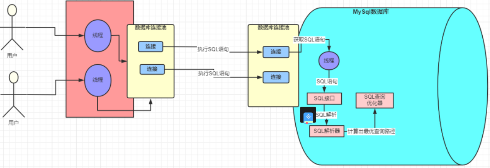

优化器执行选出最优索引等步骤后，会去调用存储引擎接口，开始去执行被 MySQL 解析过和优化过的 SQL 语句

## 存储引擎

查询优化器会调用存储引擎的接口，去执行 SQL，也就是说**真正执行 SQL 的动作是在存储引擎中完成的**。**数据是被存放在内存或者是磁盘中的**

## 执行器

执行器是一个非常重要的组件，因为前面那些组件的操作最终必须通过执行器去调用存储引擎接口才能被执行。执行器最终最根据一系列的执行计划去调用存储引擎的接口去完成 SQL 的执行

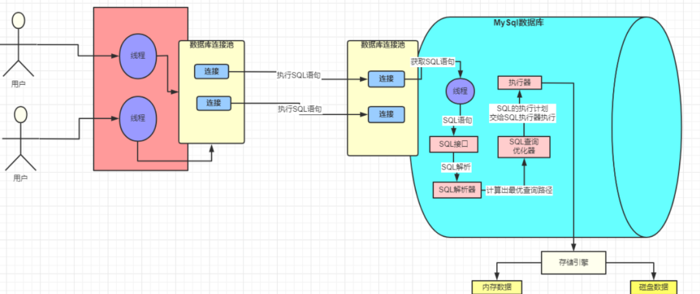

当我们系统发出这样的查询去交给 MySQL 的时候，MySQL 会按照我们上面介绍的一系列的流程最终通过执行器调用存储引擎去执行，流程图就是上面那个。在执行这个 SQL 的时候 SQL 语句对应的数据要么是在内存中，要么是在磁盘中，如果直接在磁盘中操作，那这样的随机IO读写的速度肯定让人无法接受的，所以每次在执行 SQL 的时候都会将其数据加载到内存中，这块内存就是 InnoDB 中一个非常重要的组件：**缓冲池 Buffer Pool**

## Buffer Pool

Buffer Pool （缓冲池）是 InnoDB 存储引擎中非常重要的内存结构，顾名思义，缓冲池其实就是类似  Redis  一样的作用，起到一个缓存的作用，因为我们都知道 MySQL 的数据最终是存储在磁盘中的，如果没有这个 Buffer Pool  那么我们每次的数据库请求都会磁盘中查找，这样必然会存在 IO 操作，这肯定是无法接受的。但是有了 Buffer Pool 就是我们第一次在查询的时候会将查询的结果存到  Buffer Pool 中，这样后面再有请求的时候就会先从缓冲池中去查询，如果没有再去磁盘中查找，然后在放到  Buffer Pool 中，如下图

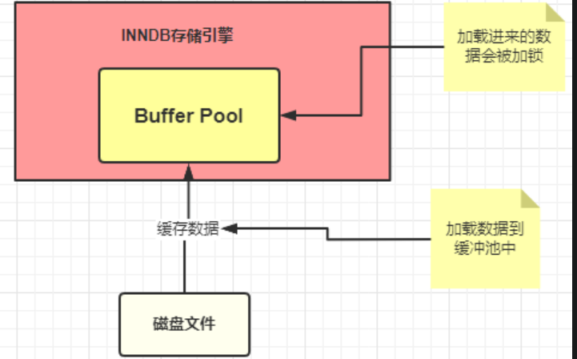

照上面的那幅图，这条 SQL 语句的执行步骤大致是这样子的

- innodb 存储引擎会在缓冲池中查找 id=1 的这条数据是否存在
- 发现不存在，那么就会去磁盘中加载，并将其存放在缓冲池中
- 该条记录会被加上一个独占锁（总不能你在修改的时候别人也在修改吧，这个机制本篇文章不重点介绍，以后会专门写文章来详细讲解）

### undo log：记录数据被修改前的样子

我们刚刚已经说了，在准备更新一条语句的时候，该条语句已经被加载到 Buffer pool 中了，实际上这里还有这样的操作，就是在将该条语句加载到 Buffer Pool 中的时候同时会往 undo 日志文件中插入一条日志，也就是将 id=1 的这条记录的原来的值记录下来。

**这样做的目的是什么**？

Innodb 存储引擎的最大特点就是支持事务，如果本次更新失败，也就是事务提交失败，那么该事务中的所有的操作都必须回滚到执行前的样子，也就是说当事务失败的时候，也不会对原始数据有影响，看图说话

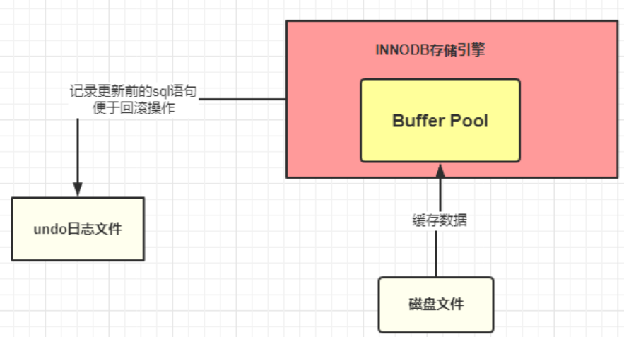

这里说句额外话，其实 MySQL  也是一个系统，就好比我们平时开发的 java 的功能系统一样，MySQL  使用的是自己相应的语言开发出来的一套系统而已，它根据自己需要的功能去设计对应的功能，它即然能做到哪些事情，那么必然是设计者们当初这么定义或者是根据实际的场景变更演化而来的。所以大家放平心态，把 MySQL 当作一个系统去了解熟悉他。

到这一步，我们的执行的 SQL 语句已经被加载到 Buffer Pool 中了，然后开始更新这条语句，更新的操作实际是在Buffer Pool中执行的，那问题来了，按照我们平时开发的一套理论缓冲池中的数据和数据库中的数据不一致时候，我们就认为缓存中的数据是脏数据，那此时 Buffer Pool 中的数据岂不是成了脏数据？没错，目前这条数据就是脏数据，Buffer Pool 中的记录是小强 数据库中的记录是旺财 ，这种情况 MySQL是怎么处理的呢，继续往下看：

### redo log：记录数据被修改后的样子

除了从磁盘中加载文件和将操作前的记录保存到 undo 日志文件中，其他的操作是在内存中完成的，内存中的数据的特点就是：断电丢失。如果此时 MySQL 所在的服务器宕机了，那么 Buffer Pool 中的数据会全部丢失的。这个时候 redo 日志文件就需要来大显神通了

**画外音：redo 日志文件是 InnoDB 特有的，他是存储引擎级别的，不是 MySQL 级别的**

redo 记录的是数据修改之后的值，不管事务是否提交都会记录下来，例如，此时将要做的是update students set stuName='小强' where id=1; 那么这条操作就会被记录到 redo log buffer 中，啥？怎么又出来一个 redo log buffer ,很简单，MySQL 为了提高效率，所以将这些操作都先放在内存中去完成，然后会在某个时机将其持久化到磁盘中。

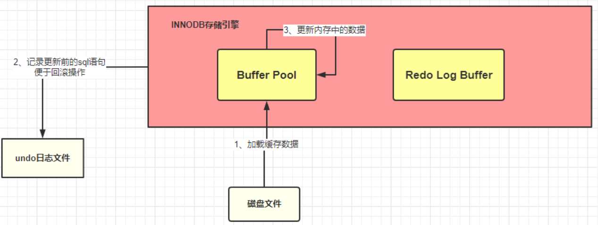

截至目前，我们应该都熟悉了 MySQL 的执行器调用存储引擎是怎么将一条 SQL 加载到缓冲池和记录哪些日志的，流程如下：

- 准备更新一条 SQL 语句
- MySQL（innodb）会先去缓冲池（BufferPool）中去查找这条数据，没找到就会去磁盘中查找，如果查找到就会将这条数据加载到缓冲池（BufferPool）中
- 在加载到 Buffer Pool 的同时，会将这条数据的原始记录保存到 undo 日志文件中
- innodb 会在 Buffer Pool 中执行更新操作
- 更新后的数据会记录在 redo log buffer 中

上面说的步骤都是在正常情况下的操作，但是程序的设计和优化并不仅是为了这些正常情况而去做的，也是为了**那些临界区和极端情况下出现的问题去优化**设计的

这个时候如果服务器宕机了，那么缓存中的数据还是丢失了。真烦，竟然数据总是丢失，那能不能不要放在内存中，直接保存到磁盘呢？很显然不行，因为在上面也已经介绍了，在内存中的操作目的是为了提高效率。

此时，如果 MySQL 真的宕机了，那么没关系的，因为 MySQL 会认为本次事务是失败的，所以数据依旧是更新前的样子，并不会有任何的影响。

好了，语句也更新好了那么需要将更新的值提交啊，也就是需要提交本次的事务了，因为只要事务成功提交了，才会将最后的变更保存到数据库，在提交事务前仍然会具有相关的其他操作

将  redo Log Buffer 中的数据持久化到磁盘中，就是将 redo log buffer 中的数据写入到 redo log 磁盘文件中，一般情况下，redo log Buffer 数据写入磁盘的策略是立即刷入磁盘（具体策略情况在下面小总结出会详细介绍）,上图

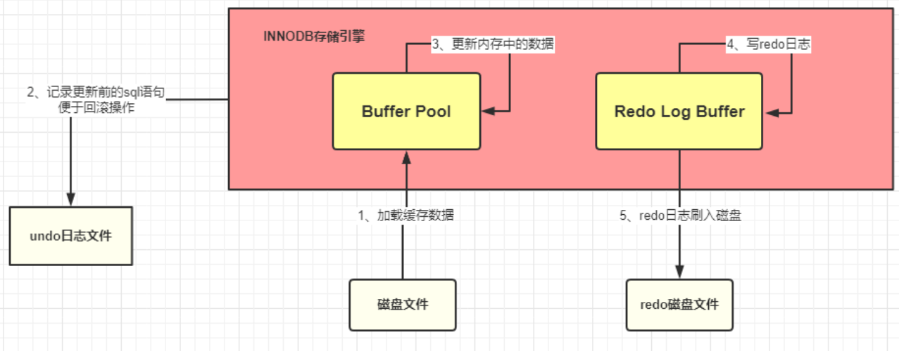

如果 redo log Buffer 刷入磁盘后，数据库服务器宕机了，那我们更新的数据怎么办？此时数据是在内存中，数据岂不是丢失了？不，这次数据就不会丢失了，因为 redo log buffer 中的数据已经被写入到磁盘了，已经被持久化了，就算数据库宕机了，在下次重启的时候 MySQL 也会将 redo 日志文件内容恢复到 Buffer Pool 中（这边我的理解是和 Redis 的持久化机制是差不多的，在 Redis 启动的时候会检查 rdb 或者是 aof 或者是两者都检查，根据持久化的文件来将数据恢复到内存中）

到此为止，**从执行器开始调用存储引擎接口做了哪些事情呢**？

- 准备更新一条 SQL 语句
- MySQL（innodb）会先去缓冲池（BufferPool）中去查找这条数据，没找到就会去磁盘中查找，如果查找到就会将这条数据加载到缓冲池（BufferPool）中
- 在加载到 Buffer Pool 的同时，会将这条数据的原始记录保存到 undo 日志文件中
- innodb 会在 Buffer Pool 中执行更新操作
- 更新后的数据会记录在 redo log buffer 中
- MySQL 提交事务的时候，会将 redo log buffer 中的数据写入到 redo 日志文件中 刷磁盘可以通过 innodb_flush_log_at_trx_commit 参数来设置
  - 值为 0 表示不刷入磁盘
  - 值为 1 表示立即刷入磁盘
  - 值为 2 表示先刷到 os cache
- myslq 重启的时候会将 redo 日志恢复到缓冲池中

截止到目前位置，MySQL  的执行器调用存储引擎的接口去执行【执行计划】提供的 SQL 的时候 InnoDB 做了哪些事情也就基本差不多了，但是这还没完。下面还需要介绍下 MySQL 级别的日志文件 bin log

### bin log 日志文件：记录整个操作过程

上面介绍到的redo log是  InnoDB  存储引擎特有的日志文件，而bin log属于是  MySQL  级别的日志。redo log记录的东西是偏向于物理性质的，如：“对什么数据，做了什么修改”。bin log是偏向于逻辑性质的，类似于：“对 students 表中的 id 为 1 的记录做了更新操作” 两者的主要特点总结如下:

| 性质     | redo Log                                                     | bin Log                                                      |
| -------- | ------------------------------------------------------------ | ------------------------------------------------------------ |
| 文件大小 | redo log 的大小是固定的（配置中也可以设置，一般默认的就足够了） | bin log 可通过配置参数max_bin log_size设置每个bin log文件的大小（但是一般不建议修改）。 |
| 实现方式 | redo log是InnoDB引擎层实现的（也就是说是 Innodb 存储引起过独有的） | bin log是 MySQL 层实现的，所有引擎都可以使用 bin log日志     |
| 记录方式 | redo log 采用循环写的方式记录，当写到结尾时，会回到开头循环写日志。 | bin log 通过追加的方式记录，当文件大小大于给定值后，后续的日志会记录到新的文件上 |
| 使用场景 | **redo log适用于崩溃恢复(crash-safe)**（这一点其实非常类似与 Redis 的持久化特征） | **bin log 适用于主从复制和数据恢复**                         |

**bin log文件是如何刷入磁盘的**?

bin log 的刷盘是有相关的策略的，策略可以通过sync_bin log来修改，默认为 0，表示先写入 os cache，也就是说在提交事务的时候，数据不会直接到磁盘中，这样如果宕机bin log数据仍然会丢失。所以建议将sync_bin log设置为 1 表示直接将数据写入到磁盘文件中。

刷入 bin log 有以下几种模式

- **STATMENT**

基于 SQL 语句的复制(statement-based replication, SBR)，每一条会修改数据的 SQL 语句会记录到 bin log 中

【优点】：不需要记录每一行的变化，减少了 bin log 日志量，节约了 IO , 从而提高了性能

【缺点】：在某些情况下会导致主从数据不一致，比如执行sysdate()、sleep()等

- **ROW**

基于行的复制(row-based replication, RBR)，不记录每条SQL语句的上下文信息，仅需记录哪条数据被修改了

【优点】：不会出现某些特定情况下的存储过程、或 function、或 trigger 的调用和触发无法被正确复制的问题

【缺点】：会产生大量的日志，尤其是 alter table 的时候会让日志暴涨

- **MIXED**

基于 STATMENT 和 ROW 两种模式的混合复制( mixed-based replication, MBR )，一般的复制使用 STATEMENT 模式保存 bin log ，对于 STATEMENT 模式无法复制的操作使用 ROW 模式保存 bin log

那既然bin log也是日志文件，那它是在什么记录数据的呢？

其实 MySQL 在提交事务的时候，不仅仅会将 redo log buffer 中的数据写入到redo log 文件中，同时也会将本次修改的数据记录到 bin log文件中，同时会将本次修改的bin log文件名和修改的内容在bin log中的位置记录到redo log中，最后还会在redo log最后写入 commit 标记，这样就表示本次事务被成功的提交了。

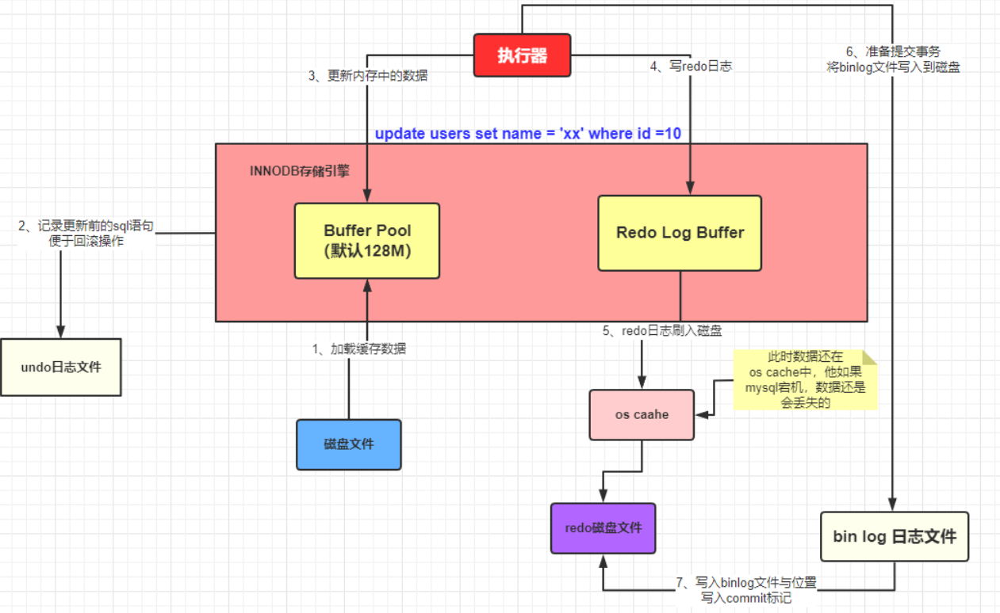

如果在数据被写入到bin log文件的时候，刚写完，数据库宕机了，数据会丢失吗？

首先可以确定的是，只要redo log最后没有 commit 标记，说明本次的事务一定是失败的。但是数据是没有丢失了，因为已经被记录到redo log的磁盘文件中了。在 MySQL 重启的时候，就会将 redo log 中的数据恢复（加载）到Buffer Pool中。

好了，到目前为止，一个更新操作我们基本介绍得差不多，但是你有没有感觉少了哪件事情还没有做？是不是你也发现这个时候被更新记录仅仅是在内存中执行的，哪怕是宕机又恢复了也仅仅是将更新后的记录加载到Buffer Pool中，这个时候 MySQL 数据库中的这条记录依旧是旧值，也就是说内存中的数据在我们看来依旧是脏数据，那这个时候怎么办呢？

其实 MySQL 会有一个后台线程，它会在某个时机将我们Buffer Pool中的脏数据刷到 MySQL 数据库中，这样就将内存和数据库的数据保持统一了。

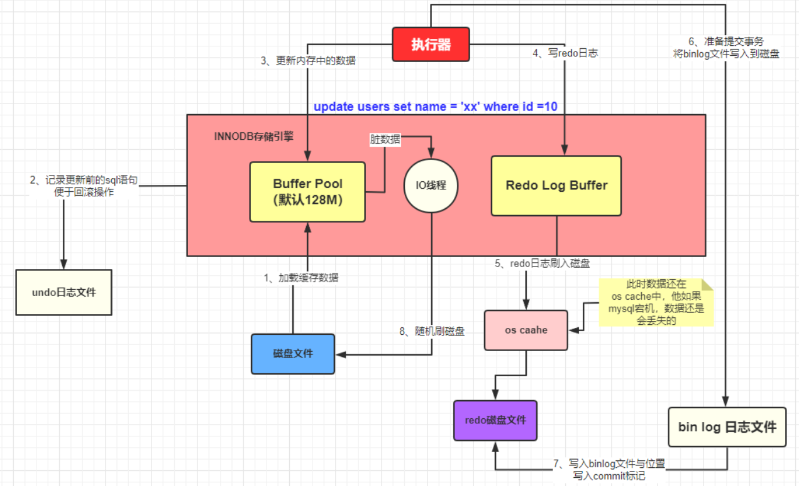

## 总结

到此，关于Buffer Pool、Redo Log Buffer 和undo log、redo log、bin log 概念以及关系就基本差不多了。

我们再回顾下

- **Buffer Pool 是 MySQL 的一个非常重要的组件，因为针对数据库的增删改操作都是在 Buffer Pool 中完成的**
- Undo log 记录的是数据操作前的样子
- redo log 记录的是数据被操作后的样子（redo log 是 Innodb 存储引擎特有）
- bin log 记录的是整个操作记录（这个对于主从复制具有非常重要的意义）

从准备更新一条数据到事务的提交的流程描述

- 首先执行器根据 MySQL 的执行计划来查询数据，先是从缓存池中查询数据，如果没有就会去数据库中查询，如果查询到了就将其放到缓存池中
- 在数据被缓存到缓存池的同时，会写入 undo log 日志文件
- 更新的动作是在 BufferPool 中完成的，同时会将更新后的数据添加到 redo log buffer 中
- 完成以后就可以提交事务，在提交的同时会做以下三件事
  - 将redo log buffer中的数据刷入到 redo log 文件中
  - 将本次操作记录写入到 bin log文件中
  - 将 bin log 文件名字和更新内容在 bin log 中的位置记录到redo log中，同时在 redo log 最后添加 commit 标记

至此表示整个更新事务已经完成

两阶段提交（解决redo log和bin log因为写入时机不同而导致的数据不一致情况）:

redo log（重做日志）让InnoDB存储引擎拥有了崩溃恢复能力。

binlog（归档日志）保证了MySQL集群架构的数据一致性。

虽然它们都属于持久化的保证，但是侧重点不同

在执行更新语句过程，会记录redo log与binlog两块日志，以基本的事务为单位，redo log在事务执行过程中可以不断写入，而binlog只有在提交事务时才写入，所以redo log与binlog的写入时机不一样

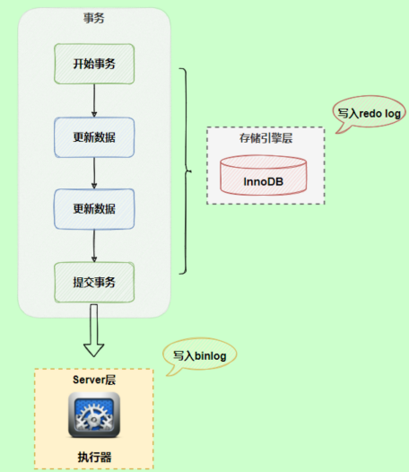

redo log与binlog两份日志之间的逻辑不一致，会出现什么问题？为了解决两份日志之间的逻辑一致问题，InnoDB存储引擎使用两阶段提交方案

原理很简单，将redo log的写入拆成了两个步骤prepare和commit，这就是两阶段提交

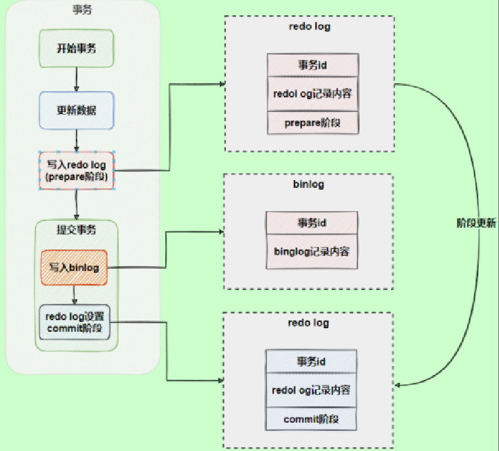

使用两阶段提交后，写入binlog时发生异常也不会有影响，因为MySQL根据redo log日志恢复数据时，发现redo log还处于prepare阶段，并且没有对应binlog日志，就会回滚该事务。

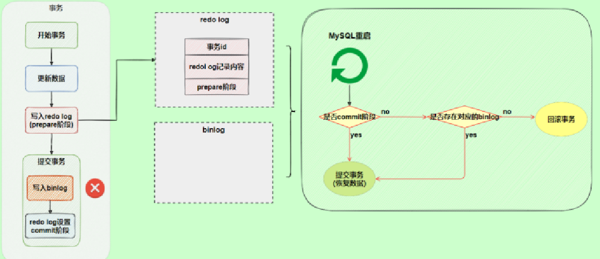

redo log为commit阶段就必定存在对应的bin log，如果存在事务的bin log而不存在commmit阶段的redo log依旧写入

再看一个场景，redo log设置commit阶段发生异常，那会不会回滚事务呢？

并不会回滚事务，它会执行上图框住的逻辑，虽然redo log是处于prepare阶段，但是能通过事务id找到对应的binlog日志，所以MySQL认为是完整的，就会提交事务恢复数据


# 场景题

## MySQL数据库作发布系统的存储，一天五万条以上增量，预计运维三年，怎么优化？

- 数据库结构
  - 设计良好的数据库结构，允许部分数据冗余，尽量避免join查询，提高效率
  - 选择合适的表字段数据结构和存储引擎，适当的添加索引
- 高性能
  - 主从读写分离
  - 分表，减少单表中的数据量提高查询速度
  - 添加缓存机制，如memcached，apc等
- 不经常改动的页面，生成静态页面
- 书写高效率的SQL，如SELECT指定的字段

在一个事务中，代码业务流程很长，会出现什么问题？为什么会出现这种问题？

可能出现事务超时

@Transaction(timeout=60)，如果用这个注解描述一个方法的话，线程已经跑到方法里面，如果已经过去60s了还没跑完这个方法，且线程在这个方法的后面还涉及到对数据库的增删改查操作时会报事务超时错误（会会回滚）。如果已经过去60s了还没有跑完但是后面已经没有涉及到对数据库的增删改查操作，那么这时不会报事务超时错误（不会回滚）

# 刷题笔记

## 基础概念

DBS(数据库系统)=DS(数据库)+DBMS(数据库管理系统)

DML（Data Manipulation Language）：是select、update、insert、delete，对数据库里的数据进行操作的语言

DDL（Data Definition Language）：DDL比DML多，主要命令有create、alter、drop，用在定义或改变表的结构、数据类型、表之间的链接和约束等初始化工作上，大多数在建立表时使用

DCL（Data Control Language）：数据库控制功能，用来设置或更改数据库用户或角色权限的语句，包括（grant授予权限、deny、revoke收回权限等）语句。在默认状态下，只有sysadmin,dbcreator,db_owner或db_securityadmin等人员才有权力执行DCL:

grant [权限] on [table] to 'username'@'localhost';

------

1) 实体完整性：规定表的每一行在表中是惟一的实体。（行）
2) 域完整性：是指表中的列必须满足某种特定的数据类型约束，其中约束又包括取值范围、精度等规定。（列）
3) 参照完整性：是指两个表的主关键字和外关键字的数据应一致，保证了表之间的数据的一致性，防止了数据丢失或无意义的数据在数据库中扩散。（表之间）
4) 用户定义的完整性：不同的关系数据库系统根据其应用环境的不同，往往还需要一些特殊的约束条件。用户定义的完整性即是针对某个特定关系数据库的约束条件，它反映某一具体应用必须满足的语义要求。（系统）

------

数据库系统中,最小的存取单位是记录。 

表是由**字段和记录**组成的

------

模式与**内模式**的映射 保证数据库物理结构的独立性

模式与**外模式**的映射 保证数据库逻辑结构的独立性

------

关系代数运算中的基本运算包括并(∪)、差(-)、广义笛卡尔积(×)、投影(π)和选择(σ)，其他运算的功能都可以由这五种基本运算来实现。

## 语法

1.删除表中的数据以及定义(出手最狠)

drop table Student；

2.删除表中数据，定义还在(比较温柔)

truncate table Student；

3.删除表中**所有数据**，但是删的比较低效(温柔型)

delete table Student；(系统一行一行删，保留日志，可以rollback)

------

union all和union的区别（https://blog.csdn.net/u010931123/article/details/82425580）：

union会自动压缩多个结果集中重复结果

union all将所有的结果全部显示出来，不管是否重复

Union：对两结果集进行并集操作，不包括重复行，同时进行默认规则的排序

Union All：对两结果集进行并集操作，包括重复行，不进行排序；

eg：

------

Group by 列名与聚合函数使用：https://blog.csdn.net/shaofei63/article/details/42800793?utm_medium=distribute.pc_feed_404.none-task-blog-BlogCommendFromMachineLearnPai2-1.nonecase

.....Group by c1,c2;

------

元组（tuple）：关系数据库中的基本概念，关系是一张表，表中的每行是一个元组（二维表），每列是一个属性。

二维表：必须通过行列两个条件去定位；


一维表：仅需通过单行就能确定数值；


------

**any、all、some** 用法 （https://github.com/astak16/blog-mysql/issues/19）：

`any` 、 `all` 、 `some` 是子查询关键词之一，必须与一个比较操作符进行一起使用。

- `any` 和子查询返回的列中 **任一值** 比较为 `true` 则返回为 `true` 。
- `all` 和子查询返回的列中 **所有值** 比较为 `true` 则返回为 `true` 。
- `some` 的用法和 `any` 一样，在 `!=` 的场景中，用 `any` 容易产生误解，用 `some` 更容易理解

------

JOIN中on与where的区别（https://www.runoob.com/w3cnote/sql-join-the-different-of-on-and-where.html）：

- **left join** : 左连接，返回左表中所有的记录以及右表中连接字段相等的记录。
- **right join** : 右连接，返回右表中所有的记录以及左表中连接字段相等的记录。
- **inner join** : 内连接，又叫等值连接，只返回两个表中连接字段相等的行。
- **full join** : 外连接，返回两个表中的行：left join + right join。
- **cross join** : 结果是笛卡尔积，就是第一个表的行数乘以第二个表的行数。

关键字 on：

数据库在通过连接两张或多张表来返回记录时，都会生成一张中间的临时表，然后再将这张临时表返回给用户。

在使用 **left jion** 时，**on** 和 **where** 条件的区别如下：

- **on** 条件是在生成临时表时使用的条件，它不管 **on** 中的条件是否为真，都会返回左边表中的记录。
- **where** 条件是在临时表生成好后，再对临时表进行过滤的条件。这时已经没有 **left join** 的含义（必须返回左边表的记录）了，条件不为真的就全部过滤掉。

------

多表查询：一张表作为两张表来查（https://blog.csdn.net/wsdfym/article/details/90743625）：

1.子查询:

​		select id,grade from class where id in（select id from class where name="刘__"）;

2.自联结

一张表假设为 两张一样的表，分别对两张表（一样的两张表）进行联结得到笛卡儿积，再对笛卡尔积中的结果根据where进行过滤。**许多dbms处理联结远比处理子查询快的多**


```sql
select t1.player_id,t1.event_date 
from Activity t1,Activity t2 
where t1.player_id=t2.player_id
```


------

范式：

第一范式（1NF）：数据表必须是二维数据表，**列都是不可分割**，不满足第一范式（1NF）的数据库就不是关系数据库.

第二范式（2NF）：建立在第一范式的基础上，**每个表只描述一件事情**，第二范式要求数据表每一个行必须被唯一标识。除满足第一范式外还有两个条件，一是表必须有一个主键；二是没有包含在主键中的列必须完全依赖于主键，而不能只依赖于主键的一部分

第三范式（3NF ）：**非主键列之间不可以有依赖关系**（**非关键字段对主键唯一依赖，非关键字段间是相互独立的。**）。表中的列不存在对非主键列的传递依赖。除了主键订单编 号外，顾客姓名依赖于非主键顾客编号。即不能存在：非主键列 A 依赖于非主键列 B，非主键列 B 依赖于主键的情况。

------

数据库恢复的实现中可定期对整个数据库进行复制或转储，转储是数据库恢复中常用的基本技术，它是指DBA把数据库复制到另一个磁盘上的过程，可分为静态转储和动态转储；转储还可以分为海量存储和增量转储。转储的冗余数据包通常包括**日志文件**、**数据库后备副本**等。

------

Drop是删除表结构和数据
delete和truncate是删除表数据，但是delete会将数据redo和undo到表空间中，以便进行rollback操作。

------

任何时候加索引吗？反例：

1.每次都需要获取所有的表记录，任何时候都要进行全表扫描

2.非唯一字段，如“性别”中存在大量重复值的字段，没有加索引的必要

3.记录比较少的表，增加索引不会带来速度的优化反而会浪费存储空间（索引存储需要空间）

4.大表中，经常需要进行update、insert、delete操作的，字段索引都必须重新计算更新，拖慢速度

------

候选码（Candidatekey）：若关系中的某一属性组的值能唯一地标识一个元组，则称该属性组为候选码。
简单的情况：候选码只包含一个属性，称为主属性。就是数据库中，主键和复合主键的区别！ 主键：单独一个字段就能唯一标识一行数据； 复合主键：也称为联合主键，指多个字段组合在一起能唯一标识一行数据；

------

主键是一种约束，唯一索引是一种索引，两者在本质上是不同的。 主键创建后一定包含一个唯一性索引，唯一性索引并不一定就是主键。 唯一性索引列允许空值，而主键列不允许为空值。 主键列在创建时，已经默认为空值 + 唯一索引了。 主键可以被其他表引用为外键，而唯一索引不能。 一个表最多只能创建一个主键，但可以创建多个唯一索引。 主键更适合那些不容易更改的唯一标识，如自动递增列、身份证号等。 在 RBO 模式下，主键的执行计划优先级要高于唯一索引。 两者可以提高查询的速度。

------

视图是从一个或几个基本表（或视图）导出的表。它与基本表不同，是一个虚表。数据库只存放视图的**定义**，而不存放视图对应的数据，这些数据仍存放在原来的基本表中。


## LeetCode

group by 列名：按列名分组

min(列名)  max(列名)

select class，min（age） as min_age from table1 group by class;得到每个班级的最小年龄

窗口函数 over()：

https://www.nowcoder.com/test/question/done?tid=54201135&qid=2222878#summary


datediff(date1，date2)，返回两日期之差，可以加限制条件如datediff（）=1，得到两日期之差等于1的数据


SELECT ROUND(column_name,decimals) FROM table_name

Round（column_name,decimals）:函数用于把数值字段舍入为指定的小数位数。

| column_name | 必需。要舍入的字段。       |
| ----------- | -------------------------- |
| decimals    | 必需。规定要返回的小数位数 |


# 扩展阅读

 存储过程(stored procedure)https://www.cnblogs.com/zhoufangcheng04050227/p/8028566.html

​															；