# 数据结构与算法


# 刷题笔记

- java集合类导入java.util.*;


LinkedList和ListNode的区别
LinkedList有个getFirst和getLast和get(int Index)方法（遍历获取节点）
ListNode我们可以获取指定元素，例如我们可以通过map保存ListNode，并且get指定的ListNode后直接定位到ListNode的位置，不需要遍历ListNode（就是get index和get 指针的区别）


- 运用栈(后进先出)：


Deque<Integer> stack=new LinkedList<Integer>();和Stack<Integer> stack=new Stack<Integer>()一样，但是推荐用LinkedList

空：isEmpty()

压入：stack.push()

查看栈顶元素：stack.peek()

弹出栈顶元素：stack.pop()


- 字符串变为数字，如“0010.12.13.0”变为10、12、13、0


```java
int i=0;
int len=s.length();
while(i<len){
    int x=0;
    for(;i<len && s.charAt(i)!='.';i++){
        x=x*10+s.charAt(i)-'0';
    }
    System.out.println(x);
}
```


- 用两个栈实现队列

用两个栈实现一个队列，完成队列的Push和Pop操作

队列：FIFO，先进先出；一端插入，另一端删除

栈：FILO，先进后出；同一端插入和删除

```java
class Queue{
    // in栈负责处理Push操作，out栈负责pop操作
    Stack<Integer> in=new Stack<Integer>();
    Stack<Integer> out=new Stack<Integer>();
    
    public void push(int node){
        in.push(node);
    }
    
    public int pop(){
        if(out.isEmpty()){
            while(!in.isEmpty()){
                out.push(in.pop());
            }
            if(out.isEmpty()){
                throw new Exception("queue is empty");
            }
        }else{
            return out.pop();
        }
    }
}
```


# ACM模式的输入处理

https://blog.csdn.net/fisherish/article/details/120402338

自己处理输入输出，而且最好用bufferedReader，用scanner数据量大了会超市，老变态了

# 解题思路

## 1.数据范围

依据数据范围确定时间复杂度

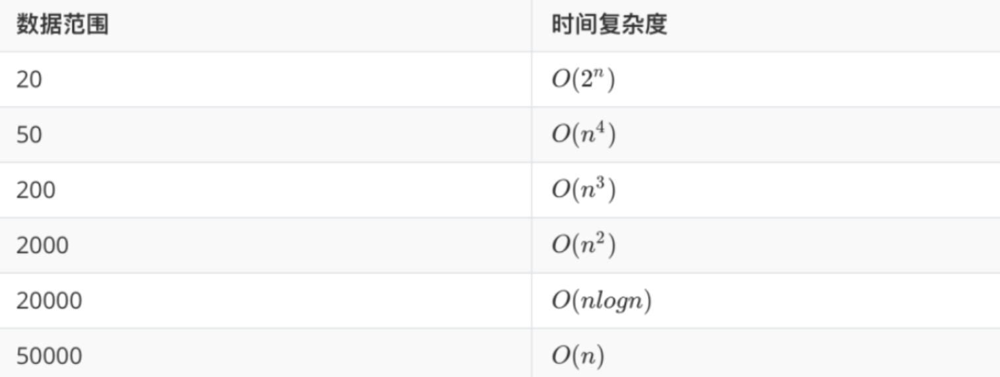

依据算法的时间复杂度确定算法

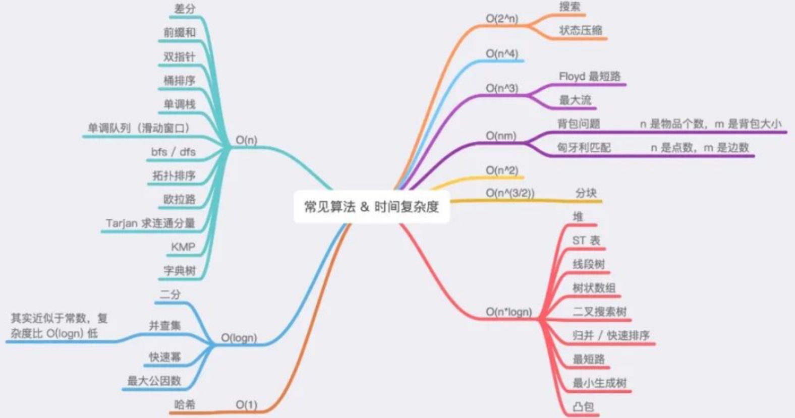

注意：

1. 上图仅列出了时间复杂度较为固定的常见算法，而类似于动态规划、贪心、暴力等时间复杂度百变多样的算法并未列出。
2. O(logn) 的算法通常与 O(n)的算法组合在一起，用于实现 O(nlogn)要求的题目。
3. 对于没有数据范围的题目，我们通常需要自行从小到大枚举数据范围，一般从 O(n)O(n) 开始枚举，并且大部分的题枚举到 O(nlogn)O(nlogn) 时就能找到合适的算法。
4. 「数据范围」=> 「最终算法」的总体过程
5. 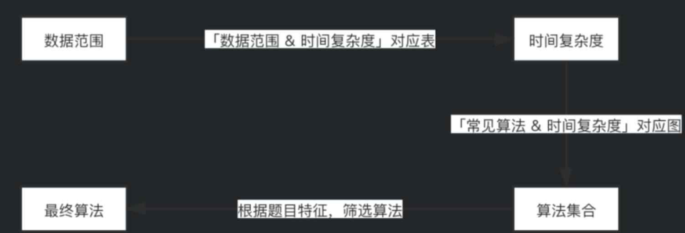

### 1.数组：

 O(n)范围内关于数组的算法：

- > 差分、前缀和、双指针、桶排序、单调栈、单调队列

1.前缀和：连续子数组：暴力枚举复杂度n^2，优化枚举可以用前缀和（也就是子数组之间的差,注意是从左往右递增）

https://leetcode-cn.com/problems/count-number-of-nice-subarrays/solution/de-liao-wo-ba-qian-zhui-he-gei-ba-de-gan-ymzz/

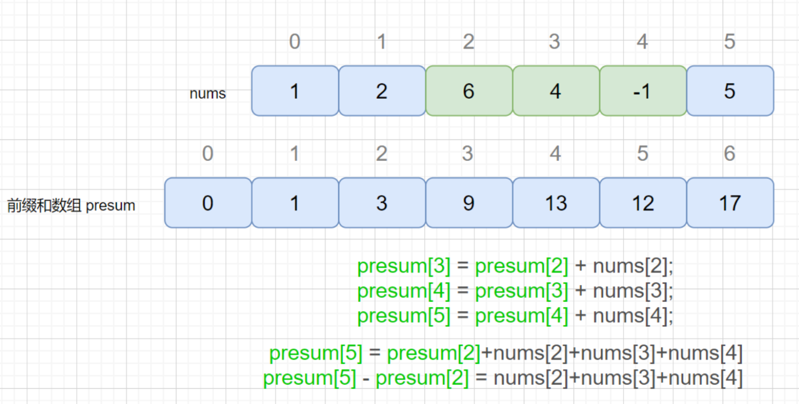

数组解题TIP:

两下标对应数组之和之差可以通过移项简化等式

**数组的动态规划差不多有三种，一种是斐波那契数列，一种是根据动态方程画二维数组，一种是从左到右递归的过程中（一次递归）不断更新最大值或最小值（121.买卖股票最佳时机）。**

### 2.字符串

字符串其实就是数组，可以用数组的思想解决；

#### 1.回文串

找回文串：动态规划、中心扩散法

##### 1）动态规划:

状态转移方程：P（i，j）=P（i+1，j-1）^（Si==Sj）

边界条件：子串长度为1或2

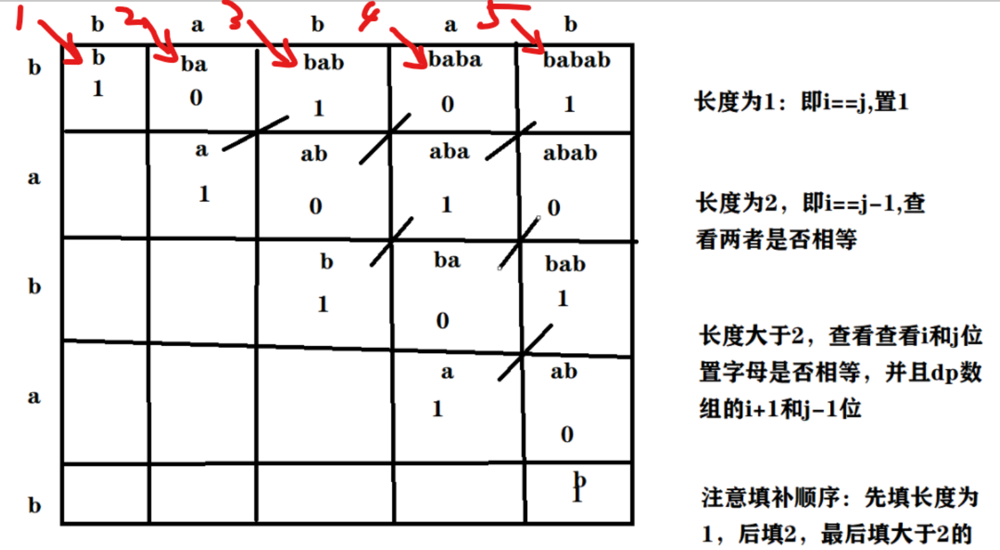

对角线开始填，共填5轮


##### 2）中心扩散法：

「边界情况」对应的子串实际上就是我们「扩展」出的回文串的「回文中心」。

本质即为：我们枚举所有的「回文中心」并尝试「扩展」，直到无法扩展为止，此时的回文串长度即为此「回文中心」下的最长回文串长度。我们对所有的长度求出最大值，即可得到最终的答案


### 3.动态规划

因为该值的结果取决于前面的结果

1.斐波那契数列；

2.根据动态方程画二维数组（或一维数组，如斐波那契数列，二维多见于字符串如回文字符串），二维记得找到遍历规律，可能按对角线（回文串），可能按一行一行来；

3.从左到右递归的过程中（一次递归）不断更新最大值或最小值（121.买卖股票最佳时机），即边遍历边维护

### 4.查找类问题

- 二叉树、二维数组：dfs、bfs

  - dfs：前中后序遍历（递归）、运用栈

  - 栈：

    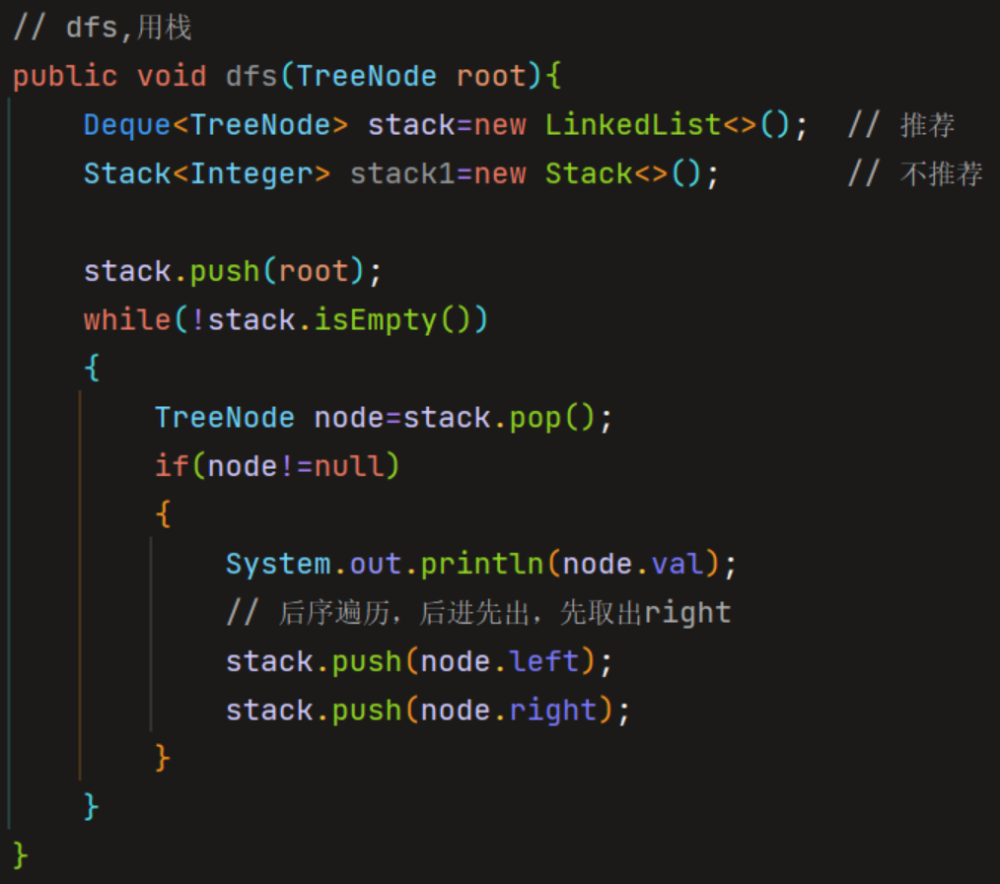

  - bfs：层次遍历；左结点排在右结点之前，这样，我们对每一层都从左到右访问

- 数组：回溯、二分查找（排序）

  

# 常见面试题总结

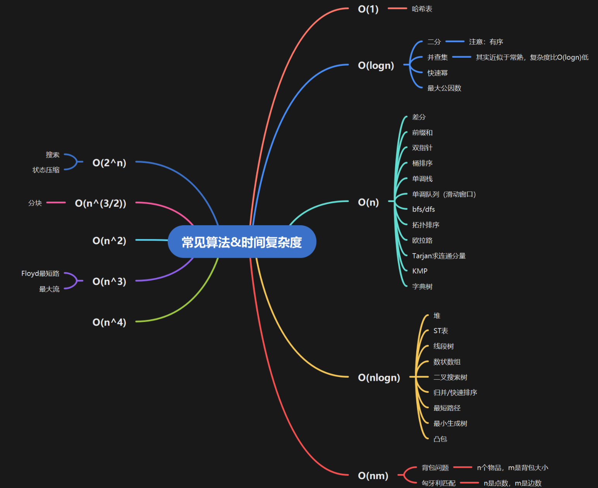

## 矩阵

- 顺时针打印矩阵

```java
public List<Integer> printMatrix(int[][] matrix){
    List<Integer> list=new ArrayList<>();
    int r1=0,r2=matrix.length-1,c1=0,c2=matrix[0].length-1;
    while(r1<=r2 && c1<=c2){
         for(int i=c1;i<=c2;i++){
             list.add(matrix[r1][i]);
         }
         for(int i=r1+1;i<=r2;i++){
             list.add(matrix[i][c2]);
         }
         // 只有一行的情况不用以下操作：
         if(r1!=r2){
             for(int i=c2-1;i>=c1;i--){
                 list.add(matrix[r2][i]);
             }
         }
         // 只有一列的情况不用以下操作：
         if(!c1=c2){
             for(int i=r2-1;i>r1;i++){
                 list.add(matrix[r2][c1]);
             }
         }
         r1++;
         r2--;
         c1++;
         c2--;
    }
    return list;
}
```


## 哈希表

### 哈希表的常用数据结构

- 哈希集合（Set）
- 哈希映射（Map）

基于 Set 和 Map 的查找，且常作为双指针、搜索、贪心、动态规划和数据结构等问题的必要求解步骤。

若分析题意，满足以下两种情形其一：

- 对给定数据量为 n 的数组/数据流进行 q 次查找操作（一般 n * q ≥ 1e6n∗q≥1e6）

- 缓存 key/key-value 本身的信息，并充分利用于后续求解步骤

此时，应考虑使用哈希表，对数据以适当的形式进行缓存，以降低时间复杂度，否则直接暴力模拟会有超时的风险。

#### 哈希集合（Set）

存储「不重复值」

涉及到 key 与 value 间的映射关系：

- 数据取值范围有限（ max - min <= 1e6），直接使用数组，出现的元素标记为 1 ，未出现的元素标记为 0 ；

- 数据取值范围较大，使用HashSet。

不涉及到 key 与 value 间的映射关系：

- 「判重」判断元素 key 是否在数组 nums 中重复出现；

- 「去重」去除数组 nums 中的重复元素，并以数组形式返回。

#### 哈希映射（Map）

其中key「无重复」

涉及到 key 与 value 间的映射关系：

- key 取值范围有限（ max - min <= 1e6），直接使用数组，将出现的 key 对应的元素值标记为 value，未出现的元素标记为数据中任一不存在的元素值；
- 数据取值范围较大，使用HashMap。

除元素本身外的更多信息「例如：元素出现位置、元素出现次数等」：

- 「利用元素出现位置」寻找数组 nums 中满足下标不同的两个元素之和等于 target；
- 「利用元素出现次数」返回数组 nums 中出现次数最多的元素（最少同理）

### 应用举例：

#### 1.哈希表与前缀和

任意一个子区间内的元素之和：两区间之差，依据前缀和数组，大小设置为 (n + 1)或(m + 1) * (n + 1)【二维数组】

#### 2.哈希映射中 key-value 的灵活设计

灵活设计 key 与 value 的形式，而不局限于存储元素出现位置或元素出现次数：

- 数组 / 字符串分组：数组 / 字符串内的元素顺序不影响求解时，可以以「各个元素的有序形式」作为 key（例如：字母异位词分组）；
- 树 / 图中的子结构：对于树 / 图数据结构，有时我们需要存储各个子树 / 子图的子结构，此时可以将它们的「序列化形式」作为 key；
- 二维或高维数组：对于维度为 m * n 的二维数组（高维数组以此类推），元素所在位置 (i, j) 作为 key 时，除了将 (i, j) 作为 key 外，还可以将位置进行「降维」处理，直接将「i * n + j」作为 key，以减少空间浪费；
- 偏移量：对于给定的数据，若不关心具体元素值，而只关心较某个元素的偏移量（元素差值），此时可以将「偏移量」作为 key。

#### 3.哈希表与图论

图论中，建立稀疏图（图的节点数 >> 边数）这一数据结构时，若使用邻接矩阵存储，存在超内存的风险。此时，可以基于邻接表完成建图操作。这里的邻接表，便可以基于 Map 实现。

### 例题

#### 1.和可被K整除的子数组

涉及子数组：求前缀和数组P，P[j]-P[i-1]为子数组（j>i>0）；本题(*P*[*j*]−*P*[*i*−1]) mod k==0 -> *P*[*j*] mod k==*P*[*i*−1] mod k

遍历时求P[i] mod k，并查找哈希表得到个数；

```java
 // 注意 Java 取模的特殊性，当被除数为负数时取模结果为负数，需要纠正：
int modulus = (P[i] % k + k) % k;
int same = map.getOrDefault(modulus, 0);
ans += same;
map.put(modulus, same + 1);
```

#### 2.字母异位词分组

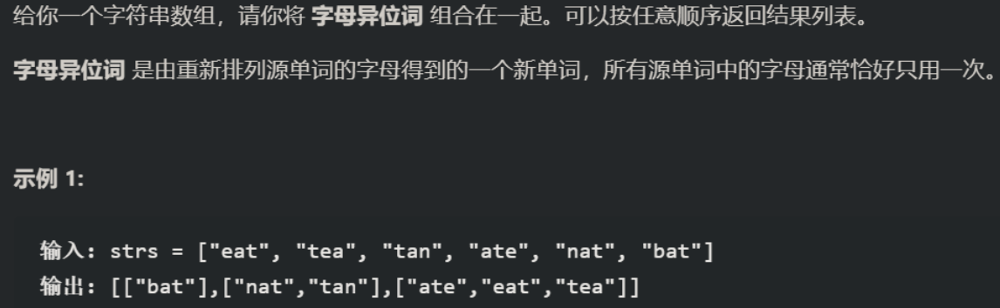

```java
class Solution {
    public List<List<String>> groupAnagrams(String[] strs) {
        HashMap<String,List<String>> map=new HashMap<>();
        for(int i=0;i<strs.length;i++)
        {
            char[] arr=strs[i].toCharArray();
            Arrays.sort(arr);
            String s=new String(arr);
            List<String> list=map.getOrDefault(s,new ArrayList<String>());
            list.add(strs[i]);
            map.put(s,list);
        }
        return new ArrayList<List<String>>(map.values());
    }
}
```

## 双指针

分为对向双指针、同向双指针。同向双指针包含一个特殊类型：滑动窗口

双指针常与搜索、贪心和数据结构等问题结合。

### 对向双指针

若其「首尾元素」间存在一定的「内在联系」，我们便可以使用此方法进行问题求解； 有时，「内在联系」并不是直接存在的，但数据规模较大，使用暴力求解的方法会超时。不过，经过适当的「预处理（如排序、求前缀和等）」，可以创造出「内在联系」，随后便可以对向双指针求解。

实际问题求解中，双指针的初始化和移动方式并不是一成不变的，需要具体问题具体分析。例如：

1. 判断回文串；
2. 在有序数组上求解两数之和问题

### 同向双指针

一个数组的情形：
a. left 和 right 分别作为「左指针」和「右指针」，left指向「已经处理完毕」的最后一个元素，right指向「当前」访问的元素。此方法尤其常见于对数组的「原地」处理，包括但不限于：删除有序数组中的重复元素、删除数组中所有值为 k 的元素。

b. left 和 right 共同形成了一个「滑动窗口」，可定长也可不定长。由于滑动窗口是双指针中非常典型的一种应用，因此将此部分独立出来；

两个数组的情形：
left 和 right 分别指向两个数组的首元素，然后二者不断「交替向右」移动，直到二者中的其一指向数组末尾，或二者均指向数组末尾（具体的移动方式依据题目分析）。

与 1.1 节中的对向双指针相同，若题目中的「内在联系」不是直接存在的，但又需要从内在联系入手以满足算法时间复杂度的要求，则此时需要注意先「预处理」，再使用同向双指针。

使用同向双指针方法时，数组中的每个元素「最多」访问两次（left 和 right 各一次）。对于一个数组的情形，时间复杂度由 O(n^2) 降低为 O(2 * n)= O(n)；而对于两个数组的情形，时间复杂度由 O(mn)O(mn) 降低为 O(m + n) ，其中 m 和 n 分别为两个数组的长度，从而有效减少了许多不必要的重复计算。与对向双指针相同，同向双指针在实际应用中，其初始化和移动方式并不是一成不变的，需要具体问题具体分析。例如：

「一个数组的情形」删除有序数组中的重复元素，并返回无重复元素的新数组；

「两个数组的情形」合并两个有序数组，并返回合并后的新数组。

### 滑动窗口（同向双指针）

根据实际问题的不同，滑动窗口可分为「定长滑动窗口」和「不定长滑动窗口」两种类型。通过分析适合使用「滑动窗口」求解的问题，这类问题往往具备以下两个特性，也是使用滑动窗口进行求解的突破口：

求解「**符合条件的窗口最小长度/窗口最大长度/窗口数量**」，且不必访问给定数组中的所有元素，而是通过双指针的同向交替移动，即可不重不漏地利用好给定数组的「内在联系」，完成问题求解；

在求解空间上，答案具备「**单调性**」，例如：数组元素   前缀和非严格单调增加、符合条件的窗口计数非严格单调增加等。

#### 定长滑动窗口

定长滑动窗口是指滑动过程中，长度不变的窗口 [left...right] ，即：left 和 right「同时」以「相同的步长」「同向」移动。对于给定的数组 nums，若限定窗口长度 k（1 <= k <= n, 其中n为数组长度），此时可通过维护定长滑动窗口的方式，进行问题求解。

对于定长滑动窗口问题，有两种常见的求解方法：

预处理 + 固定窗口边界：结合「前缀和」等方法，首先对给定数组进行预处理，然后在预处理数组上访问每个固定窗口，并维护所求结果；

手动模拟窗口的移动过程，并维护所求结果。

例如：求解长度为 n 的数组 nums 中，长度为 k 的最大子数组之和。、

#### 不定长滑动窗口

不定长滑动窗口是指滑动过程中，长度和步长可能发生变化的窗口 [left...right] ，即：此时 left 和 right 仅保证「同向」移动，而不保证「同时」和「相同的步长」。不定长滑动窗口的移动，往往具备以下规律：

当前窗口内所求结果暂未达到满足题意的标准，则问题的解可能在 right 的右侧，应将 right 不断向右移动以继续寻找解；

当前窗口内所求结果达到满足题意的标准，则找到了一个解，并维护窗口内的所求结果；

当前窗口内所求结果超过满足题意的标准，则问题的解不可能在 right 的右侧，应将 left 不断向左移动，直到出现 (1) 或 (2) 中所述的情况。

因此，对于不定长滑动窗口问题，我们应抓住「满足题意的标准」，并手动模拟窗口的移动过程，以确保不重不漏地分析所有可能情况，并维护所求结果。例如：

1.返回字符串中无重复字符子串的最大长度；

给定一个非负整数数组：
a. 判断其中是否存在和为k的子数组，若存在则返回true，否则返回false；

b. 返回其中和 <= k的子数组的个数；

c. 返回其中和 >= k的子数组的个数。

### 例题

[对向双指针：三数之和](https://leetcode-cn.com/leetbook/read/2022-spring-recruitment/2jpghm/)

[对向双指针：盛最多水的容器](https://leetcode-cn.com/leetbook/read/2022-spring-recruitment/2jm3j1/)

[同向双指针： 删除有序数组中的重复项](https://leetcode-cn.com/leetbook/read/2022-spring-recruitment/2jaub7/)

[同向双指针：比较版本号](https://leetcode-cn.com/leetbook/read/2022-spring-recruitment/2j27c5/)

[(Hard)同向双指针推广 - 滑动窗口：最小覆盖子串](https://leetcode-cn.com/leetbook/read/2022-spring-recruitment/2jnw16/)

[(Hard)同向双指针推广 - 滑动窗口：最大连续 1 的个数 III](https://leetcode-cn.com/leetbook/read/2022-spring-recruitment/2jv242/)、

### 总结

双指针，有两个指针：

对向双指针， 一般是因为最左边和最右边可以互补

同向双指针一般是右指针移动，当条件不成立时，才移动左指针；

## 查找与排序

### 查找

- 顺序查找

  遍历数组，查找；时间复杂度O(n)

- 二分查找

  数组有序（局部也行），不断将区间一分为二，在一半区间上继续查找；时间复杂度O(logn)

#### 精确二分查找

查找指定target元素的位置

#### 模糊二分查找

不是查找指定target，而是查找：第一个 ≥ target 的元素 / 最后一个 ≤ target 的元素的位置（等号取或不取均可）

```java
// 在有序数组 nums 中查找 target 第一次出现(或插入)的位置
public int binarySearchLeft(int[] nums,int target){
    int left=0,right=nums.length-1,pos=0;
    while(left<=right){
        int mid=left+(right-left)/2;
        // 先检查是否在左半区间：
        if(nums[mid]>=target){
            pos=mid;
            right=mid-1;
        }else{
            left=mid+1;
        }
    }
    // pos 即为所求
    return pos;
}

// 在有序数组 nums 中查找 target 最后一次出现(或插入)的位置
public int binarySearchRight(int[] nums,int target){
    int left=0,right=nums.length-1,pos=0;
    while(left<=right){
        int mid=left+(right-left)/2;
        // 先检查是否在右半区间：
        if(nums[mid]<=target){
            pos=mid;
            left=mid+1;
        }else{
            right=mid-1;
        }
    }
    // pos 即为所求
    return pos;
}
```

#### 二分查找答案

此类问题多出现在应用题中，且所求解问题的「答案」target 在「问题求解区间」上具备「单调性」，即：

- 对于问题求解区间 [left, right]，存在一个值 target，所有 >= target 的答案均是题目的解，而所有 < target 的答案均不是题目的解；


- 对于问题求解区间 [left, right]，存在一个值 target，所有 <= target 的答案均是题目的解，而所有 > target 的答案均不是题目的解。


上述过程可通过「在定义域上具备单调性的函数」辅助理解。例如：给定函数 f(x) = x - target，f(x) >= 0 的解集是 x >= target，由于 f(x) 在实数域上单调增加，因此这个 target 可通过二分查找的方式求得；同理，f(x) <= 0 的解集是 x <= target，这个 target 同样可以通过二分查找的方式求得。

在实际问题中，通过二分答案方法求解的应用题往往提示信息非常隐蔽，且不易发现。不过若题中出现「最小化最大值」或「最大化最小值」的题眼，并且经过对题目的分析，发现所求解的答案满足上面的性质 (1) 或 (2)，此时我们可以直接对这个「答案」进行二分查找。此类问题求解的步骤可总结如下：

1. 根据题意，确定初始查找区间 [left, right]；
2. 同 1.1 或 1.2 中的算法流程，进行二分查找；
3. 二分查找的判定：自主实现 check 函数，判断当前的答案 mid 是否符合要求，从而调整下一步的查找范围为左半区间或右半区间。

例如：给定一个「正实数」x，返回 x 的算术平方根。注意：分别考虑结果向下取整和不向下取整的情况。

1. 结果向下取整：等价于在「整数」范围内的模糊二分查找；
2. 结果不向下取整：等价于在「实数」范围内的模糊二分查找，此时需要注意以下三个细节：

a. 循环条件：不再是 left <= right，而是在区间长度不是一个很小的实数时循环（例如：right - left >= 1e-6）；

b. 取中点：不能整除，避免漏掉可能的实数解；

c. 下一步查找区间的确定：不能漏掉中点，因为中点也有可能是答案（例如：x 本身是完全平方数的情况）。

```java
// 给定一个正实数 x, 返回 x 的算术平方根(结果向下取整)
public int mySqrt1(int x){
    int left=0,right=x,res=0;
    while(left<=right){
        int mid=left+(right-left)/2;
        // mid * mid <= x, 说明 x 的算术平方根至少为 mid, 也可能比 mid 更大
        // 将其存储到 res, 并在右半区间 [mid + 1, right] 继续二分查找
        if(mid*mid<=x){
            res=mid;
            left=mid+1;
        }
        // 否则, 说明 x 的算术平方根只能比 mid 更小
        // 并在左半区间 [left, mid - 1] 继续二分查找
        else{
            right=mid-1;
        }
    }
    return res;
}


// python：java达到不向下取整比较麻烦
def mySqrt2(x):  # 给定一个正实数 x, 返回 x 的算术平方根(结果不向下取整)

    left, right, res = 0, x, 0

    # 答案区间 [left, right] 不为空时, 循环

    while right - left >= 1e-6:

        mid = left + (right - left) / 2

        # 在右半区间 [mid, right] 继续二分查找

        if mid * mid <= x:

            res = mid

            left = mid

        # 在左半区间 [left, mid] 继续二分查找

        else:

            right = mid

    return res
```


#### 例题

[精确二分查找：二分查找](https://leetcode-cn.com/leetbook/read/2022-spring-recruitment/nxvvad/)

[模糊二分查找：在排序数组中查找元素的第一个和最后一个位置](https://leetcode-cn.com/leetbook/read/2022-spring-recruitment/nxdrr3/)

[模糊二分查找：寻找峰值](https://leetcode-cn.com/leetbook/read/2022-spring-recruitment/nx09om/)

[二分查找答案：爱吃香蕉的珂珂](https://leetcode-cn.com/leetbook/read/2022-spring-recruitment/nx7h91/)

[二分查找答案：分割数组的](https://leetcode-cn.com/leetbook/read/2022-spring-recruitment/nx7b57/)

「使……最大值尽可能小」是二分搜索题目常见的问法：即最大值在一个范围内，这个范围内某些值可以是符合”值“的条件的，但是不符合

即最大值成立，这可以在左边（left，mid）继续找最大值成立，直到不成立为止，结果就是left

### 排序

O(n^2)：冒泡排序、选择排序、插入排序；
O(nlogn)：希尔排序、快速排序、堆排序、归并排序；
O(n)：计数排序、基数排序、桶排序。

重点：快速排序、堆排序、归并排序

#### 基础排序应用

- 求第k大：

  快速排序：pivot插入的位置，为length-k即可

  ```java
  class Solution {
      Random random = new Random();
  
      public int findKthLargest(int[] nums, int k) {
          return quickSelect(nums, 0, nums.length - 1, nums.length - k);
      }
  
      public int quickSelect(int[] a, int l, int r, int index) {
          int q = randomPartition(a, l, r);
          if (q == index) {
              return a[q];
          } else {
              return q < index ? quickSelect(a, q + 1, r, index) : quickSelect(a, l, q - 1, index);
          }
      }
  
      public int randomPartition(int[] a, int l, int r) {
          int i = random.nextInt(r - l + 1) + l;
          swap(a, i, r);
          return partition(a, l, r);
      }
  
      public int partition(int[] a, int l, int r) {
          int x = a[r], i = l - 1;
          for (int j = l; j < r; ++j) {
              if (a[j] <= x) {
                  swap(a, ++i, j);
              }
          }
          swap(a, i + 1, r);
          return i + 1;
      }
  
      public void swap(int[] a, int i, int j) {
          int temp = a[i];
          a[i] = a[j];
          a[j] = temp;
      }
  }
  ```

  堆排序：大顶堆

  ```java
  class Solution {
      public int findKthLargest(int[] nums, int k) {
          int heapSize = nums.length;
          buildMaxHeap(nums, heapSize);
          for (int i = nums.length - 1; i >= nums.length - k + 1; --i) {
              swap(nums, 0, i);
              --heapSize;
              maxHeapify(nums, 0, heapSize);
          }
          return nums[0];
      }
  
      public void buildMaxHeap(int[] a, int heapSize) {
          for (int i = heapSize / 2 -1; i >= 0; --i) {
              maxHeapify(a, i, heapSize);
          } 
      }
  
      public void maxHeapify(int[] a, int i, int heapSize) {
          int l = i * 2 + 1, r = i * 2 + 2, largest = i;
          if (l < heapSize && a[l] > a[largest]) {
              largest = l;
          } 
          if (r < heapSize && a[r] > a[largest]) {
              largest = r;
          }
          if (largest != i) {
              swap(a, i, largest);
              maxHeapify(a, largest, heapSize);
          }
      }
  
      public void swap(int[] a, int i, int j) {
          int temp = a[i];
          a[i] = a[j];
          a[j] = temp;
      }
  }
  ```

  

#### 自定义排序应用

- 给定数组/字符串，按【元素值】排序
- 给定字符串数组，按【字符串字典序/长度】排序
- 【区间类问题】对于给定区间，按区间起点/区间终点/区间长度排序

#### 例题

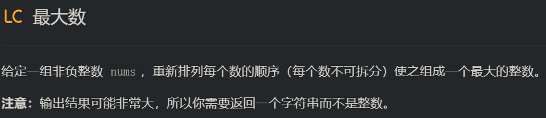

- 对于 [4,42]，比较 442 >424，需要把 44 放在前面；
- 对于 [4,45]，比较 445 <454，需要把 45 放在前面。

因此我们需要比较两个数不同的拼接顺序的结果，进而决定它们在结果中的排列顺序。

```java
class Solution {
    public String largestNumber(int[] nums) {
        StringBuilder sb=new StringBuilder();
        Integer[] arr=new Integer[nums.length];
        for(int i=0;i<nums.length;i++){
            arr[i]=nums[i];
        }
        Arrays.sort(arr,(x,y)->{
            int xt=10;
            int yt=10;
            while(xt<=x){
                xt*=10;
            }
            while(yt<=y){
                yt*=10;
            }
            return y*xt+x-x*yt-y; // 比较两个数的拼接结果
        });
        if(arr[0]==0){
            return "0";
        }
        for(int i=0;i<arr.length;i++){
            sb.append(arr[i]);
        }
        return sb.toString();
    }
}
```


## 贪心

贪心算法与「动态规划」有着密切的联系，可以通过贪心算法求解的题目往往也可以通过动态规划求解，不过在一些特定问题情景下，由于数据规模限制，或者结合常识，一些子问题明显是偏离求解方向的，此时**不必要求出所有子问题的解**，而是可以通过求出对答案有影响的部分「子问题」的解，进而得到最终结果。

使用贪心算法求解的题目，需要具备以下三大「基本特性」：

- 最优子结构：原问题可分解为若干规模较小的子问题，但原问题的解只由其中一个规模较小的「子问题」的解决定；


- 无后效性：已经计算出的结果不会受后续计算影响；


- 贪心选择性质：贪心的过程，是从「局部最优」逐步走向「全局最优」的过程。


贪心算法在笔试和面试中更加侧重实际问题分析与思维能力的考察，哈希表、双指针、二分查找、排序、搜索、栈、队列、堆（优先队列）等算法和数据结构是贪心算法的有力求解工具。此类问题的难度跨度较大，往往想到思路的难度低于可行性证明的难度，不过我们无需重点关注「严格数学意义」上的可行性证明，而是需要在理解上述基本特性的基础上，结合大量的题目实战，提升自己的实际问题分析与思维能力。

### 最佳装载类问题

往往基于「船载人」和「“背包”装物品」等情景，目的是求解「最小成本」或「最大价值」。不同于动态规划，此类问题会限制「不同的装载方式」，由于「船与人」和「“背包”与物品」之间具备「性价比」，此时「按性价比」递减的顺序逐步装载，直到装满为止，得到的结果便是所求的最小成本或最大价值。例如：

- 船载人：给定一个长度为 n 的正整数数组 weights，weights[i] 表示第 i 个人的体重。每艘船可载一人或两人，但承载的重量均不能超过 limit，返回承载所有人过河所需的最小船数；


- 部分背包问题：给定一个长度为 n 的二维正整数数组 goods，goods[i] = [weights[i], value[i]] 表示第 i 件物品的重量和价值。现在有一个最大载重量为 limit 的背包，每一件物品可以完全放入，也可以放入一部分（仍是整数），返回恰好装满该背包时，物品的最大总价值。若背包无法恰好装满，返回 -1。

```java
public int minBoats(int[] weights,int limit){
    // n 个人的体重递增排序
    Arrays.sort(weights);
    // 初始化：双指针 left 和 right 分别指向最轻和最重的人，res 表示所求的最小船数
    int left=0;
    int right=weights.length-1;
    int res=0;
    while(left<right){
        // 当最轻和最重的两个人体重之和<=limit，可将他们安排在同一船上
        if(weights[left]+weight[right]<=limit){
            left++;
            right--;
            res++;
        }else{
            right--;
            res++;
        }
    }
    // 两指针相遇，则安排这最后一个人
    if(left==right){
        res++;
    }
    return res;
}
```

```java
public int maxValue(int[][] goods,int limit){
    int n=goods.length;
    int max=0;
    // n 件物品按性价比（总价值/总重量）递减排序
    Arrays.sort(goods,(x,y)->{
        return y[1]/y[0]-x[1]/x[0];
    });
    
    for(int i=0;i<n;i++){
        if(limit>=goods[i][0]){
            res+=goods[i][1];
            limit-=goods[i][0];
        }else{
            // 由于物品可部分装入，所以计算 limit 部分的价值
            res+=limit*(goods[i][1]/goods[i]/0);
            limit=0;
        }
        // 背包恰好装满, res 即为所求
        if(limit==0){
            return res;
        }
    }
    // 否则，无解；
    return -1;
}
```

### 区间选择类问题

区间选择类问题是一类非常经典的使用贪心算法求解的问题。这里的「区间」往往用于表示「活动」的开始和结束时间，目的是求解「最小 / 最大选择的区间个数（价值）」，并且选出的区间往往要求「无交集」。因此，此类问题的直观解法是：先排序再选择。其中，排序主要有以下三种方式，具体的选择方式还需具体问题具体分析：

- 按「区间起点」（活动开始时间）递增排序；


- 按「区间终点」（活动结束时间）递增排序；


- 按「区间长度」（活动持续时间）递增/递减排序。


例如：

- 「会议室安排」给定一个会议时间安排的数组 intervals，intervals[i] = [starti, endi] 表示第 i 个会议的开始和结束时间，返回所需会议室的最小数量；


- 「参会安排」问题情境同 (1)，返回一个人可以参加会议的最大数目（注意：若前一个会议的结束时间与后一个会议的开始时间相同，这两个会议可以同时参加）。


```java
    public int minMeetingRoom(int[][] intervals){
        int n=intervals.length;
        // 小根堆 PriorityQueue实际上是一个堆（不指定Comparator时默认是最小堆）
        // 维护正在进行的会议的结束时间
        PriorityQueue<Integer> minHeap=new PriorityQueue<>();
        int res=0;
        // 按会议开始时间递增排序（优先安排开始时间早的会议）
        Arrays.sort(intervals,(x,y)->x[0]-y[0]);
        // 遍历会议
        for(int i=0;i<n;i++){
            // 记当前时间为第 i 个会议的开始时间
            // 在此之前结束的会议应从小根堆中移除
            while(!minHeap.isEmpty() && minHeap.peek()<=intervals[i][0]){
                minHeap.poll();
            }
            // 如果 当前i 会议的开始时间在队列的最早结束时间之前，则继续添加会议室
            minHeap.add(intervals[i][1]);
            // 当前会议室数量为堆的大小
            res=Math.max(res,minHeap.size());
        }
        return res;
    }
```

```java
    // 最大可参加会议数量
    public int maxMeetings(int[][] intervals){
        int n=intervals.length;
        // 按会议结束时间递增排序（保证当前会议之前会议结束时间<=当前会议开始时间）
        Arrays.sort(intervals,(x,y)->x[1]-y[1]);
        int res=1;
        // last: 在当前会议之前选择的最后一个会议下标
        int last=0;
        // 遍历会议
        for(int i=1;i<n;i++){
            // 若之前参加的最后一个会议结束时间 <= 当前会议的开始时间
            // 则选择当前会议
            if(intervals[last][1]<=intervals[i][0]){
                last=i;
                res++;
            }
        }
        return res;
    }
```

### 最优选址类问题

最优选址类问题往往基于在一维直线/二维平面上的「仓库建设」等情景，目的是最小化「仓库」到达其它各点的距离之和。此类问题求解时有一个结论：「中位数」位置是最优解，这一点可通过绝对值不等式等数学工具进行证明，本文将不再赘述。

例如：有 n 个商店水平分布在一条直线上，给定它们的坐标（均为整数），现在需要在这条水平直线上建立一个仓库，以最小化到达各个商店的距离之和，返回该距离之和的最小值。

```java
    public int bestSelection(int[] nums){
        int n=nums.length;
        int res=0;
        // 按照仓库位置递增
        Arrays.sort(nums);
        // 仓库位置的中位数 (仓库数量为奇数时, 中位数为中间位置; 否则, 中位数为中间两个仓库位置的平均值)
        int mid=n%2==1?nums[n/2]:(nums[n/2-1]+nums[n/2])/2;
        // 遍历 n 个商店, 它们到中间位置 mid 的绝对值之和, 即为所求
        for(int i=0;i<n;i++){
            res+=(nums[i]-mid);
        }
        return res;
    }
```


### 例题


移掉K位数

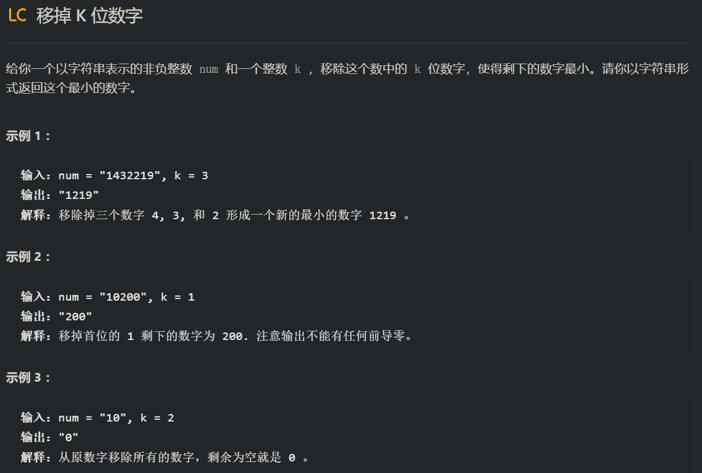

```java
    public String removeKdigits(String num, int k) {
        char[] arr=num.toCharArray();
        int n=arr.length;
        int len=n;
        // 栈内的数单调递增
        Deque<Character> deque=new LinkedList<>();
        // j代表不为0，待压入的数
        int j=0;
        for(int i=0;i<k;i++){
            // 全部数已经压入，如果栈为空或者为1则返回0，负责将栈顶最大数弹出
            if(j==len){
                if(deque.size()>1){
                    deque.poll();
                }else{
                    return "0";
                }
            }else{
                // 保证栈中的数从底到顶单调递增
                while(j<len && (deque.isEmpty() || deque.peek()-'0'<=arr[j]-'0')){
                    deque.push(arr[j]);
                    j++;
                }
                // 弹出栈顶的数（最大的数）
                deque.poll();
                // j为待压入的数，如果栈为空且待压入的数为0，就跳过该数
                while(j<len && deque.isEmpty() && arr[j]=='0'){
                    j++;
                }
            }
        }
        // 栈为空，且j==k，如：“10” 1 
        if(j==len && deque.isEmpty()){
            return "0";
        }
        StringBuilder sb=new StringBuilder();
        while(!deque.isEmpty()){
            // 从底开始弹出，注意pollFirst是弹出栈顶
            sb.append(deque.pollLast());
        }
        // 添加剩余的数
        sb.append(num.substring(j,len));
        return sb.toString();
    }
```


## 链表

这类问题我们可以简单粗暴地预先遍历链表一遍，将各个节点的值预先存到数组，对数组操作结束后将操作结果写回原链表

常见的链表类问题主要包括以下两大类：

### 链表基本操作与运用

链表基本操作，主要包括「数据结构定义」、「创建链表」、「插入/删除/修改/查找节点」和「链表排序」等方面。

实际问题求解中，给定的链表往往是没有头节点的（第一个节点即为数据节点）。此时，可引入一个「虚拟头节点」，该虚拟头节点的指针域指向链表中的第一个数据节点。若需要进行「插入节点至链表头部」或「删除链表中的第一个数据节点」等操作时，将更加易于实现。

### 链表中的双指针问题

快慢指针：环形链表相遇、或者快k步

另一类链表类问题常与「双指针」中的「同向双指针」算法结合考察。

在「双指针」一章中，我们分析了同向双指针中「一个数组」和「两个数组」的情形，这两种情形在链表类问题中有着非常直观的体现，此时的双指针又称为「快慢指针」，即：设置一对「移动速度」有别的指针 slow 和 fast（例如：每次 slow 移动一步的同时， fast 移动两步），以抓住它们所指向节点间的「内在联系」，进行问题求解。

下面，我们将对以下典型问题进行分析。

一个链表的情形 - 给定无环链表。例如：寻找链表中的倒数第 k 个节点
此类问题，一种直观的解法是：两次遍历链表，第一次遍历时记录链表长度 n，第二次遍历时记录当前节点位置 (1, 2, ..., n)，直到找到第 (n - k) 个节点，即所求的倒数第 k 个节点。

然而，在笔面试中，此类问题若要求「只能遍历一遍链表」，则上述方法将不满足要求，因此应对上述方法进行优化。由于这一遍遍历链表需要兼顾直观解法中两次遍历所做的事情，因此可以引入快慢指针 slow 和 fast，将一遍遍历的过程拆分为以下三个步骤：

a. 快指针 fast 先向右移动 k 步；

b. 快指针 fast 未指向空节点时，慢指针 slow 和快指针 fast 同时向右移动一步；

c. 最终，slow 指向的节点即为所求。

### 例题

```java
class ListNode{
    int val;
    ListNode next;
    
    public ListNode(){};

    public ListNode(int val){
        this.val=val;
    }
    
    public ListNode(int val,ListNode next){
        this.val=val;
        this.next=next;
    }
}
```

- 反转链表

  ```java
  class Solution {
      ListNode dummyHead=new ListNode();
      public ListNode reverseList(ListNode head) {
          if(head==null)
              return null;
          reverse(head);
          return dummyHead.next;
      }
      
      public ListNode reverse(ListNode node){
          if(node.next==null){
              dummyHead.next=node;
              return node;
          }
          ListNode pre=reverse(node.next);
          pre.next=node;
          node.next=null;
          
          return node;
      }
  }
  ```

  ```java
      public ListNode reverseList(ListNode head) {
          ListNode pre=null;
          ListNode curr=head;
          ListNode newHead=null;
          while(curr!=null){
              ListNode temp=curr.next;
              curr.next=pre;
              pre=curr;
              curr=temp;
          }
          return pre;
      }
  ```

- 删除排序链表中的重复元素

  ```java
  class Solution {
      public ListNode deleteDuplicates(ListNode head) {
          if (head == null) {
              return head;
          }
  
          ListNode cur = head;
          while (cur.next != null) {
              if (cur.val == cur.next.val) {
                  cur.next = cur.next.next;
              } else {
                  cur = cur.next;
              }
          }
  
          return head;
      }
  }
  ```
  
- 删除排序链表中的重复元素 II

  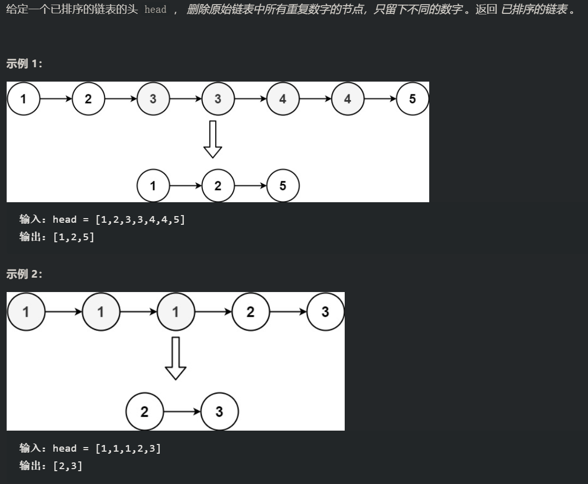

  ```java
  class Solution {
      public ListNode deleteDuplicates(ListNode head) {
          if(head==null) {
              return null;
          }
          ListNode dummyHead=new ListNode(0,head);
          // cur为符合题意的节点
          ListNode cur=dummyHead;
          while(cur.next!=null && cur.next.next!=null){
              if(cur.next.val==cur.next.next.val){
                  int x=cur.next.val;
                  // cur为符合题意的节点，判断它的下一个节点是否是重复值
                  while(cur.next!=null && cur.next.val==x){
                      cur.next=cur.next.next;
                  }
              }else{
                  cur=cur.next;
              }
          }
          return dummyHead.next;
      }
  }
  ```

- 判断环形链表

  

  ```java
  public class Solution {
      // 哈希表
      public boolean hasCycle(ListNode head) {
          Set<ListNode> set=new HashSet<>();
          while(head!=null){
              if(!set.add(head)){
                  return false;
              }
              head=head.next;
          }
          return ture;
      }
      
      // 快慢指针：当快慢指针都进入环形圈时，快指针一定会追上慢指针
      public boolean hasCycle1(ListNode head) {
          if(head==null || head.next==null){
              return false;
          }
          ListNode slow=head;
          ListNode fast=head.next;
          while(slow!=fast){
              if(fast==null || fast.next==null){
                  return false;
              }
              slow=slow.next;
              fast=fast.next.next;
          }
          return true;
      }
  }
  ```

- 相交链表

  

  ```java
  public class Solution {
      // 哈希表
     public ListNode getIntersectionNode(ListNode headA, ListNode headB) {
          Set<ListNode> visited = new HashSet<ListNode>();
          ListNode temp = headA;
          while (temp != null) {
              visited.add(temp);
              temp = temp.next;
          }
          temp = headB;
          while (temp != null) {
              if (visited.contains(temp)) {
                  return temp;
              }
              temp = temp.next;
          }
          return null;
      }
      
      // 快慢指针：走得快的指针（相交点之前长度短的）走完去走慢的，不相交一定不会相遇
      public ListNode getIntersectionNode(ListNode headA, ListNode headB) {
          if (headA == null || headB == null) {
              return null;
          }
          ListNode pA = headA, pB = headB;
          while (pA != pB) {
              pA = pA == null ? headB : pA.next;
              pB = pB == null ? headA : pB.next;
          }
          return pA;
      }
  }
  ```

  

  

  

## 栈与队列

## 堆

## 树

## 图

## 搜索

## 动态规划


# 面试题

## 归并排序的时间复杂度为什么为nlogn？

归并排序的递归树的高度为log2n（计算过程：假设待排序的数组元素个数为n，设高度为x，x意味着n个元素需要连续二分x次才剩下1个元素，即n/2^x=1，x=log2n），每一层的总比较次数为n，所以时间复杂度为nlogn。

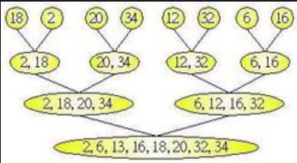

## LinkedList和ListNode的区别

LinkedList有个getFirst和getLast和get(int Index)方法（遍历获取节点）
ListNode我们可以获取指定元素，例如我们可以通过map保存ListNode，并且get指定的ListNode后直接定位到ListNode的位置，不需要遍历ListNode（就是get index和get 指针的区别）


# 数组与字符串：

## 无重复字符的最长子串

```java
class Solution {
    public int lengthOfLongestSubstring(String s) {
        // 哈希集合，记录每个字符是否出现过
        Set<Character> occ = new HashSet<Character>();
        int n = s.length();
        // 右指针，初始值为 -1，相当于我们在字符串的左边界的左侧，还没有开始移动
        int rk = -1, ans = 0;
        for (int i = 0; i < n; ++i) {
            if (i != 0) {
                // 左指针向右移动一格，移除一个字符
                occ.remove(s.charAt(i - 1));
            }
            while (rk + 1 < n && !occ.contains(s.charAt(rk + 1))) {
                // 不断地移动右指针
                occ.add(s.charAt(rk + 1));
                ++rk;
            }
            // 第 i 到 rk 个字符是一个极长的无重复字符子串
            ans = Math.max(ans, rk - i + 1);
        }
        return ans;
    }
}
```

## 寻找两个正序数组的中位数

```java
class Solution
{
    // 中位数返回double类型，因为长度为偶数的中位数结果要保留小数
    public double findMedianSortedArrays(int[] nums1,int[] nums2)
    {
        int len=nums1.length+nums2.length;
        // 偶数len：找第len/2小和第len/2+1小的数
        // 奇数len：找第len/2+1小的数
        if(len%2==1)
        {
            return findKthLargest(nums1,nums2,len/2+1);
        }
        else
        {
            return (double)(findKthLargest(nums1,nums2,len/2)+findKthLargest(nums1,nums2,len/2+1))/2.0;
        }
    }
}
```

### 找出两数组中的第k大的数

```java
class Solution
{
    // 方法一：二分法，每次对数组(即 m 与 n)二分
    public int findKthLargest(int[] nums1,int[] nums2,int k)
    {
        // 起始分配位置
        int p1=0;
        int p2=0;
        int len1=nums1.length;
        int len2=nums2.length;

        // 无论k是奇数还是偶数，对半分后被排除的总是其中一半(或更少不足以一半)，所以总会有名额的，最后总会剩下最后一个名额即k=1，这是比较p1和p2返回较小值即可
        while(true)
        {
            // 保证p1和p2位置的有效
            if(p1==len1)  // 数组1到头了
            {
                // 把剩余的名额全部分给数组2
                return nums2[p2+k-1];
            }
            if(p2==len2)
            {
                return nums1[p1+k-1];
            }
            if(k==1)
            {
                return Math.min(nums1[p1],nums2[p2]);
            }
            int half=k/2;
            // 保证分配名额后的长度不大于最大长度；newP1和newP2是待比较的数
            int newP1=Math.min(p1+half-1,len1-1);
            int newP2=Math.min(p2+half-1,len2-1);
            if(nums1[newP1]<=nums2[newP2])
            {
                // 更新剩余名额
                k=k-(newP1-p1+1);
                // ”newP1之前的所有数加入新数组“，更新数组1的起始分配位置
                p1=newP1+1;

            }else
            {
                k=k-(newP2-p2+1);
                p2=newP2+1;
            }
        }
    }
    
    // 方法二，暴力法， 数组合并后排序，然后找出第 k 大的值
    public static int findBigKMS(int[] arrA, int[] arrB, int k) {
        int[] arrC = new int[arrA.length + arrB.length];
        System.arraycopy(arrA, 0, arrC, 0, arrA.length);
        System.arraycopy(arrB, 0, arrC, arrA.length, arrB.length);
        Arrays.sort(arrC);
        return arrC[k - 1];
    }
}
```

## 三数之和

```java
// 三数之和为0的子串
class Solution {
    // 排序 + 双指针
    public List<List<Integer>> threeSum(int[] nums) {
        List<List<Integer>> resList=new ArrayList<>();
        Arrays.sort(nums);
        if(nums.length<3 || (nums[0]>=0 && nums[2]!=0))
            return resList;
        for(int i=0;i<nums.length;i++)
        {
            // 去重
            if(i>0 && nums[i-1]==nums[i])
                continue;
            if(nums[i]>0)
                  break;
            int target=-nums[i];
            int end=nums.length-1;
            int second=i+1;
            while(second<end)
            {
                if(second>i+1 && nums[second-1]==nums[second])
                {
                    second++;
                    continue;
                }
                if(end<nums.length-1 && nums[end]==nums[end+1])
                {
                    end--;
                    continue;
                }
                if(nums[second]+nums[end]<target)
                {
                    second++;
                }
                else if(nums[second]+nums[end]>target)
                {
                    if(nums[second]>target)
                        break;
                    end--;
                }
                else
                {
                    List<Integer> list=new ArrayList<>();
                    list.add(nums[i]);
                    list.add(nums[second]);
                    list.add(nums[end]);
                    resList.add(list);
                    // 每个start只能和一个end和为target，如果出现则可以过start和end
                    second++;
                    end--;
                }
            }
        }
        return resList;
    }
}
```

## 除自身以外数组的乘积

```java
输入: nums = [1,2,3,4]
输出: [24,12,8,6]

class Solution {
    public int[] productExceptSelf(int[] nums) 
    {
        int[] ans=new int[nums.length];
        ans[0]=1;
        for(int i=1;i<nums.length;i++)
        {
            ans[i]=ans[i-1]*nums[i-1];
        }
        int r=nums[nums.length-1];
        for(int i=nums.length-2;i>=0;i--)
        {

            ans[i]=ans[i]*r;
            r=r*nums[i];
        }
        return ans;
    }
}
```

## 字符串相加

```java
输入：num1 = "11", num2 = "123"
输出："134"
class Solution {
    public String addStrings(String num1, String num2) {
        int l1=num1.length();
        int l2=num2.length();
        StringBuilder st=new StringBuilder();
        int i=l1-1;
        int j=l2-1;
        int carry=0;
        int unit=0;
        while(i>=0 && j>=0)
        {
            int sum=(num1.charAt(i)-'0')+(num2.charAt(j)-'0')+carry;
            carry=sum>9?1:0;
            unit=sum%10;
            st.append(unit);
            i--;
            j--;
        }
        while(i>=0)
        {
            int sum=(num1.charAt(i)-'0')+carry;
            carry=sum>9?1:0;
            unit=sum%10;
            st.append(unit);
            i--;
        }
        while(j>=0)
        {
            int sum=(num2.charAt(j)-'0')+carry;
            carry=sum>9?1:0;
            unit=sum%10;
            st.append(unit);
            j--;
        }
        if(carry!=0)
            st.append(1);
        return st.reverse().toString();
    }
}
```

# 哈希表

## LRU缓存机制

```java
class LRUCache {
    class ListNode{
        int key;
        int val;
        ListNode pre;
        ListNode next;
        public ListNode(){}
        public ListNode(int index,int value){
            key=index;
            val=value;
        }
    }

    int size;
    private int capacity;
    private HashMap<Integer,ListNode> map=new HashMap<>();
    // LRU只涉及操作头部和尾部元素，访问元素只需要用map
    ListNode dummyHead;
    ListNode dummyTail;

    public LRUCache(int capacity) {
        this.capacity=capacity;
        this.size=0;
        this.map=new HashMap<>();
        this.dummyHead=new ListNode();
        this.dummyTail=new ListNode();
        dummyHead.next=dummyTail;
        dummyTail.pre=dummyHead;
    }

    public int get(int key) {
        ListNode node=map.get(key);
        if(node==null){
            return -1;
        }
        moveToHead(node);
        return node.val;
    }

    public void put(int key, int value) {
        if(map.containsKey(key)){
            ListNode node=map.get(key);
            node.val=value;
            if(size>1)
                moveToHead(node);
        }else{
            ListNode node=new ListNode(key,value);
            map.put(key,node);
            if(size<capacity){
                addToHead(node);
                size++;
            }else{
                map.remove(removeTail());
                addToHead(node);
            }
        }
    }

    // ListNode方法：
    private void remove(ListNode node){
        node.pre.next=node.next;
        node.next.pre=node.pre;
        node.pre=null;
        node.next=null;
    }

    // 注意add方法添加节点到头部，而不是尾部
    private void addToHead(ListNode node){
        node.pre=dummyHead;
        node.next=dummyHead.next;

        node.pre.next=node;
        node.next.pre=node;
    }

    private void moveToHead(ListNode node){
        remove(node);

        node.pre=dummyHead;
        node.next=dummyHead.next;
        node.pre.next=node;
        node.next.pre=node;
    }

    private int removeTail(){
        ListNode node=dummyTail.pre;
        remove(node);
        return node.key;
    }
}
```

