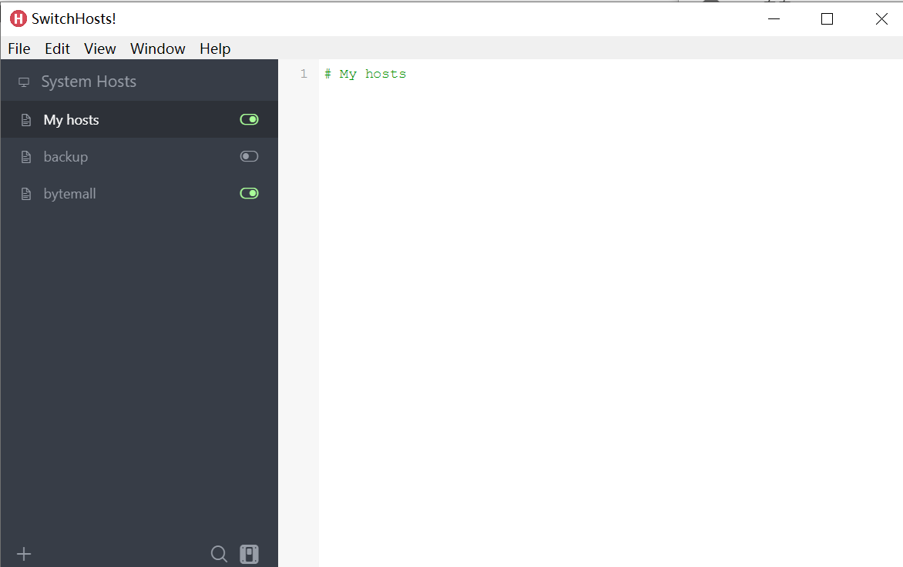
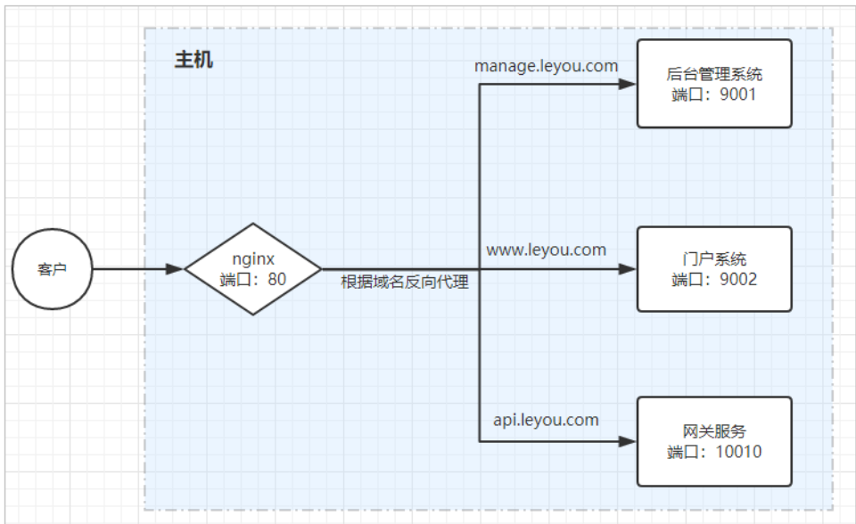
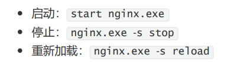
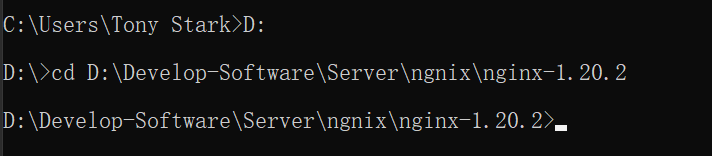
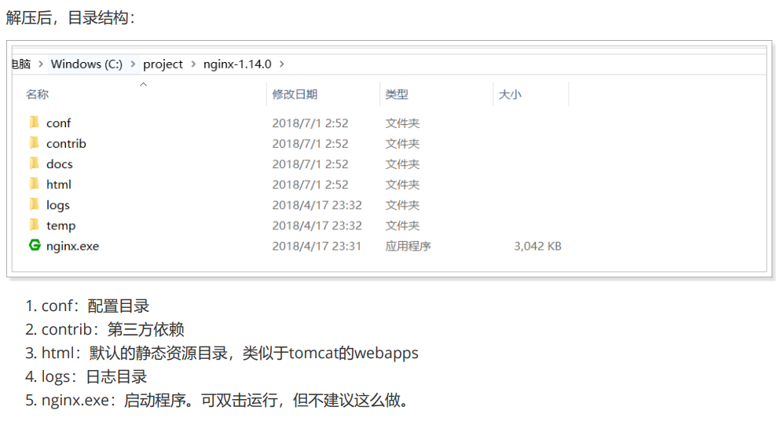

# Nginx

域名解析问题:

https://cloud.tencent.com/developer/article/1408956



不加端口号访问：manage.bytemall.com，默认为80端口通过上面的设置会跳转到 `127.0.0.1:8080`

因为IIS占用80端口，所以会跳转到IIS网站。必须manage.bytemall.com:8899才能访问bmall-manage-web

# 什么是Ngnix


nginx可以作为web服务器，但更多的时候，我们把它作为网关，因为它具备网关必备的功能： 

- 反向代理 
- 负载均衡 
- 动态路由 
- 请求过滤

# Nginx解决端口问题

解决完域名解析问题（如127.0.0.1即localhost映射为 manage.byteme.com）后，还需要解决端口问题，因为访问改网页需要加上端口号：http://manage.byteme.com:9090 ,不够优雅（如果为默认的80端口则不需要加）

把请求转移到9090端口需要用到反向代理工具：Ngnix

# Ngnix作为web服务器

Web服务器分2类： 

- web应用服务器，如： 
  - tomcat 
  - resin 
  - jetty 

- web服务器，如： 
  - Apache 
  - Nginx 
  - IIS 

区分：web服务器不能解析jsp等页面，只能处理js、css、html等静态资源。 并发：web服务器的并发能力远高于web应用服务器。

# Ngnix作为反向代理

什么是反向代理？ 

- 代理：通过客户机的配置，实现让一台服务器(代理服务器)代理客户机，客户的所有请求都交给代理服务器处理。 
- 反向代理：用一台服务器，代理真实服务器，用户访问时，不再是访问真实服务器，而是代理服务器

nginx可做反向代理服务器： 

- 需要提前在nginx中配置好反向代理的规则，不同的请求，交给不同的真实服务器处理 
- 当请求到达nginx，nginx会根据已经定义的规则进行请求的转发，从而实现路由功能

利用反向代理，就可以解决我们前面所说的端口问题，如图：



# Ngnix安装(Linux) 

[官方下载地址](http://nginx.org/en/download.html)

### 安装与启动

1. gcc环境 `yum install gcc-c++`
2. 第三方的开发包
   - PCRE `yum install -y pcre pcre-devel`
   - zlib `yum install -y zlib zlib-devel`
   - openssl `yum install -y openssl openssl-devel`
3. 安装
   - 解压 `[root@localhost ~]# tar zxf nginx-1.18.0.tar.gz`
   - 进入解压后文件夹复制执行以下命令
     `./configure  --prefix=/usr/local/nginx  --sbin-path=/usr/local/nginx/sbin/nginx --conf-path=/usr/local/nginx/conf/nginx.conf --error-log-path=/var/log/nginx/error.log  --http-log-path=/var/log/nginx/access.log  --pid-path=/var/run/nginx/nginx.pid --lock-path=/var/lock/nginx.lock  --user=nginx --group=nginx --with-http_ssl_module --with-http_stub_status_module --with-http_gzip_static_module --http-client-body-temp-path=/var/tmp/nginx/client/ --http-proxy-temp-path=/var/tmp/nginx/proxy/ --http-fastcgi-temp-path=/var/tmp/nginx/fcgi/ --http-uwsgi-temp-path=/var/tmp/nginx/uwsgi --http-scgi-temp-path=/var/tmp/nginx/scgi --with-pcre`
   - `[root@localhost nginx-1.18.0]# make`
   - `[root@localhost nginx-1.18.0]# make install`
   - `[root@localhost sbin]# mkdir /var/tmp/nginx/client -p`
   - 进入目录 `cd /usr/local/nginx/` 
   - 启动 `[root@localhost sbin]# ./nginx`
4. 配置文件目录 
   `nginx/conf/nginx.conf`
5. 重新加载配置文件 避免重启
   `sbin/nginx -s reload`

### 配置

- 配置虚拟主机与反向代理

```
worker_processes  1;

events {
    worker_connections  1024;
}

http {
    include       mime.types;
    default_type  application/octet-stream;

    sendfile        on;
    #tcp_nopush     on;

    #keepalive_timeout  0;
    keepalive_timeout  65;

    #gzip  on;

    upstream resume{
	server 123.207.121.135:8080;
    }

    server {
        listen       80;
        server_name  localhost;

        location / {
            proxy_pass   http://resume;
            index  index.html index.htm;
        }

        #error_page  404              /404.html;

        # redirect server error pages to the static page /50x.html
        #
        error_page   500 502 503 504  /50x.html;
        location = /50x.html {
            root   html;
        }
    }

    server {
        listen       80;
        server_name  www.img.exrick.cn;

        #charset koi8-r;

        #access_log  logs/host.access.log  main;

        location / {
            root   html81;
            index  index.html index.htm;
        }

        #error_page  404              /404.html;

        # redirect server error pages to the static page /50x.html
        #
        error_page   500 502 503 504  /50x.html;
        location = /50x.html {
            root   html;
        }
    }

    server {
        listen       80;
        server_name  www.xmall.exrick.cn;

        #charset koi8-r;

        #access_log  logs/host.access.log  main;

        location / {
            root   html;
            index  index.html index.htm;
        }

        #error_page  404              /404.html;

        # redirect server error pages to the static page /50x.html
        #
        error_page   500 502 503 504  /50x.html;
        location = /50x.html {
            root   html;
        }
    }
}
```

- 负载均衡（直接添加server即可）

```
...
http {
    ...
    upstream resume{
        server 123.207.121.135:8080;
        server 123.207.121.135:8081;
    } 
    ...
}
```

- 权重调节（weight）

```
...
http {
    ...
    upstream resume{
        server 123.207.121.135:8080;
        server 123.207.121.135:8081 weight=2;
    } 
    ...
}
```

- 压缩文件

```
    gzip  on;
    gzip_min_length 1k;
    gzip_buffers 4 16k;
    gzip_comp_level 9;
    gzip_types text/plain application/x-javascript application/javascript text/css application/xml text/javascript application/x-httpd-php image/jpeg image/gif image/png eventsource script png;
```

- 解决代理IP地址

```
server {
        listen       80;
        server_name  xmall.exrick.cn;

        location / {
            proxy_pass   http://xmall;
            index  index.html index.htm;
	        proxy_set_header Host $host;
	        proxy_set_header X-Real-IP $remote_addr;
	        proxy_set_header REMOTE-HOST $remote_addr;
            proxy_set_header X-Forwarded-For $proxy_add_x_forwarded_for;
        }

        error_page  404              /50x.html;

        error_page   500 502 503 504  /50x.html;
        location = /50x.html {
            root   html;
        }

    }
```

### 踩坑解决问题

- [emerg]: getpwnam("nginx") failed

  - 解决方法1：
    在nginx.conf中 把user nobody的注释去掉既可
  - 解决方法2：
    错误的原因是没有创建nginx这个用户，应该在服务器系统中添加nginx用户组和用户nginx，如下命令：
    `/usr/sbin/groupadd -f nginx`
    `/usr/sbin/useradd -g nginx nginx`
- [emerg] mkdir() "/var/temp/nginx/client" failed (2: No such file or directory)
  root下手动创建即可：`mkdir -p /var/temp/nginx/client`
- 重启服务器后启动提示/var/run/nginx找不到

```
nginx: [error] open() "/var/run/nginx.pid" failed (2: No such file or directory)
```

进入`/var/run`新建`nginx`文件夹：`mkdir nginx`

# Ngnix安装(Win)

[nginx安装及其配置](https://zhuanlan.zhihu.com/p/83890573)

[Windows下Nginx安装与配置教程](https://cloud.tencent.com/developer/article/1333800)

[Nginx配置——反向代理](https://blog.csdn.net/zxd1435513775/article/details/102508463)

操作：



到nginx.exe目录下操作：



解决80端口被占用：

查看占用80端口的进程：

```shell
netstat  -aon|findstr 3306  # 查看占用端口的进程id
tasklist | findstr 1306   # 根据进程pid查看进程信息
taskkill /pid 1306     # 根据进程 PID 结束进程
```


1. Ctrl+X
2. 计算机管理
3. 服务与应用程序
4. 服务
5. World Wide Web发布服务：手动、停止


# 目录结构



# 反向代理配置

