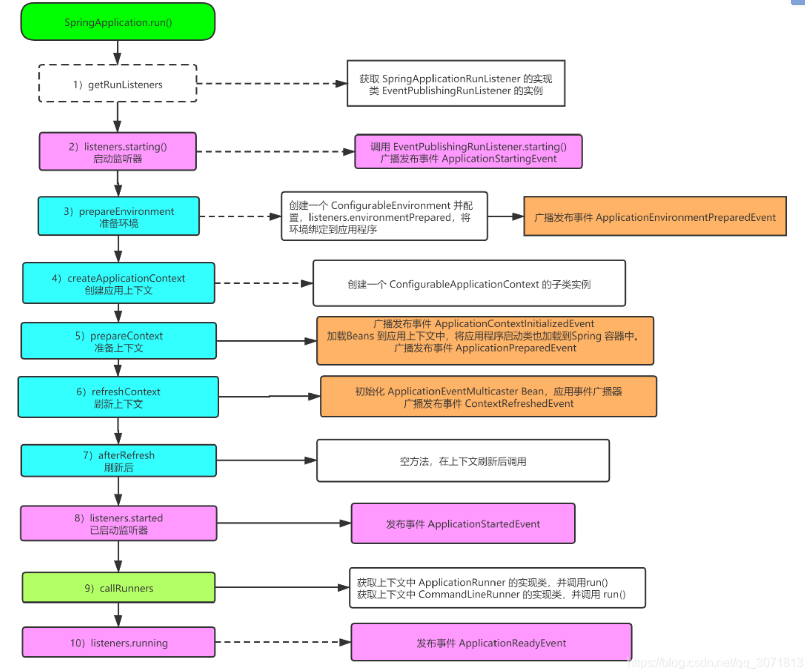
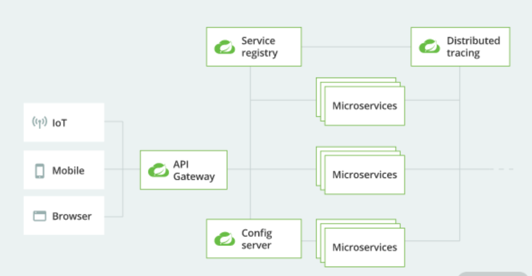
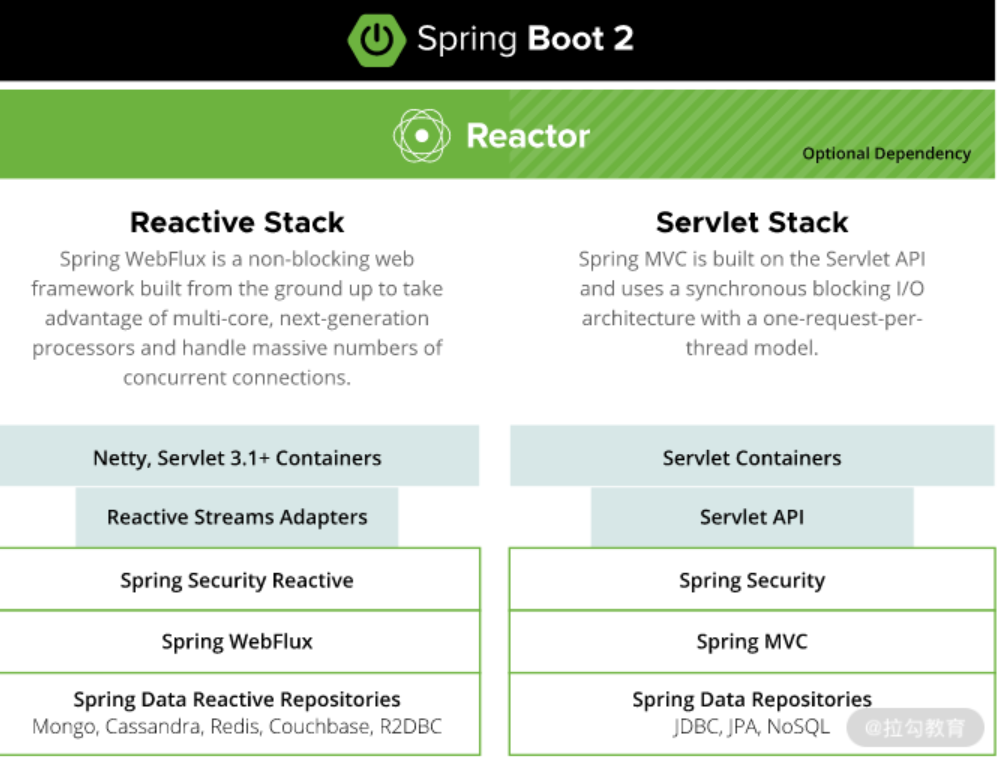

# Spring Boot

# 面试版

## 入门

https://blog.csdn.net/ac_dao_di/article/details/120932068

## 对Spring Boot的理解

Spring Boot本身并不提供Spring的核心功能，而是作为Spring的脚手架框架，以达到快速构建项目、预置三方配置、开箱即用的目的。Spring Boot有如下的优点：

- 可以快速构建项目；
- 可以对主流开发框架的无配置集成；
- 项目可独立运行，无需外部依赖Servlet容器；
- 提供运行时的应用监控；
- 可以极大地提高开发、部署效率；
- 可以与云计算天然集成。

## Spring Boot优点

- 快速构建项目
- 对主流开发框架的无配置集成
- 项目可以独立运行，无需外部依赖Servlet容器
- 提供运行时的应用监控
- 极大提高开发、部署效率
- 与云计算天然集成

## 相比Spring的优点

- 部署简单：支持嵌入式tomcat，无需依赖外部tomcat，可以本地启动，可以打包成fat jar运行
- 端点监控：可以查看spring boot内部的运行时状态，包括bean的生效情况、应用健康情况等。
- 外部化配置：支持从fat jar外application.yaml读取配置，无需修改内部代码和配置，支持对象配置注入和宽松绑定
- 注解驱动编程：无需任何xml，基于Spring 4.0条件注解实现bean注解，基于servlet 3.0实现动态servlet等
- 自动化配置：快速构建，避开依赖地狱，引入starter jar，配置yaml，即可实现开箱即用

## 自动配置原理？

Spring boot启动时从类路径找到所有META-INF/spring.factories配置文件，加载key=org.springframework.boot.autoconfigure.EnableAutoConfiguration对应的自动化配置类，之后自动配置类根据条件注解自动注入相应的bean，如果自定义配置了bean，则使用自定义的，否则使用默认的。

添加注解由@ConditionalOnClass/@ConditionalOnBean/@ConditionalOnProperty，都是基于@conditional。

其中spring boot已经在autoconfigure包中自定义好了spring支持的自定义配置类:如DispatcherServletAutoConfiguration自动配置DispatcherServlet。

解析：

对自动化配置起重要作用的ConfigurationClassPostProcessor进行深入解析，通过本文可以解答如下问题：

1. 自动化配置类生效的机制，条件注解的处理过程 
2. spring boot自动化配置类，有的条件类不存在，工程里打开是标红的，spring boot解析时为什么不报错，又是如何通过编译的？ 
3. @EnableXXXX到底是什么原理？注册BeanDefinition有哪些高端的姿势？ 
4. @Configuration和@Component到底有什么区别。 

  一张图总结整个自动配置生效过程：


## springboot启动过程?

参考：

http://events.jianshu.io/p/ee70ebd6d51b

https://blog.csdn.net/weixin_64314555/article/details/122061857

https://blog.csdn.net/qq_30718137/article/details/112909869

```java
package tacos;

import org.springframework.boot.SpringApplication;
import org.springframework.boot.autoconfigure.SpringBootApplication;

@SpringBootApplication     // SpringBoot 的核心注解 
public class TacoCloudApplication {
    public static void main(String[] args) {
        SpringApplication.run(TacoCloudApplication.class, args);  
    }
}
```

首先，Spring Boot项目创建完成后会默认生成一个名为”Application“的入口类，通过该类的main方法启动Spring Boot项目。

1. 调用 SpringApplication.run() 方法之前，需要进行实例化（执行SpringApplication的静态run方法进行启动，内部其实也是调用SpringApplication的构造方法创建实例对象），实例化需要做下面几件事

   SpringApplication构造方法内部主要做以下几件事：

   - 初始化自定义ResourceLoader
   - 通过ClassUtil工具类推断webApplicationType，目前主要有三种应用类型，首先检查DispatcherHandler类是否存在，如果存在并且DispatcherServlet不存在则推断为REACTIVE类型应用，否则继续判断Servlet类和ConfigurableWebApplicationContext是否存在，如果其中一个不存在则推断为普通应用，最后默认为SERVLET类型WEB应用；
   - 使用 通过SpringFactoriesLoader扫描所有jar包classpath下META-INF/spring.factories配置，并加载配置中的所有factory配置到cache中；
   - 根据SpringFactoriesLoader获取指定ApplicationContextInitializer类型配置工厂类并实例化，设置到SpringApplication实例对象中；
   - 根据SpringFactoriesLoader获取指定ApplicationListener类型配置工厂类并实例化，设置到SpringApplication实例对象中；

2. SpringApplication实例化完成后开始执行run方法，进入启动流程；

   - 启动之前首先通过SpringFactoriesLoader加载SpringApplicationRunListeners类型的所有实现类，并将SpringApplication实例对象通过构造方法注入，并遍历执行RunListener实现类的starting方法，通知他们，”我要开始启动了“；

   - 准备配置环境，创建并配置当前 Spring Boot 应用将要使用的 Environment（包括配置要使用的 PropertySource 以及 Profile ）。遍历调用所有 SpringApplicationRunListener 的 environmentPrepared() 的方法，告诉他们：“当前 SpringBoot 应用使用的 Environment 准备好了咯！”。

   - 加载spring的默认banner；

   - 根据webApplicationType类来创建对应的配置应用上下文；

     准备上下文，主要有以下几个步骤：

     - 上下文设置配置环境；
     - 配置上下文的beanNameGenerator和resourceLoader等；
     - 遍历执行ApplicationContextInitializer的所有实现类initialize方法，通知他们应用上下文正在进行初始化操作；
     - 遍历执行SpringApplicationRunListeners的contextPrepared方法，通知他们，上下文正在准备中；
     - 根据上下文修改BeanFactory的特殊配置；进行BeanFactory和启动Banner的自定义配置，主要包括BeanDefinition的覆盖策略；
     - 最后在遍历执行SpringApplicationRunListeners的contextLoaded，通知他们上开始加载上下文；

   - 上下文准备好之后开始执行刷新上下文操作,并注册关闭钩子函数；

   - 上下文刷新之后应用上下文容器已经启动完成，开始执行SpringApplicationRunListeners的started方法，通知他们spring容器上下文已经启动完成；

   - 最后通过spring容器上下文获取所有的ApplicationRunner和CommandLineRunner实现类，并执行他们的run方法。

   SpringApplication调用静态run方法的大致流程图(详)：

   

   

   ```java
   public ConfigurableApplicationContext run(String... args) {     
       // 创建StopWatch对象，用于统计run方法启动时长。     
       StopWatch stopWatch = new StopWatch();     
       // 启动统计     
       stopWatch.start();     
       ConfigurableApplicationContext context = null;     
       Collection<SpringBootExceptionReporter> exceptionReporters = new ArrayList<>();     
       // 配置Headless属性     
       configureHeadlessProperty();     
       // 获得SpringApplicationRunListener数组，     
       // 该数组封装于SpringApplicationRunListeners对象的listeners中。     
       SpringApplicationRunListeners listeners = getRunListeners(args);    
       
       // 启动监听，遍历SpringApplicationRunListener数组每个元素，并执行。     
       listeners.starting();     
       
       try {         
           // 创建ApplicationArguments对象         
           ApplicationArguments applicationArguments = new DefaultApplicationArguments(args);       
           // 加载属性配置，包括所有的配置属性。         
           ConfigurableEnvironment environment =prepareEnvironment(listeners, applicationArguments);         configureIgnoreBeanInfo(environment);      
           
           // 打印Banner         
           Banner printedBanner = printBanner(environment);         
           // 创建容器         
           context = createApplicationContext();         
           // 异常报告器         
           exceptionReporters = getSpringFactoriesInstances(SpringBootExceptionReporter.class,             						new Class[] { ConfigurableApplicationContext.class }, context);     
           // 准备容器，组件对象之间进行关联。        
           prepareContext(context, environment,listeners, applicationArguments, printedBanner);     
           // 初始化容器        
           refreshContext(context);         
           // 初始化操作之后执行，默认实现为空。         
           afterRefresh(context, applicationArguments);         
           // 停止时长统计         
           stopWatch.stop();         
           // 打印启动日志         
           if (this.logStartupInfo) {             
               new StartupInfoLogger(this.mainApplicationClass)      			  
                   .logStarted(getApplicationLog(), stopWatch);         
           }         
           // 通知监听器：容器完成启动。         
           listeners.started(context);         
           // 调用ApplicationRunner和CommandLineRunner的运行方法。         
           callRunners(context, applicationArguments);     
       } catch (Throwable ex) {        
           // 异常处理         
           handleRunFailure(context, ex, exceptionReporters, listeners);         
           throw new IllegalStateException(ex);     
       } 
       try {         
           // 通知监听器：容器正在运行。         
           listeners.running(context);     
       } catch (Throwable ex) {        
           // 异常处理         
           handleRunFailure(context, ex, exceptionReporters, null);         
           throw new IllegalStateException(ex);     
       }     
       return context; 
   }
   ```

   SpringApplication调用静态run方法的大致流程图(简)：

   

   其中，SpringApplication在run方法中重点做了以下操作：

   - 获取监听器和参数配置；
   - 打印Banner信息；
   - 创建并初始化容器；
   - 监听器发送通知。

   当然，除了上述核心操作，run方法运行过程中还涉及启动时长统计、异常报告、启动日志、异常处理等辅助操作。比较完整的流程


## spring boot启动tomcat原理?

- spring boot应用打包成Fat jar时，启动内嵌tomcat的原理 
- spring boot应用打包成WAR时，外部tomcat启动spring boot SpringApplication的原理 
- 自动化配置Servlet/ServletFilter/ServletListener的原理 

  详见：[spring boot启动加载tomcat原理深度剖析](https://blog.csdn.net/ac_dao_di/article/details/123292780)


## 传统spring项目改造为spring boot？

1. 将依赖替换为starter（web-starter/mybatis-starter），并解决依赖冲突，去除重复引入的jar，编译通过
2. 引进入口类和application.yaml，并替换掉xml。定义相关的异常日志报告
3. 去掉web.xml配置，qa环境去除内嵌tomcat，改用sci

## Spring Boot Starter作用？

Spring Boot通过提供众多起步依赖（Starter）降低项目依赖的复杂度。起步依赖本质上是一个Maven项目对象模型（Project Object Model, POM），定义了对其他库的传递依赖，这些东西加在一起即支持某项功能。很多起步依赖的命名都暗示了它们提供的某种或某类功能。

举例来说，你打算把这个阅读列表应用程序做成一个Web应用程序。与其向项目的构建文件里添加一堆单独的库依赖，还不如声明这是一个Web应用程序来得简单。你只要添加Spring Boot的Web起步依赖就好了。

## Spring Boot项目是如何导入包的？

通过Spring Boot Starter导入包

Spring Boot通过提供众多起步依赖（Starter）降低项目依赖的复杂度。起步依赖本质上是一个Maven项目对象模型（Project Object Model, POM），定义了对其他库的传递依赖，这些东西加在一起即支持某项功能。很多起步依赖的命名都暗示了它们提供的某种或某类功能。

举例来说，你打算把这个阅读列表应用程序做成一个Web应用程序。与其向项目的构建文件里添加一堆单独的库依赖，还不如声明这是一个Web应用程序来得简单。你只要添加Spring Boot的Web起步依赖就好了。

## Spring Boot自动装配的过程

使用Spring Boot时，我们只需引入对应的Starters，Spring Boot启动时便会自动加载相关依赖，配置相应的初始化参数，以最快捷、简单的形式对第三方软件进行集成，这便是Spring Boot的自动配置功能。Spring Boot实现该运作机制锁涉及的核心部分如下图所示：


整个自动装配的过程是：Spring Boot通过@EnableAutoConfiguration注解开启自动配置，加载spring.factories中注册的各种AutoConfiguration类，当某个AutoConfiguration类满足其注解@Conditional指定的生效条件（Starters提供的依赖、配置或Spring容器中是否存在某个Bean等）时，实例化该AutoConfiguration类中定义的Bean（组件等），并注入Spring容器，就可以完成依赖框架的自动配置。

## 对Spring Boot注解的了解

@SpringBootApplication注解：

在Spring Boot入口类中，唯一的一个注解就是@SpringBootApplication。它是Spring Boot项目的核心注解，用于开启自动配置，准确说是通过该注解内组合的@EnableAutoConfiguration开启了自动配置。

@EnableAutoConfiguration注解：

@EnableAutoConfiguration的主要功能是**启动Spring应用程序上下文时进行自动配置**，它会尝试猜测并配置项目可能需要的Bean。自动配置通常是基于项目classpath中引入的类和已定义的Bean来实现的。在此过程中，被自动配置的组件来自项目自身和项目依赖的jar包中。

@Import注解：

**@EnableAutoConfiguration的关键功能是通过@Import注解导入的ImportSelector来完成的**。从源代码得知@Import(AutoConfigurationImportSelector.class)是@EnableAutoConfiguration注解的组成部分，也是**自动配置功能的核心实现者。**

@Conditional注解：

@Conditional注解是由Spring 4.0版本引入的新特性，可根据是否满足指定的条件来决定是否进行Bean的实例化及装配，比如，设定当类路径下包含某个jar包的时候才会对注解的类进行实例化操作。总之，就是根据一些特定条件来控制Bean实例化的行为。

@Conditional衍生注解：

在Spring Boot的autoconfigure项目中提供了各类基于@Conditional注解的衍生注解，它们适用不同的场景并提供了不同的功能。通过阅读这些注解的源码，你会发现它们其实都组合了@Conditional注解，不同之处是它们在注解中指定的条件（Condition）不同。

- @ConditionalOnBean：在容器中有指定Bean的条件下。
- @ConditionalOnClass：在classpath类路径下有指定类的条件下。
- @ConditionalOnCloudPlatform：当指定的云平台处于active状态时。
- @ConditionalOnExpression：基于SpEL表达式的条件判断。
- @ConditionalOnJava：基于JVM版本作为判断条件。
- @ConditionalOnJndi：在JNDI存在的条件下查找指定的位置。
- @ConditionalOnMissingBean：当容器里没有指定Bean的条件时。
- @ConditionalOnMissingClass：当类路径下没有指定类的条件时。
- @ConditionalOnNotWebApplication：在项目不是一个Web项目的条件下。
- @ConditionalOnProperty：在指定的属性有指定值的条件下。
- @ConditionalOnResource：类路径是否有指定的值。
- @ConditionalOnSingleCandidate：当指定的Bean在容器中只有一个或者有多个但是指定了首选的Bean时。
- @ConditionalOnWebApplication：在项目是一个Web项目的条件下。


# 自动配置

## 继续详解SpringBoot 自动装配

Spring Boot在Spring框架的基础上，通过SPI机制，做进一步优化；

Spring Boot定义了一套接口规范：Spring Boot启动的时候会扫描外部引用jar包中的META/spring.factories文件，将文件中的配置信息加载到Spring容器（涉及JVM类加载机制和Spring容器知识），并执行类中定义的各种操作。对于外部jar包，只需按照SpringBoot定义的标准，就能将自己的功能装配到SpringBoot中。

- [META-INF/spring.factories文件作用](https://blog.csdn.net/qq_35549286/article/details/109047777)

没有Spring Boot的情况下，我们需要引入第三方依赖，手动配置非常麻烦。有了Spring Boot，我们只要引入一个starter即可。比如我们要使用redis，直接在项目中引入相应的starter

### SpringBoot 是如何实现自动装配的？，我们来看看应用启动类

```java
package tacos;

import org.springframework.boot.SpringApplication;
import org.springframework.boot.autoconfigure.SpringBootApplication;

@SpringBootApplication     // SpringBoot 的核心注解 
public class TacoCloudApplication {
    public static void main(String[] args) {
        SpringApplication.run(TacoCloudApplication.class, args);  
    }
}
```

- 这个main方法会调用SpringApplication中静态的run方法，run方法会真正执行应用的引导过程，也就是创建Spring的应用上下文。

- 传递给run方法的两个参数中，一个是配置类，另一个是命令行参数。run的配置类不一定要和引导类相同

- 因为我们将会通过可执行JAR文件的形式来运行应用，所以很重要的一点就是要有一个主类，它将会在JAR运行的时候被执行。我们同时还需要一个最小化的Spring配置，以引导该应用。这就是TacoCloudApplication类所做的事情

- ------

  **@SpringBootApplication**是一个组合注解，主要有以下3个元注解：

  ```java
  @Target(ElementType.TYPE)  
  @Retention(RetentionPolicy.RUNTIME)  
  @Documented
  @Inherited
  
  @SpringBootConfiguration  // 允许在上下文中注册额外的 bean 或导入其他配置类，核心：@Configuration
  @EnableAutoConfiguration  // 启用 SpringBoot 的自动配置机制，核心：AutoConfigurationImportSelector和META/spring.factories文件
  @ComponentScan(excludeFilters = { 
      @Filter(type = FilterType.CUSTOM, classes =TypeExcludeFilter.class),
      @Filter(type = FilterType.CUSTOM, classes =  AutoConfigurationExcludeFilter.class) })  
  	// 扫描被@Component (@Service,@Controller)注解的 bean，注解默认会扫描启动类所在的包下所有的类 ，可以自定义不扫描某些 bean。如下图所示，容器中将排除TypeExcludeFilter和AutoConfigurationExcludeFilter
  public @interface SpringBootApplication {
      @AliasFor(annotation = EnableAutoConfiguration.class)
      Class<?>[] exclude() default {};
  
      @AliasFor(annotation = EnableAutoConfiguration.class)
      String[] excludeName() default {};
  
      @AliasFor(annotation = ComponentScan.class, attribute = "basePackages")
      String[] scanBasePackages() default {};
  
      @AliasFor(annotation = ComponentScan.class, attribute = "basePackageClasses")
      Class<?>[] scanBasePackageClasses() default {};
  }
  ```
  
  相较一般的注解，@SpringBootApplication 注解显得有点复杂。我们可以通过 exclude 和 excludeName 属性来配置不需要实现自动装配的类或类名，也可以通过 scanBasePackages 和 scanBasePackageClasses 属性来配置需要进行扫描的包路径和类路径。
  
  注意到 @SpringBootApplication 注解实际上是一个组合注解，它由三个注解组合而成，分别是 @SpringBootConfiguration、@EnableAutoConfiguration 和 @ComponentScan。
  
  先看其他的注解（其他四个）：
  
  * @Target(ElementType.TYPE)：表示该注解可以作用于interface、class、enum。
  * @Retention(RetentionPolicy.RUNTIME)：注解的保留策略；这里的策略是：当前注解会出现在.class字节码文件中，并且在运行的时候可以通过反射被获得。https://blog.csdn.net/u010002184/article/details/79166478
  * @Documented：表示该注解可以被javadoc工具所引用。
  * @Inherited：标志该注解可以被继承。
  
  在看重要的3个：

   * **@SpringBootConfiguration**：@SpringBootConfiguration 注解比较简单，事实上它是一个空注解，只是使用了 Spring 中的 @Configuration 注解。@Configuration 注解比较常见，提供了 JavaConfig 配置类实现。 

     ```java
     @Target(ElementType.TYPE)
     @Retention(RetentionPolicy.RUNTIME)
     @Documented
     @Configuration
     @Indexed
     public @interface SpringBootConfiguration {
     	@AliasFor(annotation = Configuration.class)
     	boolean proxyBeanMethods() default true;
     }
     ```
  
   * **@ComponentScan**：启用组件扫描。配合@Component、@Controller、@Service这样的注解使用，Spring会自动发现它们并将它们注册为Spring应用上下文中的组件；相当于以前xml配置中开启自动扫描的context:component-scan标签，可以配置Spring的扫描范围、Bean的ID命名策略等属性；
  
     ```java
     @Retention(RetentionPolicy.RUNTIME)
     @Target(ElementType.TYPE)
     @Documented
     @Repeatable(ComponentScans.class)
     public @interface ComponentScan {
         ....
     }
     ```
  
     @ComponentScan注解指扫描@SpringBootApplication注解的入口程序类所在的basepackage下的所有带有@Component等的注解的bean，从而注入到容器当中。
  
     如果是加入maven坐标依赖的jar包，就是项目根目录以外的Bean是怎么添加的？
  
     这个时候注解@EnableAutoConfiguration的作用就来了。配合**META-INF/spring.factories**文件：
  
   * **@EnableAutoConfiguration**：启用Spring Boot的自动配置。该注解来注册项目包外的bean。而spring.factories文件，则是用来记录项目包外需要注册的bean类名：
  
     ```java
     @Target(ElementType.TYPE)
     @Retention(RetentionPolicy.RUNTIME)
     @Documented
     @Inherited
     
     @AutoConfigurationPackage //作用：将main包下的所有组件注册到容器中
     @Import(AutoConfigurationImportSelector.class)  // 加载自动装配类 xxxAutoconfiguration；这里是AutoConfigurationImportSelector，配合META-INF/spring.factories使用，扫描maven坐标依赖的jar包
     public @interface EnableAutoConfiguration {
         String ENABLED_OVERRIDE_PROPERTY = "spring.boot.enableautoconfiguration";
         Class<?>[] exclude() default {};
         String[] excludeName() default {};
     }
     ```
  
     - @AutoConfigurationPackage 注解：
  
       ```java
       @Target(ElementType.TYPE)
       @Retention(RetentionPolicy.RUNTIME)
       @Documented
       @Inherited
       
       @Import(AutoConfigurationPackages.Registrar.class)
       public @interface AutoConfigurationPackage {
       }
       ```
  
       从命名上讲，在这个注解中我们对该注解所在包下的类进行自动配置，而在实现方式上用到了 Spring 中的 @Import 注解。在使用 Spring Boot 时，@Import 也是一个非常常见的注解，可以用来动态创建 Bean。为了便于理解后续内容，这里有必要对 @Import 注解的运行机制做一些展开，该注解定义如下：
  
       ```java
       @Target(ElementType.TYPE)
       @Retention(RetentionPolicy.RUNTIME)
       @Documented
       public @interface Import {
           Class<?>[] value();
       }
       ```
  
       在 @Import 注解的属性中可以设置需要引入的类名，例如 @AutoConfigurationPackage 注解上的 @Import(AutoConfigurationPackages.Registrar.class)。根据该类的不同类型，Spring 容器针对 @Import 注解有以下四种处理方式：
  
       - 如果该类实现了 `ImportSelector` 接口，Spring 容器就会实例化该类，并且调用其 `selectImports` 方法；
       - 如果该类实现了 `DeferredImportSelector` 接口，则 Spring 容器也会实例化该类并调用其 `selectImports`方法。`DeferredImportSelector` 继承了 `ImportSelector`，区别在于 `DeferredImportSelector` 实例的 `selectImports` 方法调用时机晚于 `ImportSelector` 的实例，要等到 `@Configuration` 注解中相关的业务全部都处理完了才会调用；
       - 如果该类实现了 `ImportBeanDefinitionRegistrar` 接口，Spring 容器就会实例化该类，并且调用其 `registerBeanDefinitions` 方法；
       - 如果该类没有实现上述三种接口中的任何一个，Spring 容器就会直接实例化该类。
  
       有了对 @Import 注解的基本理解，我们再来看 AutoConfigurationPackages.Registrar 类，定义如下：
  
       ```java
       static class Registrar implements ImportBeanDefinitionRegistrar, DeterminableImports {
               @Override
               public void registerBeanDefinitions(AnnotationMetadata metadata,
                       BeanDefinitionRegistry registry) {
                   register(registry, new PackageImport(metadata).getPackageName());
               }
       
               @Override
               public Set<Object> determineImports(AnnotationMetadata metadata) {
                   return Collections.singleton(new PackageImport(metadata));
               }
       }
       ```
  
       可以看到这个 Registrar 类实现了前面第三种情况中提到的 ImportBeanDefinitionRegistrar 接口并重写了 registerBeanDefinitions 方法，该方法中调用 AutoConfigurationPackages 自身的 register 方法：
  
       ```java
       public static void register(BeanDefinitionRegistry registry, String... packageNames) {
               if (registry.containsBeanDefinition(BEAN)) {
                   BeanDefinition beanDefinition = registry.getBeanDefinition(BEAN);
                   ConstructorArgumentValues constructorArguments = beanDefinition
                           .getConstructorArgumentValues();
                   constructorArguments.addIndexedArgumentValue(0,
                           addBasePackages(constructorArguments, packageNames));
               }
               else {
                   GenericBeanDefinition beanDefinition = new GenericBeanDefinition();
                   beanDefinition.setBeanClass(BasePackages.class);
                   beanDefinition.getConstructorArgumentValues().addIndexedArgumentValue(0,
                           packageNames);
                   beanDefinition.setRole(BeanDefinition.ROLE_INFRASTRUCTURE);
                   registry.registerBeanDefinition(BEAN, beanDefinition);
               }
       }
       ```
  
       这个方法的逻辑是先判断整个 Bean 有没有被注册，如果已经注册则获取 Bean 的定义，通过 Bean 获取构造函数的参数并添加参数值；如果没有，则创建一个新的 Bean 的定义，设置 Bean 的类型为 AutoConfigurationPackages 类型并进行 Bean 的注册。
  
     - @Import(AutoConfigurationImportSelector.class) 
  
       AutoConfigurationImportSelector 类实现了 @Import 注解第二种情况中的 DeferredImportSelector 接口，所以会执行如下所示的 selectImports 方法：
  
       ```java
       @Override
       public String[] selectImports(AnnotationMetadata annotationMetadata) {
               if (!isEnabled(annotationMetadata)) {
                   return NO_IMPORTS;
               }
           
               AutoConfigurationMetadata autoConfigurationMetadata = 
                   AutoConfigurationMetadataLoader.loadMetadata(this.beanClassLoader);
               AnnotationAttributes attributes = getAttributes(annotationMetadata);
       
               //获取 configurations 集合
               List<String> configurations = 
                   getCandidateConfigurations(annotationMetadata,attributes);
           
               configurations = removeDuplicates(configurations);
               Set<String> exclusions = getExclusions(annotationMetadata, attributes);
               checkExcludedClasses(configurations, exclusions);
               configurations.removeAll(exclusions);
               configurations = filter(configurations, autoConfigurationMetadata);
               fireAutoConfigurationImportEvents(configurations, exclusions);
               return StringUtils.toStringArray(configurations);
       }
       ```
  
       这段代码的核心是通过 getCandidateConfigurations 方法获取 configurations 集合并进行过滤。getCandidateConfigurations 方法如下所示：
  
       ```java
       /**
            * Return the auto-configuration class names that should be considered. By default
            * this method will load candidates using {@link SpringFactoriesLoader} with
            * {@link #getSpringFactoriesLoaderFactoryClass()}.
            * @param metadata the source metadata
            * @param attributes the {@link #getAttributes(AnnotationMetadata) annotation
            * attributes}
            * @return a list of candidate configurations
            */
           protected List<String> getCandidateConfigurations(AnnotationMetadata metadata, AnnotationAttributes attributes) {
               List<String> configurations = SpringFactoriesLoader.loadFactoryNames(getSpringFactoriesLoaderFactoryClass(),
                       getBeanClassLoader());
               Assert.notEmpty(configurations, "No auto configuration classes found in META-INF/spring.factories. If you "
                       + "are using a custom packaging, make sure that file is correct.");
               return configurations;
           }
       ```
  
       这段代码中可以先关注 Assert 校验，该校验是一个非空校验，会提示 “在 META-INF/spring.factories 中没有找到自动配置类” 这个异常信息。看到这里，不得不提到 JDK 中的 SPI 机制，因为无论从 SpringFactoriesLoader 这个类的命名上，还是 META-INF/spring.factories 这个文件目录，两者之间都存在很大的相通性。关于 JDK 中的 SPI 机制，我们在 05 讲的后续内容中马上就会介绍到。
  
       
  
       从类名上看，AutoConfigurationImportSelector 类是一种选择器，负责从各种配置项中找到需要导入的具体配置类。该类的结构如下图所示：
  
       
  
       显然，AutoConfigurationImportSelector 所依赖的最关键组件就是 SpringFactoriesLoader，下面我们对其进行具体展开。
  
       ### SPI 机制和 SpringFactoriesLoader
  
       要想理解 SpringFactoriesLoader 类，我们首先需要了解 JDK 中 SPI（Service Provider Interface，服务提供者接口）机制。
  
       #### JDK 中的 SPI 机制
  
       JDK 提供了用于服务查找的一个工具类 java.util.ServiceLoader 来实现 SPI 机制。当服务提供者提供了服务接口的一种实现之后，我们可以在 jar 包的 META-INF/services/ 目录下创建一个以服务接口命名的文件，该文件里配置着一组 Key-Value，用于指定服务接口与实现该服务接口具体实现类的映射关系。而当外部程序装配这个 jar 包时，就能通过该 jar 包 META-INF/services/ 目录中的配置文件找到具体的实现类名，并装载实例化，从而完成模块的注入。SPI 提供了一种约定，基于该约定就能很好地找到服务接口的实现类，而不需要在代码里硬编码指定。JDK 中 SPI 机制开发流程如下图所示：
  
       
  
       #### SpringFactoriesLoader
  
       SpringFactoriesLoader 类似这种 SPI 机制，只不过以服务接口命名的文件是放在 META-INF/spring.factories 文件夹下，对应的 Key 为 EnableAutoConfiguration。SpringFactoriesLoader 会查找所有 META-INF/spring.factories 文件夹中的配置文件，并把 Key 为 EnableAutoConfiguration 所对应的配置项通过反射实例化为配置类并加载到容器中。这一点我们可以在 SpringFactoriesLoader 的 loadSpringFactories 方法中进行印证：
  
       ```java
       private static Map<String, List<String>> loadSpringFactories(@Nullable ClassLoader classLoader) {
               MultiValueMap<String, String> result = cache.get(classLoader);
               if (result != null) {
                   return result;
               }
               try {
                   Enumeration<URL> urls = (classLoader != null ?
                          classLoader.getResources(FACTORIES_RESOURCE_LOCATION) :
                           ClassLoader.getSystemResources(FACTORIES_RESOURCE_LOCATION));
                   result = new LinkedMultiValueMap<>();
                   while (urls.hasMoreElements()) {
                       URL url = urls.nextElement();
                       UrlResource resource = new UrlResource(url);
                       Properties properties = PropertiesLoaderUtils.loadProperties(resource);
                       for (Map.Entry<?, ?> entry : properties.entrySet()) {
                           String factoryClassName = ((String) entry.getKey()).trim();
                           for (String factoryName : StringUtils.commaDelimitedListToStringArray((String) entry.getValue())) {
                               result.add(factoryClassName, factoryName.trim());
                           }
                       }
                   }
                   cache.put(classLoader, result);
                   return result;
               }
               catch (IOException ex) {
                   throw new IllegalArgumentException("Unable to load factories from location [" +
                           FACTORIES_RESOURCE_LOCATION + "]", ex);
               }
       }
       ```
  
       以下就是 spring-boot-autoconfigure 工程中所使用的 spring.factories 配置文件片段，可以看到 EnableAutoConfiguration 项中包含了各式各样的配置项，这些配置项在 Spring Boot 启动过程中都能够通过 SpringFactoriesLoader 加载到运行时环境，从而实现自动化配置：
  
       ```
       # Auto Configure
       org.springframework.boot.autoconfigure.EnableAutoConfiguration=\
       org.springframework.boot.autoconfigure.admin.SpringApplicationAdminJmxAutoConfiguration,\
       org.springframework.boot.autoconfigure.aop.AopAutoConfiguration,\
       org.springframework.boot.autoconfigure.amqp.RabbitAutoConfiguration,\
       org.springframework.boot.autoconfigure.MessageSourceAutoConfiguration,\
       org.springframework.boot.autoconfigure.PropertyPlaceholderAutoConfiguration,\
       org.springframework.boot.autoconfigure.batch.BatchAutoConfiguration,\
       org.springframework.boot.autoconfigure.cache.CacheAutoConfiguration,\
       org.springframework.boot.autoconfigure.cassandra.CassandraAutoConfiguration,\
       org.springframework.boot.autoconfigure.cloud.CloudAutoConfiguration,\
       org.springframework.boot.autoconfigure.context.ConfigurationPropertiesAutoConfiguration,\
       …
       ```
  
       以上就是 Spring Boot 中基于 @SpringBootApplication 注解实现自动配置的基本过程和原理。当然，@SpringBootApplication 注解也可以基于外部配置文件加载配置信息。基于约定优于配置思想，Spring Boot 在加载外部配置文件的过程中大量使用了默认配置。
  
       ### @ConditionalOn 系列条件注解
  
       Spring Boot 默认提供了 100 多个 AutoConfiguration 类，显然我们不可能会全部引入。所以在自动装配时，系统会去类路径下寻找是否有对应的配置类。如果有对应的配置类，则按条件进行判断，决定是否需要装配。这里就引出了在阅读 Spring Boot 代码时经常会碰到的另一批注解，即 @ConditionalOn 系列条件注解。
  
       #### @ConditionalOn 系列条件注解的示例
  
       我们先通过一个简单的示例来了解 @ConditionalOn 系列条件注解的使用方式，例如以下代码就是这类注解的一种典型应用，该代码位于 Spring Cloud Config 的客户端代码工程 spring-cloud-config-client 中：
  
       ```java
       @Bean   
       @ConditionalOnMissingBean(ConfigServicePropertySourceLocator.class)
       @ConditionalOnProperty(value = "spring.cloud.config.enabled", matchIfMissing = true)
       public ConfigServicePropertySourceLocator configServicePropertySource(ConfigClientProperties properties) {
               ConfigServicePropertySourceLocator locator = new ConfigServicePropertySourceLocator(properties);
               return locator;
       }
       ```
  
       可以看到，这里运用了两个 @ConditionalOn 注解，一个是 @ConditionalOnMissingBean，一个是 @ConditionalOnProperty。再比如在 Spring Cloud Config 的服务器端代码工程 spring-cloud-config-server 中，存在如下 ConfigServerAutoConfiguration 自动配置类：
  
       ```java
       @Configuration
       @ConditionalOnBean(ConfigServerConfiguration.Marker.class)
       @EnableConfigurationProperties(ConfigServerProperties.class)
       @Import({ EnvironmentRepositoryConfiguration.class, 
                CompositeConfiguration.class, 
                ResourceRepositoryConfiguration.class,
                ConfigServerEncryptionConfiguration.class, 
                ConfigServerMvcConfiguration.class })
       public class ConfigServerAutoConfiguration {
       }
       ```
  
       这里我们运用了 @ConditionalOnBean 注解。实际上，Spring Boot 中提供了一系列的条件注解，常见的包括：
  
       - @ConditionalOnProperty：只有当所提供的属性属于 true 时才会实例化 Bean
       - @ConditionalOnBean：只有在当前上下文中存在某个对象时才会实例化 Bean
       - @ConditionalOnClass：只有当某个 Class 位于类路径上时才会实例化 Bean
       - @ConditionalOnExpression：只有当表达式为 true 的时候才会实例化 Bean
       - @ConditionalOnMissingBean：只有在当前上下文中不存在某个对象时才会实例化 Bean
       - @ConditionalOnMissingClass：只有当某个 Class 在类路径上不存在的时候才会实例化 Bean
       - @ConditionalOnNotWebApplication：只有当不是 Web 应用时才会实例化 Bean
  
       当然 Spring Boot 还提供了一些不大常用的 @ConditionalOnXXX 注解，这些注解都定义在 org.springframework.boot.autoconfigure.condition 包中。
  
       显然上述 ConfigServicePropertySourceLocator 类中只有在 "spring.cloud.config.enabled" 属性为 true（通过 matchIfMissing 配置项表示默认即为 true）以及类路径上不存在 ConfigServicePropertySourceLocator 时才会进行实例化。而 ConfigServerAutoConfiguration 只有在类路径上存在 ConfigServerConfiguration.Marker 类时才会进行实例化，这是一种常用的自动配置控制技巧。
  
       #### @ConditionalOn 系列条件注解的实现原理
  
       @ConditionalOn 系列条件注解非常多，我们无意对所有这些组件进行展开。事实上这些注解的实现原理也大致相同，我们只需要深入了解其中一个就能做到触类旁通。这里我们挑选 @ConditionalOnClass 注解进行展开，该注解定义如下：
  
       ```java
       @Target({ ElementType.TYPE, ElementType.METHOD })
       @Retention(RetentionPolicy.RUNTIME)
       @Documented
       @Conditional(OnClassCondition.class)
       public @interface ConditionalOnClass {
         Class<?>[] value() default {};
         String[] name() default {};
       }
       ```
  
       可以看到， @ConditionalOnClass 注解本身带有两个属性，一个 Class 类型的 value，一个 String 类型的 name，所以我们可以采用这两种方式中的任意一种来使用该注解。同时 ConditionalOnClass 注解本身还带了一个 @Conditional(OnClassCondition.class) 注解。所以， ConditionalOnClass 注解的判断条件其实就包含在 OnClassCondition 这个类中。
  
       OnClassCondition 是 SpringBootCondition 的子类，而 SpringBootCondition 又实现了Condition 接口。Condition 接口只有一个 matches 方法，如下所示：
  
       ```java
       public interface Condition {
       	boolean matches(ConditionContext context, AnnotatedTypeMetadata metadata);
       }
       ```
  
       SpringBootCondition 中的 matches 方法实现如下：
  
       ```java
       @Override
       public final boolean matches(ConditionContext context,AnnotatedTypeMetadata metadata) {
               String classOrMethodName = getClassOrMethodName(metadata);
               try {
                   ConditionOutcome outcome = getMatchOutcome(context, metadata);
                   logOutcome(classOrMethodName, outcome);
                   recordEvaluation(context, classOrMethodName, outcome);
                   return outcome.isMatch();
               }
               //省略其他方法
       }
       ```
  
       这里的 getClassOrMethodName 方法获取被添加了@ConditionalOnClass 注解的类或者方法的名称，而 getMatchOutcome 方法用于获取匹配的输出。我们看到 getMatchOutcome 方法实际上是一个抽象方法，需要交由 SpringBootCondition 的各个子类完成实现，这里的子类就是 OnClassCondition 类。在理解 OnClassCondition 时，我们需要明白在 Spring Boot 中，@ConditionalOnClass 或者 @ConditionalOnMissingClass 注解对应的条件类都是 OnClassCondition，所以在 OnClassCondition 的 getMatchOutcome 中会同时处理两种情况。这里我们挑选处理 @ConditionalOnClass 注解的代码，核心逻辑如下所示：
  
       ```java
       ClassLoader classLoader = context.getClassLoader();
       ConditionMessage matchMessage = ConditionMessage.empty();
       List<String> onClasses = getCandidates(metadata, ConditionalOnClass.class);
       if (onClasses != null) {
                   List<String> missing = getMatches(onClasses, MatchType.MISSING, classLoader);
                   if (!missing.isEmpty()) {
                       return ConditionOutcome
                           .noMatch(ConditionMessage
                                    .forCondition(ConditionalOnClass.class)
                                    .didNotFind("required class", "required classes")
                                    .items(Style.QUOTE, missing));
                   }
                   matchMessage = matchMessage
                       .andCondition(ConditionalOnClass.class)
                       .found("required class", "required classes")
                       .items(Style.QUOTE, getMatches(onClasses, MatchType.PRESENT, classLoader));
       }
       ```
  
       这里有两个方法值得注意，一个是 getCandidates 方法，一个是 getMatches 方法。首先通过 getCandidates 方法获取了 ConditionalOnClass 的 name 属性和 value 属性。然后通过 getMatches 方法将这些属性值进行比对，得到这些属性所指定的但在类加载器中不存在的类。如果发现类加载器中应该存在但事实上又不存在的类，则返回一个匹配失败的 Condition；反之，如果类加载器中存在对应类的话，则把匹配信息进行记录并返回一个 ConditionOutcome。

### 从源码解析到日常开发

在以上的内容中，我们接触到了 Spring Boot 开发过程中非常核心的话题，即自动配置。自动配置是理解 Spring Boot 应用程序构建和运行的关键要素。当我们尝试去理解一个基于 Spring Boot 开发的工具或框架时，今天的内容能帮助你快速切入该工具或框架的实现原理。同时，在日常开发过程中，诸如 SPI 机制和 @ConditionalOn 系列条件注解也都可以直接应用到我们自身的系统设计和开发中，从而提供高扩展性的架构实现方案。

### 小结与预告

可以说，自动配置是 Spring Boot 最核心和最基本的功能，而 @SpringBootApplication 注解又是 Spring Boot 应用程序的入口。本课时从 @SpringBootApplication 注解入手，详细分析了自动配置机制的实现过程。涉及的知识点比较多，包含 JDK 中的 SPI 机制，以及 @ConditionalOn 系列条件注解，需要你进行分析和掌握。

```
为什么需要spring.factories文件，
因为我们整个项目里面的入口文件只会扫描整个项目里面下的@Compont @Configuration等注解
但是如果我们引用了其他jar包，而其他jar包只有@Bean或者@Compont等注解，是不会扫描到的。
除非你引入的jar包没有Bean加载到容器当中
所以我们是通过写/META-INF/spring.factories文件去进行加载的。
```

### 从实战上看@EnableAutoConfiguration:实现自动装配的核心注解

`EnableAutoConfiguration` 只是一个简单的注解，自动装配核心功能实现是通过`AutoConfigurationImportSelector`类。

`AutoConfigurationImportSelector`类的继承体系：

```java
public class AutoConfigurationImportSelector implements DeferredImportSelector, BeanClassLoaderAware, ResourceLoaderAware, BeanFactoryAware, EnvironmentAware, Ordered {
	....
}
```

可以看出，AutoConfigurationImportSelector 类实现了 ImportSelector接口，也就实现了这个接口中的 selectImports方法，**该方法主要用于获取所有符合条件的类的全限定类名，这些类需要被加载到 IoC 容器中**.

```java
public interface DeferredImportSelector extends ImportSelector {
    
}

public interface ImportSelector {
    String[] selectImports(AnnotationMetadata var1);
}
```

selectImports方法：

```java
private static final String[] NO_IMPORTS = new String[0];

public String[] selectImports(AnnotationMetadata annotationMetadata) {
        // <1>.判断自动装配开关是否打开
        if (!this.isEnabled(annotationMetadata)) {
            return NO_IMPORTS;
        } else {
          //<2>.获取所有需要装配的bean
            AutoConfigurationMetadata autoConfigurationMetadata = AutoConfigurationMetadataLoader.loadMetadata(this.beanClassLoader);
             // 重点关注一下getAutoConfigurationEntry()方法，这个方法主要负责加载自动配置类的
            AutoConfigurationImportSelector.AutoConfigurationEntry autoConfigurationEntry = this.getAutoConfigurationEntry(autoConfigurationMetadata, annotationMetadata);
            return StringUtils.toStringArray(autoConfigurationEntry.getConfigurations());
        }
    }
```

`getAutoConfigurationEntry()`:

```java
private static final AutoConfigurationEntry EMPTY_ENTRY = new AutoConfigurationEntry();

AutoConfigurationEntry getAutoConfigurationEntry(AutoConfigurationMetadata autoConfigurationMetadata, AnnotationMetadata annotationMetadata) {
        //<1>.
        if (!this.isEnabled(annotationMetadata)) {
            return EMPTY_ENTRY;
        } else {
            //<2>.
            AnnotationAttributes attributes = this.getAttributes(annotationMetadata);
            //<3>.
            List<String> configurations = this.getCandidateConfigurations(annotationMetadata, attributes);
            //<4>.
            configurations = this.removeDuplicates(configurations);
            Set<String> exclusions = this.getExclusions(annotationMetadata, attributes);
            this.checkExcludedClasses(configurations, exclusions);
            configurations.removeAll(exclusions);
            configurations = this.filter(configurations, autoConfigurationMetadata);
            this.fireAutoConfigurationImportEvents(configurations, exclusions);
            return new AutoConfigurationImportSelector.AutoConfigurationEntry(configurations, exclusions);
        }
    }
```

**<1>**.判断自动装配开关是否打开。默认spring.boot.enableautoconfiguration=true，可在 application.properties 或 application.yml 中设置：


**<2>**.用于获取`EnableAutoConfiguration`注解中的 `exclude` 和 `excludeName`:

**<3>**.获取需要自动装配的所有配置类，读取`META-INF/spring.factories`

```
spring-boot/spring-boot-project/spring-boot-autoconfigure/src/main/resources/META-INF/spring.factories
```

从下图可以看到这个文件的配置内容都被我们读取到了。`XXXAutoConfiguration`的作用就是按需加载组件:


不光是这个依赖下的`META-INF/spring.factories`被读取到，所有 Spring Boot Starter 下的`META-INF/spring.factories`都会被读取到。所以，你可以清楚滴看到， druid 数据库连接池的 Spring Boot Starter 就创建了`META-INF/spring.factories`文件。

如果，我们自己要创建一个 Spring Boot Starter，这一步是必不可少的。


**<4>.**`spring.factories`中这么多配置，每次启动都要全部加载么？

很明显，这是不现实的。我们 debug 到后面你会发现，`configurations` 的值变小了。

因为，这一步有经历了一遍筛选，`@ConditionalOnXXX` 中的所有条件都满足，该类才会生效。

```java
@Configuration
// 检查相关的类：RabbitTemplate 和 Channel是否存在
// 存在才会加载
@ConditionalOnClass({ RabbitTemplate.class, Channel.class })
@EnableConfigurationProperties(RabbitProperties.class)
@Import(RabbitAnnotationDrivenConfiguration.class)
public class RabbitAutoConfiguration {
}
```

有兴趣的可以详细了解下 Spring Boot 提供的条件注解:

- `@ConditionalOnBean`：当容器里有指定 Bean 的条件下
- `@ConditionalOnMissingBean`：当容器里没有指定 Bean 的情况下
- `@ConditionalOnSingleCandidate`：当指定 Bean 在容器中只有一个，或者虽然有多个但是指定首选 Bean
- `@ConditionalOnClass`：当类路径下有指定类的条件下
- `@ConditionalOnMissingClass`：当类路径下没有指定类的条件下
- `@ConditionalOnProperty`：指定的属性是否有指定的值
- `@ConditionalOnResource`：类路径是否有指定的值
- `@ConditionalOnExpression`：基于 SpEL 表达式作为判断条件
- `@ConditionalOnJava`：基于 Java 版本作为判断条件
- `@ConditionalOnJndi`：在 JNDI 存在的条件下差在指定的位置
- `@ConditionalOnNotWebApplication`：当前项目不是 Web 项目的条件下
- `@ConditionalOnWebApplication`：当前项目是 Web 项 目的条件下

### 如何实现一个 Starter

光说不练假把式，现在就来撸一个 starter，实现自定义线程池:

第一步，创建`threadpool-spring-boot-starter`工程:


第二步，引入 Spring Boot 相关依赖:


第三步，创建`ThreadPoolAutoConfiguration`:


第四步，在`threadpool-spring-boot-starter`工程的 resources 包下创建`META-INF/spring.factories`文件:


最后新建工程引入`threadpool-spring-boot-starter`

测试通过！！！


### 总结

Spring Boot 通过`@EnableAutoConfiguration`开启自动装配，通过 SpringFactoriesLoader (AutoConfigurationImportSelector.getCandidateConfigurations方法中调用) 最终加载`META-INF/spring.factories`中的自动配置类实现自动装配，自动配置类其实就是通过`@Conditional`按需加载的配置类，想要其生效必须引入`spring-boot-starter-xxx`包实现起步依赖

## 深入理解SPI机制

[来自]: https://www.jianshu.com/p/3a3edbcd8f24

### 什么是SPI？

SPI ，全称为 Service Provider Interface，是一种服务发现机制。它通过在ClassPath路径下的META-INF/services文件夹查找文件，自动加载文件里所定义的类。

这一机制为很多框架扩展提供了可能，比如在Dubbo、JDBC中都使用到了SPI机制。我们先通过一个很简单的例子来看下它是怎么用的。

#### 使用举例：

1.定义一个接口，SPIService

```java
package com.viewscenes.netsupervisor.spi;
public interface SPIService {
    void execute();
}
```

2.定义两个实现类

```java
package com.viewscenes.netsupervisor.spi;
public class SpiImpl1 implements SPIService{
    public void execute() {
        System.out.println("SpiImpl1.execute()");
    }
}
```

```java
package com.viewscenes.netsupervisor.spi;
public class SpiImpl2 implements SPIService{
    public void execute() {
        System.out.println("SpiImpl2.execute()");
    }
}
```

3.在ClassPath路径下配置添加一个文件。文件名字是接口的全限定类名，内容是实现类的全限定类名，多个实现类用换行符分隔。文件路径如下：


内容就是实现类的全限定类名：

```
com.viewscenes.netsupervisor.spi.SpiImpl1
com.viewscenes.netsupervisor.spi.SpiImpl2
```

4.测试:

通过ServiceLoader.load或者Service.providers方法拿到实现类的实例。其中，Service.providers包位于sun.misc.Service，而ServiceLoader.load包位于java.util.ServiceLoader

```java
public class Test {
    public static void main(String[] args) {    
        Iterator<SPIService> providers = Service.providers(SPIService.class);
        ServiceLoader<SPIService> load = ServiceLoader.load(SPIService.class);

        while(providers.hasNext()) {
            SPIService ser = providers.next();
            ser.execute();
        }
        System.out.println("--------------------------------");
        Iterator<SPIService> iterator = load.iterator();
        while(iterator.hasNext()) {
            SPIService ser = iterator.next();
            ser.execute();
        }
    }
}	
```

两种方式的输出结果是一致的：

```
SpiImpl1.execute()
SpiImpl2.execute()
--------------------------------
SpiImpl1.execute()
SpiImpl2.execute()
```

### 源码剖析

Service.providers包位于sun.misc.Service，而ServiceLoader.load包位于java.util.ServiceLoader。一个位于sun.misc包，一个位于java.util包，sun包下的源码看不到。我们就以ServiceLoader.load为例，通过源码看看它里面到底怎么做的：

```java
public final class ServiceLoader<S> implements Iterable<S>
    //配置文件的路径
    private static final String PREFIX = "META-INF/services/";
    //加载的服务类或接口
    private final Class<S> service;
    //已加载的服务类集合
    private LinkedHashMap<String,S> providers = new LinkedHashMap<>();
    //类加载器
    private final ClassLoader loader;
    //内部类，真正加载服务类
    private LazyIterator lookupIterator;


	// 实例化了内部成员变量，LazyIterator。最后返回ServiceLoader的实例
    private ServiceLoader(Class<S> svc, ClassLoader cl) {
        //要加载的接口
        service = Objects.requireNonNull(svc, "Service interface cannot be null");
        //类加载器
        loader = (cl == null) ? ClassLoader.getSystemClassLoader() : cl;
        //访问控制器
        acc = (System.getSecurityManager() != null) ? AccessController.getContext() : null;
        //先清空
        providers.clear();
        //实例化内部类 
        LazyIterator lookupIterator = new LazyIterator(service, loader);
    }


	// 查找实现类：
	// 查找实现类和创建实现类的过程，都在LazyIterator完成。当我们调用iterator.hasNext和		iterator.next方法的时候，实际上调用的都是LazyIterator的相应方法。
	public Iterator<S> iterator() {
    	return new Iterator<S>() {
        	public boolean hasNext() {
           	 return lookupIterator.hasNext();
        	}
        	public S next() {
            	return lookupIterator.next();
        	}
        	.......
    	};
    }
}
```

```java
private class LazyIterator implements Iterator<S>{
    Class<S> service;
    ClassLoader loader;
    Enumeration<URL> configs = null;
    Iterator<String> pending = null;
    String nextName = null; 
    
    // 重点关注lookupIterator.hasNext()方法，它最终会调用到hasNextService
    private boolean hasNextService() {
        //第二次调用的时候，已经解析完成了，直接返回
        if (nextName != null) {
            return true;
        }
        if (configs == null) {
            //META-INF/services/ 加上接口的全限定类名，就是文件服务类的文件
            //META-INF/services/com.viewscenes.netsupervisor.spi.SPIService
            String fullName = PREFIX + service.getName();
            //将文件路径转成URL对象
            configs = loader.getResources(fullName);
        }
        while ((pending == null) || !pending.hasNext()) {
            //解析URL文件对象，读取内容，最后返回
            pending = parse(service, configs.nextElement());
        }
        //拿到第一个实现类的类名
        nextName = pending.next();
        return true;
    }
    
    // 创建实例：调用next方法的时候，实际调用到的是，lookupIterator.nextService。它通过反射的方式，创建实现类的实例并返回。
    private S nextService() {
        //全限定类名
        String cn = nextName;
        nextName = null;
        //创建类的Class对象
        Class<?> c = Class.forName(cn, false, loader);
        //通过newInstance实例化
        S p = service.cast(c.newInstance());
        //放入集合，返回实例
        providers.put(cn, p);
        return p; 
    }
}
```

获取到类的实例，我们就可以对它为所欲为了

### JDBC中的应用

SPI机制为很多框架的扩展提供了可能，其实JDBC就应用到了这一机制。回忆一下JDBC获取数据库连接的过程。在早期版本中，需要先设置数据库驱动的连接，再通过DriverManager.getConnection获取一个Connection。

```java
String url = "jdbc:mysql:///consult?serverTimezone=UTC";
String user = "root";
String password = "root";

Class.forName("com.mysql.jdbc.Driver");
Connection connection = DriverManager.getConnection(url, user, password);
```

在较新版本，设置数据库驱动连接，这一步骤就不再需要，那么它是怎么分辨是哪种数据库的呢？答案就在SPI。

#### 1.加载：

我们把目光回到`DriverManager`类，它在静态代码块里面做了一件比较重要的事。很明显，它已经通过SPI机制， 把数据库驱动连接初始化了。

```java
public class DriverManager {
    static {
        loadInitialDrivers();
        println("JDBC DriverManager initialized");
    }
}
```

具体过程还得看loadInitialDrivers，它在里面查找的是Driver接口的服务类，所以它的文件路径就是：META-INF/services/java.sql.Driver。

```java
public class DriverManager {
    private static void loadInitialDrivers() {
        AccessController.doPrivileged(new PrivilegedAction<Void>() {
            public Void run() {
                //很明显，它要加载Driver接口的服务类，Driver接口的包为:java.sql.Driver
                //所以它要找的就是META-INF/services/java.sql.Driver文件
                ServiceLoader<Driver> loadedDrivers = ServiceLoader.load(Driver.class);
                Iterator<Driver> driversIterator = loadedDrivers.iterator();
                try{
                    //查到之后创建对象
                    while(driversIterator.hasNext()) {
                        driversIterator.next();
                    }
                } catch(Throwable t) {
                    // Do nothing
                }
                return null;
            }
        });
    }
}
```

那么，这个文件哪里有呢？我们来看MySQL的jar包，就是这个文件，文件内容为：com.mysql.cj.jdbc.Driver


#### 2.创建实例

上一步已经找到了MySQL中的com.mysql.cj.jdbc.Driver全限定类名，当调用next方法时，就会创建这个类的实例。它就完成了一件事，向DriverManager注册自身的实例。

```java
public class Driver extends NonRegisteringDriver implements java.sql.Driver {
    static {
        try {
            //注册
            //调用DriverManager类的注册方法
            //往registeredDrivers集合中加入实例
            java.sql.DriverManager.registerDriver(new Driver());
        } catch (SQLException E) {
            throw new RuntimeException("Can't register driver!");
        }
    }
    public Driver() throws SQLException {
        // Required for Class.forName().newInstance()
    }
}
```

#### 3、创建Connection

在DriverManager.getConnection()方法就是创建连接的地方，它通过循环已注册的数据库驱动程序，调用其connect方法，获取连接并返回。

```java
private static Connection getConnection(
        String url, java.util.Properties info, Class<?> caller) throws SQLException {   
    //registeredDrivers中就包含com.mysql.cj.jdbc.Driver实例
    for(DriverInfo aDriver : registeredDrivers) {
        if(isDriverAllowed(aDriver.driver, callerCL)) {
            try {
                //调用connect方法创建连接
                Connection con = aDriver.driver.connect(url, info);
                if (con != null) {
                    return (con);
                }
            }catch (SQLException ex) {
                if (reason == null) {
                    reason = ex;
                }
            }
        } else {
            println("    skipping: " + aDriver.getClass().getName());
        }
    }
}
```

#### 4、再扩展

既然我们知道JDBC是这样创建数据库连接的，我们能不能再扩展一下呢？如果我们自己也创建一个java.sql.Driver文件，自定义实现类MyDriver，那么，在获取连接的前后就可以动态修改一些信息。

还是先在项目ClassPath下创建文件，文件内容为自定义驱动类com.viewscenes.netsupervisor.spi.MyDriver


我们的MyDriver实现类，继承自MySQL中的NonRegisteringDriver，还要实现java.sql.Driver接口。这样，在调用connect方法的时候，就会调用到此类，但实际创建的过程还靠MySQL完成。

```java
package com.viewscenes.netsupervisor.spi

public class MyDriver extends NonRegisteringDriver implements Driver{
    static {
        try {
            java.sql.DriverManager.registerDriver(new MyDriver());
        } catch (SQLException E) {
            throw new RuntimeException("Can't register driver!");
        }
    }
    public MyDriver()throws SQLException {}
    
    public Connection connect(String url, Properties info) throws SQLException {
        System.out.println("准备创建数据库连接.url:"+url);
        System.out.println("JDBC配置信息："+info);
        info.setProperty("user", "root");
        Connection connection =  super.connect(url, info);
        System.out.println("数据库连接创建完成!"+connection.toString());
        return connection;
    }
}
```

```
--------------------输出结果---------------------
准备创建数据库连接.url:jdbc:mysql:///consult?serverTimezone=UTC
JDBC配置信息：{user=root, password=root}
数据库连接创建完成!com.mysql.cj.jdbc.ConnectionImpl@7cf10a6f
```


# 刷题笔记

@ComponentScan注解：

1.@ComponentScan注解用于定义Bean的扫描策略。

2.自动扫描只会扫描启动类同级或者启动类下面的包中的spring注解

3.@ComponentScan注解的basePackages属性用于自定义要扫描哪些包。

4.@ComponentScan注解只是定义了扫描范围，在此范围内带有特定注解的Bean才会被载入容器。


# 实战版

## Spring 家族的技术体系

### Spring 家族技术生态全景图


七大核心技术体系:

- 微服务架构
- 响应式编程
- 云原生
- web应用
- Serverless架构
- 事件驱动
- 批处理

这些技术体系各自独立但也有一定交集，例如微服务架构往往会与基于 Spring Cloud 的云原生技术结合在一起使用，而微服务架构的构建过程也需要依赖于能够提供 RESTful 风格的 Web 应用程序等。

另一方面，在具备特定的技术特点之外，这些技术体系也各有其应用场景。例如，如果我们想要实现日常报表等轻量级的批处理任务，而又不想引入 Hadoop 这套庞大的离线处理平台时，使用基于 Spring Batch 的批处理框架是一个不错的选择。再比方说，如果想要实现与 Kafka、RabbitMQ 等各种主流消息中间件之间的集成，但又希望开发人员不需要了解这些中间件在使用上的差别，那么使用基于 Spring Cloud Stream 的事件驱动架构是你的首选，因为这个框架对外提供了统一的 API，从而屏蔽了内部各个中间件在实现上的差异性。

我们无意对 Spring 中的所有七大技术体系做全面的展开。在日常开发过程中，如果构建单块 Web 服务，可以采用 Spring Boot。如果想要开发微服务架构，那么就需要使用基于 Spring Boot 的 Spring Cloud，而 Spring Cloud 同样内置了基于 Spring Cloud Stream 的事件驱动架构。同时，在这里我想特别强调的是响应式编程技术。响应式编程是 Spring 5 引入的最大创新，代表了一种系统架构设计和实现的技术方向。因此，今天我们也将从 Spring Boot、Spring Cloud 以及 Spring 响应式编程这三个技术体系进行切入，看看 Spring 具体能够为我们解决开发过程中的哪些问题。

当然，所有我们现在能看到的 Spring 家族技术体系都是在 Spring Framework 基础上逐步演进而来的。在介绍上述技术体系之前，我们先简单了解下 Spring Framework 的整体架构，如下图所示：


Spring 从诞生之初就被认为是一种容器，上图中的“核心容器”部分就包含了一个容器所应该具备的核心功能，包括容器中基于依赖注入机制的 JavaBean 处理、面向切面 AOP、上下文 Context及 Spring 自身所提供的表达式工具等一些辅助功能。

图中最上面的两个框就是构建应用程序所需要的最核心的两大功能组件，也是我们日常开发中最常用的组件，即数据访问和 Web 服务。这两大部分功能组件中包含的内容非常多，而且充分体现了 Spring Framework 的集成性，也就是说，框架内部整合了业界主流的数据库驱动、消息中间件、ORM 框架等各种工具，开发人员可以根据需要灵活地替换和调整自己想要使用的工具。

从开发语言上讲，虽然 Spring 应用最广泛的是在 Java EE 领域，但在当前的版本中，也支持 Kotlin、Groovy 以及各种动态开发语言。

### Spring Boot 与 Web 应用程序

Spring Boot 构建在 Spring Framework 基础之上，是新一代的 Web 应用程序开发框架。我们可以通过下面这张图来了解 Spring Boot 的全貌：


通过浏览 Spring 的官方网站，我们可以看到 Spring Boot 已经成为 Spring 中顶级的子项目。自 2014 年 4 月发布 1.0.0 版本以来，Spring Boot 俨然已经发展为 Java EE 领域开发 Web 应用程序的首选框架。

让我们先来感受一下使用 Spring Boot 开发一个 RESTful风格 的 HTTP 端点所需要做的编码工作，如下所示：

```java
@SpringBootApplication

@RestController

public class DemoApplication {

    @GetMapping("/helloworld")
	public String hello() { 
	    return "Hello World!";
	}


	public static void main(String[] args) {
        SpringApplication.run(DemoApplication.class, args);
    }
}
```

这是一个经典的“Hello World”程序，而且使用 Spring Boot 来构建这样一个支持 RESTful 风格的 Web 应用程序只需要几秒钟。一旦创建了一个 Spring Boot 应用程序，并添加类似上面的 DemoApplication 类，我们就可以启动 Spring Boot 内置的 Web 服务器并监听 8080 端口，剩余的一切工作 Spring Boot 都帮你自动完成了，是不是很强大？Spring Boot 的强大之处还不止这一点，让我们一起看一下 Spring Boot 的核心功能。

通过前面的描述，我们已经发现 Spring Boot 具备了传统 Spring 框架所不具备的功能特性，即支持运行期内嵌容器（包含 Tomcat、Jetty 等支持 Servlet 规范的多款传统 Web 容器）。而在最新的 Spring Boot 2.X 版本中，还提供了对 Netty 以及集成 Servlet 3.1+ 的非阻塞式容器的支持。基于运行期内嵌容器机制，开发人员想要启动Web 服务只需要使用一行 java –jar 命令就可以了。

通过前面的代码示例，我们还发现 Spring Boot 的核心功能就是自动配置。在前面的示例中，我们可以看到 Spring Boot 并没有像以前使用 Spring MVC 一样需要指定一大堆关于 HTTP 请求和响应的 XML 配置。事实上，Spring Boot 的运行过程同样还是依赖于 Spring MVC，但是它把原本需要开发人员指定的各种配置项设置了默认值，并内置在了运行时环境中，例如默认的服务器端口就是 8080，如果我们不需要对这些配置项有定制化需求，就可以不做任何的处理，采用既定的开发约定即可。这就是 Spring Boot 所倡导的约定优于配置（Convention over Configuration）设计理念。

另外，相较传统的 Spring 框架，Spring Boot 的一大亮点是引入了内置的监控机制，这是通过 Actuator 组件（常见的包括内存信息、JVM 信息、垃圾回收信息等）来实现的。基于 Actuator 组件，一方面我们可以查看包含自动配置在内的应用程序详细信息，另一方面可以实时监控该应用程序的运行时健康状态。

可以看到，Spring Boot 的上述功能实际上从多个维度简化了 Web 应用程序的开关过程，这些维度包含编码、配置、部署和监控等。在 02 讲中，我们将通过一个具体的案例来对每个维度给出更为详细的描述。

### Spring Cloud 与微服务架构

Spring Cloud 构建在 Spring Boot 基础之上，它的整体架构图：



技术组件的完备性是 Spring Cloud 框架的主要优势，它集成了业界一大批知名的微服务开发组件。Spring Cloud 的核心组件如图：


基于 Spring Boot 的开发便利性，Spring Cloud 巧妙地简化了微服务系统基础设施的开发过程，Spring Cloud 包含上图中所展示的服务发现注册、API 网关、配置中心、消息总线、负载均衡、熔断器、数据监控等。

### Spring 5 与响应式编程

Spring 已经演进到 5.X 版本。随着 Spring 5 的正式发布，我们迎来了响应式编程（Reactive Programming）的全新发展时期。Spring 5 中内嵌了与数据管理相关的响应式数据访问、与系统集成相关的响应式消息通信以及与 Web 服务相关的响应式 Web 框架等多种响应式组件，从而极大地简化了响应式应用程序的开发过程和开发难度。

下图展示了响应式编程的技术栈与传统的 Servlet 技术栈之间的对比：



从上图可以看到，上图左侧为基于 Spring WebFlux 的技术栈，右侧为基于 Spring MVC 的技术栈。我们知道传统的 Spring MVC 构建在 Java EE 的 Servlet 标准之上，该标准本身就是阻塞式和同步的，而 Spring WebFlux 基于响应式流，因此可以用来构建异步非阻塞的服务。

在 Spring 5 中，选取了 Project Reactor 作为响应式流的实现库。由于响应式编程的特性，Spring WebFlux 和 Project Reactor 的运行需要依赖于诸如 Netty 和 Undertow 等支持异步机制的容器。同时我们也可以选择使用较新版本的 Tomcat 和 Jetty 作为运行环境，因为它们支持异步 I/O 的 Servlet 3.1。下图更加明显地展示了 Spring MVC 和 Spring WebFlux 之间的区别和联系：


在基于 Spring Boot 以及 Spring Cloud 的应用程序中，Spring WebFlux 和 Spring MVC 可以混合进行使用。

### 总结

Spring Boot 是对传统 Spring MVC 的改进，Spring Cloud 基于 Spring Boot 构建微服务架构，而响应式编程则代表未来技术的发展方向。

## 剖析一个Spring Web应用程序

在介绍基于 Spring Boot 的开发模式之前，让我们先将它与传统的 Spring MVC 进行简单对比。

### Spring MVC VS Spring Boot

在典型的 Web 应用程序中，前后端通常采用基于 HTTP 协议完成请求和响应，开发过程中需要完成 URL 地址的映射、HTTP 请求的构建、数据的序列化和反序列化以及实现各个服务自身内部的业务逻辑，如下图所示：


我们先来看基于 Spring MVC 完成上述开发流程所需要的开发步骤，如下图所示：


上图中包括使用 web.xml 定义 Spring 的 DispatcherServlet、完成启动 Spring MVC 的配置文件、编写响应 HTTP 请求的 Controller 以及将服务部署到 Tomcat Web 服务器等步骤。事实上，基于传统的 Spring MVC 框架开发 Web 应用逐渐暴露出一些问题，比较典型的就是配置工作过于复杂和繁重，以及缺少必要的应用程序管理和监控机制。

如果想优化这一套开发过程，有几个点值得我们去挖掘，比方说减少不必要的配置工作、启动依赖项的自动管理、简化部署并提供应用监控等。而这些优化点恰巧推动了以 Spring Boot 为代表的新一代开发框架的诞生，基于 Spring Boot 的开发流程见下图：


从上图中可以看到，它与基于 Spring MVC 的开发流程在配置信息的管理、服务部署和监控等方面有明显不同。作为 Spring 家族新的一员，Spring Boot 提供了令人兴奋的特性，这些特性的核心价值在于确保了开发过程的简单性，具体体现在编码、配置、部署、监控等多个方面。

首先，Spring Boot 使编码更简单。我们只需要在 Maven 中添加一项依赖并实现一个方法就可以提供微服务架构中所推崇的 RESTful 风格接口。

其次，Spring Boot 使配置更简单。它把 Spring 中基于 XML 的功能配置方式转换为 Java Config，同时提供了 .yml 文件来优化原有基于 .properties 和 .xml 文件的配置方案，.yml 文件对配置信息的组织更为直观方便，语义也更为强大。同时，基于 Spring Boot 的自动配置特性，对常见的各种工具和框架均提供了默认的 starter 组件来简化配置。

最后，在部署方案上，Spring Boot 也创造了一键启动的新模式。Spring Boot 部署包结构参考下图：


从图中我们可以看到，相较于传统模式下的 war 包，Spring Boot 部署包既包含了业务代码和各种第三方类库，同时也内嵌了 HTTP 容器。这种包结构支持 java –jar application.jar 方式的一键启动，不需要部署独立的应用服务器，通过默认内嵌 Tomcat 就可以运行整个应用程序。

最后，基于 Spring Boot 新提供的 Actuator 组件，开发和运维人员可以通过 RESTful 接口获取应用程序的当前运行时状态并对这些状态背后的度量指标进行监控和报警。例如可以通过“/env/{name}”端点获取系统环境变量、通过“/mapping”端点获取所有 RESTful 服务、通过“/dump”端点获取线程工作状态以及通过“/metrics/{name}”端点获取 JVM 性能指标等。

### 一个Spring Boot项目

针对一个基于 Spring Boot 开发的 Web 应用程序，其代码组织方式需要遵循一定的项目结构。在 02 讲中，如果不做特殊说明，我们都将使用 Maven 来管理项目工程中的结构和包依赖。一个典型的 Web 应用程序的项目结构如下图所示：


在上图中，有几个地方需要特别注意，我也在图中做了专门的标注，分别是包依赖、启动类、控制器类以及配置，让我们讲此部分内容分别做一些展开。

#### 包依赖

Spring Boot 提供了一系列 starter 工程来简化各种组件之间的依赖关系。以开发 Web 服务为例，我们需要引入 spring-boot-starter-web 这个工程，而这个工程中并没有具体的代码，只是包含了一些 pom 依赖，如下所示：

- org.springframework.boot:spring-boot-starter
- org.springframework.boot:spring-boot-starter-tomcat
- org.springframework.boot:spring-boot-starter-validation
- com.fasterxml.jackson.core:jackson-databind
- org.springframework:spring-web
- org.springframework:spring-webmvc

可以看到，这里包括了传统 Spring MVC 应用程序中会使用到的 spring-web 和 spring-webmvc 组件，因此 Spring Boot 在底层实现上还是基于这两个组件完成对 Web 请求响应流程的构建。

如果我们使用 Spring Boot 2.2.4 版本，你会发现它所依赖的 Spring 组件都升级到了 5.X 版本，如下图所示：


在应用程序中引入 spring-boot-starter-web 组件就像引入一个普通的 Maven 依赖一样，如下所示。

```xml
<dependency>
        <groupId>org.springframework.boot</groupId>
        <artifactId>spring-boot-starter-web</artifactId>
</dependency>
```

一旦 spring-boot-starter-web 组件引入完毕，我们就可以充分利用 Spring Boot 提供的自动配置机制开发 Web 应用程序。

#### 启动类

使用 Spring Boot 的最重要的一个步骤是创建一个 Bootstrap 启动类。Bootstrap 类结构简单且比较固化，如下所示：

```java
import org.springframework.boot.SpringApplication;
import org.springframework.boot.autoconfigure.SpringBootApplication;

@SpringBootApplication
public class HelloApplication {
    public static void main(String[] args) {
        SpringApplication.run(HelloApplication.class, args);
    }
}
```

显然，这里引入了一个全新的注解 `@SpringBootApplication`。在 Spring Boot 中，添加了该注解的类就是整个应用程序的入口，一方面会启动整个 Spring 容器，另一方面也会自动扫描代码包结构下的 @Component、@Service、@Repository、@Controller 等注解（配合`@ComponentScan()`注解）并把这些注解对应的类转化为 Bean 对象全部加载到 Spring 容器中。

#### 控制器类

Bootstrap 类为我们提供了 Spring Boot 应用程序的入口，相当于应用程序已经有了最基本的骨架。接下来我们就可以**添加 HTTP 请求的访问入口**，表现在 Spring Boot 中也就是一系列的 Controller 类。这里的 Controller 与 Spring MVC 中的 Controller 在概念上是一致的，一个典型的 Controller 类如下所示：

```java
@RestController
@RequestMapping(value = "accounts")
public class AccountController {

    @Autowired
    private AccountService accountService;

    @GetMapping(value = "/{accountId}")
    public Account getAccountById(@PathVariable("accountId") Long accountId) {
        Account account = accountService.getAccountById(accountId);
        return account;
    }
}
```

请注意，以上代码中包含了 `@RestController`、`@RequestMapping `和 `@GetMapping` 这三个注解。其中，`@RequestMapping` 用于指定请求地址的映射关系，`@GetMapping` 的作用等同于指定了 GET 请求的 `@RequestMapping` 注解，而 `@RestController` 注解是传统 Spring MVC 中所提供的 @Controller 注解的升级版，**相当于就是 @Controller 和 @ResponseEntity 注解的结合体，会自动使用 JSON 实现序列化/反序列化操作**。

#### 配置文件

我们注意到，在 src/main/resources 目录下存在一个 application.yml 文件，这就是 Spring Boot 中的主配置文件。例如，我们可以将如下所示的端口、服务名称以及数据库访问等配置信息添加到这个配置文件中：

```yaml
server:
  port: 8081

spring:
  application:
    name: orderservice 
  datasource:
    driver-class-name: com.mysql.cj.jdbc.Driver
    url: jdbc:mysql://127.0.0.1:3306/appointment
    username: root
    password: root
```

事实上，Spring Boot 提供了强大的自动配置机制，如果没有特殊的配置需求，开发人员完全可以基于 Spring Boot 内置的配置体系完成诸如数据库访问相关配置信息的自动集成。

### 案例：SpringCSS

 CSS 是对客户服务系统 Customer Service System 的简称。客服服务是电商、健康类业务场景中非常常见的一种业务场景，我们将通过构建一个精简但又完整的系统来展示 Spring Boot 相关设计理念和各项技术组件。

现实场景下的客户服务业务逻辑一般都非常复杂，而案例系统的目的在于演示技术实现过程，不在于介绍具体业务逻辑。所以，我们对案例的业务流程做了高度的简化，但涉及的各项技术都可以直接应用到日常开发过程中。

#### SpringCSS 整体架构

在 SpringCSS 中，存在一个 customer-service，这是一个 Spring Boot 应用程序，也是整个案例系统中的主体服务。在该服务中，我们可以将采用经典的分层架构，即将服务分成 Web 层、Service 层和 Repository 层。

在客服系统中，我们知道其核心业务是生成客户工单。为此，customer-service 一般会与用户服务 account-service 进行交互，但因为用户账户信息的更新属于低频事件，所以我们设计的实现方式是 account-service 通过消息中间件的方式将用户账户变更信息主动推送给 customer–service，从而完成用户信息的获取操作。而针对 order-service，其定位是订单系统，customer-service 也需要从该服务中查询订单信息。SpringCSS 的整个系统交互过程如下图所示：


## 构建Spring Boot应用

从创建和运行第一个 Web 应用程序来了解Spring Boot 配置体系的系统方法

### 创建第一个 Spring Boot Web 应用程序

基于 Spring Boot 创建 Web 应用程序的方法有很多，但最简单、最直接的方法是使用 Spring 官方提供的 Spring Initializer 初始化模板。

初始化使用操作：直接访问 Spring Initializer 网站（[http://start.spring.io/](https://start.spring.io/)），选择创建一个 Maven 项目并指定相应的 Group 和 Artifact，然后在添加的依赖中选择 Spring Web，点击生成即可。界面效果下图所示：


当然，对于有一定开发经验的同学而言，我们完全可以基于 Maven 本身的功能特性和结构，来生成上图中的代码工程。

接下来，我们参考 02 讲中关于 Controller 的创建基本方法，来为这个代码工程添加一些支持 RESTful 风格的 HTTP 端点，在这里我们同样创建一个 CustomerController 类，如下所示：


```java
@RestController
@RequestMapping(value="customers")
public class CustomerController {
    
    @RequestMapping(value = "/{id}", method = RequestMethod.GET)
     public CustomerTicket getCustomerTicketById(@PathVariable Long id) {        
        CustomerTicket customerTicket = new CustomerTicket();
        customerTicket.setId(1L);
        customerTicket.setAccountId(100L);
        customerTicket.setOrderNumber("Order00001");
        customerTicket.setDescription("DemoOrder");
        customerTicket.setCreateTime(new Date());
         return customerTicket;

    }

}
```

请注意，这里是为了演示方便，我们才使用了硬编码完成了一个 HTTP GET 请求的响应处理。

现在 RESTful 端点已经开发完成，我们需要对这个应用程序进行打包。基于 Spring Boot 和 Maven，当我们使用 mvn package 命令构建整个应用程序时，将得到一个 customerservice-0.0.1-SNAPSHOT.jar 文件，而这个 jar 文件就是可以直接运行的可执行文件，内置了 Tomcat Web 服务器。也就是说，我们可以通过如下命令直接运行这个 Spring Boot 应用程序：

```sh
java –jar customerservice-0.0.1-SNAPSHOT.jar
```

那么，如何验证服务是否启动成功，以及 HTTP 请求是否得到正确响应呢？我们引入 Postman 来演示如何通过 HTTP 协议暴露的端点进行远程服务访问。

Postman 提供了强大的 Web API 和 HTTP 请求调试功能，界面简洁明晰，操作也比较方便快捷和人性化。Postman 能够发送任何类型的 HTTP 请求（如 GET、HEAD、POST、PUT 等），并能附带任何数量的参数和 HTTP 请求头（Header）。

这时我们通过 Postman 访问“http://localhost:8083/customers/1”端点，可以得到如下图所示的HTTP响应结果，说明整个服务已经启动成功。


好了，现在我们已经明白如何构建、打包以及运行一个简单的 Web 应用程序了，这是一切开发工作的起点，后续所有的案例代码我们都将通过这种方式展现在你面前，包括接下来要介绍的 Spring Boot 配置体系也是一样。

### 创建Profile

在 Spring Boot 中，其核心设计理念是对配置信息的管理采用约定优于配置。在这一理念下，则意味着开发人员所需要设置的配置信息数量比使用传统 Spring 框架时还大大减少。当然，今天我们关注的主要是如何理解并使用 Spring Boot 中的配置信息组织方式，这里就需要引出一个核心的概念，即 Profile。profile最主要的目的就是可以区分不同的环境，进而对不同环境进行配置。那么如何使用呢，在SpringBoot中有两种使用方式：配置文件、代码配置

#### 配置文件

在实际开发中会同时存在dev、uat、prod等多套环境，这些环境共用一套代码逻辑，但却需要不同的配置。例如dev环境要连接测试数据库，而prod则需要连接生产数据库等等。

Profile 本质上代表一种用于组织配置信息的维度，在不同场景下可以代表不同的含义。例如，如果 Profile 代表的是一种状态，我们可以使用 open、halfopen、close 等值来分别代表全开、半开和关闭等。再比如系统需要设置一系列的模板，每个模板中保存着一系列配置项，那么也可以针对这些模板分别创建 Profile。这里的状态或模版的定义完全由开发人员自主设计，我们可以根据需要自定义各种 Profile，这就是 Profile 的基本含义。

为了达到集中化管理的目的，Spring Boot 对配置文件的命名也做了一定的约定，分别使用 label 和 profile 概念来指定配置信息的版本以及运行环境，其中 **label 表示配置版本控制信息，profile 则用来指定该配置文件所对应的环境**。在 Spring Boot 中，**配置文件同时支持 .properties 和 .yml 两种文件格式**，结合 label 和 profile 概念，如下所示的配置文件命名都是常见和合法的：

```yaml
/{application}.yml
/{application}-{你的profile}.yml   相当于    /{application}-{你的profile}.properties
/{label}/{application}-{你的profile}.yml 相当于  /{label}/{application}-{你的profile}.properties
```

Yaml 的语法和其他高级语言类似，并且可以非常直观地表达各种列表、清单、标量等数据形态，特别适合用来表达或编辑数据结构和各种配置文件。在这里，我们指定了如下所示的数据源配置，这里使用了 . yml 文件，如下所示：

```yaml
spring: 
  datasource:
    driver-class-name: com.mysql.cj.jdbc.Driver
    url: jdbc:mysql://127.0.0.1:3306/account
    username: root
	password: root
```

如果采用 .propertie 配置文件，那么上述配置信息将表示为如下的形式：

```properties
spring.datasource.driverClassName=com.mysql.cj.jdbc.Driver
spring.datasource.url=jdbc:mysql://127.0.0.1:3306/account
spring.datasource.username=root 
spring.datasource.password=root
```

显然，类似这样的数据源通常会根据环境的不同而存在很多套配置。假设我们存在如下所示的配置文件集合：


注意，这里有一个全局的 application.yml 配置文件以及多个局部的 profile 配置文件。

当profile为default时，只使用`application.yaml`。将当前profile激活为test时, SpringBoot就会额外加载`application-test.yaml` 后合并到`application.yaml`中，若其中有相同的配置则覆盖掉。

那么，如何指定当前所使用的那一套配置信息呢？在 Spring Boot 中，我们可以在主 application.properties 中使用如下的配置方式来激活当前所使用的 Profile：

```properties
spring.profiles.active = test
```

上述配置项意味着系统当前会读取 application-test.yml 配置文件中的配置内容。同样，如果使用 .yml 文件，则可以使用如下所示的配置方法：

```yaml
spring:
  profiles:
    active: test
```

事实上，我们也可以同时激活几个 Profile，这完全取决于你对系统配置的需求和维度：

```properties
spring.profiles.active: prod, myprofile1, myprofile2
```

当然，如果你想把所有的 Profile 配置信息只保存在一个文件中而不是分散在多个配置文件中， Spring Boot 也是支持的，需要做的事情只是对这些信息按 Profile 进行组织、分段，如下所示：

```yaml
spring: 
         profiles: test
         #test 环境相关配置信息
spring: 
         profiles: prod
         #prod 环境相关配置信息
```

尽管上述方法是有效的，但还是推荐你按多个配置文件的组织方法管理各个 Profile 配置信息，这样才不容易混淆和出错。

最后，如果我们不希望在全局配置文件中指定所需要激活的 Profile，而是想把这个过程延迟到运行这个服务时，那么我们可以直接在 java –jar 命令中添加“--spring.profiles.active”参数，如下所示：

```sh
java –jar customerservice-0.0.1-SNAPSHOT.jar --spring.profiles.active=prod
```

这种实现方案在通过脚本进行自动化打包和部署的场景下非常有用。

#### 代码配置

在 Spring Boot 中，Profile 这一概念的应用场景还包括动态控制代码执行流程。为此，我们需要使用 `@Profile`(方法或类中) 注解，先来看一个简单的示例。

```java
@Configuration

public class DataSourceConfig {
    @Bean
    @Profile("dev")
    public DataSource devDataSource() {
        //创建 dev 环境下的 DataSource 
    }

 

    @Bean()
    @Profile("prod")
    public DataSource prodDataSource(){
        //创建 prod 环境下的 DataSource 
    }
}
```

可以看到，我们构建了一个 DataSourceConfig 配置类来专门管理各个环境所需的 DataSource。注意到这里使用 @Profile 注解来指定具体所需要执行的 DataSource 创建代码，通过这种方式，可以达到与使用配置文件相同的效果。

更进一步，能够在代码中控制 JavaBean 的创建过程为我们根据各种条件动态执行代码流程提供了更大的可能性。例如，在日常开发过程中，一个常见的需求是根据不同的运行环境初始化数据，常见的做法是独立执行一段代码或脚本。基于 @Profile 注解，我们就可以将这一过程包含在代码中并做到自动化，如下所示：

```java
@Profile("dev")
@Configuration
public class DevDataInitConfig {
  @Bean
  public CommandLineRunner dataInit() { 
    return new CommandLineRunner() {
      @Override
      public void run(String... args) throws Exception {
        //执行 Dev 环境的数据初始化
    };  

}
```

这里用到了 Spring Boot 所提供了启动时任务接口 CommandLineRunner，实现了该接口的代码会在 Spring Boot 应用程序启动时自动进行执行，我们会在后续的课程中看到这个接口的具体使用方法。

@Profile 注解的应用范围很广，我们可以将它添加到包含 @Configuration 和 @Component 注解的类及其方法，也就是说可以延伸到继承了 @Component 注解的 @Service、@Controller、@Repository 等各种注解中。

#### 常见配置场景和内容

在今天课程的最后，我们给出几个常见的配置示例来帮助你进一步加深对 Spring Boot 中配置体系的理解。

对于一个 Web 应用程序而言，最常见的配置可能就是指定服务暴露的端口地址，如下所示：

```yaml
server:
    port: 8080
```

同时，数据库访问也是 Web 应用程序的基本功能，因此，关于数据源的设置也是常见的一种配置场景，我们讲中创建第一个 Spring Boot Web 应用程序时给出了一个基本的示例。这里再以 JPA 为例，给出如下所示的一种配置方案：

```yaml
spring:
  jpa:
    hibernate:
      ddl-auto: create
    show-sql: true
```

显然，这里使用了 Hibernate 作为 JPA 规范的实现框架，并设置了 show-sql 等相关属性。然后，开发人员一般也需要设置日志级别和对象，如下所示的就是一个典型的配置示例：

```properties
logging.level.root=WARN
logging.level.com.springcss.customer=INFO
```

我们设置了系统的全局日志级别为 WARN，而针对自定义的 com.springcss.customer 包下的日志则将其级别调整到 INFO。

Spring Boot 基于 application.properties 或 application.yml 全局配置文件已经自动内置了很多默认配置。即使我们不设置上述配置内容，Spring Boot 仍然可以基于这些默认配置完成系统的初始化。自动配置是 Spring Boot 中的一个核心概念，我们会在后续内容中给出详细的实现原理分析。

## 创建和使用配置信息

本文给出更多与配置体系相关的高级用法，以及如何创建和管理各种自定义的配置信息。

### 创建

 Spring Boot 通过自动配置机制内置了很多默认的配置信息，而在这些配置信息中，有一部分系统配置信息也可以反过来作为配置项应用到我们的应用程序中。

例如，如果想要获取当前应用程序的名称并作为一个配置项进行管理，那么很简单，我们直接通过 ${spring.application.name} 占位符就可以做到这一点，如下所示：

```properties
myapplication.name : ${spring.application.name}
```

通过 ${} 占位符同样可以引用配置文件中的其他配置项内容，如在下列配置项中，最终“system.description”配置项的值就是“The system springcss is used for health”。

```properties
system.name=springcss
system.domain=health
system.description=The system ${name} is used for ${domain}.
```

再来看一种场景，假设我们使用 Maven 来构建应用程序，那么可以按如下所示的配置项来动态获取与系统构建过程相关的信息：

```yaml
info: 
  app:
    encoding: @[email protected]
    java:
      source: @[email protected]
      target: @[email protected]
```

上述配置项的效果与如下所示的静态配置是一样的：

```yaml
info:
  app:
    encoding: UTF-8
    java:
        source: 1.8.0_31
        target: 1.8.0_31
```

根据不同的需求，在应用程序中嵌入系统配置信息是很有用的，特别是在一些面向 DevOps 的应用场景中。

#### 为配置项添加提示功能

如果你已经使用过 Spring Boot 中的配置文件，并添加了一些内置的配置项，你就会发现，当我们输入某一个配置项的前缀时，诸如 IDEA、Eclipse 这样的，IDE 就会自动弹出该前缀下的所有配置信息供你进行选择，效果如下：


IDE 自动提示配置项的效果图

上图的效果对于管理自定义的配置信息非常有用。如何实现这种效果呢？当我们在 application.yml 配置文件中添加一个自定义配置项时，会注意到 IDE 会出现一个提示，说明这个配置项无法被 IDE 所识别，如下所示：


遇到这种提示时，我们是可以忽略的，因为它不会影响到任何执行效果。但为了达到自动提示效果，我们就需要**生成配置元数据**。生成元数据的方法也很简单，直接通过 IDE 的“Create metadata for 'springcss.order.point'”按钮，就可以选择创建配置元数据文件，这个文件的名称为 additional-spring-configuration-metadata.json，文件内容如下所示：

```json
{"properties": [{
  "name": "springcss.order.point",
  "type": "java.lang.String",
  "description": "A description for 'springcss.order.point'"
}]}
```

现在，假如我们在 application.properties 文件中输入“springcss”，IDE 就会自动提示完整的配置项内容，效果如下所示：


另外，假设我们需要为 springcss.order.point 配置项指定一个默认值，可以通过在元数据中添加一个"defaultValue"项来实现，如下所示：

```json
{"properties": [{
  "name": "springcss.order.point",
  "type": "java.lang.String",
  "description": "'springcss.order.point' is userd for setting the point when dealing with an order.",
  "defaultValue": 10

}]}
```


### 使用

在现实的开发过程中，面对纷繁复杂的应用场景，Spring Boot 所提供的内置配置信息并不一定能够完全满足开发的需求，这就需要开发人员创建并管理各种自定义的配置信息。例如，对于一个电商类应用场景，为了鼓励用户完成下单操作，我们希望每完成一个订单给就给到用户一定数量的积分。从系统扩展性上讲，这个积分应该是可以调整的，所以我们创建了一个自定义的配置项，如下所示：

```properties
springcss.order.point = 10
```

这里，我们设置了每个订单对应的积分为 10，那么应用程序该如何获取这个配置项的内容呢？通常有两种方法。

- `@Value`

  使用 @Value 注解来注入配置项内容是一种传统的实现方法。针对前面给出的自定义配置项，我们可以构建一个 SpringCssConfig 类，如下所示：

  ```java
  @Component
  public class SpringCssConfig {
      @Value("${springcss.order.point}")
      private int point;
  }
  ```

  在 SpringCssConfig 类中，我们要做的就是在字段上添加 @Value 注解，并指向配置项的名称即可

- `@ConfigurationProperties`

  更为现代的一种做法是使用 @ConfigurationProperties 注解。在使用该注解时，我们通常会设置一个`prefix`属性用来指定配置项的前缀，如下所示：

  ```java
  @Component
  @ConfigurationProperties(prefix = "springcss.order")
  public class SpringCsshConfig {
  	private int point;
  	//省略 getter/setter
  
  }
  ```

  相比 @Value 注解只能用于指定具体某一个配置项，@ConfigurationProperties 可以用来批量提取配置内容。只要指定 prefix，我们就可以把该 prefix 下的所有配置项按照名称自动注入业务代码中。

  我们考虑一种更常见也更复杂的场景：假设用户根据下单操作获取的积分并不是固定的，而是根据每个不同类型的订单会有不同的积分，那么现在的配置项的内容，如果使用 Yaml 格式的话就应该是这样：

  ```yaml
  springcss:
      points:
        orderType[1]: 10
        orderType[2]: 20
        orderType[3]: 30
  ```

  如果想把这些配置项全部加载到业务代码中，使用 @ConfigurationProperties 注解同样也很容易实现。我们可以直接在配置类 SpringCssConfig 中定义一个 Map 对象，然后通过 Key-Value 对来保存这些配置数据，如下所示：

  ```java
  @Component
  @ConfigurationProperties(prefix="springcss.points")
  public class SpringCssConfig {
      private Map<String, Integer> orderType = new HashMap<>();
  	//省略 getter/setter
  
  }
  ```

  可以看到这里通过创建一个 HashMap 来保存这些 Key-Value 对。类似的，我们也可以实现常见的一些数据结构的自动嵌入。

#### 多个配置信息文件

Profile 可以认为是管理配置信息中的一种有效手段。今天，我们继续介绍另一种组织和整合配置信息的方法，这种方法同样依赖于前面介绍的 @ConfigurationProperties 注解。

##### `@PropertySources`

在使用 @ConfigurationProperties 注解时，我们可以和 @PropertySource 注解一起进行使用，从而指定从哪个具体的配置文件中获取配置信息。例如，在下面这个示例中，我们通过 @PropertySource 注解指定了 @ConfigurationProperties 注解中所使用的配置信息是从当前类路径下的 application.properties 配置文件中进行读取。

```java
@Component
@ConfigurationProperties(prefix = "springcss.order")
@PropertySource(value = "classpath:application.properties")
public class SpringCssConfig {
    ...
}
```

既然我们可以通过 @PropertySource 注解来指定一个配置文件的引用地址，那么显然也可以引入多个配置文件，这时候用到的是 @PropertySources 注解，使用方式如下所示：

```java
@PropertySources({
        @PropertySource("classpath:application.properties "),
        @PropertySource("classpath:redis.properties"),
        @PropertySource("classpath:mq.properties")})
public class SpringCssConfig {
    ...
}
```

这里，我们通过 @PropertySources 注解组合了多个 @PropertySource 注解中所指定的配置文件路径。SpringCssConfig 类可以同时引用所有这些配置文件中的配置项。

另一方面，我们也可以通过配置 `spring.config.location` 来改变配置文件的默认加载位置，从而实现对多个配置文件的同时加载。例如，如下所示的执行脚本会在启动 customerservice-0.0.1-SNAPSHOT.jar 时加载D盘下的 application.properties 文件，以及位于当前类路径下 config 目录中的所有配置文件：

```sh
java -jar customerservice-0.0.1-SNAPSHOT.jar --spring.config.location=
file:///D:/application.properties, classpath:/config/
```

通过 spring.config.location 指定多个配置文件路径也是组织和整合配置信息的一种有效的实现方式。

##### 配置文件的加载顺序

通过前面的示例，我们看到可以把配置文件保存在多个路径，而这些路径在加载配置文件时具有一定的顺序。Spring Boot 在启动时会扫描以下位置的 application.properties 或者 application.yml 文件作为全局配置文件：

```yaml
–file:./config/
–file:./
–classpath:/config/   #classpath：启动类（src/main/resources）路径
–classpath:/
```

以下是按照优先级从高到低的顺序，如下所示：


Spring Boot 会全部扫描上图中的这四个位置，扫描规则是高优先级配置内容会覆盖低优先级配置内容。而如果高优先级的配置文件中存在与低优先级配置文件不冲突的属性，则会形成一种互补配置，也就是说会整合所有不冲突的属性。

##### 如何覆写内置的配置类？

关于 Spring Boot 配置体系，最后值得介绍的就是如何覆写它所提供的配置类。在前面的课程中，我们已经反复强调 Spring Boot 内置了大量的自动配置，如果我们不想使用这些配置，就需要对它们进行覆写。覆写的方法有很多，我们可以使用配置文件、Groovy 脚本以及 Java 代码。这里，我们就以Java代码为例来简单演示覆写配置类的实现方法。

在后续的“如何使用 Spring 构建系统安全层？”专题中，我们将会引入 Spring Security 框架来实现对服务访问的权限控制。在 Spring Security 体系中，设置用户认证信息所依赖的配置类是 WebSecurityConfigurer 类。顾名思义，这是一个设置 Web 安全的配置类。Spring Security 提供了 WebSecurityConfigurerAdapter 这个适配器类来简化该配置类的使用方式，我们可以继承 WebSecurityConfigurerAdapter 类并且覆写其中的 configure() 的方法来完成自定义的用户认证配置工作。典型的 WebSecurityConfigurerAdapter 子类及其代码实现如下所示：

```java
@Configuration
public class SpringHCssWebSecurityConfigurer extends WebSecurityConfigurerAdapter {
    @Override
    @Bean
    public AuthenticationManager authenticationManagerBean() throws Exception {
        return super.authenticationManagerBean();
    }

    @Override
    @Bean
    public UserDetailsService userDetailsServiceBean() throws Exception {
        return super.userDetailsServiceBean();
    }

 
    @Override
    protected void configure(AuthenticationManagerBuilder builder) throws Exception {
        builder
            .inMemoryAuthentication()
            .withUser("springcss_user")
            .password("{noop}password1")
            .roles("USER")
            .and()
            .withUser("springcss_admin")
            .password("{noop}password2")
            .roles("USER", "ADMIN");
    }
}
```

关于该类的具体展开超出了今天的讨论内容范围，我们在后续课程介绍到 Spring Security 时会对上述代码进行详细的展开，这里我们只需要知道，在 Spring Boot 中，提供了一些类的内置配置类，而开发人员可以通过构建诸如上述所示的 SpringCssWebSecurityConfigurer 类来对这些内置配置类进行覆写，从而实现自定义的配置信息。