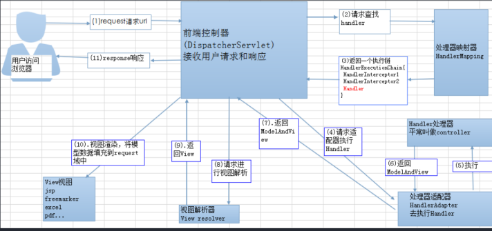

# Spring MVC

## 什么是MVC?

一种设计模式。在这种模式下，软件被分为3层，即Model（模型）、View（视图）、Controller（控制器）。

Model代表的是数据，View代表的是用户界面，Controller代表的是数据的处理逻辑，它是Model和View这两层的桥梁。将软件分层的好处是，可以将对象之间的耦合度降低，便于代码的维护。

## DAO层是做什么的？

DAO是Data Access Object的缩写，即数据访问对象，在项目中它通常作为独立的一层，专门用于访问数据库。这一层的具体实现技术有很多，常用的有Spring JDBC、Hibernate、JPA、MyBatis等，在Spring框架下无论采用哪一种技术访问数据库，它的编程模式都是统一的。

## Spring MVC的执行流程

1.  客户端（浏览器）发送请求，直接请求到 DispatcherServlet 。
2.  DispatcherServlet 根据请求信息调⽤ HandlerMapping ，解析请求对应的 Handler 。
3. 解析到对应的 Handler （也就是我们平常说的 Controller 控制器）后，开始由HandlerAdapter 适配器处理。
4. HandlerAdapter 会根据 Handler 来调⽤真正的处理器开处理请求，并处理相应的业务逻辑。
5. 处理器处理完业务后，会返回⼀个 ModelAndView 对象， Model 是返回的数据对象， View 是个逻辑上的 View 。
6. ViewResolver 会根据逻辑 View 查找实际的 View 。
7. DispaterServlet 把返回的 Model 传给 View （视图渲染）。
8. 把 View 返回给请求者（浏览器

## Spring MVC注解

@RequestMapping：

作用：该注解的作用就是用来处理请求地址映射的，也就是说将其中的处理器方法映射到url路径上。

属性：

- method：是让你指定请求的method的类型，比如常用的有get和post。
- value：是指请求的实际地址，如果是多个地址就用{}来指定就可以啦。
- produces：指定返回的内容类型，当request请求头中的Accept类型中包含指定的类型才可以返回的。
- consumes：指定处理请求的提交内容类型，比如一些json、html、text等的类型。
- headers：指定request中必须包含那些的headed值时，它才会用该方法处理请求的。
- params：指定request中一定要有的参数值，它才会使用该方法处理请求。

@RequestParam：

作用：是将请求参数绑定到你的控制器的方法参数上，是Spring MVC中的接收普通参数的注解。

属性：

- value是请求参数中的名称。
- required是请求参数是否必须提供参数，它的默认是true，意思是表示必须提供。

@RequestBody：

作用：**如果作用在方法上，就表示该方法的返回结果是直接按写入的Http responsebody中**（一般在异步获取数据时使用的注解）。

属性：required，是否必须有请求体。它的默认值是true，在使用该注解时，值得注意的当为true时get的请求方式是报错的，如果你取值为false的话，get的请求是null。

@PathVaribale：

作用：该注解是用于绑定url中的占位符，但是注意，spring3.0以后，url才开始支持占位符的，它是Spring MVC支持的rest风格url的一个重要的标志。

## Spring MVC的拦截器

#1

拦截器会对处理器进行拦截，这样通过拦截器就可以增强处理器的功能。Spring MVC中，所有的拦截器都需要实现HandlerInterceptor接口，该接口包含如下三个方法：preHandle()、postHandle()、afterCompletion()。

通过上图可以看出，Spring MVC拦截器的执行流程如下：

- 执行preHandle方法，它会返回一个布尔值。如果为false，则结束所有流程，如果为true，则执行下一步。
- 执行处理器逻辑，它包含控制器的功能。
- 执行postHandle方法。
- 执行视图解析和视图渲染。
- 执行afterCompletion方法。

Spring MVC拦截器的开发步骤如下：

1. 开发拦截器：

   实现handlerInterceptor接口，从三个方法中选择合适的方法，实现拦截时要执行的具体业务逻辑。

2. 注册拦截器：

   定义配置类，并让它实现WebMvcConfigurer接口，在接口的addInterceptors方法中，注册拦截器，并定义该拦截器匹配哪些请求路径。

## 怎么去做请求拦截？

如果是对Controller拦截，则可以使用Spring MVC的拦截器。

如果是对所有的请求（如访问静态资源的请求）进行拦截，则可以使用Filter。

如果是对除了Controller之外的其他Bean的请求进行拦截，则可以使用Spring AOP。

# 刷题笔记

可作为Spring MVC数据模型：Model、ModelMap、ModelAndView。以上述类型作为控制器的方法参数时，Spring MVC会自动实例化这些类型

拦截器是SpringMVC中的一个核心应用组件,主要用于处理多个 Controller的共性问题.当我们的请求由DispatcherServlet派发 到具体Controller之前首先要执行拦截器中一些相关方法,在这些 方法中可以对请求进行相应预处理(例如权限检测,参数验证),这些方法可以决定对这个请求进行拦截还是放行.  

服务器一启动,就会创建拦截器对象, >>对拦截器配置延迟加载是没有用的 >>拦截器是单例的,整个过程,拦截器只有一个实例对象 拦截器需要实现 HandleInterceptor接口,或者继承HandlerInterceptorAdaptor抽象类; 

HandlerInterceptor接口的三个方法: 

1,preHandle() 是拦截器最先执行的方法,是在请求到达Controller之前执行的,其实就是拦截器用于拦截请求的，三个参数,分别是request,response,handelr就是这个请求要去找的后端处理器Controller.方法的返回值是bloolean类型,如果返回为false,就说明请求在此终结,不能执行后面的代码了.如果返回值为true,那么这个拦截器就要放行,将请求交给后端处理器Controller. 

2,postHandle() 这个方法,是在后端控制器controller处理完请求之后,就执行的,这个方法,多了一个参数,ModelAndView，后端控制器controller处理请求可能需要返回页面和数据,所以会多一个ModelAndView,但是这个方法,是在渲染页面之前执行的,渲染页面是交给前端控制器来完成的. 

3,afterCompletion() 该方法在整个请求完成，即视图渲染结束之后执行。可以通过此方法实现一些资源清理、记录日志信息等工作。

在Spring MVC中实现上传功能，主要依赖MultipartHttpServletRequest从读取请求中的文件，然后对读取到的MultipartFile类型进行处理。