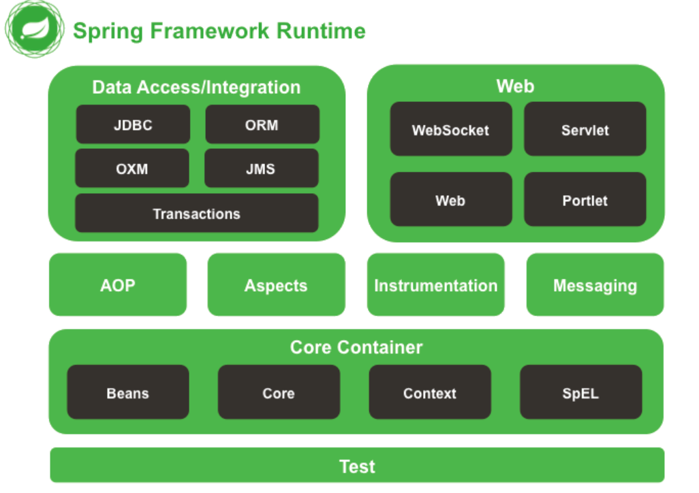

# Spring



## Spring 框架的特性

非侵入式：基于Spring开发的应用中的对象可以不依赖于Spring的API

控制反转：IOC——Inversion of Control，指的是将对象的创建权交给 Spring 去创建。使用 Spring 之前，对象的创建都是由我们自己在代码中new创建。而使用 Spring 之后。对象的创建都是给了 Spring 框架。

依赖注入：DI——Dependency Injection，是指依赖的对象不需要手动调用 setXX 方法去设置，而是通过配置赋值。

面向切面编程：Aspect Oriented Programming——AOP

容器：Spring 是一个容器，因为它包含并且管理应用对象的生命周期

组件化：Spring 实现了使用简单的组件配置组合成一个复杂的应用。在 Spring 中可以使用XML和Java注解组合这些对象。

一站式：在 IOC 和 AOP 的基础上可以整合各种企业应用的开源框架和优秀的第三方类库（实际上 Spring 自身也提供了表现层的 SpringMVC 和持久层的 Spring JDBC）


## Spring的核心？

Spring框架包含众多模块，如Core、Testing、Data Access、Web Servlet...

其中Core是整个Spring框架的核心模块。Core模块提供Ioc容器、AOP功能、数据绑定、类型转换等基础功能，这些功能都是建立在loc和AOP之上的。

核心：

- loC：

  控制反转；将对象的创建权交给 Spring 去创建而不需要我们手动new，解耦

  spring提供了一个ioc容器，这个bean容器会字段帮我们去创建对象，创建对象是通过 依赖注入DI （动态代理）实现的。可以使用java注解代码或xml配置声明要注入的bean，查找要注入的对象是通过byName或byType实现的

- AOP

  面向切面编程，AOP是一个思想，就是将与业务无关，却为业务模块所共同调用的逻辑或责任封装起来，便于减少系统的重复代码，如日志组件。aop是由动态代理如jdk动态代理（类实现接口）或cglib（类没实现接口）。


## IoC和DI？

IoC是一个思想，DI是实现方式；

**控制反转IoC(Inversion of Control)是说创建对象的控制权进行转移，以前创建对象的主动权和创建时机是由自己把控的，而现在这种权力转移到第三方**，比如转移交给了IoC容器，它就是一个专门用来创建对象的工厂，你要什么对象，它就给你什么对象，有了 IoC容器，依赖关系就变了，原先的依赖关系就没了，它们都依赖IoC容器了，通过IoC容器来建立它们之间的关系。


## DI依赖注入实现？

spring提供了一个ioc容器，这个bean容器会字段帮我们去创建对象，创建对象是通过 依赖注入DI （动态代理）实现的。可以使用java注解代码或xml配置声明要注入的bean，查找要注入的对象是通过byName或byType实现的。

3种注入方式：

- 构造方法注入
- setter方法注入
- 接口注入

## Spring容器？

两种：

- BeanFactory

  基础类型的Ioc容器，提供完整的Ioc服务支持。如果没有特殊指定，默认采用**延迟初始化**策略。

  只有当客户端对象需要访问容器中的某个受管对象的时候，才对该受管对象进行初始化与依赖注入操作。

  所以，相对来说，容器的启动初期速度快，所需资源有限。

  对于资源有限，并且功能要求不是很严格的场景，BeanFactory是Ioc容器的合适选择

- ApplicationContext

  在BeanFactory基础上构建的，除了拥有BeanFactory的所有支持外，还提供其他高级功能：事件发布、国际化信息支持等。

  管理的对象，在容器启动之后，默认全部初始化并绑定完成，相比BeanFactory，要求更多的系统资源，启动时间较长。

  对于资源充足，并且要求更多功能的场景，ApplicationContext是合适选择


## BeanFactory？

BeanFactory是一个类工厂，与传统类工厂不同，BeanFactory是类的通用工厂，可以创建并管理各种类的对象。

Spring称这些被创建和管理的Java对象为Bean。并且，Spring中所说的Bean比JavaBean更为宽泛一些，所有可以被Spring容器实例化并管理的Java类都可以成为Bean。

BeanFactory是Spring容器的顶层接口，Spring为BeanFactory提供多种实现：

- XmlBeanFactory，最常用，但是在Spring 3.2中被废弃
- XmlBeanDefinitionReader
- DefaultListableBeanFactory

BeanFactory最常用的方法就是getBean(String beanName)


注意：

@Component 和 @Bean 的区别

- @Component 注解作⽤于类

- @Bean 注解作⽤于⽅法

- @Component 通常是通过类路径扫描来⾃动侦测以及⾃动装配到Spring容器中（我们可以使⽤ @ComponentScan 注解定义要扫描的路径从中找出标识了需要装配的类⾃动装配到Spring 的 bean 容器中）

  @Bean 注解通常是我们在标有该注解的⽅法中定义产⽣这个bean, @Bean 告诉了Spring这是某个类的示例，当我需要⽤它的时候还给我。

- @Bean 注解⽐ Component 注解的⾃定义性更强，⽽且很多地⽅我们只能通过 @Bean 注解来注册bean。⽐如当我们将第三方的类变成组件，只能通过@Bean 来实现


## spring Context启动过程

 本文对spring ApplicationContext启动过程进行详细解析，介绍刷新过程中的10个阶段的作用，包括ConfigurationClassPostProcessor处理java config注入beanDefinition，注册BeanPostProcessor对所有bean的构建进行初始化，创建内嵌tomcat容器注册servlet等等。

  一张图总结spring ApplicationContext启动过程整个启动过程


## 向IoC容器种添加组件的方法？

- `@Bean`注解（适合导入自己的类、第三方jar包）

  ```java
  @Configuration 
  public class MainConfig {
   	@Bean
      public Person person() {
          return new Person();
      }
  }
  ```

- `@CompontScan(包名)`+`@Controller`、`@Service`、`@Repository`、`@Compent`组合

  - `@Component(“id”) `：通用的
  - `@Repository(“id”) `：dao层注解
  - `@Service(“id”) `：service层注解
  - `@Conroller(“id”)` ：控制器层注解

  ```java
  // 此处以SpringBoot为例
  // 1.在启动类，添加ComponentScan,指定扫描哪个包下的文件
  @SpringBootApplication
  @ComponentScan(value="com.example")   // value也可以接多个包,它是一个String[]类型
  public class DemoApplication {
  	public static void main(String[] args){
  		SpringApplication.run(DemoApplication.class, args);
  	}
  }
  // 2.在指定配置扫描的包下,在类中使用@Controller/@Service 这些注解即可
  @Controller
  public class HomeController{
  	// 这样，HomeController类也就会被扫描到 Spring IOC 容器中
  }
  ```

- `@Import`

  - 直接指定导入组件的id（全类名路径）

    ```java
    @Configuration
    @Import(value={Person.class, Car.class})
    public class MainConfig {
    	
    }	
    ```

  - 继承`ImportSelector`类，重写selectImports()方法（返回要导入IOC容器类的全类名路径）

    ```java
    // 1.定义类，实现ImportSelector类,重写selectImports()方法
    public class MyImportSelector implements ImportSelector {
    	// 可以获取导入类的注解信息
    	@Override
    	public String[] selectImports(AnnotationMetadata importingClassMetadata) {
    		return new String[]{"com.example.entity.Person"};    // 要导入IOC容器类的全类名路径
    	}
    }
    
    // 2.使用@Import方式导入
    @Configuration
    @Import(value={Person.class, Car.class, MyImportSelector.class})
    public class MainConfig {
    
    }
    ```

  - `BeanDefinitionRegister`

    ```java
    // 1.定义类，实现ImportBeanDefinitionRegistrar类,重写registerBeanDefinitions()方法
    public class MyBeanDefinitionRegister implements ImportBeanDefinitionRegistrar{
    	// 可以获取导入类的注解信息
    	@Override
    	public void registerBeanDefinitions(AnnotationMetadata importingClassMetadata, BeanDefinitionRegistry registry) {
    		//创建一个bean定义对象 
    		RootBeanDefinition rootBeanDefinition = new RootBeanDefinition(Person.class); 
    		//把bean定义对象导入到容器中 
    		registry.registerBeanDefinition("person",rootBeanDefinition);
    	}
    }
    
    // 2.使用@Import方式导入
    @Configuration
    @Import(value={Person.class, Car.class, MyBeanDefinitionRegister .class})
    public class MainConfig {
    
    }
    ```

- 实现`FactoryBean`接口实现注册 组件

  ```java
  // 1.定义MyFactoryBean类，实现FactoryBean类,重写getObject()/getObjectType()/isSingleton()方法
  public class MyFactoryBean implements FactoryBean<Person> {
  
  	// 返回bean的对象
  	@Override
  	public Person getObject() throws Exception {
  		return new Person();
  	}
  
  	// 返回bean的类型
  	@Override
  	public Class<?> getObjectType() {
  		return Person.class;
  	}
  
  	@Override
  	public boolean isSingleton() {
  		return true;
  	}
  }
  
  // 2.使用getBean()方法获取bean实例
  @SpringBootApplication
  public class DemoApplication {
  	public static void main(String[] args) {
  		SpringApplication.run(DemoApplication.class, args);
  		AnnotationConfigApplicationContext ac = new AnnotationConfigApplicationContext(MyFactoryBean.class);
  		// bean名称为类名首字母小写
  		Object bean = ac.getBean("myFactoryBean");   // 获取的是指定的bean对象
  		System.out.println(bean);
  		Object bean1 = ac.getBean("&myFactoryBean");  // 名称加个&,获取工厂bean本身对象(MyFactoryBean类)    
  		System.out.println(bean1);
  	}
  }
  ```

- xml

  1. 在beans中添加`xmlns:context=“http://www.springframework.org/schema/context”`
  2. 添加标签

  ```xml
  <context:component-scan base-package=“包名”></context:component-scan>
  ```

## 从Ioc容器中获取Bean

两种方法：

- 通过注解：`@Autowired`、`@Resource`

  @autowired和resource区别

  - 都可以用来装配bean. 都可以写在字段上,或写在setter方法上

  - @Resource 由jdk提供，默认按name注入

  - @Autowired 由spring提供，默认按type注入

- 通过SpringContext，使用getBean方法

  获取SpringContext：

  - 实现ApplicationContextAware接口，获取applicationConext

    通过ApplicationContext的静态变量applicationContext获取Bean即可。

    ```java
    @Component
    public class ApplicationContextCustom implements ApplicationContextAware {
    
        public static ApplicationContext applicationContext;
    
        public void setApplicationContext(ApplicationContext applicationContext) throws BeansException {
            System.out.println("获取ApplicationContext");
            ApplicationContextCustom.applicationContext = applicationContext;
        }
    }
    ```

  - 创建ClassPathXmlApplicationContext对象，获取applicationContext

    获取指定的xml配置中的bean（获取不到注解注入的bean）

    ```java
    ApplicationContext applicationContext =new ClassPathXmlApplicationContext("beans.xml");
    System.out.println(applicationContext.getBean("user"));
    System.out.println(applicationContext.getBean("AService"));
    ```

  - 创建AnnotationConfigApplicationContext对象，获取applicationContext

    获取@Configuration注解注释的bean（其他注解如@Component注入的找不到）

    ```java
    AnnotationConfigApplicationContext applicationContext=
        				new AnnotationConfigApplicationContext(Person.class);
    System.out.println(applicationContext.getBean("person"));
    System.out.println(applicationContext.getBean("AService"));
    ```

`getBean()`方法的三个参数：

- 根据bean的id

  ```java
  Person person=(Person) ioc.getBean("person1");
  ```

- 根据bean类型

  ```java
  Person person= ioc.getBean(Person.class);
  ```

- 根据bean的id和类型

  ```java
  Person person= ioc.getBean("person2",Person.class);
  ```

# 刷题笔记

JDK动态代理，是Java提供的动态代理对象，可以在运行时创建接口的代理实例。Spring AOP默认采用这种方式，在接口的代理实例中织入代码。CGLib动态代理，采用底层的字节码技术，在运行时创建子类的代理对象，当目标对象不存在接口时，就Spring AOP就使用这种方式，在子类实例中植入代码


＠Autowired是Spring提供的注解，它提供这样的规则：首先根据类型找到对应的Bean, 如果对应类型的 Bean 不是唯一的，那么就根据属性名称和Bean的名称进行匹配。如果匹配得上，就会使用该Bean；如果还无法匹配，就会抛出异常。

@Autowired
注入声明的SpringBean对象,根据一定的规则首先按照注入的类型去查找，如果没有找到安装注入的名称去匹配你要注入的属性名称，如果都没有找到启动项目时抛出异常，@Autowired(required = false) 表示没有找到注入对象时，不抛异常，注入null。

@Primary
如果有多个相同类型的SpringBean,我们可以使用@Primary注解,优先注入带该注解标识的类,@Primary可以在多个类上标注，那就会抛异常。

@Quelifier
使用SpringBean的名称(SpringBean的名称都是唯一的)进行注入。


BeanFactory是Spring容器的接口，FactoryBean是Spring中用于实现“工厂Bean”的接口

ApplicationContext，是BeanFactory的子接口

## 	