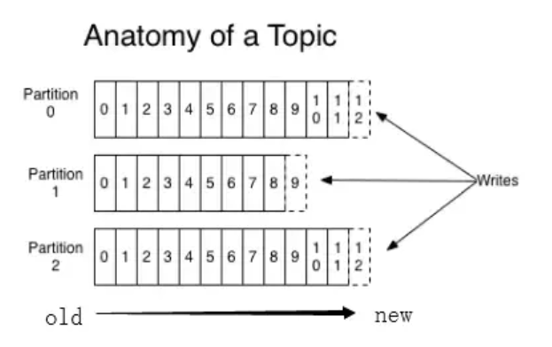
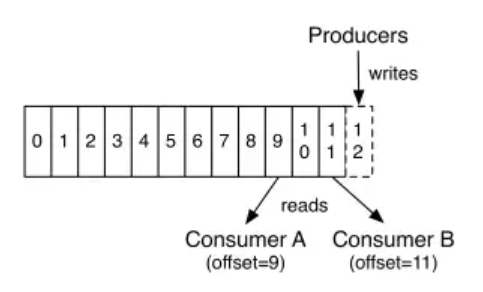
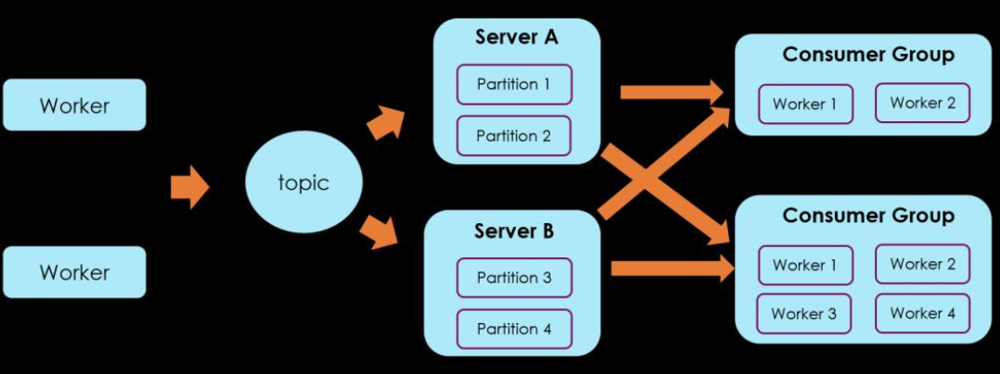
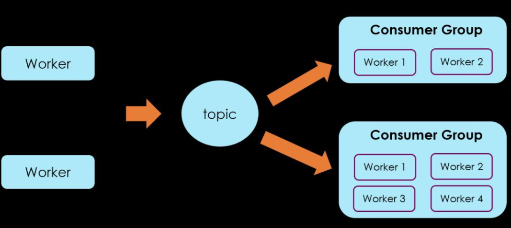
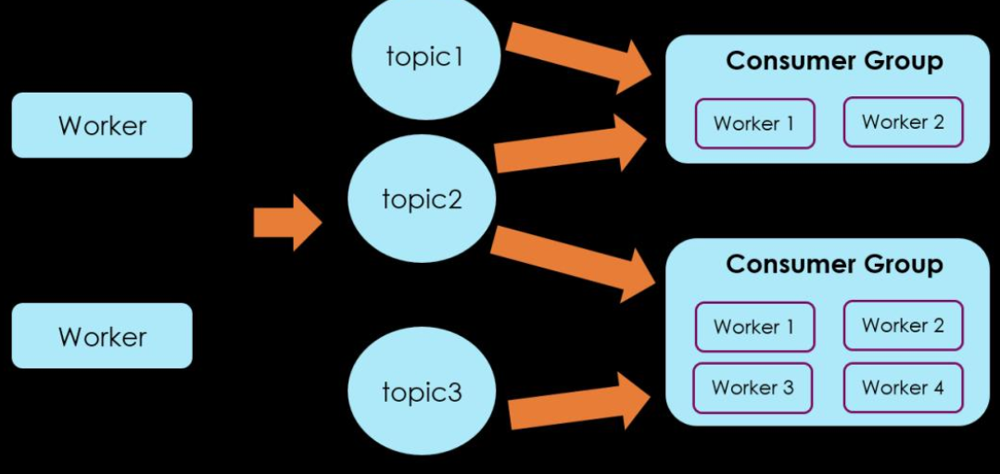
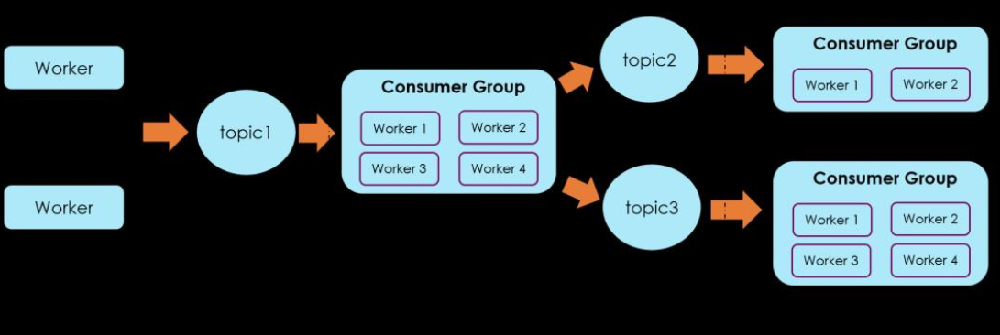

# 消息队列

### 为什么需要消息队列？

系统中出现“生产”和“消费”的速度或稳定性等因素不一致的时候，需要消息队列。消息可以非常简单，例如只包含字符串；也可以很复杂，只包含嵌入对象。消息被发送到队列中，“消息队列”是在消息的传输过程中保存消息的容器。

举几个例子：

- 业务系统触发短信发送申请，但是短信发送模块实时性不太高，需要将来不及处理的消息暂时存一下，缓冲压力。就可以把短信发送申请丢到消息队列，直接返回用户成功，短信发送模块再可以慢慢去消息队列中取消息进行处理。
- 调远程系统下订单成本较高，且因为网络等因素不稳定，攒一批一起发送。

### 消息队列的缺点？

- 降低系统可用性

  出问题影响业务

- 系统复杂性增加

  加入消息队列，需要考虑很多方面的问题，比如一致性问题、如何保证消息不被重复消费、保证消息可靠性传输等；

### 消息队列和缓存的区别？

**redis发布订阅模式用做消息队列  VS  rabbitmq**

- 可靠性

  redis：没有机制保证消息的可靠消费，如果发布者发布一条消息，没有对应的订阅者的话，消息将丢失，不会存在内存中

  rabbitmq：有消息消费确认机制，如果发布一条消息，还没有消费者消费该队列，那么消息就将一直存放在队列中，直到消费者消费了该条消息，以此保证消息的可靠消费

- 实时性

  redis实现性高，redis作为缓存服务器，所有数据都存内存

- 消费者负载均衡

  redis发布订阅模式，一个队列可以被多个消费者同时订阅，当消息到达时，会将该消息依次发送给每个订阅者，是一种消息的**广播形式**，本身不做消费者的负载均衡，因此消费效率存在瓶颈

  rabbitmq队列可以被多个消费者同时监控消费，但是每条消息只能被消费一次，因为rabbitmq的消费确认机制，因此可以根据消费者的消费能力调整它的负载

- 持久性

  redis的持久化是针对整个redis缓存的内容，有RDB和AOF持久化方式，可以将整个redis实例持久化到磁盘。

  rabbitmq每条消息都可以选择持久化，持久化粒度更小，更灵活

- 队列监控

  redis没有相应的监控平台

  rabbitmq有相应的后台监控平台，可以在平台上看到所创建队列的详细情况。

- 总结

  redis：轻量级，低延迟，高并发、低可靠性

  rabbitmq：重量级，高可靠，异步，不保证实时；rabbitmq是一个专门的AMQP协议队列，优势在于提供可靠的队列服务，可以做到异步，而redis主要用于缓存，redis的发布订阅模块，可用于实现及时性，且可靠性低的功能

### 生产消费模式 和 订阅发布模式

- 生产消费模式

  由生产者将数据源源不断推送到消息中心，由不同的消费者**自己**从消息中心取出数据做处理。在同一类别下，所有的消费者拿到的都是同样的数据。（不论是什么数据，有就拿）

- 发布订阅模式

  本质也是一种生产消费者模式，不同的是，由订阅者向消息中心指定自己对哪些数据感兴趣，发布者推送的数据经过消息中心进行分发，每个订阅者拿到的是自己感兴趣的数据。

Kafka作为消息系统的应用方法（场景：数据接入 和 事件分发）

- 数据接入（生产消费者模式）

  有一用户行为采集系统，负责从APP端采集用户点击行为数据。通常会将数据上报和数据处理分离，即App端通过REST API上报数据后，后端拿到数据后放入队列中就立即返回，而数据处理则另外使用worker从队列中取出数据来做：

  

  好处：

  - 功能分离，上报的API接口不关心数据处理功能，只负责接入数据
  - 数据缓冲，数据上报速率是不可控的，取决于用户的使用频率，采用该模式可以一定程度地缓冲数据
  - 易于扩展，在数据量大时，通过增加数据处理worker来扩展，提高处理效率

- 事件分发（订阅发布模式）

  有一电商系统，用户收藏、下单、付款等行为都是非常重要地事件，通常后端服务在完成相应地功能处理外，还需要在这些事件点上做很多其他处理动作，比如发送短信通知、记录用户积分等等。我们可以将这些额外的处理动作放到每个模块中，但这并不是优雅的实现，不利于功能解耦和代码维护。

  此时需要一个事件分发系统，在每个功能模块中将对应地事件发布出来，将对其感兴趣地处理者进行处理：

  

### 生产者消费者模型作用？

- 通过平衡生产者的生产能力和消费者的消费能力，来提升系统的运行效率
- 解耦，比如接收请求模块和处理请求模块解耦

### 消息队列有什么用？

使用场景：解耦、异步、削峰

- 解耦：生产端和消费端不需要相互依赖

  避免模块之间直接调用，将共享的数据放在消息队列中，对于新增的业务模块，只要提高该类的消息兴趣，即可订阅该类消息，对于原有系统和业务没有任何影响，降低了系统各模块的耦合度，提高系统的可扩展性

- 异步：生产端不需要等待消费端响应，直接返回，提高了响应时间和吞吐量

  很多时候应用也不想立即处理消息，允许应用把一些消息放入消息中间件中，但不立即处理它，而是之后需要的时候再慢慢处理

- 削峰：打平高峰期的流量，消费端可以以自己的速度处理，同时也无需在高峰期增加太多资源，提高资源利用率。提高消费端性能。消费端可以利用buffer等机制，做批量处理，提高效率。

  在访问量剧增的场景下，需要保证系统的平稳性。消息队列的容量可以配置很大，如果采用磁盘存储消息，几乎是“无限容量”。这样，高峰期的消息可以积压起来，在随后的时间内进行平滑处理完成，不至于让系统短时间内无法承载而导致奔溃。特别是在电商网站的秒杀抢购这种突发性流量很强的业务中。

### 生产者与消费者模式？

解耦数据的接收和处理，采用共享的数据区域。

生产者生产数据之后直接放在共享数据区域中，消费者只需要从共享的数据区域中获取数据。

共享数据区域应该具备这样的线程间并发协作的功能：

- 数据共享区已满，阻塞生产者继续生产数据
- 数据共享区为空，阻塞消费者继续消费数据

java中，实现生产者消费者问题，采用三种方式：

- 使用Object的wait/notify 的消息通知机制
- 使用lock的condition的await/signal的消息通知机制
- 使用BlockingQueue实现

### 保证顺序消费？

总结：

为什么出现这种情况？

- 需要顺序消费的消息被发到不同的消息队列
- 消费者是多线程消费消息

解决：

- 将需要保持先后顺序的消息放到同一个消息队列（根据同一个key）中（kafka就是partition，rabbitMq中就是queue），然后只用一个消费者去消费该队列
- 在消息体内添加全局有序标识来实现

在生产中经常会有一些类似报表系统这样的系统，需要做 MySQL 的 binlog 同步。比如订单系统要同步订单表的数据到大数据部门的 MySQL 库中用于报表统计分析，通常的做法是基于 Canal 这样的中间件去监听订单数据库的 binlog，然后把这些 binlog 发送到 MQ 中，再由消费者从 MQ 中获取 binlog 落地到大数据部门的 MySQL 中。

在这个过程中，可能会有对某个订单的增删改操作，比如有三条 binlog 执行顺序是增加、修改、删除。消费者愣是换了顺序给执行成删除、修改、增加，这样能行吗？肯定是不行的。不同的消息队列产品，产生消息错乱的原因，以及解决方案是不同的。下面我们以RabbitMQ、Kafka、RocketMQ为例，来说明保证顺序消费的办法。

RabbitMQ：

对于 RabbitMQ 来说，导致上面顺序错乱的原因通常是消费者是集群部署，不同的消费者消费到了同一订单的不同的消息。如消费者A执行了增加，消费者B执行了修改，消费者C执行了删除，但是消费者C执行比消费者B快，消费者B又比消费者A快，就会导致消费 binlog 执行到数据库的时候顺序错乱，本该顺序是增加、修改、删除，变成了删除、修改、增加。

RabbitMQ 的问题是由于不同的消息都发送到了同一个 queue 中，多个消费者都消费同一个 queue 的消息。解决这个问题，我们可以给 RabbitMQ 创建多个 queue，每个消费者固定消费一个 queue 的消息，生产者发送消息的时候，**同一个订单号的消息发送到同一个 queue 中**，由于同一个 queue 的消息是一定会保证有序的，那么同一个订单号的消息就只会被一个消费者顺序消费，从而保证了消息的顺序性。

Kafka：

对于 **Kafka 来说，一个 topic 下同一个 partition 中的消息肯定是有序的**，**生产者在写的时候可以指定一个 key，通过我们会用订单号作为 key，这个 key 对应的消息都会发送到同一个 partition 中，所以消费者消费到的消息也一定是有序的**。

那么为什么 Kafka 还会存在消息错乱的问题呢？问题就出在消费者身上。通常我们消费到同一个 key 的多条消息后，会使用多线程技术去并发处理来提高消息处理速度，否则一条消息的处理需要耗时几十 毫秒，1 秒也就只能处理几十条消息，吞吐量就太低了。而多线程并发处理的话，binlog 执行到数据库的时候就不一定还是原来的顺序了。

**Kafka 从生产者到消费者消费消息这一整个过程其实都是可以保证有序的，导致最终乱序是由于消费者端需要使用多线程并发处理消息来提高吞吐量**，比如消费者消费到了消息以后，开启 32 个线程处理消息，每个线程线程处理消息的快慢是不一致的，所以才会导致最终消息有可能不一致。

所以对于 Kafka 的消息顺序性保证，其实我们**只需要保证同一个订单号的消息只被同一个线程处理的就可以了**。由**此我们可以在线程处理前增加个内存队列，每个线程只负责处理其中一个内存队列的消息，同一个订单号的消息发送到同一个内存队列中即可。**

RocketMQ：

对于 RocketMQ 来说，每个 Topic 可以指定多个 MessageQueue，当我们写入消息的时候，会把消息均匀地分发到不同的 MessageQueue 中，比如同一个订单号的消息，增加 binlog 写入到 MessageQueue1 中，修改 binlog 写入到 MessageQueue2 中，删除 binlog 写入到 MessageQueue3 中。

但是当消费者有多台机器的时候，会组成一个 Consumer Group，Consumer Group 中的每台机器都会负责消费一部分 MessageQueue 的消息，所以可能消费者A消费了 MessageQueue1 的消息执行增加操作，消费者B消费了 MessageQueue2 的消息执行修改操作，消费者C消费了 MessageQueue3 的消息执行删除操作，但是此时消费 binlog 执行到数据库的时候就不一定是消费者A先执行了，有可能消费者C先执行删除操作，因为几台消费者是并行执行，是不能够保证他们之间的执行顺序的。

RocketMQ 的消息乱序是由于同一个订单号的 binlog 进入了不同的 MessageQueue，进而导致一个订单的 binlog 被不同机器上的 Consumer 处理。

要解决 RocketMQ 的乱序问题，我们只需要想办法让同一个订单的 binlog 进入到同一个 MessageQueue 中就可以了。因为同一个 MessageQueue 内的消息是一定有序的，一个 MessageQueue 中的消息只能交给一个 Consumer 来进行处理，所以 Consumer 消费的时候就一定会是有序的。

### 消息队列如何保证消息不丢/保证消息到达

丢数据一般分为两种，一种是mq把消息丢了，一种就是消费时将消息丢了。下面从rabbitmq和kafka分别说一下，丢失数据的场景。

RabbitMQ：

RabbitMQ丢失消息分为如下几种情况：

1. 生产者丢消息：

   生产者将数据发送到RabbitMQ的时候，可能在传输过程中因为网络等问题而将数据弄丢了。

2. RabbitMQ自己丢消息：

   如果没有开启RabbitMQ的持久化，那么RabbitMQ一旦重启数据就丢了。所以必须开启持久化将消息持久化到磁盘，这样就算RabbitMQ挂了，恢复之后会自动读取之前存储的数据，一般数据不会丢失。除非极其罕见的情况，RabbitMQ还没来得及持久化自己就挂了，这样可能导致一部分数据丢失。

3. 消费端丢消息：

   主要是因为消费者消费时，刚消费到还没有处理，结果消费者就挂了，这样你重启之后，RabbitMQ就认为你已经消费过了，然后就丢了数据。

针对上述三种情况，RabbitMQ可以采用如下方式避免消息丢失：

1. 生产者丢消息：

   - 可以选择使用RabbitMQ提供是事务功能，就是生产者在发送数据之前开启事务，然后发送消息，如果消息没有成功被RabbitMQ接收到，那么生产者会受到异常报错，这时就可以回滚事务，然后尝试重新发送。如果收到了消息，那么就可以提交事务。这种方式有明显的缺点，即RabbitMQ事务开启后，就会变为同步阻塞操作，生产者会阻塞等待是否发送成功，太耗性能会造成吞吐量的下降。
   - 可以开启confirm模式。在生产者那里设置开启了confirm模式之后，每次写的消息都会分配一个唯一的id，然后写入了RabbitMQ之中，RabbitMQ会给你回传一个ack消息，告诉你这个消息发送OK了。如果RabbitMQ没能处理这个消息，会回调你一个nack接口，告诉你这个消息失败了，你可以进行重试。而且你可以结合这个机制知道自己在内存里维护每个消息的id，如果超过一定时间还没接收到这个消息的回调，那么你可以进行重发。

   事务机制是同步的，你提交了一个事物之后会阻塞住，但是confirm机制是异步的，发送消息之后可以接着发送下一个消息，然后RabbitMQ会回调告知成功与否。 一般在生产者这块避免丢失，都是用confirm机制。

2. RabbitMQ自己丢消息：

   设置消息持久化到磁盘，设置持久化有两个步骤：

   - 创建queue的时候将其设置为持久化的，这样就可以保证RabbitMQ持久化queue的元数据，但是不会持久化queue里面的数据。
   - 发送消息的时候将消息的deliveryMode设置为2，这样消息就会被设为持久化方式，此时RabbitMQ就会将消息持久化到磁盘上。 必须要同时开启这两个才可以。

   而且持久化可以跟生产的confirm机制配合起来，只有消息持久化到了磁盘之后，才会通知生产者ack，这样就算是在持久化之前RabbitMQ挂了，数据丢了，生产者收不到ack回调也会进行消息重发。

3. 消费端丢消息：

   使用RabbitMQ提供的ack机制，首先关闭RabbitMQ的自动ack，然后每次在确保处理完这个消息之后，在代码里手动调用ack。这样就可以避免消息还没有处理完就ack。

Kafka：

Kafka丢失消息分为如下几种情况：

1. 生产者丢消息：

   生产者没有设置相应的策略，发送过程中丢失数据。

2. Kafka自己丢消息：

   比较常见的一个场景，就是Kafka的某个broker宕机了，然后重新选举partition的leader时。如果此时follower还没来得及同步数据，leader就挂了，然后某个follower成为了leader，它就少了一部分数据。

3. 消费端丢消息：

   消费者消费到了这个数据，然后消费之自动提交了offset，让Kafka知道你已经消费了这个消息，当你准备处理这个消息时，自己挂掉了，那么这条消息就丢了。

针对上述三种情况，Kafka可以采用如下方式避免消息丢失：

1. 生产者丢消息：

   关闭自动提交offset，在自己处理完毕之后手动提交offset，这样就不会丢失数据。

2. Kafka自己丢消息：

   一般要求设置4个参数来保证消息不丢失：

   - 给topic设置 replication.factor 参数，这个值必须大于1，表示要求每个partition必须至少有2个副本。
   - 在kafka服务端设置 min.isync.replicas 参数，这个值必须大于1，表示 要求一个leader至少感知到有至少一个follower在跟自己保持联系正常同步数据，这样才能保证leader挂了之后还有一个follower。
   - 在生产者端设置 acks=all ，表示 要求每条每条数据，必须是写入所有replica副本之后，才能认为是写入成功了。
   - 在生产者端设置 retries=MAX (很大的一个值)，表示这个是要求一旦写入事变，就无限重试。

3. 消费端丢消息：

   如果按照上面设置了ack=all，则一定不会丢失数据，要求是，你的leader接收到消息，所有的follower都同步到了消息之后，才认为本次写成功了。如果没满足这个条件，生产者会自动不断的重试，重试无限次。

### 消息队列如何保证不重复消费？

总结：什么情况下出现重复消费？消费的消费了数据但是发生错误重启没来得及提交offset。如何避免：写数据库：**消费端去数据库查询，有这条数据就不执行或直接updata；其他情况：每条数据分配一个全局id，消费端根据id判断是否消费过**

先大概说一说可能会有哪些重复消费的问题。首先就是比如rabbitmq、rocketmq、kafka，都有可能会出现消费重复消费的问题，正常。因为这问题通常不是mq自己保证的，是给你保证的。然后我们挑一个kafka来举个例子，说说怎么重复消费吧。

kafka实际上有个offset的概念，就是每个消息写进去，都有一个offset，代表他的序号，然后consumer消费了数据之后，每隔一段时间，会把自己消费过的消息的offset提交一下，代表我已经消费过了，下次我要是重启啥的，你就让我继续从上次消费到的offset来继续消费吧。

但是凡事总有意外，比如我们之前生产经常遇到的，就是你有时候重启系统，看你怎么重启了，如果碰到点着急的，直接kill进程了，再重启。这会导致consumer有些消息处理了，但是没来得及提交offset，尴尬了。重启之后，少数消息会再次消费一次。

其实重复消费不可怕，可怕的是你没考虑到重复消费之后，怎么保证幂等性（用户对于同一操作发起的一次请求或者多次请求的结果是一致的,不会因为多次点击而产生了副作用）。举个例子,假设你有个系统，消费一条往数据库里插入一条，要是你一个消息重复两次，你不就插入了两条，这数据不就错了？但是你要是消费到第二次的时候，自己判断一下已经消费过了，直接扔了，不就保留了一条数据？

一条数据重复出现两次，数据库里就只有一条数据，这就保证了系统的幂等性幂等性。通俗点说，就一个数据，或者一个请求，给你重复来多次，你得确保对应的数据是不会改变的，不能出错。

想要保证不重复消费，其实还要结合业务来思考，这里给几个思路：

1. 比如你拿个数据要写库，你先根据主键查一下，如果这数据都有了，你就别插入了，update一下。
2. 比如你是写redis，那没问题了，反正每次都是set，天然幂等性。
3. 比如你不是上面两个场景，那做的稍微复杂一点，你需要让生产者发送每条数据的时候，里面加一个全局唯一的id，类似订单id之类的东西，然后你这里消费到了之后，先根据这个id去比如redis里查一下，之前消费过吗？如果没有消费过，你就处理，然后这个id写redis。如果消费过了，那你就别处理了，保证别重复处理相同的消息即可。

还有比如基于数据库的唯一键来保证重复数据不会重复插入多条，我们之前线上系统就有这个问题，就是拿到数据的时候，每次重启可能会有重复，因为kafka消费者还没来得及提交offset，重复数据拿到了以后我们插入的时候，因为有唯一键约束了，所以重复数据只会插入报错，不会导致数据库中出现脏数据。

### MQ处理消息失败了怎么办？

一般生产环境中，都会在使用MQ的时候设计两个队列：一个是核心业务队列，一个是死信队列。**核心业务队列**，就是比如专门用来让订单系统发送订单消息的，然后另外一个**死信队列**就是用来处理异常情况的。

比如说要是第三方物流系统故障了，此时无法请求，那么仓储系统每次消费到一条订单消息，尝试通知发货和配送，都会遇到对方的接口报错。此时仓储系统就可以把这条消息拒绝访问，或者标志位处理失败！注意，这个步骤很重要。

**一旦标志这条消息处理失败了之后，MQ就会把这条消息转入提前设置好的一个死信队列中**。然后你会看到的就是，在第三方物流系统故障期间，所有订单消息全部处理失败，全部会转入死信队列。然后你的仓储系统得专门有一个后台线程，监控第三方物流系统是否正常，能否请求的，不停的监视。一旦发现对方恢复正常，这个后台线程就从死信队列消费出来处理失败的订单，重新执行发货和配送的通知逻辑。死信队列的使用，其实就是MQ在生产实践中非常重要的一环，也就是架构设计必须要考虑的。

### 消息队列推和拉的使用场景

推模式：

推模式是服务器端根据用户需要，由目的、按时将用户感兴趣的信息主动发送到用户的客户端。

优点：

- 对用户要求低，方便用户获取需要的信息；
- 及时性好，服务器端及时地向客户端推送更新动态信息，吞吐量大。

缺点：

- 不能确保发送成功，推模式采用广播方式，只有服务器端和客户端在同一个频道上，推模式才有效，用户才能接收到信息；
- 没有信息状态跟踪，推模式采用开环控制技术，一个信息推送后的状态，比如客户端是否接收等，无从得知；
- 针对性较差。推送的信息可能并不能满足客户端的个性化需求。

拉模式：

拉模式是客户端主动从服务器端获取信息。

优点：

- 针对性强，能满足客户端的个性化需求；
- 信息传输量较小，网络中传输的只是客户端的请求和服务器端对该请求的响应；
- 服务器端的任务轻。服务器端只是被动接收查询，对客户端的查询请求做出响应。

缺点：

- 实时性较差，针对于服务器端实时更新的信息，客户端难以获取实时信息；
- 对于客户端用户的要求较高，需要对服务器端具有一定的了解。

###  RabbitMQ和Kafka有什么区别？

在实际生产应用中，通常会使用Kafka作为消息传输的数据管道，**RabbitMQ作为交易数据作为数据传输管道，主要的取舍因素则是是否存在丢数据的可能。RabbitMQ在金融场景中经常使用，具有较高的严谨性，数据丢失的可能性更小，同时具备更高的实时性**。而Kafka优势主要体现在吞吐量上，虽然可以通过策略实现数据不丢失，但从严谨性角度来讲，大不如RabbitMQ。而且由于Kafka保证每条消息最少送达一次，有较小的概率会出现数据重复发送的情况。详细来说，它们之间主要有如下的区别：

1. 应用场景方面

   RabbitMQ：用于实时的，对可靠性要求较高的消息传递上。（金融）

   Kafka：用于处于活跃的流式数据，大数据量的数据处理上。

2. 架构模型方面

   RabbitMQ：以broker为中心，有消息的确认机制。

   Kafka：以consumer为中心，没有消息的确认机制。

3. 吞吐量方面

   RabbitMQ：支持消息的可靠的传递，支持事务，不支持批量操作，基于存储的可靠性的要求存储可以采用内存或硬盘，吞吐量小。

   Kafka：内部采用消息的批量处理，数据的存储和获取是本地磁盘顺序批量操作，消息处理的效率高，吞吐量高。

4. 集群负载均衡方面

   RabbitMQ：本身不支持负载均衡，需要loadbalancer的支持。

   Kafka：**采用zookeeper对集群中的broker**，consumer进行管理，可以注册topic到zookeeper上，通过zookeeper的协调机制，producer保存对应的topic的broker信息，可以随机或者轮询发送到broker上，producer可以基于语义指定分片，消息发送到broker的某个分片上。

###  Kafka为什么速度快？

Kafka的消息是保存或缓存在磁盘上的，一般认为在磁盘上读写数据是会降低性能的，因为寻址会比较消耗时间，但是实际上，Kafka的特性之一就是高吞吐率。即使是普通的服务器，Kafka也可以轻松支持每秒百万级的写入请求，超过了大部分的消息中间件，这种特性也使得Kafka在日志处理等海量数据场景广泛应用。

下面从数据写入和读取两方面分析，为什么Kafka速度这么快：

写入数据：

**Kafka会把收到的消息都写入到硬盘中，它绝对不会丢失数据。为了优化写入速度Kafka采用了两个技术，顺序写入和MMFile 。**

一、顺序写入

磁盘读写的快慢取决于你怎么使用它，也就是顺序读写或者随机读写。在顺序读写的情况下，磁盘的顺序读写速度和内存持平。因为硬盘是机械结构，每次读写都会寻址->写入，其中寻址是一个“机械动作”，它是最耗时的。所以硬盘最讨厌随机I/O，最喜欢顺序I/O。为了提高读写硬盘的速度，Kafka就是使用顺序I/O。

而且Linux对于磁盘的读写优化也比较多，包括read-ahead和write-behind，磁盘缓存等。如果在内存做这些操作的时候，一个是JAVA对象的内存开销很大，另一个是随着堆内存数据的增多，JAVA的GC时间会变得很长，使用磁盘操作有以下几个好处：

1. 磁盘顺序读写速度超过内存随机读写；
2. JVM的GC效率低，内存占用大。使用磁盘可以避免这一问题；
3. 系统冷启动后，磁盘缓存依然可用。

下图就展示了Kafka是如何写入数据的， 每一个Partition其实都是一个文件 ，收到消息后Kafka会把数据插入到文件末尾（虚框部分）：

这种方法有一个缺陷——没有办法删除数据 ，所以Kafka是不会删除数据的，它会把所有的数据都保留下来，每个消费者（Consumer）对每个Topic都有一个offset用来表示读取到了第几条数据 。

二、Memory Mapped Files

即便是顺序写入硬盘，硬盘的访问速度还是不可能追上内存。所以Kafka的数据并不是实时的写入硬盘 ，它充分利用了现代操作系统分页存储来利用内存提高I/O效率。Memory Mapped Files(后面简称mmap)也被翻译成 内存映射文件，在64位操作系统中一般可以表示20G的数据文件，它的工作原理是直接利用操作系统的Page来实现文件到物理内存的直接映射。完成映射之后你对物理内存的操作会被同步到硬盘上（操作系统在适当的时候）。

通过mmap，进程像读写硬盘一样读写内存（当然是虚拟机内存），也不必关心内存的大小有虚拟内存为我们兜底。使用这种方式可以获取很大的I/O提升，省去了用户空间到内核空间复制的开销（调用文件的read会把数据先放到内核空间的内存中，然后再复制到用户空间的内存中。）

但也有一个很明显的缺陷——不可靠，写到mmap中的数据并没有被真正的写到硬盘，操作系统会在程序主动调用flush的时候才把数据真正的写到硬盘。Kafka提供了一个参数——producer.type来控制是不是主动flush，如果Kafka写入到mmap之后就立即flush然后再返回Producer叫 同步 (sync)；写入mmap之后立即返回Producer不调用flush叫异步 (async)。

读取数据：

一、基于sendfile实现Zero Copy

传统模式下，当需要对一个文件进行传输的时候，其具体流程细节如下：

- 调用read函数，文件数据被copy到内核缓冲区；
- read函数返回，文件数据从内核缓冲区copy到用户缓冲区；
- write函数调用，将文件数据从用户缓冲区copy到内核与socket相关的缓冲区；
- 数据从socket缓冲区copy到相关协议引擎。

以上细节是传统read/write方式进行网络文件传输的方式，我们可以看到，在这个过程当中，文件数据实际上是经过了四次copy操作：硬盘->内核buf->用户buf->socket相关缓冲区->协议引擎。而sendfile系统调用则提供了一种减少以上多次copy，提升文件传输性能的方法。

在内核版本2.1中，引入了sendfile系统调用，以简化网络上和两个本地文件之间的数据传输。sendfile的引入不仅减少了数据复制，还减少了上下文切换。运行流程如下：

- sendfile系统调用，文件数据被copy至内核缓冲区；
- 再从内核缓冲区copy至内核中socket相关的缓冲区；
- 最后再socket相关的缓冲区copy到协议引擎。

相较传统read/write方式，2.1版本内核引进的sendfile已经减少了内核缓冲区到user缓冲区，再由user缓冲区到socket相关缓冲区的文件copy，而在内核版本2.4之后，文件描述符结果被改变，sendfile实现了更简单的方式，再次减少了一次copy操作。

在Apache、Nginx、lighttpd等web服务器当中，都有一项sendfile相关的配置，使用sendfile可以大幅提升文件传输性能。Kafka把所有的消息都存放在一个一个的文件中，当消费者需要数据的时候Kafka直接把文件发送给消费者，配合mmap作为文件读写方式，直接把它传给sendfile。

二、批量压缩

在很多情况下，系统的瓶颈不是CPU或磁盘，而是网络IO，对于需要在广域网上的数据中心之间发送消息的数据流水线尤其如此。进行数据压缩会消耗少量的CPU资源,不过对于kafka而言,网络IO更应该需要考虑。

- 如果每个消息都压缩，但是压缩率相对很低，所以Kafka使用了批量压缩，即将多个消息一起压缩而不是单个消息压缩；
- Kafka允许使用递归的消息集合，批量的消息可以通过压缩的形式传输并且在日志中也可以保持压缩格式，直到被消费者解压缩；
- Kafka支持多种压缩协议，包括Gzip和Snappy压缩协议。

总结：

Kafka速度的秘诀在于，它把所有的消息都变成一个批量的文件，并且进行合理的批量压缩，减少网络IO损耗，通过mmap提高I/O速度，写入数据的时候由于单个Partion是末尾添加所以速度最优。读取数据的时候配合sendfile直接暴力输出。

# Kafka

Kafka是一个分布式流数据系统，使用Zookeeper进行集群的管理。

与其他消息系统类似，整个系统由生产者、Broker Server和消费者三部分组成，生产者和消费者由开发人员编写，通过API连接到Broker Server进行数据操作。我们重点关注三个概念：

- Topic

  是Kafka下消息的类别，类似于RabbitMQ中的Exchange的概念。这是逻辑上的概念，用来区分、隔离不同的消息数据，屏蔽了底层复杂的存储方式。对于大多数人来说，在开发的时候只需要关注数据写入到了哪个topic、从哪个topic取出数据。

- Partition

  是**Kafka下数据存储的基本单元**，这个是物理上的概念。同一个topic的数据，会被分散的存储到多个partition中，这些partition可以在同一台机器上，也可以是在多台机器上，比如下图所示的topic就有4个partition，分散在两台机器上。这种方式在大多数分布式存储中都可以见到，比如MongoDB、Elasticsearch的分片技术，其优势在于：有利于水平扩展，避免单台机器在磁盘空间和性能上的限制，同时可以通过复制来增加数据冗余性，提高容灾能力。为了做到均匀分布，通常partition的数量通常是Broker Server数量的整数倍。

- Consumer Group

  同样是逻辑上的概念，是Kafka实现单播和广播两种消息模型的手段。同一个topic的数据，会广播给不同的group；同一个group中的worker，只有一个worker能拿到这个数据。换句话说，对于同一个topic，每个group都可以拿到同样的所有数据，但是数据进入group后只能被其中的一个worker消费。group内的worker可以使用多线程或多进程来实现，也可以将进程分散在多台机器上，worker的数量通常不超过partition的数量，且二者最好保持整数倍关系，因为Kafka在设计时假定了一个partition只能被一个worker消费（同一group内）。

**生产消费者模式**

搞清楚了Kafka的基本概念后，我们来看如何设计生产消费者模式来实现上述的“数据接入”场景。在下图中，由Producer负责接收前端上报的数据，投递到对应的topic中（这里忽略了Broker Server的细节），在Consumer端，所有对该数据感兴趣的业务都可以建立自己的group来消费数据，至于group内部开多少个worke来消费完全取决于数据量和业务的实时性要求了。

**订阅发布模式**

再来看“事件分发”的场景，假如我们有“收藏”、“下单”、“付款”三个事件，业务一对“收藏”和“下单”事件感兴趣，而业务二对“下单”和“付款”事件感兴趣，那么我们如何进行事件订阅？不同于RabbitMQ中有数据路由机制（routing key），可以将感兴趣的事件绑定到自己的Queue上，Kafka只提供了单播和广播的消息模型，无法直接进行消费对象的绑定，所以理论上Kafka是不适合做此种场景下的订阅发布模式的，如果一定要做，有这么几个方案：

- 方案一：继续使用上述生产消费者的模式，在不同的group中过滤出自己感兴趣的事件数据，然后进行处理。这种方式简单有效，缺点就是每个group都会收到很多自己不感兴趣的垃圾数据。
- 方案二：把每个事件的数据推送到不同的topic中，即以事件名称来作为topic分类，在Consumer端，建立自己的group来消费自己感兴趣的一组topic。这种方式适用于事件个数可以明确评估并且数量较少，如果事件种类很多，会导致topic的数量过多，创建过多的topic和partition则会影响到Kafka的性能，因为Kafka的每个Topic、每个分区都会对应一个物理文件，当Topic数量增加时，消息分散的落盘策略会导致磁盘IO竞争激烈成为瓶颈。

- 方案三：采用流处理方式对数据进行分类，即增加一个中间数据流处理，将数据按照订阅规则进行归类，然后写入不同的topic中，在Consumer端，每个group可以拿到仅仅是自己感兴趣的数据。这种方式适用于数据量较大、但是Consumer端的消费group有限的情况，否则也会出现上述的topic碎片化的问题。
- 方案四：自己做partition的分配，但是不容易控制，应尽量避免。

