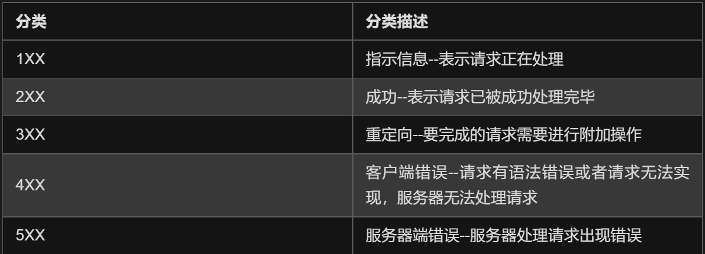
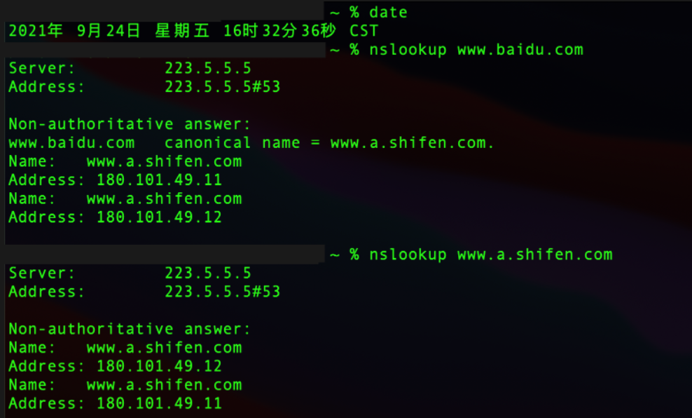

# 计算机网络

> 不必太纠结每个知识点，别钻牛角尖，也别太求完美，注重发散的思维结合实际应用。因为面试官也不可能知道每一个知识点，都是大体上能答有就行，整个过程就是看运气的

# 网络安全

## CSRF攻击？

CSRF（Cross-Site request forgery）代表跨站请求伪造。是一种攻击，迫使最终用户在当前通过身份验证的Web应用程序上执行不需要的操作。

CSRF攻击专门针对状态改变请求，而不是数据窃取，因为攻击者无法查看对伪造请求的响应。

## CC攻击？DDOS攻击？

- CC攻击：主要用来攻击页面， 模拟多个用户不停的对你的页面进行访问，从而使系  统资源消耗殆尽

- DOSS攻击：分布式拒绝服务攻击，指借助服务器技术将多个计算机联合起来作为攻击平台，来对一个或多个目标发动DDOS攻击。

  DDoS 攻击主要有两种形式

  - 流量攻击

    主要针对网络带宽，攻击者和已受害主机同时发起大量攻击**导致网络带宽被阻塞，从而淹没合法的网络数据包**；

  - 资源耗尽攻击

    后者主要针对服务器进行攻击，大量的攻击包会使得**服务器资源耗尽**或者 CPU 被内核应用程序占满从而无法提供网络服务。

  常见的 DDos 攻击

  - TCP 洪水攻击（SYN Flood）          

  - 放射性攻击（DrDos）

  - CC 攻击（HTTP Flood）

防CC、DDOS攻击：

- 用硬件防火墙做流量清洗，将攻击流量引入黑洞

# 应用层

## RPC和HTTP区别？使用场景？

- 传输协议：

  RPC基于TCP协议，也基于HTTP协议；

  HTTP基于HTTP协议

- 传输效率：

  RPC使用自定义的TCP协议，可以有编码为二进制和压缩，使请求报文体积更小且安全。HTTP2.0也可以减少报文体积的大小，提高传输效率

  HTTP1.0或1.1，请求中会包含很多无用的内容；

  HTTP2.0简单封装一下可以作为一个RPC来使用，此时标准RPC框架更多的是服务治理

- 性能消耗

  RPC主要在序列化和反序列化的耗时，可以基于thrift实现高效的二进制传输

  HTTP大部分是通过json来实现的，字节大小和序列化耗时都比thrift要消耗性能。

- 服务治理

  下游服务新增，重启，下线如何影响上游调用者

  RPC可以做到自动通知，不影响上游

  HTTP需要事先通知，修改Nginx/HAProxy配置

总结：RPC主要用于公司内部的服务调用，性能消耗低，传输效率高，服务治理方便。HTTP主要用于对外的异构环境，浏览器接口调用，APP接口调用，第三方接口调用等；

## HTTP协议？

报文结构、断点续传、多线程下载、什么是长连接

WHAT？

- 超文本传输协议，用于从万维网（www）服务器传输超文本到本地服务器的传输协议。是一个属于应用层的面向对象的协议

- HTTP是一个基于TCP/IP通信协议来出传输数据（HTML文本、图片文件、查询结果等）

- HTTP协议工作于客户端-服务端架构上。浏览器作为HTTP客户端通过URL向WEB服务器发送所有请求。WEB服务器根据收到的请求后，向客户端发送响应信息。

特点？

- 简单快速

  客户端向服务器请求服务时，只需传送请求方法和路径。请求方法常用的有GET、HEAD、POST。每种方法规定了客户端于服务器联系的类型不同。由于HTTP协议简单，使得HTTP服务器的程序规模小，因而通信速度很快

- 灵活

  HTTP允许传输任意类型的数据对象。正在传输的类型由Content-Type加以标记

- 无连接

  无连接的含义是限制每次连接只处理一个请求。服务器处理完客户端的请求，并收到客户端的应答后，即断开连接。采用这种方式可以节省传输时间

- 无状态

  无状态是指协议对于事务治理没有记忆能力。缺少状态意味着如果后续处理需要前面的信息，则它必须重传，这样可能导致每次连接传送的数据量增大。另一方面，在服务器不需要先前的信息时它的应答就较快

- 支持B/S及C/S模式

## GET和POST区别？

HTTP的基本方法：

| 方法         | 作用                             |
| ------------ | -------------------------------- |
| GET（查）    | 仅从服务器上获取资源             |
| POST（改）   | 向服务器提交数据，涉及到数据更新 |
| PUT（增）    | 向服务器添加数据                 |
| DELETE（删） | 删除服务器数据                   |

GET和POST区别

|                    | GET                                                          | POST                                                         |
| ------------------ | ------------------------------------------------------------ | ------------------------------------------------------------ |
| 安全性             | 数据放在HTTP包头（URL之后），不安全                          | 数据放在HTTP正文，安全                                       |
| 数据长度限制       | URL中的数据最多时2048字节（HTTP没有对URL长度进行限制，这个限制时浏览器或服务器添加的，目的是保证服务器和浏览器能够正常运行，防止恶意请求） | 无限制                                                       |
| 效率               | 高（GET是form提交的默认方法）                                | 较高                                                         |
| 产生的TCP数据包    | 1个，HTTP Header和data一并发出，服务器响应200（返回数据）    | 2个，先发送Header，服务器响应100 continue，继续发送data，服务器响应200（返回数据） |
| Form表单数据集的值 | ASCII字符集                                                  | 整个ISO10646字符集                                           |

## 影响一个 HTTP 网络请求的因素？

答：主要有两个：带宽和延迟。
1）带宽：带宽是指在单位时间（一般指的是1秒钟）内能传输的数据量。网络和高速公路类似，带宽越大，就类似高速公路的车道越多，其通行能力越强。目前带宽已经不是我们需要担心的。
2）延迟：

- 浏览器延迟：不了解（浏览器对于同一个域名，同时只能有 4 个连接）
- DNS查询：浏览器需要解析域名后直到服务器地址才能和服务器建立连接。解析域名的这个系统叫DNS，可以利用DNS缓存来减少解析时间

- 建立连接：HTTP是应用层协议，需要基于TCP协议。TCP建立连接需要三次握手，需要消耗较多时间

## HTTP1.0、HTTP1.1 和 HTTP2.0 的区别？

答：从名字上看，可以说是版本上的升级

HTTP1.0和HTTP1.1的区别（新特性：缓存策略、宽带优化range、错误通知、Host头、长连接）
1）.缓存处理：header中，HTTP1.0的缓存标准是If-Modified-Since、Expire。而HTTP1.1引入更多缓存策略如If-UnModified-Since等
2）.宽带优化和网络连接的使用：HTTP1.0存在客户端只需要资源的某一部分而服务端把整个资源都传了过来。而HTTP1.1在请求头中引入range，允许请求资源的某一部分，返回代码206
3）错误上的通知：HTTP1.1新增很多错误响应代码，如410（GONE）表示服务器上某个资源被永久性删除了
4）Host头：随着虚拟主机技术的发展，现在一台物理服务器上可以存在多个虚拟主机，共享一个IP地址，而HTTP1.0请求消息头中URL没有传递主机名，认为每一个服务器都绑定一个唯一地址（参考rpc项目的version）；而HTTP1.1的请求消息头有HOST头域，没有的话会报一个400 Bad Request
5）长连接：HTTP1.1支持长连接和请求流水线（pipeline），在一个TCP连接上可以传送多个HTTP请求和响应，减少了建立连接和关闭连接的消耗。长连接默认开启，用keep-alive指定。

HTTP1.1和HTTP2.0区别（新特性）（二进制格式、共享连接（多路复用）、header压缩、服务端推送）
1）新二进制格式：HTTP1.0和HTTP1.1的解析是基于文本的。而HTTP2.0解析是基于二进制格式的，使用场景更广；
2）多路复用：共享连接，每一个request请求都是tcp连接共享的，一个request对应一个id，一个连接上可以有多个request，每个连接的request混在一起，接收方根据request id把request归并到不同的服务端请求里；（解决浏览器阻塞问题）
3）header压缩：HTTP的header中有大量信息，HTTP2.0使用encoder来减少传输的header的大小；
4）服务推送：（不了解）HTTP2.0具有server push功能

## HTTPS与HTTP的一些区别

答：加密、端口、CA、响应速度
1）HTTPS协议需要CA申请证书，一般需要交费
2）HTTP是建立在TCP上的，所有传输都是明文，HTTPS运行在SSL/TSL之上，SSL/TSL运行在TCP之上，所有传输内容都是经过加密的。
3）HTTP和HTTPS使用是完全不同的连接方式，用的端口也不一样，HTTP是80端口，HTTPS是443
4）HTTP 页面响应比 HTTPS 快，主要因为 HTTP 使用 3 次握手建立连接，客户端和服务器需要握手 3 次，而 HTTPS 除了 TCP 的 3 次握手，还需要经历一个 SSL 协商过程。
https://www.cnblogs.com/heluan/p/8620312.html

## 了解SSL 和 TLS 吗？（有什么用，底层原理？）

HTTPS的安全是建立在SSL和TLS之上的，实现对通信数据进行加密。解决了HTTP数据透明的问题。
SSL/TSL的工作原理：
核心是非对称加密。非对称加密采用两个密钥，一个公钥和一个私钥。一般在通信的时候，私钥保存在服务器（解密者），公钥是公开，我们发送一个用公钥加密的消息，只有持有私钥的服务器才能解密。
但是一般，非对称加密需要和对称加密一起使用，对称加密就是通信双方共有一个密钥，而这个密钥需要我们用非对称加密，这样保证对称加密的密钥不被窃听。
为了保证公钥的正规性，一般我们需要一个第三方信赖机构CA。CA会给各个服务器颁发证书，证书存储在服务器，并有CA签名。客户端发送HTTPS请求的时候获得到的是一个CA证书，客户端检测证书合法性，不合法就发送错误。而公钥是保存在CA证书上的

## HTTPS原理？

- 第一次HTTP请求：
  - 客户端请求SSL连接，并将自己支持的加密发给网站。
  - 服务端将自己的身份信息以证书形式发回给客户端。证书里面包含了网站地址，加密公钥，以及证书的颁发机构。

- 第二次HTTP请求
  - 获得证书后，客户端做以下工作检验证书的合法性。如果证书受信任，客户端会生成一串随机数的密码，并用证书提供的公钥进行加密。将加密好的随机数发给服务器。

- 服务器用自己的私钥进行解密，得到这个随机数后，将这个随机数作为对称加密的密钥

- 服务器和客户端之间就可以用随机数对各自信息进行加密，解密。（对称加密）

总结：客户端请求——服务端发送证书（公钥）——客户端验证证书，并生成随机数，通过公钥加密后发送给服务端——服务端用私钥解密出随机数———对称加密传输数据

## DNS用到哪些协议？

- 进行区域传输时：TCP(数据同步：传输数据量大、传输可靠性)；其他时候：UDP（无3次握手，传输快，DNS服务器负载低）

  DNS的规范规定了2种类型的DNS服务器，一个叫主DNS服务器，一个叫辅助DNS服务器。在一个区中主DNS服务器从自己本机的数据文件中读取该区的DNS数据信息，而辅助DNS服务器则从区的主DNS服务器中读取该区的DNS数据信息。当一个辅助DNS服务器启动时，它需要与主DNS服务器通信，并加载数据信息，这就叫做区传送（zone transfer）。 

- 为什么既使用TCP又使用UDP？（传输限制小选TCP、连接速度快选UDP）

  UDP报文的最大长度为512字节，而TCP则允许报文长度超过512字节。当DNS查询超过512字节时，协议的TC标志出现删除标志，这时则使用TCP发送。通常传统的UDP报文一般不会大于512字节。 

  - 区域传送时使用TCP，主要有以下两点考虑：

    - 辅域名服务器会定时（一般时3小时）向主域名服务器进行查询以便了解数据是否有变动。如有变动，则会执行一次区域传送，进行数据同步。区域传送将使用TCP而不是UDP，因为数据**同步传送的数据量比一个请求和应答的数据量要多得多**。 
    - TCP是一种可靠的连接，保证了数据的准确性。 

  - 域名解析时使用UDP协议： 

    客户端向DNS服务器查询域名，一般返回的内容都不超过512字节，用UDP传输即可。不用经过TCP三次握手，这样DNS服务器负载更低，响应更快。虽然从理论上说，客户端也可以指定向DNS服务器查询的时候使用TCP，但事实上，很多DNS服务器进行配置的时候，仅支持UDP查询包。

## Session、Cookie和Token的区别？

HTTP协议是无状态的，如何判断用户的身份状态，我们用到：

- Cookie

  Cookie是由服务器保存在用户浏览器上的小文件（key-value格式），包含用户相关信息。

  客户端向服务器发起请求，如果服务器需要记录改用户状态，就使用response向客户端浏览器颁发一个Cookie。客户端会把Cookie保存起来。当浏览器再请求该网站时，浏览器把请求的url连同该cookie一同交给服务器。服务器检查该Cookie来辨别用户身份。

- Session

  Session是依赖Cookie实现的。session是服务器端对象。session是基于浏览器和服务器会话过程中，服务器分配的一块存储空间。

  服务器默认为浏览器在cookie中设置session id，浏览器在向服务器请求过程中传输cookie包含session id，服务器根据session id获取会话中存储的信息，然后确定会话中的身份信息。

- Token

  客户端频繁向服务器请求数据，服务器频繁的去数据库查询用户名和密码进行对比，判断正确与否，并做出相应提示，于是token便出现了

  Token是服务端生成的一串字符串，以作为客户端请求的一个令牌，当第一次登录后，服务器生成一个Token，将其返回给客户端，以后客户端只需带上这个Token来请求数据即可，无需再次带上用户名和密码。

  使用Token的目的：减轻服务器压力，减少频繁的查询数据库，使服务器更加健壮。

  |                | Session                                                      | Cookie                                                       | Token                                                        |
  | -------------- | ------------------------------------------------------------ | ------------------------------------------------------------ | ------------------------------------------------------------ |
  | 生成           | 服务器生成                                                   | 服务器生成，并给浏览器颁发                                   | 服务器生成，返回给客户端                                     |
  | 行为           | 服务器分配的一块存储空间。服务器默认为浏览器在cookies设置一个session id，浏览器在向服务器发请求时会连同Cookie包含的session id带上，服务器根据session id获取会话中存储的信息，然后确定会话中的身份信息。 | 由服务器保存在用户浏览器上的小文件（key-value格式），包含用户相关信息。服务器向客户端颁发一个Cookie，客户端把Cookie保存起来，下次请求连同该cookie一同提交给服务器，服务器检查该cookie来辨别用户身份 | 客户端第一次登陆后，服务器生成一个token返回给客户端，客户端每次带这个token请求数据即可，免去服务端去数据库查询用户和密码 |
  | 存储位置       | 服务器                                                       | 客户端                                                       | 客户端                                                       |
  | 安全性         | 中（存储在服务器）                                           | 低（存储在客户端）                                           | 高（提供认证和授权服务作为身份认证）                         |
  | 存储空间       | 无限制                                                       | 单个Cookie保存的数据不超过4k，很多浏览器都限制一个站点最多保存20个cookie | ——                                                           |
  | 占用服务器资源 | 一定时间内保存在服务器上，当访问增多，占用服务器性能         | 无                                                           | 无                                                           |
  | 缺点           | 服务器压力增大、CSRF跨站伪造请求攻击、扩展性不强             |                                                              |                                                              |
  | 适用场景       | 适用于客户端和服务端代码运行在同一个服务器上                 |                                                              | 适用于项目级的前后端分离（前后端代码运行在不同服务器下）     |

  

# 传输层

## TCP首部结构？

版本，首部长度、服务类型、全长、标识符生存长度、标志和分片偏移、生存时间、协议、首部校验和、32位源IP地址、32位目的IP地址、选项、数据

## TCP建立连接：三次挥手（SYN）

https://blog.csdn.net/qq_42499188/article/details/90236728
答：TCP是面向连接、提供全双工通信的协议。全双工它允许双方都可以发送数据。要达到双方发送通道的打开和确认，TCP连接需要三次握手。
初始的时候，客户端这边主动打开，服务端被动打开。第一次握手的时候，客户端发送一个SYN=1、序列号为x的报文段给服务端。服务端接收到这个SYN=1的报文段，就从Listen状态变为SYN-RCVD(同步已接收)，同时服务端发送一个SYN=1，ACK有效位=1，ack为x+1（客户端发送报文的序列号加1），序列号为y的报文段给客户端。客户端接收到这个SYN=1，ACK有效位为1的报文段之后，检查ack是不是自己第一次握手的时候发送报文段的序列号加1，是的话，就从SYN-SENT（同步已发送）状态变为ESTAB-LISHED（已建立连接）状态，客户端对服务端的传输通道打开。同时发送一个ACK=1（没有SYN字段），序列号seq为x+1，ack序列号为y+1（第二次握手服务端发送报文段的序列号加1），的报文段给服务端，服务端接收这个ACK=1的序列号之后，检查ack序列号是不是自己刚刚发送的报文段的序列号加一，如果是，就从SYN—RCVD（同步已发送）状态变为ESTAB-LISHED（同步已接收）状态，打开服务端对客户端的数据传输通道。

以上的过程就是TCP建立连接的三次握手。

为什么建立连接是三次握手？（客户端为什么最后还要发送一次确认？）
为了防止已经失效的连接请求报文段传输到服务端的错误。服务端接收到这失效的连接请求呢，会发送这个确认报文段。客户端接收这个报文段，但是因为A发送的是无效的请求连接，那就不会理会服务端。如果只有两次握手，服务端会认为连接已经建立了，等待客户端发送的数据，而客户端是不会发送数据的，所以导致服务端的资源被白白浪费。如果是三次握手，服务端没有接收到客户端的确认报文是不会建立连接的。所以不会浪费到服务端的资源。

## TCP的连接释放：四次挥手（FIN）

答：客户端发送一个FIN=1，序列号为x的报文段给服务端，服务端接收到这个FIN=1的报文段之后返回一个确认报文段ACK=1，seq序列号为y，ack确认序列号为x+1的报文段给客户端，客户端到服务端方向上的连接就释放了；
服务端发送一个FIN=1，再重复发送上次的ACK=x+1，序列号为z的报文段给客户端，客户端接收到这个释放报文段之后，返回一个确认报文段，确认序列号是z+1，给服务端。服务端到客户端方向上的连接就释放了。

以上的过程就是TCP建立连接的四次挥手。

为什么是四次挥手？
因为TCP通信时全双工。第二次挥手之后，客户端这边已经没有数据可以发送了，服务端也知道客户端没有数据可以发送了，但是服务端这边可能还有数据可以发送，客户端也可以接收；当服务端发送一个FIN结束报文段，客户端知道服务端没有数据可以发送了，返回一个确认报文段，就关闭服务端到客户端方向上的连接；两方向上的连接都关闭了，TCP连接才真正关闭；（类似于a和b打电话，a这边说我说完了，准备挂电话，而b这边可能还没说完，所以等到b这边说完，b这边也说我说完了，那双方就能挂电话了。）

你知道这个TIME-WAIT吗？
客户端在TIME-WAIT（时间等待）状态必须等到2MSL（最长报文段寿命：Maximum Segment Lifetime，MSL）的时间
答：两个理由：第一个保证，最后一次挥手的报文段能到达服务端。如果服务端在一定时间没接收到客户端的应答信号，服务端会重传FIN结束报文段给客户端，客户端也能在2倍最长报文段寿命时间内接收到这个报文段，可以查询传输这个应答信号。

## TCP怎么实现可靠传输

1).TCP它是将数据分段传输的
2).TCP将发送的数据包编号，接收方，接收到这些数据包后会进行排序再传送给这个应用层；
3).TCP报文段中有一个校验和，可以检测数据在传输的过程中的变化。如果校验和时错误的，就会丢弃这个报文段。
4).TCP也可以丢弃重复接收的数据；
5).流量控制。TCP连接的双方都有一个固定大小的缓冲区。当接收方来不及处理发送方的数据，可以提示发送方降低发送速率，防止丢包。流量控制是用滑动窗口来实现的。
6).超时重传：如果在一定时间内没有接收到确认的应答的话，可以重新发送报文段；
7).ARQ协议：每发完一个分组就停止发送，等待对方确认。在确认后再发送下一个分组）

## TCP滑动窗口怎么增大？

答：在TCP种，窗口的大小是在三次握手之后协定的。窗口的大小是不固定的，会随着网络的情况进行调整。
对于发送者来说，数据包分成四类，分别是窗口前的已发送并且收到确认的、已发送但是为收到确认的，和允许发送但是未发送的、不允许发送的。这个发送窗口是已发送但是为收到确认和允许发送但是未发送的数据包。一旦前面的数据包已经得到服务端的确认，那窗口就会向后滑。不可发送的就可以变成可发送的数据包。
接收窗口也一样：前面是已经确认接收到的数据包，中间是允许接收的数据包，后面是不允许接收的数据包。
滑动窗口引进理由：
如果没有窗口，每一次发送一段数据后必须等待数据接收端确认才能发送下一个数据，这样传输效率太低了；
为了实现可以等待确认的时候继续发送数据。就引入了这个滑动窗口；
滑动窗口的大小取决于接收窗口rwnd和拥塞窗口cwnd的最小值，拥塞窗口解决的是拥塞控制的问题
在TCP的首部有一个窗口大小字段Window，他表示接收方的剩余缓冲区大小，让发送方可以调整自己的发送窗口大小。通过滑动窗口，就可以实现TCP的流量控制，不至于发送太快，导致太多的数据丢失。

TCP滑动窗口怎么调节的？（通过rwnd告知）
设从A向B发送数据，总长度400字节，每个报文段长度是100:
1、连接建立时B告诉A,我的接收窗口rwnd=300
2、A向B发送一个报文段，序号为1到100，还能再发送200个字节
3、A再向B发送一个报文段，序号为101到200，还能再发送100个字节
4、A再向B发送一个报文段，序号为201到300，还能再发送0个字节
5、B接收到了第1到第100以及第201到第300号字节，中间一个报文段丢失。此时B向A发送一个报文段ack=101,rwnd=200（允许A发送序号为101到300的字节）
6、A不发送新数据，等到超时重传旧的数据（序号101到200）
7、B接受到前300个字节，向A发送一个报文段ack=301,rwnd=100
8、A发送序号为301到400的字节
https://pic2.zhimg.com/581b2c3e8d974af3081477eb6ee62d86_r.jpg?source=1940ef5c

什么是累计确认？
假设发送方发送了100-199、200-299、300-399的数据包，接收方都收到了，但此时200-299的ACK发生了丢失，但是发送方依然可以通过300-399的数据包的ACK 400知道200-299的数据包已被发送方接收，这种模式就叫做累计确认。

## HTTP协议的几个method介绍一下？HTTP主要几个method有：

GET：从指定url上获取内容
POST：提交body中的内容给服务器中指定的url中
PUT：将body上传到服务器指定url处
DELETE：在指定url处删除资源
HEAD：从指定url上获取header内容
OPTIONS：获取指定url中能接收的请求方法

## 运行在TCP 或 UDP的应用层协议？

- TCP

  | Protocol                                                | Role                               |
  | ------------------------------------------------------- | ---------------------------------- |
  | HTTP（Hypertext Transfer Protocol，超文本传输协议）     | 用于普通浏览                       |
  | HTTPS（HTTP over SSL，安全超文本传输协议）              | HTTP协议的安全版本                 |
  | FTP（File Transfer Protocol，文件传输协议）             | 文件传输                           |
  | POP3（Post Office Protocol，version 3，邮局协议）       | 收邮件                             |
  | SMTP（Simple Mail Transfer Protocol，简单邮件传输协议） | 发送邮件                           |
  | TELENT（Teletype over the Network，网络电传）           | 通过一个终端（terminal）登录到网络 |
  | SSH（Secure Shell）                                     | 用于加密安全登录用                 |

- UDP

  | Protocol                                                     | Role           |
  | ------------------------------------------------------------ | -------------- |
  | BOOTP（Boot Protocol，启动协议）                             | 应用于无盘设备 |
  | NTP（Network Time Protocol，网络时间协议）                   | 网络同步       |
  | DHCP（Dynamic Host Configuration Protocol，动态主机配置协议） | 动态配置IP地址 |

- TCP和UDP

  | Protocol                                                     | Role                                       |
  | ------------------------------------------------------------ | ------------------------------------------ |
  | DNS（Domain Name Service，域名服务）                         | 域名到IP地址的转换、邮件转发等             |
  | ECHO（Echo Protocol，回绕协议）                              | 查错及测量应答时间（运行在TCP和UDP协议上） |
  | SNMP（Simple Network Management Protocol，简单网络管理协议） | 网路信息收集和网络管理                     |
  | DHCP（Dynamic Host Configuration Protocol，地址解析协议）    | 用于动态解析以太网硬件的地址               |

  

# 其他

## 为什么网络协议要分层？

简化问题难度和复杂度。使得各层之间独立，各自有各自的角色，方便实现和维护。更有利于标准化，分层后，各层功能可以相对简单地被描述

## 域名解析成IP地址的全过程？

- 检查浏览器缓存中是否缓存过该域名对应的IP地址

  用户通过浏览器浏览过某网站之后，浏览器就会自动缓存该网站域名对应的地址，当用户再次访问的时候，浏览器就会从缓存中查找该域名对应的IP地址，因为缓存不仅是有大小限制，而且还有时间限制（域名被缓存的时间通过属性来设置），所以存在域名对应的找不到的情况。当浏览器从缓存中找到了该网站域名对应的地址，那么整个解析过程结束，如果没有找到，将进行下一步骤。对于的缓存时间问题，不宜设置太长的缓存时间，时间太长，如果域名对应的发生变化，那么用户将在一段时间内无法正常访问到网站，如果太短，那么又造成频繁解析域名。

- 如果浏览器缓存中没有找到IP，那么将继续查找本机系统中是否缓存过IP地址

  如果第一个步骤没有完成对域名的解析过程，那么浏览器会去系统缓存中查找系统是否缓存过这个域名对应的地址，也可以理解为系统自己也具备域名解析的基本能力。在系统中，可以通过设置文件来将域名手动绑定到某上，文件位置在。对于普通用户，并不推荐自己手动绑定域名和，对于开发者来说，通过绑定域名和，可以轻松切换环境，可以从测试环境切换到开发环境，方便开发和测试。在系统中，黑客常常修改他的电脑的文件，将用户常常访问的域名绑定到他指定的上，从而实现了本地解析，导致这些域名被劫持。在或者系统中，文件在，修改该文件也可以实现同样的目的。

  前两步都是在本机上完成的，所以没有在上面示例图上展示出来，从第三步开始，才正在地向远程DNS服务器发起解析域名的请求。

- 向 本地域名解析服务器 发起解析请求

  如果在本机上无法完成域名的解析，那么系统只能请求本地域名解析服务系统进行解析，本地域名系统一般都是本地区的域名服务器，比如你连接的校园网，那么域名解析系统就在你的校园机房里，如果你连接的是电信、移动或者联通的网络，那么本地域名解析服务器就在本地区，由各自的运营商来提供服务。对于本地服务器地址，系统使用命令就可以查看，在和系统下，直接使用命令来查看服务地址。一般都缓存了大部分的域名解析的结果，当然缓存时间也受域名失效时间控制，大部分的解析工作到这里就差不多已经结束了，负责了大部分的解析工作。

- 向 根域名解析服务器     发起解析请求

  本地域名解析器还没有完成解析的话，那么本地域名解析服务器将向根域名服务器发起解析请求。

- 向 gTLD服务器              发起解析请求

  本地域名解析服务器向gTLD服务器发起请求。

- gTLD服务器接收请求，返回Name Server服务器

  服务器接收本地域名服务器发起的请求，并根据需要解析的域名，找到该域名对应的域名服务器，通常情况下，这个服务器就是你注册的域名服务器，那么你注册的域名的服务商的服务器将承担起域名解析的任务。

- Name Server服务器返回IP地址给本地服务器

  服务器查找域名对应的地址，将地址连同值返回给本地域名服务器。

- 本地域名服务器缓存解析结果

  本地域名服务器缓存解析后的结果，缓存时间由时间来控制。

## 什么是IP地址、子网掩码、网关

- IP地址

  IP地址用于网络层，用于标识TCP/IP宿主机。每个IP地址都包含两部分：网络ID和主机ID，网络ID标识在同一个物理网络上的所有宿主机，主机ID 标识网络上的每个宿主机。

- 子网掩码（Subnet Mask）

  使用子网可以把单个网络分为多个物理网路，并用路由器把它们连接起来。**子网掩码用于屏蔽IP地址的一部分，使得TCP/IP能够区分网络ID和宿主机ID**。当TCP/IP宿主机要通信时,子网掩码用于判断一个宿主机是在本地网络还是在远程网络。

  缺省的子网掩码用于不分成子网的TCP/IP网络,对应于网络ID的所有位都置为1,每个8位位组的十进制数是255,对应于宿主机ID的所有位都置为0。 

  用于子网掩码的位数决定可能的子网数目和每个子网的宿主机数目,子网掩码的位数越多,则子网越多,但是宿主机也较少。

  假设A类地址子网数是14,则所需位数至少为4,用于子网的位为: 　11111111, 11110000, 00000000, 00000000, 子网掩码为255.240.0.0,每个子网的宿主机数目为2^20-2=1,048, 574个。

- 网关（Gateway）

  网关就是一个网路连接到另一个网络的“关口”。

  按照不同的分类标准，网关也有很多种。TCP/IP协议里的网关是最常用的，在这里我们所讲的“网关”均指TCP/ IP协议下的网关。

  网关实质上是一个网络通向其他网络的IP地址。比如有网络A和网络B，网络A的IP地址范围为“192.168.1.1~192. 168.1.254”，子网掩码为255.255.255.0；网络B的IP地址范围为“192.168.2.1~192. 168.2.254”，子网掩码为255.255.255.0。在没有路由器的情况下，两个网络之间是不能进行TCP/IP通信的，即使是两个网络连接在同一台交换机（或集线器）上，TCP/IP协议也会根据子网掩码（255.255.255.0）判定两个网络中的主机处在不同的网络里。而要实现这两个网络之间的通信，则必须通过网关。

  如果网络A中的主机发现数据包的目的主机不在本地网络中，就把数据包转发给它自己的网关，再由网关转发给网络B的网关，网络B的网关再转发给网络B的某个主机。网络B向网络A转发数据包的过程也是如此。而要实现这两个网络之间的通信，则必须通过网关。如果网络A中的主机发现数据包的目的主机不在本地网络中，就把数据包转发给它自己的网关，再由网关转发给网络B的网关，网络B的网关再转发给网络B的某个主机。网络B向网络A转发数据包的过程也是如此。所以说，只有设置好网关的IP地址，TCP/IP协议才能实现不同网络之间的相互通信。那么这个IP地址是哪台机器的IP地址呢？网关的IP地址是具有路由功能的设备的IP地址，具有路由功能的设备有路由器、启用了路由协议的服务器（实质上相当于一台路由器）、代理服务器（也相当于一台路由器）。

## IP如何寻址？

- 本地网络寻址

  假设有2个主机，他们是属于同一个网段。主机A和主机B，首先主机A通过本机的hosts表或者wins系统或dns系统先将主机B的计算机名转换为IP地址，然后用自己的IP地址与子网掩码计算出自己所出的网段，比较目的主机B的ip地址与自己的子网掩码，发现与自己是出于相同的网段，于是在自己的ARP缓存中查找是否有主机B的mac地址，如果能找到就直接做数据链路层封装并且通过网卡将封装好的以太网帧发送有物理线路上去。

  如果arp缓存中没有主机B的的mac地址，主机A将启动arp协议通过在本地网络上的arp广播来查询主机B的mac地址，获得主机B的mac地址后写入arp缓存表，进行数据链路层的封装，发送数据。

- 非本地网络寻址

  假设2个主机不是相同的网段，不同的数据链路层网络必须分配不同网段的IP地址并且由路由器将其连接起来。**主机A通过本机的hosts表或wins系统或dns系统先主机B的计算机名转换为IP地址，然后用自己的IP地址与子网掩码计算出自己所处的网段，比较目的目的主机B的IP地址，发现与自己处于不同的网段。于是主机A将知道应该将次数据包发送给自己的缺省网关，即路由器的本地接口。**

  主机A在自己的ARP缓存中查找是否有缺省网关的MAC地址，如果能够找到就直接做数据链路层封装并通过网卡，将封装好的以太网数据帧发送到物理线路上去，如果arp缓存表中没有缺省网关的Mac地址，主机A将启动arp协议通过在本地网络上的arp广播来查询缺省网关的mac地址，获得缺省网关的mac地址后写入arp缓存表，进行数据链路层的封装，发送数据。

  数据帧到达路由器的接受接口后首先解封装，变成IP数据包，对IP包进行处理，根据目的IP地址查找路由表，决定转发接口后做适应转发接口数据链路层协议帧的封装，并且发送到下一跳路由器，此过程继续直至到达目的的网络与目的主机。

## 前端浏览器一个HTTP请求到后端的整个流程？

- 域名解析

- 发起TCP的3次握手 
- 建立TCP连接后发起http请求
- 服务器响应http请求，浏览器得到html代码
- 浏览器解析html代码，并请求html代码中的资源（如js、css、图片等）
- 浏览器对页面进行渲染呈现给用户（html ->dom tree，css -> style sheet）

## SOCKET中几种连接方式？

- 面向连接

  比无连接的操作效率低，但是数据安全性更高

- 无连接

  操作快熟和高效，但是数据安全性不佳

## ARQ协议

自动重传请求（Automatic Repeat-reQuest，ARQ）是OSI模型中数据链路层和传输层的错误纠正协议之一。通过使用确认和超时这两个机制，在不可靠的服务基础上实现可靠的信息传输。如果发送方在发送后一段时间内没有收到确认帧，通常会重新发送。ARQ包括：等待ARQ和连续ARQ协议。

## 如果已经建立连接，客户端突然故障怎么办？

TCP有一个保活计时器，如果客户端出现故障，服务器就不能一直等下去白白浪费资源。服务器每收到一次客户端的请求后都会重新复位这个计时器，时间通常设置为2h，若2h之后仍没有收到客户端的任何数据，服务器就会发送一个探测报文段，以每隔75秒发送一次。若一次连续发送10个探测报文仍没有反应。服务器可认为客户端出现故障，可以关闭连接。

## 什么是NAT？

Network Address Translation，网络地址转换

用于解决内网中的主机要和因特网上的主机通信。由NAT路由器将主机的本地IP地址转换为全球IP地址，分为：静态转换（转换得到的全球IP地址固定不变）、动态NAT转换

## 交换机和路由器区别？

- 工作层次不同：

  交换机一般工作在OSI模型中的数据链路层，工作原理简单

  路由器工作在OSI模型中的网络层，有更多的协议信息、更智能的转发策略

- 数据转发依据的对象不同：

  交换机利用物理地址（MAC），确定目标地址（MAC为硬件地址，一般不可更改）

  路由器利用IP地址，确定目标地址（IP通常为网关或系统自动分配）

- 可否分割广播域

  传统交换机可以分割冲突域，不能分割广播域。

  路由器可以分割广播域。

  交换机连接的网段属于同一广播域，广播域数据报会在交换机连接的所有网段上传播，某些情况导致通信拥塞和安全漏洞。连接到路由器上的网段被分配成不同的广播域，所以，广播数据不能穿过路由器。

  虽然三层交换机可以分割广播域，但是子广播域之间不能通信，还是需要路由器

- 路由器提供防火墙的服务

  路由器仅转发特定地址的数据包，不传送不支持路由协议的数据包、未知目标网络数据包，从而防止广播风暴

- 表

  二层交换机上存MAC表，三层交换机上存路由表、MAC表、ARP表

  路由器上存路由表和ARP表

总之，交换机在具体的城域网中扮演VLAN透传的角色，也就是桥。路由器的每一个端口都是一个独立的广播和冲突域，而交换机只有一个广播域和端口数量的冲突域。

# 基础知识

## 协议层次以及服务类型

### OSI 七层模型


① 应用层

通过应⽤进程间的交互来完成特定⽹络应⽤

应用层位于 OSI 参考模型的第七层，其作用是通过应用程序间的交互来完成特定的网络应用。该层协议定义了应用进程之间的交互规则，通过不同的应用层协议为不同的网络应用提供服务。例如域名系统 DNS，支持万维网应用的 HTTP 协议，电子邮件系统采用的 SMTP 协议等。在应用层交互的数据单元我们称之为报文。

② 表示层

表示层的作用是使通信的应用程序能够解释交换数据的含义，其位于 OSI 参考模型的第六层，向上为应用层提供服务，向下接收来自会话层的服务。该层提供的服务主要包括数据压缩，数据加密以及数据描述。这使得应用程序不必担心在各台计算机中表示和存储的内部格式差异。

③ 会话层

会话层就是负责建立、管理和终止表示层实体之间的通信会话。该层提供了数据交换的定界和同步功能，包括了建立检查点和恢复方案的方法。

④ 传输层

负责向两台主机进程之间的通信提供通⽤的数据传输服务。接受上一层（应用层/会话层）的数据，在必要时把数据进行分割，并将这些数据交给网络层，且保证这些数据段有效到达对端

传输层的主要任务是为两台主机进程之间的通信提供服务。应用程序利用该服务传送应用层报文。该服务并不针对某一特定的应用，多种应用可以使用同一个传输层服务。由于一台主机可同时运行多个线程，因此传输层有复用和分用的功能。所谓复用就是指多个应用层进程可同时使用下面传输层的服务，分用和复用相反，是传输层把收到的信息分别交付上面应用层中的相应进程。

⑤ 网络层

控制子网的运行，如逻辑编址、分组传输、路由选择 。在 计算机⽹络中进⾏通信的两个计算机之间可能会经过很多个数据链路，也可能还要经过很多通信⼦⽹。⽹络层的任务就是选择合适的⽹间路由和交换结点， 确保数据及时传送。

两台计算机之间传送数据时其通信链路往往不止一条，所传输的信息甚至可能经过很多通信子网。网络层的主要任务就是选择合适的网间路由和交换节点，确保数据按时成功传送。在发送数据时，网络层把传输层产生的报文或用户数据报封装成分组和包向下传输到数据链路层。在网络层使用的协议是无连接的网际协议（Internet Protocol）和许多路由协议，因此我们通常把该层简单地称为 IP 层了

⑥ 数据链路层

物理寻址，同时将原始比特流转为逻辑传输线路

两台主机之间的数据传输，总是在⼀段⼀段的链路上传送的，这就需要使⽤专⻔的链路层的协议在两个相邻节点之间传送数据时，数据链路层将⽹络层交下来的 IP 数据报组装成帧，在两个相邻节点间的链路上传送帧。每⼀帧包括数据和必要的控制信息（如同步信息，地址信息，差错控制等）。

数据链路层通常也叫做链路层，在物理层和网络层之间。两台主机之间的数据传输，总是在一段一段的链路上传送的，这就需要使用专门的链路层协议。在两个相邻节点之间传送数据时，数据链路层将网络层交下来的 IP 数据报组装成帧，在两个相邻节点间的链路上传送帧。每一帧包括数据和必要的控制信息。通过控制信息我们可以知道一个帧的起止比特位置，此外，也能使接收端检测出所收到的帧有无差错，如果发现差错，数据链路层能够简单的丢弃掉这个帧，以避免继续占用网络资源。

⑦ 物理层

作为 OSI 参考模型中最低的一层，物理层的作用是实现计算机节点之间比特流的透明传送，尽可能屏蔽掉具体传输介质和物理设备的差异。使其上面的数据链路层不必考虑网络的具体传输介质是什么。该层的主要任务是确定与传输媒体的接口的一些特性（机械特性、电气特性、功能特性，过程特性）。


### TCP/IP 参考模型

 OSI 七层模型在提出时的出发点是基于标准化的考虑，而没有考虑到具体的市场需求，使得该模型结构复杂，部分功能冗余，因而完全实现 OSI 参考模型的系统不多。而 TCP/IP 参考模型直接面向市场需求，实现起来也比较容易，因此在一经提出便得到了广泛的应用。基于 TCP/IP 的参考模型将协议分成四个层次，如上图所示，它们分别是：网络访问层、网际互联层、传输层、和应用层。

① 应用层

TCP/IP 模型将 OSI 参考模型中的会话层、表示层和应用层的功能合并到一个应用层实现，通过不同的应用层协议为不同的应用提供服务。例如：FTP、Telnet、DNS、SMTP 等。

② 传输层

该层对应于 OSI 参考模型的传输层，为上层实体提供源端到对端主机的通信功能。传输层定义了两个主要协议：传输控制协议（TCP）和用户数据报协议（UDP）。其中面向连接的 TCP 协议保证了数据的传输可靠性，面向无连接的 UDP 协议能够实现数据包简单、快速地传输。

③ 网际互联层

网际互联层对应 OSI 参考模型的网络层，主要负责相同或不同网络中计算机之间的通信。在网际互联层， IP 协议提供的是一个不可靠、无连接的数据报传递服务。该协议实现两个基本功能：寻址和分段。根据数据报报头中的目的地址将数据传送到目的地址，在这个过程中 IP 负责选择传送路线。除了 IP 协议外，该层另外两个主要协议是互联网组管理协议（IGMP）和互联网控制报文协议（ICMP）。

④ 网络接入层

网络接入层的功能对应于 OSI 参考模型中的物理层和数据链路层，它负责监视数据在主机和网络之间的交换。事实上，TCP/IP 并未真正描述这一层的实现，而由参与互连的各网络使用自己的物理层和数据链路层协议，然后与 TCP/IP 的网络接入层进行连接，因此具体的实现方法将随着网络类型的不同而有所差异。

### TCP/IP 五层参考模型

五层体系的协议结构是综合了 OSI 和 TCP/IP 优点的一种协议，包括应用层、传输层、网络层、数据链路层和物理层。其中应用层对应 OSI 的上三层，下四层和 OSI 相同。五层协议的体系结构只是为介绍网络原理而设计的，实际应用还是 TCP/IP 四层体系结构。

### OSI 模型和 TCP/IP 模型异同比较

相同点

① OSI 参考模型与 TCP/IP 参考模型都采用了层次结构。

② 都能够提供面向连接和无连接两种通信服务机制。

不同点

① OSI 采用的七层模型； TCP/IP 是四层结构。

② TCP/IP 参考模型没有对网络接口层进行细分，只是一些概念性的描述； OSI 参考模型对服务和协议做了明确的区分。

③ OSI 先有模型，后有协议规范，适合于描述各种网络；TCP/IP 是先有协议集然后建立模型，不适用于非 TCP/IP 网络。

④ TCP/IP 一开始就提出面向连接和无连接服务，而 OSI 一开始只强调面向连接服务，直到很晚才开始制定无连接的服务标准。

⑤ OSI 参考模型虽然被看好，但将网络划分为七层，实现起来较困难；相反，TCP/IP 参考模型虽然有许多不尽人意的地方，但作为一种简化的分层结构还是比较成功的。

### OSI 和 TCP/IP 协议之间的对应关系


### 为什么 TCP/IP 去除了表示层和会话层

OSI 参考模型在提出时，他们的理想是非常好的，但实际上，由于会话层、表示层、应用层都是在应用程序内部实现的，最终产出的是一个应用数据包，而应用程序之间是几乎无法实现代码的抽象共享的，这也就造成 OSI 设想中的应用程序维度的分层是无法实现的，例如，我们几乎不会认为数据的压缩、加密算法算是一种协议，而会话的概念则更为抽象，难以用协议来进行描述，所以在后来的 TCP/IP 协议框架的设计中，便将表示层和会话层与应用层整合在一起，让整个过程更为清晰明了。

### 数据如何在各层之间传输【数据的封装过程】

在发送主机端，一个应用层报文被传送到运输层。在最简单的情况下，运输层收取到报文并附上附加信息，该首部将被接收端的运输层使用。应用层报文和运输层首部信息一道构成了运输层报文段。附加的信息可能包括：允许接收端运输层向上向适当的应用程序交付报文的信息以及差错检测位信息。该信息让接收端能够判断报文中的比特是否在途中已被改变。运输层则向网络层传递该报文段，网络层增加了如源和目的端系统地址等网络层首部信息，生成了网络层数据报。该数据报接下来被传递给链路层，在数据链路层数据包添加发送端 MAC 地址和接收端 MAC 地址后被封装成数据帧，在物理层数据帧被封装成比特流，之后通过传输介质传送到对端。

应用数据报→传输层报文段→ip成组→链路层成帧→物理层比特流

## 应用层

### HTTP 头部包含哪些信息

HTTP 头部本质上是一个传递额外重要信息的键值对。主要分为：通用头部，请求头部，响应头部和实体头部。

- 通用头部：是客户端和服务器都可以使用的头部，可以在客户端、服务器和其他应用程序之间提供一些非常有用的通用功能，如Date头部。


- 请求头部：是请求报文特有的，它们为服务器提供了一些额外信息，比如客户端希望接收什么类型的数据，如Accept头部


- 响应头部：便于客户端提供信息，比如，客服端在与哪种类型的服务器进行交互，如Server头部


- 实体头部：指的是用于应对实体主体部分的头部，比如，可以用实体头部来说明实体主体部分的数据类型，如Content-Type头部。


### Keep-Alive 和非 Keep-Alive 区别，对服务器性能有影响吗

在早期的 HTTP/1.0 中，浏览器每次 发起 HTTP 请求都要与服务器创建一个新的 TCP 连接，服务器完成请求处理后立即断开 TCP 连接，服务器不跟踪每个客户也不记录过去的请求。然而创建和关闭连接的过程需要消耗资源和时间，为了减少资源消耗，缩短响应时间，就需要重用连接。在 HTTP/1.1 版本中默认使用持久连接，在此之前的 HTTP 版本的默认连接都是使用非持久连接，如果想要在旧版本的 HTTP 协议上维持持久连接，则需要指定 connection 的首部字段的值为 Keep-Alive 来告诉对方这个请求响应完成后不要关闭，下一次咱们还用这个请求继续交流，我们用一个示意图来更加生动的表示两者的区别：


对于非 Keep-Alive 来说，必须为每一个请求的对象建立和维护一个全新的连接。对于每一个这样的连接，客户机和服务器都要分配 TCP 的缓冲区和变量，这给服务器带来的严重的负担，因为一台 Web 服务器可能同时服务于数以百计的客户机请求。在 Keep-Alive 方式下，服务器在响应后保持该 TCP 连接打开，在同一个客户机与服务器之间的后续请求和响应报文可通过相同的连接进行传送。甚至位于同一台服务器的多个 Web 页面在从该服务器发送给同一个客户机时，可以在单个持久 TCP 连接上进行。

然而，Keep-Alive 并不是没有缺点的，当长时间的保持 TCP 连接时容易导致系统资源被无效占用，若对 Keep-Alive 模式配置不当，将有可能比非 Keep-Alive 模式带来的损失更大。因此，我们需要正确地设置 keep-alive timeout 参数，当 TCP 连接在传送完最后一个 HTTP 响应，该连接会保持 keepalive_timeout 秒，之后就开始关闭这个链接。

### HTTP 长连接短连接使用场景是什么

[http的长连接和短连接](https://leetcode-cn.com/link/?target=https%3A%2F%2Fblog.csdn.net%2Fluzhensmart%2Farticle%2Fdetails%2F87186401)：

- 需要区分TCP长连接和HTTP长连接

- HTTP长连接通过Client和Server的一些关闭策略实现
- TCP长连接是通过HTTP1.1头部信息KeepAlive实现

HTTP分为长连接和短连接，其实本质上是说的TCP连接。TCP连接是一个双向的通道，它是可以保持一段时间不关闭的，因此TCP连接才有真正的长连接和短连接这一说。

长连接：多用于操作频繁，点对点的通讯，而且客户端连接数目较少的情况。例如即时通讯、网络游戏等。

短连接：用户数目较多的Web网站的 HTTP 服务一般用短连接。例如京东，淘宝这样的大型网站一般客户端数量达到千万级甚至上亿，若采用长连接势必会使得服务端大量的资源被无效占用，所以一般使用的是短连接。

### 怎么知道 HTTP 的报文长度

当响应消息中存在 Content-Length 字段时，我们可以直接根据这个值来判断数据是否接收完成，例如客户端向服务器请求一个静态页面或者一张图片时，服务器能够很清楚的知道请求内容的大小，因此可以通过消息首部字段 Content- Length 来告诉客户端需要接收多少数据，但是如果服务器预先不知道请求内容的大小，例如加载动态页面的时候，就需要使用 Transfer-Encoding: chunked 的方式来代替 Content-Length。

分块传输编码（Chunked transfer encoding）是 HTTP/1.1 中引入的一种数据传输机制，其允许 HTTP 由服务器发送给客户端的数据可以分成多个部分，当数据分解成一系列数据块发送时，服务器就可以发送数据而不需要预先知道发送内容的总大小，每一个分块包含十六进制的长度值和数据，最后一个分块长度值为0，表示实体结束，客户机可以以此为标志确认数据已经接收完毕。

对于小点的文件，直接给出 content-length,也就是本次返回的数据长度
对于大文件，使用 Transfer-Encoding:chunked 字段，不传输数据长度，客户端只知道是分组传输，这也是订好了协议，客户端收到了会进行组装。然后给一个分组传输编码规则的图（借用罗剑锋老师的图）：


### HTTP 方法了解哪些

HTTP/1.0 定义了三种请求方法：GET（读取数据）, POST（提交数据处理请求） 和 HEAD（获取报头） 方法。

HTTP/1.1 增加了六种请求方法：OPTIONS（返回支持方法）, PUT（增或换）, PATCH（局部更新）, DELETE（删除）, TRACE（服务器返回接收数据） 和 CONNECT（server代理访问） 方法。


### 【H】GET 和 POST 的区别

1） GET请求的数据是放在HTTP包头中的，也就是URL之后，通常是像下面这样定义格式的，（而Post是把提交的数据放在HTTP正文中的）。

```http
login.action?name=hyddd&password=idontknow&verify=%E4%BD%E5%A5%BD
```

- 以 ？ 来分隔URL和数据；
- 以& 来分隔参数；
- 如果数据是英文或数字，原样发送；
- 如果数据是中文或其它字符，则进行BASE64编码。

2）GET提交的数据比较少，最多1024B，因为GET数据是附在URL之后的，而URL则会受到不同环境的限制的，比如说IE对其限制为2K+35，而POST可以传送更多的数据（理论上是没有限制的，但一般也会受不同的环境，如浏览器、操作系统、服务器处理能力等限制，IIS4可支持80KB，IIS5可支持100KB）。

3）Post的安全性要比Get高，因为Get时，参数数据是明文传输的，而且使用GET的话，还可能造成Cross-site request forgery攻击（csrf，跨站请求伪造）。而POST数据则可以加密的，但GET的速度可能会快些。

所以综上几点，总结成下表：


### GET 的长度限制是多少

HTTP 中的 GET 方法是通过 URL 传递数据的，而 **URL 本身并没有对数据的长度进行限制，真正限制 GET 长度的是浏览器**，例如 IE 浏览器对 URL 的最大限制为 2000多个字符，大概 2KB左右，像 Chrome, FireFox 等浏览器能支持的 URL 字符数更多，其中 FireFox 中 URL 最大长度限制为 65536 个字符，Chrome 浏览器中 URL 最大长度限制为 8182 个字符。并且这个长度不是只针对数据部分，而是针对整个 URL 而言，在这之中，**不同的服务器同样影响 URL 的最大长度限制**。因此对于特定的浏览器，GET的长度限制不同。

由于 POST 方法请求参数在请求主体中，理论上讲，**post 方法是没有大小限制的，而真正起限制作用的是服务器处理程序的处理能力**。

URL构成：`协议` + `://` + `认证信息` + `@` + `域名 or IP地址` + `端口号` + `资源路径` + `?` + `查询字符串` + `#` + `片段标识符`;

### 【H】HTTP 与 HTTPs 的工作方式【建立连接的过程】

简单概括HTTPS：
1.客户端请求服务器443端口，建立TCP连接
2.客户端发送支持的对称加密算法列表和密钥长度
3.服务器根据双方共同支持的加密算法列表选择一种返回给客户端
4.服务器返回自身的CA证书，证书包括了服务器域名和公钥
5.客户端用本地证书库的根证书校验CA证书，生成随机密码串作为后续对称加密的种子，用公钥加密发送给服务器
6.服务器用私钥解密报文，得到随机密码串，用协商好的对称加密算法和种子，加密数据报文发送给客户端
7.SSL连接建立

HTTP

HTTP（Hyper Text Transfer Protocol: 超文本传输协议） 是一种简单的请求 - 响应协议，被用于在 Web 浏览器和网站服务器之间传递消息。HTTP 使用 TCP（而不是 UDP）作为它的支撑运输层协议。其默认工作在 TCP 协议 80 端口，HTTP 客户机发起一个与服务器的 TCP 连接，一旦连接建立，浏览器和服务器进程就可以通过套接字接口访问 TCP。客户机从套接字接口发送 HTTP 请求报文和接收 HTTP 响应报文。类似地，服务器也是从套接字接口接收 HTTP 请求报文和发送 HTTP 响应报文。其通信内容以明文的方式发送，不通过任何方式的数据加密。当通信结束时，客户端与服务器关闭连接。

HTTPS

HTTPS（Hyper Text Transfer Protocol over Secure Socket Layer）是以安全为目标的 HTTP 协议，在 HTTP 的基础上通过传输加密和身份认证的方式保证了传输过程的安全性。其工作流程如下：

① 客户端发起一个 HTTPS 请求，并连接到服务器的 443 端口，发送的信息主要包括自身所支持的算法列表和密钥长度等；

② 服务端将自身所支持的所有加密算法与客户端的算法列表进行对比并选择一种支持的加密算法，然后将它和其它密钥组件一同发送给客户端。

③ 服务器向客户端发送一个包含数字证书的报文，该数字证书中包含证书的颁发机构、过期时间、服务端的公钥等信息。

④ 最后服务端发送一个完成报文通知客户端 SSL 的第一阶段已经协商完成。

⑤ SSL 第一次协商完成后，客户端发送一个回应报文，报文中包含一个客户端生成的随机密码串，称为 pre_master_secret，并且该报文是经过证书中的公钥加密过的。

⑥ 紧接着客户端会发送一个报文提示服务端在此之后的报文是采用pre_master_secret 加密的。

⑦ 客户端向服务端发送一个 finish 报文，这次握手中包含第一次握手至今所有报文的整体校验值，最终协商是否完成取决于服务端能否成功解密。

⑧ 服务端同样发送与第 ⑥ 步中相同作用的报文，已让客户端进行确认，最后发送 finish 报文告诉客户端自己能够正确解密报文。

当服务端和客户端的 finish 报文交换完成之后，SSL 连接就算建立完成了，之后就进行和 HTTP 相同的通信过程，唯一不同的是在 HTTP 通信过程中并不是采用明文传输，而是采用对称加密的方式，其中对称密钥已经在 SSL 的建立过程中协商好了。

### 【H】HTTPS 和 HTTP 的区别

- HTTP 协议以明文方式发送内容，数据都是未加密的，安全性较差。HTTPS 数据传输过程是加密的，安全性较好。

- HTTP 和 HTTPS 使用的是完全不同的连接方式，用的端口也不一样，前者是 80 端口，后者是 443 端口。
- HTTPS 协议需要到数字认证机构（Certificate Authority, CA）申请证书，一般需要一定的费用。
- HTTP 页面响应比 HTTPS 快，主要因为 HTTP 使用 3 次握手建立连接，客户端和服务器需要握手 3 次，而 HTTPS 除了 TCP 的 3 次握手，还需要经历一个 SSL 协商过程。

### HTTPS 的加密方式

HTTPS 采用对称加密和非对称加密相结合的方式，首先使用 SSL/TLS 协议进行加密传输，为了弥补非对称加密的缺点，HTTPS 采用证书来进一步加强非对称加密的安全性，通过非对称加密，客户端和服务端协商好之后进行通信传输的对称密钥，后续的所有信息都通过该对称秘钥进行加密解密，完成整个 HTTPS 的流程。

### 客户端为什么信任第三方证书

假设中间人篡改了证书原文，由于他没有 CA 机构的私钥，所以无法得到此时加密后的签名，因此无法篡改签名。客户端浏览器收到该证书后会发现原文和签名解密后的值不一致，则说明证书被中间人篡改，证书不可信，从而终止向服务器传输信息。

上述过程说明证书无法被篡改，我们考虑更严重的情况，例如中间人拿到了 CA 机构认证的证书，它想窃取网站 A 发送给客户端的信息，于是它成为中间人拦截到了 A 传给客户端的证书，然后将其替换为自己的证书。此时客户端浏览器收到的是被中间人掉包后的证书，但由于证书里包含了客户端请求的网站信息，因此客户端浏览器只需要把证书里的域名与自己请求的域名比对一下就知道证书有没有被掉包了。

篡改：加密签名与原文签名对比；
调包：请求域名与证书域名对比；

### 【H】HTTP 是不保存状态的协议,如何保存用户状态

我们知道，假如某个特定的客户机在短时间内两次请求同一个对象，服务器并不会因为刚刚为该用户提供了该对象就不再做出反应，而是重新发送该对象，就像该服务器已经完全忘记不久之前所做过的是一样。因为一个 HTTP 服务器并不保存关于客户机的任何信息，所以我们说 HTTP 是一个无状态协议。

通常有两种解决方案：

① **基于 Session 实现的会话保持**

在客户端第一次向服务器发送 HTTP 请求后，服务器会创建一个 Session 对象并将客户端的身份信息以键值对的形式存储下来:SessionId-Session，然后将SessionId下发给客户端，客户端将其存在Cookie中，每次请求带上这个SessionId，服务器就可以将状态和会话联系起来。

优点：安全性高，因为状态信息保存在服务器端。

缺点：由于大型网站往往采用的是分布式服务器，浏览器发送的 HTTP 请求一般要先通过负载均衡器才能到达具体的后台服务器，倘若同一个浏览器两次 HTTP 请求分别落在不同的服务器上时，基于 Session 的方法就不能实现会话保持了。

【解决方法：采用中间件，例如 Redis，我们通过将 Session 的信息存储在 Redis 中，使得每个服务器都可以访问到之前的状态信息】

② **基于 Cookie 实现的会话保持**

服务器发送响应消息时在响应头中设置Set-Cookie字段，存储客户端的状态信息。客户端根据这个字段来创建Cookie并在请求时带上（每个Cookie都包含着客户端的状态信息），从而实现状态保持。基于 Cookie 的会话保持与基于 Session 实现的会话保持最主要的区别是前者完全将会话状态信息存储在浏览器 Cookie 中。

优点：服务器不用保存状态信息， 减轻服务器存储压力，同时便于服务端做水平拓展。

缺点：该方式不够安全，因为状态信息存储在客户端，这意味着不能在会话中保存机密数据。除此之外，浏览器每次发起 HTTP 请求时都需要发送额外的 Cookie 到服务器端，会占用更多带宽。

Cookie被禁用了，可以通过重写URL的方式将会话标识放在URL的参数里。

### 【H】状态码

几个重要的：

- 2XX：成功（请求被成功处理）

  200 请求成功
  204 请求成功但无内容返回
  206 范围请求成功

- 3XX：重定向

  301 永久重定向； 30(2|3|7)临时重定向，语义和实现有略微区别；
  304 带if-modified-since 请求首部的条件请求，条件没有满足

- 4XX：客户端错误（请求有语法错误或请求无法实现，服务器无法处理请求）

  400 语法错误（前端挨打）
  401 需要认证信息
  403 拒绝访问
  404 找不到资源
  412 除if-modified-since 以外的条件请求，条件未满足

- 5XX：服务器错误（服务器处理请求出现错误）

  500 服务器错误（后端挨打）
  503 服务器宕机了（DevOps or IT 挨打）

① 状态码 301 和 302 的区别？

301：永久移动。请求的资源已被永久的移动到新的URI，旧的地址已经被永久的删除了。返回信息会包括新的URI，浏览器会自动定向到新的URI。今后新的请求都应使用新的URI代替。

302：临时移动。与301类似，客户端拿到服务端的响应消息后会跳转到一个新的 URL 地址。但资源只是临时被移动，旧的地址还在，客户端应继续使用原有URI。

② HTTP 异常状态码知道哪些？

该问题一般只需要回答 3, 4 , 5 开头的一些常见异常状态码即可。

HTTP 状态码由三个十进制数字组成，第一个数字定义了状态码的类型，后两个并没有起到分类的作用。HTTP 状态码共有 5 种类型：



相应的 HTTP 状态码列表：


### HTTP/1.1 和 HTTP/1.0 的区别

主要区别如下：

**缓存处理**：在 HTTP/1.0 中主要使用 header 里的 if-modified-Since, Expries 来做缓存判断的标准。而 HTTP/1.1 请求头中添加了更多与缓存相关的字段，从而支持更为灵活的缓存策略，例如 Entity-tag, If-Unmodified-Since, If-Match, If-None-Match 等可供选择的缓存头来控制缓存策略。

**节约带宽**： 当客户端请求某个资源时，HTTP/1.0 默认将该资源相关的整个对象传送给请求方，但很多时候可能客户端并不需要对象的所有信息。而在 HTTP/1.1 的请求头中引入了 range 头域，它允许只请求部分资源，其使得开发者可以多线程请求某一资源，从而充分的利用带宽资源，实现高效并发。

**错误通知的管理**：HTTP/1.1 在 1.0 的基础上新增了 24 个错误状态响应码，例如 414 表示客户端请求中所包含的 URL 地址太长，以至于服务器无法处理；410 表示所请求的资源已经被永久删除。

**Host 请求头**：早期 HTTP/1.0 中认为每台服务器都绑定一个唯一的 IP 地址并提供单一的服务，请求消息中的 URL 并没有传递主机名。而随着虚拟主机的出现，一台物理服务器上可以存在多个虚拟主机，并且它们共享同一个 IP 地址。为了支持虚拟主机，HTTP/1.1 中添加了 host 请求头，请求消息和响应消息中应声明这个字段，若请求消息中缺少该字段时服务端会响应一个 404 错误状态码。

**长连接**：HTTP/1.0 默认浏览器和服务器之间保持短暂连接，浏览器的每次请求都需要与服务器建立一个 TCP 连接，服务器完成后立即断开 TCP 连接。HTTP/1.1 默认使用的是持久连接，其支持在同一个 TCP 请求中传送多个 HTTP 请求和响应。此之前的 HTTP 版本的默认连接都是使用非持久连接，如果想要在旧版本的 HTTP 协议上维持持久连接，则需要指定 Connection 的首部字段的值为 Keep-Alive。

### HTTP/1.X 和 HTTP/2.0 的区别

二进制传送：之前版本 数据都是用文本传输，因为文本有多种格式，所以不能很好地适应所有场景； 2.0传送的是二进制，相当于统一了格式

多路复用：1.1虽然默认复用TCP连接，但是每个请求是串行执行的，如果前面的请求超时，后面的请求只能等着（也就是线头阻塞）； 2.0的时候每个请求有自己的ID，多个请求可以在同一个TCP连接上并行执行，不会互相影响

header压缩：每次进行HTTP请求响应的时候，头部里很多的字段都是重复的，在2.0中，将字段记录到一张表中，头部只需要存放字段对应的编号就行，用的时候只需要拿着编号去表里查找就行，减少了传输的数据量

服务端推送：服务器会在客户端没发起请求的时候主动推送一些需要的资源，比如客户端请求一个html文件，服务器发送完之后会把和这个html页面相关的静态文件也发送给客户端，当客户端准备向服务器请求静态文件的时候，就可以直接从缓存中获取，就不需要再发起请求了

### HTTP/3 了解吗


HTTP/2 存在的问题

我们知道，传统 Web 平台的数据传输都基于 TCP 协议，而 TCP 协议在创建连接之前不可避免的需要三次握手，如果需要提高数据交互的安全性，即增加传输层安全协议（TLS），还会增加更多的握手次数。 HTTP 从 1.0 到 2.0，其传输层都是基于 TCP 协议的。即使是带来巨大性能提升的 HTTP/2，也无法完全解决 TCP 协议存在的固有问题（慢启动，拥塞窗口尺寸的设置等）。此外，HTTP/2 多路复用只是减少了连接数，其队头的拥塞问题并没有完全解决，倘若 TCP 丢包率过大，则 HTTP/2 的表现将不如 HTTP/1.1。

QUIC 协议

QUIC（Quick UDP Internet Connections），直译为快速 UDP 网络连接，是谷歌制定的一种基于 UDP 的低延迟传输协议。其主要目的是解决采用传输层 TCP 协议存在的问题，同时满足传输层和应用层对多连接、低延迟等的需求。该协议融合了 TCP, TLS, HTTP/2 等协议的特性，并基于 UDP传输。该协议带来的主要提升有：

低延迟连接。当客户端第一次连接服务器时，QUIC 只需要 1 RTT（Round-Trid Time）延迟就可以建立安全可靠的连接（采用 TLS 1.3 版本），相比于 TCP + TLS 的 3 次 RTT 要更加快捷。之后，客户端可以在本地缓存加密的认证信息，当再次与服务器建立连接时可以实现 0 RTT 的连接建立延迟。

QUIC 复用了 HTTP/2 协议的多路复用功能，由于 QUIC 基于 UDP，所以也避免了 HTTP/2存在的队头阻塞问题。

基于 UDP 协议的 QUIC 运行在用户域而不是系统内核，这使得 QUIC 协议可以快速的更新和部署，从而很好地解决了 TPC 协议部署及更新的困难。

QUIC 的报文是经过加密和认证的，除了少量的报文，其它所有的 QUIC 报文头部都经过了认证，报文主体经过了加密。只要有攻击者篡改 QUIC 报文，接收端都能及时发现。

具有向前纠错机制，每个数据包携带了除了本身内容外的部分其他数据包的内容，使得在出现少量丢包的情况下，尽量地减少其它包的重传次数，其通过牺牲单个包所携带的有效数据大小换来更少的重传次数，这在丢包数量较小的场景下能够带来一定程度的性能提升。

HTTP/3

HTTP/3 是在 QUIC 基础上发展起来的，其底层使用 UDP 进行数据传输，上层仍然使用 HTTP/2。在 UDP 与 HTTP/2 之间存在一个 QUIC 层，其中 TLS 加密过程在该层进行处理。HTTP/3 主要有以下几个特点：

① 使用 UDP 作为传输层进行通信；

② 在 UDP 之上的 QUIC 协议保证了 HTTP/3 的安全性。QUIC 在建立连接的过程中就完成了 TLS 加密握手；

③ 建立连接快，正常只需要 1 RTT 即可建立连接。如果有缓存之前的会话信息，则直接验证和建立连接，此过程 0 RTT。建立连接时，也可以带有少量业务数据；

④ 不和具体底层连接绑定，QUIC 为每个连接的两端分别分配了一个唯一 ID，上层连接只认这对逻辑 ID。网络切换或者断连时，只需要继续发送数据包即可完成连接的建立；

⑤ 使用 QPACK 进行头部压缩，因为 在 HTTP/2 中的 HPACK 要求传输过程有序，这会导致队头阻塞，而 QPACK 不存在这个问题。

最后我们使用一张图来清晰的表示出 HTTP 协议的发展变化：


### 【H】DNS 的作用和原理

**DNS**

DNS（Domain Name System）是域名系统的英文缩写，是一种组织成域层次结构的计算机和网络服务命名系统，用于 TCP/IP 网络。

**DNS 的作用**

通常我们有两种方式识别主机：通过主机名或者 IP 地址。人们喜欢便于记忆的主机名表示，而路由器则喜欢定长的、有着层次结构的 IP 地址。为了满足这些不同的偏好，我们就需要一种能够进行主机名到 IP 地址转换的目录服务，**域名系统作为将域名和 IP 地址相互映射的一个分布式数据库，能够使人更方便地访问互联网**。

**DNS 域名解析原理**

DNS 采用了分布式的设计方案，其域名空间采用一种树形的层次结构：


上图展示了 DNS 服务器的部分层次结构，从上到下依次为根域名服务器、顶级域名服务器和权威域名服务器。其实根域名服务器在因特网上有13个，大部分位于北美洲。第二层为顶级域服务器，这些服务器负责顶级域名（如 com、org、net、edu）和所有国家的顶级域名（如uk、fr、ca 和 jp）。在第三层为权威 DNS 服务器，因特网上具有公共可访问主机（例如 Web 服务器和邮件服务器）的每个组织机构必须提供公共可访问的 DNS 记录，这些记录由组织机构的权威 DNS 服务器负责保存，这些记录将这些主机的名称映射为 IP 地址。

除此之外，还有一类重要的 DNS 服务器，叫做本地 DNS 服务器。本地 DNS 服务器严格来说不在 DNS 服务器的层次结构中，但它对 DNS 层次结构是很重要的。一般来说，每个网络服务提供商（ISP） 都有一台本地 DNS 服务器。当主机与某个 ISP 相连时，该 ISP 提供一台主机的 IP 地址，该主机具有一台或多台其本地 DNS 服务器的 IP 地址。主机的本地 DNS 服务器通常和主机距离较近，**当主机发起 DNS 请求时，该请求被发送到本地 DNS 服务器，它起着代理的作用，并将该请求转发到 DNS 服务器层次结构中**。

我们以一个例子来了解 DNS 的工作原理，假设主机 A（IP 地址为 abc.xyz.edu） 想知道主机 B 的 IP 地址 （def.mn.edu），如下图所示，主机 A 首先向它的本地 DNS 服务器发送一个 DNS 查询报文。该查询报文含有被转换的主机名 def.mn.edu。本地 DNS 服务器将该报文转发到根 DNS 服务器，根 DNS 服务器注意到查询的 IP 地址前缀为 edu 后向本地 DNS 服务器返回负责 edu 的顶级域名服务器的 IP 地址列表。该本地 DNS 服务器则再次向这些 顶级域名服务器发送查询报文。该顶级域名服务器注意到 mn.edu 的前缀，并用权威域名服务器的 IP 地址进行响应。通常情况下，顶级域名服务器并不总是知道每台主机的权威 DNS 服务器的 IP 地址，而只知道中间的某个服务器，该中间 DNS 服务器依次能找到用于相应主机的 IP 地址，我们假设中间经历了权威服务器 ① 和 ②，最后找到了负责 def.mn.edu 的权威 DNS 服务器 ③，之后，本地 DNS 服务器直接向该服务器发送查询报文从而获得主机 B 的IP 地址。


在上图中，IP 地址的查询其实经历了两种查询方式，分别是**递归查询**和**迭代查询**。

拓展：域名解析查询的两种方式

递归查询：如果主机所询问的本地域名服务器不知道被查询域名的 IP 地址，那么本地域名服务器就以 DNS 客户端的身份，向其他根域名服务器继续发出查询请求报文，即替主机继续查询，而不是让主机自己进行下一步查询，如上图步骤（1）和（10）。
迭代查询：当根域名服务器收到本地域名服务器发出的迭代查询请求报文时，要么给出所要查询的 IP 地址，要么告诉本地服务器下一步应该找哪个域名服务器进行查询，然后让本地服务器进行后续的查询，如上图步骤（2）~（9）。

### DNS 为什么用 UDP

更正确的答案是 DNS 既使用 TCP (允许的报文长度更长) 又使用 UDP （响应速度更快）。

当进行区域传送（主域名服务器向辅助域名服务器传送变化的那部分数据）时会使用 TCP，因为数据同步传送的数据量比一个请求和应答的数据量要多，而 TCP 允许的报文长度更长，因此为了保证数据的正确性，会使用基于可靠连接的 TCP。

当客户端向 DNS 服务器查询域名 ( 域名解析) 的时候，一般返回的内容不会超过 UDP 报文的最大长度，即 512 字节。用 UDP 传输时，不需要经过 TCP 三次握手的过程，从而大大提高了响应速度，但这要求域名解析器和域名服务器都必须自己处理超时和重传从而保证可靠性。

### 怎么实现 DNS 劫持

DNS 劫持即域名劫持，是通过将原域名对应的 IP 地址进行替换从而使得用户访问到错误的网站或者使得用户无法正常访问网站的一种攻击方式。域名劫持往往只能在特定的网络范围内进行，范围外的 DNS 服务器能够返回正常的 IP 地址。攻击者可以冒充原域名所属机构，通过电子邮件的方式修改组织机构的域名注册信息，或者将域名转让给其它组织，并将新的域名信息保存在所指定的 DNS 服务器中，从而使得用户无法通过对原域名进行解析来访问目的网址。

具体实施步骤如下：

① 获取要劫持的域名信息：攻击者首先会访问域名查询站点查询要劫持的域名信息。

② 控制域名相应的 E-MAIL 账号：在获取到域名信息后，攻击者通过暴力破解或者专门的方法破解公司注册域名时使用的 E-mail 账号所对应的密码。更高级的攻击者甚至能够直接对 E-mail 进行信息窃取。

③ 修改注册信息：当攻击者破解了 E-MAIL 后，会利用相关的更改功能修改该域名的注册信息，包括域名拥有者信息，DNS 服务器信息等。

④ 使用 E-MAIL 收发确认函：在修改完注册信息后，攻击者在 E-mail 真正拥有者之前收到修改域名注册信息的相关确认信息，并回复确认修改文件，待网络公司恢复已成功修改信件后，攻击者便成功完成 DNS 劫持。

用户端的一些预防手段：

直接通过 IP 地址访问网站，避开 DNS 劫持。
由于域名劫持往往只能在特定的网络范围内进行，因此一些高级用户可以通过网络设置让 DNS 指向正常的域名服务器以实现对目的网址的正常访问，例如将计算机首选 DNS 服务器的地址固定为 8.8.8.8。

### socket() 套接字有哪些

**套接字（Socket）是对网络中不同主机上的应用进程之间进行双向通信的端点的抽象**，网络进程通信的一端就是一个套接字，不同主机上的进程便是通过套接字发送报文来进行通信。例如 TCP 用主机的 IP 地址 + 端口号作为 TCP 连接的端点，这个端点就叫做套接字。

套接字主要有以下三种类型：

- 流套接字（SOCK_STREAM）：流套接字基于 TCP 传输协议，主要用于提供面向连接、可靠的数据传输服务。由于 TCP 协议的特点，使用流套接字进行通信时能够保证数据无差错、无重复传送，并按顺序接收，通信双方不需要在程序中进行相应的处理。

- 数据报套接字（SOCK_DGRAM）：和流套接字不同，数据报套接字基于 UDP 传输协议，对应于无连接的 UDP 服务应用。该服务并不能保证数据传输的可靠性，也无法保证对端能够顺序接收到数据。此外，通信两端不需建立长时间的连接关系，当 UDP 客户端发送一个数据给服务器后，其可以通过同一个套接字给另一个服务器发送数据。当用 UDP 套接字时，丢包等问题需要在程序中进行处理。
- 原始套接字（SOCK_RAW）：由于流套接字和数据报套接字只能读取 TCP 和 UDP 协议的数据，当需要传送非传输层数据包（例如 Ping 命令时用的 ICMP 协议数据包）或者遇到操作系统无法处理的数据包时，此时就需要建立原始套接字来发送。

### URI（统一资源标识符）和 URL（统一资源定位符）之间的区别

URI：资源是什么？
URL：资源是什么，如何获取？（网站）

### 为什么 fidder，charles 能抓到你的包【抓取数据包的过程】

总结：

- 其实就是将抓包工具视为中间人，其对于本地而言相当于服务端；而对于真正的服务端而言则相当于客户端；

- 抓包工具分别和本地以及服务器都进行TLS握手协商；
- 这就需要本地能够信任抓包工具提供的证书（也就是需要额外安装一个证书）


假如我们需要抓取客户端的数据包，需要监控客户端与服务器交互之间的网络节点，监控其中任意一个网络节点（网卡），获取所有经过网卡中的数据，对这些数据按照网络协议进行解析，这就是抓包的基本原理。而中间的网络节点不受我们控制，是基本无法实现抓包的，因此只能在客户端与服务器之间进行抓包。

① 当采用抓包工具抓取 HTTP 数据包时，过程较为简单：

- 首先抓包工具会提出代理服务，客户端需要连接该代理；

- 客户端发出 HTTP 请求时，会经过抓包工具的代理，抓包工具将请求的原文进行展示；
- 抓包工具使用该原文将请求发送给服务器；
- 服务器返回结果给抓包工具，抓包工具将返回结果进行展示；
- 抓包工具将服务器返回的结果原样返回给客户端。
- 这里抓包工具相当于透明人，数据经过的时候它一只手接到数据，然后另一只手把数据传出去。

② 当抓取 HTTPS 数据包时：

- 客户端连接抓包工具提供的代理服务，并安装抓包工具的根证书；
- 客户端发出 HTTPS 请求，抓包工具模拟服务器与客户端进行 TLS 握手交换密钥等流程；
- 抓包工具发送一个 HTTPS 请求给客户端请求的目标服务器，并与目标服务器进行 TLS 握手交换密钥等流程；
- 客户端使用与抓包工具协定好的密钥加密数据后发送给抓包工具；
- 抓包工具使用与客户端协定好的密钥解密数据，并将结果进行展示；
- 抓包工具将解密后的客户端数据，使用与服务器协定好的密钥进行加密后发送给目标服务器；
- 服务器解密数据后，做对应的逻辑处理，然后将返回结果使用与抓包工具协定好的密钥进行加密发送给抓包工具；
- 抓包工具将服务器返回的结果，用与服务器协定好的密钥解密，并将结果进行展示；
- 抓包工具将解密后的服务器返回数据，使用与客户端协定好的密钥进行加密后发送给客户端；
- 客户端解密数据。
- 这个时候抓包工具对客户端来说相当于服务器，对服务器来说相当于客户端。在这个传输过程中，客户端会以为它就是目标服务器，服务器也会以为它就是请求发起的客户端。

### 如果你访问一个网站很慢，怎么排查和解决？

网页打开速度慢的原因有很多，这里列举出一些较常出现的问题：

① 首先最直接的方法是查看本地网络是否正常，可以通过网络测速软件例如电脑管家等对电脑进行测速，若网速正常，我们查看网络带宽是否被占用，例如当你正在下载电影时并且没有限速，是会影响你打开网页的速度的，这种情况往往是处理器内存小导致的；

② 当网速测试正常时，我们对网站服务器速度进行排查，通过 ping 命令查看链接到服务器的时间和丢包等情况，一个速度好的机房，首先丢包率不能超过 1%，其次 ping 值要小，最后是 ping 值要稳定，如最大和最小差值过大说明路由不稳定。或者我们也可以查看同台服务器上其他网站的打开速度，看是否其他网站打开也慢。

③ 如果网页打开的速度时快时慢，甚至有时候打不开，有可能是空间不稳定的原因。当确定是该问题时，就要找你的空间商解决或换空间商了，如果购买空间的话，可选择购买购买双线空间或多线空间；如果是在有的地方打开速度快，有的地方打开速度慢，那应该是网络线路的问题。电信线路用户访问放在联通服务器的网站，联通线路用户访问放在电信服务器上的网站，相对来说打开速度肯定是比较慢。

④ 从网站本身找原因。网站的问题主要包括网站程序设计、网页设计结构和网页内容三个部分。

- 网站程序设计：当访问网页中有拖慢网站打开速度的代码，会影响网页的打开速度，例如网页中的统计代码，我们最好将其放在网站的末尾。因此我们需要查看网页程序的设计结构是否合理；

- 网页设计结构：如果是 table 布局的网站，查看是否嵌套次数太多，或是一个大表格分成多个表格这样的网页布局，此时我们可以采用 div 布局并配合 css 进行优化。
- 网页内容：查看网页中是否有许多尺寸大的图片或者尺寸大的 flash 存在，我们可以通过降低图片质量，减小图片尺寸，少用大型 flash 加以解决。此外，有的网页可能过多地引用了其他网站的内容，若某些被引用的网站访问速度慢，或者一些页面已经不存在了，打开的速度也会变慢。一种直接的解决方法是去除不必要的加载项。

DNS解析耗时

### 其他协议

对于应用层来说，考察的重点集中在 HTTP 协议和 DNS 这两块，其他协议考察较少，我们仅加以了解即可。

FTP
FTP（File Transfer Protocol，文件传输协议）是用于在网络上进行文件传输的一套标准协议，使用客户/服务器模式，使用 TCP 数据报，提供交互式访问，双向传输。
TFTP（Trivial File Transfer Protocol，简单文件传输协议）一个小且易实现的文件传输协议，也使用客户/服务器方式，使用 UDP 数据报，只支持文件传输而不支持交互，没有列目录，不能对用户进行身份鉴定。

SMTP
SMTP（Simple Mail Transfer Protocol，简单邮件传输协议）是在 Internet 传输 Email 的标准，是一个相对简单的基于文本的协议。在其之上指定了一条消息的一个或多个接收者（在大多数情况下被确认是存在的），然后消息文本会被传输。可以很简单地通过 Telnet 程序来测试一个 SMTP 服务器。SMTP 使用 TCP 端口 25。

DHCP
DHCP ( Dynamic Host Configuration Protocol，动态主机设置协议 ) 是一个局域网的网络协议，使用 UDP 协议工作，主要有两个用途：

用于内部网络或网络服务供应商自动分配 IP 地址给用户
用于内部网络管理员作为对所有电脑作中央管理的手段

SNMP
SNMP（Simple Network Management Protocol，简单网络管理协议）构成了互联网工程工作小组（IETF，Internet Engineering Task Force）定义的 Internet 协议族的一部分。该协议能够支持网络管理系统，用以监测连接到网络上的设备是否有任何引起管理上关注的情况。

### 【H】网页解析全过程【用户输入网址到显示对应页面的全过程】


① DNS 解析：当用户输入一个网址并按下回车键的时候，浏览器获得一个域名，而在实际通信过程中，我们需要的是一个 IP 地址，因此我们需要先把域名转换成相应 IP 地址。【具体细节参看问题 16，17】

② TCP 连接：浏览器通过 DNS 获取到 Web 服务器真正的 IP 地址后，便向 Web 服务器发起 TCP 连接请求，通过 TCP 三次握手建立好连接后，浏览器便可以将 HTTP 请求数据发送给服务器了。【三次握手放在传输层详细讲解】

③ 发送 HTTP 请求：浏览器向 Web 服务器发起一个 HTTP 请求，HTTP 协议是建立在 TCP 协议之上的应用层协议，其本质是在建立起的TCP连接中，按照HTTP协议标准发送一个索要网页的请求。在这一过程中，会涉及到负载均衡等操作。

拓展：什么是负载均衡？

负载均衡，英文名为 Load Balance，其含义是指将负载（工作任务）进行平衡、分摊到多个操作单元上进行运行，例如 FTP 服务器、Web 服务器、企业核心服务器和其他主要任务服务器等，从而协同完成工作任务。负载均衡建立在现有的网络之上，它提供了一种透明且廉价有效的方法扩展服务器和网络设备的带宽、增加吞吐量、加强网络处理能力并提高网络的灵活性和可用性。

负载均衡是分布式系统架构设计中必须考虑的因素之一，例如天猫、京东等大型用户网站中为了处理海量用户发起的请求，其往往采用分布式服务器，并通过引入反向代理等方式将用户请求均匀分发到每个服务器上，而这一过程所实现的就是负载均衡。

④ 处理请求并返回：服务器获取到客户端的 HTTP 请求后，会根据 HTTP 请求中的内容来决定如何获取相应的文件，并将文件发送给浏览器。

⑤ 浏览器渲染：浏览器根据响应开始显示页面，首先解析 HTML 文件构建 DOM 树，然后解析 CSS 文件构建渲染树，等到渲染树构建完成后，浏览器开始布局渲染树并将其绘制到屏幕上。

⑥ 断开连接：客户端和服务器通过四次挥手终止 TCP 连接。【其中的细节放在传输层详细讲解】

## 传输层

### 【H】三次握手和四次挥手机制

**三次握手**


三次握手是 TCP 连接的建立过程。在握手之前，主动打开连接的客户端结束 CLOSE 阶段，被动打开的服务器也结束 CLOSE 阶段，并进入 LISTEN 阶段。随后进入三次握手阶段：

① 首先客户端向服务器发送一个 SYN 包，并等待服务器确认，其中：

- 标志位为 SYN，表示请求建立连接；

- 序号为 Seq = x（x 一般取随机数）；
- 随后客户端进入 SYN-SENT 阶段。

② 服务器接收到客户端发来的 SYN 包后，对该包进行确认后结束 LISTEN 阶段，并返回一段 TCP 报文，其中：

- 标志位为 SYN 和 ACK，表示确认客户端的报文 Seq 序号有效，服务器能正常接收客户端发送的数据，并同意创建新连接；
- 序号为 Seq = y；
- 确认号为 Ack = x + 1，表示收到客户端的序号 Seq 并将其值加 1 作为自己确认号 Ack 的值，随后服务器端进入 SYN-RECV 阶段。

③ 客户端接收到发送的 SYN + ACK 包后，明确了从客户端到服务器的数据传输是正常的，从而结束 SYN-SENT 阶段。并返回最后一段报文。其中：

- 标志位为 ACK，表示确认收到服务器端同意连接的信号；
- 序号为 Seq = x + 1，表示收到服务器端的确认号 Ack，并将其值作为自己的序号值；
- 确认号为 Ack= y + 1，表示收到服务器端序号 seq，并将其值加 1 作为自己的确认号 Ack 的值。
- 随后客户端进入 ESTABLISHED。
- 当服务器端收到来自客户端确认收到服务器数据的报文后，得知从服务器到客户端的数据传输是正常的，从而结束 SYN-RECV 阶段，进入 ESTABLISHED 阶段，从而完成三次握手。

**四次挥手：**


四次挥手即 TCP 连接的释放，这里假设客户端主动释放连接。在挥手之前主动释放连接的客户端结束 ESTABLISHED 阶段，随后开始四次挥手：

① 首先客户端向服务器发送一段 TCP 报文表明其想要释放 TCP 连接，其中：

- 标记位为 FIN，表示请求释放连接；
- 序号为 Seq = u；
- 随后客户端进入 FIN-WAIT-1 阶段，即半关闭阶段，并且停止向服务端发送通信数据。

② 服务器接收到客户端请求断开连接的 FIN 报文后，结束 ESTABLISHED 阶段，进入 CLOSE-WAIT 阶段并返回一段 TCP 报文，其中：

- 标记位为 ACK，表示接收到客户端释放连接的请求；
- 序号为 Seq = v；
- 确认号为 Ack = u + 1，表示是在收到客户端报文的基础上，将其序号值加 1 作为本段报文确认号 Ack 的值；
- 随后服务器开始准备释放服务器端到客户端方向上的连接。
- 客户端收到服务器发送过来的 TCP 报文后，确认服务器已经收到了客户端连接释放的请求，随后客户端结束 FIN-WAIT-1 阶段，进入 FIN-WAIT-2 阶段。

③ 服务器端在发出 ACK 确认报文后，服务器端会将遗留的待传数据传送给客户端，待传输完成后即经过 CLOSE-WAIT 阶段，便做好了释放服务器端到客户端的连接准备，再次向客户端发出一段 TCP 报文，其中：

- 标记位为 FIN 和 ACK，表示已经准备好释放连接了；
- 序号为 Seq = w；
- 确认号 Ack = u + 1，表示是在收到客户端报文的基础上，将其序号 Seq 的值加 1 作为本段报文确认号 Ack 的值。
- 随后服务器端结束 CLOSE-WAIT 阶段，进入 LAST-ACK 阶段。并且停止向客户端发送数据。

④ 客户端收到从服务器发来的 TCP 报文，确认了服务器已经做好释放连接的准备，于是结束 FIN-WAIT-2 阶段，进入 TIME-WAIT 阶段，并向服务器发送一段报文，其中：

- 标记位为 ACK，表示接收到服务器准备好释放连接的信号；
- 序号为 Seq= u + 1，表示是在已收到服务器报文的基础上，将其确认号 Ack 值作为本段序号的值；
- 确认号为 Ack= w + 1，表示是在收到了服务器报文的基础上，将其序号 Seq 的值作为本段报文确认号的值。

随后客户端开始在 TIME-WAIT 阶段等待 2 MSL。服务器端收到从客户端发出的 TCP 报文之后结束 LAST-ACK 阶段，进入 CLOSED 阶段。由此正式确认关闭服务器端到客户端方向上的连接。客户端等待完 2 MSL 之后，结束 TIME-WAIT 阶段，进入 CLOSED 阶段，由此完成「四次挥手」。

### 【H】如果三次握手的时候每次握手信息对方没有收到会怎么样


### 【H】为什么要进行三次握手？两次握手可以吗？

三次握手的主要目的是确认自己和对方的发送和接收都是正常的，从而保证了双方能够进行可靠通信。若采用两次握手，当第二次握手后就建立连接的话，此时客户端知道服务器能够正常接收到自己发送的数据，而服务器并不知道客户端是否能够收到自己发送的数据。

我们知道网络往往是非理想状态的（存在丢包和延迟），当客户端发起创建连接的请求时，如果服务器直接创建了这个连接并返回包含 SYN、ACK 和 Seq 等内容的数据包给客户端，这个数据包因为网络传输的原因丢失了，丢失之后客户端就一直接收不到返回的数据包。由于客户端可能设置了一个超时时间，一段时间后就关闭了连接建立的请求，再重新发起新的请求，而服务器端是不知道的，如果没有第三次握手告诉服务器客户端能否收到服务器传输的数据的话，服务器端的端口就会一直开着，等到客户端因超时重新发出请求时，服务器就会重新开启一个端口连接。长此以往， 这样的端口越来越多，就会造成服务器开销的浪费。

### 【H】第 2 次握手传回了 ACK，为什么还要传回 SYN

ACK 是为了告诉客户端发来的数据已经接收无误，而传回 SYN 是为了把自己的初始序列号（Seq）同步给客户端。

### 【H】为什么要四次挥手？

TCP是全双工的，两个方向的连接需要单独关闭

释放 TCP 连接时之所以需要四次挥手，是因为 FIN 释放连接报文和 ACK 确认接收报文是分别在两次握手中传输的。 当主动方在数据传送结束后发出连接释放的通知，由于被动方可能还有必要的数据要处理，所以会先返回 ACK 确认收到报文。当被动方也没有数据再发送的时候，则发出连接释放通知，对方确认后才完全关闭TCP连接。

举个例子：A 和 B 打电话，通话即将结束后，A 说“我没啥要说的了”，B回答“我知道了”，但是 B 可能还会有要说的话，A 不能要求 B 跟着自己的节奏结束通话，于是 B 可能又巴拉巴拉说了一通，最后 B 说“我说完了”，A 回答“知道了”，这样通话才算结束。

### 【H】CLOSE-WAIT 和 TIME-WAIT 的状态和意义

CLOSE-WAIT：

在服务器收到客户端关闭连接的请求并告诉客户端自己已经成功收到了该请求之后，服务器进入了 CLOSE-WAIT 状态，然而此时有可能服务端还有一些数据没有传输完成，因此不能立即关闭连接，而 CLOSE-WAIT 状态就是为了保证服务器在关闭连接之前将待发送的数据发送完成

TIME-WAIT：

是第四次挥手后,客户端进入的状态,是客户端必要的等待时间,目的是等待:1-服务端的对应端口关闭与客户端发送到服务端的数据到达(可能出现延迟),如果不存在这个步骤就会导致两个问题:

- 客户端立即关闭后,立即又用同样的端口握手并建立通信,此时上次的连接残留的数据包会被误认为是本次的,造成数据异常（服务器在close_wait阶段处理的还没发送出去数据在TCP可靠服务的机制下可能会存在一些冗余包，这些冗余包经过延迟要比服务器最后发送的FIN包要迟一点到达，如果这时客户端不在time_wait阶段的话，而在相同的端口立即建立新的连接下的话，这些包的处理就可能会有问题）
- 客户端直接关闭后,若服务端重新发送 fin 包,客户端就会回应 RST,会报异常,但是其实是没有问题的

### TIME_WAIT 状态会导致什么问题，怎么解决

我们考虑高并发短连接的业务场景，在高并发短连接的 TCP 服务器上，当服务器处理完请求后主动请求关闭连接，这样服务器上会有大量的连接处于 TIME_WAIT 状态，服务器维护每一个连接需要一个 socket，也就是每个连接会占用一个文件描述符，而文件描述符的使用是有上限的，如果持续高并发，会导致一些正常的 连接失败。

解决方案：

- 修改配置或设置 SO_REUSEADDR 套接字，使得服务器处于 TIME-WAIT 状态下的端口能够快速回收和重用。(不推荐)
- 用连接池。（推荐）

### TIME-WAIT 为什么是 2MSL

[MSL、TTL及RTT的区别](https://blog.csdn.net/guizaijianchic/article/details/77744004)

如果服务器在1MSL后仍然没有收到客户端发送的ACK确认报文，那么它会向客户端重传FIN报文，对客户端而言，从客户端发出ACK报文起，重传的FIN报文的最晚到达时间是2MSL.

如果第四次握手客户端发的ACK丢失，1MSL后服务器超时重发FIN包，但又丢失，此时客户端计时器达到2MSL仍未收到FIN包，认为服务器端已经OK了，直接进入CLOSE。但服务器还在等ACK，一直超时重传FIN包：直到有一次FIN包到达客户端，客户端发送RST告知服务器重置这条链接，服务器端才进入CLOSE；或者 服务器一直超时重传FIN包，直到最大重传次数，才关闭链接进入CLOSE状态。

### 有很多 TIME-WAIT 状态如何解决

服务器主动关闭连接，此时服务器就有可能出现大量TIME_WAIT

- SO_reuseaddr

服务器可以设置 SO_REUSEADDR 套接字选项来通知内核，如果端口被占用，但 TCP 连接位于 TIME_WAIT 状态时可以重用端口。如果你的服务器程序停止后想立即重启，而新的套接字依旧希望使用同一端口，此时 SO_REUSEADDR 选项就可以避免 TIME-WAIT 状态。

- 长连接

也可以采用长连接的方式**减少 TCP 的连接与断开**，在长连接的业务中往往不需要考虑 TIME-WAIT 状态，但其实在长连接的业务中并发量一般不会太高。

### 有很多 CLOSE-WAIT 怎么解决

- 首先检查是不是自己的代码问题（看是否服务端程序忘记关闭连接），如果是，则修改代码。

- 调整系统参数，包括句柄相关参数和 TCP/IP 的参数，一般一个 CLOSE_WAIT 会维持至少 2 个小时的时间，我们可以通过调整参数来缩短这个时间。

### 【H】TCP 和 UDP 的区别


什么是面向连接？

是指通信双方在进行通信之前，要事先在双方之间建立起一个完整的可以彼此沟通的通道。这个通道也就是连接，在通信过程中，整个连接的情况一直可以被实时地监控和管理。而无连接的通信，就不需要预先建立起一个联络两个通信节点的连接来，需要通信的时候，发送节点就可以往“网络”上送出信息，让信息自主地在网络上去传，一般在传输的过程中不再加以监控，让该信息的传递在网上尽力而为地往目的地节点传送。

### TCP 协议中的定时器

TCP中有七种计时器，分别为：

- 建立连接定时器：顾名思义，该定时器是在建立 TCP 连接的时候使用的，在 TCP 三次握手的过程中，发送方发送 SYN 时，会启动一个定时器（默认为 3 秒），若 SYN 包丢失了，那么 3 秒以后会重新发送 SYN 包，直到达到重传次数。


- 重传定时器：该计时器主要用于 TCP 超时重传机制中，当TCP 发送报文段时，就会创建特定报文的重传计时器，并可能出现两种情况：


① 若在计时器截止之前发送方收到了接收方的 ACK 报文，则撤销该计时器；

② 若计时器截止时间内并没有收到接收方的 ACK 报文，则发送方重传报文，并将计时器复位。

- 坚持计时器：我们知道 TCP 通过让接受方指明希望从发送方接收的数据字节数（窗口大小）来进行流量控制，当接收端的接收窗口满时，接收端会告诉发送端此时窗口已满，请停止发送数据。此时发送端和接收端的窗口大小均为0，直到窗口变为非0时，接收端将发送一个 确认 ACK 告诉发送端可以再次发送数据，但是该报文有可能在传输时丢失。若该 ACK 报文丢失，则双方可能会一直等待下去，为了避免这种死锁情况的发生，发送方使用一个坚持定时器来周期性地向接收方发送探测报文段，以查看接收方窗口是否变大。


- 延迟应答计时器：延迟应答也被称为捎带 ACK，这个定时器是在延迟应答的时候使用的，为了提高网络传输的效率，当服务器接收到客户端的数据后，不是立即回 ACK 给客户端，而是等一段时间，这样如果服务端有数据需要发送给客户端的话，就可以把数据和 ACK 一起发送给客户端了。


- 保活定时器：该定时器是在建立 TCP 连接时指定 SO_KEEPLIVE 时才会生效，当发送方和接收方长时间没有进行数据交互时，该定时器可以用于确定对端是否还活着。


- FIN_WAIT_2 定时器：当主动请求关闭的一方发送 FIN 报文给接收端并且收到其对 FIN 的确认 ACK后进入 FIN_WAIT_2状态。如果这个时候因为网络突然断掉、被动关闭的一端宕机等原因，导致请求方没有收到接收方发来的 FIN，主动关闭的一方会一直等待。该定时器的作用就是为了避免这种情况的发生。当该定时器超时的时候，请求关闭方将不再等待，直接释放连接。


- TIME_WAIT 定时器：我们知道在 TCP 四次挥手中，发送方在最后一次挥手之后会进入 TIME_WAIT 状态，不直接进入 CLOSE 状态的主要原因是被动关闭方万一在超时时间内没有收到最后一个 ACK，则会重发最后的 FIN，2 MSL（报文段最大生存时间）等待时间保证了重发的 FIN 会被主动关闭的一段收到且重新发送最后一个 ACK 。还有一个原因是在这 2 MSL 的时间段内任何迟到的报文段会被接收方丢弃，从而防止老的 TCP 连接的包在新的 TCP 连接里面出现。


### 【H】TCP 是如何保证可靠性的

- 数据分块：应用数据被分割成 TCP 认为最适合发送的数据块。

- 序列号和确认应答：TCP 给发送的每一个包进行编号，在传输的过程中，每次接收方收到数据后，都会对传输方进行确认应答，即发送 ACK 报文，这个 ACK 报文当中带有对应的确认序列号，告诉发送方成功接收了哪些数据以及下一次的数据从哪里开始发。除此之外，接收方可以根据序列号对数据包进行排序，把有序数据传送给应用层，并丢弃重复的数据。
- 校验和： TCP 将保持它首部和数据部分的检验和。这是一个端到端的检验和，目的是检测数据在传输过程中的任何变化。如果收到报文段的检验和有差错，TCP 将丢弃这个报文段并且不确认收到此报文段。
- 流量控制： TCP 连接的双方都有一个固定大小的缓冲空间，发送方发送的数据量不能超过接收端缓冲区的大小。当接收方来不及处理发送方的数据，会提示发送方降低发送的速率，防止产生丢包。TCP 通过滑动窗口协议来支持流量控制机制。
- 拥塞控制： 当网络某个节点发生拥塞时，减少数据的发送。
- ARQ协议： 也是为了实现可靠传输的，它的基本原理就是每发完一个分组就停止发送，等待对方确认。在收到确认后再发下一个分组。
- 超时重传： 当 TCP 发出一个报文段后，它启动一个定时器，等待目的端确认收到这个报文段。如果超过某个时间还没有收到确认，将重发这个报文段。

### UDP 为什么是不可靠的？bind 和 connect 对于 UDP 的作用是什么

UDP 只有一个 socket 接收缓冲区，没有 socket 发送缓冲区，即只要有数据就发，不管对方是否可以正确接收。而在对方的 socket 接收缓冲区满了之后，新来的数据报无法进入到 socket 接受缓冲区，此数据报就会被丢弃，因此 UDP 不能保证数据能够到达目的地，此外，UDP 也没有流量控制和重传机制，故UDP的数据传输是不可靠的。

和 TCP 建立连接时采用三次握手不同，UDP 中调用 connect 只是把对端的 IP 和 端口号记录下来，并且 UDP 可多多次调用 connect 来指定一个新的 IP 和端口号，或者断开旧的 IP 和端口号（通过设置 connect 函数的第二个参数）。和普通的 UDP 相比，调用 connect 的 UDP 会提升效率，并且在高并发服务中会增加系统稳定性。

当 UDP 的发送端调用 bind 函数时，就会将这个套接字指定一个端口，若不调用 bind 函数，系统内核会随机分配一个端口给该套接字。当手动绑定时，能够避免内核来执行这一操作，从而在一定程度上提高性能。

### TCP 超时重传的原理

发送方在发送一次数据后就开启一个定时器，在一定时间内如果没有得到发送数据包的 ACK 报文，那么就重新发送数据，在达到一定次数还没有成功的话就放弃重传并发送一个复位信号。其中超时时间的计算是超时的核心，而定时时间的确定往往需要进行适当的权衡，因为当定时时间过长会造成网络利用率不高，定时太短会造成多次重传，使得网络阻塞。在 TCP 连接过程中，会参考当前的网络状况从而找到一个合适的超时时间。

### TCP 的停止等待协议是什么

一句话概括： 在已发送但未确认的报文被确认之前, 发送方的滑动窗口将不会滑动.

停止等待协议是为了实现 TCP 可靠传输而提出的一种相对简单的协议，该协议指的是发送方每发完一组数据后，直到收到接收方的确认信号才继续发送下一组数据。我们通过四种情形来帮助理解停等协议是如何实现可靠传输的：


① 无差错传输

如上述左图所示，A 发送分组 Msg 1，发完就暂停发送，直到收到接收方确认收到 Msg 1 的报文后，继续发送 Msg 2，以此类推，该情形是通信中的一种理想状态。

② 出现差错

如上述右图所示，发送方发送的报文出现差错导致接收方不能正确接收数据，出现差错的情况主要分为两种：

- 发送方发送的 Msg 1 在中途丢失了，接收方完全没收到数据。
- 接收方收到 Msg 1 后检测出现了差错，直接丢弃 Msg 1。

上面两种情形，接收方都不会回任何消息给发送方，此时就会触发超时传输机制，即发送方在等待一段时间后仍然没有收到接收方的确认，就认为刚才发送的数据丢失了，因此重传前面发送过的数据。


③ 确认丢失

当接收方回应的 Msg 1 确认报文在传输过程中丢失，发送方无法接收到确认报文。于是发送方等待一段时间后重传 Msg 1，接收方将收到重复的 Msg1 数据包，此时接收方会丢弃掉这个重复报文并向发送方再次发送 Msg1 的确认报文。

④ 确认迟到

当接收方回应的 Msg 1 确认报文由于网络各种原因导致发送方没有及时收到，此时发送方在超时重传机制的作用下再次发送了 Msg 数据包，接收方此时进行和确认丢失情形下相同的动作（丢弃重复的数据包并再次发送 Msg 1 确认报文）。发送方此时收到了接收方的确认数据包，于是继续进行数据发送。过了一段时间后，发送方收到了迟到的 Msg 1 确认包会直接丢弃。

上述四种情形即停止等待协议中所出现的所有可能情况。

### TCP 最大连接数限制

- Client 最大 TCP 连接数

client 在每次发起 TCP 连接请求时，如果自己并不指定端口的话，系统会随机选择一个本地端口（local port），该端口是独占的，不能和其他 TCP 连接共享。TCP 端口的数据类型是 unsigned short，因此本地端口个数最大只有 65536，除了端口 0不能使用外，其他端口在空闲时都可以正常使用，这样可用端口最多有 65535 个。

- Server最大 TCP 连接数

server 通常固定在某个本地端口上监听，等待 client 的连接请求。不考虑地址重用（Unix 的 SO_REUSEADDR 选项）的情况下，即使 server 端有多个 IP，本地监听端口也是独占的，因此 server 端 TCP 连接 4 元组中只有客户端的 IP 地址和端口号是可变的，因此最大 TCP 连接为客户端 IP 数 × 客户端 port 数，对 IPV4，在不考虑 IP 地址分类的情况下，最大 TCP 连接数约为 2 的 32 次方（IP 数）× 2 的 16 次方（port 数），也就是 server 端单机最大 TCP 连接数约为 2 的 48 次方。

然而上面给出的是只是理论上的单机最大连接数，在实际环境中，受到明文规定（一些 IP 地址和端口具有特殊含义，没有对外开放）、机器资源、操作系统等的限制，特别是 sever 端，其最大并发 TCP 连接数远不能达到理论上限。对 server 端，通过增加内存、修改最大文件描述符个数等参数，单机最大并发 TCP 连接数超过 10 万 是没问题的。

### 【H】TCP 流量控制与拥塞控制

- 流量控制

所谓流量控制就是让发送方的发送速率不要太快，让接收方来得及接收。如果接收方来不及接收发送方发送的数据，那么就会有分组丢失。在 TCP 中利用可变长的滑动窗口机制可以很方便的在 TCP 连接上实现对发送方的流量控制。主要的方式是接收方返回的 ACK 中会包含自己的接收窗口大小，以控制发送方此次发送的数据量大小（发送窗口大小）。

- 拥塞控制

在实际的网络通信系统中，除了发送方和接收方外，还有路由器，交换机等复杂的网络传输线路，此时就需要拥塞控制。拥塞控制是作用于网络的，它是防止过多的数据注入到网络中，避免出现网络负载过大的情况。常用的解决方法有：慢开始和拥塞避免、快重传和快恢复。

- 拥塞控制和流量控制的区别

拥塞控制往往是一种全局的，防止过多的数据注入到网络之中，而TCP连接的端点只要不能收到对方的确认信息，猜想在网络中发生了拥塞，但并不知道发生在何处，因此，流量控制往往指点对点通信量的控制，是端到端的问题。

### 【H】如果接收方滑动窗口满了，发送方会怎么做

基于 TCP 流量控制中的滑动窗口协议，我们知道接收方返回给发送方的 ACK 包中会包含自己的接收窗口大小，若接收窗口已满，此时**接收方返回给发送方的接收窗口大小为 0**，此时发送方会等待接收方发送的窗口大小直到变为非 0 为止，然而，接收方回应的 ACK 包是存在丢失的可能的，为了防止双方一直等待而出现死锁情况，此时就**需要坚持计时器来辅助发送方周期性地向接收方查询**，以便发现窗口是否变大【坚持计时器参考问题】，当发现窗口大小变为非零时，发送方便继续发送数据。

### TCP 拥塞控制采用的四种算法


- **慢开始**

当发送方开始发送数据时，由于一开始不知道网络负荷情况，如果立即将大量的数据字节传输到网络中，那么就有可能引起网络拥塞。一个较好的方法是在一开始发送少量的数据先探测一下网络状况，即由小到大的增大发送窗口（拥塞窗口 cwnd）。慢开始的慢指的是初始时令 cwnd为 1，即一开始发送一个报文段。如果收到确认，则 cwnd = 2，之后每收到一个确认报文，就令 **cwnd = cwnd* 2**。

但是，为了防止拥塞窗口增长过大而引起网络拥塞，另外设置了一个慢开始门限 ssthresh。

① 当 cwnd < ssthresh 时，使用上述的慢开始算法；

② 当 cwnd > ssthresh 时，停止使用慢开始，转而使用拥塞避免算法；

③ 当 cwnd == ssthresh 时，两者均可。

- **拥塞避免**

拥塞控制是为了让拥塞窗口 cwnd 缓慢地增大，即每经过一个往返时间 RTT （往返时间定义为发送方发送数据到收到确认报文所经历的时间）就把发送方的 cwnd 值加 1，通过让 **cwnd 线性增长**，防止很快就遇到网络拥塞状态。

当网络拥塞发生时，让新的慢开始门限值变为发生拥塞时候的值的一半,并将拥塞窗口置为 1 ,然后再次重复两种算法（慢开始和拥塞避免）,这时一瞬间会将网络中的数据量大量降低。

- **快重传**

快重传算法要求接收方每收到一个失序的报文就立即发送重复确认，而不要等到自己发送数据时才捎带进行确认，假定发送方发送了 Msg 1 ~ Msg 4 这 4 个报文，已知接收方收到了 Msg 1，Msg 3 和 Msg 4 报文，此时因为接收到收到了失序的数据包，按照快重传的约定，接收方应立即向发送方发送 Msg 1 的重复确认。 于是在接收方收到 Msg 4 报文的时候，向发送方发送的仍然是 Msg 1 的重复确认。这样，发送方就收到了 3 次 Msg 1 的重复确认，于是立即重传对方未收到的 Msg 报文。由于发送方尽早重传未被确认的报文段，因此，快重传算法可以提高网络的吞吐量。

- **快恢复**

快恢复算法是和快重传算法配合使用的，该算法主要有以下两个要点：

① 当发送方连续收到三个重复确认，执行乘法减小，慢开始门限 ssthresh 值减半；

② 由于发送方可能认为网络现在没有拥塞，因此与慢开始不同，把 cwnd 值设置为 ssthresh 减半之后的值，然后执行拥塞避免算法，线性增大 cwnd。

### TCP 粘包问题

解惑：TCP没有包概念，为什么还有TCP粘包？

这个问题从不同层的角度看是不一样的：

- 单看传输层，TCP是「面向字节流」传输的，本身是没有「包」的概念的，接收方将接收的报文段（segment）的数据提取出来按序放置在缓存中。

- 但是从应用层的角度看是有「包」的概念的，例如http/1.1中采用了「管道(pipeline)」的思想，即可以多个http数据流「复用」同一个TCP，因此各个http数据流之间是「纠缠」的，那么就需要在应用层进行处理，「区分不同」的数据流，自然就需要处理「粘包」的问题。
- 个人认为TCP层没有「包」的概念反映了TCP层对应用层「多数据流」的支持较弱，这恰恰导致了粘包问题。而这种弱势也导致了HTTP/3转向了QUIC，也就是基于UDP，自行实现更好的「多数据流复用/分用」。

为什么会发生TCP粘包和拆包?

① 发送方写入的数据大于套接字缓冲区的大小，此时将发生拆包。

② 发送方写入的数据小于套接字缓冲区大小，由于 TCP 默认使用 Nagle 算法，只有当收到一个确认后，才将分组发送给对端，当发送方收集了多个较小的分组，就会一起发送给对端，这将会发生粘包。

③ 进行 MSS （最大报文长度）大小的 TCP 分段，当 TCP 报文的数据部分大于 MSS 的时候将发生拆包。

④ 发送方发送的数据太快，接收方处理数据的速度赶不上发送端的速度，将发生粘包。

常见解决方法

① 在消息的头部添加消息长度字段，服务端获取消息头的时候解析消息长度，然后向后读取相应长度的内容。

② 固定消息数据的长度，服务端每次读取既定长度的内容作为一条完整消息，当消息不够长时，空位补上固定字符。但是该方法会浪费网络资源。

③ 设置消息边界，也可以理解为分隔符，服务端从数据流中按消息边界分离出消息内容，一般使用换行符。

什么时候需要处理粘包问题？

当接收端同时收到多个分组，并且这些分组之间毫无关系时，需要处理粘包；而当多个分组属于同一数据的不同部分时，并不需要处理粘包问题。

### TCP 报文包含哪些信息

TCP 报文是 TCP 传输的的数据单元，也叫做报文段，其报文格式如下图所示：


- 源端口和目的端口号：它用于多路复用/分解来自或送往上层应用的数据，其和 IP 数据报中的源 IP 与目的 IP 地址一同确定一条 TCP 连接。


- 序号和确认号字段：序号是本报文段发送的数据部分中第一个字节的编号，在 TCP 传送的流中，每一个字节一个序号。例如一个报文段的序号为 100，此报文段数据部分共有 100 个字节，则下一个报文段的序号为 200。序号确保了 TCP 传输的有序性。确认号，即 ACK，指明下一个想要收到的字节序号，发送 ACK 时表明当前序号之前的所有数据已经正确接收。这两个字段的主要目的是保证数据可靠传输。


- 首部长度：该字段指示了以 32 比特的字为单位的 TCP 的首部长度。其中固定字段长度为 20 字节，由于首部长度可能含有可选项内容，因此 TCP 报头的长度是不确定的，20 字节是 TCP 首部的最小长度。


- 保留：为将来用于新的用途而保留。


- 控制位：
  - URG 表示紧急指针标志，该位为 1 时表示紧急指针有效，为 0 则忽略；
  - ACK 为确认序号标志，即相应报文段包括一个对已被成功接收报文段的确认；
  - PSH 为 push 标志，当该位为 1 时，则指示接收方在接收到该报文段以后，应尽快将这个报文段交给应用程序，而不是在缓冲区排队； 
  - RST 为重置连接标志，当出现错误连接时，使用此标志来拒绝非法的请求；
  - SYN 为同步序号，在连接的建立过程中使用，例如三次握手时，发送方发送 SYN 包表示请求建立连接；
  - FIN 为 finish 标志，用于释放连接，为 1 时表示发送方已经没有数据发送了，即关闭本方数据流。

- 接收窗口：主要用于 TCP 流量控制。该字段用来告诉发送方其窗口（缓冲区）大小，以此控制发送速率，从而达到流量控制的目的。


- 校验和：奇偶校验，此校验和是对整个 TCP 报文段，包括 TCP 头部和 数据部分。该校验和是一个端到端的校验和，由发送端计算和存储，并由接收端进行验证，主要目的是检验数据是否发生改动，若检测出差错，接收方会丢弃该 TCP 报文。


- 紧急数据指针：紧急数据用于告知紧急数据所在的位置，在URG标志位为 1 时才有效。当紧急数据存在时，TCP 必须通知接收方的上层实体，接收方会对紧急模式采取相应的处理。


- 选项：该字段一般为空，可根据首部长度进行推算。主要有以下作用：


① TCP 连接初始化时，通信双方确认最大报文长度。

② 在高速数据传输时，可使用该选项协商窗口扩大因子。

③ 作为时间戳时，提供一个 较为精准的 RTT。

- 数据：TCP 报文中的数据部分也是可选的，例如在 TCP 三次握手和四次挥手过程中，通信双方交换的报文只包含头部信息，数据部分为空，只有当连接成功建立后，TCP 包才真正携带数据。

对比UDP：


总结：

- 序号 一个字节一个序号
- 确认号 也是数字 标识确认号之前的数据都正确接收了

- URG 1 紧急指针有效 0 忽略
- ACK 1 确认号有效 0 无效，重传
- PSH 1 尽快上交应用
- RST 重置连接
- SYN 请求建立连接
- FIN 1 没数据要发了，可以释放连接了

### SYN FLOOD 是什么

SYN Flood 是种典型的 DoS（拒绝服务）攻击，其目的是通过消耗服务器所有可用资源使服务器无法用于处理合法请求。通过重复发送初始连接请求（SYN）数据包，攻击者能够压倒目标服务器上的所有可用端口，导致目标设备根本不响应合法请求。

TCP服务器端将主动套接字转换为被动监听的时候，内核会维护两个队列（半连接和全连接队列），一个是未完成队列，该队列中的TCP连接正处于三次握手的状态中，当客户端发送一个SYN分节给服务器时，服务器即往该队列中加入一项，待三次握手完成后，会将完成三次握手的连接从未完成队列中移入已完成队列，listen监听函数中第二个backlog就指定了队列的总和大小，因此，如果客户端如果恶意地向一个服务器不断发送SYN分节，然后不进行第三次握手确认，就会造成服务器的等待队列很快被塞满，而队列中的连接永远无法完成三次握手，只能等待一个RTT的时间后自动超时然后被丢弃，而未完成连接的队列一旦满了之后，服务器将会拒绝任何连接请求，因此也被称为SYN泛洪攻击

### 为什么服务端易受到 SYN 攻击

在 TCP 建立连接的过程中，因为服务端不确定自己发给客户端的 SYN-ACK 消息或客户端反馈的 ACK 消息是否会丢在半路，所以会给每个待完成的半开连接状态设一个定时器，如果超过时间还没有收到客户端的 ACK 消息，则重新发送一次 SYN-ACK 消息给客户端，直到重试超过一定次数时才会放弃。

**服务端为了维持半开连接状态，需要分配内核资源维护半开连接**。当攻击者伪造海量的虚假 IP 向服务端发送 SYN 包时，就形成了 SYN FLOOD 攻击。攻击者故意不响应 ACK 消息，导致服务端被大量注定不能完成的半开连接占据，直到资源耗尽，停止响应正常的连接请求。

解决方法：

- 直接的方法是提高 TCP 端口容量的同时减少半开连接的资源占用时间，然而该方法只是稍稍提高了防御能力；

- 部署能够辨别恶意 IP 的路由器，将伪造 IP 地址的发送方发送的 SYN 消息过滤掉，该方案作用一般不是太大；

上述两种方法虽然在一定程度上能够提高服务器的防御能力，但是没有从根本上解决服务器资源消耗殆尽的问题，而以下几种方法的出发点都是在发送方发送确认回复后才开始分配传输资源，从而避免服务器资源消耗殆尽。

- SYN Cache：该方法首先构造一个全局 Hash Table，用来缓存系统当前所有的半开连接信息。在 Hash Table 中的每个桶的容量大小是有限制的，当桶满时，会主动丢掉早来的信息。当服务端收到一个 SYN 消息后，会通过一个映射函数生成一个相应的 Key 值，使得当前半连接信息存入相应的桶中。当收到客户端正确的确认报文后，服务端才开始分配传输资源块，并将相应的半开连接信息从表中删除。和服务器传输资源相比，维护表的开销要小得多。


- SYN Cookies：该方案原理和 HTTP Cookies 技术类似，服务端通过特定的算法将半开连接信息编码成序列号或者时间戳，用作服务端给客户端的消息编号，随 SYN-ACK 消息一同返回给连接发起方，这样在连接建立完成前服务端不保存任何信息，直到发送方发送 ACK 确认报文并且服务端成功验证编码信息后，服务端才开始分配传输资源。若请求方是攻击者，则不会向服务端会 ACK 消息，由于未成功建立连接，因此服务端并没有花费任何额外的开销。


然而该方案也存在一些缺点，**由于服务端并不保存半开连接状态，因此也就丧失了超时重传的能力，这在一定程度上降低了正常用户的连接成功率**。此外，客户端发送给服务端的确认报文存在传输丢失的可能，当 ACK 确认报文丢失时，服务端和客户端会对连接的成功与否产生歧义，此时就需要上层应用采取相应的策略进行处理了。

- SYN Proxy：在客户端和服务器之间部署一个代理服务器，类似于防火墙的作用。通过代理服务器与客户端进行建立连接的过程，之后代理服务器充当客户端将成功建立连接的客户端信息发送给服务器。这种方法基本不消耗服务器的资源，但是建立连接的时间变长了（总共需要 6 次握手）。（将资源消耗转向防火墙，避免服务器资源消耗）

### 高并发服务器客户端主动关闭连接和服务端主动关闭连接的区别

以下是针对 TCP 服务来说的：

- 服务端主动关闭连接

在高并发场景下，当服务端主动关闭连接时，此时服务器上就会有大量的连接处于 TIME-WAIT 状态【详解见问题 7, 8, 9】

- 客户端主动关闭连接

当客户端主动关闭连接时，我们并不需要关心 TIME-WAIT 状态过多造成的问题，但是需要关注服务端保持大量的 CLOSE-WAIT 状态时会产生的问题【见问题 10 的解决方法】

无论是客户端还是服务器主动关闭连接，从本质上来说，在高并发场景下主要关心的就是服务端的资源占用问题，而这也是采用 TCP 传输协议必须要面对的问题，其问题解决的出发点也是如何处理好服务质量和资源消耗之间的关系。


## 网络层

### IP 协议的定义和作用

IP 协议（Internet Protocol）又称互联网协议，是支持网间互联的数据包协议。该协议工作在网络层，主要目的就是为了提高网络的可扩展性，和传输层 TCP 相比，IP 协议提供一种无连接/不可靠、尽力而为的数据包传输服务，其与TCP协议（传输控制协议）一起构成了TCP/IP 协议族的核心。IP 协议主要有以下几个作用：

- 寻址和路由：在IP 数据包中会携带源 IP 地址和目的 IP 地址来标识该数据包的源主机和目的主机。IP 数据报在传输过程中，每个中间节点（IP 网关、路由器）只根据网络地址进行转发，如果中间节点是路由器，则路由器会根据路由表选择合适的路径。IP 协议根据路由选择协议提供的路由信息对 IP 数据报进行转发，直至抵达目的主机。

- 分段与重组：IP 数据包在传输过程中可能会经过不同的网络，在不同的网络中数据包的最大长度限制是不同的，IP 协议通过给每个 IP 数据包分配一个标识符以及分段与组装的相关信息，使得数据包在不同的网络中能够传输，被分段后的 IP 数据报可以独立地在网络中进行转发，在到达目的主机后由目的主机完成重组工作，恢复出原来的 IP 数据包。

### 域名和 IP 的关系，一个 IP 可以对应多个域名吗?

整个互联网是一个单一的、抽象的网络。互联网上每一台主机或者路由器在连入互联网时需要被分配一个唯一的标识符，即 IP 地址，在 IPv4 协议下，这个标识符是一个 32 位无符号二进制数。互联网上和一个设备通信时，需要知道其 IP 地址。互联网最常见的应用之一是向某个特定主机请求一些服务，例如请求某个网页的信息，请求某个邮件服务器的服务。然而，数字 IP 地址不方便人们记忆和描述。为此，域名系统（Domain Name System，DNS）被开发和应用，使得人们可以方便地将一串便于记忆和描述的字符串，称为域名，利用 DNS 自动转换为 IP 地址。互联网上分布运行着许多域名服务器，其他互联网上的设备可以向他们询问域名对应的 IP 地址是什么，此即域名解析。网站的运营者可以在域名注册商处注册域名，使其指向自己的网站服务器的 IP 地址，使得这一域名被其他互联网上的用户使用。

在最简单的情形下，一个域名只对应一个 IP 地址，一个 IP 地址只对应一个域名。

实际中，根据需求，**多个域名可以被解析为同一个 IP 地址**。例如具有一个 IP 地址的服务器上的运营的网站，为了推广自己给自己注册了许多朗朗上口的域名；或者提前注册多个类似域名，防止被竞争者不当利用；或者一个网站历史上使用了另一个域名，现在多个域名同时可用，并被解析到同一个 IP 地址。
此外，相对少见地，**一个域名可能会被解析出多个 IP 地址**。例如，这个网站为了平衡负载，在多个服务器上提供了同一类服务。这可能表现为：不同时间，同一个域名被解析为不同的 IP；一个域名解析的结果可能有若干备选 IP；一个域名不同的网络服务提供商的网络中会被解析出不同的 IP。

示例：如图，在实现了 Posix 的计算机系统上，nslookup 命令可以用于解析域名。运行 nslookup www.baidu.com 可能会返回多个 IP 地址，而查询 www.baidu.com 和 www.a.shifen.com 的 IP 地址包含了重复的 IP 地址条目。

参考资料：RFC 791，RFC 1034，1035。



### IPV4 地址不够如何解决

- DHCP：动态主机配置协议。动态分配 IP 地址，只给接入网络的设备分配IP地址，因此同一个 MAC 地址的设备，每次接入互联网时，得到的IP地址不一定是相同的，该协议使得空闲的 IP 地址可以得到充分利用。

- CIDR：无类别域间路由。CIDR 消除了传统的 A 类、B 类、C 类地址以及划分子网的概念，因而更加有效的分配 IPv4 的地址空间，但无法从根本上解决地址耗尽问题。

- NAT：网络地址转换协议。我们知道属于不同局域网的主机可以使用相同的 IP 地址，从而一定程度上缓解了 IP 资源枯竭的问题。然而主机在局域网中使用的 IP 地址是不能在公网中使用的，当局域网主机想要与公网进行通信时， NAT 方法可以将该主机 IP 地址转换成全球 IP 地址。该协议能够有效解决 IP 地址不足的问题。

- IPv6 ：作为接替 IPv4 的下一代互联网协议，其可以实现 2 的 128 次方个地址，而这个数量级，即使是给地球上每一颗沙子都分配一个IP地址，该协议能够从根本上解决 IPv4 地址不够用的问题。

### 路由器的分组转发流程

① 从 IP 数据包中提取出目的主机的 IP 地址，找到其所在的网络；

② 判断目的 IP 地址所在的网络是否与本路由器直接相连，如果是，则不需要经过其它路由器直接交付，否则执行 ③；

③ 检查路由表中是否有目的 IP 地址的特定主机路由。如果有，则按照路由表传送到下一跳路由器中，否则执行 ④；

④ 逐条检查路由表，使用每一行的子网掩码与目的IP匹配。若找到匹配路由，则按照路由表转发到下一跳路由器中，否则执行步骤 ⑤；

⑤ 若路由表中设置有默认路由，则按照默认路由转发到默认路由器中，否则执行步骤 ⑥；

⑥ 无法找到合适路由，向源主机报错。

路由表的结构：
常规的路由表包括"目标地址"、"子网掩码"、"网关"、"接口"、"跃点数"。
目标地址（Network Destination）：数据包最终希望被送达的地址；
子网掩码（Netmask）：和地址实际的子网掩码并不一定相同，它的真正意义是用来表示"在匹配网络包目标地址时需要比对的比特数"。
网关（GateWay）：它表示目标地址对应的下一跳路由的IP地址，也就是说——把包发送到"网关"所对应的路由器，它知道下一步要把包发往哪里。当"网关"中的内容为空时，表示IP头中的IP地址就是要转发的目的地址，而不需要再转发到下一个路由器。

接口（Interface）：存储着一个IP地址，当匹配到该条路由时，就会使用该IP地址对应的接口将数据包发送到"网关"对应的IP地址。

最长匹配原则：
当匹配到多条目标地址时，路由器优先选择网络号比特数最长的地址。上文中的3⃣️4⃣️两点就是该规则下的两种极端情况。对于目的IP地址对应的特定主机路由，它在路由表中的"子网掩码"为"255.255.255.255"，相当于具有最长"网络号"，所以会被最优先匹配；而默认路由在表中的"子网掩码"是"0.0.0.0"，它表示需要匹配的网络号比特数为0，所以一切目标IP都可以与默认路由对应的地址匹配上。

当无法找到合适路由时，路由器丢弃这个包，并通过ICMP消息告知对方。

### 路由器和交换机的区别

- 交换机：交换机用于局域网，利用主机的物理地址（MAC 地址）确定数据转发的目的地址，它工作于数据链路层。

- 路由器：路由器通过数据包中的目的 IP 地址识别不同的网络从而确定数据转发的目的地址，网络号是唯一的。路由器根据路由选择协议和路由表信息从而确定数据的转发路径，直到到达目的网络，它工作于网络层。

### ICMP 协议概念/作用

ICMP（Internet Control Message Protocol）是因特网控制报文协议，主要是实现 IP 协议中未实现的部分功能，是一种网络层协议。该协议并不传输数据，**只传输控制信息来辅助网络层通信**。其主要的功能是**验证网络是否畅通**（确认接收方是否成功接收到 IP 数据包）以及**辅助 IP 协议实现可靠传输**（**若发生 IP 丢包，ICMP 会通知发送方 IP 数据包被丢弃的原因，之后发送方会进行相应的处理**）。

### ICMP 的应用

- Ping

Ping（Packet Internet Groper），即因特网包探测器，是一种工作在网络层的服务命令，主要用于测试网络连接量。本地主机通过向目的主机发送 ICMP Echo 请求报文，目的主机收到之后会发送 Echo 响应报文，Ping 会根据时间和成功响应的次数估算出数据包往返时间以及丢包率从而推断网络是否通畅、运行是否正常等。

- TraceRoute

TraceRoute 是 ICMP 的另一个应用，其主要用来跟踪一个分组从源点耗费最少 TTL 到达目的地的路径。TraceRoute 通过逐渐增大 TTL 值并重复发送数据报来实现其功能，首先，TraceRoute 会发送一个 TTL 为 1 的 IP 数据报到目的地，当路径上的第一个路由器收到这个数据报时，它将 TTL 的值减 1，此时 TTL = 0，所以路由器会将这个数据报丢掉，并返回一个差错报告报文，之后源主机会接着发送一个 TTL 为 2 的数据报，并重复此过程，直到数据报能够刚好到达目的主机。此时 TTL = 0，因此目的主机要向源主机发送 ICMP 终点不可达差错报告报文，之后源主机便知道了到达目的主机所经过的路由器 IP 地址以及到达每个路由器的往返时间。

### 两台电脑连起来后 ping 不通，你觉得可能存在哪些问题？

- 首先看网络是否连接正常，检查网卡驱动是否正确安装。

- 局域网设置问题，检查 IP 地址是否设置正确。

  第二点局域网设置问题，更详细一点的讲应该是ip地址不在同一个网端内。比如192.168.1.1与192.168.2.1 掩码255.255.255.0，此时就不能通。


- 看是否被防火墙阻拦（有些设置中防火墙会对 ICMP 报文进行过滤），如果是的话，尝试关闭防火墙 。
- 看是否被第三方软件拦截。
- 两台设备间的网络延迟是否过大（例如路由设置不合理），导致 ICMP 报文无法在规定的时间内收到。

### 【H】ARP 地址解析协议的原理和地址解析过程

ARP（Address Resolution Protocol）是地址解析协议的缩写，该协议提供根据 IP 地址获取物理地址的功能，它工作在第二层，是一个数据链路层协议，其在本层和物理层进行联系，同时向上层提供服务。当通过以太网发送 IP 数据包时，需要先封装 32 位的 IP 地址和 48位 MAC 地址。在局域网中两台主机进行通信时需要依靠各自的物理地址进行标识，但由于发送方只知道目标 IP 地址，不知道其 MAC 地址，因此需要使用地址解析协议。 ARP 协议的解析过程如下：

① 首先，每个主机都会在自己的 ARP 缓冲区中建立一个 ARP 列表，以表示 IP 地址和 MAC 地址之间的对应关系；

② 当源主机要发送数据时，首先检查 ARP 列表中是否有 IP 地址对应的目的主机 MAC 地址，如果存在，则可以直接发送数据，否则就向同一子网的所有主机发送 ARP 数据包。该数据包包括的内容有源主机的 IP 地址和 MAC 地址，以及目的主机的 IP 地址。

③ 当本网络中的所有主机收到该 ARP 数据包时，首先检查数据包中的 目的 主机IP 地址是否是自己的 IP 地址，如果不是，则忽略该数据包，如果是，则首先从数据包中取出源主机的 IP 和 MAC 地址写入到 ARP 列表中，如果已经存在，则覆盖，然后将自己的 MAC 地址写入 ARP 响应包中，告诉源主机自己是它想要找的 MAC 地址。

④ 源主机收到 ARP 响应包后。将目的主机的 IP 和 MAC 地址写入 ARP 列表，并利用此信息发送数据。如果源主机一直没有收到 ARP 响应数据包，表示 ARP 查询失败。

### 网络地址转换 NAT

NAT网络地址转换，把内部私有IP地址翻译成公有IP地址，可以缓解IP地址不足的问题，而且还能隐藏和保护网络内部主机，避免来自外部网络的攻击。三种方式：

- 静态转换，一对一，一个私有对应一个公有。

  内部私有 IP 地址和公有 IP 地址是一对一的关系，并且不会发生改变。通过静态转换，可以实现外部网络对内部网络特定设备的访问，这种方式原理简单，但当某一共有 IP 地址被占用时，跟这个 IP 绑定的内部主机将无法访问 Internet。

- 动态转换，一对多，一个私有每次转换的公有不唯一。

  采用动态转换的方式时，私有 IP 地址每次转化成的公有 IP 地址是不唯一的。当私有 IP 地址被授权访问 Internet 时会被随机转换成一个合法的公有 IP 地址。当 ISP 通过的合法 IP 地址数量略少于网络内部计算机数量时，可以采用这种方式。

- 端口多路复用，多对一，多个私有共享一个合法的外部IP，映射到了不同的端口上。

  该方式将外出数据包的源端口进行端口转换，通过端口多路复用的方式，实现内部网络所有主机共享一个合法的外部 IP 地址进行 Internet 访问，从而最大限度地节约 IP 地址资源。同时，该方案可以隐藏内部网络中的主机，从而有效避免来自 Internet 的攻击。


### TTL 是什么？有什么作用

TTL 是指生存时间，简单来说，它表示了数据包在网络中的时间。每经过一个路由器后 TTL 就减一，这样 TTL 最终会减为 0 ，当 TTL 为 0 时，则将数据包丢弃。通过设置 TTL 可以避免这两个路由器之间形成环导致数据包在环路上死转的情况，由于有了 TTL ，当 TTL 为 0 时，数据包就会被抛弃。

IP寻址的过程是广播和响应的过程：
如果没找到，就向周边路由器发送IP信息
如果找到了，就通过ARP列表找到主机，反馈对应的主机信息
TTL：生存时间（time to live），是为避免无限广播，设置的最大转发次数

### 运输层协议和网络层协议的区别

网络层协议负责提供主机间的逻辑通信；运输层协议负责提供进程间的逻辑通信。

## 数据链路层

### MAC 地址和 IP 地址分别有什么作用

- MAC 地址是数据链路层和物理层使用的地址，是写在网卡上的物理地址。MAC 地址用来定义网络设备的位置。

- IP 地址是网络层和以上各层使用的地址，是一种逻辑地址。IP 地址用来区别网络上的计算机。

### 【H】为什么有了 MAC 地址还需要 IP 地址

mac地址是硬件的物理地址，相当于硬件的id，硬件是可以在任何地方，不能标识不同区域。而ip可以标识不同区域。

如果我们只使用 MAC 地址进行寻址的话，我们需要路由器记住每个 MAC 地址属于哪一个子网，不然每一次路由器收到数据包时都要满世界寻找目的 MAC 地址。而我们知道 MAC 地址的长度为 48 位，也就是说最多总共有 2 的 48 次方个 MAC 地址，这就意味着每个路由器需要 256 T 的内存，这显然是不现实的。

和 MAC 地址不同，IP 地址是和地域相关的，在一个子网中的设备，我们给其分配的 IP 地址前缀都是一样的，这样路由器就能根据 IP 地址的前缀知道这个设备属于哪个子网，剩下的寻址就交给子网内部实现，从而大大减少了路由器所需要的内存。

### 【H】为什么有了 IP 地址还需要 MAC 地址

（为了没接入网络情况）

只有当设备连入网络时，才能根据他进入了哪个子网来为其分配 IP 地址，在设备还没有 IP 地址的时候或者在分配 IP 地址的过程中，我们需要 MAC 地址来区分不同的设备。

### 私网地址和公网地址之间进行转换：同一个局域网内的两个私网地址，经过转换之后外面看到的一样吗

当采用静态（一对一）或者动态（一对多）转换时，由于一个私网 IP 地址对应一个公网地址，因此经过转换之后的公网 IP 地址是不同的；而采用端口复用方式的话，在一个子网中的所有地址都采用一个公网地址，但是使用的端口是不同的

### 以太网中的 CSMA/CD 协议

CSMA/CD 为载波侦听多路访问/冲突检测，是像以太网这种广播网络采用的一种机制，我们知道在以太网中多台主机在同一个信道中进行数据传输，CSMA/CD 很好的解决了共享信道通信中出现的问题，它的工作原理主要包括两个部分：

- 载波监听：当使用 CSMA/CD 协议时，总线上的各个节点都在监听信道上是否有信号在传输，如果有的话，表明信道处于忙碌状态，继续保持监听，直到信道空闲为止。如果发现信道是空闲的，就立即发送数据。

- 冲突检测：当两个或两个以上节点同时监听到信道空闲，便开始发送数据，此时就会发生碰撞（数据的传输延迟也可能引发碰撞）。当两个帧发生冲突时，数据帧就会破坏而失去了继续传输的意义。在数据的发送过程中，以太网是一直在监听信道的，当检测到当前信道冲突，就立即停止这次传输，避免造成网络资源浪费，同时向信道发送一个「冲突」信号，确保其它节点也发现该冲突。之后采用一种二进制退避策略让待发送数据的节点随机退避一段时间之后重新。

### 数据链路层上的三个基本问题

- 封装成帧：将网络层传下来的分组前后分别添加首部和尾部，这样就构成了帧。首部和尾部的一个重要作用是帧定界，也携带了一些必要的控制信息，对于每种数据链路层协议都规定了帧的数据部分的最大长度。

- 透明传输：帧使用首部和尾部进行定界，如果帧的数据部分含有和首部和尾部相同的内容， 那么帧的开始和结束的位置就会判断错，因此需要在数据部分中出现有歧义的内容前边插入转义字符，如果数据部分出现转义字符，则在该转义字符前再加一个转义字符。在接收端进行处理之后可以还原出原始数据。这个过程透明传输的内容是转义字符，用户察觉不到转义字符的存在。
- 差错检测：目前数据链路层广泛使用循环冗余检验（CRC）来检查数据传输过程中是否产生比特差错。

### PPP 协议

互联网用户通常需要连接到某个 ISP 之后才能接入到互联网，PPP（点对点）协议是用户计算机和 ISP 进行通信时所使用的数据链路层协议。点对点协议为点对点连接上传输多协议数据包提供了一个标准方法。该协议设计的目的主要是用来通过拨号或专线方式建立点对点连接发送数据，使其成为各种主机、网桥和路由器之间简单连接的一种解决方案。

PPP 协议具有以下特点：

- PPP 协议具有动态分配 IP 地址的能力，其允许在连接时刻协商 IP 地址。

- PPP 支持多种网络协议，例如 TCP/IP、NETBEUI 等。
- PPP 具有差错检测能力，但不具备纠错能力，所以 PPP 是不可靠传输协议。
- 无重传的机制，网络开销小，速度快。
- PPP 具有身份验证的功能。

### 为什么 PPP 协议不使用序号和确认机制

- ETF 在设计因特网体系结构时把其中最复杂的部分放在 TCP 协议中，而网际协议 IP 则相对比较简单，它提供的是不可靠的数据包服务，在这种情况下，数据链路层没有必要提供比 IP 协议更多的功能。若使用能够实现可靠传输的数据链路层协议，则开销就要增大，这在数据链路层出现差错概率不大时是得不偿失的。

- 即使数据链路层实现了可靠传输，但其也不能保证网络层的传输也是可靠的，当数据帧在路由器中从数据链路层上升到网络层后，仍有可能因为网络层拥塞而被丢弃。
- PPP 协议在帧格式中有帧检验序列，对每一个收到的帧，PPP 都会进行差错检测，若发现差错，则丢弃该帧。


## 物理层

### 物理层主要做什么事情

总结一句话：把上层数据转换比特流进行透明传输

作为 OSI 参考模型最低的一层，物理层是整个开放系统的基础，该层利用传输介质为通信的两端建立、管理和释放物理连接，实现比特流的透明传输。物理层考虑的是怎样才能在连接各种计算机的传输媒体上传输数据比特流，其尽可能地屏蔽掉不同种类传输媒体和通信手段的差异，使物理层上面的数据链路层感觉不到这些差异，这样就可以使数据链路层只考虑完成本层的协议和服务，而不必考虑网络的具体传输媒体和通信手段是什么。

### 主机之间的通信方式

- 单工通信：也叫单向通信，发送方和接收方是固定的，消息只能单向传输。例如采集气象数据、家庭电费，网费等数据收集系统，或者打印机等应用主要采用单工通信。

- 半双工通信：也叫双向交替通信，通信双方都可以发送消息，但**同一时刻同一信道只允许单方向发送数据**。例如传统的对讲机使用的就是半双工通信。
- 全双工通信：也叫双向同时通信，全双工通信允许通信双方同时在两个方向上传输，其要求通信双方都具有独立的发送和接收数据的能力。例如平时我们打电话，自己说话的同时也能听到对面的声音。

### 通道复用技术

- 频分复用（FDM，Frequency Division Multiplexing）

  频分复用将传输信道的总带宽按频率划分为若干个子频带或子信道，每个子信道传输一路信号。用户分到一定的频带后，在数据传输的过程中自始至终地占用这个频带。由于每个用户所分到的频带不同，使得传输信道在同一时刻能够支持不同用户进行数据传输，从而实现复用。除了传统意义上的 FDM 外，目前正交频分复用（OFDM）已在高速通信系统中得到广泛应用。

- 时分复用（TDM，Time Division Multiplexing）

  顾名思义，时分复用将信道传输信息的时间划分为若干个时间片，每一个时分复用的用户在每一个 TDM 帧中占用固定时隙进行数据传输。用户所分配到的时隙是固定的，所以时分复用有时也叫做同步时分复用。这种分配方式能够便于调节控制，但是也存在缺点，当某个信道空闲时，其他繁忙的信道无法占用该空闲信道，因此会降低信道利用率。

- 波分复用（WDM，Wavelength Division Multiplexing）

  在光通信领域通常按照波长而不是频率来命名，因为光的频率和波长具有单一对应关系，因此 WDM 本质上也是 FDM，光通信系统中，通常由光来运载信号进行传输，WDM 是在一条光纤上传输多个波长光信号，其将 1 根光纤看做多条「虚拟」光纤，每条「虚拟」光纤工作在不同的波长上，从而极大地提高了光纤的传输容量。

- 码分复用（CDM，Code Division Multiplexing）

  码分复用是靠不同的编码来区分各路原始信号的一种复用方式，不同的用户使用相互正交的码字携带信息。由于码组相互正交，因此接收方能够有效区分不同的用户数据，从而实现每一个用户可以在同样的时间在同样的频带进行数据传输，频谱资源利用率高。其主要和各种多址接入技术相结合从而产生各种接入技术，包括无线和优先接入。

### 几种常用的宽带接入技术

我们一般将速率超过 1 Mbps 的接入称为宽带接入，目前常用的宽带接入技术主要包括：ADSL 和 FTTx + LAN。

- ADSL

ADSL 全称为非对称用户数字环路，是铜线宽带接入技术的一种。其非对称体现在用户上行和下行的传输速率不相等，一般上行速率较低，下行速率高。这种接入技术适用于有宽带业务需求的家庭用户或者中小型商务用户等。

- FTTx + LAN

其中 FTTx 英文翻译为 Fiber To The X，这里的 X 指任何地方，我们可以理解为光纤可以接入到任何地方，而 LAN 指的是局域网。FTTx + LAN 是一种在接入网全部或部分采用光纤传输介质，构成光纤用户线路，从而实现用户高速上网的接入技术，其中用户速率可达 20 Mbps。这种接入技术投资规模小，网络拓展性强，网络可靠稳定，使得其应用广泛，目前是城市汇总较为普及的一种宽带接入技术。

其它还有 光纤同轴混合网（HFC）、光接入技术（有源和无源光纤系统）和无线接入技术等等。

## 计算机网络中的安全

### 有哪些安全攻击？

- 被动攻击：

攻击者窃听和监听数据传输，从而获取到传输的数据信息，被动攻击主要有两种形式：消息内容泄露攻击和流量分析攻击。由于攻击者并没有修改数据，使得这种攻击类型是很难被检测到的。

- 主动攻击：

攻击者修改传输的数据流或者故意添加错误的数据流，例如假冒用户身份从而得到一些权限，进行权限攻击，除此之外，还有重放、改写和拒绝服务等主动攻击的方式。


### ARP攻击

在 ARP 的解析过程中，局域网上的任何一台主机如果接收到一个 ARP 应答报文，并不会去检测这个报文的真实性，而是直接记入自己的 ARP 缓存表中。并且这个 ARP 表是可以被更改的，当表中的某一列长时间不使用，就会被删除。ARP 攻击就是利用了这一点，攻击者疯狂发送 ARP 报文，其源 MAC 地址为攻击者的 MAC 地址，而源 IP 地址为被攻击者的 IP 地址。通过不断发送这些伪造的 ARP 报文，让网络内部的所有主机和网关的 ARP 表中被攻击者的 IP 地址所对应的 MAC 地址为攻击者的 MAC 地址。这样所有发送给被攻击者的信息都会发送到攻击者的主机上，从而产生 ARP 欺骗。通常可以把 ARP 欺骗分为以下几种：

- 洪泛攻击

攻击者恶意向局域网中的网关、路由器和交换机等发送大量 ARP 报文，设备的 CPU 忙于处理 ARP 协议，而导致难以响应正常的服务请求。其表现通常为：网络中断或者网速很慢。

- 欺骗主机

这种攻击方式也叫仿冒网关攻击。攻击者通过 ARP 欺骗使得网络内部被攻击主机发送给网关的信息实际上都发送给了攻击者，主机更新的 ARP 表中对应的 MAC 地址为攻击者的 MAC。当用户主机向网关发送重要信息时，该攻击方式使得用户的数据存在被窃取的风险。

- 欺骗网关

该攻击方式和欺骗主机的攻击方式类似，不过这种攻击的欺骗对象是局域网的网关，当局域网中的主机向网关发送数据时，网关会把数据发送给攻击者，这样攻击者就会源源不断地获得局域网中用户的信息。该攻击方式同样会造成用户数据外泄。

- 中间人攻击

攻击者同时欺骗网关和主机，局域网的网关和主机发送的数据最后都会到达攻击者这边。这样，网关和用户的数据就会泄露。

- IP 地址冲突

攻击者对局域网中的主机进行扫描，然后根据物理主机的 MAC 地址进行攻击，导致局域网内的主机产生 IP 冲突，使得用户的网络无法正常使用。

### 【H】对称加密和非对称加密区别，非对称加密有哪些

- 加密和解密的过程不同：对称加密和解密过程使用同一个密钥；非对称加密中加密和解密采用公钥和私钥两个密钥，一般使用公钥进行加密，使用私钥进行解密。

- 加密和解密的速度不同：对称加密和解密速度较快，当数据量比较大时适合使用；非对称加密和解密时间较长，速度相对较慢，适合少量数据传输的场景。
- 传输的安全性不同：采用对称加密方式进行通信时，收发双方在数据传送前需要协定好密钥，而这个密钥还有可能被第三方窃听到的，一旦密钥泄漏，之后的通信就完全暴漏给攻击者了；非对称加密采用公钥加密和私钥解密的方式，其中私钥是基于不同的算法生成的随机数，公钥可以通过私钥通过一定的算法推导得出，并且私钥到公钥的推导过程是不可逆的，也就是说公钥无法反推导出私钥，即使攻击者窃听到传输的公钥，也无法正确解出数据，所以安全性较高。

常见的非对称加密算法主要有：RSA、Elgamal、背包算法、Rabin、D-H 算法等等。

### AES的过程

AES（Advanced Encryption Standard）即密码学的高级加密标准，也叫做 Rijndeal 加密法，是为最为常见的一种对称加密算法，和传统的对称加密算法大致的流程类似，在发送端需要采用加密算法对明文进行加密，在接收端需要采用与加密算法相同的算法进行解密，不同的是， AES 采用分组加密的方式，将明文分成一组一组的，每组长度相等，每次加密一组数据，直到加密完整个明文。在 AES 标准中，分组长度固定为 128 位，即每个分组为 16 个字节（每个字节有 8 位）。而密钥的长度可以是 128 位，192 位或者 256 位。并且密钥的长度不同，推荐加密的轮数也不同。

我们以 128 位密钥为例（加密轮次为 10），已知明文首先需要分组，每一组大小为16个字节并形成 4 × 4 的状态矩阵（矩阵中的每一个元素代表一个字节）。类似地，128 位密钥同样用 4 × 4 的字节矩阵表示，矩阵中的每一列称为 1 个 32 位的比特字。通过密钥编排函数该密钥矩阵被扩展成一个由 44 个字组成的序列，该序列的前四个字是原始密钥，用于 AES 的初始密钥加过程，后面 40 个字分为 10 组，每组 4 个字分别用于 10 轮加密运算中的轮密钥加。在每轮加密过程中主要包括四个步骤：

① 字节代换：AES 的字节代换其实是一个简易的查表操作，在 AES 中定义了一个 S-box 和一个逆 S-box，我们可以将其简单地理解为两个映射表，在做字节代换时，状态矩阵中的每一个元素（字节）的高四位作为行值，低四位作为列值，取出 S-box 或者逆 S-box 中对应的行或者列作为输出。

② 行位移：顾名思义，就是对状态矩阵的每一行进行位移操作，其中状态矩阵的第 0 行左移 0 位，第 1 行左移 1 位，以此类推。

③ 列混合：列混合变换是通过矩阵相乘来实现的，经唯一后的状态矩阵与固定的矩阵相乘，从而得到混淆后的状态矩阵。其中矩阵相乘中涉及到的加法等价于两个字节的异或运算，而乘法相对复杂一些，对于状态矩阵中的每一个 8 位二进制数来说，首先将其与 00000010 相乘，其等效为将 8 位二进制数左移一位，若原二进制数的最高位是 1 的话再将左移后的数与 00011011 进行异或运算。

④ 轮密相加：在开始时我们提到，128 位密钥通过密钥编排函数被扩展成 44 个字组成的序列，其中前 4 个字用于加密过程开始时对原始明文矩阵进行异或运算，而后 40 个字中每四个一组在每一轮中与状态矩阵进行异或运算（共计 10 轮）。

上述过程即为 AES 加密算法的主要流程，在我们的例子中，上述过程需要经过 10 轮迭代。而 AES 的解密过程的各个步骤和加密过程是一样的，只是用逆变换取代原来的变换。

### RSA和AES算法的区别

- RSA

采用非对称加密的方式，采用公钥进行加密，私钥解密的形式。其私钥长度一般较长，除此之外，由于需要大数的乘幂求模等运算，其运算速度较慢，不适合大量数据文件加密。

- AES

采用对称加密的方式，其密钥长度最长只有 256 个比特，加密和解密速度较快，易于硬件实现。由于是对称加密，通信双方在进行数据传输前需要获知加密密钥。

基于上述两种算法的特点，一般使用 RSA 传输密钥给对方，之后使用 AES 进行加密通信。

### DDoS有哪些，如何防范

总结：

DDos：多个攻击者或者一个攻击者操纵多台主机向一个或数个目标发起攻击。
攻击形式：流量攻击(针对网络资源)，资源耗尽攻击(针对服务器资源)
攻击种类：SYN洪泛攻击，放射性攻击，CC攻击。
解决方法：增加带宽，省级服务器硬件，负载均衡等。


DDoS 为分布式拒绝服务攻击，是指处于不同位置的多个攻击者同时向一个或数个目标发动攻击，或者一个攻击者控制了不同位置上的多台机器并利用这些机器对受害者同时实施攻击。和单一的 DoS 攻击相比，DDoS 是借助数百台或者数千台已被入侵并添加了攻击进程的主机一起发起网络攻击。


DDoS 攻击主要有两种形式

- 流量攻击

  主要针对网络带宽，攻击者和已受害主机同时发起大量攻击**导致网络带宽被阻塞，从而淹没合法的网络数据包**；

- 资源耗尽攻击

  后者主要针对服务器进行攻击，大量的攻击包会使得**服务器资源耗尽**或者 CPU 被内核应用程序占满从而无法提供网络服务。

常见的 DDos 攻击

- TCP 洪水攻击（SYN Flood）

- 放射性攻击（DrDos）

- CC 攻击（HTTP Flood）


解决方法

- 流量攻击

最直接的方法是**增加带宽**，理论上只要带宽大于攻击流量就可以了，但是这种方法成本非常高。在有充足网络带宽的前提下，我们应尽量提升路由器、网卡、交换机等硬件设施的配置。

- 资源耗尽攻击

我们可以**升级主机服务器硬件**，在网络带宽得到保证的前提下，使得服务器能有效对抗海量的 SYN 攻击包。我们也可以**安装专业的抗 DDoS 防火墙**，从而对抗 SYN Flood等流量型攻击。此外，**负载均衡**，**CDN** 等技术都能够有效对抗 DDoS 攻击

## [TCP半连接和全连接相关原理](https://blog.csdn.net/weixin_41605937/article/details/121455449)

在 TCP 三次握手的时候，Linux 内核会维护两个队列，分别是：

- 半连接队列，也称 SYN 队列；
- 全连接队列，也称 accepet 队列；

服务端收到客户端发起的 SYN 请求后，内核会把该连接存储到半连接队列，并向客户端响应SYN+ACK，接着客户端会返回 ACK，服务端收到第三次握手的 ACK 后，内核会把连接从半连接队列移除，然后创建新的完全的连接，并将其添加到 accept 队列，等待进程调用 accept 函数时把连接取出来。


不管是半连接队列还是全连接队列，都有最大长度限制，超过限制时，内核会直接丢弃，或返回 RST包。


### 全连接队列

完成 3 次握手的连接，也就是服务端收到了客户端发送的最后一个 ACK 报文后，这个连接会被放到这个端口的全连接队列里，然后等待应用程序来处理，对于 epoll 来说就是内核触发 EPOLLIN 事件，然后应用层使用 epoll_wait 来处理 accept 事件，为连接分配创建 socket 结构，分配 file descriptor 等； 

那么假如应用层没有来处理这些就绪的连接呢？那么这个全连接队列有可能就满了，导致后续的连接被丢弃，发生全连接队列溢出，丢弃这个连接，对客户端来说就无法成功建立连接。 

所以为了性能的考虑，我们有必要尽可能的把这个队列的大小调大一点。

### 半连接队列

全连接队列存放的是已经完成 3次握手，等待应用层调用 accept() 处理这些连接；其实还有一个半连接队列，当服务端收到客户端的 SYN 包后，并且回复 SYN+ACK包后，服务端进入 SYN_RECV 状态，此时这种连接称为半连接，会被存放到半连接队列，当完成 3 次握手之后，tcp 会把这个连接从半连接队列中移到全连接队列，然后等待应用层处理。 

那么怎么查看半连接队列的大小呢？没有直接的 linux command 来查询半连接队列的长度，但是根据上面的定义，服务端处于 SYN_RECV 状态的数量就表示半连接的数量。所以采用一定的方式增大半连接的数量，看服务端 SYN_RECV 的数量最大值有多少，那就是半连接队列的大小。 

那问题就来了，如何增大半连接的数量呢？这里采用到的就是 SYN-FLOOD 攻击，通过发送大量的 SYN 包而不进行回应，造成服务端创建了大量的半连接，但是这些半连接不会被确认，最终把 tcp 半连接队列占满造成溢出，并影响正常的连接。

------


# 做题笔记

1.**IP 协议** 中使用了 **ARP （Address Resolution Protocol, ARP）协议**，因此通常将 **ARP 协议**归为**网络层**协议。
但 **ARP 协议**的用途是从网络层使用的 **IP地址** 中解析出在**数据链路层**使用的硬件地址。其消息由**数据链路层**协议封装，它是在同一**局域网**内部通信的，从不跨网络节点路由。因此，也可以认为 **ARP 协议**是**数据链路层**协议。

ARP协议：将IP转换为MAC

RARP协议：将MAC转换为IP


2.http状态码

100~199 信息性状态码

200~299 成功：200 OK

300~399 重定向：300 Multiple Choices：客户端请求多个资源的URL、301 ：永久重定向、302：临时重定向、304 Not Modified：请求资源被修改

400~499 客户端错误：400 Bad Request：请求报文中有语法错误、403 Forbidden：拒绝客户端请求、404 Not Found、

500~599 服务器错误：500 Internal Server Error、501 Not Implement：超出服务器能力范围、502 Bad Gateway


3.域名的解析过程分为两种情况：递归查询和迭代查询

递归查询是A访问B，B再访问C，C访问D，直到查询到，然后依次返回，D返回给C，C再返回给B，B再返回A。

迭代查询是A访问B，B把C的地址返回给A，A再去请求查询C，C再把D的地址返回给A，A再去访问D。


无状态协议：IP、UDP、HTTP

有状态协议：TCP


IPV4：2^(4+1)位=32位，可用32位二进制来表示

IPV6：2^(6+1)位=128位，可用128位二进制表示


OSI模型中同一层次的功能，必须共同遵守的规则叫协议；不同层叫服务


发送或者中转邮件使用SMTP，端口为25。SMTP协议不能用于用户从邮件服务器获取邮件，获取邮件（从服务器下载到本地）的协议有POP3，IMAP协议等。有如下缺点：1.命令过于简单，没提供认证等功能。2.只传送7位的ASCII码，不能传送二进制文件。

接受邮件使用POP3，端口为110

文件传输协议FTP，2个端口号：20数据端口、21控制端口。控制 Socket 用来传送命令，数据 Socket 是用于传

送数据。FTP的**传输有两种方式**：ASCII、二进制。


表示层功能：数据的编码、翻译、压缩、解压缩、加密、解密，将数据翻译为相对应的编码格式，然后展现到应用程序中，包含JPEG 、 ASCII 、 TIFF 、 GIF 、 PICT 、加密、 MPEG 、 MIDI。ASCII格式和EBCDIC，用于表示数字的1S或2S补码表示形式。


物理层：中继器，集线器

数据链路层：网桥，交换机

网络层：路由器


ARP协议和RARP协议是作用于数据链路层的，ARP协议的作用是将IP地址转换为物理地址，它的工作原理是，将ARP请求报文广播到所在网络上的所有主机，报文中含有目的主机的IP地址，只有目标主机可以返回一个ARP应答报文，报文中含有该主机的物理地址。ARP协议工作在数据链路层，所以它没有端口的概念，即ARP不是像DNS、DHCP那种C/S模式，它就是一个单纯的数据链路层的广播。

```
TCP支持的应用协议主要有：Telnet、FTP、SMTP等；UDP支持的应用层协议主要有：NFS（网络文件系统）、SNMP（简单网络管理协议）、DNS（主域名称系统）、TFTP（通用文件传输协议）等
```


Hosts是一个没有扩展名的系统文件,windows下存在C:\Windows\System32\drivers\etc位置，linux下存在/etc位置，其作用就是将一些常用的网址域名与其对应的IP地址建立一个关联“数据库”，当用户在浏览器中输入一个需要登录的网址时，系统会首先自动从Hosts文件中寻找对应的IP地址，一旦找到，系统会立即打开对应网页，如果没有找到，则系统再会将网址提交DNS域名解析服务器进行IP地址的解析。 


一个5960字节的数据报（其中20字节IP首部加上5940字节的IP有效载荷）到达一台路由器，并且必须被转发到一条MTU为1500字节的链路上，并且原始数据报附加的标识号为587，试问此数据报被分的片数、第二分片的标识号和第四分片的标志位分别为（5、587、1 ）

每个分片都需要有IP首部，MTU=1500，则每个分片的数据的最大长度为1480

第一分片：20+1480；

第二分片：20+1480；

第三分片：20+1480；

第四分片：20+1480；

第五分片：20+20；

相同的标识号使得分片后的数据报片能正确的重装成原来的数据报；
标志位的最低位MF=1表示后面还有分片。'


怎么标志分布在整个互联网上的万维网文档---统一资源定位符URL

用什么样的协议实现万维网上的各种链接---超文本传送协议HTTP

怎样使用不同风格的万维网文档都能在互联网上的主机上显示---超文本标记语言HTML


IP6报头格式如下图，跳数限制域：该字段类似于IPv4中的TTL（生存时间（Time To Live)），每次转发跳数减一，该字段达到0时包将会被丢弃


网络的基本分类方法有两种：一种是根据网络所使用的传输技术，另一种是覆盖范围与规模

根据网络所使用的传输介质不同，网络传输技术也会存在一定的差异，总的来说，可分为基于有线传输技术的网络和无线传输技术的网络，分别对应于有线信道和无线信道。一般我们接触到的有线介质有：RJ45的电口、光口等等；无线的传输有：长波，短波、微波等，我们的手机、WiFi都属于无线传输。

2、根据网络的覆盖范围和规模，对网络的划分一般都是局域网、城域网、广域网。

3、对于网络的拓扑结构，我们一般都是在局域网中讨论，因为达到城域网级别的时候，拓扑结构非常复杂，很难再描述出来；所以拓扑结构一般是局域网的划分方式，比如星型、树型、环型、总线型等等。


Ethernet ：以太网，一种局域网技术。ATM虚连接，和以太网不一样


物理层：集线器，转发器

数据链路层：网桥

网络层:路由器，网关

交换机每个端口独享带宽（达最大宽带），集线器每个端口共享带宽


网络协议的三要素：

语义：规定通信双方彼此“讲什么”，即确定协议元素的类型，如规定通信双方要发出什么控制信息，执行的动作和返回的应答。
语法：规定通信双方彼此“如何讲”，即确定协议元素的格式，如数据和控制信息的格式。
交换规则：规定了信息交流的次序。


IPv6的128位地址通常写成8组，每组由四个十六进制数组成。

IPV6是IPV4 字节的四倍，IPV4是四个字节；IPV6为128位，IPV4位32位


当用n比特进行分组的编号时，若接收窗口等于1（即只能按序接收分组），那么如果要求连续ARQ协议能正常运行时，发送窗口大小是多少？答案：不超过2^n-1

### 回退n帧的ARQ

发信侧不用等待收信侧的应答，持续的发送多个帧，假如发现已发送的帧中有错误发生，那么从那个发生错误的帧开始及其之后所有的帧全部再重新发送。

特点：（GDN）复杂度低，但是不必要的帧会再重发，所以大幅度范围内使用的话效率是不高的

例：如果序列号有K bits，那么这个ARQ的协议大小为：2^k-1。

### 选择性重传ARQ

发信侧不用等待收信侧的应答，持续的发送多个帧，假如发现已发送的帧中有错误发生，那么发信侧将只重新发送那个发生错误的帧。

特点：相对于GDN 复杂度高，但是不需要发送没必要的帧，所以效率高。

例：如果序列号有K bits，那么这个ARQ的协议大小为：2^(k-1)。


为Cookie服务的首部字段：

Set-Cookie：开始状态管理所使用的Cookie信息。首部类型：响应首部字段

Cookie：服务接收到的Cookie信息。请求首部字段。


DHCP和NAT的区别：

DHCP（Dynamic Host Configuration Protocol，动态主机分配协议）。分为两部分：服务器和客户端。所有的IP网络设定数据都是由DHCP服务器集中管理，并负责处理客户端的DHCP要求；而客户端则使用服务器分配下来的IP环境数据。它有一个租用地址的时期。DHCP服务器有一个IP地址池，客户端需要的话，服务器就会借用一个地址给客户端一段时期。借用时期到了，就把地址还给DHCP服务器。

NAT（Network Address Translation，网络地址转换）。NAT和IP伪装是完全一样的概念。由IPF的NAT提供的一项功能是，将防火墙后的本地局域网（LAN）共享一个IPS提供的IP地址来接入Internet公网。NAT会自动将每一台PC在内网的LAN IP地址，在离开防火墙的时候转换为公网IP地址。当数据包返回的时候，也会进行逆向转换。

比较：

DHCP是用来动态分配IP地址的。让电脑能自动获取IP地址 子网掩码网关 dns等信息，免去手工一一配置的麻烦

NAT是将公司内部地址转换成internet可识别的地址。让内部私网ip地址共用 WAN口的ip地址来上网。


### 华为题库

交换机计费方式与采用的计费系统、业务的类型以及 入网的方式有关，主要有如下三种：

**CAMA计费系统**： Centralized Automatic Message Accounting System－集中式自动通话记帐系统的简称，又称为详细帐单。主要用于长途通信（国际或国 内）

**LAMA计费系**：Local Automatic Message Accounting System－本地自动 通话记帐系统的简称，也叫市话计费方式。这种计费系统目前用于市内电话通信 时，采用汇总帐单的形式，也称简式同（BUIK Billing）。

**PAMA计费系统**：Private Automatic Message Accounting System－专用自动通话记帐系统的简称，也称用户交换机计费系统。

在国内交换机中，长途交换局一般采用CAMA方式，市话局采用 LAMA方式


路由层是基于网络ip层协议的，不具备流量控制功能，所以不具备计费功能


虚拟局域网（VLAN，Virtual Local Area Network）：是一组逻辑上的设备和用户，**这些设备和用户并不受物理位置的限制**，可以根据功能、部门及应用等因素将它们组织起来，相互之间的通信就好像它们在同一个网段中一样，由此得名虚拟局域网。


由于网桥是隔离冲突域与广播域的，因此相当于连接不同网络，因此可以连接不同介质，传输速率的网络。本身网桥就是工作在链路层，所以要可以对所有的链路层协议都识别。


计算机网络中：**实现网络通信功能的设备及其软件的集合**称为通信子网，而网络中**实现资源共享功能的设备及其软件的集合**称为资源子网。

- **通信子网**：通信设备、网络通信协议、通信控制软件等属于通信子网，是网络的内层。
- **资源子网**：比如 1.用户计算机（也称工作站）2.网络存储系统 3.网络打印机 4.独立运行的网络数据设备 5.网络终端 6.服务器 7.网络上运行的各种软件资源 8.数据资源等。是网络的外层。


MPLS VPN 与IPSEC VPN

MPLS(Multiprotocol Label Switching,多协议标记交换. ) VPN 是在网络路由和交换设备上应用MPLS技术.采用路由隔离、地址隔离等多种手段提供了抗攻击和标记欺骗的手段，在MPLS VPN传递数据，只是标记了端点路由，**对数据本身并不提供加密的防护手段。**因此MPLS VPN的安全性一般。

IPSEC(Internet Protocol Security) VPN 是完全基于INTERNET构建的。IPSEC VPN为了实现在Internet上安全的传递数据，采用了对称密钥、非对称密钥以及摘要算法等多种加密算法，通过身份认证、数据加密、数据完整性校验等多种方式保证接入的安全，保证的数据的私密性。


https://www.nowcoder.com/test/question/done?tid=54196293&qid=55349#summary


A类IP地址：1.0.0.0  - 126.0.0.0

B类IP地址：128.0.0.0 - 191.255.255.255

C类IP地址：192.0.0.0 - 223.255.255.255

D类IP地址：第一个字节以“lll0”开始，它是一个专门保留的地址。它并不指向特定的网络。目前这一类地址被用在多点广播（Multicast）中

E类地址保留给将来使用


交换机能分割冲突域而不能分割广播域


100Base-TX：数字100代表的是数据率，BASE代表的是没有使用频分复用或者其它频率转换技术，T代表的是双绞线(F代表的是光纤)，X代表的是当前材料的种类

100标识传输速率为100Mbit/s；

base标识采用基带传输；

T表示传输介质，2对5类UTP，当为F时，代表为光纤。


根据网络拓扑结构的不同，入侵检测系统(IDS)的探测器可以通过以下3种方式部署在被检测的网络中:

1.在网络链路中串接一台分路器
2.在网络链路中串接一台集线器
3.利用交换设备的镜像功能


分组交换分为数据报分组交换和虚电路分组交换，数据报分组交换没有连接，虚电路分组交换要建立连接(逻辑连接)。虚电路交换又分为临时虚电路交换和永久虚电路交换


如果C类子网的掩码为255.255.255.240，则包含的子网位数、子网数目、每个子网中的主机数目正确的是４ 14 14

子网掩码255.255.255.240最后一字节化为二进制表示为11110000

可以看出IP地址的前三字节以及第四字节的前四位代表子网号

由于是C类IP，前三字节代表网络号，所以子网位数占四位

子网数目为2^4-2=14，减去2的原因是全0和全1不能使用

主机数目为2^4-2=14，减2原因同上

240就是1111 0000嘛,  

整个子网掩码为:1111 1111.1111 1111.1111 1111.1111 0000(255.255.255.240)

因为你问的是C类网络(默认C类网络为255.255.255.0)

所以多出了240(就针对多出来的部分),二进制是11110000,

可以看出:

子网位数(1的部分,4个1)为 4

子网数目为(1的部分,4个1)2的4次方=16

每个子网中的主机为:(0的位数,有4个)2的4次方=16

但请注意：子网数目和子码位数不是16

子网数目为2^4-2=14，减去2的原因是全0和全1不能使用

主机数目为2^4-2=14，减2原因同上
